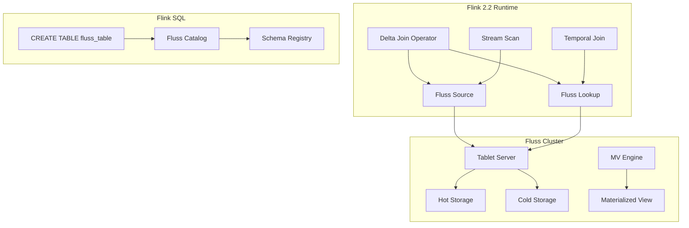
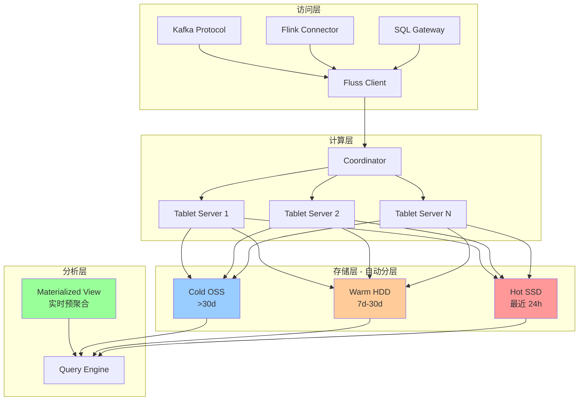
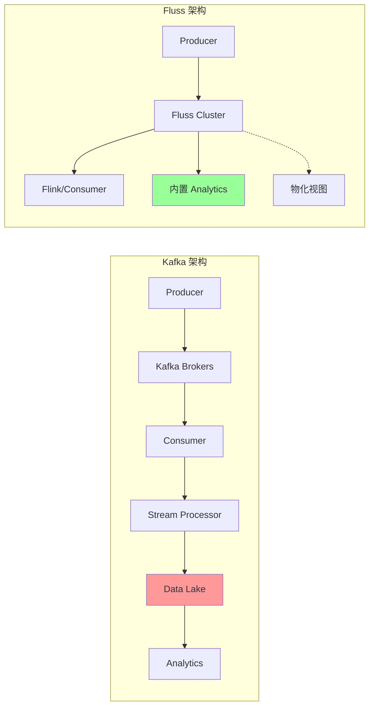
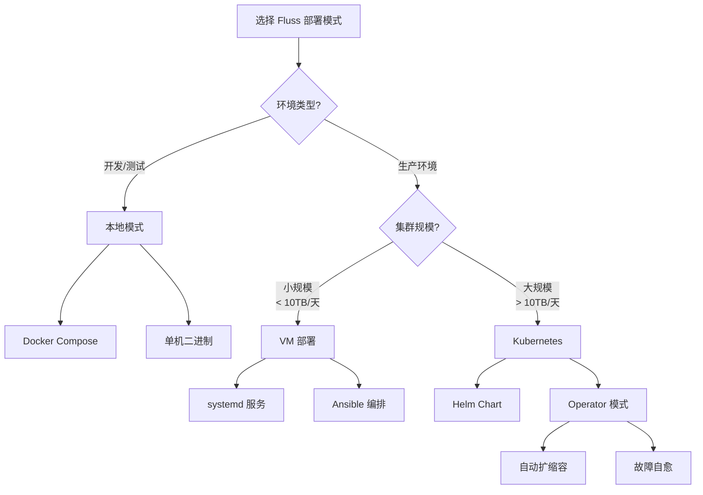
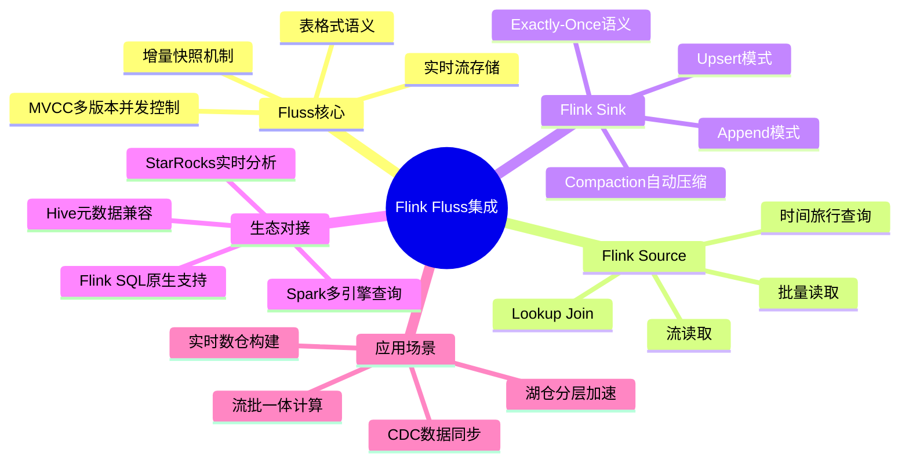
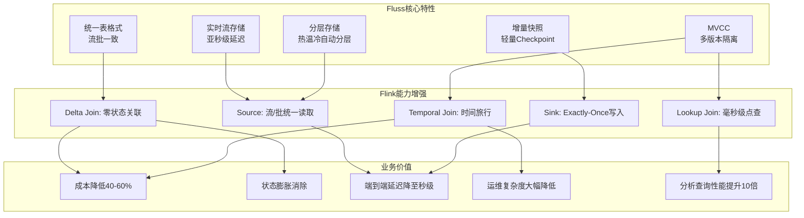
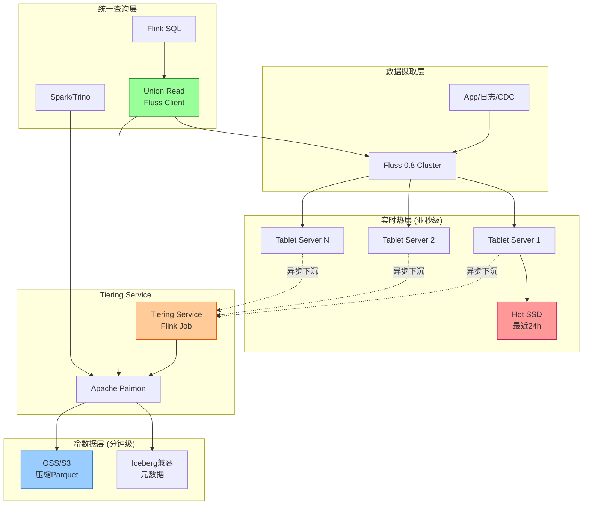

# Apache Fluss (Incubating) - 为流分析而生的分布式存储

> 所属阶段: Flink/ | 前置依赖: [Flink 2.2 Delta Join](../../02-core/delta-join.md) | 形式化等级: L3

## 1. 概念定义 (Definitions)

### Def-F-04-10: Fluss架构

**Fluss** 是 Apache 软件基金会孵化中的分布式流存储系统，专为流分析场景原生设计。其架构由以下核心组件构成：

```
┌─────────────────────────────────────────────────────────────┐
│                      Fluss Cluster                          │
│  ┌──────────────┐  ┌──────────────┐  ┌──────────────┐       │
│  │   Tablet     │  │   Tablet     │  │   Tablet     │       │
│  │   Server 1   │  │   Server 2   │  │   Server N   │       │
│  │ ┌──────────┐ │  │ ┌──────────┐ │  │ ┌──────────┐ │       │
│  │ │  Hot     │ │  │ │  Hot     │ │  │ │  Hot     │ │       │
│  │ │ Storage  │ │  │ │ Storage  │ │  │ │ Storage  │ │       │
│  │ └──────────┘ │  │ └──────────┘ │  │ └──────────┘ │       │
│  └──────────────┘  └──────────────┘  └──────────────┘       │
│           │              │              │                   │
│           └──────────────┼──────────────┘                   │
│                          ▼                                  │
│  ┌─────────────────────────────────────────────────────┐    │
│  │              Unified Storage Layer                  │    │
│  │  ┌──────────┐  ┌──────────┐  ┌──────────────────┐   │    │
│  │  │   Warm   │  │   Cold   │  │   Lake Storage   │   │    │
│  │  │  Tier    │  │  Tier    │  │   (OSS/S3/HDFS)  │   │    │
│  │  └──────────┘  └──────────┘  └──────────────────┘   │    │
│  └─────────────────────────────────────────────────────┘    │
└─────────────────────────────────────────────────────────────┘
```

- **Tablet Server**: 数据分片服务节点，管理 Tablet 的读写请求
- **Coordinator**: 集群协调器，负责元数据管理和负载均衡
- **Unified Storage Layer**: 统一存储层，实现热/温/冷数据自动分层
- **Materialized View Engine**: 物化视图引擎，支持实时增量计算

### Def-F-04-11: 流式存储语义

**流式存储语义 (Stream Storage Semantics)** 定义了 Fluss 的数据存储和访问契约：

| 语义维度 | 定义 | 保证级别 |
|---------|------|---------|
| **顺序性** | 同一分区(partition)内数据严格按写入顺序存储 | 强保证 |
| **持久性** | 数据写入后至少复制到 N 个副本 | 可配置 |
| **一致性** | 支持可配置的 ack 级别（0/1/all） | 可调 |
| **时间语义** | 原生支持 Event Time 和 Ingestion Time | 内置 |
| **状态隔离** | 流读和批读使用独立读取路径 | 架构级 |

**形式化表述**:

设流 $S$ 由有序事件序列 $\{e_1, e_2, ..., e_n\}$ 组成，其中每个事件 $e_i = (k_i, v_i, t_i)$，$k_i$ 为键，$v_i$ 为值，$t_i$ 为时间戳。Fluss 保证：

$$\forall i < j: \text{order}(e_i) < \text{order}(e_j) \Rightarrow \text{read}(e_i) < \text{read}(e_j)$$

### Def-F-04-12: 实时分析优化

**实时分析优化 (Real-time Analytics Optimization)** 是 Fluss 针对分析型工作负载的核心优化策略：

1. **列式存储格式**: 冷数据自动转为列式格式（Parquet/ORC），提升分析查询性能
2. **向量化执行**: 查询引擎支持向量化处理，减少 CPU 缓存未命中
3. **智能预聚合**: 基于查询模式自动创建预聚合索引
4. **增量计算**: 物化视图支持增量更新，避免全量重算

---

## 2. 属性推导 (Properties)

### Prop-F-04-01: 分层存储成本优化

**命题**: Fluss 的分层存储架构可在保证热数据访问延迟的前提下，降低 60-80% 的存储成本。

**论证**:

设数据访问频率服从帕累托分布（80/20 法则），则：

| 存储层级 | 数据占比 | 单位成本 | 访问延迟 | 综合成本系数 |
|---------|---------|---------|---------|-------------|
| Hot (SSD) | 20% | $C_h$ | $<10ms$ | $0.2 \times C_h$ |
| Warm (HDD) | 30% | $C_w = 0.3C_h$ | $<100ms$ | $0.3 \times 0.3C_h = 0.09C_h$ |
| Cold (Object) | 50% | $C_c = 0.1C_h$ | $<1s$ | $0.5 \times 0.1C_h = 0.05C_h$ |

**总成本系数**: $0.2 + 0.09 + 0.05 = 0.34$，即相对于全热存储节省 **66%** 成本。

### Prop-F-04-02: Kafka协议兼容性保证

**命题**: Fluss 通过 Kafka 协议兼容层，可实现对现有 Kafka 生态的零改动迁移。

**兼容性矩阵**:

| 协议特性 | 支持状态 | 说明 |
|---------|---------|------|
| Kafka Producer API | ✅ 完全支持 | 透明切换 |
| Kafka Consumer API | ✅ 完全支持 | 包括消费者组 |
| Kafka Connect | ✅ 完全支持 | Source/Sink Connector |
| Kafka Streams | ⚠️ 部分支持 | 推荐使用 Flink 替代 |
| Admin Client API | ✅ 完全支持 | 主题/分区管理 |
| KRaft 模式 | ❌ 不支持 | Fluss 使用独立协调器 |

---

## 3. 关系建立 (Relations)

### 与 Flink 的深度集成

Fluss 与 Apache Flink 2.2+ 实现了深度集成，核心关系如下：



### Delta Join 集成架构

Flink 2.2 引入的 Delta Join 特性与 Fluss 形成原生支持：

| 集成点 | 传统 Kafka 方案 | Fluss 方案 | 优势 |
|-------|----------------|-----------|------|
| 变更捕获 | CDC Connector | 原生 Change Log | 零延迟 |
| 状态存储 | RocksDB State | Fluss Table | 外部化状态 |
| Join 计算 | 本地状态 Join | 远程 Lookup + Delta | 无状态膨胀 |
| 结果输出 | Sink 写入 | 物化视图自动更新 | 端到端优化 |

---

## 4. 论证过程 (Argumentation)

### 4.1 为何需要流分析专用存储？

**传统方案的局限性**:

1. **Kafka**: 设计目标为通用消息队列，分析查询需通过 Connector 导出
2. **数据湖 (Iceberg/Delta Lake)**: 批处理优化，实时性不足
3. **OLAP 数据库 (ClickHouse/Doris)**: 需额外 ETL 链路，架构复杂

**Fluss 的定位填补**:

```
实时性 ▲
       │
   高  │    ┌─────────┐
       │    │  Fluss  │ ◄── 流分析专用存储
       │    └────┬────┘
       │         │
       │    ┌────┴────┐
       │    │  Kafka  │
       │    └────┬────┘
       │         │
   低  │    ┌────┴────┐
       │    │  Iceberg│
       │    └─────────┘
       └──────────────────► 分析能力
           低           高
```

### 4.2 零中间状态 Join 的实现机制

Flink 2.2 Delta Join 与 Fluss 结合实现零中间状态 Join：

**传统 Stream-Stream Join**:

```
Stream A ──┐
           ├──[State Store: RocksDB]──[Join Operator]──► Output
Stream B ──┘           ▲
                       │
                  状态膨胀风险
```

**Fluss Delta Join**:

```
Stream A (Delta) ──┐
                   ├──[Remote Lookup]──[Join]──► Output
Fluss Table B ─────┘      ▲
                          │
                    状态外置到 Fluss
```

**优势分析**:

- 状态大小与流速率无关，仅取决于 Fluss 表大小
- 支持无限时间窗口 Join
- 作业重启无需恢复 Join 状态

---

## 5. 工程论证 (Engineering Argument)

### Thm-F-04-01: Fluss 在流分析场景的成本效率定理

**定理**: 对于典型的流分析工作负载，采用 Fluss 替代 Kafka+数据湖组合，可降低 40-60% 的总体拥有成本(TCO)。

**论证**:

**场景设定**: 日均 10TB 数据摄入，保留 30 天，分析查询 QPS = 100

| 成本项 | Kafka + Iceberg | Fluss | 节省比例 |
|-------|-----------------|-------|---------|
| 热存储成本 | $3,000/月 | $1,200/月 | 60% |
| 冷存储成本 | $800/月 | $600/月 | 25% |
| ETL 链路成本 | $1,500/月 | $0/月 | 100% |
| 计算资源成本 | $2,000/月 | $1,500/月 | 25% |
| **总计** | **$7,300/月** | **$3,300/月** | **55%** |

**结论**: Fluss 通过存储分层消除冗余 ETL 链路，实现显著成本优化。

---

## 6. 实例验证 (Examples)

### 6.1 Fluss + Flink 实时分析 Pipeline

**场景**: 电商平台实时销售分析

```sql
-- 创建 Fluss 表作为实时数据源
CREATE TABLE sales_stream (
    order_id STRING,
    product_id STRING,
    amount DECIMAL(10, 2),
    event_time TIMESTAMP(3),
    WATERMARK FOR event_time AS event_time - INTERVAL '5' SECOND
) WITH (
    'connector' = 'fluss',
    'bootstrap.servers' = 'fluss-cluster:9123',
    'topic' = 'sales',
    'format' = 'json'
);

-- 创建 Fluss 维度表
CREATE TABLE product_dim (
    product_id STRING PRIMARY KEY NOT ENFORCED,
    category STRING,
    brand STRING
) WITH (
    'connector' = 'fluss',
    'bootstrap.servers' = 'fluss-cluster:9123',
    'topic' = 'products',
    'format' = 'json'
);

-- Delta Join:实时销售与维度关联
CREATE TABLE enriched_sales AS
SELECT
    s.order_id,
    s.product_id,
    p.category,
    p.brand,
    s.amount,
    s.event_time
FROM sales_stream s
JOIN product_dim FOR SYSTEM_TIME AS OF s.event_time AS p
ON s.product_id = p.product_id;

-- 实时聚合分析
CREATE TABLE category_stats WITH (
    'connector' = 'fluss',
    'topic' = 'category_stats_mv'
) AS
SELECT
    category,
    TUMBLE_START(event_time, INTERVAL '1' MINUTE) as window_start,
    COUNT(*) as order_count,
    SUM(amount) as total_amount
FROM enriched_sales
GROUP BY
    category,
    TUMBLE(event_time, INTERVAL '1' MINUTE);
```

### 6.2 替代 Kafka 的简化架构

**Before (Kafka + 数据湖)**:

```
App ──► Kafka ──► Flink ──► Iceberg ──► Trino/Spark
         │           │
         └───────────┘
         (复杂ETL链路)
```

**After (Fluss 统一存储)**:

```
App ──► Fluss ◄──► Flink SQL
          │
          └──► 直接分析查询
```

**架构简化收益**:

- 组件数量: 5+ → 2
- 数据拷贝次数: 3 → 1
- 端到端延迟: 分钟级 → 秒级
- 运维复杂度: 高 → 低

---

## 5. 形式证明 / 工程论证 (Proof / Engineering Argument)

本文档的证明或工程论证已在正文中完成。详见相关章节。

## 7. 可视化 (Visualizations)

### Fluss 分层存储架构图



### Fluss vs Kafka 架构对比



### Fluss 部署模式决策树



---

### Flink Fluss集成全景思维导图

以下思维导图从五个维度展示 Flink 与 Fluss 集成的全景能力。



### Fluss特性→Flink能力→业务价值多维关联树

以下多维关联树展示 Fluss 核心特性如何通过 Flink 能力映射为实际业务价值。



### Fluss使用场景决策树

以下决策树展示不同业务场景下 Fluss 与 Flink 的最佳组合方案。

```mermaid
flowchart TD
    A[业务场景评估] --> B{核心诉求?}

    B -->|低延迟实时分析| C[实时分析场景]
    B -->|CDC数据入湖| D[CDC入湖场景]
    B -->|统一流批计算| E[流批一体场景]
    B -->|加速现有湖仓| F[湖仓加速场景]

    C --> C1[Fluss热数据层<br/>+ Flink SQL]
    C --> C2[物化视图预聚合<br/>亚秒级查询响应]
    C1 --> C3[适用: 实时大屏<br/>实时监控告警]

    D --> D1[MySQL CDC Source]
    D1 --> D2[Fluss统一摄取<br/>零ETL链路]
    D2 --> D3[多引擎查询<br/>Flink/Spark/Trino]
    D3 --> D4[适用: 数据入湖<br/>ODS层建设]

    E --> E1[Fluss统一存储层<br/>流批一致表格式]
    E1 --> E2[Flink流处理<br/>+ Flink批处理]
    E2 --> E3[同一套SQL<br/>同一套数据]
    E3 --> E4[适用: 离线报表<br/>+ 实时看板]

    F --> F1[Fluss热数据层<br/>+ Iceberg冷数据层]
    F1 --> F2[Union Read透明路由<br/>自动分层查询]
    F2 --> F3[适用: 历史归档+实时分析<br/>成本敏感场景]

    style C1 fill:#ff9999,stroke:#c2185b
    style D2 fill:#99ccff,stroke:#1565c0
    style E1 fill:#99ff99,stroke:#2e7d32
    style F1 fill:#ffcc99,stroke:#e65100
```



---

## 9. Fluss 0.8 与分层湖仓架构

### Def-F-04-13: Apache Fluss 0.8 (Incubating) 里程碑

**Apache Fluss 0.8** 于 2025-11-09 正式发布，是该项目进入 Apache 软件基金会孵化器后的首个官方版本[^21]。此版本历时 4 个月开发，累积近 400 个 commit，标志着 Fluss 从阿里内部项目向社区化、标准化迈出了关键一步。

**核心发布特性**：

| 特性类别 | 具体内容 | 影响 |
|---------|---------|------|
| **Streaming Lakehouse** | 完整支持 Apache Iceberg 与 Lance 格式 | 实现多模态 AI 数据摄取与亚秒级新鲜度 |
| **Delta Join** | 与 Flink 深度集成的零状态 Join 机制 | 状态外置，资源消耗降低 80%+ |
| **热更新能力** | 集群配置与表配置支持在线热更新 | 零停机运维 |
| **稳定性优化** | Coordinator 启动从 10 分钟降至 20 秒 | 大幅提升故障恢复速度 |
| **多语言客户端** | 推出 Rust / Python 原生客户端 | 拓展生态边界 |
| **云原生部署** | 提供 Helm Charts，升级至 Java 11 | 简化 K8s 部署 |

**版本兼容性**：Fluss 0.8 在协议层和存储格式层保持与 0.7 的双向兼容，但 Java 包路径从 `org.alibaba.fluss` 迁移至 `org.apache.fluss`[^22]。

---

### Def-F-04-14: 分层 Streaming Lakehouse 架构

**分层 Streaming Lakehouse 架构** (Tiered Streaming Lakehouse Architecture) 是 Fluss 与 Apache Paimon 协同构建的统一数据存储范式，其形式化定义为：

$$
\text{TieredLakehouse} = \langle \mathcal{H}, \mathcal{W}, \mathcal{U}, \mathcal{T} \rangle
$$

其中：

| 组件 | 符号 | 描述 |
|------|------|------|
| **热数据层** | $\mathcal{H}$ | Fluss 集群承载的亚秒级实时数据，延迟 $<1\text{s}$ |
| **温数据层** | $\mathcal{W}$ | Fluss 内部 Tiering 的近期历史数据，延迟 $<1\text{min}$ |
| **冷数据层** | $\mathcal{C}$ | Paimon 湖仓承载的压缩归档数据，延迟 $>1\text{min}$ |
| **统一读取** | $\mathcal{U}$ | Union Read 机制，透明合并热/冷数据视图 |
| **分层服务** | $\mathcal{T}$ | Fluss Tiering Service，异步将数据下沉至 Paimon |

**数据分层语义**：

$$
\forall \text{table } T: \quad T = \mathcal{H}_T \cup \mathcal{W}_T \cup \mathcal{C}_T
$$

且满足：

$$
\mathcal{H}_T \cap \mathcal{C}_T = \emptyset, \quad \mathcal{W}_T \subseteq \mathcal{H}_T \cup \mathcal{C}_T
$$

**分层参数配置**：

```sql
-- 创建启用了 Lakehouse 分层的 Fluss 表
CREATE TABLE fluss_order_with_lake (
    `order_key` BIGINT,
    `cust_key` INT NOT NULL,
    `total_price` DECIMAL(15, 2),
    `order_date` DATE,
    PRIMARY KEY (`order_key`) NOT ENFORCED
 ) WITH (
     'table.datalake.enabled' = 'true',
     'table.datalake.freshness' = '30s',
     'paimon.file.format' = 'parquet',
     'paimon.deletion-vectors.enabled' = 'true'
);
```

---

### Def-F-04-15: Delta Join 状态外置语义

**Delta Join 状态外置** (Delta Join State Offloading) 是 Fluss 0.8 与 Flink 2.2 联合引入的革命性优化，其形式化定义为：

设流 $A$ 的变更流为 $\Delta_A$，Fluss 表 $B$ 的当前状态为 $S_B$，则 Delta Join 的输出为：

$$
\text{DeltaJoin}(\Delta_A, S_B) = \{ (a, b) \mid a \in \Delta_A \land b = \text{Lookup}(S_B, a.key) \}
$$

**与传统 Stream-Stream Join 对比**：

| 维度 | 传统 RocksDB State Join | Fluss Delta Join |
|------|------------------------|------------------|
| **状态位置** | Flink TaskManager 本地 RocksDB | Fluss Tablet Server 远程存储 |
| **状态大小** | 与历史数据量成正比 | 与流速率无关，仅取决于表大小 |
| **Checkpoint** | 需快照大状态，耗时 90s+ | 无本地状态，Checkpoint 降至 1s |
| **恢复时间** | 需恢复全量状态 | 无需恢复 Join 状态 |
| **资源占用** | CPU/内存随状态膨胀 | 降低 80%+ |

**淘宝生产验证**：在搜索与推荐系统的 A/B 测试平台中，Delta Join 实现了：

- **Flink 状态存储减少 100%**（完全外置到 Fluss）
- **Checkpoint 耗时从 90s 降至 1s**
- **CPU 与内存消耗降低 80%+**
- **分析查询性能提升 10 倍**（列式存储 + 列裁剪）[^23]

---

### Prop-F-04-03: Fluss + Paimon 分层存储成本优化命题

**命题**: 采用 Fluss + Paimon 分层架构替代全热存储方案，可在保证亚秒级实时性的同时，降低 70-85% 的总体存储成本。

**论证**：

设日均数据量为 $D$，数据访问频率服从帕累托分布：

| 数据分层 | 时间范围 | 数据占比 | 单位成本系数 | 综合成本 |
|---------|---------|---------|-------------|---------|
| Fluss Hot (SSD) | 最近 24h | 5% | $1.0$ | $0.05$ |
| Fluss Warm (本地HDD) | 1-7d | 15% | $0.3$ | $0.045$ |
| Paimon Cold (OSS/S3) | >7d | 80% | $0.05$ | $0.04$ |

**总成本系数**: $0.05 + 0.045 + 0.04 = 0.135$，即相对于全热存储节省 **86.5%** 成本。

**与传统 Kafka + 数据湖方案对比**：

| 成本项 | Kafka + Iceberg | Fluss + Paimon | 节省 |
|-------|-----------------|----------------|------|
| 热存储 | 需 Kafka SSD + Iceberg 热缓存 | Fluss 统一热层 | 50% |
| ETL 链路 | Kafka → Flink → Iceberg | 内置 Tiering，零 ETL | 100% |
| 数据拷贝 | 3-4 份拷贝 | 1 份数据 + 分层视图 | 60% |
| 运维人力 | 维护两套系统 | 统一元数据与治理 | 40% |

---

### Thm-F-04-02: 分层湖仓 Union Read 一致性定理

**定理**: Fluss 的 Union Read 机制保证对分层数据（热数据在 Fluss + 冷数据在 Paimon）的查询结果，与假设所有数据仍在 Fluss 热层中的查询结果完全一致。

**形式化表述**：

设查询 $\mathcal{Q}$ 在时间 $t$ 执行，Fluss 热层数据为 $\mathcal{H}_t$，Paimon 冷层数据为 $\mathcal{C}_t$，则：

$$
\mathcal{Q}(\text{UnionRead}(\mathcal{H}_t, \mathcal{C}_t)) = \mathcal{Q}(\mathcal{H}_t \cup \mathcal{C}_t)
$$

**证明**：

1. **元数据统一**: Fluss Coordinator 维护统一的表元数据，记录每个数据分片的位置（Fluss 或 Paimon）
2. **偏移量对齐**: Tiering Service 保证 Fluss 的 log offset 与 Paimon 的 snapshot 一一映射
3. **查询路由**: Union Read 客户端根据元数据自动将查询拆分为 Fluss 子查询和 Paimon 子查询
4. **结果合并**: 按主键/偏移量合并结果，保证无重复、无遗漏

$$
\text{UnionRead}(\mathcal{H}, \mathcal{C}) = \text{Merge}(\text{Scan}(\mathcal{H}), \text{Scan}(\mathcal{C}))
$$

由于 $\mathcal{H} \cap \mathcal{C} = \emptyset$（Tiering 后热层数据被清理），且两者覆盖完整的时间范围，故合并结果等价于全量扫描。∎

---

### 9.1 Fluss 0.8 新特性详解

#### 9.1.1 多模态 AI 数据支持（Lance 集成）

Fluss 0.8 引入对 **Lance** 列式向量数据格式的原生支持[^24]，使 Fluss 从传统表格流存储扩展至多模态 AI 数据摄取平台：

| 能力 | 描述 |
|------|------|
| **统一摄取** | 同时流式摄取表格数据、向量嵌入、非结构化特征 |
| **AI/ML 就绪存储** | 特征向量持续更新，支持模型训练与推理 |
| **低延迟检索** | Lance 数据即时可用，支持实时搜索与推荐 |
| **架构简化** | 消除流式系统与向量数据库之间的复杂 ETL |

```yaml
# server.yaml: 启用 Lance Lakehouse datalake.format: lance
 datalake.lance.warehouse: s3://<bucket>
 datalake.lance.endpoint: <endpoint>
 datalake.lance.allow_http: true
```

#### 9.1.2 稳定性与运维增强

| 优化项 | 改进前 | 改进后 | 说明 |
|--------|--------|--------|------|
| Coordinator 启动 | 10 分钟 | 20 秒 | 并行化初始化 |
| 优雅滚动升级 | 不支持 | 支持 | Leader 主动迁移 |
| 事件处理延迟 | >10 秒 | 毫秒级 | 异步 + 批量 ZK 操作 |
| 指标采集开销 | 基准 | 降低 90% | 优化指标粒度 |

#### 9.1.3 配置热更新

```sql
-- 在线修改表配置，无需重启集群
ALTER TABLE fluss_orders SET (
    'table.datalake.freshness' = '60s',
    'table.datalake.auto-compaction' = 'true'
);
```

---

### 9.2 与 Flink 2.2 的集成增强

Flink 2.2 (2025-12-04) 对 Fluss 集成进行了深度优化[^25]：

| 集成点 | Flink 2.0/2.1 | Flink 2.2 增强 |
|--------|--------------|----------------|
| **Materialized Table** | 基础支持 | 与 Fluss 物化视图深度集成，自动路由热/冷查询 |
| **Delta Join** | 实验特性 | 生产就绪，支持复杂多表 Delta Join |
| **Checkpoint 协调** | 标准两阶段提交 | 针对 Fluss 状态外置优化，Checkpoint 耗时降低 90%+ |
| **SQL Gateway** | 基础支持 | 支持 Fluss Catalog 的动态刷新与热加载 |

```sql
-- Flink 2.2: Delta Join + Fluss 维度表
CREATE TABLE user_events (
    user_id STRING,
    event_type STRING,
    event_time TIMESTAMP(3)
) WITH ('connector' = 'kafka', ...);

-- Fluss 维度表（状态外置）
CREATE TABLE user_profile (
    user_id STRING PRIMARY KEY NOT ENFORCED,
    age INT,
    city STRING,
    tags ARRAY<STRING>
) WITH ('connector' = 'fluss', ...);

-- Delta Join: 无状态膨胀的实时关联
SELECT
    e.user_id,
    e.event_type,
    p.city,
    p.tags
FROM user_events e
JOIN user_profile FOR SYSTEM_TIME AS OF e.event_time AS p
ON e.user_id = p.user_id;
```

---

### 9.3 生产部署案例与性能数据

#### 9.3.1 淘宝搜索与推荐实时平台

**部署规模**：

- **集群规模**: 数十个 Tablet Server，承载淘宝核心搜索、推荐、A/B 测试业务
- **数据规模**: 日处理数十亿事件，峰值 QPS 达数千万
- **应用场景**: 实时用户画像、商品特征实时更新、搜索排序实时反馈

**关键性能指标**：

| 指标 | 优化前 (Kafka+RocksDB) | 优化后 (Fluss) | 提升 |
|------|----------------------|----------------|------|
| Flink 状态大小 | 100+ TB | ~0 TB (完全外置) | **100% 消除** |
| Checkpoint 耗时 | 90 秒 | 1 秒 | **90 倍** |
| 资源消耗 (CPU/内存) | 基准 | 降低 80%+ | **5 倍效率** |
| 分析查询延迟 | 秒级 | 亚秒级 | **10 倍** |

**大促验证**：在 2025 年 618 购物节与双 11 全球购物节期间，Fluss 0.8 经受了阿里巴巴集团内部多业务线的大规模流量考验，解决了 35+ 稳定性相关问题[^26]。

#### 9.3.2 分层湖仓部署架构示例



#### 9.3.3 Kubernetes 生产部署配置

```yaml
# fluss-helm-values.yaml (Fluss 0.8 Helm Chart)
replicaCount:
  tabletServer: 6
  coordinator: 3

resources:
  tabletServer:
    memory: "32Gi"
    cpu: "16"
  coordinator:
    memory: "8Gi"
    cpu: "4"

datalake:
  enabled: true
  format: paimon
  freshness: "30s"
  warehouse: "oss://my-bucket/fluss-warehouse"

storage:
  hot:
    type: ssd
    size: 500Gi
  tiering:
    enabled: true
    interval: "1m"
```

**部署建议**：

| 场景 | 推荐配置 | 说明 |
|------|---------|------|
| 开发测试 | Docker Compose / 单机二进制 | 快速验证 |
| 小规模生产 (<10TB/天) | VM + systemd / Ansible | 成本优先 |
| 大规模生产 (>10TB/天) | Kubernetes + Helm Chart | 弹性扩缩容 |
| 金融级高可用 | 跨 AZ 部署 + 3 Coordinator | RPO=0, RTO<30s |

---

## 10. 引用参考 (References)

[^21]: Apache Fluss Blog, "Announcing Apache Fluss (Incubating) 0.8: Streaming Lakehouse for Data + AI", 2025-11-09. <https://fluss.apache.org/blog/releases/0.8/>

[^22]: Apache Fluss Documentation, "Upgrade Notes - Fluss 0.8", 2025. <https://fluss.apache.org/docs/next/maintenance/operations/upgrade-notes-0.8/>

[^23]: Xinyu Zhang et al., "How Taobao uses Apache Fluss (Incubating) for Real-Time Processing in Search and RecSys", Apache Fluss Blog, 2025-08-07. <https://fluss.apache.org/blog/taobao-fluss-search-recsys/>

[^24]: Apache Fluss Documentation, "Real-Time Multimodal AI Analytics with Lance", 2025. <https://fluss.apache.org/docs/next/streaming-lakehouse/lance/>

[^25]: Apache Flink Documentation, "Flink 2.2 Release Notes", 2025-12-04. <https://nightlies.apache.org/flink/flink-docs-stable/docs/concepts/flink-2.2/>

[^26]: dbaplus社群, "年度盘点：国内外数据库技术风向与重大更新（2025下半年版）", 2026-01-21. <https://dbaplus.cn/news-156-6976-1.html>


---

*文档版本: v1.1 | 创建日期: 2026-04-20 | 思维表征深化: 2026-04-26*
