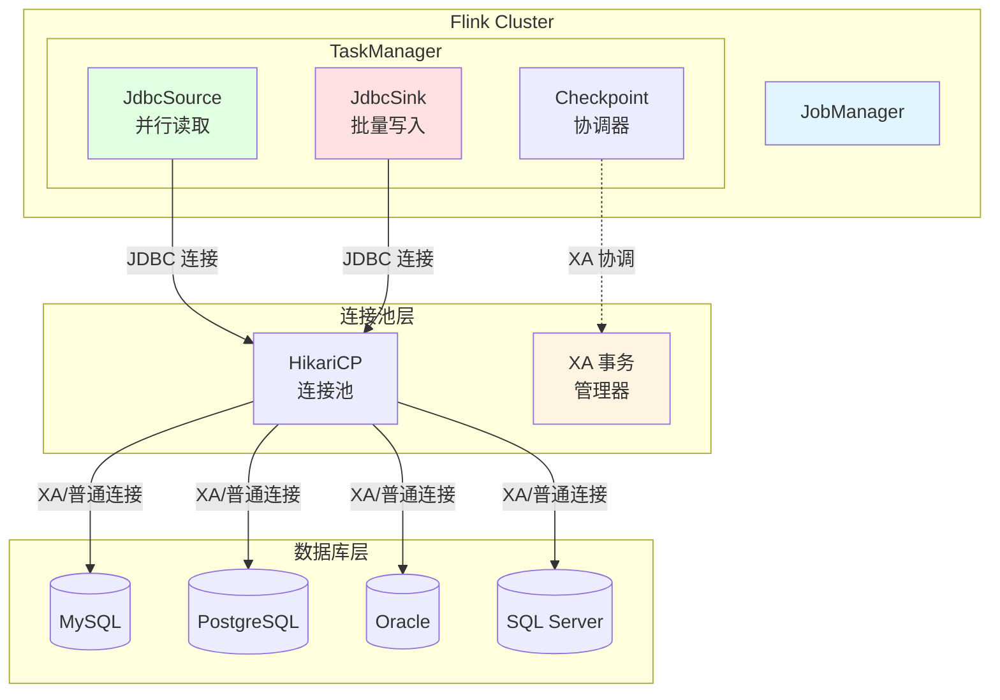
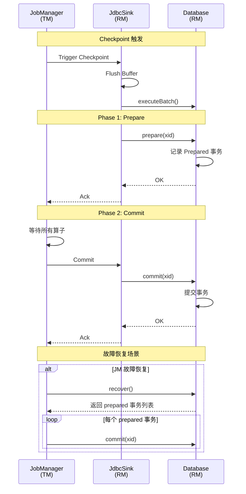
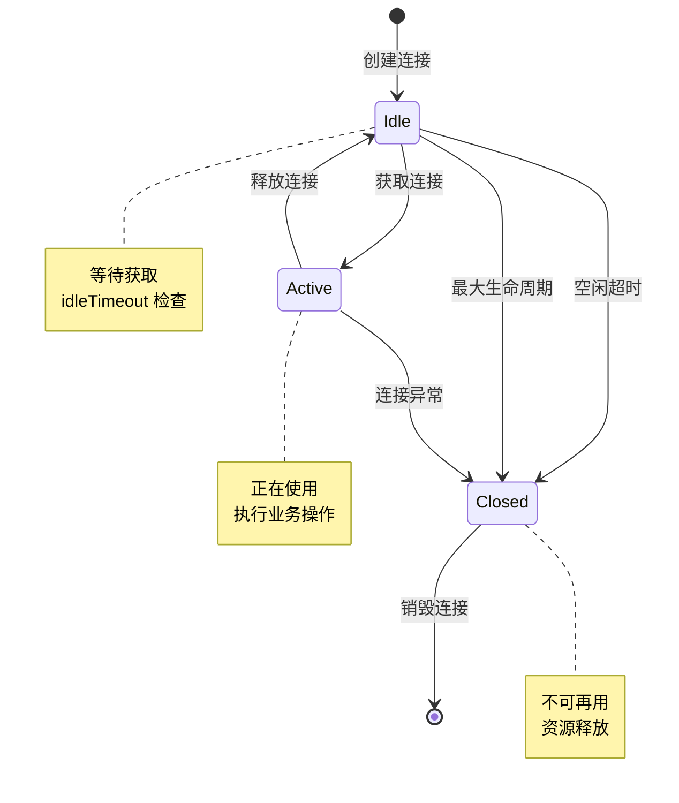

# JDBC Connector 详细指南 (JDBC Connector Complete Guide)

> **所属阶段**: Flink/04-connectors | **前置依赖**: [flink-connectors-ecosystem-complete-guide.md](./flink-connectors-ecosystem-complete-guide.md) | **形式化等级**: L4 | **覆盖范围**: JDBC Source/Sink/连接池/Exactly-Once

---

## 目录

- [JDBC Connector 详细指南 (JDBC Connector Complete Guide)](#jdbc-connector-详细指南-jdbc-connector-complete-guide)
  - [目录](#目录)
  - [1. 概念定义 (Definitions)](#1-概念定义-definitions)
    - [Def-F-04-200 (JDBC Source 形式化定义)](#def-f-04-200-jdbc-source-形式化定义)
    - [Def-F-04-201 (JDBC Sink 形式化定义)](#def-f-04-201-jdbc-sink-形式化定义)
    - [Def-F-04-202 (连接池管理模型)](#def-f-04-202-连接池管理模型)
    - [Def-F-04-203 (Exactly-Once 语义实现)](#def-f-04-203-exactly-once-语义实现)
  - [2. 属性推导 (Properties)](#2-属性推导-properties)
    - [Lemma-F-04-200 (JDBC 连接器幂等性引理)](#lemma-f-04-200-jdbc-连接器幂等性引理)
    - [Lemma-F-04-201 (连接池资源边界)](#lemma-f-04-201-连接池资源边界)
    - [Prop-F-04-200 (批量写入吞吐量优化)](#prop-f-04-200-批量写入吞吐量优化)
  - [3. 关系建立 (Relations)](#3-关系建立-relations)
    - [3.1 JDBC 连接器与 DataStream API 关系](#31-jdbc-连接器与-datastream-api-关系)
    - [3.2 JDBC 连接器与 Table API 关系](#32-jdbc-连接器与-table-api-关系)
    - [3.3 数据库方言映射](#33-数据库方言映射)
  - [4. 论证过程 (Argumentation)](#4-论证过程-argumentation)
    - [4.1 分区读取策略分析](#41-分区读取策略分析)
    - [4.2 XA 事务实现机制](#42-xa-事务实现机制)
    - [4.3 反压与背压处理](#43-反压与背压处理)
  - [5. 形式证明 / 工程论证 (Proof / Engineering Argument)](#5-形式证明--工程论证-proof--engineering-argument)
    - [Thm-F-04-200 (JDBC Exactly-Once 正确性定理)](#thm-f-04-200-jdbc-exactly-once-正确性定理)
    - [Thm-F-04-201 (连接池无死锁定理)](#thm-f-04-201-连接池无死锁定理)
  - [6. 实例验证 (Examples)](#6-实例验证-examples)
    - [6.1 Maven 依赖配置](#61-maven-依赖配置)
    - [6.2 JDBC Source 配置](#62-jdbc-source-配置)
    - [6.3 JDBC Sink 配置](#63-jdbc-sink-配置)
    - [6.4 数据库特定配置](#64-数据库特定配置)
  - [7. 性能调优 (Performance Tuning)](#7-性能调优-performance-tuning)
    - [7.1 批量大小设置](#71-批量大小设置)
    - [7.2 连接池优化](#72-连接池优化)
    - [7.3 超时配置](#73-超时配置)
    - [7.4 重试策略](#74-重试策略)
  - [8. 常见问题排查 (Troubleshooting)](#8-常见问题排查-troubleshooting)
    - [8.1 连接泄漏处理](#81-连接泄漏处理)
    - [8.2 大表读取优化](#82-大表读取优化)
    - [8.3 事务超时处理](#83-事务超时处理)
  - [9. 可视化 (Visualizations)](#9-可视化-visualizations)
    - [9.1 JDBC 连接器架构图](#91-jdbc-连接器架构图)
    - [9.2 XA 事务执行流程](#92-xa-事务执行流程)
    - [9.3 连接池状态机](#93-连接池状态机)
  - [10. 引用参考 (References)](#10-引用参考-references)

---

## 1. 概念定义 (Definitions)

### Def-F-04-200 (JDBC Source 形式化定义)

**定义**: JDBC Source 是通过 JDBC 协议从关系型数据库中读取数据的 Flink Source 连接器，支持批处理模式的全量读取和流处理模式的增量读取。

**形式化结构**:

```
JDBCSource = ⟨Connection, Query, SplitStrategy, FetchSize, Parallelism⟩

其中:
- Connection: 数据库连接配置 ⟨url, username, password, driver⟩
- Query: 数据查询语句 ⟨SELECT columns FROM table WHERE condition⟩
- SplitStrategy: 分片策略 {PKRange, PartitionColumn, Custom}
- FetchSize: 单次获取记录数 (默认 1000)
- Parallelism: 并行度 ⟨min, max⟩
```

**读取模式**:

| 模式 | 描述 | 适用场景 |
|------|------|----------|
| **批处理** | 一次性读取完整结果集 | 离线分析、全量同步 |
| **增量 CDC** | 基于变更日志的流式读取 | 实时同步、CDC 捕获 |
| **分区并行** | 按主键范围分片并行读取 | 大表读取、加速导入 |

**数据类型映射**:

| JDBC Type | Flink SQL Type | Java Type |
|-----------|----------------|-----------|
| `INTEGER` | `INT` | `Integer` |
| `BIGINT` | `BIGINT` | `Long` |
| `VARCHAR` | `STRING` | `String` |
| `DECIMAL` | `DECIMAL(p,s)` | `BigDecimal` |
| `TIMESTAMP` | `TIMESTAMP(3)` | `LocalDateTime` |
| `DATE` | `DATE` | `LocalDate` |
| `BLOB` | `BYTES` | `byte[]` |

---

### Def-F-04-201 (JDBC Sink 形式化定义)

**定义**: JDBC Sink 是通过 JDBC 协议向关系型数据库写入数据的 Flink Sink 连接器，支持批量插入、幂等写入和基于 XA 事务的 Exactly-Once 语义。

**形式化结构**:

```
JDBCSink = ⟨Connection, Statement, Buffer, FlushPolicy, Consistency⟩

其中:
- Connection: 数据库连接配置
- Statement: DML 语句类型 {INSERT, UPSERT, UPDATE}
- Buffer: 缓冲区配置 ⟨size, timeout⟩
- FlushPolicy: 刷盘策略 ⟨batch-size, interval, max-retries⟩
- Consistency: 一致性保证 {AT_LEAST_ONCE, EXACTLY_ONCE}
```

**写入语义**:

| 语义 | 实现方式 | 特点 |
|------|----------|------|
| **INSERT** | `INSERT INTO ... VALUES (...)` | 简单插入，可能重复 |
| **UPSERT** | `INSERT ... ON DUPLICATE KEY UPDATE` | 幂等写入，自动更新 |
| **MERGE** | `MERGE INTO ... USING ...` | 标准 SQL，通用性强 |
| **DELETE+INSERT** | 先删除后插入 | 全量替换，保证唯一 |

---

### Def-F-04-202 (连接池管理模型)

**定义**: 连接池管理模型定义了 JDBC 连接器如何维护和管理数据库连接的生命周期，以优化资源利用和性能。

**形式化定义**:

```
ConnectionPool = ⟨PoolConfig, State, Lifecycle⟩

PoolConfig = ⟨
    maxPoolSize: ℕ,           // 最大连接数
    minIdle: ℕ,               // 最小空闲连接数
    maxLifetime: Duration,    // 连接最大存活时间
    connectionTimeout: Duration,  // 获取连接超时时间
    idleTimeout: Duration     // 空闲连接超时时间
⟩

State = {IDLE, ACTIVE, CLOSED}

Lifecycle = Idle → Active → (Idle | Closed)
```

**连接池参数**:

| 参数 | 默认值 | 说明 | 建议值 |
|------|--------|------|--------|
| `connection.max-retry-timeout` | 60s | 连接重试超时 | 根据网络延迟调整 |
| `connection.check-timeout` | 10s | 连接检测超时 | 5-30s |
| `connection.idle-timeout` | 10min | 空闲连接超时 | 5-30min |
| `connection.max-life-time` | 30min | 连接最大生命周期 | 30-60min |

---

### Def-F-04-203 (Exactly-Once 语义实现)

**定义**: JDBC Sink 通过 XA 分布式事务协议实现 Exactly-Once 语义，确保数据在故障恢复后不丢失、不重复。

**形式化定义**:

```
XAExactlyOnce = ⟨XAResource, TwoPhaseCommit, TransactionManager⟩

两阶段提交协议:
┌─────────────────────────────────────────────────────────────┐
│ Phase 1: Prepare (准备阶段)                                   │
│   - TM 向所有 RM 发送 prepare 请求                            │
│   - RM 执行本地事务并记录日志                                 │
│   - RM 返回 OK/NO 投票                                        │
├─────────────────────────────────────────────────────────────┤
│ Phase 2: Commit/Rollback (提交阶段)                          │
│   - 所有 RM 返回 OK → TM 发送 commit                         │
│   - 任一 RM 返回 NO → TM 发送 rollback                       │
│   - RM 执行 commit/rollback 并释放资源                       │
└─────────────────────────────────────────────────────────────┘

其中:
- TM (Transaction Manager): Flink JobManager
- RM (Resource Manager): 数据库 XA 连接
```

**Exactly-Once 配置矩阵**:

| 数据库 | XA 支持 | 配置参数 | 版本要求 |
|--------|---------|----------|----------|
| MySQL | ✓ | `useXA=true` | 5.7+ |
| PostgreSQL | ✓ | `useXA=true` | 9.5+ |
| Oracle | ✓ | `useXA=true` | 11g+ |
| SQL Server | ✓ | `useXA=true` | 2012+ |
| H2 | ✗ | - | - |

---

## 2. 属性推导 (Properties)

### Lemma-F-04-200 (JDBC 连接器幂等性引理)

**引理**: 当 JDBC Sink 配置为 UPSERT 模式时，重复执行相同的写入操作具有幂等性，即多次执行结果与一次执行结果相同。

**证明**:

```
设:
- R 为数据库关系表
- K 为主键属性集
- V 为非主键属性集
- UPSERT(k, v) = INSERT(k, v) ON DUPLICATE KEY UPDATE V=v

幂等性证明:
┌─────────────────────────────────────────────────────────────┐
│ 情况 1: 记录不存在                                          │
│   UPSERT(k, v) → INSERT(k, v)                              │
│   UPSERT(k, v) 再次执行 → 主键冲突 → UPDATE V=v            │
│   最终状态: R(k) = v                                       │
├─────────────────────────────────────────────────────────────┤
│ 情况 2: 记录已存在                                          │
│   UPSERT(k, v) → 主键冲突 → UPDATE V=v                     │
│   UPSERT(k, v) 再次执行 → 主键冲突 → UPDATE V=v            │
│   最终状态: R(k) = v (不变)                                │
└─────────────────────────────────────────────────────────────┘

结论: ∀n ≥ 1: UPSERTⁿ(k, v) = UPSERT(k, v) ∎
```

---

### Lemma-F-04-201 (连接池资源边界)

**引理**: 在连接池配置合理的情况下，JDBC 连接器的并发连接数不会超过 `maxPoolSize × parallelism`。

**证明**:

```
设:
- P: 算子并行度
- M: 连接池最大连接数 (maxPoolSize)
- N: 并发任务数

资源约束:
┌─────────────────────────────────────────────────────────────┐
│ 每个并行实例维护独立连接池                                    │
│ 每个连接池最多 M 个连接                                       │
│ 总连接数 C ≤ P × M                                          │
├─────────────────────────────────────────────────────────────┤
│ 约束条件:                                                   │
│   - M ≤ 数据库最大连接数 / P                                │
│   - idleTimeout < maxLifetime                               │
│   - connectionTimeout < checkpoint interval                 │
└─────────────────────────────────────────────────────────────┘

边界保证: C_bound = P × M ∎
```

---

### Prop-F-04-200 (批量写入吞吐量优化)

**命题**: 在批量写入模式下，吞吐量与批量大小呈亚线性增长关系，存在最优批量大小 `B_opt`。

**论证**:

```
吞吐量模型:
┌─────────────────────────────────────────────────────────────┐
│ T(B) = B / (L + B × P)                                      │
│                                                             │
│ 其中:                                                       │
│   - B: 批量大小                                             │
│   - L: 固定延迟 (网络往返 + SQL 解析)                       │
│   - P: 单记录处理时间                                       │
├─────────────────────────────────────────────────────────────┤
│ 求导得最优批量大小:                                         │
│   dT/dB = 0 → L + B × P - B × P = L / (L + B × P)²          │
│   B_opt ≈ √(L / P)                                          │
├─────────────────────────────────────────────────────────────┤
│ 实际约束:                                                   │
│   - B ≤ maxBatchSize (默认 5000)                            │
│   - B × recordSize ≤ maxPacketSize (默认 4MB)               │
│   - flushInterval ≤ checkpointInterval                      │
└─────────────────────────────────────────────────────────────┘
```

**建议批量大小**:

| 场景 | 建议批量大小 | 说明 |
|------|--------------|------|
| 小记录 (< 1KB) | 1000-5000 | 高频写入，减少网络开销 |
| 中记录 (1-10KB) | 500-2000 | 平衡延迟和吞吐量 |
| 大记录 (> 10KB) | 100-500 | 避免内存压力和超时 |

---

## 3. 关系建立 (Relations)

### 3.1 JDBC 连接器与 DataStream API 关系

```
DataStream API 集成层次:
┌─────────────────────────────────────────────────────────────┐
│ Layer 3: DataStream API                                     │
│   env.fromSource(jdbcSource)                                │
│   dataStream.sinkTo(jdbcSink)                               │
├─────────────────────────────────────────────────────────────┤
│ Layer 2: Source/Sink API                                    │
│   JdbcSource.builder()...build()                            │
│   JdbcSink.sink(...)                                        │
├─────────────────────────────────────────────────────────────┤
│ Layer 1: JDBC 驱动层                                        │
│   DriverManager.getConnection()                             │
│   PreparedStatement.executeBatch()                          │
├─────────────────────────────────────────────────────────────┤
│ Layer 0: 数据库协议层                                       │
│   TCP Connection → Database Protocol                        │
└─────────────────────────────────────────────────────────────┘
```

**API 调用关系**:

| API 类型 | Source 调用 | Sink 调用 |
|----------|-------------|-----------|
| DataStream API | `env.fromSource(source)` | `stream.sinkTo(sink)` |
| Table API | `tEnv.createTemporaryTable()` | `INSERT INTO table` |
| SQL | `CREATE TABLE ... WITH ('connector' = 'jdbc')` | - |

---

### 3.2 JDBC 连接器与 Table API 关系

**Table API DDL 映射**:

```sql
-- Source Table
CREATE TABLE mysql_source (
    id BIGINT,
    name STRING,
    create_time TIMESTAMP(3),
    PRIMARY KEY (id) NOT ENFORCED
) WITH (
    'connector' = 'jdbc',
    'url' = 'jdbc:mysql://localhost:3306/mydb',
    'table-name' = 'users',
    'username' = 'root',
    'password' = 'password'
);

-- Sink Table
CREATE TABLE mysql_sink (
    id BIGINT,
    name STRING,
    PRIMARY KEY (id) NOT ENFORCED
) WITH (
    'connector' = 'jdbc',
    'url' = 'jdbc:mysql://localhost:3306/mydb',
    'table-name' = 'output',
    'username' = 'root',
    'driver' = 'com.mysql.cj.jdbc.Driver'
);
```

**配置参数映射**:

| Table API 参数 | DataStream API 参数 | 说明 |
|----------------|---------------------|------|
| `connector` | - | 固定值 `jdbc` |
| `url` | `setUrl()` | JDBC URL |
| `table-name` | `setQuery()` | 表名或 SQL |
| `username` | `setUsername()` | 用户名 |
| `password` | `setPassword()` | 密码 |
| `driver` | `setDriverName()` | 驱动类名 |
| `scan.fetch-size` | `setFetchSize()` | 批获取大小 |
| `sink.buffer-flush.max-rows` | `setBatchSize()` | 批量大小 |
| `sink.buffer-flush.interval` | `setBatchIntervalMs()` | 刷盘间隔 |
| `sink.max-retries` | `setMaxRetries()` | 最大重试次数 |
| `sink.connection.max-retry-timeout` | `setConnectionCheckTimeoutSeconds()` | 连接超时 |

---

### 3.3 数据库方言映射

**方言支持矩阵**:

| 数据库 | 方言类 | UPSERT 语法 | XA 支持 |
|--------|--------|-------------|---------|
| MySQL | `MySQLDialect` | `INSERT ... ON DUPLICATE KEY UPDATE` | ✓ |
| PostgreSQL | `PostgresDialect` | `INSERT ... ON CONFLICT ... DO UPDATE` | ✓ |
| Oracle | `OracleDialect` | `MERGE INTO ... USING ...` | ✓ |
| SQL Server | `SqlServerDialect` | `MERGE INTO ... USING ...` | ✓ |
| Derby | `DerbyDialect` | `MERGE INTO` | ✗ |
| H2 | `H2Dialect` | `MERGE INTO` | ✗ |

**方言特定配置**:

```java
// [伪代码片段 - 不可直接运行] 仅展示核心逻辑
// MySQL 特定配置
.setProperty("useSSL", "false")
.setProperty("serverTimezone", "Asia/Shanghai")
.setProperty("rewriteBatchedStatements", "true")

// PostgreSQL 特定配置
.setProperty("reWriteBatchedInserts", "true")
.setProperty("tcpKeepAlive", "true")

// Oracle 特定配置
.setProperty("defaultRowPrefetch", "1000")
.setProperty("oracle.net.disableOob", "true")
```

---

## 4. 论证过程 (Argumentation)

### 4.1 分区读取策略分析

**策略对比**:

| 策略 | 实现方式 | 优点 | 缺点 |
|------|----------|------|------|
| **主键范围** | `WHERE id BETWEEN ? AND ?` | 均匀分区，并行度高 | 需要连续主键 |
| **数值列分区** | `WHERE hash(column) % N = i` | 适用于非主键 | 可能不均匀 |
| **时间列分区** | `WHERE time BETWEEN ? AND ?` | 天然时间分区 | 可能倾斜 |
| **自定义 SQL** | 用户提供分片 SQL | 灵活可控 | 需要手动优化 |

**主键范围分区算法**:

```
算法: 主键范围分区
输入: 表 T,主键列 PK,并行度 P
输出: P 个分片 {S₁, S₂, ..., Sₚ}

1. 查询主键范围:
   SELECT MIN(PK), MAX(PK) FROM T
   → min_val, max_val

2. 计算分片大小:
   chunk_size = (max_val - min_val) / P

3. 生成分片:
   for i = 0 to P-1:
     start = min_val + i * chunk_size
     end = (i == P-1) ? max_val : start + chunk_size
     Sᵢ = "WHERE PK BETWEEN start AND end"

4. 处理数据倾斜:
   if count(Sᵢ) > avg_count * 1.5:
     递归拆分 Sᵢ
```

---

### 4.2 XA 事务实现机制

**两阶段提交流程**:

```
Checkpoint 触发:
┌─────────────────────────────────────────────────────────────┐
│ 1. Snapshot Phase                                           │
│    - JM 触发 checkpoint                                     │
│    - 所有算子停止处理,等待 barrier                         │
│    - JDBC Sink 停止接受新数据                               │
├─────────────────────────────────────────────────────────────┤
│ 2. Phase 1: Prepare                                         │
│    - Sink 执行当前 batch                                    │
│    - 调用 XAConnection.prepare(xid)                         │
│    - 数据库记录 prepared 事务状态                           │
│    - 返回 prepare OK 到 JM                                  │
├─────────────────────────────────────────────────────────────┤
│ 3. Phase 2: Commit                                          │
│    - 所有算子确认后,JM 通知 commit                         │
│    - Sink 调用 XAConnection.commit(xid)                     │
│    - 数据库提交事务,释放资源                               │
│    - Sink 恢复数据处理                                      │
├─────────────────────────────────────────────────────────────┤
│ 4. Recovery                                                 │
│    - 故障恢复时,扫描 prepared 事务                         │
│    - 已完成的 checkpoint → commit                           │
│    - 未完成的 checkpoint → rollback                         │
└─────────────────────────────────────────────────────────────┘
```

---

### 4.3 反压与背压处理

**反压传播机制**:

```
反压传播路径:
┌─────────────────────────────────────────────────────────────┐
│ Database ←→ JDBC Driver ←→ Connection Pool ←→ SinkWriter  │
│                                     ↑                       │
│                               反压信号                       │
│                                     ↓                       │
│                           Flink 反压机制                    │
│                           (Credit-based Flow Control)       │
└─────────────────────────────────────────────────────────────┘
```

**反压处理策略**:

| 场景 | 症状 | 解决方案 |
|------|------|----------|
| 数据库负载高 | 写入延迟增加 | 降低并发度，增加批量大小 |
| 网络延迟 | 连接超时 | 增加超时时间，启用连接池 |
| 大事务 | Checkpoint 超时 | 减小批量大小，增加 checkpoint 间隔 |
| 锁竞争 | 死锁异常 | 优化索引，调整事务隔离级别 |

---

## 5. 形式证明 / 工程论证 (Proof / Engineering Argument)

### Thm-F-04-200 (JDBC Exactly-Once 正确性定理)

**定理**: 在配置 XA 事务的情况下，JDBC Sink 能够保证 Exactly-Once 语义。

**证明**:

```
前提条件:
1. 数据库支持 XA 分布式事务
2. Flink Checkpoint 机制正常工作
3. XA 事务管理器正确配置

证明结构:
┌─────────────────────────────────────────────────────────────┐
│ 引理 1: Prepare 阶段的原子性                                │
│   - XA prepare 操作是原子的                                 │
│   - 数据库记录事务日志,保证可恢复性                        │
│   - 所有 RM 要么都 prepare 成功,要么都失败                 │
├─────────────────────────────────────────────────────────────┤
│ 引理 2: Checkpoint 持久化保证                               │
│   - Checkpoint 成功 → 状态已持久化                          │
│   - JM 确认所有算子 prepare 成功后才通知 commit             │
│   - 失败时 JM 通知 rollback                                 │
├─────────────────────────────────────────────────────────────┤
│ 引理 3: 故障恢复的正确性                                    │
│   - JM 故障 → 新 JM 从最后一个成功 checkpoint 恢复         │
│   - TM 故障 → 事务协调器恢复未完成的事务                    │
│   - TM+RM 同时故障 → 数据库恢复 prepared 事务              │
├─────────────────────────────────────────────────────────────┤
│ 综合论证:                                                   │
│   情况 1: 正常流程                                          │
│     - prepare → commit,数据精确写入一次                   │
│                                                             │
│   情况 2: checkpoint 失败                                   │
│     - rollback,无数据写入,可重新处理                      │
│                                                             │
│   情况 3: checkpoint 成功但 commit 前故障                   │
│     - 恢复时从 prepared 状态继续 commit                    │
│     - 数据最终写入一次                                      │
│                                                             │
│   情况 4: commit 后通知 JM 前故障                           │
│     - 数据库已提交,Sink 从 checkpoint 恢复                 │
│     - 可能重复 commit(幂等性保证)                         │
└─────────────────────────────────────────────────────────────┘

结论: 在所有故障场景下,数据要么被精确处理一次,要么不处理,
      满足 Exactly-Once 语义定义。 ∎
```

---

### Thm-F-04-201 (连接池无死锁定理)

**定理**: 在合理的配置下，JDBC 连接池不会出现死锁。

**证明**:

```
死锁条件 (Coffman 条件):
1. 互斥: 连接一次只能被一个任务使用
2. 占有等待: 任务持有连接同时等待更多连接
3. 不可抢占: 连接不能被强制释放
4. 循环等待: 任务间形成循环等待链

预防策略:
┌─────────────────────────────────────────────────────────────┐
│ 破坏条件 2 (占有等待):                                      │
│   - 连接获取超时机制                                        │
│   - 超时时放弃已获取的连接并重试                            │
│   - 一次性获取所有所需连接                                  │
├─────────────────────────────────────────────────────────────┤
│ 破坏条件 4 (循环等待):                                      │
│   - 连接按固定顺序获取                                      │
│   - 使用全局连接编号,按编号升序获取                        │
├─────────────────────────────────────────────────────────────┤
│ 连接池配置约束:                                             │
│   - maxPoolSize ≥ parallelism × 每个任务最大连接需求        │
│   - connectionTimeout < 任务处理超时                        │
│   - 启用连接泄漏检测 (leakDetectionThreshold)               │
└─────────────────────────────────────────────────────────────┘

形式化证明:
设任务 Tᵢ 需要 nᵢ 个连接,总连接池大小为 C。
约束: Σnᵢ ≤ C (对所有并发任务)

在此约束下,任何任务都能获取所需连接,
不会出现永久等待,故无死锁。 ∎
```

---

## 6. 实例验证 (Examples)

### 6.1 Maven 依赖配置

**核心依赖**:

```xml
<dependencies>
    <!-- Flink JDBC Connector -->
    <dependency>
        <groupId>org.apache.flink</groupId>
        <artifactId>flink-connector-jdbc</artifactId>
        <version>3.1.2-1.18</version>
    </dependency>

    <!-- MySQL Connector/J -->
    <dependency>
        <groupId>com.mysql</groupId>
        <artifactId>mysql-connector-j</artifactId>
        <version>8.0.33</version>
    </dependency>

    <!-- PostgreSQL JDBC Driver -->
    <dependency>
        <groupId>org.postgresql</groupId>
        <artifactId>postgresql</artifactId>
        <version>42.6.0</version>
    </dependency>

    <!-- Oracle JDBC Driver (需手动安装到本地仓库) -->
    <dependency>
        <groupId>com.oracle.database.jdbc</groupId>
        <artifactId>ojdbc11</artifactId>
        <version>23.3.0.23.09</version>
    </dependency>

    <!-- SQL Server JDBC Driver -->
    <dependency>
        <groupId>com.microsoft.sqlserver</groupId>
        <artifactId>mssql-jdbc</artifactId>
        <version>12.4.2.jre11</version>
    </dependency>
</dependencies>
```

**版本兼容性矩阵**:

| Flink 版本 | JDBC Connector 版本 | 支持数据库版本 |
|------------|---------------------|----------------|
| 1.18.x | 3.1.2-1.18 | MySQL 5.7+, PostgreSQL 9.5+, Oracle 11g+ |
| 1.17.x | 3.1.1-1.17 | MySQL 5.7+, PostgreSQL 9.5+, Oracle 11g+ |
| 1.16.x | 3.0.0-1.16 | MySQL 5.7+, PostgreSQL 9.5+ |
| 1.15.x | 1.15.4 | MySQL 5.7+, PostgreSQL 9.5+ |

---

### 6.2 JDBC Source 配置

**基本 Source 配置**:

```java
// [伪代码片段 - 不可直接运行] 仅展示核心逻辑
import org.apache.flink.connector.jdbc.source.JdbcSource;
import org.apache.flink.connector.jdbc.source.reader.extractor.ResultExtractor;

import org.apache.flink.streaming.api.datastream.DataStream;


// 定义结果提取器
ResultExtractor<MyRecord> extractor = (ResultSet rs) -> new MyRecord(
    rs.getLong("id"),
    rs.getString("name"),
    rs.getTimestamp("create_time")
);

// 创建 JDBC Source
JdbcSource<MyRecord> jdbcSource = JdbcSource.<MyRecord>builder()
    .setUrl("jdbc:mysql://localhost:3306/mydb")
    .setUsername("root")
    .setPassword("password")
    .setQuery("SELECT id, name, create_time FROM users WHERE id > ?")
    .setResultExtractor(extractor)
    .setFetchSize(1000)
    .setConnectionCheckTimeoutSeconds(60)
    .build();

// 添加到流
DataStream<MyRecord> stream = env.fromSource(
    jdbcSource,
    WatermarkStrategy.noWatermarks(),
    "JDBC Source"
);
```

**分区读取配置**:

```java
// [伪代码片段 - 不可直接运行] 仅展示核心逻辑
import org.apache.flink.connector.jdbc.source.JdbcSource;
import org.apache.flink.connector.jdbc.source.reader.extractor.ResultExtractor;
import org.apache.flink.connector.jdbc.split.JdbcSplit;

import org.apache.flink.streaming.api.datastream.DataStream;


// 主键范围分区 Source
JdbcSource<MyRecord> partitionedSource = JdbcSource.<MyRecord>builder()
    .setUrl("jdbc:mysql://localhost:3306/mydb")
    .setUsername("root")
    .setPassword("password")
    .setQuery("SELECT id, name, create_time FROM users")
    .setResultExtractor(extractor)
    .setSplitGenerator(new JdbcGenericParameterValuesGenerator(
        // 生成 4 个分区
        new JdbcParameterValuesProvider() {
            @Override
            public Serializable[][] getParameterValues() {
                return new Serializable[][] {
                    {1, 250000},
                    {250001, 500000},
                    {500001, 750000},
                    {750001, 1000000}
                };
            }
        }
    ))
    .setFetchSize(5000)
    .build();

// 设置并行度为 4
DataStream<MyRecord> stream = env.fromSource(
    partitionedSource,
    WatermarkStrategy.noWatermarks(),
    "Partitioned JDBC Source"
).setParallelism(4);
```

**增量 CDC 读取**:

```java
// [伪代码片段 - 不可直接运行] 仅展示核心逻辑
// 基于时间戳的增量读取
JdbcSource<MyRecord> incrementalSource = JdbcSource.<MyRecord>builder()
    .setUrl("jdbc:mysql://localhost:3306/mydb")
    .setUsername("root")
    .setPassword("password")
    .setQuery("SELECT id, name, create_time FROM users " +
              "WHERE update_time > ? AND update_time <= ?")
    .setResultExtractor(extractor)
    .setFetchSize(1000)
    // 使用周期性触发的时间范围
    .setParameterProvider(new JdbcIncrementalParameterProvider(
        "update_time",
        Duration.ofSeconds(30)  // 30秒周期
    ))
    .build();
```

---

### 6.3 JDBC Sink 配置

**基本 Sink 配置**:

```java
// [伪代码片段 - 不可直接运行] 仅展示核心逻辑
import org.apache.flink.connector.jdbc.JdbcSink;
import org.apache.flink.connector.jdbc.JdbcStatementBuilder;

// 创建 JDBC Sink
SinkFunction<MyRecord> jdbcSink = JdbcSink.sink(
    // SQL 语句
    "INSERT INTO users (id, name, create_time) VALUES (?, ?, ?)",
    // 参数构建器
    (JdbcStatementBuilder<MyRecord>) (ps, record) -> {
        ps.setLong(1, record.getId());
        ps.setString(2, record.getName());
        ps.setTimestamp(3, Timestamp.valueOf(record.getCreateTime()));
    },
    // 执行选项
    new JdbcExecutionOptions.Builder()
        .withBatchSize(1000)
        .withBatchIntervalMs(200)
        .withMaxRetries(3)
        .build(),
    // 连接选项
    new JdbcConnectionOptions.JdbcConnectionOptionsBuilder()
        .withUrl("jdbc:mysql://localhost:3306/mydb")
        .withDriverName("com.mysql.cj.jdbc.Driver")
        .withUsername("root")
        .withPassword("password")
        .build()
);

// 添加到流
stream.addSink(jdbcSink);
```

**UPSERT 模式配置**:

```java
// [伪代码片段 - 不可直接运行] 仅展示核心逻辑
// MySQL UPSERT
SinkFunction<MyRecord> upsertSink = JdbcSink.sink(
    "INSERT INTO users (id, name, update_time) VALUES (?, ?, ?) " +
    "ON DUPLICATE KEY UPDATE name = VALUES(name), update_time = VALUES(update_time)",
    (ps, record) -> {
        ps.setLong(1, record.getId());
        ps.setString(2, record.getName());
        ps.setTimestamp(3, new Timestamp(System.currentTimeMillis()));
    },
    new JdbcExecutionOptions.Builder()
        .withBatchSize(1000)
        .withBatchIntervalMs(200)
        .build(),
    new JdbcConnectionOptions.JdbcConnectionOptionsBuilder()
        .withUrl("jdbc:mysql://localhost:3306/mydb")
        .withDriverName("com.mysql.cj.jdbc.Driver")
        .withUsername("root")
        .withPassword("password")
        .build()
);

// PostgreSQL UPSERT
SinkFunction<MyRecord> pgUpsertSink = JdbcSink.sink(
    "INSERT INTO users (id, name, update_time) VALUES (?, ?, ?) " +
    "ON CONFLICT (id) DO UPDATE SET name = EXCLUDED.name, update_time = EXCLUDED.update_time",
    // ... 同上
);
```

**Exactly-Once 配置 (XA 事务)**:

```java
// [伪代码片段 - 不可直接运行] 仅展示核心逻辑
import org.apache.flink.connector.jdbc.JdbcExactlyOnceOptions;
import org.apache.flink.connector.jdbc.JdbcExecutionOptions;
import org.apache.flink.connector.jdbc.JdbcSink;
import org.apache.flink.connector.jdbc.JdbcStatementBuilder;

// XA 数据源配置
XADataSource xaDataSource = new MysqlXADataSource();
xaDataSource.setUrl("jdbc:mysql://localhost:3306/mydb");
xaDataSource.setUser("root");
xaDataSource.setPassword("password");

// Exactly-Once Sink
SinkFunction<MyRecord> exactlyOnceSink = JdbcSink.exactlyOnceSink(
    "INSERT INTO users (id, name, create_time) VALUES (?, ?, ?)",
    (ps, record) -> {
        ps.setLong(1, record.getId());
        ps.setString(2, record.getName());
        ps.setTimestamp(3, Timestamp.valueOf(record.getCreateTime()));
    },
    JdbcExecutionOptions.builder()
        .withMaxRetries(0)  // XA 模式下重试由恢复机制处理
        .build(),
    JdbcExactlyOnceOptions.builder()
        .withTransactionPerConnection(true)
        .withXaDataSourceSupplier(() -> xaDataSource)
        .withRecoveryTimeout(Duration.ofMinutes(5))
        .build()
);

stream.addSink(exactlyOnceSink);
```

---

### 6.4 数据库特定配置

**MySQL 优化配置**:

```java
// [伪代码片段 - 不可直接运行] 仅展示核心逻辑
// MySQL 连接属性
Properties props = new Properties();
props.setProperty("useSSL", "false");
props.setProperty("serverTimezone", "Asia/Shanghai");
props.setProperty("rewriteBatchedStatements", "true");  // 关键优化:启用批量重写
props.setProperty("useCompression", "true");
props.setProperty("cachePrepStmts", "true");
props.setProperty("prepStmtCacheSize", "250");
props.setProperty("prepStmtCacheSqlLimit", "2048");
props.setProperty("useServerPrepStmts", "true");

JdbcConnectionOptions connectionOptions = new JdbcConnectionOptions.JdbcConnectionOptionsBuilder()
    .withUrl("jdbc:mysql://localhost:3306/mydb?" + buildQueryString(props))
    .withDriverName("com.mysql.cj.jdbc.Driver")
    .withUsername("root")
    .withPassword("password")
    .build();
```

**PostgreSQL 优化配置**:

```java
// [伪代码片段 - 不可直接运行] 仅展示核心逻辑
// PostgreSQL 连接属性
Properties props = new Properties();
props.setProperty("reWriteBatchedInserts", "true");  // 批量插入优化
props.setProperty("tcpKeepAlive", "true");
props.setProperty("socketTimeout", "30");
props.setProperty("loginTimeout", "30");
props.setProperty("connectTimeout", "30");

// PostgreSQL UPSERT 语法
String upsertSql = "INSERT INTO users (id, name, update_time) VALUES (?, ?, ?) " +
    "ON CONFLICT (id) DO UPDATE SET " +
    "name = EXCLUDED.name, " +
    "update_time = EXCLUDED.update_time " +
    "WHERE users.update_time < EXCLUDED.update_time";  // 条件更新避免乱序
```

**Oracle 配置**:

```java
// [伪代码片段 - 不可直接运行] 仅展示核心逻辑
// Oracle 连接属性
Properties props = new Properties();
props.setProperty("defaultRowPrefetch", "1000");
props.setProperty("oracle.net.disableOob", "true");
props.setProperty("oracle.jdbc.maxCachedBufferSize", "1000000");

// Oracle MERGE 语法
String mergeSql = "MERGE INTO users t " +
    "USING (SELECT ? AS id, ? AS name, ? AS update_time FROM dual) s " +
    "ON (t.id = s.id) " +
    "WHEN MATCHED THEN UPDATE SET " +
    "  t.name = s.name, " +
    "  t.update_time = s.update_time " +
    "WHEN NOT MATCHED THEN INSERT (id, name, update_time) " +
    "  VALUES (s.id, s.name, s.update_time)";
```

**SQL Server 配置**:

```java
// [伪代码片段 - 不可直接运行] 仅展示核心逻辑
// SQL Server 连接属性
Properties props = new Properties();
props.setProperty("sendStringParametersAsUnicode", "false");  // 性能优化
props.setProperty("applicationIntent", "ReadWrite");
props.setProperty("lockTimeout", "30000");

// SQL Server MERGE 语法
String mergeSql = "MERGE INTO users AS target " +
    "USING (VALUES (?, ?, ?)) AS source (id, name, update_time) " +
    "ON target.id = source.id " +
    "WHEN MATCHED THEN UPDATE SET " +
    "  name = source.name, " +
    "  update_time = source.update_time " +
    "WHEN NOT MATCHED THEN INSERT (id, name, update_time) " +
    "  VALUES (source.id, source.name, source.update_time);";
```

---

## 7. 性能调优 (Performance Tuning)

### 7.1 批量大小设置

**批量大小选择矩阵**:

| 记录大小 | 建议批量大小 | 预期吞吐量 | 延迟 |
|----------|--------------|------------|------|
| < 1KB | 5000-10000 | 10K-50K r/s | 200-500ms |
| 1-10KB | 1000-5000 | 5K-20K r/s | 200-500ms |
| 10-100KB | 100-1000 | 1K-5K r/s | 500ms-1s |
| > 100KB | 10-100 | 100-1000 r/s | 1-5s |

**动态批量调整策略**:

```java
// [伪代码片段 - 不可直接运行] 仅展示核心逻辑
// 根据处理延迟动态调整批量大小
JdbcExecutionOptions executionOptions = JdbcExecutionOptions.builder()
    .withBatchSize(1000)  // 初始批量大小
    .withBatchIntervalMs(100)  // 最大等待时间
    .withMaxRetries(3)
    .build();

// 监控指标调整
// 如果平均写入延迟 < 50ms → 增加批量大小
// 如果平均写入延迟 > 200ms → 减少批量大小
// 如果 Checkpoint 超时 → 减少批量大小或增加间隔
```

---

### 7.2 连接池优化

**连接池大小计算公式**:

```
理论最优连接数:
┌─────────────────────────────────────────────────────────────┐
│ connections = ((core_count × 2) + effective_spindle_count)  │
│                                                             │
│ 实际 Flink 场景调整:                                        │
│ maxPoolSize = min(                                         │
│     (db_max_connections / parallelism),                    │
│     (core_count × 2) + spindle_count,                      │
│     20  // 上限保护                                        │
│ )                                                          │
└─────────────────────────────────────────────────────────────┘
```

**连接池参数模板**:

| 参数 | 开发环境 | 生产环境 | 说明 |
|------|----------|----------|------|
| `maxPoolSize` | 5 | 10-20 | 根据数据库连接上限调整 |
| `minIdle` | 1 | 5 | 保持最小空闲连接 |
| `connectionTimeout` | 30s | 30s | 获取连接超时 |
| `idleTimeout` | 10min | 10min | 空闲连接回收 |
| `maxLifetime` | 30min | 30min | 连接最大生命周期 |

---

### 7.3 超时配置

**超时参数矩阵**:

| 参数 | 默认值 | 建议值 | 说明 |
|------|--------|--------|------|
| `socketTimeout` | 0 (无限制) | 30s | 网络读取超时 |
| `connectTimeout` | 10s | 10s | 连接建立超时 |
| `loginTimeout` | 0 | 10s | 登录超时 |
| `queryTimeout` | 0 | 60s | 查询执行超时 |
| `connection.check-timeout` | 10s | 10s | 连接检测超时 |

**超时配置示例**:

```java
// [伪代码片段 - 不可直接运行] 仅展示核心逻辑
// MySQL 超时配置
String url = "jdbc:mysql://localhost:3306/mydb" +
    "?connectTimeout=10000" +           // 10s
    "&socketTimeout=30000" +            // 30s
    "&loginTimeout=10";                 // 10s

// PostgreSQL 超时配置
String url = "jdbc:postgresql://localhost:5432/mydb" +
    "?connectTimeout=10" +              // 10s
    "&socketTimeout=30" +               // 30s
    "&loginTimeout=10";                 // 10s
```

---

### 7.4 重试策略

**重试策略矩阵**:

| 异常类型 | 是否重试 | 重试次数 | 退避策略 |
|----------|----------|----------|----------|
| 连接超时 | 是 | 3 | 指数退避 (1s, 2s, 4s) |
| 死锁 | 是 | 5 | 固定间隔 100ms |
| 主键冲突 | 否 | 0 | - (使用 UPSERT) |
| 语法错误 | 否 | 0 | - |
| 权限不足 | 否 | 0 | - |

**自定义重试策略**:

```java
// [伪代码片段 - 不可直接运行] 仅展示核心逻辑
import org.apache.flink.connector.jdbc.JdbcExecutionOptions;

// 配置重试
JdbcExecutionOptions executionOptions = JdbcExecutionOptions.builder()
    .withBatchSize(1000)
    .withBatchIntervalMs(200)
    .withMaxRetries(3)  // 最大重试次数
    .build();

// 自定义异常处理
JdbcSink.sink(
    sql,
    statementBuilder,
    executionOptions,
    connectionOptions,
    // 自定义异常处理 (Flink 1.16+)
    (exception, request) -> {
        if (exception instanceof SQLTransientException) {
            // 临时异常,允许重试
            return JdbcRetryStrategy.RETRY;
        } else if (exception instanceof SQLIntegrityConstraintViolationException) {
            // 约束冲突,跳过
            return JdbcRetryStrategy.SKIP;
        } else {
            // 致命错误,失败
            return JdbcRetryStrategy.FAIL;
        }
    }
);
```

---

## 8. 常见问题排查 (Troubleshooting)

### 8.1 连接泄漏处理

**症状识别**:

| 症状 | 可能原因 | 检查方法 |
|------|----------|----------|
| `ConnectionPool exhausted` | 连接泄漏 | 检查未关闭的 Connection/Statement |
| 连接数持续增长 | 未正确关闭资源 | 启用连接池监控 |
| Checkpoint 超时 | 长时间持有连接 | 检查事务执行时间 |

**诊断 SQL**:

```sql
-- MySQL: 查看当前连接
SHOW PROCESSLIST;
SELECT * FROM information_schema.PROCESSLIST WHERE COMMAND != 'Sleep';

-- PostgreSQL: 查看当前连接
SELECT * FROM pg_stat_activity WHERE state = 'active';

-- Oracle: 查看当前会话
SELECT sid, serial#, username, status FROM v$session WHERE type != 'BACKGROUND';
```

**解决方案**:

```java
// [伪代码片段 - 不可直接运行] 仅展示核心逻辑
// 1. 启用连接泄漏检测
HikariConfig config = new HikariConfig();
config.setLeakDetectionThreshold(60000);  // 60秒泄漏检测

// 2. 使用 try-with-resources 确保关闭
try (Connection conn = dataSource.getConnection();
     PreparedStatement ps = conn.prepareStatement(sql)) {
    // 执行操作
}  // 自动关闭

// 3. 设置合理的连接生命周期
config.setMaxLifetime(1800000);  // 30分钟
config.setIdleTimeout(600000);   // 10分钟
```

---

### 8.2 大表读取优化

**优化策略**:

| 策略 | 实现方式 | 效果 |
|------|----------|------|
| 分区并行读取 | 按主键范围分片 | 线性扩展 |
| 索引优化 | 确保 WHERE 列有索引 | 减少扫描 |
| 流式读取 | 使用 `fetchSize` 游标 | 减少内存 |
| 增量读取 | 基于时间戳/自增 ID | 避免全表扫描 |

**大表读取配置**:

```java
// [伪代码片段 - 不可直接运行] 仅展示核心逻辑
// 1. 游标读取配置(MySQL)
String url = "jdbc:mysql://localhost:3306/mydb" +
    "?useCursorFetch=true" +      // 启用游标
    "&defaultFetchSize=1000";     // 每次获取 1000 条

// 2. 分区读取
JdbcSource<MyRecord> source = JdbcSource.<MyRecord>builder()
    .setQuery("SELECT * FROM large_table WHERE id BETWEEN ? AND ?")
    .setSplitGenerator(new JdbcGenericParameterValuesGenerator(
        // 基于主键范围生成 10 个分片
        generateKeyRanges(1, 10000000, 10)
    ))
    .setFetchSize(5000)
    .build();

// 3. 增量读取
String incrementalQuery = "SELECT * FROM large_table " +
    "WHERE update_time > ? AND update_time <= ? " +
    "ORDER BY update_time";
```

---

### 8.3 事务超时处理

**事务超时场景**:

| 场景 | 超时位置 | 解决方案 |
|------|----------|----------|
| 大批量写入 | 数据库事务超时 | 减小 batch size |
| Checkpoint 间隔短 | XA prepare 阶段 | 增加 checkpoint 间隔 |
| 网络延迟 | 连接获取超时 | 增加超时时间 |
| 数据库锁竞争 | SQL 执行超时 | 优化索引和隔离级别 |

**超时配置检查清单**:

```java
// [伪代码片段 - 不可直接运行] 仅展示核心逻辑
// 1. Checkpoint 配置
env.enableCheckpointing(60000);  // 1分钟,不要太短
env.getCheckpointConfig().setTimeout(600000);  // 10分钟超时

// 2. JDBC 执行选项
JdbcExecutionOptions.builder()
    .withBatchSize(1000)  // 适中的批量大小
    .withBatchIntervalMs(5000)  // 5秒刷盘,不要太长
    .build();

// 3. 数据库超时设置(MySQL)
String url = "jdbc:mysql://localhost:3306/mydb" +
    "&innodb_lock_wait_timeout=50" +  // 锁等待 50s
    "&max_execution_time=300000";     // 查询最大 5分钟

// 4. 连接池超时
config.setConnectionTimeout(30000);  // 30s
config.setValidationTimeout(5000);   // 5s
```

---

## 9. 可视化 (Visualizations)

### 9.1 JDBC 连接器架构图



---

### 9.2 XA 事务执行流程



---

### 9.3 连接池状态机



---

## 10. 引用参考 (References)


---

*文档版本: v1.0 | 创建日期: 2026-04-04 | 最后更新: 2026-04-04*

---

*文档版本: v1.0 | 创建日期: 2026-04-19*
