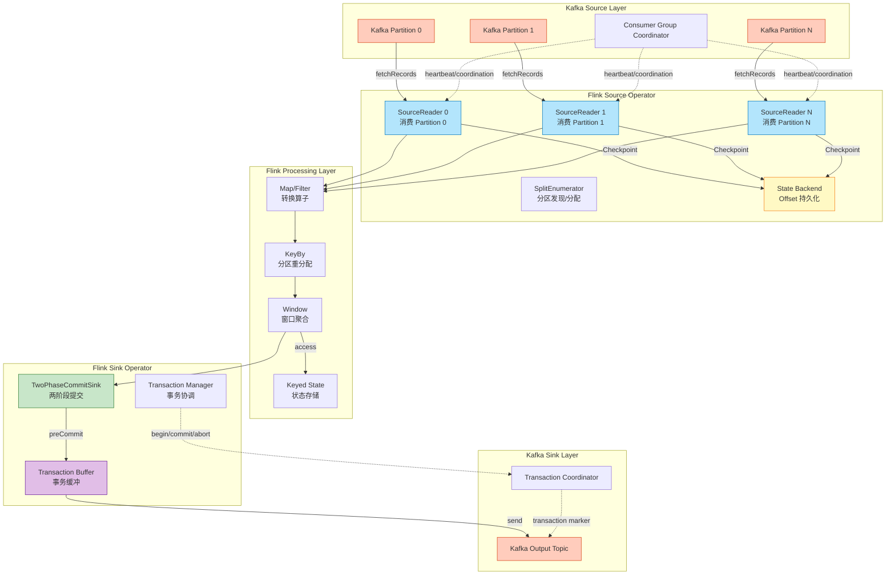
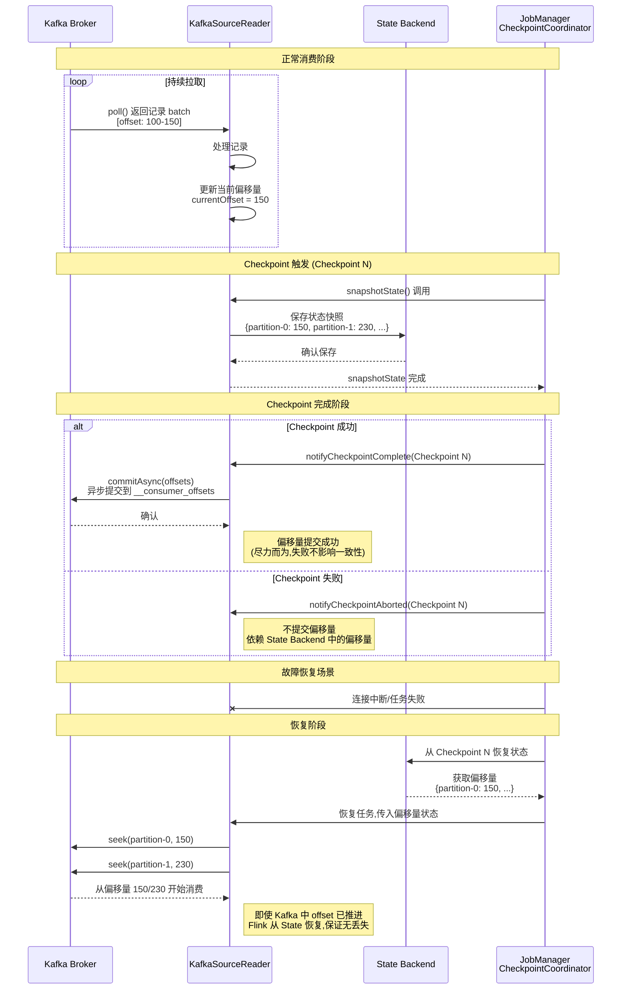
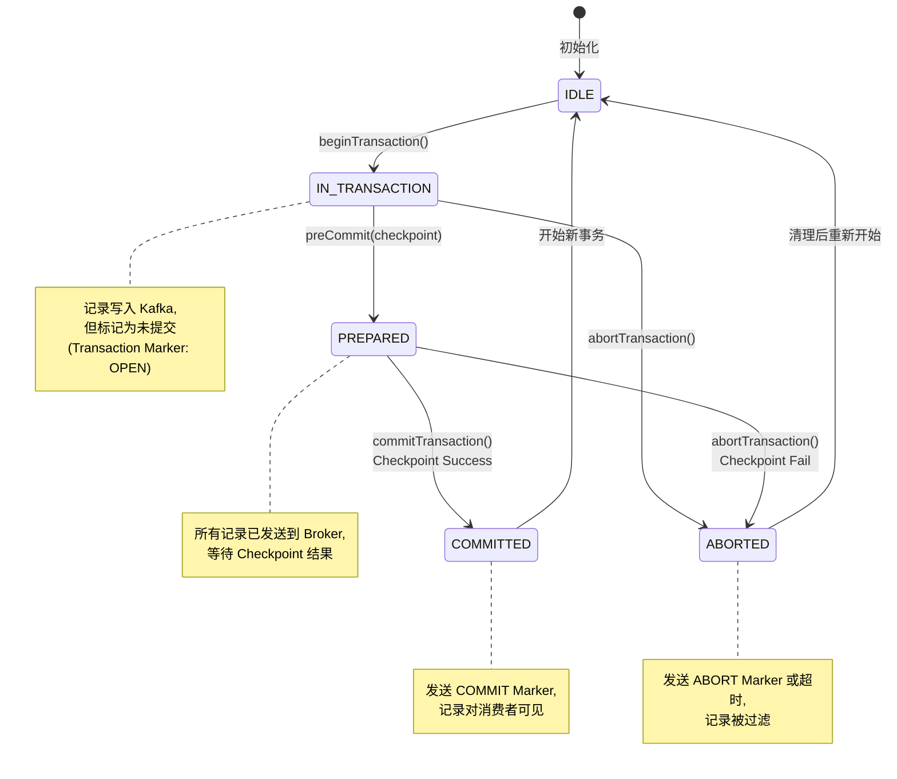
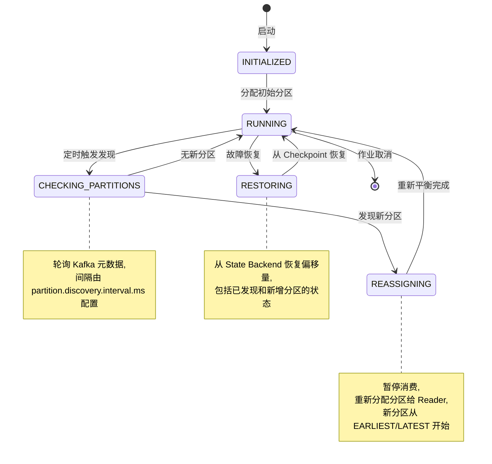
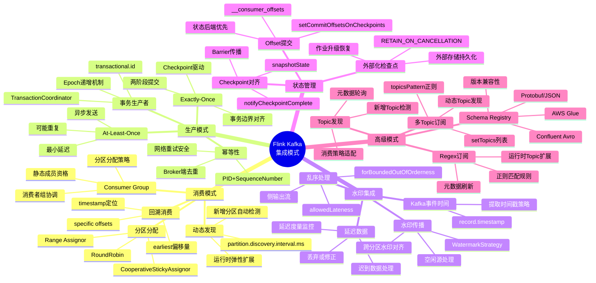
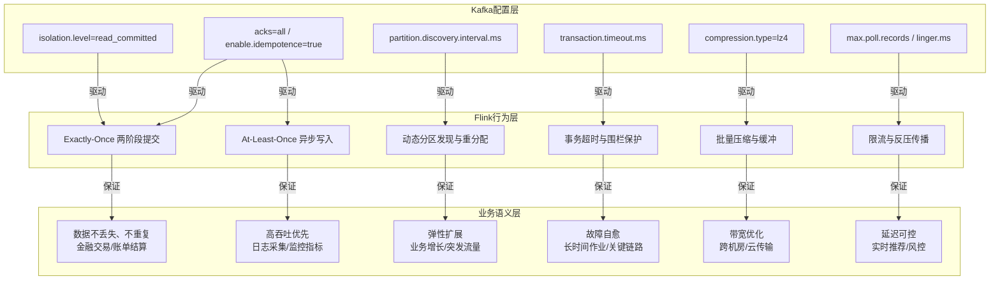

# Flink Kafka 集成模式 (Flink Kafka Integration Patterns)

> **所属阶段**: Flink/04-connectors | **前置依赖**: [../../Struct/02-properties/02.02-consistency-hierarchy.md](../../../Struct/02-properties/02.02-consistency-hierarchy.md), [../../Flink/02-core/exactly-once-end-to-end.md](../../02-core/exactly-once-end-to-end.md) | **形式化等级**: L4

---

## 目录

- [Flink Kafka 集成模式 (Flink Kafka Integration Patterns)](#flink-kafka-集成模式-flink-kafka-integration-patterns)
  - [目录](#目录)
  - [1. 概念定义 (Definitions)](#1-概念定义-definitions)
    - [Def-F-04-01 (Kafka Source 可重放性)](#def-f-04-01-kafka-source-可重放性)
    - [Def-F-04-02 (事务性生产者语义)](#def-f-04-02-事务性生产者语义)
    - [Def-F-04-03 (幂等性生产者语义)](#def-f-04-03-幂等性生产者语义)
    - [Def-F-04-04 (事务围栏 - Transaction Fencing)](#def-f-04-04-事务围栏---transaction-fencing)
    - [Def-F-04-05 (Schema 兼容性契约)](#def-f-04-05-schema-兼容性契约)
  - [2. 属性推导 (Properties)](#2-属性推导-properties)
    - [Lemma-F-04-01 (Kafka Source 偏移量绑定保证)](#lemma-f-04-01-kafka-source-偏移量绑定保证)
    - [Lemma-F-04-02 (事务性 Sink 的原子性边界)](#lemma-f-04-02-事务性-sink-的原子性边界)
    - [Prop-F-04-01 (端到端 Exactly-Once 的三元组条件)](#prop-f-04-01-端到端-exactly-once-的三元组条件)
  - [3. 关系建立 (Relations)](#3-关系建立-relations)
    - [关系 1: Kafka 事务与 Flink Checkpoint 的映射](#关系-1-kafka-事务与-flink-checkpoint-的映射)
    - [关系 2: Kafka Partition 与 Flink Parallelism 的对应](#关系-2-kafka-partition-与-flink-parallelism-的对应)
    - [关系 3: Schema Registry 与类型系统的编码关系](#关系-3-schema-registry-与类型系统的编码关系)
  - [4. 论证过程 (Argumentation)](#4-论证过程-argumentation)
    - [4.1 分区发现机制的时序分析](#41-分区发现机制的时序分析)
    - [4.2 消费者组重平衡的影响分析](#42-消费者组重平衡的影响分析)
    - [4.3 事务超时与故障恢复边界](#43-事务超时与故障恢复边界)
    - [4.4 幂等性 vs 事务性的工程权衡](#44-幂等性-vs-事务性的工程权衡)
  - [5. 形式证明 / 工程论证 (Proof / Engineering Argument)](#5-形式证明--工程论证-proof--engineering-argument)
    - [Thm-F-04-01 (Kafka Source Exactly-Once 正确性)](#thm-f-04-01-kafka-source-exactly-once-正确性)
    - [Thm-F-04-02 (Kafka Sink 事务原子性保证)](#thm-f-04-02-kafka-sink-事务原子性保证)
  - [6. 实例验证 (Examples)](#6-实例验证-examples)
    - [6.1 Kafka Source 基础配置](#61-kafka-source-基础配置)
    - [6.2 Kafka Sink 事务性配置](#62-kafka-sink-事务性配置)
    - [6.3 Schema Registry 集成配置](#63-schema-registry-集成配置)
    - [6.4 端到端 Exactly-Once 完整配置](#64-端到端-exactly-once-完整配置)
  - [7. 可视化 (Visualizations)](#7-可视化-visualizations)
    - [7.1 Kafka-Flink 数据流架构图](#71-kafka-flink-数据流架构图)
    - [7.2 Offset 提交序列图](#72-offset-提交序列图)
    - [7.3 事务提交流程图](#73-事务提交流程图)
    - [7.4 分区发现状态机](#74-分区发现状态机)
    - [7.5 Flink Kafka 集成模式思维导图](#75-flink-kafka-集成模式思维导图)
    - [7.6 Kafka 配置→Flink 行为→业务语义多维关联树](#76-kafka-配置flink-行为业务语义多维关联树)
    - [7.7 Kafka 集成模式选型决策树](#77-kafka-集成模式选型决策树)
  - [8. 配置参考 (Configuration Reference)](#8-配置参考-configuration-reference)
    - [8.1 Kafka Source 配置选项](#81-kafka-source-配置选项)
    - [8.2 Kafka Sink 配置选项](#82-kafka-sink-配置选项)
    - [8.3 Exactly-Once 策略按 Kafka 版本](#83-exactly-once-策略按-kafka-版本)
  - [9. 引用参考 (References)](#9-引用参考-references)

## 1. 概念定义 (Definitions)

### Def-F-04-01 (Kafka Source 可重放性)

设 $K = (T, P, O, C)$ 为一个 Kafka 集群，其中 $T$ 为 Topic 集合，$P_t = \\{p_{t,0}, p_{t,1}, \\dots, p_{t,n-1}\\}$ 为 Topic $t$ 的分区集合，$O_{t,p}$ 为分区 $p$ 的偏移量空间，$C$ 为消费者组协调器。Kafka Source 可重放性定义为：对于任意 $t \\in T$、$p \\in P_t$ 和 $o \\in O_{t,p}$，存在确定性的记录序列 $S(t, p, o)$：

$$\\text{Replayable}(K) \\iff \\forall t \\in T, p \\in P_t, o \\in O_{t,p}. \\; \\exists! S(t, p, o)$$

**直观解释**：Kafka 通过仅追加日志（append-only log）保证每个分区内的记录具有全序性和不可变性。给定一个偏移量，消费者总能读取到相同的记录序列。这是实现 Source 层 Exactly-Once 的基础——故障恢复后可以精确地"倒带"到已知位置重新读取[^1][^3]。根据 [Struct/02-properties/02.02-consistency-hierarchy.md](../../../Struct/02-properties/02.02-consistency-hierarchy.md) 中 Def-S-08-05，可重放 Source 是端到端 Exactly-Once 的必要条件之一。

### Def-F-04-02 (事务性生产者语义)

设 $\\mathcal{T}$ 为事务标识符，$\\mathcal{B}$ 为事务中的消息批次集合：

$$
\\text{TransactionalWrite}(\\mathcal{T}, \\mathcal{B}) = \\begin{cases}
\\text{AllCommitted} & \\text{if } \\forall b \\in \\mathcal{B}. \\; \\text{committed}(b) \\
\\text{AllAborted} & \\text{if } \\forall b \\in \\mathcal{B}. \\; \\text{aborted}(b) \\
\\text{InProgress} & \\text{otherwise}
\\end{cases}
$$

**事务的 ACID 属性**：

| 属性 | 定义 | Kafka 实现 |
|------|------|-----------|
| **原子性 (Atomicity)** | 事务内所有操作要么全成功，要么全失败 | Transaction Marker 机制 |
| **一致性 (Consistency)** | 事务完成后，系统处于有效状态 | 偏移量与消息原子提交 |
| **隔离性 (Isolation)** | 并发事务互不干扰 | `read_committed` 隔离级别 |
| **持久性 (Durability)** | 已提交事务的结果永久保存 | 复制因子 + acks=all |

**直观解释**：事务性生产者使 Kafka Sink 能够参与 Flink 的两阶段提交（2PC）协议。每个 Flink Checkpoint 周期对应一个 Kafka 事务，Checkpoint 成功时事务提交，失败时事务中止，从而保证"恰好一次"的外部可见效果[^3][^5]。

### Def-F-04-03 (幂等性生产者语义)

幂等性生产者保证在网络重试或生产者重启场景下，相同记录不会被重复写入。设 $P$ 为生产者实例，$M$ 为消息，$E$ 为 Broker 端记录的幂等令牌（PID + Sequence Number）：

$$\\text{Idempotent}(P) \\iff \\forall M. \\; \\text{send}(P, M, n) \\Rightarrow \\text{Broker}(E) \\text{ 中 } M \\text{ 恰好出现一次}$$

其中 $n$ 为消息的序列号，单调递增且唯一。

**序列号机制**：

- **Producer ID (PID)**: 生产者实例的唯一标识，由 Broker 在初始化时分配
- **Sequence Number**: 每个分区内的消息序列号，单调递增
- **Broker 端去重**: Broker 维护每个 (PID, Partition) 的最新序列号，拒绝重复或乱序消息

### Def-F-04-04 (事务围栏 - Transaction Fencing)

事务围栏是 Kafka 防止"僵尸任务"（Zombie Task）写入的安全机制。设 $P_{old}$ 和 $P_{new}$ 分别为旧生产者实例和新生产者实例，$E$ 为 Broker 维护的 Producer Epoch：

$$\\text{Fence}(P_{old}, P_{new}) \\iff \\text{epoch}(P_{new}) > \\text{epoch}(P_{old}) \\Rightarrow \\forall T \\in \\text{Txns}(P_{old}). \\; \\text{abort}(T)$$

**围栏机制的工作原理**：

1. 新生产者注册时，Broker 递增该 `transactional.id` 对应的 Epoch
2. 旧生产者尝试写入或提交事务时，Broker 检测到 Epoch 过期
3. 旧生产者收到 `ProducerFencedException`，事务被强制中止

### Def-F-04-05 (Schema 兼容性契约)

Schema Registry 定义了数据序列化/反序列化的类型契约。设 $S$ 为 Schema，$D$ 为数据：

$$\\text{SchemaContract}(S) \\iff \\forall D. \\; D_S(D(E_S(D))) = D$$

**兼容性级别**：

| 级别 | 定义 | 允许变更 |
|------|------|----------|
| **BACKWARD** | 新 Schema 可读旧数据 | 删除字段、添加可选字段 |
| **FORWARD** | 旧 Schema 可读新数据 | 添加字段、删除可选字段 |
| **FULL** | 双向兼容 | 添加/删除可选字段 |
| **NONE** | 无兼容性保证 | 任意变更 |

---

## 2. 属性推导 (Properties)

### Lemma-F-04-01 (Kafka Source 偏移量绑定保证)

**陈述**：当 `setCommitOffsetsOnCheckpoints(true)` 启用时，Flink Kafka Source 保证 Kafka 偏移量的提交与 Flink Checkpoint 的成功原子绑定。

**形式化表述**：设 $C_k$ 为第 $k$ 个 Checkpoint，$o_k$ 为对应的偏移量状态：

$$\\text{Commit}_K(o_k) \\iff \\text{Success}(C_k)$$

**证明**：

1. Flink Kafka Source 的 `snapshotState()` 将当前消费偏移量保存到状态后端
2. 偏移量提交发生在 `notifyCheckpointComplete()` 回调中，仅在 Checkpoint 成功完成后触发
3. 若 Checkpoint 失败，触发 `notifyCheckpointAborted()`，不会提交偏移量
4. 故障恢复时，Source 从状态后端恢复的偏移量优先于 Kafka 已提交的偏移量

因此，偏移量提交与 Checkpoint 成功事件严格同步。∎

### Lemma-F-04-02 (事务性 Sink 的原子性边界)

**陈述**：Flink Kafka 事务性 Sink 将每个 Checkpoint 周期内的所有输出作为原子单元提交或回滚。

**形式化表述**：设 $W_k$ 为 Checkpoint $k$ 与 Checkpoint $k+1$ 之间 Sink 写入的所有记录集合，$T_k$ 为对应 Kafka 事务：

$$\\forall r \\in W_k. \\; \\text{Visible}(r) \\iff \\text{Committed}(T_k)$$

**证明**：

- `beginTransaction()`: Checkpoint 开始时打开新事务
- `preCommit()`: Checkpoint 同步阶段将事务置为 PREPARED 状态
- `commit()`: Checkpoint 成功后，事务提交，记录对消费者可见
- `abort()`: Checkpoint 失败时事务中止，记录不可见

根据 2PC 协议的原子性，事务内所有记录具有相同的可见性状态。∎

### Prop-F-04-01 (端到端 Exactly-Once 的三元组条件)

**陈述**：Flink Kafka 端到端 Exactly-Once 成立当且仅当以下三个条件同时满足：

$$\\text{EO}(J) \\iff \\text{Replayable}(Src) \\land \\text{ConsistentCheckpoint}(Ops) \\land \\text{AtomicOutput}(Sink)$$

根据 [Struct/02-properties/02.02-consistency-hierarchy.md](../../../Struct/02-properties/02.02-consistency-hierarchy.md) 中的 Prop-S-08-01 和 [Flink/02-core/exactly-once-end-to-end.md](../../02-core/exactly-once-end-to-end.md)，需要 Source 可重放、引擎内部一致性和 Sink 原子性同时满足。

---

## 3. 关系建立 (Relations)

### 关系 1: Kafka 事务与 Flink Checkpoint 的映射

Flink Kafka 事务性 Sink 实现了将 Flink Checkpoint 协议映射到 Kafka 事务协议的适配层：

| Flink 概念 | Kafka 事务概念 | 映射关系 |
|-----------|---------------|----------|
| CheckpointCoordinator | TransactionCoordinator | 1:1 对应，协调者角色 |
| Checkpoint Barrier | Transaction Begin Marker | 语义边界对齐 |
| snapshotState() | preCommit() | 准备阶段，状态持久化 |
| notifyCheckpointComplete() | commitTransaction() | 提交阶段，结果可见 |
| notifyCheckpointAborted() | abortTransaction() | 回滚阶段，清理资源 |
| StateBackend 偏移量 | __consumer_offsets | 恢复时优先使用 StateBackend |

### 关系 2: Kafka Partition 与 Flink Parallelism 的对应

Flink Kafka Source 的并行度与 Kafka Partition 数量之间存在约束关系。设 $P_K$ 为 Kafka 分区数，$P_F$ 为 Flink 并行度：

| 场景 | 约束条件 | 行为特征 |
|------|----------|----------|
| $P_F = P_K$ | 理想对应 | 每个 Subtask 处理一个分区，无数据倾斜 |
| $P_F < P_K$ | 多对一映射 | 部分 Subtask 处理多个分区，可能负载不均 |
| $P_F > P_K$ | 一对多空闲 | 多余 Subtask 空闲，资源浪费 |

**最佳实践**：$\\text{OptimalParallelism} = P_K \\times n, \\quad n \\in \\{1, 2, 4, \\dots\\}$

### 关系 3: Schema Registry 与类型系统的编码关系

Schema Registry 提供了数据类型在 Kafka 消息与 Flink 类型系统之间的编解码桥梁：

| Flink 类型 | Avro Schema | Protobuf | JSON Schema |
|-----------|-------------|----------|-------------|
| `String` | `string` | `string` | `{"type": "string"}` |
| `Integer` | `int` | `int32` | `{"type": "integer"}` |
| `Long` | `long` | `int64` | `{"type": "integer"}` |
| `Double` | `double` | `double` | `{"type": "number"}` |
| `Row` | `record` | `message` | `object` |
| `Array<T>` | `array` | `repeated` | `array` |

---

## 4. 论证过程 (Argumentation)

### 4.1 分区发现机制的时序分析

Flink Kafka Source 支持在作业运行期间动态发现新增分区。该机制的时序如下：

1. **T0**: 初始状态，Source 订阅 Topic 集合 $T$，分区集合为 $P_0$
2. **T1**: Kafka 管理员增加分区，新分区集合为 $P_1 = P_0 \\cup \\{p_{new}\\}$
3. **T2**: Flink Source 在下次发现轮询中检测到 $p_{new}$
4. **T3**: 触发 Source 重新初始化，将 $p_{new}$ 纳入读取范围
5. **T4**: 从 $p_{new}$ 的初始偏移量（默认 `LATEST` 或 `EARLIEST`）开始消费

**数据完整性保证**：新增分区从发现时刻开始的数据被消费，与 Checkpoint 结合后新分区的初始偏移量被纳入下次 Checkpoint。

### 4.2 消费者组重平衡的影响分析

**重平衡触发条件**：

| 触发事件 | 影响范围 | 恢复时间 |
|----------|----------|----------|
| 新消费者加入 | 全组重新分配 | 数秒至数十秒 |
| 消费者心跳超时 | 故障消费者分区迁移 | 取决于 `session.timeout.ms` |
| 消费者主动离开 | 分区重新分配 | 数秒 |
| 分区数量变化 | 全组重新分配 | 与发现间隔相关 |

**Flink 的应对策略**：静态成员资格 (`group.instance.id`)、协作重平衡 (Kafka 2.4+)、取消自动提交。

### 4.3 事务超时与故障恢复边界

关键约束：$\\text{CheckpointInterval} + \\text{CheckpointTimeout} < \\text{transaction.timeout.ms}$

若 Flink 作业故障持续时间 $D > \\text{transaction.timeout.ms}$，则正在进行的 Kafka 事务会被 Broker 强制中止。恢复后，Flink 从上次成功 Checkpoint 恢复，重新处理该 Checkpoint 之后的数据，开启新事务。

### 4.4 幂等性 vs 事务性的工程权衡

| 维度 | 幂等性方案 | 事务性方案 |
|------|-----------|-----------|
| **延迟** | 低（直接写入） | 较高（两阶段提交） |
| **吞吐** | 高（无协调开销） | 中等（事务协调开销） |
| **外部依赖** | 无需特殊支持 | 需要事务支持（Kafka 0.11+） |
| **跨分区原子性** | 不支持 | 支持 |
| **消费者隔离** | 弱（可能读到未提交数据） | 强（read_committed 隔离） |

---

## 5. 形式证明 / 工程论证 (Proof / Engineering Argument)

### Thm-F-04-01 (Kafka Source Exactly-Once 正确性)

**陈述**：在启用 `setCommitOffsetsOnCheckpoints(true)` 且使用可重放 Source 的条件下，Flink Kafka Source 保证 At-Least-Once 语义；结合幂等/事务性 Sink 可实现端到端 Exactly-Once。

**证明**：

**前提条件**：

1. Kafka 日志是仅追加的，偏移量单调递增
2. Flink Checkpoint 通过 Barrier 对齐保证全局一致性快照
3. 偏移量提交与 Checkpoint 成功事件绑定

**无丢失性（At-Least-Once）**：设 $C_n$ 为最后一个成功 Checkpoint，其保存的偏移量为 $o_n$。故障恢复时：

1. Source 从状态恢复，获取偏移量 $o_n$
2. Source 向 Kafka 定位到 $o_n$ 位置
3. 从 $o_n$ 开始消费，所有 $C_n$ 之后的数据被重新处理

因此，不存在数据丢失。与幂等/事务性 Sink 配合，可实现端到端 Exactly-Once。∎

### Thm-F-04-02 (Kafka Sink 事务原子性保证)

**陈述**：Flink Kafka 事务性 Sink 使用两阶段提交协议，保证每个 Checkpoint 周期的输出要么全部可见，要么全部不可见。

**证明**：设 $W$ 为某 Checkpoint 周期内 Sink 写入的所有记录，$T$ 为对应 Kafka 事务：

1. **准备阶段** (`preCommit`): 所有 $w \\in W$ 已发送到 Kafka Broker，但标记为未提交状态
2. **决策阶段**:
   - 若 Checkpoint 成功，发送 COMMIT Marker，所有 $w$ 对消费者可见
   - 若 Checkpoint 失败，发送 ABORT Marker 或直接超时中止，所有 $w$ 不可见
3. **隔离性**: 使用 `isolation.level=read_committed` 的消费者不会读取到未提交记录

因此，$W$ 的可见性是原子的。∎

---

## 6. 实例验证 (Examples)

### 6.1 Kafka Source 基础配置

```java
// [伪代码片段 - 不可直接运行] 仅展示核心逻辑
import org.apache.flink.api.common.eventtime.WatermarkStrategy;
import org.apache.flink.connector.kafka.source.KafkaSource;
import org.apache.flink.connector.kafka.source.enumerator.initializer.OffsetsInitializer;

import org.apache.flink.streaming.api.datastream.DataStream;


// 构建 Kafka Source(Flink 1.14+ 新 API)
KafkaSource<Event> source = KafkaSource.<Event>builder()
    .setBootstrapServers("kafka-1:9092,kafka-2:9092")
    .setTopics("input-topic")
    .setGroupId("flink-consumer-group")
    .setStartingOffsets(OffsetsInitializer.earliest())
    .setDeserializer(KafkaRecordDeserializationSchema.of(
        new EventDeserializationSchema()))
    .setProperty("partition.discovery.interval.ms", "10000")
    .setProperty("isolation.level", "read_committed")
    .build();

DataStream<Event> stream = env.fromSource(
    source,
    WatermarkStrategy.forBoundedOutOfOrderness(Duration.ofSeconds(5)),
    "Kafka Source");
```

### 6.2 Kafka Sink 事务性配置

```java
// [伪代码片段 - 不可直接运行] 仅展示核心逻辑
import org.apache.flink.connector.base.DeliveryGuarantee;
import org.apache.flink.connector.kafka.sink.KafkaSink;

KafkaSink<Result> sink = KafkaSink.<Result>builder()
    .setBootstrapServers("kafka-1:9092,kafka-2:9092")
    .setRecordSerializer(KafkaRecordSerializationSchema.builder()
        .setTopic("output-topic")
        .setValueSerializationSchema(new ResultSerializationSchema())
        .build())
    .setDeliveryGuarantee(DeliveryGuarantee.EXACTLY_ONCE)
    .setProperty("transaction.timeout.ms", "900000")
    .setProperty("enable.idempotence", "true")
    .setProperty("acks", "all")
    .setTransactionalIdPrefix("flink-job-" + subtaskIndex)
    .build();

stream.sinkTo(sink);
```

### 6.3 Schema Registry 集成配置

```java
// [伪代码片段 - 不可直接运行] 仅展示核心逻辑
// Confluent Schema Registry 集成
KafkaSource<UserEvent> source = KafkaSource.<UserEvent>builder()
    .setBootstrapServers("kafka:9092")
    .setTopics("user-events")
    .setGroupId("flink-avro-consumer")
    .setDeserializer(new AvroDeserializationSchema())
    .setProperty("schema.registry.url", "http://schema-registry:8081")
    .setProperty("specific.avro.reader", "true")
    .build();

// AWS Glue Schema Registry
Properties glueProps = new Properties();
glueProps.setProperty("aws.glue.schema.registry.url", "https://glue.us-east-1.amazonaws.com");
glueProps.setProperty("aws.region", "us-east-1");
```

### 6.4 端到端 Exactly-Once 完整配置

```java
import org.apache.flink.streaming.api.checkpointing.CheckpointingMode;
import org.apache.flink.streaming.api.checkpointing.CheckpointConfig;

import org.apache.flink.streaming.api.environment.StreamExecutionEnvironment;
import org.apache.flink.streaming.api.datastream.DataStream;
import org.apache.flink.streaming.api.CheckpointingMode;
import org.apache.flink.streaming.api.windowing.time.Time;


public class ExactlyOnceKafkaPipeline {
    public static void main(String[] args) throws Exception {
        StreamExecutionEnvironment env =
            StreamExecutionEnvironment.getExecutionEnvironment();

        // ==================== Checkpoint 配置 ====================
        env.enableCheckpointing(60000, CheckpointingMode.EXACTLY_ONCE);
        CheckpointConfig ckptConfig = env.getCheckpointConfig();
        ckptConfig.setCheckpointTimeout(600000);
        ckptConfig.setMinPauseBetweenCheckpoints(30000);
        ckptConfig.setMaxConcurrentCheckpoints(1);
        ckptConfig.setExternalizedCheckpointCleanup(
            CheckpointConfig.ExternalizedCheckpointCleanup.RETAIN_ON_CANCELLATION);

        // 状态后端配置
        env.setStateBackend(new EmbeddedRocksDBStateBackend(true));
        env.getCheckpointConfig().setCheckpointStorage("s3://bucket/flink-checkpoints");

        // ==================== Kafka Source ====================
        KafkaSource<Event> source = KafkaSource.<Event>builder()
            .setBootstrapServers("kafka-1:9092,kafka-2:9092,kafka-3:9092")
            .setTopicsPattern("input-topic-.*")
            .setGroupId("exactly-once-consumer-group")
            .setProperty("isolation.level", "read_committed")
            .setProperty("enable.auto.commit", "false")
            .setProperty("auto.offset.reset", "earliest")
            .setProperty("partition.discovery.interval.ms", "30000")
            .setProperty("group.instance.id", "flink-instance-1")
            .build();

        // ==================== 业务处理逻辑 ====================
        DataStream<Result> processed = env
            .fromSource(source, WatermarkStrategy.forBoundedOutOfOrderness(
                Duration.ofSeconds(30)), "Kafka Source")
            .keyBy(Event::getUserId)
            .window(TumblingEventTimeWindows.of(Time.minutes(1)))
            .aggregate(new EventAggregator())
            .map(new ResultEnricher());

        // ==================== Kafka Sink ====================
        KafkaSink<Result> sink = KafkaSink.<Result>builder()
            .setBootstrapServers("kafka-1:9092,kafka-2:9092,kafka-3:9092")
            .setRecordSerializer(KafkaRecordSerializationSchema.builder()
                .setTopicSelector((e) -> "output-topic-" + e.getCategory())
                .setValueSerializationSchema(new ResultSerializationSchema())
                .build())
            .setDeliveryGuarantee(DeliveryGuarantee.EXACTLY_ONCE)
            .setProperty("transaction.timeout.ms", "900000")
            .setProperty("enable.idempotence", "true")
            .setProperty("acks", "all")
            .setProperty("retries", Integer.MAX_VALUE)
            .setTransactionalIdPrefix("exactly-once-job-" + jobId)
            .build();

        processed.sinkTo(sink);
        env.execute("Exactly-Once Kafka Pipeline");
    }
}
```

---

## 7. 可视化 (Visualizations)

### 7.1 Kafka-Flink 数据流架构图



**图说明**：橙色节点为 Kafka Broker 层，蓝色为 Flink Source，绿色为 Sink，黄色为状态后端，紫色为事务缓冲。

### 7.2 Offset 提交序列图



**图说明**：偏移量提交到 Kafka 是尽力而为的优化，真正的容错依赖 State Backend 中保存的偏移量。

### 7.3 事务提交流程图



### 7.4 分区发现状态机



### 7.5 Flink Kafka 集成模式思维导图



**图说明**：以 Flink Kafka 集成模式为中心，放射展开五大维度——消费模式、生产模式、水印集成、状态管理与高级模式，覆盖从基础配置到高阶特性的完整知识图谱。

### 7.6 Kafka 配置→Flink 行为→业务语义多维关联树



**图说明**：三层映射结构展示 Kafka 配置如何驱动 Flink 运行时行为，进而映射到具体业务语义。上层配置变更会逐层传导，最终影响业务层面的数据保证能力。

### 7.7 Kafka 集成模式选型决策树

```mermaid
flowchart TD
    Start([Kafka集成模式选型]) --> Q1{业务对数据一致性的要求?}

    Q1 -->|不允许重复/丢失<br/>金融级精确性| HighRel[高可靠模式]
    Q1 -->|允许微量重复<br/>追求极致吞吐| HighThroughput[高吞吐模式]
    Q1 -->|毫秒级响应<br/>实时性优先| LowLatency[低延迟模式]
    Q1 -->|Topic频繁变化<br/>Schema持续演进| Flexible[灵活消费模式]

    HighRel --> HR1["Exactly-Once 交付保证"]
    HighRel --> HR2["事务生产者 + enable.idempotence=true"]
    HighRel --> HR3["Checkpoint 对齐 + read_committed"]
    HighRel --> HR4["acks=all + transaction.timeout.ms > checkpointDuration"]

    HighThroughput --> HT1["At-Least-Once 交付保证"]
    HighThroughput --> HT2["批量提交 + batch.size↑ / linger.ms↑"]
    HighThroughput --> HT3["压缩算法 lz4/snappy"]
    HighThroughput --> HT4["异步提交 + 降低 checkpoint 频率"]

    LowLatency --> LL1["小批量发送 + batch.size↓"]
    LowLatency --> LL2["频繁 Flush + linger.ms=0"]
    LowLatency --> LL3["低 Watermark 延迟 + 允许乱序窗口缩小"]
    LowLatency --> LL4["禁用或降低事务开销"]

    Flexible --> FL1["动态分区发现 + partition.discovery.interval.ms"]
    Flexible --> FL2["Regex订阅 + topicsPattern"]
    Flexible --> FL3["Schema进化 + BACKWARD/FULL兼容性"]
    Flexible --> FL4["多Topic路由 + TopicSelector"]

    HR1 & HR2 & HR3 & HR4 --> EndRel([输出: 金融交易/订单支付/对账系统])
    HT1 & HT2 & HT3 & HT4 --> EndThr([输出: 日志聚合/埋点上报/监控流])
    LL1 & LL2 & LL3 & LL4 --> EndLat([输出: 实时推荐/风控决策/在线广告])
    FL1 & FL2 & FL3 & FL4 --> EndFlex([输出: 微服务事件总线/多租户消息平台])

    style Start fill:#e3f2fd,stroke:#1565c0
    style HighRel fill:#ffebee,stroke:#c62828
    style HighThroughput fill:#e8f5e9,stroke:#2e7d32
    style LowLatency fill:#fff3e0,stroke:#ef6c00
    style Flexible fill:#f3e5f5,stroke:#6a1b9a
    style EndRel fill:#ffebee,stroke:#c62828
    style EndThr fill:#e8f5e9,stroke:#2e7d32
    style EndLat fill:#fff3e0,stroke:#ef6c00
    style EndFlex fill:#f3e5f5,stroke:#6a1b9a
```



**图说明**：四类典型场景的分支决策路径。根据业务对一致性、吞吐、延迟和灵活性的不同要求，选择对应的 Kafka-Flink 集成配置组合。

---

## 8. 配置参考 (Configuration Reference)

### 8.1 Kafka Source 配置选项

| 配置项 | 类型 | 默认值 | 描述 | 推荐值 |
|--------|------|--------|------|--------|
| `bootstrap.servers` | String | 必填 | Kafka Broker 地址列表 | `kafka-1:9092,kafka-2:9092` |
| `topics` / `topicsPattern` | String | 必填 | 订阅的 Topic 或正则模式 | 根据业务指定 |
| `group.id` | String | 必填 | 消费者组 ID | `flink-consumer-${job}` |
| `startingOffsets` | Enum | `COMMITTED` | 起始偏移量策略 | `COMMITTED` |
| `partition.discovery.interval.ms` | Long | `-1` (禁用) | 分区发现间隔 | `30000` (30s) |
| `isolation.level` | String | `read_uncommitted` | 消费者隔离级别 | `read_committed` (EO 必需) |
| `enable.auto.commit` | Boolean | `true` | 自动提交偏移量 | `false` (Flink 管理) |
| `auto.offset.reset` | String | `latest` | 无偏移量时的重置策略 | `earliest` |
| `group.instance.id` | String | null | 静态成员资格 ID | `flink-${taskId}` |
| `session.timeout.ms` | Integer | `10000` | 会话超时时间 | `45000` |
| `heartbeat.interval.ms` | Integer | `3000` | 心跳间隔 | `15000` |
| `max.poll.records` | Integer | `500` | 单次 poll 最大记录数 | `1000-5000` |
| `max.poll.interval.ms` | Integer | `300000` | 两次 poll 间最大间隔 | `300000` |

**Exactly-Once 必需配置**：

```properties
# 消费者配置 isolation.level=read_committed
enable.auto.commit=false
auto.offset.reset=earliest

# 生产者配置(Sink)
enable.idempotence=true
acks=all
transactional.id=${uniquePrefix}-${subtaskIndex}
transaction.timeout.ms=${>checkpointInterval + checkpointTimeout}
```

### 8.2 Kafka Sink 配置选项

| 配置项 | 类型 | 默认值 | 描述 | 推荐值 |
|--------|------|--------|------|--------|
| `bootstrap.servers` | String | 必填 | Kafka Broker 地址 | 同 Source |
| `delivery.guarantee` | Enum | `AT_LEAST_ONCE` | 交付保证级别 | `EXACTLY_ONCE` |
| `transactionalIdPrefix` | String | 自动生成 | 事务 ID 前缀 | 显式指定唯一值 |
| `transaction.timeout.ms` | Integer | `60000` | 事务超时时间 | `900000` (15min) |
| `enable.idempotence` | Boolean | `true` | 启用幂等性 | `true` |
| `acks` | String | `1` | 确认级别 | `all` |
| `retries` | Integer | `2147483647` | 重试次数 | `Integer.MAX_VALUE` |
| `max.in.flight.requests.per.connection` | Integer | `5` | 最大在途请求 | `5` |
| `linger.ms` | Long | `0` | 发送延迟 | `5-100` |
| `buffer.memory` | Long | `33554432` | 缓冲区大小 | `67108864` (64MB) |
| `batch.size` | Integer | `16384` | 批次大小 | `32768` |
| `compression.type` | String | `none` | 压缩算法 | `lz4` 或 `snappy` |
| `max.block.ms` | Long | `60000` | 最大阻塞时间 | `60000` |
| `request.timeout.ms` | Integer | `30000` | 请求超时 | `30000` |

### 8.3 Exactly-Once 策略按 Kafka 版本

不同 Kafka 版本支持的 Exactly-Once 策略有所差异。下表总结了各版本的能力矩阵：

| 特性 | Kafka 0.10 | Kafka 0.11 | Kafka 1.0 | Kafka 2.0 | Kafka 2.4+ | Kafka 3.0+ |
|------|-----------|-----------|-----------|-----------|-----------|-----------|
| **幂等生产者** | ❌ 不支持 | ✅ 支持 | ✅ 支持 | ✅ 支持 | ✅ 支持 | ✅ 支持 |
| **事务 API** | ❌ 不支持 | ✅ 支持 | ✅ 支持 | ✅ 支持 | ✅ 支持 | ✅ 支持 |
| **事务围栏** | ❌ 不支持 | ✅ 基础支持 | ✅ 基础支持 | ✅ 改进 | ✅ 改进 | ✅ 改进 |
| **协作重平衡** | ❌ 不支持 | ❌ 不支持 | ❌ 不支持 | ❌ 不支持 | ✅ 支持 | ✅ 支持 |
| **Exactly-Once 策略** | At-Least-Once + 去重 | 2PC 事务 | 2PC 事务 | 2PC 事务 | 2PC + 协作重平衡 | 2PC + 改进围栏 |

**按版本的配置要求**：

| 版本 | 必需配置 | 推荐策略 |
|------|----------|----------|
| **Kafka < 0.11** | 无事务支持 | At-Least-Once + 应用层去重 / 幂等 Sink |
| **Kafka 0.11-1.x** | `transactional.id`, `enable.idempotence=true` | 2PC 事务，但重平衡代价高 |
| **Kafka 2.0-2.3** | 同上 | 2PC 事务，改进的事务围栏 |
| **Kafka 2.4+** | `partition.assignment.strategy=org.apache.kafka.clients.consumer.CooperativeStickyAssignor` | 2PC 事务 + 协作重平衡，减少再处理 |
| **Kafka 3.0+** | 同上 | 改进的事务围栏，更严格的僵尸任务检测 |

**版本兼容性注意事项**：

```java
// [伪代码片段 - 不可直接运行] 仅展示核心逻辑
// Kafka 2.4+ 协作重平衡配置
properties.setProperty(
    "partition.assignment.strategy",
    "org.apache.kafka.clients.consumer.CooperativeStickyAssignor"
);

// Kafka 2.5+ 静态成员资格配置
properties.setProperty("group.instance.id", "flink-instance-" + taskId);
```

---

## 9. 引用参考 (References)

[^1]: Apache Flink Documentation, "Kafka Connector", 2025. <https://nightlies.apache.org/flink/flink-docs-stable/docs/connectors/datastream/kafka/>


[^3]: Apache Kafka Documentation, "Transactions in Kafka", 2025. <https://kafka.apache.org/documentation/#transactions>


[^5]: P. Carbone et al., "State Management in Apache Flink: Consistent Stateful Distributed Stream Processing", *PVLDB*, 10(12), 2017.


---

*文档版本: v1.0 | 更新日期: 2026-04-02 | 状态: 已完成*

---

*文档版本: v1.0 | 创建日期: 2026-04-19*
