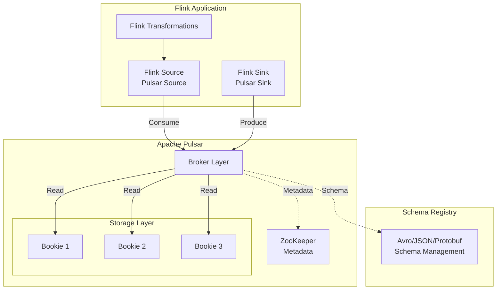
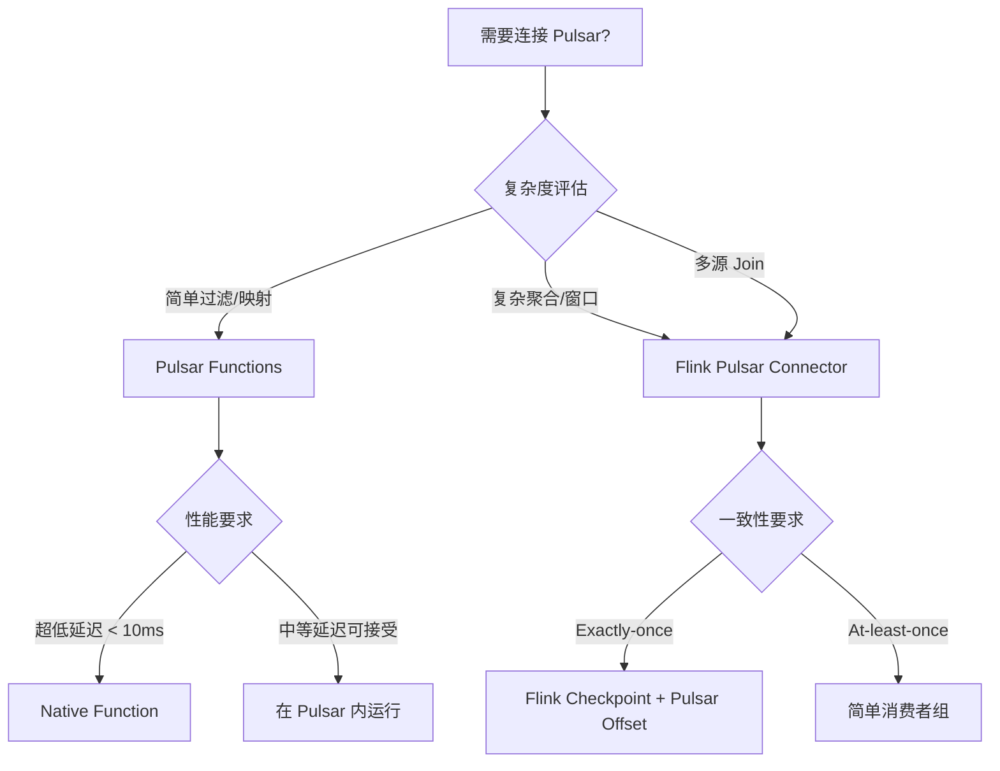
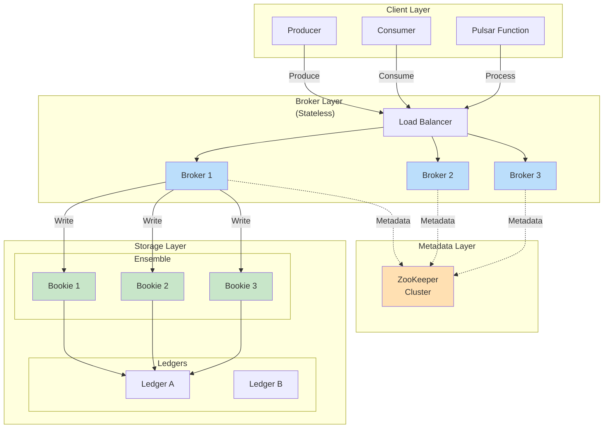
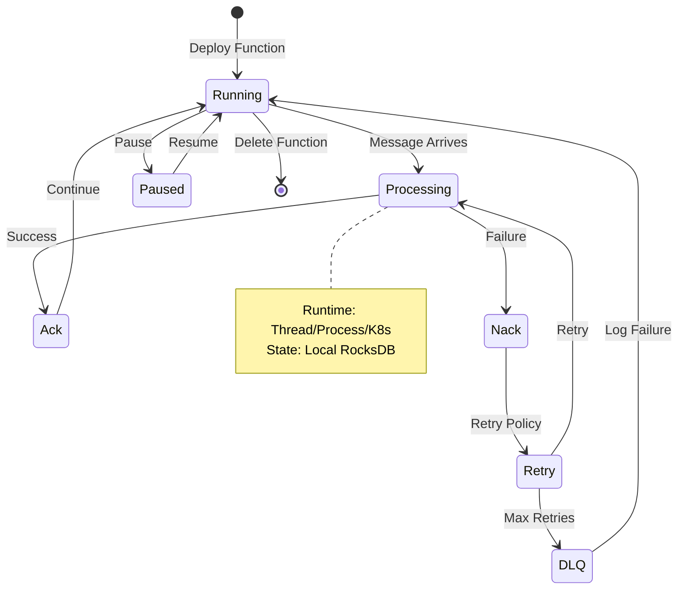
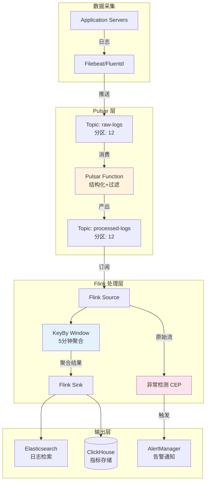
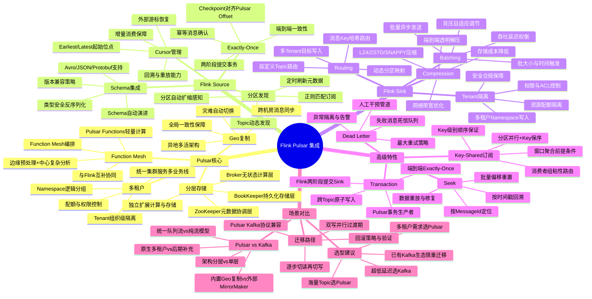
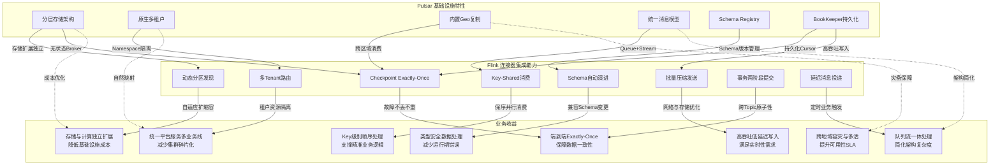
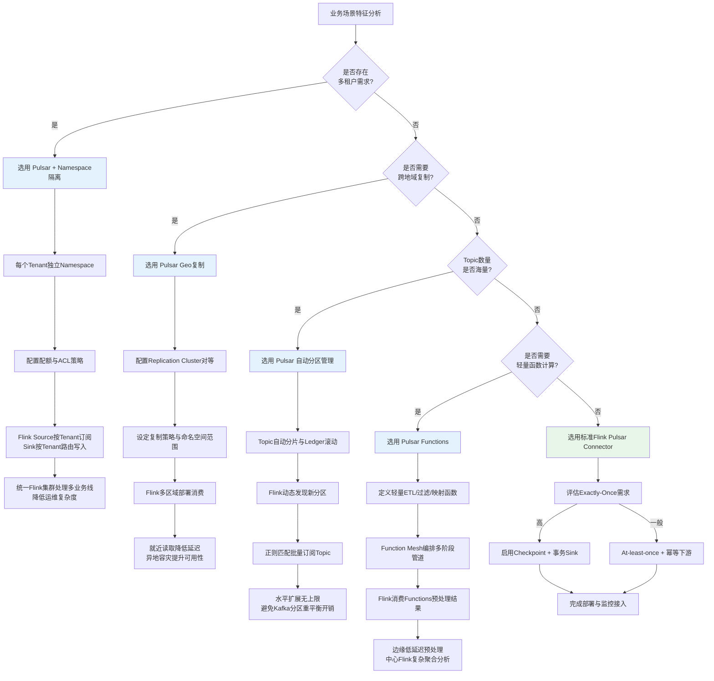

# Pulsar Functions 集成指南

> 所属阶段: Flink/Connectors | 前置依赖: [Flink-01-04 连接器基础](flink-connectors-ecosystem-complete-guide.md), [Flink-03-01 状态管理](../../02-core/flink-state-management-complete-guide.md) | 形式化等级: L3-L4

## 1. 概念定义 (Definitions)

### 1.1 Pulsar 基础定义

**Def-F-04-01 (Pulsar 集群拓扑)**
Apache Pulsar 采用**分层架构**，由三层组成：

- **Broker 层**: 无状态计算层，处理客户端连接和消息路由
- **BookKeeper 层**: 有状态存储层，通过 Apache BookKeeper 实现持久化日志存储
- **ZooKeeper 层**: 元数据管理层，协调集群状态和配置

$$
\text{Pulsar}_{\text{Cluster}} = \langle \mathcal{B}_{\text{brokers}}, \mathcal{W}_{\text{bookies}}, \mathcal{Z}_{\text{zk}} \rangle
$$

**Def-F-04-02 (命名空间与主题)**
Pulsar 的主题层级组织为：

- **Tenant (租户)**: 最高隔离级别，对应组织或业务线
- **Namespace (命名空间)**: 租户下的逻辑分组
- **Topic (主题)**: 实际的消息流

$$
\text{Topic}_{\text{URI}} = \text{persistent}://\langle tenant \rangle/\langle namespace \rangle/\langle topic \rangle
$$

**Def-F-04-03 (统一消息模型)**
Pulsar 同时支持：

- **队列语义**: 传统消息队列 (JMS)，支持单条消息确认
- **流语义**: Kafka 风格的流处理，支持分区消费

$$
\text{Pulsar}_{\text{Model}} = \text{Queue}_{\text{Semantic}} \cap \text{Stream}_{\text{Semantic}}
$$

### 1.2 Pulsar 与 Kafka 对比

| 维度 | Apache Pulsar | Apache Kafka |
|------|---------------|--------------|
| 架构 | 分层 (Broker + BookKeeper) | 单层 (Broker 即存储) |
| 存储扩展 | 独立扩展，无数据复制 | 分区重平衡需要数据迁移 |
| 多租户 | 原生支持，资源隔离 | 后期补充 |
| 消息确认 | 单条 + 累积确认 | 仅分区级偏移量 |
| 延迟消息 | 内置支持 | 需外部实现 |
| 地理复制 | 内置跨机房复制 | MirrorMaker 外部实现 |
| 消息保留 | 基于时间/大小统一策略 | 分区级策略 |

---

## 2. 属性推导 (Properties)

### 2.1 分层架构优势

**Prop-F-04-01 (计算存储分离)**
Pulsar 的分层架构使得：

- 计算层 (Broker) 可独立水平扩展
- 存储层 (BookKeeper) 按需扩展
- Broker 故障不影响数据持久性

**Lemma-F-04-01 (无状态 Broker)**
Broker 层为无状态设计，使得：
$$
\forall b \in \mathcal{B}_{\text{brokers}}: \text{failure}(b) \Rightarrow \text{recovery}(b) \leq T_{\text{reconnect}}
$$
客户端可立即重连到其他 Broker，无需等待数据迁移。

### 2.2 订阅模式语义

Pulsar 支持四种订阅模式：

| 订阅模式 | 语义 | 适用场景 |
|---------|------|---------|
| **Exclusive** | 独占消费，单消费者 | 严格顺序保证 |
| **Shared** | 轮询分发，多消费者 | 高吞吐并行处理 |
| **Failover** | 主备切换，单活跃 | 高可用消费 |
| **Key_Shared** | 基于 Key 的粘性路由 | 相同 Key 顺序保证 |

**Lemma-F-04-02 (Key_Shared 顺序保证)**
对于 Key_Shared 订阅模式：
$$
\forall k \in \mathcal{K}_{\text{keys}}: \text{order}(m_i, m_j | \text{key}=k) \Rightarrow \text{process}(c_x, m_i) \prec \text{process}(c_x, m_j)
$$
相同 Key 的消息被路由到同一消费者，保证处理顺序。

---

## 3. 关系建立 (Relations)

### 3.1 Pulsar-Flink 连接器架构



### 3.2 Pulsar Functions vs Flink 定位

| 特性 | Pulsar Functions | Apache Flink |
|------|------------------|--------------|
| 部署模式 | Pulsar 内部运行时 | 独立集群 |
| 状态管理 | 轻量级本地状态 | 分布式状态后端 |
| 处理语义 | At-least-once (默认) | Exactly-once |
| 窗口支持 | 基础 Tumbling | 丰富窗口类型 |
| 复杂性 | 简单 ETL | 复杂流处理 |
| 延迟 | 低延迟 (ms) | 中等延迟 (亚秒) |
| 生态集成 | Pulsar 原生 | 多连接器生态 |

**集成关系**: Pulsar Functions 适合轻量级消息转换，Flink 适合复杂流分析，两者可协同工作。

---

## 4. 论证过程 (Argumentation)

### 4.1 连接器选型论证

**场景决策树**:



### 4.2 订阅模式选择论证

**Thm-F-04-01 (订阅模式选择定理)**
对于 Flink 消费 Pulsar 的场景，订阅模式选择取决于：

$$
\text{Subscription}_{\text{opt}} = \begin{cases}
\text{Exclusive} & \text{if } \text{parallelism} = 1 \land \text{ordering} = \text{strict} \\
\text{Failover} & \text{if } \text{parallelism} = 1 \land \text{HA} = \text{required} \\
\text{Shared} & \text{if } \text{ordering} = \text{none} \land \text{throughput} = \text{max} \\
\text{Key\_Shared} & \text{if } \exists k: \text{ordering}(k) = \text{strict}
\end{cases}
$$

---

## 5. 形式证明 / 工程论证 (Proof / Engineering Argument)

### 5.1 Pulsar Source 配置论证

**Thm-F-04-02 (Exactly-once Source 保证)**
Flink Pulsar Source 在启用 Checkpoint 时提供 Exactly-once 语义。

**证明**:

1. Pulsar 支持游标 (Cursor) 持久化消费位置
2. Flink Checkpoint 将 Pulsar Offset 作为算子状态保存
3. 故障恢复时，从 Checkpoint 恢复 Offset 重新消费
4. Pulsar 的消息确认是幂等的
5. 因此：

$$
\forall m \in \text{messages}: \text{count}_{\text{process}}(m) = 1 \lor \text{count}_{\text{process}}(m) = 0
$$
失败消息会被重新处理，但不会重复计数。

### 5.2 性能优化工程论证

**批量消费优化**:

```java
// [伪代码片段 - 不可直接运行] 仅展示核心逻辑
// 配置批量拉取
PulsarSource<String> source = PulsarSource.builder()
    .setTopics("persistent://public/default/my-topic")
    .setConfig(PulsarSourceOptions.PULSAR_MAX_NUM_MESSAGES, 1000)
    .setConfig(PulsarSourceOptions.PULSAR_MAX_NUM_BYTES, 10 * 1024 * 1024)
    .setConfig(PulsarSourceOptions.PULSAR_RECEIVE_QUEUE_SIZE, 2000)
    .build();
```

**优化原理**:

- 减少网络往返次数
- 摊平确认开销
- 提高吞吐但可能增加延迟

**压缩配置**:

```java
// [伪代码片段 - 不可直接运行] 仅展示核心逻辑
// Producer 压缩配置
PulsarSink<String> sink = PulsarSink.builder()
    .setTopics("persistent://public/default/output-topic")
    .setConfig(PulsarSinkOptions.PULSAR_COMPRESSION_TYPE, CompressionType.LZ4)
    .setConfig(PulsarSinkOptions.PULSAR_BATCHING_ENABLED, true)
    .setConfig(PulsarSinkOptions.PULSAR_BATCHING_MAX_MESSAGES, 1000)
    .build();
```

---

## 6. 实例验证 (Examples)

### 6.1 Pulsar Source 完整示例

```java
import org.apache.flink.connector.pulsar.source.PulsarSource;
import org.apache.flink.connector.pulsar.source.enumerator.cursor.StartCursor;
import org.apache.flink.connector.pulsar.source.reader.deserializer.PulsarDeserializationSchema;

import org.apache.flink.streaming.api.environment.StreamExecutionEnvironment;
import org.apache.flink.streaming.api.datastream.DataStream;
import org.apache.flink.streaming.api.CheckpointingMode;


public class PulsarSourceExample {

    public static void main(String[] args) throws Exception {
        StreamExecutionEnvironment env =
            StreamExecutionEnvironment.getExecutionEnvironment();

        // 启用 Checkpoint 保证 Exactly-once
        env.enableCheckpointing(60000);
        env.getCheckpointConfig().setCheckpointingMode(
            CheckpointingMode.EXACTLY_ONCE
        );

        // 配置 Pulsar Source
        PulsarSource<Event> source = PulsarSource.builder()
            .setServiceUrl("pulsar://localhost:6650")
            .setAdminUrl("http://localhost:8080")
            .setTopics("persistent://my-tenant/my-ns/events")
            .setStartCursor(StartCursor.earliest())
            .setSubscriptionName("flink-subscription")
            .setSubscriptionType(SubscriptionType.Key_Shared)
            .setDeserializationSchema(
                PulsarDeserializationSchema.pulsarSchema(
                    Schema.AVRO(Event.class)
                )
            )
            .build();

        DataStream<Event> stream = env.fromSource(
            source,
            WatermarkStrategy.forBoundedOutOfOrderness(
                Duration.ofSeconds(5)
            ),
            "Pulsar Source"
        );

        // 处理逻辑
        stream.filter(e -> e.getSeverity().equals("ERROR"))
              .map(e -> new Alert(e.getTimestamp(), e.getMessage()))
              .addSink(alertSink);

        env.execute("Pulsar Log Processing");
    }
}
```

### 6.2 Pulsar Sink 延迟消息示例

```java
import org.apache.flink.connector.pulsar.sink.PulsarSink;
import org.apache.flink.connector.pulsar.sink.writer.delayer.MessageDelayer;

public class DelayedMessageExample {

    public static void main(String[] args) {

        // 延迟消息路由 - 基于事件时间延迟投递
        MessageDelayer<Notification> delayer =
            MessageDelayer.fixed(Duration.ofMinutes(30));

        // 或基于消息内容的动态延迟
        MessageDelayer<Notification> dynamicDelayer =
            (element, currentTimestamp) -> {
                // 在指定时间投递
                return element.getScheduledTime().toEpochMilli();
            };

        PulsarSink<Notification> sink = PulsarSink.builder()
            .setServiceUrl("pulsar://localhost:6650")
            .setAdminUrl("http://localhost:8080")
            .setTopics("persistent://my-tenant/my-ns/notifications")
            .setSerializationSchema(
                PulsarSerializationSchema.pulsarSchema(
                    Schema.AVRO(Notification.class)
                )
            )
            .setMessageDelayer(dynamicDelayer)
            .setTopicRoutingMode(TopicRoutingMode.MESSAGE_KEY_HASH)
            .build();
    }
}
```

### 6.3 Pulsar Functions 集成示例

```java
// Pulsar Function 定义 (运行在 Pulsar 内部)
public class EnrichmentFunction implements Function<String, String> {

    private transient UserService userService;

    @Override
    public String process(String input, Context context) {
        // 轻量级转换:添加用户元数据
        Event event = Event.fromJson(input);
        User user = userService.getById(event.getUserId());
        event.setUserTier(user.getTier());
        return event.toJson();
    }
}
```

**混合架构 - Pulsar Functions + Flink**:


```java
// Flink 消费 Functions 预处理后的数据

import org.apache.flink.streaming.api.environment.StreamExecutionEnvironment;
import org.apache.flink.streaming.api.datastream.DataStream;
import org.apache.flink.streaming.api.windowing.time.Time;

public class EnrichedStreamProcessing {

    public static void main(String[] args) throws Exception {
        StreamExecutionEnvironment env =
            StreamExecutionEnvironment.getExecutionEnvironment();

        // 消费经过 Pulsar Functions 预处理的数据
        PulsarSource<EnrichedEvent> source = PulsarSource.builder()
            .setTopics("persistent://public/default/enriched-events")
            .setSubscriptionName("flink-analytics")
            .setSubscriptionType(SubscriptionType.Shared)
            .setDeserializationSchema(...)
            .build();

        DataStream<EnrichedEvent> stream = env.fromSource(...);

        // 复杂聚合:5分钟滚动窗口
        stream.keyBy(EnrichedEvent::getUserTier)
              .window(TumblingEventTimeWindows.of(Time.minutes(5)))
              .aggregate(new TierMetricsAggregate())
              .addSink(metricsSink);

        env.execute();
    }
}
```

### 6.4 性能优化配置示例

```java
// [伪代码片段 - 不可直接运行] 仅展示核心逻辑
// 完整优化配置
PulsarSource<String> optimizedSource = PulsarSource.builder()
    .setServiceUrl("pulsar://pulsar-cluster:6650")
    .setAdminUrl("http://pulsar-cluster:8080")
    // 主题配置
    .setTopicsPattern("persistent://tenant/ns/topic-.*")
    .setTopicDiscoveryInterval(Duration.ofMinutes(1))
    // 消费配置
    .setSubscriptionName("flink-optimized-sub")
    .setSubscriptionType(SubscriptionType.Key_Shared)
    .setStartCursor(StartCursor.latest())
    // 批量化配置
    .setConfig(PulsarSourceOptions.PULSAR_MAX_NUM_MESSAGES, 500)
    .setConfig(PulsarSourceOptions.PULSAR_MAX_NUM_BYTES, 5 * 1024 * 1024)
    .setConfig(PulsarSourceOptions.PULSAR_RECEIVE_QUEUE_SIZE, 1000)
    // 客户端缓存
    .setConfig(PulsarSourceOptions.PULSAR_MEMORY_LIMIT_BYTES, 64 * 1024 * 1024L)
    .build();

// Sink 优化配置
PulsarSink<String> optimizedSink = PulsarSink.builder()
    .setServiceUrl("pulsar://pulsar-cluster:6650")
    .setAdminUrl("http://pulsar-cluster:8080")
    .setTopics("persistent://tenant/ns/output")
    // 批处理与压缩
    .setConfig(PulsarSinkOptions.PULSAR_BATCHING_ENABLED, true)
    .setConfig(PulsarSinkOptions.PULSAR_BATCHING_MAX_MESSAGES, 1000)
    .setConfig(PulsarSinkOptions.PULSAR_BATCHING_MAX_PUBLISH_DELAY_MS, 10)
    .setConfig(PulsarSinkOptions.PULSAR_COMPRESSION_TYPE, CompressionType.ZSTD)
    // 重试策略
    .setConfig(PulsarSinkOptions.PULSAR_MAX_PENDING_MESSAGES, 1000)
    .setConfig(PulsarSinkOptions.PULSAR_MAX_PENDING_MESSAGES_ACROSS_PARTITIONS, 5000)
    .build();
```

### 6.5 Schema 演进处理

```java
// 处理 Schema 演进

import org.apache.flink.streaming.api.datastream.DataStream;

public class SchemaEvolutionExample {

    public static void main(String[] args) {

        // 配置 Schema 自动发现
        PulsarSource<GenericRecord> source = PulsarSource.builder()
            .setTopics("persistent://public/default/events")
            .setDeserializationSchema(
                PulsarDeserializationSchema.pulsarSchema(
                    Schema.AUTO_CONSUME()
                )
            )
            .setProperties(ImmutableMap.of(
                "schemaVerificationEnable", "true",
                "schemaCompatibilityStrategy", "FORWARD"
            ))
            .build();

        // 处理不同版本的 Schema
        DataStream<EventV2> stream = env.fromSource(source, ...)
            .map(record -> {
                SchemaVersion version = record.getSchemaVersion();
                if (version.equals(SchemaVersion.V1)) {
                    return migrateFromV1(record);
                }
                return (EventV2) record.getNativeObject();
            });
    }
}
```

---

## 7. 可视化 (Visualizations)

### 7.1 Pulsar 分层架构深度图



### 7.2 Pulsar Functions 运行时模型



### 7.3 实际案例：日志处理流水线



### 7.4 Flink Pulsar 集成思维导图

以下思维导图以"Flink Pulsar 集成"为中心，系统展示 Pulsar 核心能力、Flink Source/Sink 集成要点、高级特性及场景对比的全景关系。



### 7.5 多维关联树：Pulsar 特性 → Flink 集成 → 业务收益

以下关联树展示 Pulsar 底层特性如何通过 Flink 连接器能力转化为具体业务收益，形成从基础设施到业务价值的完整映射链。



### 7.6 Pulsar 使用场景决策树

以下决策树面向架构师与工程师，展示在不同业务特征下如何组合 Pulsar 原生能力与 Flink 扩展处理，形成最优技术方案。



---

## 8. 引用参考 (References)


---

*文档版本: v1.1 | 创建日期: 2026-04-19 | 更新日期: 2026-04-26*
