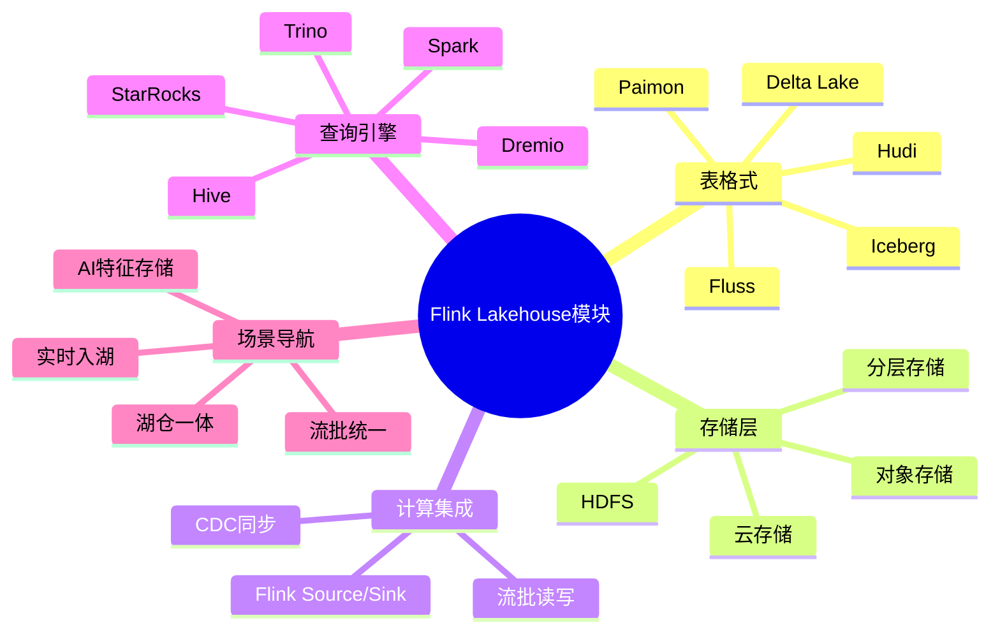
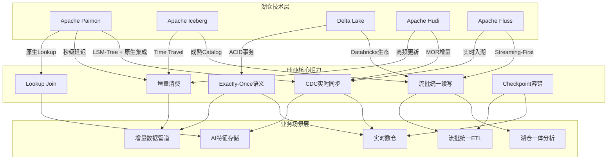
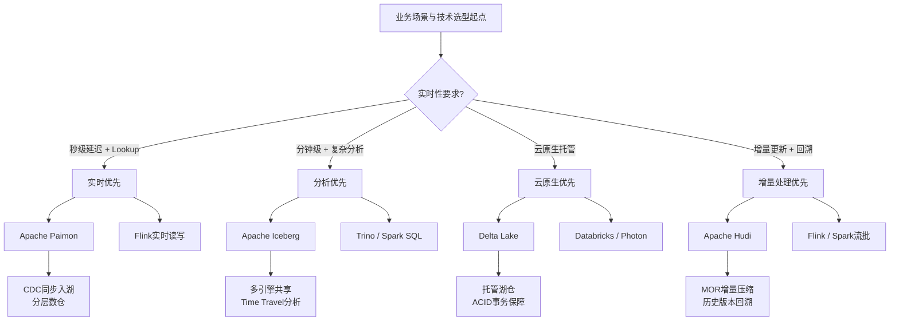

# Flink/14-lakehouse - 流式湖仓 (Streaming Lakehouse)

> **状态**: 已完成 | **最后更新**: 2026-04-02

本目录包含 Flink 与流式湖仓架构相关的技术文档，涵盖 Apache Iceberg、Apache Paimon、Delta Lake 等开放表格式的深度集成与实践。

---

## 文档索引

### 核心架构文档

| 文档 | 主题 | 关键内容 |
|------|------|----------|
| [streaming-lakehouse-deep-dive-2026.md](./streaming-lakehouse-deep-dive-2026.md) | **Streaming Lakehouse 深度技术解析 (2026)** | Open Table Formats 2026状态、Streaming-First趋势、四大格式深度对比、Catalog标准化、S3 Tables、Flink 2.0集成 |
| [streaming-lakehouse-architecture.md](./streaming-lakehouse-architecture.md) | 流式湖仓架构设计与实践 | Iceberg/Paimon/Delta 对比、Kappa+Lakehouse 架构、成本优化策略、生产案例 |
| [flink-iceberg-integration.md](./flink-iceberg-integration.md) | Flink + Iceberg 集成 | 流式读写语义、增量消费、Time Travel、Exactly-Once 保证 |
| [flink-paimon-integration.md](./flink-paimon-integration.md) | Flink + Paimon 集成 | LSM-Tree 架构、CDC 实时入湖、Lookup Join、分层数仓 |

---

## 核心概念速查

### 开放表格式对比

| 特性 | Iceberg | Paimon | Delta | Hudi |
|------|---------|--------|-------|------|
| **定位** | 通用数据湖 | Flink 原生 | Databricks | 增量处理 |
| **存储模型** | Copy-on-Write | LSM-Tree | Copy-on-Write | MOR/COW |
| **流延迟** | 分钟级 | 秒级 | 分钟级 | 秒级-分钟级 |
| **Flink 集成** | ⭐⭐⭐⭐ | ⭐⭐⭐⭐⭐ | ⭐⭐⭐ | ⭐⭐⭐⭐ |
| **Lookup Join** | 有限 | 原生支持 | 支持 | 支持 |
| **小文件处理** | 外部调度 | 原生异步 | 自动 | 自动 |

### 选型建议

```
Flink 为主 + 实时 Lookup → Apache Paimon
多引擎共享 + 成熟生态 → Apache Iceberg
高频更新 + 增量消费 → Apache Hudi (MOR)
Databricks 生态绑定 → Delta Lake
```

---

## 关键定理与定义

### 2026深度解析文档

- **Def-F-14-21**: Streaming-First Lakehouse Architecture 形式化定义
- **Def-F-14-22**: Open Table Format 2026 Maturity Model
- **Def-F-14-23**: Table Format 存储语义形式化
- **Def-F-14-24**: Catalog 标准化与治理抽象
- **Def-F-14-25**: S3 Tables与Storage-First架构
- **Thm-F-14-15**: Streaming-First Lakehouse一致性定理
- **Thm-F-14-16**: 多格式Catalog统一治理定理
- **Thm-F-14-17**: S3 Tables托管服务SLA边界定理
- **Thm-F-14-18**: Table Format选型决策完备性定理

### 架构设计文档

- **Def-F-14-05**: 流式湖仓架构形式化定义
- **Def-F-14-06**: Apache Iceberg 流式集成语义
- **Def-F-14-07**: Apache Paimon LSM-Tree 流批模型
- **Def-F-14-08**: Delta Lake 流式架构
- **Def-F-14-09**: 统一批流处理语义
- **Thm-F-14-04**: 统一批流结果一致性定理
- **Thm-F-14-05**: 湖仓格式端到端 Exactly-Once 语义定理
- **Thm-F-14-06**: 增量消费完备性定理

---

## 前置依赖

- [Flink/09-language-foundations/04-streaming-lakehouse.md](../../03-api/09-language-foundations/04-streaming-lakehouse.md)
- [Flink/02-core/checkpoint-mechanism-deep-dive.md](../../02-core/checkpoint-mechanism-deep-dive.md)

---

## 相关链接

- Apache Iceberg: <https://iceberg.apache.org/>
- Apache Paimon: <https://paimon.apache.org/>
- Delta Lake: <https://delta.io/>
- Apache Hudi: <https://hudi.apache.org/>

---

## 思维导图

Flink Lakehouse 模块知识体系总览：



---

## 多维关联树

Lakehouse 技术→Flink 能力→业务场景映射：



---

## 决策树

Lakehouse 技术选型决策流程：



---

## 引用参考

[^1]: Apache Iceberg Documentation, "Apache Iceberg", 2025. https://iceberg.apache.org/
[^2]: Apache Paimon Documentation, "Apache Paimon", 2025. https://paimon.apache.org/
[^3]: Delta Lake Documentation, "Delta Lake", 2025. https://delta.io/
[^4]: Apache Hudi Documentation, "Apache Hudi", 2025. https://hudi.apache.org/
[^5]: M. Armbrust et al., "Lakehouse: A New Generation of Open Platforms that Unify Data Warehousing and Advanced Analytics", CIDR 2021.
[^6]: Apache Flink Documentation, "Streaming Lakehouse", 2025. https://nightlies.apache.org/flink/flink-docs-stable/docs/connectors/table/

