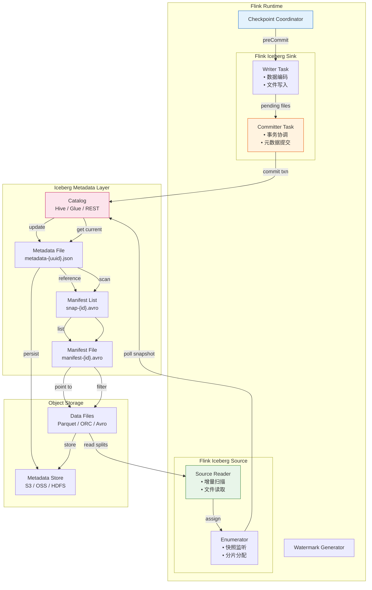
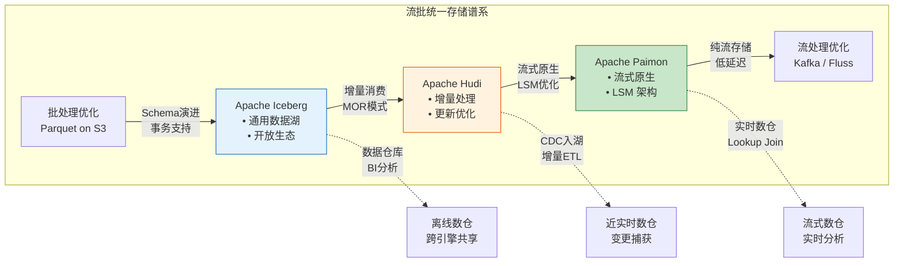
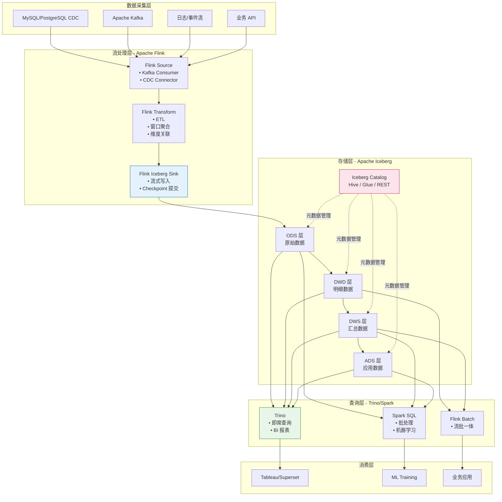
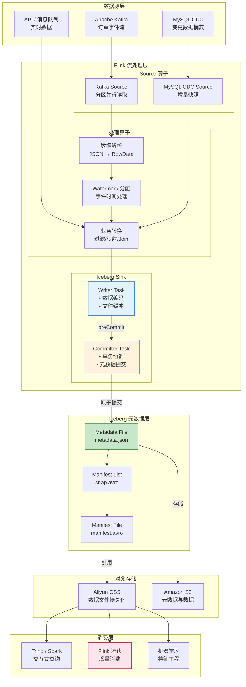
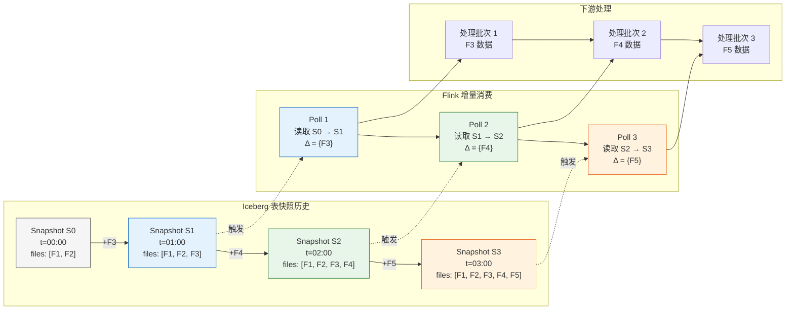
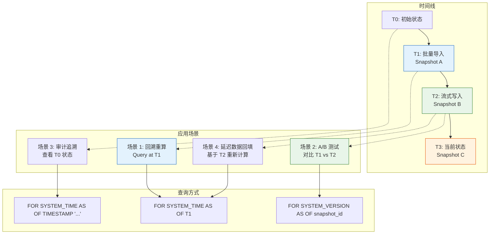
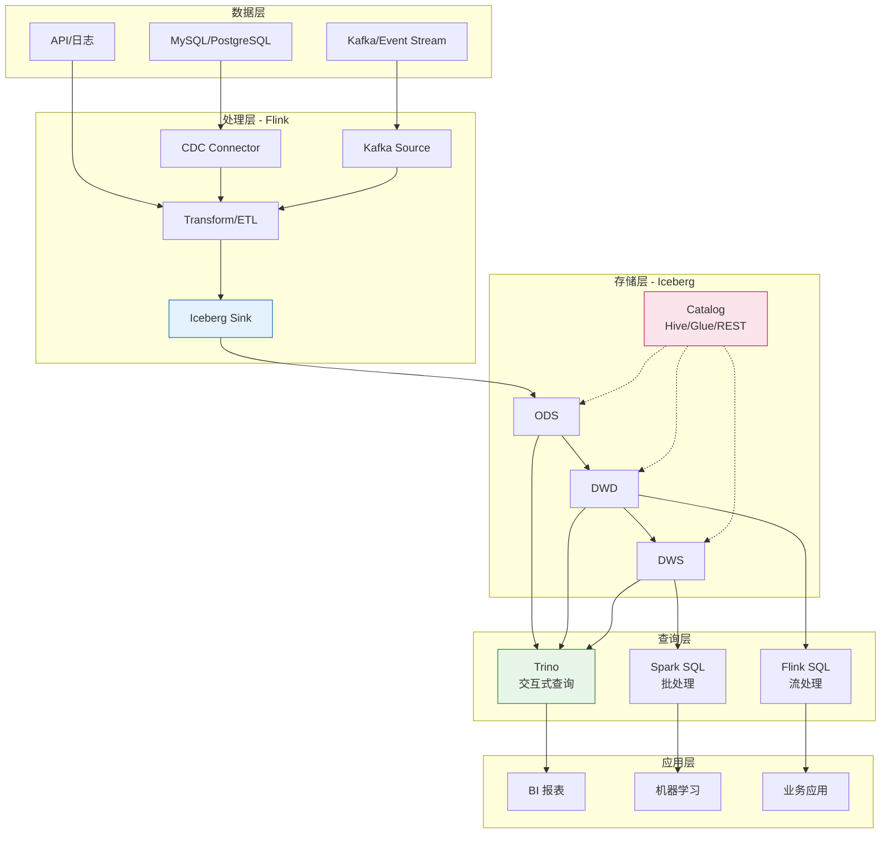

# Flink + Apache Iceberg 集成：流批统一的 Lakehouse 存储

> **所属阶段**: Flink/14-lakehouse/ | **前置依赖**: [Flink/09-language-foundations/04-streaming-lakehouse.md](../../03-api/09-language-foundations/04-streaming-lakehouse.md) | **形式化等级**: L4-L5 | **版本**: Flink 1.17+, Iceberg 1.4+

---

## 1. 概念定义 (Definitions)

### Def-F-14-01: Iceberg 表格式形式化定义

**定义**: Apache Iceberg 是一种**开放表格式 (Open Table Format)**，它通过分层元数据架构实现大规模数据集的 ACID 事务管理、模式演进和时间旅行查询。

**形式化结构**:

```
IcebergTable = ⟨Namespace, Schema, Snapshot, PartitionSpec, MetadataLayer⟩

其中:
- Namespace: 表的逻辑命名空间 (database.table)
- Schema: 列定义与类型系统,支持嵌套类型
- Snapshot: 不可变的时间点表状态集合
- PartitionSpec: 分区策略定义(支持隐藏分区)
- MetadataLayer: 三层元数据架构
```

**三层元数据架构形式化**:

```
MetadataLayer = ⟨CatalogLayer, SnapshotLayer, ManifestLayer⟩

CatalogLayer:
  └── metadata-pointer → 当前最新快照的 metadata.json 位置

SnapshotLayer (metadata-{uuid}.json):
  ├── snapshot_id: 唯一标识符
  ├── parent_snapshot_id: 父快照引用(形成 DAG)
  ├── manifest_list: 指向 manifest-list-{uuid}.avro
  ├── schema_id: 当前快照使用的 schema 版本
  ├── partition_spec_id: 分区规范 ID
  └── timestamp_ms: 快照创建时间戳

ManifestLayer:
  ├── manifest-list.avro: manifest 文件列表,含分区统计
  └── manifest.avro: 数据文件列表,含列级统计
```

**数据文件层级**:

```
Table Data Layout:
├── metadata/
│   ├── metadata-pointer → metadata-00003-{uuid}.json (当前)
│   ├── metadata-00001-{uuid}.json (快照 V1)
│   ├── metadata-00002-{uuid}.json (快照 V2)
│   ├── metadata-00003-{uuid}.json (快照 V3)
│   ├── snap-10001-{uuid}.avro (manifest list V1)
│   ├── snap-10002-{uuid}.avro (manifest list V2)
│   └── snap-10003-{uuid}.avro (manifest list V3)
└── data/
    ├── category=electronics/
    │   └── 00001-3-{uuid}.parquet
    ├── category=books/
    │   └── 00002-4-{uuid}.parquet
    └── category=clothing/
        └── 00003-5-{uuid}.parquet
```

---

### Def-F-14-02: Flink + Iceberg 流式读写语义

**定义**: Flink 与 Iceberg 的集成通过**两阶段提交协议**实现端到端的 Exactly-Once 语义，支持流式写入的增量可见性和流式读取的增量消费。

**流式写入语义形式化**:

```
设:
- Checkpoint 周期: T_chk
- 每个 Checkpoint 对应的事务: txn_i
- 数据文件集合写入: D_i = {d_i1, d_i2, ..., d_in}
- 元数据快照: S_i

事务提交序列:
  txn_1: D_1 → Pending Snapshot S_1 → Commit → Visible
  txn_2: D_2 → Pending Snapshot S_2 → Commit → Visible
  ...
  txn_n: D_n → Pending Snapshot S_n → Commit → Visible

可见性保证:
  ∀ t < T_commit(txn_i): Query(t) ∩ D_i = ∅
  ∀ t ≥ T_commit(txn_i): Query(t) ⊇ D_i
```

**流式读取语义形式化**:

```
增量消费模型:
  Consumer 维护消费位点: snapshot_id = s_k
  每次 poll 获取新快照: s_{k+1} = next_snapshot(s_k)
  变更数据: Δ = Files(s_{k+1}) \ Files(s_k)

消费保证:
  不遗漏: ∀ file f ∈ Δ_{k→k+1}, f ∈ Poll(k+1)
  不重复: ∀ file f ∈ Poll(k), f ∉ Poll(k'), k' > k
```

**语义对比矩阵**:

| 语义维度 | 批处理模式 | 流处理模式 |
|----------|-----------|-----------|
| **写入模式** | Overwrite/Append | Append Only |
| **提交触发** | 作业完成 | Checkpoint 完成 |
| **可见性延迟** | 作业级 | Checkpoint 间隔级 |
| **读取模式** | 全表扫描 | 增量扫描 |
| **一致性保证** | 快照隔离 | 增量快照隔离 |

---

### Def-F-14-03: 增量快照与元数据管理

**定义**: 增量快照机制是 Iceberg 支持高效流式消费的核心，通过**不可变文件集合**和**快照 DAG**实现变更追踪，避免全量数据扫描。

**快照图结构形式化**:

```
SnapshotGraph = (V, E)

V = {s_0, s_1, s_2, ..., s_n}  -- 快照节点集合
E = {(s_i, s_j) | s_j.parent = s_i}  -- 父子关系边

性质:
1. 有向无环图 (DAG): ∀ path P in G, no cycle exists
2. 根快照: ∃! s_root ∈ V: indegree(s_root) = 0
3. 当前快照: s_current = metadata-pointer.target
4. 历史快照: V_history = {s | s ∈ V, s ≠ s_current}
```

**增量扫描算法形式化**:

```
Algorithm: IncrementalScan(s_from, s_to)
Input: 起始快照 s_from, 目标快照 s_to
Output: 新增数据文件集合 ΔFiles

1. 计算快照路径:
   path = findPath(s_from, s_to)  // BFS/DFS 找最短路径

2. 遍历路径收集变更:
   ΔManifests = ∅
   for each s_i in path:
       ΔManifests += s_i.manifests \ s_{i-1}.manifests

3. 提取数据文件:
   ΔFiles = ∪_{m ∈ ΔManifests} m.data_files

4. 返回 ΔFiles

时间复杂度: O(|path| × avg_manifests_per_snapshot)
空间复杂度: O(ΔFiles)
```

**元数据压缩策略**:

| 策略类型 | 触发条件 | 操作内容 | 对消费影响 |
|----------|----------|----------|-----------|
| **Metadata 合并** | 小文件数 > 阈值 | 合并相邻 snapshot 的 manifest | 无（保持快照语义） |
| **Manifest 重写** | 分区文件碎片化 | 按分区重新组织 manifest | 无（原子替换） |
| **快照过期** | 保留策略触发 | 删除过期快照及孤立文件 | 消费者需更新位点 |
| **孤儿文件清理** | 定期调度 | 删除无引用的数据文件 | 需确保无并发读取 |

---

### Def-F-14-04: Time Travel 在流处理中的应用

**定义**: Time Travel 是 Iceberg 基于**不可变快照**实现的历史数据回溯能力，在流处理中支持**延迟数据处理**、**回溯重算**和**A/B 测试**。

**时间旅行形式化模型**:

```
时间旅行查询:
  Q(t) = {r | r ∈ S(t).files, r.creation_time ≤ t}

  其中:
  - t: 目标时间戳或快照 ID
  - S(t): 时间 t 对应的快照
  - r: 数据记录

时间旅行类型:
  1. 基于快照 ID: Q(snapshot_id = sid)
  2. 基于时间戳: Q(timestamp_ms = ts)
  3. 基于相对时间: Q(as_of = "3 days ago")
```

**流处理应用场景**:

```
场景 1: 延迟数据回填 (Late Arrival Backfill)
┌─────────────────────────────────────────────────────────────┐
│  T0 ────── T1 ────── T2 ────── T3 ────── T4 ────── T5     │
│  │          │          │          │          │          │   │
│  ▼          ▼          ▼          ▼          ▼          ▼   │
│ [D0]      [D1]      [D2]      [D3]      [D4]      [D5]     │
│                              ↑                              │
│                         延迟数据到达                         │
│                              │                              │
│                    触发 T2 时刻回溯重算                       │
│                              ▼                              │
│                         Q(as_of = T2)                       │
└─────────────────────────────────────────────────────────────┘

场景 2: 流作业状态恢复 (Resume from Historical State)
┌─────────────────────────────────────────────────────────────┐
│  故障发生时间: T_f                                          │
│  恢复目标时间: T_r < T_f                                    │
│                                                             │
│  恢复操作:                                                  │
│  1. 读取 Iceberg 快照 S(T_r)                                │
│  2. 从 S(T_r) 对应的 Kafka offset 恢复消费                  │
│  3. 重放 T_r 到 T_f 期间的变更                              │
└─────────────────────────────────────────────────────────────┘
```

---

### Def-F-14-05: Hidden Partitioning（隐藏分区）

**定义**: Hidden Partitioning 是 Iceberg 的核心特性，允许数据按**派生列**分区，而无需用户显式创建分区列，实现分区策略的透明化。

**形式化定义**:

```
隐藏分区函数: H: Domain(SourceColumn) → Domain(PartitionColumn)

常见隐藏分区函数:
- Year(ts):   TIMESTAMP → INT (年份)
- Month(ts):  TIMESTAMP → INT (年月编码)
- Day(ts):    TIMESTAMP → INT (日期)
- Hour(ts):   TIMESTAMP → INT (小时)
- Bucket(n, col):  ANY → INT (哈希分桶,0..n-1)
- Truncate(w, col): STRING → STRING (前缀截断)
```

**与传统 Hive 分区对比**:

| 特性 | Hive 分区 | Iceberg 隐藏分区 |
|------|-----------|------------------|
| **分区列可见性** | 显式列（如 `dt STRING`） | 透明（无物理列） |
| **分区值生成** | 用户负责（INSERT 时指定） | 自动派生（基于源列） |
| **分区演进** | 需重建表 | 支持在线变更 |
| **查询语法** | `WHERE dt='2024-01-01'` | `WHERE event_time >= '2024-01-01'` |

**Flink SQL 隐藏分区示例**:

```sql
-- 创建带隐藏分区的 Iceberg 表
CREATE TABLE events (
    event_id STRING,
    user_id STRING,
    event_time TIMESTAMP(3),
    payload STRING
) PARTITIONED BY (
    -- 按天分区,基于 event_time 自动派生
    days(event_time),
    -- 按 user_id 哈希分 16 桶
    bucket(16, user_id)
) WITH (
    'connector' = 'iceberg',
    'catalog-name' = 'iceberg_catalog'
);

-- 查询时无需指定分区列,自动分区裁剪
SELECT * FROM events
WHERE event_time >= TIMESTAMP '2024-01-01 00:00:00'
  AND event_time < TIMESTAMP '2024-01-02 00:00:00';
```

---

### Def-F-14-06: Snapshot Isolation（快照隔离）

**定义**: Snapshot Isolation 是 Iceberg 的 ACID 保证机制，确保读写操作在**快照级别**互不影响，实现无锁并发控制。

**形式化模型**:

```
事务 T_i 的操作集: Ops(T_i) = {read_set(T_i), write_set(T_i)}

快照隔离条件:
  ∀ T_i, T_j (i ≠ j):
    1. 读一致性: read_set(T_i) 基于快照 S(T_i.start_time)
    2. 写隔离: write_set(T_i) ∩ write_set(T_j) = ∅ ∨ T_i 先提交
    3. 不可重复读保护: T_i 内多次读取同一快照

冲突检测:
  冲突(T_i, T_j) = write_set(T_i) ∩ write_set(T_j) ≠ ∅
                   ∧ commit_time(T_i) 与 commit_time(T_j) 重叠
```

**乐观并发控制 (OCC) 流程**:

```
事务生命周期:
┌─────────────────────────────────────────────────────────────┐
│  1. 开始: 获取当前快照指针 → S_base                          │
│                                                             │
│  2. 读取: 所有读操作基于 S_base 的快照状态                    │
│                                                             │
│  3. 写入: 生成新数据文件,本地构建 S_new                     │
│                                                             │
│  4. 提交: CAS 操作更新元数据指针                              │
│     - 成功: 如果当前指针仍指向 S_base                       │
│     - 失败: 如果指针已被其他事务更新,重试                   │
└─────────────────────────────────────────────────────────────┘
```

---

## 2. 属性推导 (Properties)

### Lemma-F-14-01: Iceberg 快照的不可变性与线性历史

**引理**: Iceberg 的快照一旦创建即为不可变对象，且快照历史形成严格的偏序关系。

**证明**:

```
给定:
- 快照创建操作: create_snapshot(parent, files) → snapshot
- 快照提交操作: commit(snapshot) → 元数据原子更新

不可变性证明:
  设快照 s = (id, parent_id, manifest_list, timestamp)
  由于 manifest_list 引用的是不可变的 Avro 文件,
  且元数据 JSON 文件写入后不可修改(对象存储语义),
  ∴ s 的所有字段在创建后不可变更。

线性历史证明:
  定义偏序关系 ≤: s_i ≤ s_j  iff  s_j 可通过 parent 链追溯到 s_i

  自反性: s ≤ s (显然成立)

  反对称性: 若 s_i ≤ s_j 且 s_j ≤ s_i,
           则 s_i.parent* = s_j 且 s_j.parent* = s_i
           由于 parent 关系是 DAG,不存在环路,
           ∴ s_i = s_j

  传递性: 若 s_i ≤ s_j 且 s_j ≤ s_k,
         则 s_k.parent* = s_j, s_j.parent* = s_i
         ∴ s_k.parent* = s_i,即 s_i ≤ s_k

  ∴ 快照历史构成偏序集 (V, ≤) ∎
```

---

### Prop-F-14-01: Flink 流式写入的幂等性保证

**命题**: 在 Flink Checkpoint 失败并重启的场景下，Iceberg Sink 的写入操作具有幂等性，不会导致重复数据。

**推导**:

```
场景设定:
- Checkpoint N 触发,Iceberg Sink 进入 preCommit 阶段
- 写入数据文件到临时位置,生成 pending snapshot
- Checkpoint N 失败,作业重启

幂等性保证:
┌─────────────────────────────────────────────────────────────┐
│ Step 1: 重启后从 Checkpoint N-1 恢复                        │
│                                                             │
│ Step 2: 重新处理数据,再次触发 preCommit                    │
│         - 相同输入数据 → 相同数据文件内容                     │
│         - Iceberg 文件命名包含 UUID,新文件路径不同           │
│                                                             │
│ Step 3: Checkpoint N 成功,调用 commit                      │
│         - 新 snapshot 提交成功                              │
│         - 旧 pending snapshot 无人引用,成为孤儿             │
│                                                             │
│ Step 4: 孤儿文件清理作业定期删除未引用文件                    │
│         - 临时数据文件被清理                                │
└─────────────────────────────────────────────────────────────┘

结论: 即使 Checkpoint 多次失败重试,最终数据不重复 ∎
```

---

### Prop-F-14-02: 增量消费的时间边界一致性

**命题**: Flink 从 Iceberg 的增量消费满足时间边界一致性，即消费者读取的快照序列与数据产生的时间序一致。

**形式化表述**:

```
设:
- 数据记录 r_i 的 event_time: e(r_i)
- 数据记录 r_i 写入快照 s_j 的 commit_time: c(s_j)
- 消费者读取快照的序列: [s_1, s_2, ..., s_n]

时间边界一致性条件:
  ∀ r ∈ s_i: c(s_{i-1}) ≤ c(s_i) ∧ e(r) 有界

  且 ∀ r_k ∈ s_i, r_l ∈ s_{i+1}: c(s_i) < c(s_{i+1})

证明:
  Iceberg 快照的 timestamp_ms 是单调递增的:
  timestamp_ms(s_i) = commit_time(s_i)

  由于 Flink 按 snapshot_id 顺序消费,
  且 snapshot_id 与 timestamp_ms 正相关(非严格单调),

  ∴ 消费序列保持了时间顺序 ∎
```

---

## 3. 关系建立 (Relations)

### 3.1 Flink + Iceberg 架构关系图



---

### 3.2 与 Apache Hudi 的对比关系

| 对比维度 | Apache Iceberg | Apache Hudi | 影响分析 |
|----------|---------------|-------------|----------|
| **核心设计** | 表格式规范优先 | 存储引擎能力优先 | Iceberg 更开放，Hudi 功能更完整 |
| **更新模式** | Copy-on-Write | MOR / COW | Hudi MOR 写放大更低 |
| **增量查询** | 基于快照差集 | 基于时间线服务 | Hudi 增量消费更成熟 |
| **Compaction** | 外部调度（Spark/Flink） | 内置服务 | Hudi 运维更简单 |
| **Flink 集成** | 连接器模式 | 连接器模式 | Iceberg 社区更大 |
| **并发控制** | Optimistic Concurrency | MVCC | Hudi 并发写入更优 |
| **时间旅行** | 完整快照历史 | 基于时间线 | 两者功能对等 |
| **小文件管理** | 需外部优化 | 自动合并 | Hudi 更省心 |

**选型决策树**:

```
IF (更新频率 > 高频) AND (写延迟敏感):
    → Apache Hudi (MOR模式)
ELSE IF (多引擎共享 = 高优先级):
    → Apache Iceberg
ELSE IF (CDC 实时入湖 + 增量消费):
    → Apache Hudi 或 Apache Paimon
ELSE IF (Flink 原生体验 = 最高优先级):
    → Apache Paimon
ELSE:
    → Apache Iceberg (通用默认)
```

---

### 3.3 与 Apache Paimon 的对比关系

| 对比维度 | Apache Iceberg | Apache Paimon | 关键差异 |
|----------|---------------|---------------|----------|
| **定位** | 通用开放表格式 | Flink 原生流批存储 | Paimon 更专注流场景 |
| **存储模型** | 不可变文件集 | LSM Tree + 文件 | Paimon 支持实时更新 |
| **流式延迟** | 分钟级（Checkpoint） | 秒级（异步 Compaction） | Paimon 延迟更低 |
| **Lookup Join** | 有限支持 | 原生支持 | Paimon 更适合维表 |
| **Changelog 生产** | 外部转换 | 内置支持 | Paimon CDC 更高效 |
| **社区归属** | Apache TLP | Apache Incubator | Iceberg 更成熟 |
| **生态广度** | Spark/Flink/Trino/Dremio | 主要为 Flink | Iceberg 生态更广 |

**关系定位图**:



---

### 3.4 Flink + Iceberg + Trino 统一架构

**定义**: 统一湖仓架构结合 Flink（流处理）、Iceberg（存储格式）、Trino（交互式查询），实现真正的流批统一。



---

## 4. 论证过程 (Argumentation)

### 4.1 为何 Flink 需要 Iceberg

**传统流批分离架构的问题**:

```
Lambda 架构痛点:
┌─────────────────────────────────────────────────────────────┐
│  流处理层 (Kafka + Flink)                                    │
│  ├── 低延迟,但存储成本高(SSD/内存)                         │
│  └── 数据保留期短(天级)                                    │
│                                                             │
│  批处理层 (Hive + Spark)                                     │
│  ├── 低成本对象存储(S3/OSS)                                │
│  └── 数据保留期长(年级)                                    │
│                                                             │
│  问题:                                                       │
│  1. 数据冗余: 同一份数据存两份                               │
│  2. Schema 分裂: 流 Schema ≠ 批 Schema                       │
│  3. 结果不一致: 流统计 ≠ 批统计(让用户困惑)                 │
└─────────────────────────────────────────────────────────────┘

Iceberg 统一方案:
┌─────────────────────────────────────────────────────────────┐
│  统一存储层 (Iceberg on S3)                                  │
│  ├── 流写入: Flink Checkpoint 提交事务                       │
│  ├── 批查询: Spark/Trino 全表扫描                            │
│  └── 增量消费: Flink 流读变更数据                            │
│                                                             │
│  优势:                                                       │
│  1. 单一真相源: 一份数据,多种访问模式                        │
│  2. Schema 统一: 元数据层统一管理                            │
│  3. 结果一致: 相同快照保证相同结果                            │
└─────────────────────────────────────────────────────────────┘
```

---

### 4.2 Iceberg 流式写入的性能边界

**性能影响因素分析**:

| 因素 | 影响机制 | 优化策略 |
|------|----------|----------|
| **Checkpoint 间隔** | 决定事务提交频率 | 平衡延迟与吞吐（推荐 30s-5min） |
| **文件大小** | 影响扫描效率 | 目标 128MB/256MB |
| **分区粒度** | 影响文件数量和元数据大小 | 避免过细分区 |
| **并发写入** | 乐观并发控制可能冲突 | 使用独立分区或序列化写入 |
| **小文件数量** | 影响元数据扫描和读取性能 | 定期 Compaction |

**性能边界量化**:

```
场景: 10,000 条/秒写入,平均记录大小 1KB

配置参数:
- Checkpoint 间隔: 60s
- 目标文件大小: 128MB
- 分区策略: 按天分区

理论计算:
- 每 Checkpoint 数据量: 10,000 × 60 × 1KB = 600MB
- 每 Checkpoint 生成文件数: 600MB / 128MB ≈ 5 个文件
- 每小时生成文件数: 5 × 60 = 300 个文件/小时
- 每天生成文件数: 300 × 24 = 7,200 个文件/天

边界约束:
- Iceberg 元数据文件建议 < 100MB
- 单个 manifest 文件可引用约 50,000 个数据文件
- ∴ 单表可支持约 50,000 × 文件滚动周期 的数据量
```

---

### 4.3 Time Travel 的工程权衡

**保留策略的权衡矩阵**:

| 保留策略 | 历史深度 | 存储成本 | 元数据压力 | 适用场景 |
|----------|----------|----------|-----------|----------|
| **激进保留** (1天) | 浅 | 低 | 低 | 纯实时场景 |
| **标准保留** (7天) | 中 | 中 | 中 | 通用场景 |
| **深度保留** (30天) | 深 | 高 | 高 | 审计/合规场景 |
| **永久保留** | 全量 | 很高 | 很高 | 特殊归档需求 |

**过期快照清理的影响**:

```
快照过期流程:
1. 标记过期快照: 根据保留策略筛选
2. 检查引用关系: 确保无活跃查询使用
3. 删除孤立文件: 移除未被任何快照引用的数据文件

风险边界:
┌─────────────────────────────────────────────────────────────┐
│  风险 1: 长查询导致数据无法清理                              │
│  缓解: 设置查询超时,或使用快照提示强制过期                   │
│                                                             │
│  风险 2: 级联删除误删数据                                    │
│  缓解: 启用垃圾回收保护期(如 7 天)                          │
│                                                             │
│  风险 3: 元数据膨胀影响性能                                  │
│  缓解: 定期压缩元数据文件,删除历史版本                       │
└─────────────────────────────────────────────────────────────┘
```

---

### 4.4 UPSERT vs Append 模式选择

**形式化对比**:

```
Append 模式:
  操作: T_append(R) = Table ∪ R
  特性: 仅追加,不可变
  适用: 事件流、日志、时序数据

UPSERT 模式 (基于 Equality Delete):
  操作: T_upsert(K, R) = (Table \ {r | r.K = R.K}) ∪ {R}
  特性: 按主键更新,支持删除
  适用: CDC 同步、维度表、状态表
```

**实现机制对比**:

| 维度 | Append 模式 | UPSERT 模式 |
|------|-------------|-------------|
| **写入路径** | 直接追加数据文件 | 数据文件 + Equality Delete 文件 |
| **读取开销** | 无额外开销 | 需合并 Delete 文件过滤 |
| **Compaction** | 简单文件合并 | 需处理 Delete 文件合并 |
| **延迟** | Checkpoint 间隔 | Checkpoint 间隔 + 合并延迟 |
| **存储放大** | 1x | 1.2-2x（含 Delete 文件） |

**选择决策矩阵**:

```
IF 数据源是 CDC (MySQL/PostgreSQL):
    IF 表有主键 AND 需要更新/删除:
        → UPSERT 模式
    ELSE:
        → Append 模式
ELSE IF 数据源是事件流 (Kafka):
    → Append 模式(事件天然追加)
ELSE IF 需要维护最新状态:
    → UPSERT 模式 + 定期 Compaction
ELSE:
    → Append 模式(默认,性能最优)
```

---

## 5. 形式证明 / 工程论证 (Proof / Engineering Argument)

### Thm-F-14-01: Flink + Iceberg 端到端 Exactly-Once 语义定理

**定理**: 在 Flink 与 Iceberg 的集成中，通过两阶段提交协议，可以保证端到端的 Exactly-Once 处理语义。

**证明**:

```
前提假设:
- P1: Flink Checkpoint 机制保证作业状态的 Exactly-Once
- P2: Iceberg 元数据更新是原子操作(基于对象存储的 put-if-absent)
- P3: 数据文件写入和元数据提交满足因果序

两阶段提交流程形式化:
┌────────────────────────────────────────────────────────────────────┐
│ Phase 1: Pre-commit                                               │
│ ───────────────────────────────────────────────────────────────── │
│ 输入: 待写入数据记录集合 R = {r_1, r_2, ..., r_n}                  │
│                                                                  │
│ 操作:                                                             │
│ 1. Writer 将 R 编码为数据文件集合 F = encode(R)                    │
│ 2. 将 F 写入对象存储的临时位置                                      │
│ 3. 生成 pending snapshot P = (parent, manifest_list(F))           │
│ 4. 向 Coordinator 汇报 P 和写入的文件列表                           │
│                                                                  │
│ 不变式 I1: F 已持久化到对象存储,但尚未被任何查询可见               │
└────────────────────────────────────────────────────────────────────┘

┌────────────────────────────────────────────────────────────────────┐
│ Phase 2: Commit                                                   │
│ ───────────────────────────────────────────────────────────────── │
│ 触发条件: Checkpoint 成功(所有算子完成 preCommit)               │
│                                                                  │
│ 操作:                                                             │
│ 1. Committer 按 Checkpoint 顺序提交 pending snapshots             │
│ 2. 对 P 执行 commit_transaction():                                │
│    a. 读取当前 metadata-pointer 指向的 M_current                  │
│    b. 基于 M_current 创建新的 metadata M_new,包含 P               │
│    c. 原子更新 metadata-pointer → M_new(CAS 操作)               │
│ 3. 通知 Coordinator 提交完成                                      │
│                                                                  │
│ 不变式 I2: P 已永久成为表历史的一部分,查询可见                    │
└────────────────────────────────────────────────────────────────────┘

故障恢复分析:
Case 1: Checkpoint 失败,Phase 2 未执行
  - pending snapshot P 未被提交
  - 作业从上一个成功 Checkpoint 恢复
  - R 被重新处理,生成新的 P'
  - 由于 I1,P 中的文件不影响正确性

Case 2: Commit 过程中 Committer 失败
  - 部分 P 可能已提交,部分未提交
  - 新的 Committer 从 Checkpoint 恢复
  - 对未提交的 P 重新执行 commit_transaction()
  - Iceberg 的 CAS 保证幂等性(重复提交同一 P 无影响)

Case 3: Writer 失败,数据文件写入不完整
  - Checkpoint 失败,进入 Case 1
  - 孤儿文件由后台清理作业处理

综上,端到端 Exactly-Once 得证 ∎
```

---

### Thm-F-14-02: 增量消费完备性定理

**定理**: Flink 从 Iceberg 的增量消费保证**不遗漏**、**不重复**、**有序**三大性质。

**证明**:

```
定义:
- 快照序列: S = [s_1, s_2, ..., s_n],其中 s_i.parent = s_{i-1}
- 消费者位点: c = 当前消费到的 snapshot_id
- 增量批次: B_i = scan_incremental(s_i, s_{i+1})

不遗漏证明:
  需证: ∀ record r ∈ Table, ∃ B_i: r ∈ B_i

  由于 Iceberg 表的所有数据都存在于某个快照中,
  且快照序列 S 覆盖了表的全部历史,
  设 r ∈ s_k.files,则当消费者从 s_{k-1} 消费到 s_k 时,
  r ∈ B_{k-1}

  ∴ 不遗漏 ∎

不重复证明:
  需证: ∀ record r, |{B_i | r ∈ B_i}| ≤ 1

  由于 Iceberg 快照的不可变性,
  一旦 r 被写入 s_k,则 ∀ s_j (j ≥ k): r ∈ s_j.files

  增量扫描算法: B_i = files(s_{i+1}) \ files(s_i)

  对于 r ∈ s_k:
  - 若 i+1 < k: r ∉ files(s_{i+1}),∴ r ∉ B_i
  - 若 i+1 = k: r ∈ files(s_k) 且 r ∉ files(s_{k-1}),∴ r ∈ B_{k-1}
  - 若 i+1 > k: r ∈ files(s_i) 且 r ∈ files(s_{i+1}),∴ r ∉ B_i

  ∴ r 仅出现在 B_{k-1} 中,不重复 ∎

有序性证明:
  需证: ∀ i < j, ∀ r_i ∈ B_i, r_j ∈ B_j: order(r_i) < order(r_j)

  由于快照序列按 commit_time 排序,
  且数据文件在快照中的可见性与 commit_time 一致,

  若 r_i ∈ B_i = scan(s_i, s_{i+1}),
     r_j ∈ B_j = scan(s_j, s_{j+1}),
     且 i < j
  则 r_i 的 commit_time < r_j 的 commit_time

  ∴ 有序性得证 ∎
```

---

### Thm-F-14-03: Time Travel 一致性定理

**定理**: Iceberg 的 Time Travel 查询在任意时间点 t 都能返回一致的数据快照。

**证明**:

```
定义:
- 查询时间: t_q
- 目标时间: t_target ≤ t_q
- 快照映射函数: snapshot(t) = argmax_{s ∈ Snapshots} {s.timestamp ≤ t}

一致性条件:
  Query(t_target) 返回 snapshot(t_target) 的完整数据状态,
  且该状态不包含 snapshot(t_target).timestamp 之后写入的数据。

证明:
  Step 1: 快照选择的确定性
    snapshot(t) 函数返回唯一的快照 s_k,满足:
    - s_k.timestamp ≤ t < s_{k+1}.timestamp
    - 由于快照时间戳单调递增,s_k 唯一确定

  Step 2: 快照状态的完整性
    根据 Iceberg 元数据结构,snapshot s_k 包含:
    - 完整的 manifest_list 引用
    - 所有祖先快照的 manifest 集合
    - 因此包含 snapshot(t) 时刻的全部数据

  Step 3: 快照状态的隔离性
    由于快照不可变,且新数据只能写入新快照,
    ∀ s_j (j > k): s_j 的数据文件不会被 s_k 引用

    ∴ Query(t_target) 不会返回 t_target 之后的数据

  综上,Time Travel 一致性得证 ∎
```

---

## 6. 实例验证 (Examples)

### 6.1 Flink SQL 完整示例

#### 6.1.1 创建 Iceberg Catalog 和表

```sql
-- ============================================
-- 步骤 1: 创建 Iceberg Catalog
-- ============================================
CREATE CATALOG iceberg_catalog WITH (
    'type' = 'iceberg',
    'catalog-type' = 'hive',  -- 或 'hadoop', 'rest'
    'uri' = 'thrift://hive-metastore:9083',
    'warehouse' = 'oss://my-bucket/iceberg-warehouse',
    'io-impl' = 'org.apache.iceberg.aliyun.oss.OSSFileIO'
);

USE CATALOG iceberg_catalog;
CREATE DATABASE IF NOT EXISTS ecommerce;
USE ecommerce;

-- ============================================
-- 步骤 2: 创建 Iceberg 表(支持流式读写)
-- ============================================
CREATE TABLE IF NOT EXISTS user_orders (
    order_id STRING,
    user_id STRING,
    product_id STRING,
    amount DECIMAL(18, 2),
    status STRING,
    order_time TIMESTAMP(3),
    PRIMARY KEY (order_id) NOT ENFORCED
) PARTITIONED BY (days(order_time)) WITH (
    -- 写入配置
    'write.format.default' = 'parquet',
    'write.parquet.compression-codec' = 'zstd',
    'write.parquet.compression-level' = '3',
    'write.target-file-size-bytes' = '134217728',  -- 128MB

    -- 元数据配置
    'commit.manifest.min-count-to-merge' = '5',
    'commit.manifest-merge-enabled' = 'true',

    -- 快照保留策略
    'history.expire.max-snapshot-age-ms' = '604800000',  -- 7天
    'history.expire.min-snapshots-to-keep' = '5',

    -- 流读配置
    'read.streaming.enabled' = 'true',
    'read.streaming.start-mode' = 'earliest',  -- 或 'latest'
    'monitor-interval' = '10s'
);
```

#### 6.1.2 流式写入数据

```sql
-- ============================================
-- 步骤 3: 从 Kafka 流式写入 Iceberg
-- ============================================

-- 创建 Kafka Source 表
CREATE TABLE kafka_orders (
    order_id STRING,
    user_id STRING,
    product_id STRING,
    amount DECIMAL(18, 2),
    status STRING,
    order_time TIMESTAMP(3),
    WATERMARK FOR order_time AS order_time - INTERVAL '5' SECOND
) WITH (
    'connector' = 'kafka',
    'topic' = 'orders',
    'properties.bootstrap.servers' = 'kafka:9092',
    'properties.group.id' = 'iceberg-sink-group',
    'scan.startup.mode' = 'earliest-offset',
    'format' = 'json',
    'json.fail-on-missing-field' = 'false',
    'json.ignore-parse-errors' = 'true'
);

-- 启动流式写入作业
INSERT INTO user_orders
SELECT order_id, user_id, product_id, amount, status, order_time
FROM kafka_orders;

-- ============================================
-- 步骤 4: CDC 数据入湖(Upsert 模式)
-- ============================================
CREATE TABLE mysql_orders_cdc (
    order_id STRING,
    user_id STRING,
    product_id STRING,
    amount DECIMAL(18, 2),
    status STRING,
    order_time TIMESTAMP(3),
    PRIMARY KEY (order_id) NOT ENFORCED
) WITH (
    'connector' = 'mysql-cdc',
    'hostname' = 'mysql-host',
    'port' = '3306',
    'username' = 'flink_user',
    'password' = '${MYSQL_PASSWORD}',
    'database-name' = 'ecommerce',
    'table-name' = 'orders',
    'server-time-zone' = 'Asia/Shanghai'
);

-- 使用 UPSERT 模式处理 CDC 变更
SET 'execution.checkpointing.interval' = '60s';

INSERT INTO user_orders
SELECT * FROM mysql_orders_cdc;
```

#### 6.1.3 流式读取数据

```sql
-- ============================================
-- 步骤 5: 增量消费 Iceberg 数据
-- ============================================

-- 创建流式读取视图
SET 'execution.runtime-mode' = 'streaming';

-- 方式 1: SQL 增量消费
SELECT
    order_id,
    user_id,
    amount,
    status,
    order_time,
    -- Iceberg 元数据列
    __iceberg_file_path,
    __iceberg_pos,
    __iceberg_spec_id
FROM user_orders
/*+ OPTIONS(
    'streaming' = 'true',
    'monitor-interval' = '5s',
    'start-snapshot-id' = '1234567890'
) */;

-- 方式 2: 消费变更数据(CDC 模式)
CREATE TABLE iceberg_orders_changes (
    order_id STRING,
    user_id STRING,
    amount DECIMAL(18, 2),
    status STRING,
    order_time TIMESTAMP(3),
    -- 变更类型元数据
    _change_type STRING,  -- INSERT, UPDATE_BEFORE, UPDATE_AFTER, DELETE
    _change_timestamp TIMESTAMP(3)
) WITH (
    'connector' = 'iceberg',
    'catalog-name' = 'iceberg_catalog',
    'catalog-database' = 'ecommerce',
    'catalog-table' = 'user_orders',
    'streaming' = 'true',
    'streaming-scheme' = 'incremental-snapshot',
    'monitor-interval' = '10s'
);

-- 将变更数据写入下游 Kafka
INSERT INTO kafka_order_changes
SELECT
    order_id,
    user_id,
    amount,
    status,
    CASE _change_type
        WHEN 'INSERT' THEN 'CREATED'
        WHEN 'UPDATE_AFTER' THEN 'UPDATED'
        WHEN 'DELETE' THEN 'DELETED'
    END AS event_type,
    _change_timestamp
FROM iceberg_orders_changes
WHERE _change_type IN ('INSERT', 'UPDATE_AFTER', 'DELETE');
```

#### 6.1.4 Time Travel 查询

```sql
-- ============================================
-- 步骤 6: Time Travel 时间旅行查询
-- ============================================

-- 查询历史快照列表
SELECT * FROM user_orders$snapshots;

-- 基于快照 ID 查询
SELECT * FROM user_orders FOR SYSTEM_VERSION AS OF 1234567890123;

-- 基于时间戳查询
SELECT * FROM user_orders
FOR SYSTEM_TIME AS OF TIMESTAMP '2026-03-01 00:00:00';

-- 基于相对时间查询
SELECT * FROM user_orders
FOR SYSTEM_TIME AS OF TIMESTAMP '2026-04-02 00:00:00' - INTERVAL '7' DAY;

-- 流处理中使用 Time Travel(回溯重算)
INSERT INTO result_table
SELECT
    DATE_FORMAT(order_time, 'yyyy-MM-dd') AS dt,
    COUNT(*) AS order_count,
    SUM(amount) AS total_amount
FROM user_orders
FOR SYSTEM_TIME AS OF TIMESTAMP '2026-03-15 00:00:00'
WHERE order_time >= TIMESTAMP '2026-03-01 00:00:00'
GROUP BY DATE_FORMAT(order_time, 'yyyy-MM-dd');
```

---

### 6.2 DataStream API 完整示例

#### 6.2.1 流式写入 Iceberg

```java
import org.apache.flink.streaming.api.datastream.DataStream;
import org.apache.flink.streaming.api.environment.StreamExecutionEnvironment;
import org.apache.flink.table.data.RowData;
import org.apache.iceberg.flink.FlinkCatalog;
import org.apache.iceberg.flink.sink.FlinkSink;
import org.apache.iceberg.Table;
import org.apache.iceberg.catalog.Catalog;
import org.apache.iceberg.catalog.TableIdentifier;
import org.apache.iceberg.hive.HiveCatalog;
import org.apache.iceberg.Schema;
import org.apache.iceberg.types.Types;
import org.apache.hadoop.hive.conf.HiveConf;

import org.apache.flink.streaming.api.CheckpointingMode;
import org.apache.flink.api.common.typeinfo.Types;


public class IcebergStreamWriteExample {

    public static void main(String[] args) throws Exception {
        StreamExecutionEnvironment env =
            StreamExecutionEnvironment.getExecutionEnvironment();

        // 启用 Checkpoint,这是 Exactly-Once 的前提
        env.enableCheckpointing(60000);  // 60 秒
        env.getCheckpointConfig().setCheckpointingMode(
            CheckpointingMode.EXACTLY_ONCE);
        env.getCheckpointConfig().setMinPauseBetweenCheckpoints(30000);

        // ============================================
        // 步骤 1: 初始化 Iceberg Catalog
        // ============================================
        HiveConf hiveConf = new HiveConf();
        hiveConf.set("hive.metastore.uris", "thrift://hive-metastore:9083");

        Catalog catalog = new HiveCatalog(
            "iceberg_catalog",
            null,
            hiveConf,
            "oss://my-bucket/iceberg-warehouse"
        );

        // 加载或创建表
        TableIdentifier tableId = TableIdentifier.of("ecommerce", "user_orders");
        Table table;
        if (!catalog.tableExists(tableId)) {
            // 定义 Schema
            Schema schema = new Schema(
                Types.NestedField.required(1, "order_id", Types.StringType.get()),
                Types.NestedField.required(2, "user_id", Types.StringType.get()),
                Types.NestedField.optional(3, "product_id", Types.StringType.get()),
                Types.NestedField.optional(4, "amount", Types.DecimalType.of(18, 2)),
                Types.NestedField.optional(5, "status", Types.StringType.get()),
                Types.NestedField.optional(6, "order_time", Types.TimestampType.withZone())
            );

            // 定义分区规范
            PartitionSpec spec = PartitionSpec.builderFor(schema)
                .day("order_time")
                .build();

            // 创建表
            table = catalog.createTable(tableId, schema, spec);
        } else {
            table = catalog.loadTable(tableId);
        }

        // ============================================
        // 步骤 2: 创建数据流
        // ============================================
        DataStream<RowData> orderStream = env
            .addSource(new KafkaSource<RowData>("orders"))
            .map(new OrderParser())
            .assignTimestampsAndWatermarks(
                WatermarkStrategy.<RowData>forBoundedOutOfOrderness(
                    Duration.ofSeconds(5))
                    .withTimestampAssigner((event, timestamp) ->
                        event.getTimestamp(5).getMillisecond())
            );

        // ============================================
        // 步骤 3: 写入 Iceberg
        // ============================================
        FlinkSink.forRowData()
            .table(table)
            .tableLoader(catalog::loadTable)
            .equalityFieldColumns(Arrays.asList("order_id"))  // UPSERT 键
            .upsert(true)  // 启用 UPSERT 模式
            .writeParallelism(4)
            .append();

        // 构建并执行 Sink
        FlinkSink.Builder<RowData> sinkBuilder = FlinkSink.forRowData()
            .table(table)
            .tableLoader(() -> catalog.loadTable(tableId))
            .overwrite(false);

        // 针对 CDC 场景启用 Upsert
        if (isCDCMode) {
            sinkBuilder = sinkBuilder
                .equalityFieldColumns(Arrays.asList("order_id"))
                .upsert(true);
        }

        orderStream.sinkTo(sinkBuilder.build());

        env.execute("Iceberg Stream Write Job");
    }
}
```

#### 6.2.2 流式读取 Iceberg

```java
import org.apache.iceberg.flink.FlinkCatalog;
import org.apache.iceberg.flink.source.FlinkSource;
import org.apache.iceberg.flink.source.StreamingStartingStrategy;
import org.apache.iceberg.Table;
import org.apache.iceberg.catalog.Catalog;
import org.apache.iceberg.hive.HiveCatalog;
import org.apache.flink.streaming.api.datastream.DataStream;
import org.apache.flink.table.data.RowData;

import org.apache.flink.streaming.api.environment.StreamExecutionEnvironment;
import org.apache.flink.streaming.api.windowing.time.Time;


public class IcebergStreamReadExample {

    public static void main(String[] args) throws Exception {
        StreamExecutionEnvironment env =
            StreamExecutionEnvironment.getExecutionEnvironment();

        // ============================================
        // 步骤 1: 初始化 Catalog 和表
        // ============================================
        Catalog catalog = initHiveCatalog();
        Table table = catalog.loadTable(
            TableIdentifier.of("ecommerce", "user_orders"));

        // ============================================
        // 步骤 2: 配置流式 Source
        // ============================================

        // 方式 1: 从最新快照开始消费
        DataStream<RowData> streamFromLatest = FlinkSource.forRowData()
            .tableLoader(() -> table)
            .streaming(true)
            .streamingStartingStrategy(StreamingStartingStrategy.INCREMENTAL_FROM_LATEST_SNAPSHOT)
            .monitorInterval(Duration.ofSeconds(10))
            .buildStream(env);

        // 方式 2: 从最早快照开始消费(全量+增量)
        DataStream<RowData> streamFromEarliest = FlinkSource.forRowData()
            .tableLoader(() -> table)
            .streaming(true)
            .streamingStartingStrategy(StreamingStartingStrategy.INCREMENTAL_FROM_EARLIEST_SNAPSHOT)
            .monitorInterval(Duration.ofSeconds(10))
            .buildStream(env);

        // 方式 3: 从指定快照 ID 开始消费
        long startSnapshotId = 1234567890123L;
        DataStream<RowData> streamFromSnapshot = FlinkSource.forRowData()
            .tableLoader(() -> table)
            .streaming(true)
            .streamingStartingStrategy(StreamingStartingStrategy.INCREMENTAL_FROM_SNAPSHOT_ID)
            .startSnapshotId(startSnapshotId)
            .monitorInterval(Duration.ofSeconds(10))
            .buildStream(env);

        // 方式 4: 从指定时间戳开始消费(Time Travel)
        long startTimestamp = System.currentTimeMillis() - 24 * 60 * 60 * 1000; // 1天前
        DataStream<RowData> streamFromTimestamp = FlinkSource.forRowData()
            .tableLoader(() -> table)
            .streaming(true)
            .streamingStartingStrategy(StreamingStartingStrategy.INCREMENTAL_FROM_SNAPSHOT_TIMESTAMP)
            .startSnapshotTimestamp(startTimestamp)
            .monitorInterval(Duration.ofSeconds(10))
            .buildStream(env);

        // ============================================
        // 步骤 3: 处理数据流
        // ============================================
        streamFromLatest
            .map(row -> {
                // 解析 RowData
                String orderId = row.getString(0).toString();
                String userId = row.getString(1).toString();
                BigDecimal amount = row.getDecimal(3, 18, 2).toBigDecimal();

                return new OrderEvent(orderId, userId, amount);
            })
            .keyBy(OrderEvent::getUserId)
            .window(TumblingEventTimeWindows.of(Time.minutes(5)))
            .aggregate(new OrderAggregationFunction())
            .addSink(new ResultSink());

        env.execute("Iceberg Stream Read Job");
    }
}
```

#### 6.2.3 完整 CDC Pipeline

```java
import org.apache.flink.streaming.api.environment.StreamExecutionEnvironment;

import org.apache.flink.table.api.TableEnvironment;


public class IcebergCDCPipeline {

    public static void main(String[] args) throws Exception {
        StreamExecutionEnvironment env =
            StreamExecutionEnvironment.getExecutionEnvironment();
        env.enableCheckpointing(60000);

        StreamTableEnvironment tEnv = StreamTableEnvironment.create(env);

        // ============================================
        // 完整 CDC 入湖 Pipeline
        // ============================================

        // 1. 创建 CDC Source
        tEnv.executeSql("""
            CREATE TABLE mysql_cdc_source (
                order_id STRING,
                user_id STRING,
                product_id STRING,
                amount DECIMAL(18,2),
                status STRING,
                order_time TIMESTAMP(3),
                PRIMARY KEY (order_id) NOT ENFORCED
            ) WITH (
                'connector' = 'mysql-cdc',
                'hostname' = 'mysql-host',
                'port' = '3306',
                'username' = 'flink',
                'password' = 'flink-pwd',
                'database-name' = 'ecommerce',
                'table-name' = 'orders',
                'server-time-zone' = 'Asia/Shanghai',
                'scan.incremental.snapshot.enabled' = 'true',
                'scan.incremental.snapshot.chunk.size' = '8096'
            )
        """);

        // 2. 创建 Iceberg Sink 表
        tEnv.executeSql("""
            CREATE TABLE iceberg_sink (
                order_id STRING,
                user_id STRING,
                product_id STRING,
                amount DECIMAL(18,2),
                status STRING,
                order_time TIMESTAMP(3),
                PRIMARY KEY (order_id) NOT ENFORCED
            ) WITH (
                'connector' = 'iceberg',
                'catalog-name' = 'iceberg_catalog',
                'catalog-database' = 'ecommerce',
                'catalog-table' = 'orders',
                'write.format.default' = 'parquet',
                'write.target-file-size-bytes' = '134217728',
                'write.upsert.enabled' = 'true'
            )
        """);

        // 3. 创建变更数据输出表(供下游消费)
        tEnv.executeSql("""
            CREATE TABLE changelog_output (
                order_id STRING,
                user_id STRING,
                amount DECIMAL(18,2),
                change_type STRING,
                change_time TIMESTAMP(3)
            ) WITH (
                'connector' = 'kafka',
                'topic' = 'order-changelog',
                'properties.bootstrap.servers' = 'kafka:9092',
                'format' = 'json'
            )
        """);

        // 4. 执行 CDC 入湖
        tEnv.executeSql("""
            INSERT INTO iceberg_sink
            SELECT order_id, user_id, product_id, amount, status, order_time
            FROM mysql_cdc_source
        """);

        // 5. 同时输出变更流
        tEnv.executeSql("""
            INSERT INTO changelog_output
            SELECT
                order_id,
                user_id,
                amount,
                'UPSERT' AS change_type,
                CURRENT_TIMESTAMP AS change_time
            FROM mysql_cdc_source
        """);
    }
}
```

---

### 6.3 高级特性示例

#### 6.3.1 分支 (Branch) 与标签 (Tag)

```sql
-- ============================================
-- Iceberg 分支与标签管理
-- ============================================

-- 创建标签(固定历史快照)
ALTER TABLE user_orders CREATE TAG etl_checkpoint_2026q1
    AS OF VERSION 1234567890123;

-- 创建分支(独立开发线)
ALTER TABLE user_orders CREATE BRANCH experiment_feature_x
    AS OF VERSION 1234567890123;

-- 在分支上写入数据(不影响主线)
SET 'iceberg.catalog.default-branch' = 'experiment_feature_x';
INSERT INTO user_orders VALUES (...);

-- 合并分支到主线
ALTER TABLE user_orders REPLACE BRANCH main WITH
    (main AS OF VERSION 1234567890123, experiment_feature_x);

-- 删除分支
ALTER TABLE user_orders DROP BRANCH experiment_feature_x;

-- 查询历史标签
SELECT * FROM user_orders$history;
SELECT * FROM user_orders$tags;
SELECT * FROM user_orders$branches;
```

#### 6.3.2 元数据表查询

```sql
-- ============================================
-- Iceberg 元数据表查询
-- ============================================

-- 查看所有快照历史
SELECT * FROM user_orders$snapshots;

-- 查看文件清单
SELECT * FROM user_orders$files;

-- 查看 Manifest 文件列表
SELECT * FROM user_orders$manifests;

-- 查看分区信息
SELECT * FROM user_orders$partitions;

-- 查看历史操作日志
SELECT * FROM user_orders$history;

-- 查看表属性
SELECT * FROM user_orders$properties;

-- 实用查询:查找大文件
SELECT file_path, file_size_in_bytes, record_count
FROM user_orders$files
ORDER BY file_size_in_bytes DESC
LIMIT 10;

-- 实用查询:分区数据分布
SELECT partition, file_count, record_count, total_size
FROM user_orders$partitions
ORDER BY record_count DESC;
```

#### 6.3.3 分区演进 (Partition Evolution)

```sql
-- ============================================
-- 分区演进:在线修改分区策略
-- ============================================

-- 初始表:按天分区
CREATE TABLE events (
    event_id STRING,
    user_id STRING,
    event_time TIMESTAMP(3)
) PARTITIONED BY (days(event_time));

-- 演进 1:添加小时级分区(更细粒度)
ALTER TABLE events ADD PARTITION FIELD hours(event_time);

-- 演进 2:添加哈希分桶(优化查询)
ALTER TABLE events ADD PARTITION FIELD bucket(16, user_id);

-- 演进 3:删除旧分区字段(保留新数据按新策略)
ALTER TABLE events DROP PARTITION FIELD days(event_time);

-- 查看分区演进历史
SELECT * FROM events$partition_specs;

-- 注意:分区演进是增量式的,历史数据保持原分区,新数据使用新分区策略
```

#### 6.3.4 行级操作与 Delete 文件

```sql
-- ============================================
-- 行级删除与更新(需要 Equality Delete 支持)
-- ============================================

-- 行级删除
DELETE FROM user_orders
WHERE status = 'CANCELLED'
  AND order_time < TIMESTAMP '2026-01-01 00:00:00';

-- 行级更新(通过 Delete + Insert 实现)
-- 注意:Iceberg 不直接支持 UPDATE,需要应用层处理

-- 查看 Delete 文件统计
SELECT
    content,
    file_path,
    record_count,
    equality_field_ids
FROM user_orders$files
WHERE content = 2;  -- content=2 表示 Equality Delete 文件

-- 强制 Compaction(合并 Delete 文件)
CALL iceberg_catalog.system.rewrite_data_files(
    table => 'ecommerce.user_orders',
    options => map(
        'min-input-files', '2',
        'delete-file-threshold', '1'
    )
);
```

---

### 6.4 集成模式示例

#### 6.4.1 SCD Type 2（缓慢变化维）实现

```sql
-- ============================================
-- SCD Type 2:支持历史追踪的维度表
-- ============================================

-- 创建 SCD Type 2 维度表
CREATE TABLE dim_customer_scd2 (
    customer_sk BIGINT,           -- 代理键
    customer_id STRING,           -- 业务主键
    customer_name STRING,
    customer_email STRING,
    customer_segment STRING,
    effective_date TIMESTAMP(3),  -- 生效日期
    expiration_date TIMESTAMP(3), -- 失效日期(9999-12-31 表示当前有效)
    is_current BOOLEAN,           -- 是否当前记录
    PRIMARY KEY (customer_sk) NOT ENFORCED
) PARTITIONED BY (bucket(16, customer_id)) WITH (
    'write.upsert.enabled' = 'true',
    'write.delete.mode' = 'merge-on-read'
);

-- SCD Type 2 处理逻辑(Flink SQL)
INSERT INTO dim_customer_scd2
SELECT
    -- 生成新的代理键
    ROW_NUMBER() OVER (ORDER BY customer_id, updated_at) AS customer_sk,
    customer_id,
    customer_name,
    customer_email,
    customer_segment,
    updated_at AS effective_date,
    -- 如果是当前记录,设为最大值
    CASE
        WHEN LEAD(updated_at) OVER (PARTITION BY customer_id ORDER BY updated_at) IS NULL
        THEN TIMESTAMP '9999-12-31 23:59:59.999'
        ELSE LEAD(updated_at) OVER (PARTITION BY customer_id ORDER BY updated_at)
    END AS expiration_date,
    -- 标记当前记录
    CASE
        WHEN LEAD(updated_at) OVER (PARTITION BY customer_id ORDER BY updated_at) IS NULL
        THEN TRUE
        ELSE FALSE
    END AS is_current
FROM (
    -- 合并历史记录和新变更
    SELECT customer_id, customer_name, customer_email, customer_segment, updated_at
    FROM dim_customer_scd2
    WHERE is_current = TRUE
    UNION ALL
    SELECT customer_id, customer_name, customer_email, customer_segment, updated_at
    FROM cdc_customer_changes
) t;

-- 查询当前有效记录
SELECT * FROM dim_customer_scd2 WHERE is_current = TRUE;

-- 查询历史快照(时点查询)
SELECT * FROM dim_customer_scd2
WHERE effective_date <= TIMESTAMP '2026-03-01 00:00:00'
  AND expiration_date > TIMESTAMP '2026-03-01 00:00:00';
```

#### 6.4.2 增量处理模式

```sql
-- ============================================
-- 增量处理:从 Iceberg 读取增量并写入下游
-- ============================================

-- 创建增量消费视图
CREATE TABLE iceberg_incremental_source (
    order_id STRING,
    user_id STRING,
    amount DECIMAL(18,2),
    order_time TIMESTAMP(3),
    -- 增量元数据
    _change_type STRING,
    _commit_snapshot_id BIGINT,
    _commit_timestamp TIMESTAMP(3)
) WITH (
    'connector' = 'iceberg',
    'catalog-name' = 'iceberg_catalog',
    'catalog-database' = 'ecommerce',
    'catalog-table' = 'user_orders',
    'streaming' = 'true',
    'monitor-interval' = '30s',
    'start-snapshot-id' = 'earliest'  -- 或指定具体 ID
);

-- 增量聚合(滑动窗口)
INSERT INTO category_stats_5min
SELECT
    TUMBLE_START(order_time, INTERVAL '5' MINUTE) AS window_start,
    TUMBLE_END(order_time, INTERVAL '5' MINUTE) AS window_end,
    category,
    SUM(amount) AS gmv,
    COUNT(*) AS order_count
FROM iceberg_incremental_source
WHERE _change_type IN ('INSERT', 'UPDATE_AFTER')
GROUP BY
    TUMBLE(order_time, INTERVAL '5' MINUTE),
    category;

-- 变更数据捕获到 Kafka
INSERT INTO kafka_order_cdc
SELECT
    order_id,
    user_id,
    amount,
    _change_type AS op_type,
    _commit_timestamp AS op_time
FROM iceberg_incremental_source;
```

---

### 6.5 优化配置示例

#### 6.5.1 写入优化

```sql
-- ============================================
-- 写入优化配置
-- ============================================

CREATE TABLE optimized_table (
    id STRING,
    data STRING,
    ts TIMESTAMP(3)
) PARTITIONED BY (days(ts)) WITH (
    -- 目标文件大小:128MB 是 Parquet 的甜点值
    'write.target-file-size-bytes' = '134217728',

    -- 写入格式与压缩
    'write.format.default' = 'parquet',
    'write.parquet.compression-codec' = 'zstd',
    'write.parquet.compression-level' = '3',
    'write.parquet.dictionary-enabled' = 'true',
    'write.parquet.page-size-bytes' = '1048576',
    'write.parquet.row-group-size-bytes' = '134217728',

    -- 分片与并行度
    'write.distribution-mode' = 'hash',  -- hash | range | none

    -- Manifest 合并优化
    'commit.manifest.min-count-to-merge' = '5',
    'commit.manifest-merge-enabled' = 'true',

    -- 写确认等待
    'write.metadata.delete-after-commit.enabled' = 'false',
    'write.metadata.previous-versions-max' = '100'
);
```

#### 6.5.2 读取优化

```sql
-- ============================================
-- 读取优化配置
-- ============================================

-- 启用布隆过滤器(点查优化)
ALTER TABLE user_orders SET TBLPROPERTIES (
    'write.parquet.bloom-filter-enabled.column.order_id' = 'true',
    'write.parquet.bloom-filter-max-bytes' = '1048576'
);

-- 收集列统计信息
ALTER TABLE user_orders SET TBLPROPERTIES (
    'write.metadata.metrics.default' = 'full',
    'write.metadata.metrics.column.order_id' = 'full',
    'write.metadata.metrics.column.amount' = 'truncate(16)'
);

-- 查询优化提示
SELECT
    order_id,
    amount
FROM user_orders
WHERE order_id = 'ORD-12345'  -- 布隆过滤器加速
  AND order_time >= TIMESTAMP '2026-01-01 00:00:00';  -- 分区裁剪
```

#### 6.5.3 Compaction 作业

```java
import org.apache.flink.streaming.api.environment.StreamExecutionEnvironment;

// ============================================
// 独立 Compaction 作业(Flink DataStream)
// ============================================

public class IcebergCompactionJob {

    public static void main(String[] args) throws Exception {
        StreamExecutionEnvironment env =
            StreamExecutionEnvironment.getExecutionEnvironment();

        // 加载表
        Table table = loadTable("ecommerce", "user_orders");

        // 配置 Rewrite 策略
        RewriteDataFiles.Result result = Actions.forTable(table)
            .rewriteDataFiles()
            .targetSizeInBytes(128 * 1024 * 1024)  // 128MB
            .maxConcurrentFileGroupRewrites(5)
            .filter(Expressions.greaterThanOrEqual(
                "order_time",
                TimestampLiteral.from("2026-01-01T00:00:00.000Z")
            ))
            .execute();

        System.out.println("Rewrote " + result.rewrittenDataFilesCount() +
                          " files into " + result.addedDataFilesCount() +
                          " files");

        // 删除文件清理
        DeleteOrphanFiles.Result orphanResult = Actions.forTable(table)
            .deleteOrphanFiles()
            .olderThan(System.currentTimeMillis() - TimeUnit.DAYS.toMillis(7))
            .execute();

        System.out.println("Deleted " + orphanResult.orphanFileLocations().size() +
                          " orphan files");
    }
}
```

---

### 6.6 Hive 迁移策略

#### 6.6.1 原地迁移 (In-Place Migration)

```sql
-- ============================================
-- 原地迁移:复用现有 Hive 表数据
-- ============================================

-- 步骤 1: 在 Iceberg 中注册 Hive 外表
CREATE EXTERNAL TABLE hive_orders_iceberg (
    order_id STRING,
    user_id STRING,
    amount DECIMAL(18,2)
) PARTITIONED BY (dt STRING)
LOCATION 'hdfs:///user/hive/warehouse/orders'
TBLPROPERTIES (
    'table_type' = 'ICEBERG',
    'format-version' = '2',
    'engine.hive.enabled' = 'true'
);

-- 步骤 2: 使用 Spark 的 migrate 工具迁移
-- spark-sql> CALL iceberg_catalog.system.migrate('db.hive_orders');

-- 步骤 3: 迁移后,Flink 可以直接读写
INSERT INTO hive_orders_iceberg
SELECT * FROM kafka_new_orders;
```

#### 6.6.2 影子迁移 (Shadow Migration)

```sql
-- ============================================
-- 影子迁移:双写 + 切换
-- ============================================

-- 阶段 1: 创建新的 Iceberg 表(并行运行)
CREATE TABLE orders_iceberg_new (
    order_id STRING,
    user_id STRING,
    amount DECIMAL(18,2),
    dt STRING
) PARTITIONED BY (dt) WITH (
    'write.format.default' = 'parquet',
    'write.upsert.enabled' = 'true'
);

-- 阶段 2: 双写(Flink 双 Sink)
-- Sink 1: 写入 Hive 表(保持兼容)
-- Sink 2: 写入 Iceberg 表(新架构)

-- 阶段 3: 历史数据回填
INSERT INTO orders_iceberg_new
SELECT * FROM hive_orders
WHERE dt < '2026-04-01';

-- 阶段 4: 数据一致性验证
-- 对比 Hive 和 Iceberg 表的记录数、SUM(amount) 等

-- 阶段 5: 切换读流量到 Iceberg
-- 更新视图或应用配置,指向新表

-- 阶段 6: 停止写入 Hive,保留只读一段时间
```

#### 6.6.3 数据验证脚本

```python
# ============================================
# 迁移数据验证(PySpark/Flink Python API)
# ============================================

from pyspark.sql import SparkSession

spark = SparkSession.builder \
    .appName("Migration Validation") \
    .getOrCreate()

# 读取 Hive 表
hive_df = spark.table("hive_db.orders")

# 读取 Iceberg 表
iceberg_df = spark.table("iceberg_catalog.iceberg_db.orders")

# 记录数对比
hive_count = hive_df.count()
iceberg_count = iceberg_df.count()
print(f"Hive count: {hive_count}, Iceberg count: {iceberg_count}")
assert hive_count == iceberg_count, "Record count mismatch!"

# 关键指标对比
hive_metrics = hive_df.groupBy("dt").agg(
    count("*").alias("hive_cnt"),
    sum("amount").alias("hive_gmv")
)

iceberg_metrics = iceberg_df.groupBy("dt").agg(
    count("*").alias("iceberg_cnt"),
    sum("amount").alias("iceberg_gmv")
)

# 对比结果
comparison = hive_metrics.join(
    iceberg_metrics,
    on="dt",
    how="outer"
).withColumn(
    "cnt_diff", col("hive_cnt") - col("iceberg_cnt")
).withColumn(
    "gmv_diff", col("hive_gmv") - col("iceberg_gmv")
)

comparison.show()

# 抽样验证
sample_diff = hive_df.sample(0.001).exceptAll(
    iceberg_df.sample(0.001)
)
assert sample_diff.count() == 0, "Sample data mismatch!"

print("Validation passed!")
```

---

## 7. 可视化 (Visualizations)

### 7.1 Flink + Iceberg 流式写入架构图



### 7.2 增量快照消费数据流图



### 7.3 Time Travel 应用场景图



### 7.4 Iceberg vs Hudi vs Paimon 对比矩阵图

```mermaid
graph TB
    subgraph "评估维度"
        direction TB
        D1["流处理性能"]
        D2["批处理性能"]
        D3["增量消费成熟度"]
        D4["Flink 集成度"]
        D5["生态广度"]
        D6["运维复杂度"]
    end

    subgraph "Apache Iceberg"
        direction TB
        I1["★★★☆☆"]
        I2["★★★★★"]
        I3["★★★☆☆"]
        I4["★★★☆☆"]
        I5["★★★★★"]
        I6["★★★★☆"]
    end

    subgraph "Apache Hudi"
        direction TB
        H1["★★★★★"]
        H2["★★★★☆"]
        H3["★★★★★"]
        H4["★★★★☆"]
        H5["★★★★☆"]
        H6["★★★☆☆"]
    end

    subgraph "Apache Paimon"
        direction TB
        P1["★★★★★"]
        P2["★★★★☆"]
        P3["★★★★★"]
        P4["★★★★★"]
        P5["★★★☆☆"]
        P6["★★★★☆"]
    end

    D1 --> I1
    D1 --> H1
    D1 --> P1

    D2 --> I2
    D2 --> H2
    D2 --> P2

    D3 --> I3
    D3 --> H3
    D3 --> P3

    D4 --> I4
    D4 --> H4
    D4 --> P4

    D5 --> I5
    D5 --> H5
    D5 --> P5

    D6 --> I6
    D6 --> H6
    D6 --> P6

    style I2 fill:#c8e6c9
    style H1 fill:#c8e6c9
    style H3 fill:#c8e6c9
    style P1 fill:#c8e6c9
    style P3 fill:#c8e6c9
    style P4 fill:#c8e6c9
```



### 7.5 Flink + Iceberg + Trino 统一架构图



---

## 8. 引用参考 (References)


---

*文档创建时间: 2026-04-02*
*适用版本: Apache Flink 1.17+, Apache Iceberg 1.4+*
*维护状态: Active*
