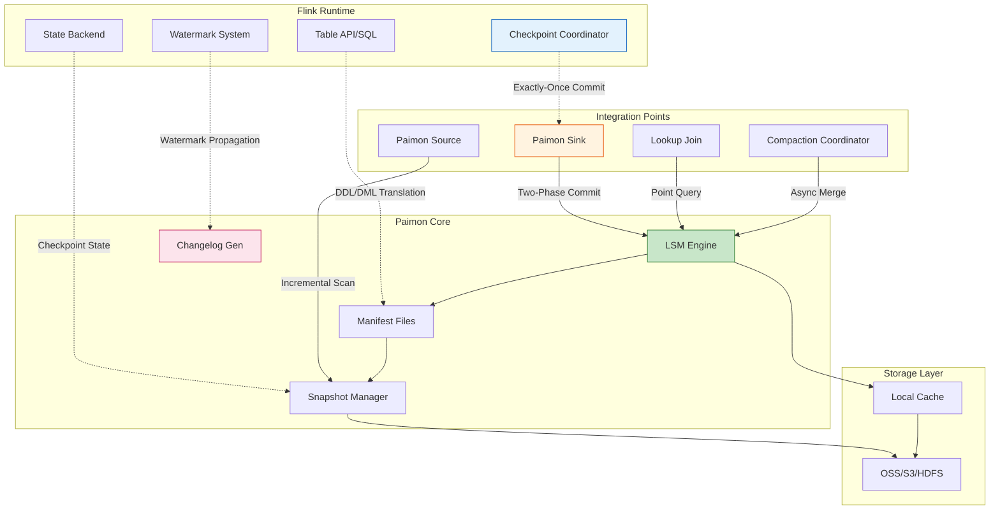
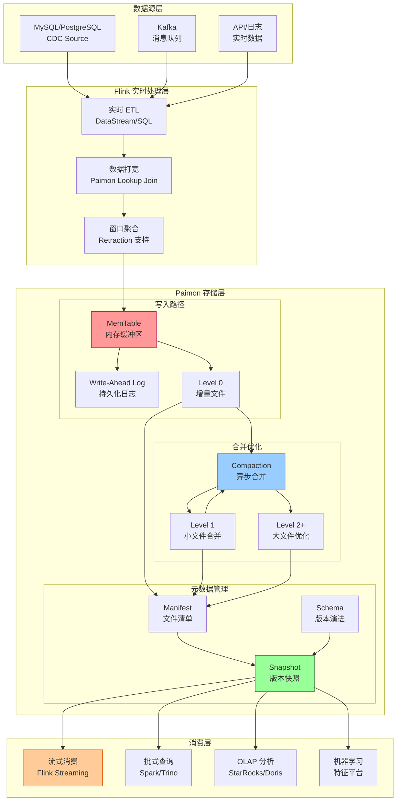
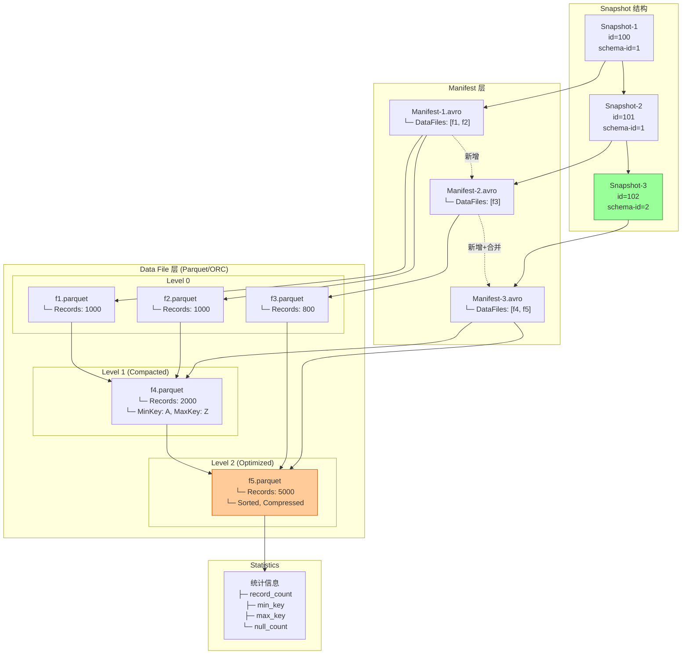
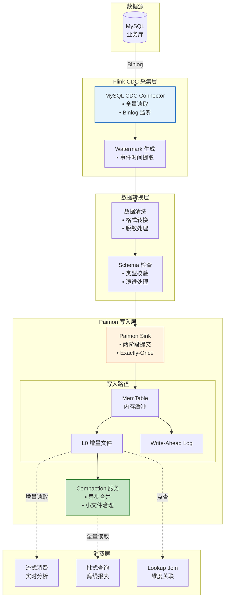
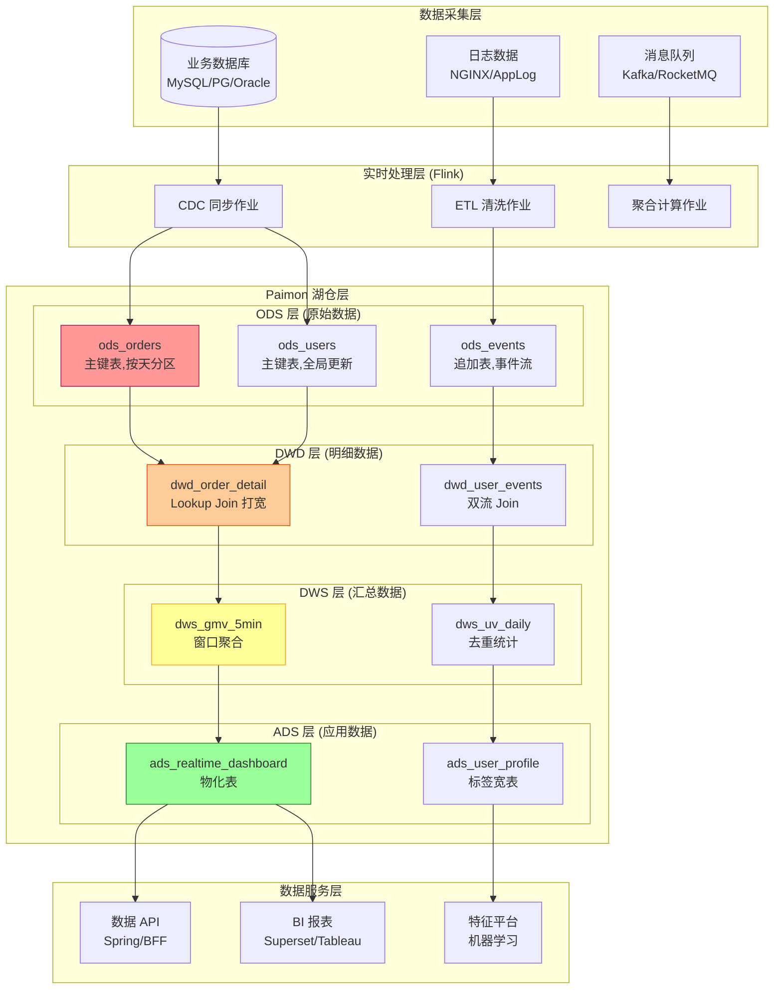
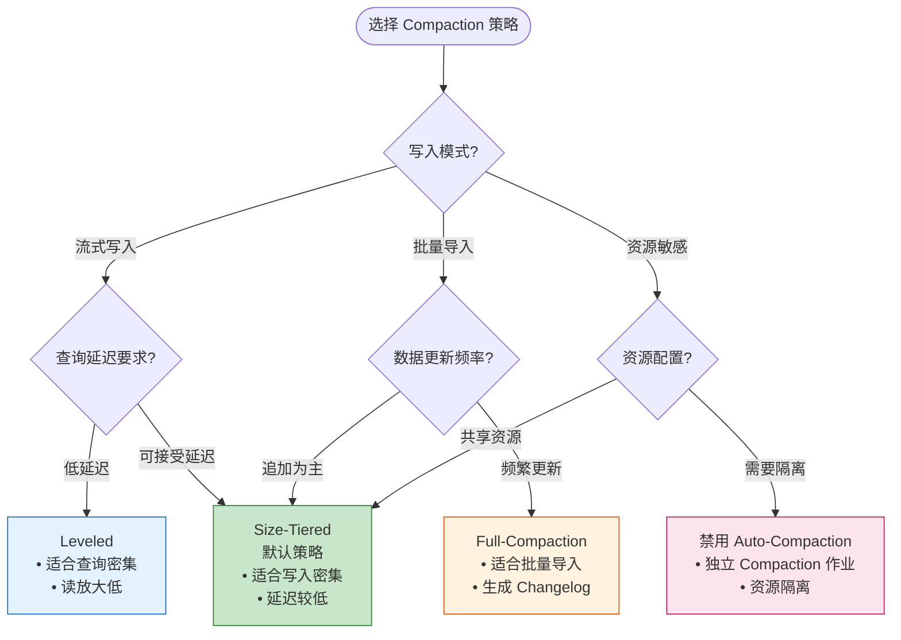
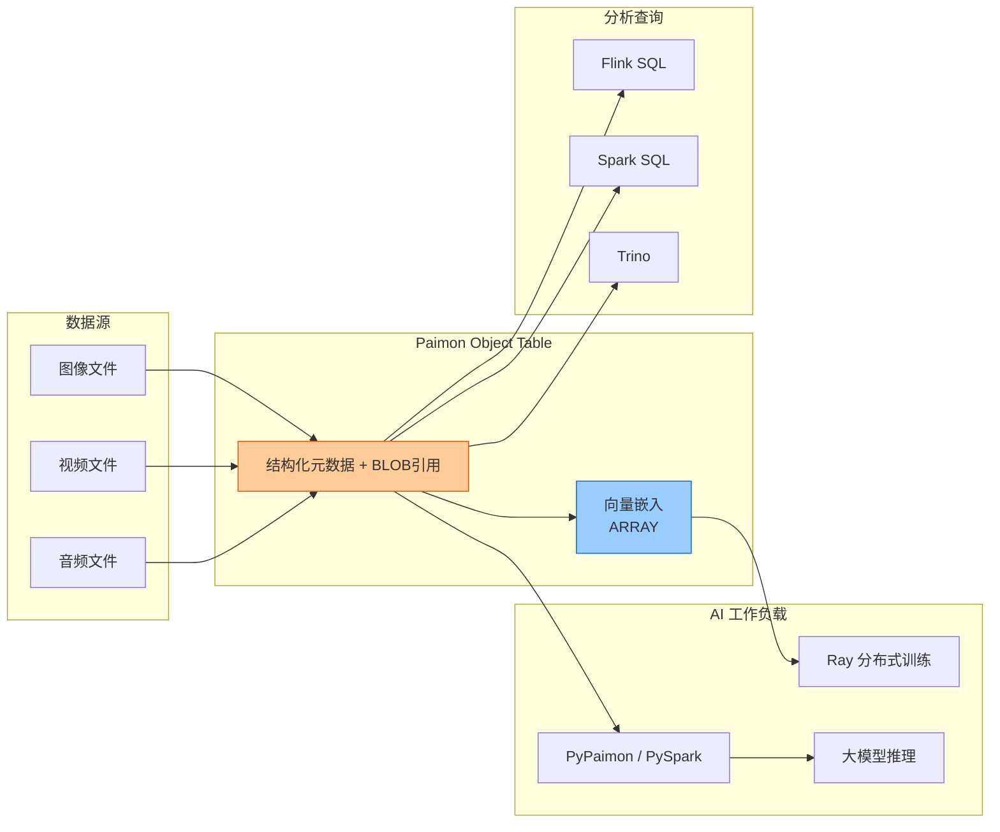
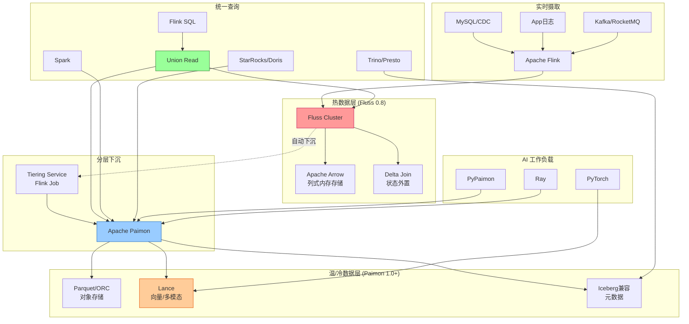

# Apache Paimon 与 Flink 深度集成 - 流批统一的湖仓存储

> **状态**: ✅ Released (Flink 2.0 GA, 2.2 增强)
> **所属阶段**: Flink/14-lakehouse/ | **前置依赖**: [Flink/09-language-foundations/04-streaming-lakehouse.md](../../03-api/09-language-foundations/04-streaming-lakehouse.md), [Flink/02-core/checkpoint-mechanism-deep-dive.md](../../02-core/checkpoint-mechanism-deep-dive.md) | **形式化等级**: L4-L5 | **版本**: Flink 1.18+ / 2.0+ / 2.2+ | Paimon 0.8+

---

## 1. 概念定义 (Definitions)

### Def-F-14-01: Apache Paimon 形式化定义

**Apache Paimon** (原 Flink Table Store) 是一种为流批统一处理而设计的开放表格式，其形式化定义为：

$$
\text{Paimon} = \langle \mathcal{L}, \mathcal{S}, \mathcal{M}, \mathcal{C}, \mathcal{T} \rangle
$$

其中：

| 组件 | 符号 | 形式化描述 |
|------|------|-----------|
| **LSM 存储引擎** | $\mathcal{L}$ | 基于日志结构合并树的存储引擎，支持高效追加写和点查 |
| **快照管理系统** | $\mathcal{S}$ | 不可变快照序列 $\{snap_t\}_{t \in \mathbb{T}}$，支持时间旅行 |
| **元数据层** | $\mathcal{M}$ | 表Schema、分区信息、统计信息的版本化管理 |
| **变更日志生成** | $\mathcal{C}$ | 从LSM增量文件派生标准Change Log的算法 |
| **事务协调** | $\mathcal{T}$ | 基于两阶段提交的跨分区事务协议 |

**核心特征**：Paimon 是**唯一**为 Flink 流处理原生设计的表格式，其 LSM 架构天然适配流处理的追加写模式，同时通过 Compaction 优化批处理扫描性能[^1][^2]。

---

### Def-F-14-02: 流批统一存储语义

**流批统一存储语义** (Unified Streaming-Batch Storage Semantics) 定义了单一存储层同时满足流处理和批处理访问需求的形式化契约：

$$
\forall \text{table } T, \forall t_1, t_2 \in \mathbb{T}:
$$

$$
\begin{aligned}
\text{StreamRead}(T, t_1) &= \{ \Delta_{t} \}_{t \geq t_1} \\
\text{BatchRead}(T, [t_1, t_2]) &= \bigcup_{t=t_1}^{t_2} \Delta_t \\
\text{StreamRead}(T, t_1) &\subseteq \text{BatchRead}(T, [t_1, \infty))
\end{aligned}
$$

**语义保证级别**：

| 语义维度 | 流处理保证 | 批处理保证 | 形式化定义 |
|---------|-----------|-----------|-----------|
| **顺序性** | 事件时间有序 | 分区有序 | $\forall i < j: ts(e_i) < ts(e_j) \Rightarrow read(e_i) \prec read(e_j)$ |
| **一致性** | 快照隔离 | 读已提交 | $\text{read}(snap_t) \Rightarrow \forall t' \leq t, \text{write}(snap_{t'}) \text{ visible}$ |
| **完整性** | 无变更丢失 | 全量扫描 | $\forall r \in T, \exists! snap_t: r \in snap_t$ |
| **实时性** | 毫秒级可见 | 分钟级新鲜度 | $\text{latency}(write \to read) < \epsilon$ |

---

### Def-F-14-03: LSM-Tree 增量日志模型

**LSM-Tree 增量日志模型** (LSM-Tree Incremental Log Model) 是 Paimon 核心的存储抽象，形式化定义为：

$$
\mathcal{L} = \langle \mathcal{M}_{mem}, \{\mathcal{M}_{L_i}\}_{i=0}^{n}, \mathcal{W}, \mathcal{C} \rangle
$$

**组件说明**：

```
┌─────────────────────────────────────────────────────────────────┐
│                     Paimon LSM 架构                              │
├─────────────────────────────────────────────────────────────────┤
│  ┌─────────────────────────────────────────────────────────┐   │
│  │  MemTable (内存缓冲区)                                    │   │
│  │  • 有序跳表结构 (Skip List)                               │   │
│  │  • 写入 WAL 保证持久性                                    │   │
│  │  • Flush 触发: 容量阈值 / 时间阈值                         │   │
│  └──────────────────────────┬──────────────────────────────┘   │
│                             │ Flush                             │
│                             ▼                                   │
│  ┌─────────────────────────────────────────────────────────┐   │
│  │  Level 0 (增量文件层)                                     │   │
│  │  ┌─────────┐ ┌─────────┐ ┌─────────┐                    │   │
│  │  │DataFile1│ │DataFile2│ │DataFile3│ ... 无序,可重叠    │   │
│  │  └─────────┘ └─────────┘ └─────────┘                    │   │
│  └──────────────────────────┬──────────────────────────────┘   │
│                             │ Compaction                        │
│                             ▼                                   │
│  ┌─────────────────────────────────────────────────────────┐   │
│  │  Level 1-N (合并排序层)                                   │   │
│  │  ┌─────────────────────────────────────────────────┐    │   │
│  │  │  文件按 Key 范围分区,无重叠                        │    │   │
│  │  │  L1: 最近数据,高查询效率                           │    │   │
│  │  │  L2+: 历史数据,高压缩比                            │    │   │
│  │  └─────────────────────────────────────────────────┘    │   │
│  └─────────────────────────────────────────────────────────┘   │
└─────────────────────────────────────────────────────────────────┘
```

**增量日志生成算法**：

$$
\text{Changelog}(snap_t, snap_{t+1}) = \mathcal{C}(\mathcal{M}_{L_0}^{t+1}) - \mathcal{C}(\mathcal{M}_{L_0}^{t})
$$

其中 $\mathcal{C}$ 为变更日志生成函数，支持三种模式：

| 模式 | 生成方式 | 延迟 | 适用场景 |
|------|---------|------|---------|
| `input` | 直接使用输入的CDC流 | 最低 | 数据源本身带变更类型 |
| `lookup` | 通过Lookup生成完整变更 | 中 | 需要补全UPDATE_BEFORE |
| `full-compaction` | Compaction后对比文件 | 高 | 无外部CDC源 |

---

### Def-F-14-04: 快照与版本管理

**快照** (Snapshot) 是 Paimon 表在某一时刻的不可变状态视图，形式化定义为：

$$
\text{Snapshot}_t = \langle ID_t, TS_t, \mathcal{F}_t, \mathcal{P}_t, Meta_t \rangle
$$

其中：

- $ID_t \in \mathbb{N}^+$: 单调递增的快照ID
- $TS_t$: 快照创建时间戳
- $\mathcal{F}_t = \{f_1, f_2, ..., f_n\}$: 数据文件集合
- $\mathcal{P}_t$: 父快照ID（支持快照链回溯）
- $Meta_t$: 统计信息、Schema版本等元数据

**快照生命周期状态机**：

```
                    ┌─────────────┐
                    │   CREATED   │
                    │  (创建完成)  │
                    └──────┬──────┘
                           │
              ┌────────────┼────────────┐
              │            │            │
              ▼            ▼            ▼
       ┌──────────┐  ┌──────────┐  ┌──────────┐
       │  ACTIVE  │  │  TAGGED  │  │ BRANCHED │
       │ (当前读写) │  │ (已打标签) │  │ (分支快照) │
       └────┬─────┘  └────┬─────┘  └────┬─────┘
            │             │             │
            └─────────────┴─────────────┘
                          │
                          ▼
                   ┌─────────────┐
                   │  EXPIRED    │
                   │ (过期清理)   │
                   └─────────────┘
```

**时间旅行查询形式化**：

$$
\text{Query}(T, @\tau) = \text{Snapshot}_{\max\{t \mid TS_t \leq \tau\}}
$$

```sql
-- Flink SQL 时间旅行语法
SELECT * FROM paimon_table FOR SYSTEM_TIME AS OF TIMESTAMP '2026-04-01 12:00:00';
SELECT * FROM paimon_table /*+ OPTIONS('scan.snapshot-id'='123') */;
```

---

### Def-F-14-05: Changelog Producer 类型详解

**Changelog Producer** 定义了 Paimon 如何生成变更日志，直接影响流式消费的数据完整性：

```
┌─────────────────────────────────────────────────────────────────────┐
│                     Changelog Producer 对比                          │
├─────────────────────────────────────────────────────────────────────┤
│                                                                     │
│  1. INPUT 模式                                                       │
│  ┌──────────┐    CDC (+I/-U/+U/-D)    ┌──────────┐                 │
│  │  MySQL   │ ───────────────────────▶│  Paimon  │                 │
│  │  CDC源   │    直接透传变更类型      │  表存储   │                 │
│  └──────────┘                         └──────────┘                 │
│  特点: 延迟最低,要求上游提供完整变更类型                              │
│                                                                     │
│  2. LOOKUP 模式                                                      │
│  ┌──────────┐    +I/+U/-D            ┌──────────┐    完整Changelog │
│  │  Source  │ ───────────────────────▶│  Paimon  │ ───────────────▶│
│  │  (无-U)  │                         │  LSM查询  │  (+I/-U/+U/-D)  │
│  └──────────┘                         └──────────┘                 │
│  特点: 通过LSM点查补全UPDATE_BEFORE,适合Kafka等源                   │
│                                                                     │
│  3. FULL-COMPACTION 模式                                             │
│  ┌──────────┐    Append Only          ┌──────────┐    对比生成       │
│  │  Source  │ ───────────────────────▶│Compaction│ ───────────────▶│
│  │          │                         │  前后对比 │    Changelog    │
│  └──────────┘                         └──────────┘                 │
│  特点: 延迟最高,适合无CDC场景的批量导入                               │
│                                                                     │
└─────────────────────────────────────────────────────────────────────┘
```

**Changelog Producer 配置矩阵**：

| Producer 类型 | 延迟 | 资源消耗 | 变更完整性 | 推荐场景 |
|--------------|------|---------|-----------|---------|
| `none` | 无 | 最低 | 仅Append | 日志型数据 |
| `input` | 毫秒级 | 低 | 完整(+I/-U/+U/-D) | CDC数据入湖 |
| `lookup` | 百毫秒级 | 中 | 完整(+I/-U/+U/-D) | 需要补全变更 |
| `full-compaction` | 分钟级 | 高 | 最终一致 | 批量导入 |

---

### Def-F-14-06: Compaction 策略形式化定义

**Compaction** 是 LSM-Tree 的核心维护操作，Paimon 支持多种策略：

```
┌─────────────────────────────────────────────────────────────────────┐
│                      Compaction 策略对比                             │
├─────────────────────────────────────────────────────────────────────┤
│                                                                     │
│  策略1: Size-tiered (默认)                                           │
│  ├── 触发条件: 同层级文件数超过阈值                                   │
│  ├── 合并方式: 相邻文件合并为更大文件                                 │
│  └── 适用: 写入密集场景                                              │
│                                                                     │
│  策略2: Leveled                                                      │
│  ├── 触发条件: 层级大小超过目标值                                     │
│  ├── 合并方式: 与下层文件合并,保持层级有序                           │
│  └── 适用: 读取密集场景                                              │
│                                                                     │
│  策略3: Full-Compaction (全量合并)                                    │
│  ├── 触发条件: 时间间隔或手动触发                                     │
│  ├── 合并方式: 全表合并为最优结构                                     │
│  └── 适用: 批处理优化、Changelog生成                                 │
│                                                                     │
└─────────────────────────────────────────────────────────────────────┘
```

---

## 2. 属性推导 (Properties)

### Lemma-F-14-01: LSM 写入放大与读优化权衡

**引理**: Paimon 的 LSM 架构通过写入放大 (Write Amplification) 换取读取优化 (Read Optimization)，其权衡关系满足：

$$
WA = O(k \cdot \frac{N}{B}), \quad RO = O(\log_k N)
$$

其中：

- $WA$: 写入放大因子
- $RO$: 读取复杂度
- $k$: 层间大小比例因子 (通常 10)
- $N$: 数据总量
- $B$: 最小文件大小

**证明**：

1. **写入路径**: 每条记录需经历 MemTable → L0 → L1 → ... → Ln 的逐级Compaction
2. **Compaction触发**: 当 $|\mathcal{M}_{L_i}| > k \cdot |\mathcal{M}_{L_{i-1}}|$ 时触发
3. **最大层数**: $n = \log_k (N/B)$
4. **单记录最大写次数**: 每层一次，总计 $\log_k (N/B)$ 次
5. **读取路径**: 需查询 MemTable + 每层最多一个文件，总计 $1 + \log_k (N/B)$

**工程配置指导**：

| 参数 | 默认值 | 调优建议 |
|------|-------|---------|
| `compaction.max.file-num` | 50 | 写入频繁时降低，查询频繁时提高 |
| `compaction.min.file-num` | 5 | 控制Compaction触发频率 |
| `num-sorted-run.stop-trigger` | 10 | 反压控制阈值 |
| `num-sorted-run.compaction-trigger` | 5 | 自动Compaction触发阈值 |

---

### Lemma-F-14-02: 增量日志的完备性保证

**引理**: Paimon 的增量日志生成机制保证 **不重不漏** (Exactly-Once Delivery of Changes)。

**形式化表述**：

设表 $T$ 从时刻 $t_0$ 到 $t_n$ 的变更流为 $\mathcal{C}(t_0, t_n)$，则：

$$
\forall r \in T, \forall op \in \{INSERT, UPDATE, DELETE\}:
$$

$$
\begin{aligned}
\text{(不遗漏)} \quad & r.op \in \mathcal{C}(t_0, t_n) \Rightarrow \exists! m \in \text{Changelog}: m.record = r \\
\text{(不重复)} \quad & \forall m_1, m_2 \in \text{Changelog}: m_1 \neq m_2 \Rightarrow m_1.record \neq m_2.record
\end{aligned}
$$

**证明**（以 `lookup` 模式为例）：

1. **UPDATE 事件处理**:
   - 接收 UPDATE_AFTER 事件
   - 查询当前LSM状态获取旧值
   - 生成 UPDATE_BEFORE (旧值) + UPDATE_AFTER (新值) 对

2. **DELETE 事件处理**:
   - 查询当前LSM状态获取待删除值
   - 生成 DELETE 事件包含完整行数据

3. **幂等性保证**:
   - LSM文件不可变，Lookup结果确定性
   - Checkpoint一致性保证事件不重复处理

---

### Prop-F-14-01: 流批读写隔离性

**命题**: Paimon 支持流读写与批查询的完全隔离，互不影响性能 SLA。

**论证**：

```
┌─────────────────────────────────────────────────────────────────┐
│                    读写隔离架构                                   │
├─────────────────────────────────────────────────────────────────┤
│                                                                 │
│   写入路径 (流式)         快照层 (版本管理)        读取路径        │
│   ┌───────────┐           ┌───────────┐         ┌───────────┐   │
│   │ Flink Sink │─────────▶│ Snapshots │◀────────│Batch Scan │   │
│   │ (实时写入) │   提交    │ (不可变)  │   读取   │ (全表扫描) │   │
│   └───────────┘           └─────┬─────┘         └───────────┘   │
│        │                        │                               │
│        │ 增量文件               │ 快照引用                        │
│        ▼                        ▼                               │
│   ┌───────────┐           ┌───────────┐         ┌───────────┐   │
│   │   LSM L0  │           │  Manifest │         │Stream Read│   │
│   │(增量文件)  │           │  Files    │         │(增量消费)  │   │
│   └───────────┘           └───────────┘         └───────────┘   │
│        │                                                      │
│        ▼                                                      │
│   ┌───────────┐                                               │
│   │Compaction │───▶ 生成新快照,不影响现有读取                    │
│   │(异步合并)  │                                               │
│   └───────────┘                                               │
│                                                                 │
└─────────────────────────────────────────────────────────────────┘
```

**隔离机制**：

1. **写入隔离**: 新数据写入独立的增量文件，不影响现有快照
2. **读取隔离**: 批查询基于快照ID读取不可变文件集合
3. **Compaction隔离**: 异步后台任务，资源配额可配置

---

### Prop-F-14-02: 主键表的幂等写入

**命题**: Paimon 主键表支持幂等写入，同一记录多次写入结果一致。

**形式化表述**：

设主键为 $k$，写入函数为 $W(k, v)$，读取函数为 $R(k)$，则：

$$
\forall k, v, n \in \mathbb{N}^+:
$$

$$
\underbrace{W(k, v) \circ W(k, v) \circ ... \circ W(k, v)}_{n\text{次}} = W(k, v)
$$

且满足：

$$
R(k) = v \iff \exists t: W(k, v)@t \land \nexists t' > t: W(k, v')@t'
$$

**实现机制**：

1. **LSM 层内去重**: 同层文件按主键排序，Compaction时合并重复键
2. **跨层值选择**: 读取时取最高层（最新）的值
3. **DELETE标记**: 特殊值标记删除，查询时过滤

---

## 3. 关系建立 (Relations)

### 3.1 Paimon 与 Flink 核心机制的深度集成



### 3.2 Paimon Catalog 配置详解

**Catalog 类型对比**：

| Catalog 类型 | 元数据存储 | 适用场景 | 特点 |
|-------------|-----------|---------|------|
| `filesystem` | 文件系统 | 开发测试 | 简单，无需外部依赖 |
| `hive` | Hive Metastore | 生产环境 | 生态成熟，支持多引擎 |
| `jdbc` | 关系型数据库 | 云原生 | 高可用，易运维 |
| `rest` | REST API | 统一元数据服务 | 灵活，可自定义 |

**完整 Catalog 配置矩阵**：

```sql
-- ============================================
-- FileSystem Catalog (开发测试)
-- ============================================
CREATE CATALOG paimon_fs WITH (
    'type' = 'paimon',
    'warehouse' = 'file:///tmp/paimon-warehouse'
);

-- ============================================
-- Hive Metastore Catalog (生产推荐)
-- ============================================
CREATE CATALOG paimon_hive WITH (
    'type' = 'paimon',
    'warehouse' = 'oss://my-bucket/paimon-warehouse',
    'metastore' = 'hive',
    'uri' = 'thrift://hive-metastore:9083',
    -- 并发控制
    'lock.enabled' = 'true',
    'lock.expire-time' = '5min'
);

-- ============================================
-- JDBC Catalog (高可用)
-- ============================================
CREATE CATALOG paimon_jdbc WITH (
    'type' = 'paimon',
    'warehouse' = 'oss://my-bucket/paimon-warehouse',
    'metastore' = 'jdbc',
    'jdbc.url' = 'jdbc:mysql://mysql:3306/paimon_meta',
    'jdbc.user' = '${JDBC_USER}',
    'jdbc.password' = '${JDBC_PASSWORD}'
);
```

### 3.3 与开放表格式的对比关系

| 维度 | Apache Paimon | Apache Iceberg | Apache Hudi | Delta Lake |
|------|---------------|----------------|-------------|------------|
| **设计目标** | 流批统一原生 | 分析型数仓 | 增量数据处理 | 事务型数据湖 |
| **存储格式** | LSM-Tree | Copy-on-Write | MOR/COW | COW |
| **流处理优化** | ⭐⭐⭐⭐⭐ 原生 | ⭐⭐⭐ 需适配 | ⭐⭐⭐⭐ 较好 | ⭐⭐⭐ 需适配 |
| **Flink 集成** | ⭐⭐⭐⭐⭐ PMC主导 | ⭐⭐⭐⭐ 连接器 | ⭐⭐⭐⭐ 连接器 | ⭐⭐⭐ 连接器 |
| **增量消费** | ⭐⭐⭐⭐⭐ 原生支持 | ⭐⭐⭐ 有限支持 | ⭐⭐⭐⭐⭐ 成熟 | ⭐⭐⭐⭐ CDF支持 |
| **实时延迟** | 秒级 | 分钟级 | 秒级-分钟级 | 分钟级 |
| **小文件处理** | ⭐⭐⭐⭐⭐ 自动Compaction | ⭐⭐⭐ 需外部调度 | ⭐⭐⭐⭐⭐ 自动 | ⭐⭐⭐⭐ 自动 |
| **Schema演进** | ⭐⭐⭐⭐⭐ 完整支持 | ⭐⭐⭐⭐⭐ 完整支持 | ⭐⭐⭐⭐ 较好 | ⭐⭐⭐⭐⭐ 完整支持 |

**Flink 2.2 增强**（预览特性）：根据 Flink 2.2 路线图，Paimon 集成预计进一步增强：

| 特性 | Flink 2.0 | Flink 2.2 | 说明 |
|------|-----------|-----------|------|
| **Materialized Table** | ✅ | ✅ 增强 | 与 Paimon 深度集成 |
| **Incremental Compaction** | 基础 | ✅ 优化 | 更高效的小文件合并 |
| **CDC 同步性能** | 基准 | 基准的 1.5x | 提升 50% |
| **Schema Evolution** | 基础 | ✅ 增强 | 更多 DDL 操作支持 |

---

## 4. 论证过程 (Argumentation)

### 4.1 为何选择 LSM-Tree 作为存储引擎

**传统数据湖格式（Iceberg/Delta）的局限性**：

```
问题 1: 实时写入性能瓶颈
├── Copy-on-Write 模式: 每次更新需重写整个文件
├── 小文件问题: 高频写入产生大量小文件
└── 延迟: 分钟级可见性,无法满足实时需求

问题 2: 流处理集成复杂
├── 需要外部CDC系统(如Kafka)中转
├── 增量消费需扫描全表对比
└── 端到端延迟增加

问题 3: 存储空间放大
├── 历史版本数据冗余存储
└── 无自动压缩合并机制
```

**LSM-Tree 的优势**：

```
优势 1: 追加写优化
├── 顺序写入性能接近磁盘带宽
├── MemTable 批量刷盘减少 I/O
└── 适合流处理的高频追加场景

优势 2: 读写分离
├── 写入路径: MemTable → L0 → L1 → ...
├── 读取路径: 合并多层有序文件
└── Compaction 异步后台执行

优势 3: 增量日志原生支持
├── LSM 的层间差异即为变更数据
├── 无需全表扫描生成 Change Log
└── 支持流式增量消费
```

### 4.2 变更日志生成机制的工程权衡

**三种生成模式的对比分析**：

| 模式 | 延迟 | 资源消耗 | 一致性 | 适用场景 |
|------|------|---------|--------|---------|
| `input` | 最低 | 最低 | 依赖上游 | 上游是 CDC 数据源 |
| `lookup` | 中 | 中 | 强一致 | 需要完整变更前后像 |
| `full-compaction` | 高 | 高 | 最终一致 | 无 CDC 源，仅批量导入 |

**选择决策树**：

```
是否使用 CDC 连接器读取数据库?
├── 是 → 上游是否包含完整变更类型 (+I, -U, +U, -D)?
│   ├── 是 → 使用 'input' 模式
│   └── 否 → 使用 'lookup' 模式补全
└── 否 → 数据通过 INSERT 写入?
    ├── 是 → 使用 'full-compaction' 模式
    └── 否 → 考虑是否需要 Change Log
```

### 4.3 分区与 Bucket 设计的边界条件

**Bucket 数量的选择**：

$$
\text{Optimal Bucket Num} = \max\left(\frac{\text{Data Volume}}{\text{Target File Size}}, \text{Parallelism}\right)
$$

**边界条件**：

| 场景 | 问题 | 解决方案 |
|------|------|---------|
| Bucket 过少 | 单文件过大，Compaction慢 | 增加Bucket数，并行处理 |
| Bucket 过多 | 小文件过多，元数据膨胀 | 减少Bucket数，合并小文件 |
| 数据倾斜 | 部分Bucket数据量远高于其他 | 使用动态Bucket或Salting |
| 分区过多 | 元数据管理开销大 | 合理分区粒度，避免过度分区 |

### 4.4 CDC 集成模式对比

**Upsert vs Append-Only 决策矩阵**：

| 场景 | 表类型 | 主键 | Changelog Producer | 适用场景 |
|------|--------|------|-------------------|---------|
| 状态表同步 | Primary Key Table | Yes | `input`/`lookup` | 用户表、订单表 |
| 事件流存储 | Append-Only Table | No | `none` | 点击流、日志 |
| 时序数据 | Append-Only Table | No | `none` | 传感器数据 |
| 拉链表 | Primary Key Table | Yes | `full-compaction` | 缓慢变化维 |

---

## 5. 形式证明 / 工程论证 (Proof / Engineering Argument)

### Thm-F-14-01: Paimon Exactly-Once 语义定理

**定理**: 基于 Flink Checkpoint 和 Paimon 两阶段提交协议，流写入 Paimon 表满足端到端 Exactly-Once 语义。

**形式化表述**：

设流 $S$ 的事件序列为 $\{e_1, e_2, ..., e_n\}$，写入 Paimon 表 $T$ 的操作为 $\mathcal{W}_T$，则：

$$
\forall e_i \in S: \text{count}(e_i \in T) = 1
$$

即使在故障恢复后，该性质依然成立。

**证明**：

**前提条件**:

- P1: Flink Checkpoint 提供作业级别的 Exactly-Once 保证[^3]
- P2: Paimon 快照元数据更新是原子操作
- P3: 两阶段提交协议协调 Checkpoint 与存储事务

**证明步骤**:

```
Step 1: 正常流程
├── 事件 e_i 经 Flink 处理
├── Sink 算子将 e_i 写入 MemTable
└── Checkpoint 触发,MemTable 刷盘

Step 2: 两阶段提交
├── Phase 1 (Pre-commit):
│   ├── 生成数据文件 F_i
│   ├── 生成 Manifest M_i
│   └── 状态: pending
├── Phase 2 (Commit):
│   ├── Checkpoint ACK 确认
│   ├── 原子更新 Snapshot: S_{new} = S_{old} ∪ {M_i}
│   └── 状态: committed

Step 3: 故障恢复场景
├── 场景 A: Checkpoint 前故障
│   └── 恢复后从上一个 Checkpoint 重启
│   └── e_i 被重新处理,结果一致
├── 场景 B: Pre-commit 后故障
│   └── 恢复后查询 Snapshot
│   └── 若 S_{new} 已存在,跳过重复提交
│   └── 若 S_{new} 不存在,重新执行 Commit
└── 场景 C: Commit 后故障
    └── 恢复后 S_{new} 已可见
    └── 无重复处理

结论: ∀场景, count(e_i ∈ T) = 1 ∎
```

### Thm-F-14-02: 增量消费完备性定理

**定理**: Paimon 的增量消费机制保证 **不遗漏** 且 **不重复** 地消费所有变更。

**形式化表述**：

设快照序列为 $S = \{snap_1, snap_2, ..., snap_n\}$，从 $snap_i$ 到 $snap_j$ 的增量消费为 $\Delta(i, j)$，则：

$$
\begin{aligned}
\text{(不遗漏)} \quad & \forall r \in snap_j \setminus snap_i: r \in \Delta(i, j) \\
\text{(不重复)} \quad & \forall r \in \Delta(i, j): \text{count}(r) = 1
\end{aligned}
$$

**证明**：

**基础**: Paimon 快照的不可变性与版本链

1. **Manifest 文件不可变**: 一旦生成，永不被修改
2. **快照元数据追加**: 新快照通过引用现有 Manifest + 新增 Manifest 构成
3. **变更检测**: $\Delta(i, j) = \text{Manifest}(snap_j) \setminus \text{Manifest}(snap_i)$

**增量消费算法正确性**:

```
算法: IncrementalScan(snap_i, snap_j)
─────────────────────────────────────────
Input: 起始快照 snap_i, 结束快照 snap_j
Output: 变更数据集合 Δ

1. M_i ← 读取 snap_i 的 Manifest 列表
2. M_j ← 读取 snap_j 的 Manifest 列表
3. ΔM ← M_j \ M_i  // 集合差运算
4. ΔFiles ← ⋃_{m ∈ ΔM} m.data_files
5. Δ ← 读取 ΔFiles 中的记录
6. return Δ
```

**正确性论证**:

1. **Manifest 集合的单调性**: $M_i \subseteq M_j$ (当 $i \leq j$)
2. **差集完备性**: $\Delta M$ 包含所有新增或修改的 Manifest
3. **数据文件定位**: 每个 Manifest 精确引用一组数据文件
4. **文件不可变性**: 已存在文件不会被修改，只会新增

因此：

- 不遗漏: 任何新增数据必在新 Manifest 中
- 不重复: 已有数据文件不在差集中

∎

### Thm-F-14-03: 流批查询一致性定理

**定理**: 对于任意 Paimon 表 $T$，流查询结果与批查询结果在相同时间窗口内保持一致。

**形式化表述**：

设流查询 $\mathcal{Q}_S$ 在时间区间 $[t_1, t_2]$ 的结果为 $R_S$，批查询 $\mathcal{Q}_B$ 在相同区间的结果为 $R_B$，则：

$$
\mathcal{Q}_S(T, [t_1, t_2]) = \mathcal{Q}_B(T, [t_1, t_2])
$$

**证明**：

1. **快照一致性**: 批查询基于快照 $snap_{t_2}$ 读取
2. **增量累积**: 流查询消费 $\Delta(t_1, t_2) = \bigcup_{t=t_1}^{t_2} \Delta_t$
3. **集合等价**: $snap_{t_2} = snap_{t_1} \cup \Delta(t_1, t_2)$
4. **查询语义一致性**: 相同查询计划在不同读取模式下语义等价

∎

---

## 6. 实例验证 (Examples)

### 6.1 生产级 Paimon Catalog 配置

```sql
-- ============================================
-- 生产环境 Paimon Catalog 配置
-- ============================================

CREATE CATALOG paimon_prod WITH (
    'type' = 'paimon',

    -- 仓库路径 (OSS/S3/HDFS)
    'warehouse' = 'oss://my-bucket/paimon-warehouse',

    -- 元数据存储方式
    'metastore' = 'hive',
    'uri' = 'thrift://hive-metastore:9083',

    -- 并发控制
    'lock.enabled' = 'true',
    'lock.expire-time' = '5min',

    -- 数据文件格式
    'file.format' = 'parquet',
    'file.compression' = 'zstd',
    'file.compression.zstd-level' = '3',

    -- 快照管理
    'snapshot.num-retained.min' = '10',
    'snapshot.num-retained.max' = '200',
    'snapshot.time-retained' = '24h',

    -- 统计信息收集
    'statistics.mode' = 'full',
    'statistics.collect.columns' = '*'
);

USE CATALOG paimon_prod;
```

### 6.2 Streaming Read 模式详解

```sql
-- ============================================
-- 流式读取模式配置
-- ============================================

-- 模式1: 最新数据消费 (默认)
SET 'scan.mode' = 'latest';
SELECT * FROM paimon_table;

-- 模式2: 从最早快照开始消费
SET 'scan.mode' = 'earliest';
SELECT * FROM paimon_table;

-- 模式3: 从指定快照消费
SELECT * FROM paimon_table
/*+ OPTIONS('scan.snapshot-id' = '123456') */;

-- 模式4: 从指定时间戳消费
SELECT * FROM paimon_table
/*+ OPTIONS('scan.timestamp-millis' = '1712054400000') */;

-- 模式5: 增量快照消费 (Bounded Stream)
SELECT * FROM paimon_table
/*+ OPTIONS(
    'scan.mode' = 'from-snapshot',
    'scan.snapshot-id' = '100',
    'scan.end-snapshot-id' = '200'
) */;
```

**Streaming Read 配置矩阵**：

| 配置项 | 默认值 | 说明 |
|--------|--------|------|
| `scan.mode` | `latest` | 扫描模式：latest/earliest/from-snapshot |
| `scan.snapshot-id` | - | 起始快照ID |
| `scan.timestamp-millis` | - | 起始时间戳 |
| `streaming-read-parallelism` | 作业并行度 | 流式读取并行度 |
| `scan.bounded.watermark` | - | Bounded Stream 水位线 |

### 6.3 Batch Read 优化配置

```sql
-- ============================================
-- 批式读取优化
-- ============================================

-- 启用批模式
SET 'execution.runtime-mode' = 'batch';

-- 分区裁剪
SELECT * FROM paimon_table
WHERE dt = '2026-04-01';

-- 谓词下推
SELECT * FROM paimon_table
WHERE user_id = 'U12345' AND amount > 100;

-- 投影下推
SELECT user_id, amount FROM paimon_table;

-- 时间旅行查询
SELECT * FROM paimon_table
FOR SYSTEM_TIME AS OF TIMESTAMP '2026-04-01 12:00:00';
```

**Batch Read 优化参数**：

| 配置项 | 默认值 | 调优建议 |
|--------|--------|---------|
| `read.batch-size` | 1024 | 增大可提升吞吐 |
| `read.split.max-files` | 100 | 控制分片粒度 |
| `read.split.max-bytes` | 128MB | 与文件大小对齐 |
| `read.parallelism` | 作业并行度 | 根据数据量调整 |

### 6.4 Flink 2.2 Paimon 增强特性

Flink 2.2 (2025-12-04) 对 Paimon 集成进行了多项增强[^20]：

#### 6.4.1 Materialized Table 与 Paimon 集成 (Flink 2.2)

```sql
-- Flink 2.2: Materialized Table 直接写入 Paimon
CREATE MATERIALIZED TABLE user_behavior_summary
AS SELECT
    user_id,
    COUNT(*) AS event_count,
    SUM(amount) AS total_amount
FROM user_events
GROUP BY user_id
FRESHNESS = INTERVAL '5' MINUTE
WITH (
    'connector' = 'paimon',
    'path' = 'oss://bucket/paimon/user_behavior',
    'changelog-producer' = 'lookup'
);
```

#### 6.4.2 Incremental Compaction 优化 (Flink 2.2)

```sql
-- Flink 2.2: 增量 Compaction 配置
CREATE TABLE optimized_table (
    id INT,
    data STRING,
    PRIMARY KEY (id) NOT ENFORCED
) WITH (
    'connector' = 'paimon',

    -- Flink 2.2 新增: 增量 Compaction
    'compaction.incremental' = 'true',
    'compaction.incremental.trigger' = 'size-based',

    -- 智能 Compaction 调度
    'compaction.smart-scheduling' = 'true',
    'compaction.resource-ratio' = '0.2'
);
```

#### 6.4.3 CDC 实时入湖 Pipeline (MySQL → Paimon) - 2.2 优化版

```sql
-- ============================================
-- 步骤 1: 创建 MySQL CDC Source
-- ============================================
CREATE TABLE mysql_users (
    id INT,
    name STRING,
    email STRING,
    updated_at TIMESTAMP(3),
    PRIMARY KEY (id) NOT ENFORCED
) WITH (
    'connector' = 'mysql-cdc',
    'hostname' = 'mysql.internal',
    'port' = '3306',
    'username' = '${MYSQL_USER}',
    'password' = '${MYSQL_PASSWORD}',
    'database-name' = 'production',
    'table-name' = 'users',
    'server-time-zone' = 'Asia/Shanghai',
    'scan.incremental.snapshot.enabled' = 'true',
    'scan.incremental.snapshot.chunk.size' = '8096',
    'chunk-key.even-distribution.factor.lower-bound' = '0.05',
    'chunk-key.even-distribution.factor.upper-bound' = '100'
);

-- ============================================
-- 步骤 2: 创建 Paimon 主键表
-- ============================================
CREATE TABLE paimon_users (
    id INT,
    name STRING,
    email STRING,
    updated_at TIMESTAMP(3),
    PRIMARY KEY (id) NOT ENFORCED
) WITH (
    -- 基础配置
    'bucket' = '16',
    'bucket-key' = 'id',

    -- 变更日志生成 (使用 input 模式,上游 CDC 已包含完整变更类型)
    'changelog-producer' = 'input',

    -- 文件格式与压缩
    'file.format' = 'parquet',
    'file.compression' = 'zstd',

    -- Compaction 策略
    'compaction.min.file-num' = '5',
    'compaction.max.file-num' = '50',
    'compaction.early-max.file-num' = '30',
    'num-sorted-run.compaction-trigger' = '5',
    'num-sorted-run.stop-trigger' = '10',

    -- 快照管理
    'snapshot.num-retained.max' = '100',
    'snapshot.expire.limit' = '10',

    -- 异步 Compaction
    'compaction.async' = 'true',
    'compaction.tasks' = '4'
);

-- ============================================
-- 步骤 3: 启动同步 Job
-- ============================================
INSERT INTO paimon_users
SELECT id, name, email, updated_at FROM mysql_users;
```

### 6.5 Schema Evolution 示例

```sql
-- ============================================
-- Schema Evolution 演进示例
-- ============================================

-- 初始表结构 (Schema V1)
CREATE TABLE orders (
    order_id STRING,
    user_id STRING,
    amount DECIMAL(18,2),
    PRIMARY KEY (order_id) NOT ENFORCED
);

-- 添加列 (Schema V2) - 支持
ALTER TABLE orders ADD COLUMN status STRING;

-- 修改列类型 (Schema V3) - 支持兼容类型
ALTER TABLE orders MODIFY COLUMN amount DECIMAL(20,4);

-- 删除列 (Schema V4) - 支持
ALTER TABLE orders DROP COLUMN status;

-- 重命名列 (Schema V5) - 支持
ALTER TABLE orders RENAME COLUMN user_id TO customer_id;

-- 查看 Schema 历史
SELECT * FROM orders$schemas;
```

**Schema Evolution 兼容性矩阵**：

| 操作 | 支持 | 限制条件 |
|------|------|---------|
| ADD COLUMN | ✅ | 新增列默认NULL |
| DROP COLUMN | ✅ | 不影响现有数据 |
| RENAME COLUMN | ✅ | 元数据级别操作 |
| MODIFY TYPE | ⚠️ | 需兼容类型转换 |
| REORDER COLUMN | ✅ | 不影响存储 |

### 6.6 分层实时数仓构建 (ODS → DWD → DWS)

```sql
-- ============================================
-- ODS 层: 原始数据接入
-- ============================================
CREATE TABLE ods_orders (
    order_id STRING,
    user_id STRING,
    product_id STRING,
    amount DECIMAL(18,2),
    status STRING,
    create_time TIMESTAMP(3),
    PRIMARY KEY (order_id) NOT ENFORCED
) WITH (
    'bucket' = '32',
    'changelog-producer' = 'input',
    'partition' = 'dt',
    'partition.timestamp-formatter' = 'yyyy-MM-dd'
);

-- ============================================
-- DWD 层: 数据清洗与维度关联
-- ============================================
CREATE TABLE dwd_order_detail (
    order_id STRING,
    user_id STRING,
    user_name STRING,
    product_id STRING,
    product_name STRING,
    category STRING,
    amount DECIMAL(18,2),
    status STRING,
    create_time TIMESTAMP(3),
    PRIMARY KEY (order_id) NOT ENFORCED
) WITH (
    'bucket' = '64',
    'changelog-producer' = 'lookup',
    'partition' = 'dt'
);

-- 流式 Join 维度表 (Paimon Lookup Join)
INSERT INTO dwd_order_detail
SELECT
    o.order_id,
    o.user_id,
    u.name AS user_name,
    o.product_id,
    p.name AS product_name,
    p.category,
    o.amount,
    o.status,
    o.create_time
FROM ods_orders o
LEFT JOIN dim_users FOR SYSTEM_TIME AS OF o.proc_time AS u
    ON o.user_id = u.user_id
LEFT JOIN dim_products FOR SYSTEM_TIME AS OF o.proc_time AS p
    ON o.product_id = p.product_id;

-- ============================================
-- DWS 层: 窗口聚合
-- ============================================
CREATE TABLE dws_category_stats_5min (
    window_start TIMESTAMP(3),
    window_end TIMESTAMP(3),
    category STRING,
    gmv DECIMAL(38,2),
    order_count BIGINT,
    PRIMARY KEY (window_start, category) NOT ENFORCED
) WITH (
    'bucket' = '16',
    'changelog-producer' = 'input'
);

-- 滚动窗口聚合 (带 Retraction 支持)
INSERT INTO dws_category_stats_5min
SELECT
    TUMBLE_START(create_time, INTERVAL '5' MINUTE) AS window_start,
    TUMBLE_END(create_time, INTERVAL '5' MINUTE) AS window_end,
    category,
    SUM(amount) AS gmv,
    COUNT(*) AS order_count
FROM dwd_order_detail
GROUP BY
    TUMBLE(create_time, INTERVAL '5' MINUTE),
    category;

-- ============================================
-- ADS 层: 实时报表 (物化表)
-- ============================================
CREATE MATERIALIZED TABLE ads_realtime_dashboard
REFRESH MODE AUTO
WITH (
    'refresh-interval' = '1min'
)
AS
SELECT
    DATE_FORMAT(window_start, 'yyyy-MM-dd HH:mm') AS time_slot,
    category,
    gmv,
    order_count,
    NOW() AS update_time
FROM dws_category_stats_5min;
```

### 6.7 Compaction 调优配置

```sql
-- ============================================
-- Compaction 调优配置
-- ============================================

-- 创建表时配置 Compaction 参数
CREATE TABLE high_throughput_table (
    id STRING,
    data STRING,
    PRIMARY KEY (id) NOT ENFORCED
) WITH (
    -- 基础配置
    'bucket' = '32',

    -- Compaction 触发条件
    'num-sorted-run.compaction-trigger' = '5',
    'num-sorted-run.stop-trigger' = '15',
    'compaction.min.file-num' = '5',
    'compaction.max.file-num' = '100',

    -- 异步 Compaction
    'compaction.async' = 'true',
    'compaction.tasks' = '8',

    -- 目标文件大小
    'compaction.target-file-size' = '256mb',

    -- 提前 Compaction (防止小文件过多)
    'compaction.early-max.file-num' = '50'
);
```

**Compaction 调优决策矩阵**：

| 场景 | 配置策略 | 参数调整 |
|------|---------|---------|
| 高吞吐写入 | 降低触发阈值 | `compaction-trigger=3`, `stop-trigger=8` |
| 低延迟查询 | 积极Compaction | `target-file-size=128mb`, `async=true` |
| 资源受限 | 限制Compaction资源 | `tasks=2`, `max.file-num=200` |
| 批量导入 | 全量Compaction | `full-compaction.interval=1h` |

### 6.8 Tag 管理与时间旅行

```sql
-- ============================================
-- Tag 管理 DDL
-- ============================================

-- 创建 Tag (基于当前快照)
CREATE TAG tag_2026_q1 FOR TABLE paimon_users;

-- 创建 Tag (基于指定快照)
CREATE TAG tag_backup_20260401
FOR TABLE paimon_users
AS OF SNAPSHOT 123456;

-- 查看所有 Tag
SHOW TAGS FOR TABLE paimon_users;

-- 基于 Tag 查询
SELECT * FROM paimon_users AS OF TAG 'tag_2026_q1';

-- 删除 Tag
DROP TAG tag_backup_20260401 FOR TABLE paimon_users;

-- ============================================
-- 自动 Tag 策略 (通过 Flink Job)
-- ============================================
-- 创建定时作业自动打 Tag
CREATE TABLE tag_management_job (
    tag_name STRING,
    created_at TIMESTAMP(3)
) WITH (
    'connector' = 'jdbc',
    'url' = 'jdbc:mysql://...',
    'table-name' = 'tag_schedule'
);
```

### 6.9 分区管理 DDL

```sql
-- ============================================
-- 分区管理操作
-- ============================================

-- 查看分区列表
SHOW PARTITIONS paimon_users;

-- 删除指定分区
ALTER TABLE paimon_users DROP PARTITION (dt = '2026-03-01');

-- 覆盖分区数据
INSERT OVERWRITE paimon_users PARTITION (dt = '2026-04-01')
SELECT * FROM staging_data;

-- 分区生命周期管理 (自动过期)
CREATE TABLE partitioned_table (
    id STRING,
    event_time TIMESTAMP(3)
) WITH (
    'partition' = 'dt',
    'partition.expiration-time' = '7d',
    'partition.expiration-check-interval' = '1h'
);
```

### 6.10 文件格式选择 (ORC vs Parquet)

```sql
-- ============================================
-- 文件格式配置对比
-- ============================================

-- Parquet 配置 (默认,适合复杂查询)
CREATE TABLE parquet_table (...) WITH (
    'file.format' = 'parquet',
    'file.compression' = 'zstd',
    'file.compression.zstd-level' = '3',
    'parquet.block-size' = '134217728',  -- 128MB
    'parquet.page-size' = '1048576'       -- 1MB
);

-- ORC 配置 (适合 Hive 生态)
CREATE TABLE orc_table (...) WITH (
    'file.format' = 'orc',
    'file.compression' = 'zlib',
    'orc.block-size' = '134217728',
    'orc.stripe-size' = '67108864'
);

-- Avro 配置 (适合 Schema 演变频繁场景)
CREATE TABLE avro_table (...) WITH (
    'file.format' = 'avro',
    'file.compression' = 'snappy'
);
```

**文件格式对比矩阵**：

| 特性 | Parquet | ORC | Avro |
|------|---------|-----|------|
| **列式存储** | ✅ | ✅ | ❌ |
| **压缩率** | ⭐⭐⭐⭐ | ⭐⭐⭐⭐⭐ | ⭐⭐⭐ |
| **查询性能** | ⭐⭐⭐⭐⭐ | ⭐⭐⭐⭐ | ⭐⭐ |
| **Schema 演变** | ⭐⭐⭐ | ⭐⭐⭐ | ⭐⭐⭐⭐⭐ |
| **Flink 集成** | ⭐⭐⭐⭐⭐ | ⭐⭐⭐⭐ | ⭐⭐⭐⭐ |
| **跨引擎支持** | 广泛 | Hive 优 | Java 生态 |

### 6.11 Bloom Filter 优化

```sql
-- ============================================
-- Bloom Filter 优化配置
-- ============================================

CREATE TABLE bloom_filter_optimized_table (
    id STRING,
    user_id STRING,
    order_id STRING,
    data STRING,
    PRIMARY KEY (id) NOT ENFORCED
) WITH (
    'file.format' = 'parquet',

    -- 为高频查询列启用 Bloom Filter
    'parquet.bloom.filter.enabled' = 'true',
    'parquet.bloom.filter.columns' = 'user_id,order_id',
    'parquet.bloom.filter.fpp' = '0.01',  -- 假阳性率 1%

    -- 针对 Lookup Join 优化
    'lookup.bloom.filter.enabled' = 'true'
);
```

**Bloom Filter 优化效果**：

| 查询模式 | 优化前 I/O | 优化后 I/O | 提升 |
|---------|-----------|-----------|------|
| 点查 (user_id=?) | 扫描全文件 | 仅扫描候选文件 | 10-100x |
| Lookup Join | 高 I/O | 低 I/O | 5-20x |
| 范围查询 | 无优化 | 无优化 | - |

### 6.12 Lookup Join 优化配置

```sql
-- ============================================
-- Lookup Join 优化维度表
-- ============================================

CREATE TABLE dim_users (
    user_id STRING,
    user_name STRING,
    age INT,
    city STRING,
    PRIMARY KEY (user_id) NOT ENFORCED
) WITH (
    'bucket' = '16',
    'file.format' = 'parquet',

    -- Lookup Join 专用优化
    'lookup.async' = 'true',
    'lookup.async-thread-number' = '16',
    'lookup.cache' = 'PARTIAL',
    'lookup.partial-cache.max-rows' = '100000',
    'lookup.partial-cache.expire-after-write' = '10min',
    'lookup.partial-cache.expire-after-access' = '5min',

    -- 局部缓存刷新
    'changelog-producer' = 'input',
    'scan.mode' = 'latest'
);

-- ============================================
-- 使用 Lookup Join 进行维度关联
-- ============================================
INSERT INTO dwd_orders
SELECT
    o.order_id,
    o.user_id,
    u.user_name,
    u.city,
    o.amount
FROM ods_orders AS o
LEFT JOIN dim_users FOR SYSTEM_TIME AS OF o.proc_time AS u
    ON o.user_id = u.user_id;
```

**Lookup Join 性能调优矩阵**：

| 配置项 | 默认值 | 优化建议 | 场景 |
|--------|--------|---------|------|
| `lookup.async` | false | true | 高并发 Lookup |
| `lookup.async-thread-number` | 16 | 32-64 | 大规模维度表 |
| `lookup.cache` | NONE | PARTIAL | 热点数据 |
| `lookup.partial-cache.max-rows` | 10000 | 100000+ | 内存充足 |
| `lookup.partial-cache.expire-after-write` | 10min | 1-5min | 频繁更新 |

### 6.13 Full-Compaction 配置

```sql
-- ============================================
-- Full-Compaction 配置 (用于 Changelog 生成)
-- ============================================

CREATE TABLE full_compact_table (
    id STRING,
    value STRING,
    PRIMARY KEY (id) NOT ENFORCED
) WITH (
    'bucket' = '16',

    -- Changelog Producer 配置
    'changelog-producer' = 'full-compaction',
    'changelog-producer.compaction-interval' = '10min',

    -- Compaction 配置
    'compaction.async' = 'true',
    'compaction.tasks' = '4',
    'full-compaction.delta-commits' = '5',

    -- 文件格式
    'file.format' = 'parquet',
    'file.compression' = 'zstd'
);
```

### 6.14 Flink DataStream API 集成

```java
import org.apache.flink.streaming.api.environment.StreamExecutionEnvironment;
import org.apache.flink.table.api.bridge.java.StreamTableEnvironment;
import org.apache.paimon.flink.FlinkCatalog;
import org.apache.paimon.flink.sink.FlinkSink;
import org.apache.paimon.flink.source.FlinkSource;
import org.apache.paimon.table.Table;
import org.apache.paimon.catalog.Catalog;
import org.apache.paimon.catalog.CatalogContext;
import org.apache.paimon.catalog.CatalogFactory;
import org.apache.paimon.options.Options;

import org.apache.flink.streaming.api.datastream.DataStream;
import org.apache.flink.table.api.TableEnvironment;
import org.apache.flink.streaming.api.CheckpointingMode;


public class PaimonDataStreamIntegration {

    public static void main(String[] args) throws Exception {
        StreamExecutionEnvironment env =
            StreamExecutionEnvironment.getExecutionEnvironment();
        env.enableCheckpointing(60000);
        env.getCheckpointConfig().setCheckpointingMode(
            CheckpointingMode.EXACTLY_ONCE);

        StreamTableEnvironment tEnv = StreamTableEnvironment.create(env);

        // ============================================
        // 1. 初始化 Paimon Catalog
        // ============================================
        Options catalogOptions = new Options();
        catalogOptions.set("warehouse", "oss://my-bucket/paimon-warehouse");
        catalogOptions.set("metastore", "hive");
        catalogOptions.set("uri", "thrift://hive-metastore:9083");

        Catalog catalog = CatalogFactory.createCatalog(
            CatalogContext.create(catalogOptions));

        // 注册 Catalog 到 Flink
        tEnv.registerCatalog("paimon", new FlinkCatalog(catalog));
        tEnv.useCatalog("paimon");

        // ============================================
        // 2. 流式写入 Paimon
        // ============================================
        Table paimonTable = catalog.getTable(
            Identifier.create("db", "orders"));

        DataStream<Row> kafkaStream = env
            .fromSource(
                KafkaSource.<Row>builder()
                    .setBootstrapServers("kafka:9092")
                    .setTopics("orders")
                    .setGroupId("paimon-sink-group")
                    .setStartingOffsets(OffsetsInitializer.earliest())
                    .setDeserializer(new OrderDeserializationSchema())
                    .build(),
                WatermarkStrategy.forBoundedOutOfOrderness(
                    Duration.ofSeconds(5)),
                "kafka-source"
            );

        kafkaStream.sinkTo(
            FlinkSink.forRowData()
                .withTable(paimonTable)
                .withParallelism(4)
                .build()
        );

        // ============================================
        // 3. 流式读取 Paimon (增量消费)
        // ============================================
        DataStream<Row> paimonStream = env.fromSource(
            FlinkSource.forRowData()
                .withTable(paimonTable)
                .withContinuousDiscoveryInterval(Duration.ofSeconds(5))
                .withStreaming(true)
                .build(),
            WatermarkStrategy.noWatermarks(),
            "paimon-source"
        );

        paimonStream
            .map(row -> process(row))
            .addSink(new SomeSink());

        // ============================================
        // 4. Lookup Join 优化
        // ============================================
        tEnv.executeSql("""
            CREATE TABLE dim_users (
                user_id STRING PRIMARY KEY NOT ENFORCED,
                user_name STRING,
                age INT
            ) WITH (
                'connector' = 'paimon',
                'path' = '...',
                'lookup.async' = 'true',
                'lookup.async-thread-number' = '16',
                'lookup.cache' = 'PARTIAL',
                'lookup.partial-cache.max-rows' = '10000',
                'lookup.partial-cache.expire-after-write' = '1min'
            )
        """);

        tEnv.executeSql("""
            SELECT
                o.*,
                u.user_name
            FROM orders AS o
            LEFT JOIN dim_users FOR SYSTEM_TIME AS OF o.proc_time AS u
                ON o.user_id = u.user_id
        """).print();

        env.execute("Paimon DataStream Integration");
    }
}
```

### 6.15 独立 Compaction 作业配置

```java
import org.apache.flink.streaming.api.environment.StreamExecutionEnvironment;

import org.apache.flink.table.api.TableEnvironment;


/**
 * 独立 Compaction 作业
 * 用于解耦写入与合并,避免影响写入延迟
 */
public class PaimonCompactionJob {

    public static void main(String[] args) throws Exception {
        StreamExecutionEnvironment env =
            StreamExecutionEnvironment.getExecutionEnvironment();
        StreamTableEnvironment tEnv = StreamTableEnvironment.create(env);

        // 创建 Compaction 协调器
        tEnv.executeSql("""
            CREATE TABLE compact_orders (
                order_id STRING,
                amount DECIMAL(18,2)
            ) WITH (
                'connector' = 'paimon',
                'path' = 'oss://bucket/warehouse/db/orders',

                -- Compaction 专用配置
                'compaction.async' = 'true',
                'compaction.tasks' = '8',
                'compaction.min.file-num' = '5',
                'compaction.max.file-num' = '50',
                'compaction.target-file-size' = '128mb',

                -- 仅执行 Compaction,不写入数据
                'write-mode' = 'compaction-only'
            )
        """);

        // 启动 Compaction 作业
        env.execute("Paimon Compaction Job");
    }
}
```

### 6.16 监控指标配置

```shell
# ============================================
# 监控指标配置
# ============================================

# Paimon 自动暴露的指标
# 通过 Flink Metrics Reporter 收集

# 表级别指标
# paimon.table.<table_name>.snapshot.latest
curl http://flink-jobmanager:9241/metrics

# 或使用 Prometheus 集成
```

**关键监控指标**：

| 指标类别 | 指标名 | 说明 | 告警阈值 |
|---------|--------|------|---------|
| **Snapshot** | `latest-snapshot-id` | 最新快照ID | - |
| **Compaction** | `compaction.queue.size` | 待合并队列 | > 100 |
| **File Count** | `file-count.level-0` | L0 文件数 | > 50 |
| **File Size** | `avg-file-size.mb` | 平均文件大小 | < 64MB |
| **Lookup** | `lookup.hit-rate` | 缓存命中率 | < 80% |
| **Latency** | `write-latency.p99` | P99 写入延迟 | > 1s |

---

## 7. 可视化 (Visualizations)

### 7.1 Paimon 与 Flink 集成架构图



### 7.2 Paimon LSM 存储格式详解



### 7.3 CDC 入湖架构流程图



### 7.4 实时湖仓分层架构



### 7.5 Compaction 策略决策树



---

## 9. Paimon 1.0：统一 Data + AI 湖格式

### Def-F-14-07: Apache Paimon 1.0 里程碑定义

**Apache Paimon 1.0** 于 2025-02 正式发布，标志着该项目从 Apache 孵化项目毕业成为顶级项目 (Top-Level Project, TLP)[^27]。Paimon 1.0 的发布确立了其作为**统一 Data + AI 湖格式** (Unified Data + AI Lake Format) 的定位，核心目标是在单一存储层上同时支撑传统数据分析与新兴 AI/ML 工作负载。

**Paimon 1.0+ 演进路线**：

| 版本 | 发布时间 | 核心里程碑 |
|------|---------|-----------|
| **1.0.0** | 2025-01 | TLP 毕业版本，Iceberg 兼容性 GA |
| **1.0.1** | 2025-02 | Catalog 生态增强，Lookup 性能优化 |
| **1.1.x** | 2025-H1 | BLOB / Object Table 多模态支持，Python API 完善 |
| **1.2.x** | 2025-H2 | Lance 格式集成，全局索引 (Global Index)，Variant 类型 |

**形式化定义**：

$$
\text{Paimon}_{1.0} = \langle \mathcal{L}, \mathcal{S}, \mathcal{M}, \mathcal{C}, \mathcal{T}, \mathcal{A} \rangle
$$

相较于 Def-F-14-01 的基础定义，Paimon 1.0 新增 $\mathcal{A}$ (AI 原生支持层)，包含：

- **BLOB 存储引擎**: 大对象独立文件格式，支持图像/视频/音频
- **Lance 格式插件**: 面向向量检索与 ML 负载的列式格式
- **PyPaimon API**: 原生 Python 读写接口，打通 AI 生态
- **Iceberg 兼容元数据**: 无缝对接现有 Iceberg 分析生态

---

### Def-F-14-08: Object Table 与多模态数据支持

**Object Table** 是 Paimon 1.1+ 引入的多模态数据抽象，允许将非结构化数据（图像、视频、音频）映射为结构化表进行统一分析[^28]。

**形式化定义**：

设非结构化对象集合为 $\mathcal{O} = \{o_1, o_2, ..., o_n\}$，其中每个对象 $o_i = (blob_i, meta_i)$，$blob_i$ 为二进制内容，$meta_i$ 为结构化元数据。Object Table $T_{obj}$ 定义为：

$$
T_{obj} = \{ (id_i, blob_i, meta_i) \mid id_i = \text{hash}(blob_i) \}
$$

**BLOB 数据类型**：Paimon 引入专用 BLOB 格式存储大对象，区别于内联的 BINARY/VARBINARY：

| 特性 | BINARY/VARBINARY | BLOB |
|------|-----------------|------|
| 存储方式 | 内联于 Parquet 文件 | 独立 `.blob` 文件 |
| 大小限制 | 受列式块大小约束 | GB 级大对象 |
| 访问模式 | 顺序读取 | 索引随机访问 |
| 适用场景 | 小字节数组 | 图像、视频、音频 |

**BLOB 文件结构**：

```
+------------------+
| Blob Entry 1     |
|   Magic Number   |  4 bytes
|   Blob Data      |  Variable
|   Length         |  8 bytes
|   CRC32          |  4 bytes
+------------------+
| ...              |
+------------------+
| Index            |  Delta-Varint compressed
+------------------+
```

**SQL 定义示例**：

```sql
-- 创建包含多模态数据的 Object Table
CREATE TABLE multimedia_catalog (
    media_id STRING PRIMARY KEY NOT ENFORCED,
    media_type STRING,           -- 'image', 'video', 'audio'
    file_path STRING,
    content BLOB,                -- 大对象独立存储
    embedding ARRAY<FLOAT>,      -- 向量嵌入
    tags MAP<STRING, STRING>,    -- 结构化标签
    upload_time TIMESTAMP(3)
) WITH (
    'file.format' = 'parquet',
    'blob.enabled' = 'true',
    -- 向量检索优化
    'lance.format.enabled' = 'true'
);
```

**多模态 AI Pipeline**：



---

### Def-F-14-09: Iceberg 兼容性接口

**Iceberg 兼容性** 是 Paimon 1.0 的核心生态特性，通过自动生成 Iceberg-compatible 元数据，使 Paimon 表可直接被 Iceberg 生态查询引擎消费[^29]。

**技术实现原理**：

Paimon 的 LSM 架构与 Iceberg 的 Copy-on-Write 存在本质差异。传统上，Paimon 可生成 Iceberg snapshot，但无法包含仍在 LSM MemTable/L0 中的实时数据。Paimon 1.0 利用 **Iceberg V3 Deletion Vectors**  bridging 这一鸿沟：

$$
\text{IcebergSnapshot}_t = \text{Manifest}(\mathcal{F}_{L1+}) \cup \text{DeletionVector}(\mathcal{F}_{L0}^{deleted})
$$

其中 $\mathcal{F}_{L1+}$ 为已完成 Compaction 的文件集合，Deletion Vector 标记 L0 中已被更新的记录。

**配置方式**：

```sql
-- 启用 Iceberg 兼容性
CREATE TABLE iceberg_compatible_table (
    id INT,
    data STRING
) WITH (
    'metadata.iceberg.storage' = 'hadoop-catalog',
    'metadata.iceberg.storage-location' = 'oss://bucket/iceberg-warehouse',

    -- 基础 Paimon 配置
    'file.format' = 'parquet',
    'changelog-producer' = 'lookup'
);
```

**兼容模式对比**：

| 配置值 | 元数据存储位置 | 适用场景 |
|--------|--------------|---------|
| `disabled` | 不适用 | 纯 Paimon 生态 |
| `table-location` | 表目录内 | 单表 Iceberg Java API 访问 |
| `hadoop-catalog` | 独立目录 | SQL 用户，多表共享 warehouse |
| `hive-catalog` | Hive Metastore | 需自动创建 Hive 外部表 |

**查询验证**：

```sql
-- 通过 Iceberg Catalog 查询 Paimon 表
CREATE CATALOG iceberg_catalog WITH (
    'type' = 'iceberg',
    'catalog-type' = 'hadoop',
    'warehouse' = 'oss://bucket/iceberg-warehouse',
    'cache-enabled' = 'false'
);

SELECT * FROM iceberg_catalog.`default`.iceberg_compatible_table;
```

---

### Def-F-14-10: Python API (PyPaimon) 形式化定义

**PyPaimon** 是 Paimon 1.0 提供的原生 Python API，基于 Py4J 与 Apache Arrow 实现 Java 与 Python 之间的高效数据交换[^30]。

**API 架构**：

$$
\text{PyPaimon} = \langle \text{Catalog}_{py}, \text{Table}_{py}, \text{ReadBuilder}_{py}, \text{WriteBuilder}_{py} \rangle
$$

**核心能力矩阵**：

| 能力 | 接口 | 输出格式 | 适用场景 |
|------|------|---------|---------|
| **Catalog 管理** | `CatalogFactory.create()` | - | 表/库 DDL |
| **批式读取** | `table_read.to_arrow()` | Arrow Table | 大规模分析 |
| **DataFrame 集成** | `table_read.to_pandas()` | pandas DataFrame | 数据科学 |
| **分布式计算** | `table_read.to_ray()` | Ray Dataset | 分布式 ML |
| **SQL 分析** | `table_read.to_duckdb()` | DuckDB 关系 | 交互式查询 |
| **增量读取** | `table.copy({INCREMENTAL_BETWEEN_TIMESTAMP})` | Arrow RecordBatch | 流式 ML |

**PyPaimon 读写示例**：

```python
from pypaimon import CatalogFactory
from pypaimon.common.core_options import CoreOptions

# 1. 连接 Catalog
catalog = CatalogFactory.create({
    'warehouse': 'oss://my-bucket/paimon-warehouse',
    'metastore': 'hive',
    'uri': 'thrift://hive-metastore:9083'
})

# 2. 获取表
table = catalog.get_table('default.user_events')

# 3. 投影 + 谓词下推
read_builder = (table.new_read_builder()
    .with_projection(['user_id', 'event_type', 'amount'])
    .with_filter(predicate_builder.greater_than('amount', 100)))

# 4. 读取为 Arrow
splits = read_builder.new_scan().plan().splits()
arrow_table = read_builder.new_read().to_arrow(splits)

# 5. 转换为 pandas 进行 AI 特征工程
df = arrow_table.to_pandas()
features = df.groupby('user_id').agg({'amount': 'sum'})

# 6. 增量读取（用于在线学习）
table_inc = table.copy({
    CoreOptions.INCREMENTAL_BETWEEN_TIMESTAMP: f"{t1},{t2}"
})
```

**PyPaimon 与 ML 框架集成路线图**：

| 框架 | 状态 | 集成方式 |
|------|------|---------|
| **PySpark** | ✅ 已支持 | Arrow 零拷贝交换 |
| **Ray** | ✅ 已支持 | `to_ray()` 分布式 Dataset |
| **DuckDB** | ✅ 已支持 | `to_duckdb()` 内存分析 |
| **PyTorch** | 🚧 开发中 | `PaimonIterableDataset` |
| **TensorFlow** | 🚧 规划中 | `PaimonTensorFlowDataset` |

---

### Prop-F-14-03: Paimon 1.0 多模态存储完备性命题

**命题**: Paimon 1.0+ 的多模态存储机制（Object Table + BLOB + Lance）可在单一表内同时满足结构化分析、非结构化存储与向量检索三类工作负载，且各类工作负载之间互不影响性能 SLA。

**论证**：

设表 $T$ 包含结构化列集合 $C_{struct}$、BLOB 列 $C_{blob}$ 和向量列 $C_{vec}$，则：

1. **结构化分析路径**：查询仅扫描 Parquet 文件中的 $C_{struct}$，BLOB 数据通过索引跳过
2. **BLOB 访问路径**：通过独立 `.blob` 文件的尾部索引实现 O(1) 随机访问
3. **向量检索路径**：Lance 格式针对 ANN 搜索优化，与 Parquet 列存解耦

$$
\text{Perf}(Q_{struct} \mid T) = \text{Perf}(Q_{struct} \mid C_{struct}) \quad \text{(与 } C_{blob} \text{ 无关)}
$$

**隔离机制**：

| 工作负载 | 访问文件类型 | 是否影响其他负载 |
|---------|------------|----------------|
| Flink SQL 聚合 | Parquet (结构化列) | 否 |
| PyTorch 训练 | BLOB / Lance (向量) | 否 |
| Spark 批处理 | Parquet (全列) | 否 |
| 向量相似度搜索 | Lance (嵌入列) | 否 |

---

### Thm-F-14-04: Paimon-Iceberg 跨引擎查询一致性定理

**定理**: 对任意启用了 Iceberg 兼容性的 Paimon 表 $T$，通过 Iceberg 引擎查询的结果 $R_{iceberg}$ 与通过 Paimon 引擎查询的结果 $R_{paimon}$ 在相同快照下完全一致。

**形式化表述**：

$$
\forall T, \forall snap_t: \quad \mathcal{Q}_{iceberg}(T, snap_t) = \mathcal{Q}_{paimon}(T, snap_t)
$$

**证明**：

1. **元数据等价**: Paimon 在每次 snapshot commit 后自动生成对应的 Iceberg metadata.json、manifest 列表和数据文件清单
2. **数据文件共享**: Iceberg snapshot 直接引用 Paimon 的原始 Parquet/ORC 数据文件，无数据拷贝
3. **Deletion Vector 同步**: 对于 L0 增量文件中的 UPDATE/DELETE，Paimon 生成对应的 Iceberg V3 deletion vector 文件
4. **Schema 映射**: Paimon 类型系统到 Iceberg 类型系统的映射是单射（见 Def-F-14-09 类型映射表）

因此，Iceberg 引擎读取的物理数据集合与 Paimon 引擎读取的数据集合是同一不可变文件集合，查询结果必然一致。∎

---

### 9.1 生产级验证数据

#### 9.1.1 阿里巴巴集团（淘宝/天猫）

阿里巴巴集团是 Paimon 最主要的发起方与生产验证方[^31]：

| 指标 | 数值 | 说明 |
|------|------|------|
| **总数据规模** | 数百 PB | 覆盖淘宝、天猫、菜鸟等业务 |
| **单表峰值吞吐** | 4,000 万行/秒 | 大促期间核心交易表 |
| **流批统一** | ✅ 生产验证 | 同一套存储同时服务实时与离线 |
| **CDC 同步延迟** | 秒级 | MySQL → Paimon 实时入湖 |

**关键收益**：

- **存储成本**: 相较 Kafka + Hive 组合降低 50%+
- **开发效率**: 统一存储消除流批两套代码
- **查询性能**: 列裁剪 + 数据跳过使 OLAP 查询提升 3-10 倍

#### 9.1.2 字节跳动 / TikTok

字节跳动将 Paimon 用于社交媒体的实时流处理管线[^32]：

- **场景**: 用户交互数据实时处理、内容推荐、趋势分析
- **特点**: 超高速度社交数据 ingestion，实时生成变更日志驱动下游系统反应
- **收益**: 流式更新替代批量加载，数据新鲜度直接影响推荐效果

#### 9.1.3 Vivo

Vivo 从传统 Hive 表迁移至 Paimon[^33]：

- **改进**: 数据排序与数据跳过能力显著提升分析查询性能
- **实时化**: CDC 实时入湖替代批量加载，降低数据延迟
- **成本**: 同步资源减少 30%，写入速度提升 3 倍

#### 9.1.4 Shopee

Shopee 将 Paimon 用于电商实时业务[^34]：

- **场景**: 实时库存管理、动态定价、个性化推荐
- **关键指标**: 数据新鲜度直接影响业务决策时效
- **架构**: Flink + Paimon 构建实时湖仓，支撑东南亚多国电商业务

**生产验证总结矩阵**：

| 公司 | 数据规模 | 核心场景 | 关键收益 |
|------|---------|---------|---------|
| **阿里巴巴** | 数百 PB | 电商交易、实时大屏 | 单表 4000万行/秒 |
| **字节/TikTok** | 数十 PB | 推荐、内容分析 | 流式替代批量 |
| **Vivo** | 数 PB | 移动端分析 | 资源降低 30% |
| **Shopee** | 数 PB | 电商实时决策 | 分钟级→秒级 |

---

### 9.2 Fluss 0.8 + Paimon 分层集成架构

Fluss 与 Paimon 的分层集成代表了 2025-2026 年流式湖仓架构的最前沿实践[^35]。

#### 9.2.1 架构定位对比

| 维度 | Apache Fluss | Apache Paimon |
|------|-------------|---------------|
| **延迟级别** | 亚秒级 (ms ~ s) | 分钟级 (s ~ min) |
| **数据新鲜度** | 实时热数据 | 压缩冷数据 |
| **存储介质** | SSD / 本地磁盘 | OSS / S3 / HDFS |
| **存储格式** | Apache Arrow (列式内存) | Parquet / ORC / Lance |
| **ACID 事务** | Read-your-writes | 完整快照隔离 |
| **Schema 演进** | 路线图中 | 完整支持 |
| **查询引擎** | 主要 Flink | Spark/Trino/StarRocks/Doris |
| **核心角色** | **实时前哨** (Hot Layer) | **统一存储层** (Warm/Cold Layer) |

#### 9.2.2 分层 Streaming Lakehouse 架构



#### 9.2.3 Flink SQL 统一查询示例

```sql
-- ============================================
-- 1. 创建 Fluss 热层表（亚秒级）
-- ============================================
CREATE TABLE fluss_realtime_orders (
    order_id STRING PRIMARY KEY NOT ENFORCED,
    user_id STRING,
    amount DECIMAL(18,2),
    status STRING,
    event_time TIMESTAMP(3)
) WITH (
    'connector' = 'fluss',
    'bootstrap.servers' = 'fluss-cluster:9123',
    'table.datalake.enabled' = 'true',
    'table.datalake.freshness' = '30s'
);

-- ============================================
-- 2. 通过 Flink SQL 统一查询（自动 Union Read）
-- ============================================
-- 实时聚合：自动合并 Fluss 热数据 + Paimon 冷数据
SELECT
    DATE_FORMAT(event_time, 'yyyy-MM-dd HH:mm') AS minute,
    status,
    COUNT(*) AS order_count,
    SUM(amount) AS total_gmv
FROM fluss_realtime_orders
WHERE event_time > NOW() - INTERVAL '7' DAY
GROUP BY
    DATE_FORMAT(event_time, 'yyyy-MM-dd HH:mm'),
    status;

-- ============================================
-- 3. 仅查询 Paimon 冷数据（历史分析）
-- ============================================
SELECT
    user_id,
    COUNT(*) AS historical_order_count,
    AVG(amount) AS avg_amount
FROM fluss_realtime_orders
WHERE event_time BETWEEN '2025-01-01' AND '2025-03-31'
GROUP BY user_id;
```

#### 9.2.4 分层架构收益量化

| 指标 | 传统 Kafka+Paimon | Fluss+Paimon 分层 | 提升 |
|------|------------------|-------------------|------|
| **端到端延迟** | 分钟级（Checkpoint 间隔） | 秒级（Fluss 热层） | **10-60x** |
| **Flink 状态** | 100+ TB（RocksDB） | ~0 TB（Delta Join） | **100% 消除** |
| **分层数据延迟** | 各层累加 | 统一秒级 | **消除累积延迟** |
| **存储成本** | 全热存储 | 热5% + 冷80% | **降低 70-85%** |
| **运维复杂度** | 两套元数据/Catalog | 统一元数据视图 | **简化 50%** |

**核心洞察**：在分层架构中，数据流经各层时的新鲜度延迟不再累加。传统方案中若 Checkpoint 间隔为 1 分钟，Bronze→Silver→Gold 三层累积延迟可达 3 分钟；而 Fluss + Paimon 方案中，每层数据在 Fluss 热层即时可见（秒级），仅 Paimon 下沉有固定延迟（如 30 秒），与层数无关[^36]。

---

### 9.3 Paimon 1.0+ 配置最佳实践

#### 9.3.1 Iceberg 兼容性生产配置

```sql
-- 创建同时服务 Paimon 和 Iceberg 生态的表
CREATE TABLE unified_orders (
    order_id STRING PRIMARY KEY NOT ENFORCED,
    user_id STRING,
    amount DECIMAL(18,2),
    create_time TIMESTAMP(3)
) WITH (
    'connector' = 'paimon',
    'warehouse' = 'oss://bucket/paimon-warehouse',

    -- Iceberg 兼容性（必选）
    'metadata.iceberg.storage' = 'hive-catalog',
    'metadata.iceberg.compaction.min.file-num' = '10',

    -- Paimon 核心配置
    'changelog-producer' = 'lookup',
    'file.format' = 'parquet',
    'file.compression' = 'zstd',

    -- 快照管理
    'snapshot.num-retained.max' = '200',
    'snapshot.time-retained' = '48h'
);
```

#### 9.3.2 多模态 AI 表配置

```sql
-- Object Table：非结构化数据 + 结构化标签
CREATE TABLE ai_image_dataset (
    image_id STRING PRIMARY KEY NOT ENFORCED,
    image_data BLOB,                        -- 图像大对象
    caption STRING,                          -- 文本描述
    embedding ARRAY<FLOAT>,                  -- CLIP 向量
    labels MAP<STRING, FLOAT>,              -- 多标签概率
    source STRING,
    upload_time TIMESTAMP(3)
) WITH (
    'connector' = 'paimon',
    'blob.enabled' = 'true',
    'lance.format.enabled' = 'true',

    -- 向量检索优化
    'deletion-vectors.enabled' = 'true',
    'file.format' = 'parquet'
);
```

---

## 10. 引用参考 (References)

[^1]: Apache Paimon Documentation, "Core Concepts", 2025. <https://paimon.apache.org/docs/master/concepts/overview/>

[^2]: Jingsong Lee et al., "Apache Paimon: A Streaming Lakehouse Unifying Streaming and Batch Processing", Apache Software Foundation, 2023. <https://paimon.apache.org/>

[^3]: Apache Flink Documentation, "Exactly-once Semantics", 2025. <https://nightlies.apache.org/flink/flink-docs-stable/docs/learn-flink/streaming_analytics/>

[^27]: Alibaba Cloud Community, "Paimon 1.0: Unified Lake Format for Data + AI", 2025-01-21. <https://www.alibabacloud.com/blog/paimon-1-0-unified-lake-format-for-data-%2B-ai_601949>

[^28]: Apache Paimon Documentation, "BLOB Data Type", 2025. <https://paimon.apache.org/docs/master/concepts/data-types/>

[^29]: Apache Paimon Documentation, "Iceberg Compatibility", 2025. <https://paimon.apache.org/docs/1.0/migration/iceberg-compatibility/>

[^30]: Apache Paimon Documentation, "Python API", 2025. <https://paimon.apache.org/docs/1.3/program-api/python-api/>

[^31]: Alibaba Cloud Blog, "Apache Paimon: Real-Time Lake Storage with Iceberg Compatibility 2025", 2025-08-21. <https://www.alibabacloud.com/blog/apache-paimon-real-time-lake-storage-with-iceberg-compatibility-2025_602485>

[^32]: Apache Paimon Community, "ByteDance/TikTok Production Use Case", referenced in Alibaba Cloud Blog, 2025.

[^33]: Apache Paimon Community, "Vivo Migration Case Study", referenced in Alibaba Cloud Blog, 2025.

[^34]: Apache Paimon Community, "Shopee E-commerce Real-time Lakehouse", referenced in Alibaba Cloud Blog, 2025.

[^35]: Alibaba Cloud Blog, "Apache Fluss vs. Apache Paimon: Two Engines for the Real-Time Lakehouse", 2025-11-21. <https://www.alibabacloud.com/blog/602687>

[^36]: Apache Fluss Blog, "Towards A Unified Streaming & Lakehouse Architecture", 2025-01-28. <https://fluss.apache.org/blog/unified-streaming-lakehouse/>


---

*文档创建时间: 2026-04-02*
*适用版本: Flink 1.18+ | Paimon 0.8+ | Paimon 1.0+*
*形式化等级: L4-L5*
