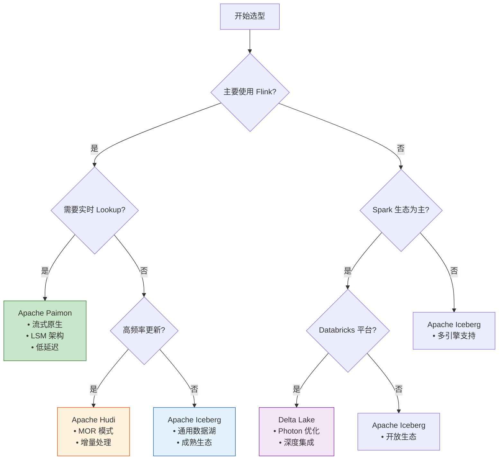
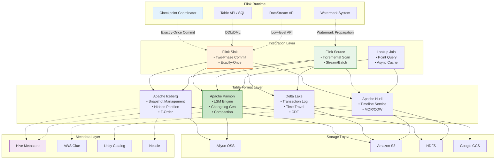
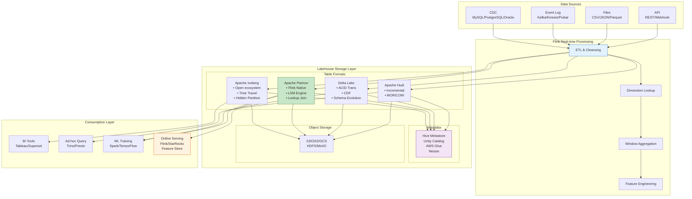
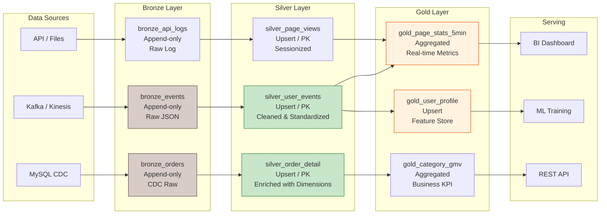
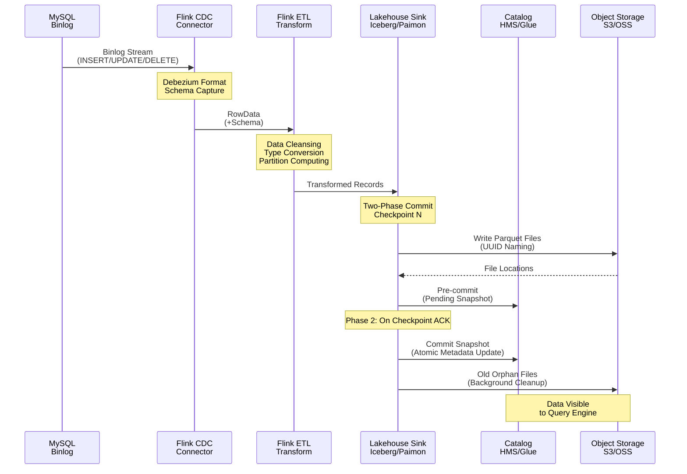
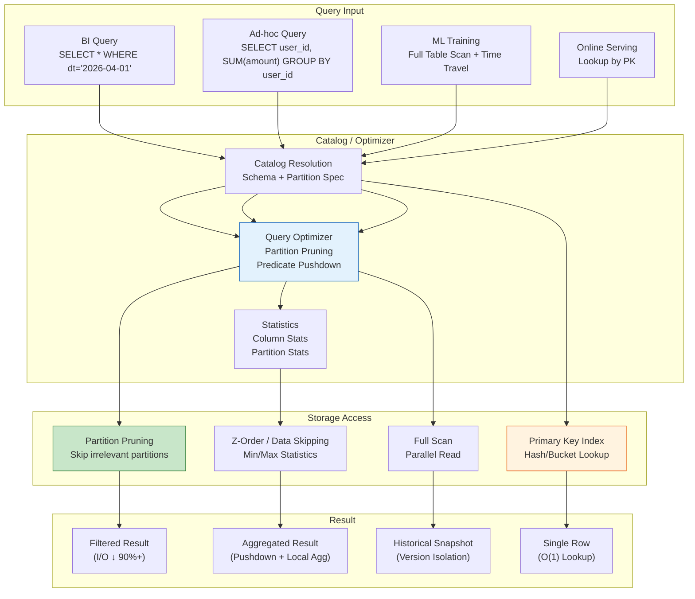
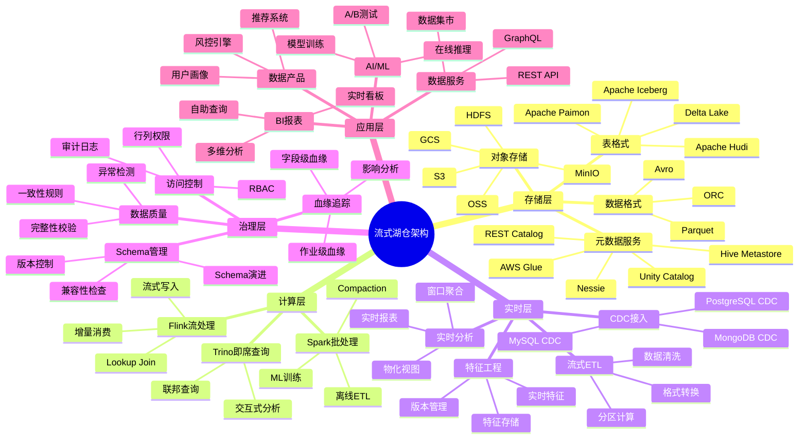
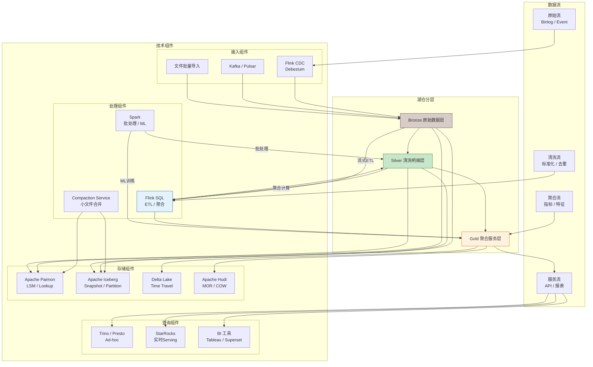
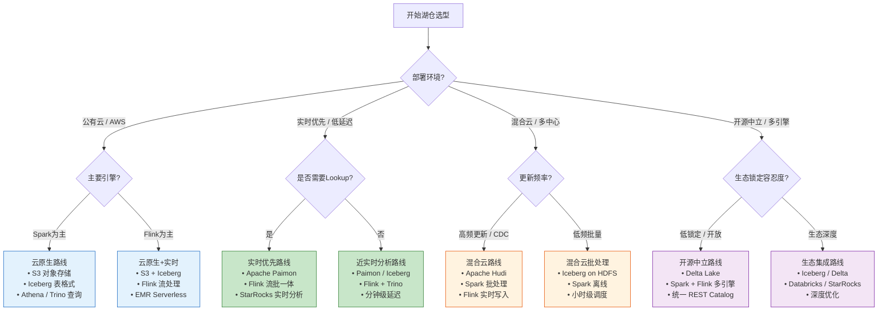

# Streaming Lakehouse Architecture — Flink 流式 Lakehouse 架构设计深度指南

> **所属阶段**: Flink/05-ecosystem/05.02-lakehouse/ | **前置依赖**: [Flink/05-ecosystem/05.02-lakehouse/flink-iceberg-integration.md](./flink-iceberg-integration.md), [Flink/05-ecosystem/05.02-lakehouse/flink-paimon-integration.md](./flink-paimon-integration.md), [Flink/03-api/09-language-foundations/04-streaming-lakehouse.md](../../03-api/09-language-foundations/04-streaming-lakehouse.md) | **形式化等级**: L4-L5 | **版本**: Flink 1.18+ / Iceberg 1.5+ / Paimon 0.8+ / Delta 3.0+

---

## 1. 概念定义 (Definitions)

### Def-F-05-40: 流式湖仓架构 (Streaming Lakehouse Architecture)

**定义**: 流式湖仓架构是一种将实时流处理能力与开放湖仓存储深度融合的数据架构范式，通过统一存储层支持流批一体的数据处理、分析与服务 (serving)。

**形式化结构**:

```
StreamingLakehouse = ⟨Storage, TableFormat, Engine, Metadata, Serving, Governance⟩

其中:
- Storage:    对象存储系统 (S3 / OSS / GCS / HDFS / MinIO)
- TableFormat: 开放表格式 (Iceberg / Paimon / Delta Lake / Hudi)
- Engine:      流批统一计算引擎 (Flink / Spark / Trino)
- Metadata:    统一元数据层 (Hive Metastore / Glue / Unity Catalog)
- Serving:     数据服务层 (查询引擎 / REST API / BI / Feature Store)
- Governance:  数据治理体系 (血缘 / 质量 / 安全 / 成本)
```

**核心特征矩阵**:

| 特征维度 | 传统数据湖 | 传统数仓 | 流式湖仓 |
|----------|-----------|----------|----------|
| **存储成本** | 低 | 高 | 低 |
| **实时性** | 小时~天级 | 小时~天级 | 秒级~分钟级 |
| **Schema 管理** | 弱 (读时模式) | 强 (写时模式) | 强 (显式演进) |
| **并发更新** | 弱 | 强 | 强 (事务隔离) |
| **时间旅行** | 无 | 有限 | 完整快照级 |
| **开放格式** | 是 (原始文件) | 否 (专有格式) | 是 (开放表格式) |
| **流批统一** | 否 | 否 | 是 |

---

### Def-F-05-41: 开放表格式 (Open Table Format)

**定义**: 开放表格式是在对象存储之上提供表抽象、事务语义和元数据管理的存储中间层，通过标准化元数据层使多计算引擎共享同一套数据。

**形式化模型**:

```
OpenTableFormat = ⟨DataFiles, MetadataLayer, TransactionLog, SnapshotIsolation⟩

元数据层结构:
  MetadataLayer = {Schema, PartitionSpec, Snapshots, Statistics, Properties}

快照隔离:
  ∀ query Q: Q reads from consistent_snapshot S_i
  ∀ transaction T: T commits to new_snapshot S_{i+1} atomically
```

**四大格式核心差异**:

| 维度 | Apache Iceberg | Apache Paimon | Delta Lake | Apache Hudi |
|------|---------------|---------------|------------|-------------|
| **存储格式** | Parquet/ORC/Avro | Parquet/ORC/Avro | Parquet | Parquet/ORC |
| **事务模型** | 乐观并发控制 | LSM-Tree + 快照 | 乐观并发控制 | MVCC |
| **更新模式** | Copy-on-Write | LSM + 异步 Compaction | Copy-on-Write | MOR / COW |
| **流式延迟** | 分钟级 | 秒级 | 分钟级 | 秒级~分钟级 |
| **增量消费** | 增量快照扫描 | LSM Snapshot + Changelog | Change Data Feed | 时间线服务 |
| **Flink 集成** | ⭐⭐⭐⭐ | ⭐⭐⭐⭐⭐ | ⭐⭐⭐ | ⭐⭐⭐⭐ |
| **小文件管理** | 外部调度 Compaction | 原生异步 Compaction | 自动 (Delta 2.0+) | 自动 |
| **Lookup Join** | 有限 | 原生支持 | 支持 | 支持 |

---

### Def-F-05-42: 流式入湖语义 (Streaming Ingestion Semantics)

**定义**: 流式入湖是将无界流数据持续、可靠地写入湖仓表的过程，需满足 exactly-once、有序性和低延迟三重约束。

**形式化模型**:

```
StreamingIngestion = ⟨SourceStream, IngestionMode, CommitProtocol, Consistency⟩

入湖模式:
  Mode ∈ {NearRealtime, MicroBatch}

  NearRealtime: checkpoint_interval → commit_latency
    latency ≈ checkpoint_interval (通常 5s ~ 60s)

  MicroBatch: batch_size + time_trigger → commit_latency
    latency ≈ max(batch_time, trigger_interval) (通常 1min ~ 5min)

提交协议:
  TwoPhaseCommit:
    Phase 1 (Pre-commit): 数据文件写入 + pending snapshot 准备
    Phase 2 (Commit): 原子元数据提交 → 数据立即可见
```

**近实时 vs 微批对比**:

| 维度 | 近实时 (Near Real-time) | 微批 (Micro-batch) |
|------|------------------------|-------------------|
| **Checkpoint 间隔** | 5s ~ 30s | 1min ~ 5min |
| **延迟** | 秒级 | 分钟级 |
| **小文件数量** | 较多 | 较少 |
| **元数据压力** | 高 | 中 |
| **适用场景** | CDC 同步、实时报表 | 日志聚合、批量 ETL |
| **Flink 实现** | `INSERT INTO` streaming | `INSERT OVERWRITE` / CTAS |

---

### Def-F-05-43: Flink + Iceberg 动态 Iceberg Sink 与隐藏分区

**定义**: Flink Dynamic Iceberg Sink 是在 Iceberg 1.5+ 中引入的流式写入优化机制，支持基于写入负载的自动分桶、隐藏分区 (Hidden Partitioning) 和 Z-Order 数据布局优化。

**形式化结构**:

```
DynamicIcebergSink = ⟨PartitionSpec, HiddenPartition, ZOrderLayout, AutoCompaction⟩

隐藏分区:
  HiddenPartition(column) = transform(column) → partition_value
  transform ∈ {identity, bucket(n), truncate(l), year, month, day, hour}
  查询端无需显式指定分区谓词,优化器自动下推

Z-Order 优化:
  ZOrder(columns) = interleave_bits(hash(c1), hash(c2), ...) → sort_key
  目标: 将多维查询的列相关性转化为局部性,减少 I/O
```

**与 Flink 的集成点**:

| 集成维度 | Flink 机制 | Iceberg 对应 | 协同语义 |
|----------|-----------|--------------|----------|
| **容错** | Checkpoint | 快照提交 | 两阶段提交 |
| **时间语义** | Watermark | 快照时间戳 | 对齐触发 |
| **增量消费** | 流式 Source | 快照差分 | 变更捕获 |
| **动态写入** | `SinkWriter` | `FileAppenderFactory` | 自适应文件大小 |
| **隐藏分区** | `PartitionComputer` | `PartitionSpec` | 透明分区演化 |

---

### Def-F-05-44: Flink + Paimon 主键表与增量日志模型

**定义**: Apache Paimon 基于日志结构合并树 (LSM-Tree) 实现流批统一的存储引擎，通过分层存储、异步合并和变更日志生成 (Changelog Generation) 优化流式场景。

**形式化结构**:

```
PaimonLSM = ⟨MemTable, WAL, L0, {L_i}_{i=1..k}, CompactionPolicy, ChangelogGen⟩

MemTable: 内存缓冲区 (有序跳表)
  - 写入 WAL 保证持久性
  - Flush 触发: 容量阈值 | 时间阈值 | Checkpoint

L0 (Level 0): 增量文件层
  - 文件间无序,可重叠
  - 支持实时增量消费

L_i (i≥1): 合并排序层
  - 文件按 Key 范围有序分区
  - 层间大小比例因子通常 10

变更日志生成模式:
  ChangelogGen ∈ {none, input, lookup, full-compaction}
  - input: 信任上游 CDC 变更类型
  - lookup: 通过点查生成前后像 (适合无 CDC 源)
  - full-compaction: 全量对比生成 (开销最大,最准确)
```

**流批访问路径**:

```
流式写入路径:
  Flink Source → MemTable → WAL → L0 Files → Snapshot Commit

批式查询路径:
  Query Planner → Snapshot Selection → L0∪L1∪...∪Lk Scan → Merge Sort

增量消费路径:
  Consumer → Snapshot Poll → ΔL0 Detection → Changelog Stream
```

---

### Def-F-05-45: Flink + Delta Lake Delta Sink 与时间旅行

**定义**: Delta Lake 是一种基于事务日志 (Transaction Log, `_delta_log`) 的开放存储格式，通过乐观并发控制实现 ACID 事务、Schema Evolution 和流批统一访问。

**核心架构形式化**:

```
DeltaLake = ⟨ParquetFiles, TransactionLog, Checkpoints, MetadataActions⟩

事务日志结构:
  _delta_log/
  ├── 00000000000000000000.json  (初始提交)
  ├── 00000000000000000001.json  (数据追加)
  ├── 00000000000000000002.json  (元数据更新)
  ├── ...
  └── _checkpoints/
      └── 00000000000000000010.checkpoint.parquet

提交原子性:
  commit(action_list) → atomic_write(_delta_log/{version+1}.json)

乐观并发控制:
  read(version) → compute(actions) → write_if_version_unchanged(version)

时间旅行查询:
  QueryAt(T, ts) = T.history.getVersionAt(ts)
  QueryAt(T, v)  = T.state_at_version(v)
```

**Flink 集成模式**:

| 模式 | 语义 | Flink 支持度 | 适用场景 |
|------|------|-------------|----------|
| **Append** | 仅追加新数据 | ⭐⭐⭐⭐⭐ | 事件流、日志数据 |
| **Upsert** | 主键去重更新 | ⭐⭐⭐ | CDC 同步 |
| **Complete** | 全量结果重写 | ⭐⭐⭐ | 聚合结果、小数据集 |
| **CDF 消费** | 读取变更数据流 | ⭐⭐⭐ | 增量 Pipeline |

---

### Def-F-05-46: 统一元数据层 (Unified Metadata Layer)

**定义**: 统一元数据层是湖仓架构中的目录服务 (Catalog)，负责跨引擎的表注册、Schema 管理、分区发现和访问控制，实现"一份元数据、多引擎共享"。

**形式化模型**:

```
UnifiedMetadata = ⟨CatalogService, SchemaRegistry, AccessControl, Lineage⟩

Catalog 实现:
  Catalog ∈ {HiveMetastore, AWSGlue, UnityCatalog, Nessie, RESTCatalog}

统一接口:
  listDatabases(namespace) → [Database]
  listTables(database) → [Table]
  loadTable(identifier) → Table(Schema, PartitionSpec, Properties, Location)
  createTable(identifier, schema, spec, properties) → Table
  alterTable(identifier, changes) → Table
```

**主流 Catalog 对比**:

| Catalog | 生态绑定 | ACID 支持 | 跨云能力 | 适用场景 |
|---------|---------|-----------|----------|----------|
| **Hive Metastore** | 开源通用 | 弱 (需格式支持) | 强 | 自建平台、混合云 |
| **AWS Glue** | AWS | 中 | AWS 内 | AWS 原生部署 |
| **Unity Catalog** | Databricks | 强 | 中 | Databricks 生态 |
| **Nessie** | 开源 | 强 (Git 式分支) | 强 | 数据工程 CI/CD |
| **REST Catalog** | Iceberg 标准 | 中 | 强 | 多引擎统一接入 |

---

### Def-F-05-47: Bronze-Silver-Gold 流式分层模型

**定义**: Bronze-Silver-Gold (BSG) 是一种数据分层设计方法论，在流式湖仓中通过 Flink SQL Pipeline 实现从原始数据到业务就绪数据的渐进式加工。

**形式化定义**:

```
BSG_Layers = ⟨Bronze, Silver, Gold, Pipeline⟩

Bronze (原始数据层):
  - 保留原始格式,不做业务变换
  - Append-only,支持 Schema Evolution
  - 保留周期: 长期 (1~3 年)

Silver (清洗明细层):
  - 数据清洗、标准化、去重
  - 支持 Upsert (主键去重)
  - Schema 约束 + 质量校验

Gold (聚合服务层):
  - 业务聚合、指标计算、特征工程
  - 面向查询优化 (预聚合、物化视图)
  - 服务级 SLA (延迟 < 秒级)

Pipeline(Bronze → Silver → Gold):
  ∀ record r: r ∈ Bronze ⟹ ( cleansing(r) ∈ Silver ⟹ aggregation(r) ∈ Gold )
```

---

## 2. 属性推导 (Properties)

### Lemma-F-05-40: 湖仓格式时间旅行完备性

**引理**: 主流开放表格式（Iceberg / Hudi / Delta / Paimon）均支持基于快照/版本的时间旅行查询，且语义等价。

**证明概要**:

```
时间旅行语义:
  ∀ format F ∈ {Iceberg, Hudi, Delta, Paimon}:
    ∃ function QueryAt(table, timestamp) → snapshot

Iceberg:
  QueryAt(T, ts) = argmax{s ∈ T.snapshots | s.timestamp ≤ ts}

Hudi:
  QueryAt(T, ts) = T.timeline.getInstant(ts).commit

Delta:
  QueryAt(T, ts) = T.history.getVersionAt(ts)

Paimon:
  QueryAt(T, ts) = argmax{s ∈ T.snapshots | s.create_time ≤ ts}

完备性保证:
  1. 单调递增的版本序列
  2. 不可变的历史状态存储
  3. 基于时间戳的索引检索
```

---

### Lemma-F-05-41: 流式写入幂等性

**引理**: 在 Flink Checkpoint 失败重启场景下，湖仓 Sink 的写入操作具有幂等性，最终数据不重复。

**证明**:

```
场景设定:
  - Checkpoint N 触发, Sink 进入 preCommit 阶段
  - 数据文件已写入存储,待提交元数据
  - Checkpoint N 失败,作业从 Checkpoint N-1 恢复

幂等性保证:
  1. 重启后数据重新处理,生成新数据文件 (UUID 命名)
  2. Checkpoint N' (重试) 成功,提交新快照
  3. 旧 pending 数据文件无快照引用,成为孤儿文件
  4. 孤儿文件清理作业定期回收

结论: 无论 Checkpoint 失败多少次,最终数据不重复 ∎
```

---

### Prop-F-05-40: 增量消费的有序性保证

**命题**: 从湖仓格式的增量消费保持数据产生的时间序（在快照粒度上单调）。

**形式化表述**:

```
设:
  - 快照序列: S = [s_1, s_2, ..., s_n]
  - 增量批次: Δ_i = scan_incremental(s_i, s_{i+1})
  - 记录时间戳: ts(r) = r.event_time

有序性条件:
  ∀ r_a ∈ Δ_i, r_b ∈ Δ_j: i < j ⇒ ts(r_a) ≤ ts(r_b) + ε

证明:
  1. 快照按 commit_time 排序: s_i.commit_time < s_j.commit_time (i < j)
  2. 数据文件的可见性与快照提交时间一致
  3. 消费者按快照 ID 顺序消费
  ∴ 消费序列保持时间序 ∎
```

---

### Prop-F-05-41: 存储成本优化边界

**命题**: 流式湖仓相比传统 Lambda 架构可降低 40–60% 存储成本。

**成本模型推导**:

```
Lambda 架构成本:
  Storage_λ = Storage_batch + Storage_stream
            = D × R_batch + D × R_stream × T_retention
            ≈ 2.5D (假设流存储保留 7 天,批存储全量)

Lakehouse 成本:
  Storage_LH = D × R_parquet × (1 + R_metadata)
             ≈ 1.2D (Parquet 压缩率 0.8,元数据开销 10%)

成本比:
  CostRatio = Storage_LH / Storage_λ ≈ 0.48

其中:
  D: 原始数据量
  R_batch: 批存储压缩率 (Parquet ≈ 0.3)
  R_stream: 流存储开销 (Kafka 副本因子 3)
  R_metadata: 元数据存储占比 (~10%)
```

---

## 3. 关系建立 (Relations)

### 3.1 四大湖仓格式与 Flink 的集成关系

**功能特性矩阵**:

| 维度 | Apache Iceberg | Apache Paimon | Delta Lake | Apache Hudi |
|------|---------------|---------------|------------|-------------|
| **存储格式** | Parquet/ORC/Avro | Parquet/ORC/Avro | Parquet | Parquet/ORC |
| **事务模型** | 乐观并发控制 | LSM Tree | 乐观并发控制 | MVCC |
| **更新模式** | Copy-on-Write | LSM + Compaction | Copy-on-Write | MOR/COW |
| **流式延迟** | 分钟级 | 秒级 | 分钟级 | 秒级~分钟级 |
| **增量消费** | 增量扫描 | LSM Snapshot | Change Data Feed | 时间线服务 |
| **Flink 集成** | ⭐⭐⭐⭐ | ⭐⭐⭐⭐⭐ | ⭐⭐⭐ | ⭐⭐⭐⭐ |
| **Spark 集成** | ⭐⭐⭐⭐⭐ | ⭐⭐⭐⭐ | ⭐⭐⭐⭐⭐ | ⭐⭐⭐⭐⭐ |
| **生态广度** | ⭐⭐⭐⭐⭐ | ⭐⭐⭐ | ⭐⭐⭐⭐ | ⭐⭐⭐⭐ |
| **小文件管理** | 外部调度 | 原生异步 | 自动 | 自动 |
| **Lookup Join** | 有限 | 原生支持 | 支持 | 支持 |

**选型决策树**:



---

### 3.2 Flink 与湖仓格式的集成架构



---

### 3.3 统一元数据层与多引擎关系

**元数据层是湖仓架构的"事实单一源"**:

| 引擎 | Iceberg Catalog | Paimon Catalog | Delta Catalog | 说明 |
|------|----------------|----------------|---------------|------|
| **Flink** | `CREATE CATALOG iceberg_catalog WITH ('type'='iceberg')` | `CREATE CATALOG paimon_catalog WITH ('type'='paimon')` | delta-flink connector | 原生 Table API 支持 |
| **Spark** | `spark.sql.catalog.iceberg` | `spark.sql.catalog.paimon` | `spark.sql.catalog.spark_catalog=delta` | 深度集成 |
| **Trino** | `iceberg` connector | 有限支持 | `delta-lake` connector | 查询优化 |
| **StarRocks** | External Catalog | 有限支持 | 有限支持 | 湖仓联邦查询 |

**统一元数据的关键价值**:

1. **Schema 一致性**: 一次 DDL 变更，全引擎感知
2. **分区发现**: 自动识别新增分区，无需 `MSCK REPAIR`
3. **统计信息共享**: 列统计、分区统计跨引擎复用
4. **访问控制统一**: 基于 Catalog 的 RBAC，避免多副本权限漂移

---

## 4. 论证过程 (Argumentation)

### 4.1 为何需要 Kappa + Lakehouse 融合架构

**传统 Lambda 架构的局限性**:

```
Lambda 架构痛点:
┌─────────────────────────────────────────────────────────────┐
│  Speed Layer (流处理)                                        │
│  ├── 低延迟但成本高 (内存/SSD)                               │
│  ├── 存储保留期短 (天级)                                     │
│  └── 计算结果与批层不一致                                    │
│                                                             │
│  Batch Layer (批处理)                                        │
│  ├── 高吞吐但延迟高 (小时级)                                 │
│  ├── 存储成本低 (对象存储)                                   │
│  └── T+1 结果与实时结果矛盾                                  │
│                                                             │
│  核心问题:                                                   │
│  1. 数据冗余: 同一份数据存储两份                             │
│  2. 逻辑重复: ETL 代码维护两套                               │
│  3. 结果不一致: 让用户困惑 "哪个数字是对的?"                 │
│  4. 运维复杂: 两套系统,双倍运维成本                         │
└─────────────────────────────────────────────────────────────┘
```

**Kappa + Lakehouse 融合方案**:

```
融合架构优势:
┌─────────────────────────────────────────────────────────────┐
│  统一存储层: Lakehouse (Iceberg/Paimon on S3)               │
│  ├── 低成本对象存储支持长期保留 (年级)                       │
│  ├── 开放格式支持多引擎访问 (Flink/Spark/Trino)             │
│  ├── 实时写入 + 批式查询统一                                 │
│  └── 完整数据治理能力                                        │
│                                                             │
│  统一处理层: Flink SQL                                       │
│  ├── 流批统一语义,一套代码                                  │
│  ├── 实时增量写入 Lakehouse                                  │
│  ├── 批模式历史数据处理                                      │
│  └── 增量消费支持流式 Pipeline                               │
│                                                             │
│  核心价值:                                                   │
│  ✓ 单一真相源 (Single Source of Truth)                       │
│  ✓ 流批结果一致                                              │
│  ✓ 存储成本降低 50%+                                         │
│  ✓ 运维复杂度降低                                            │
└─────────────────────────────────────────────────────────────┘
```

---

### 4.2 小文件问题与合并策略的工程权衡

**问题根源**:

```
高频流式写入 → 每个 Checkpoint 生成独立数据文件
  Checkpoint 间隔 10s → 每小时 360 个文件 → 每天 8,640 个文件
  元数据压力: manifest 文件数量爆炸
  查询性能: 过多小文件导致 I/O 放大、调度开销增加
```

**各格式合并策略对比**:

| 表格式 | 合并机制 | 触发方式 | 配置复杂度 | 推荐场景 |
|--------|---------|----------|-----------|----------|
| **Iceberg** | `OPTIMIZE` / `REWRITE_DATA_FILES` | 外部调度 (Spark/Flink 作业) | 中 | 已有 Spark 生态 |
| **Paimon** | 原生异步 Compaction | 自动触发 (文件数/时间阈值) | 低 | Flink 原生场景 |
| **Delta** | `OPTIMIZE` + `VACUUM` | 自动 (Delta 2.0+) / Databricks 托管 | 低 | Databricks 平台 |
| **Hudi** | Compaction + Clustering | 自动 (MOR 表内联) | 中 | 高频更新场景 |

**Paimon Compaction 配置示例**:

```sql
-- 自动异步 Compaction,无需外部作业
CREATE TABLE paimon_events (
    event_id STRING,
    user_id STRING,
    event_time TIMESTAMP(3),
    dt STRING,
    PRIMARY KEY (event_id, dt) NOT ENFORCED
) PARTITIONED BY (dt) WITH (
    'bucket' = '16',
    'compaction.async' = 'true',
    'compaction.min.file-num' = '5',
    'compaction.max.file-num' = '50',
    'num-sorted-run.compaction-trigger' = '5',
    'compaction.early-max.file-num' = '30'
);
```

**Iceberg 外部 Compaction 作业**:

```sql
-- 使用 Flink SQL 定期执行 OPTIMIZE
CALL iceberg_catalog.system.rewrite_data_files(
    table => 'realtime_dw.events',
    options => map(
        'min-input-files', '5',
        'max-concurrent-file-group-rewrites', '5',
        'target-file-size-bytes', '134217728'
    )
);
```

---

### 4.3 Schema Evolution 处理策略

**演进类型与兼容性矩阵**:

| 变更类型 | Iceberg | Paimon | Delta | 兼容性 |
|----------|---------|--------|-------|--------|
| **添加列 (Add Column)** | ✅ | ✅ | ✅ | 向后兼容 |
| **删除列 (Drop Column)** | ✅ | ✅ | ✅ | 不兼容 |
| **重命名列 (Rename)** | ✅ | ✅ | ✅ | 向后兼容 |
| **修改列类型 (Alter Type)** | ✅ ( widening ) | ✅ ( widening ) | ✅ ( widening ) | 有限兼容 |
| **添加嵌套字段** | ✅ | ⚠️ | ✅ | 向后兼容 |
| **分区演进 (Partition Evolution)** | ✅ 原生 | ⚠️ 需重建 | ❌ | 不兼容 |

**Flink SQL Schema Evolution 示例 (Iceberg)**:

```sql
-- 1. 初始表结构
CREATE TABLE iceberg_users (
    user_id STRING,
    name STRING,
    age INT
);

-- 2. 添加新列 (向后兼容)
ALTER TABLE iceberg_users ADD COLUMN email STRING;

-- 3. 修改列注释和类型 widening
ALTER TABLE iceberg_users ALTER COLUMN age TYPE BIGINT;

-- 4. 分区演进 (Iceberg 特有,支持修改分区策略而不重写历史数据)
ALTER TABLE iceberg_users ADD PARTITION FIELD bucket(16, user_id);
```

---

### 4.4 成本优化策略边界分析

**存储层成本优化**:

```
策略 1: 智能分层存储
┌─────────────────────────────────────────────────────────────┐
│  热数据 (最近 7 天) → 标准存储 (Standard)                    │
│  温数据 (7-90 天) → 低频访问 (IA)                            │
│  冷数据 (90 天+) → 归档存储 (Archive / Glacier)              │
│                                                             │
│  Lakehouse 配合:                                            │
│  - 按时间分区 (dt=yyyy-MM-dd)                               │
│  - 生命周期策略自动迁移                                      │
│  - 元数据层保持访问透明                                      │
└─────────────────────────────────────────────────────────────┘

策略 2: 压缩与编码优化
┌─────────────────────────────────────────────────────────────┐
│  Parquet 配置:                                              │
│  - 列式存储 + Snappy/ZSTD 压缩                               │
│  - ZSTD 级别 3-5 平衡压缩率与速度                            │
│  - 字典编码字符串列                                          │
│                                                             │
│  典型压缩比:                                                 │
│  - 日志数据: 10:1 ~ 20:1                                     │
│  - 业务数据: 3:1 ~ 5:1                                       │
└─────────────────────────────────────────────────────────────┘
```

**计算层成本优化**:

```
策略 1: 存算分离架构
┌─────────────────────────────────────────────────────────────┐
│  传统架构: 计算与存储绑定 (HDFS)                             │
│  - 扩容需同时扩计算和存储                                    │
│  - 资源利用率低                                              │
│                                                             │
│  存算分离: 对象存储 + 弹性计算 (Flink on K8s)                │
│  - 存储独立扩缩容                                            │
│  - 计算按需弹性                                              │
│  - 成本节省 30-50%                                           │
└─────────────────────────────────────────────────────────────┘

策略 2: 自动扩缩容
┌─────────────────────────────────────────────────────────────┐
│  Flink Autoscaler:                                          │
│  - 基于积压 (Backlog) 自动扩缩容                             │
│  - 低峰期缩减资源,高峰期自动扩容                            │
│  - 结合 Spot 实例进一步降低成本                              │
│                                                             │
│  配置示例:                                                   │
│  pipeline.autoscaler.enabled: true                          │
│  pipeline.autoscaler.target.utilization: 0.7                │
└─────────────────────────────────────────────────────────────┘
```

---

## 5. 形式证明 / 工程论证 (Proof / Engineering Argument)

### Thm-F-05-40: 统一批流结果一致性定理

**定理**: 在 Streaming Lakehouse 架构中，同一 Flink SQL 查询在批模式和流模式下产生一致的结果。

**形式化表述**:

```
设:
  - 输入数据集 D = {d_1, d_2, ..., d_n}
  - 批模式结果: R_batch = Flink_SQL(D, BATCH_MODE)
  - 流模式结果: R_stream = accumulate(Flink_SQL(ΔD, STREAM_MODE))

一致性条件:
  R_batch ≡ R_stream

其中 ΔD 是 D 的增量划分: D = ∪_{i} ΔD_i
```

**证明**:

```
前提条件:
  P1: Flink Table API 提供统一的逻辑计划生成
  P2: 湖仓格式 (Paimon/Iceberg) 保证快照隔离
  P3: 批扫描与增量扫描访问相同数据文件集合

证明步骤:

Step 1: 逻辑计划等价性
  对于查询 Q: SELECT f(c1, c2) FROM T WHERE condition

  批模式逻辑计划:
    BatchScan(T) → Filter(condition) → Project(f(c1, c2))

  流模式逻辑计划:
    StreamScan(T) → Filter(condition) → Project(f(c1, c2))

  逻辑计划树结构相同,仅物理执行策略不同。

Step 2: 数据可见性等价
  批模式读取快照 S(t):
    Data_Batch = ∪_{f ∈ S(t).files} read(f)

  流模式读取增量 Δ = S(t) - S(t_0):
    Data_Stream = ∪_{f ∈ Δ.files} read(f)
    累积结果 = accumulate(Data_Stream over time)

  当流处理完成所有增量后:
    accumulate(Data_Stream) = Data_Batch

Step 3: 执行语义等价
  对于确定性操作 (Filter, Project, Aggregation):
    f(Data_Batch) = accumulate(f(Data_Stream))

  由于操作的确定性,批处理全量计算结果 =
  流处理增量结果累积

结论: 结果一致性得证 ∎
```

---

### Thm-F-05-41: 湖仓格式端到端 Exactly-Once 语义定理

**定理**: Flink 通过两阶段提交协议与湖仓格式的事务机制，可以保证流写入的端到端 Exactly-Once 语义。

**证明**:

```
前提条件:
  P1: Flink Checkpoint 提供作业级别的 Exactly-Once 保证
  P2: 湖仓格式 (Iceberg/Paimon/Delta) 提供存储级事务支持
  P3: 两阶段提交协议协调 Checkpoint 与存储事务

两阶段提交流程:
┌────────────────────────────────────────────────────────────────────┐
│ Phase 1: Pre-commit                                               │
│ ───────────────────────────────────────────────────────────────── │
│ 1. Checkpoint 触发,Sink 算子冻结状态                              │
│ 2. 将缓冲数据写入数据文件 (Parquet)                                │
│    - Iceberg: 写入临时位置,生成 pending snapshot                  │
│    - Paimon: 写入 LSM L0,准备 commit                              │
│    - Delta: 准备 actions list                                     │
│ 3. 向 Checkpoint Coordinator 汇报预提交信息                        │
│                                                                  │
│ 不变式 I1: 数据文件已持久化,但未对查询可见                        │
└────────────────────────────────────────────────────────────────────┘

┌────────────────────────────────────────────────────────────────────┐
│ Phase 2: Commit                                                   │
│ ───────────────────────────────────────────────────────────────── │
│ 触发: 所有算子成功完成 preCommit                                  │
│                                                                  │
│ 操作:                                                             │
│ 1. Coordinator 广播 Checkpoint ACK                                │
│ 2. Sink 收到 ACK 后执行 commit:                                   │
│    - Iceberg: commitSnapshot() → 原子更新 metadata                │
│    - Paimon: commit() → 更新 Snapshot 指针                        │
│    - Delta: 写入 _delta_log/{version}.json                        │
│ 3. 新数据立即可见                                                 │
│                                                                  │
│ 不变式 I2: 事务原子性保证,要么全部可见,要么全部不可见            │
└────────────────────────────────────────────────────────────────────┘

故障恢复分析:
Case 1: Checkpoint 失败 (Phase 2 未执行)
  - pending 数据未提交
  - 作业从上一个成功 Checkpoint 恢复
  - 数据重新处理,生成新的数据文件
  - 旧 pending 文件成为孤儿文件,后续清理

Case 2: Commit 过程中失败
  - 部分提交可能成功
  - 恢复后重新执行 commit
  - 存储层的 CAS/幂等机制保证不重复

结论: 端到端 Exactly-Once 得证 ∎
```

---

### Thm-F-05-42: 增量消费完备性定理

**定理**: 湖仓格式的增量消费机制保证不遗漏、不重复地消费所有变更数据。

**证明**:

```
定义:
  - 快照序列: S = [s_1, s_2, ..., s_n]
  - 增量消费函数: IncrementalConsume(s_i, s_j) → Δ
  - 完备性条件:
    (1) 不遗漏: ∀ record r ∈ s_j \ s_i: r ∈ Δ
    (2) 不重复: ∀ record r ∈ Δ: count(r) = 1

证明 (以 Iceberg 为例):

Step 1: 快照不可变性
  Iceberg 快照一旦创建不可修改:
    ∀ s ∈ S: immutable(s.files)

  新快照通过引用现有文件 + 新增文件构成:
    s_{k+1}.files = s_k.files ∪ new_files

Step 2: 增量检测算法
  ΔFiles = s_{j}.manifests \ s_{i}.manifests

  由于 manifest 文件不可变:
    - s_j 引用的 manifest 集合是 s_i 的超集
    - 差集计算精确捕获新增文件

Step 3: 不遗漏证明
  ∀ file f ∈ s_j.files ∧ f ∉ s_i.files:
    f 必被某个 manifest m 引用
    m ∈ s_j.manifests ∧ m ∉ s_i.manifests
    ∴ f ∈ ΔFiles

Step 4: 不重复证明
  ∀ file f ∈ s_i.files:
    f 被 manifest m 引用
    m ∈ s_i.manifests
    由于集合差运算: m ∉ ΔFiles
    ∴ f 不会被重复消费

结论: 增量消费完备性得证 ∎
```

---

## 6. 实例验证 (Examples)

### 6.1 架构模式 1: 实时数仓 (Real-time DWH)

**场景**: 构建基于 Paimon 的实时数仓，支持秒级延迟的报表查询。

```sql
-- ============================================
-- 步骤 1: 创建 Paimon Catalog
-- ============================================
CREATE CATALOG paimon_catalog WITH (
    'type' = 'paimon',
    'warehouse' = 'oss://my-bucket/paimon-warehouse',
    'metastore' = 'hive',
    'uri' = 'thrift://hive-metastore:9083',
    'snapshot.num-retained.min' = '10',
    'snapshot.num-retained.max' = '200',
    'snapshot.time-retained' = '24h'
);

USE CATALOG paimon_catalog;

-- ============================================
-- 步骤 2: Bronze 层 - 原始事件接入
-- ============================================
CREATE TABLE bronze_events (
    raw_json STRING,
    ingest_time TIMESTAMP(3),
    dt STRING
) PARTITIONED BY (dt) WITH (
    'bucket' = '8',
    'write-mode' = 'append-only'
);

INSERT INTO bronze_events
SELECT
    raw_data AS raw_json,
    NOW() AS ingest_time,
    DATE_FORMAT(ingest_time, 'yyyy-MM-dd') AS dt
FROM kafka_raw_source;

-- ============================================
-- 步骤 3: Silver 层 - 清洗与标准化
-- ============================================
CREATE TABLE silver_user_events (
    event_id STRING,
    user_id STRING,
    event_type STRING,
    page_id STRING,
    duration_ms INT,
    event_time TIMESTAMP(3),
    dt STRING,
    PRIMARY KEY (event_id, dt) NOT ENFORCED
) PARTITIONED BY (dt) WITH (
    'bucket' = '32',
    'changelog-producer' = 'input',
    'compaction.async' = 'true'
);

INSERT INTO silver_user_events
SELECT
    JSON_VALUE(raw_json, '$.event_id') AS event_id,
    JSON_VALUE(raw_json, '$.user_id') AS user_id,
    JSON_VALUE(raw_json, '$.event_type') AS event_type,
    JSON_VALUE(raw_json, '$.page_id') AS page_id,
    CAST(JSON_VALUE(raw_json, '$.duration') AS INT) AS duration_ms,
    TO_TIMESTAMP(JSON_VALUE(raw_json, '$.timestamp')) AS event_time,
    dt
FROM bronze_events
WHERE raw_json IS NOT NULL;

-- ============================================
-- 步骤 4: Gold 层 - 聚合指标
-- ============================================
CREATE TABLE gold_page_stats_5min (
    window_start TIMESTAMP(3),
    window_end TIMESTAMP(3),
    page_id STRING,
    uv BIGINT,
    pv BIGINT,
    avg_duration_ms BIGINT,
    PRIMARY KEY (window_start, page_id) NOT ENFORCED
) WITH (
    'bucket' = '16',
    'changelog-producer' = 'input'
);

INSERT INTO gold_page_stats_5min
SELECT
    TUMBLE_START(event_time, INTERVAL '5' MINUTE) AS window_start,
    TUMBLE_END(event_time, INTERVAL '5' MINUTE) AS window_end,
    page_id,
    COUNT(DISTINCT user_id) AS uv,
    COUNT(*) AS pv,
    AVG(duration_ms) AS avg_duration_ms
FROM silver_user_events
WHERE event_type = 'page_view'
GROUP BY
    TUMBLE(event_time, INTERVAL '5' MINUTE),
    page_id;
```

---

### 6.2 架构模式 2: CDC 入湖 (Change Data Capture to Lakehouse)

**场景**: MySQL 实时 CDC 同步到 Iceberg，支持时间旅行和增量消费。

```sql
-- ============================================
-- 步骤 1: 创建 Iceberg Catalog
-- ============================================
CREATE CATALOG iceberg_catalog WITH (
    'type' = 'iceberg',
    'catalog-type' = 'hive',
    'uri' = 'thrift://hive-metastore:9083',
    'warehouse' = 'oss://my-bucket/iceberg-warehouse',
    'io-impl' = 'org.apache.iceberg.aliyun.oss.OSSFileIO'
);

USE CATALOG iceberg_catalog;

-- ============================================
-- 步骤 2: MySQL CDC Source
-- ============================================
CREATE TABLE mysql_orders (
    order_id STRING,
    user_id STRING,
    product_id STRING,
    amount DECIMAL(18,2),
    status STRING,
    created_at TIMESTAMP(3),
    updated_at TIMESTAMP(3),
    PRIMARY KEY (order_id) NOT ENFORCED
) WITH (
    'connector' = 'mysql-cdc',
    'hostname' = 'mysql.internal',
    'port' = '3306',
    'username' = '${MYSQL_USER}',
    'password' = '${MYSQL_PASSWORD}',
    'database-name' = 'ecommerce',
    'table-name' = 'orders',
    'server-time-zone' = 'Asia/Shanghai',
    'scan.incremental.snapshot.enabled' = 'true'
);

-- ============================================
-- 步骤 3: Iceberg 目标表 (支持 Upsert)
-- ============================================
CREATE TABLE iceberg_orders (
    order_id STRING,
    user_id STRING,
    product_id STRING,
    amount DECIMAL(18,2),
    status STRING,
    created_at TIMESTAMP(3),
    updated_at TIMESTAMP(3),
    dt STRING
) PARTITIONED BY (dt) WITH (
    'write.format.default' = 'parquet',
    'write.parquet.compression-codec' = 'zstd',
    'write.target-file-size-bytes' = '134217728',
    'write.distribution-mode' = 'hash',
    'write.metadata.previous-versions-max' = '100',
    'read.streaming.enabled' = 'true',
    'read.streaming.start-mode' = 'latest',
    'monitor-interval' = '30s',
    'history.expire.max-snapshot-age-ms' = '604800000'
);

-- 启动 CDC 同步
INSERT INTO iceberg_orders
SELECT
    order_id, user_id, product_id, amount, status,
    created_at, updated_at,
    DATE_FORMAT(updated_at, 'yyyy-MM-dd') AS dt
FROM mysql_orders;

-- ============================================
-- 步骤 4: 增量消费 Iceberg 变更
-- ============================================
SET 'execution.runtime-mode' = 'streaming';

CREATE TABLE iceberg_order_changes (
    order_id STRING,
    user_id STRING,
    product_id STRING,
    amount DECIMAL(18,2),
    status STRING,
    _change_type STRING,
    _change_timestamp TIMESTAMP(3)
) WITH (
    'connector' = 'iceberg',
    'catalog-name' = 'iceberg_catalog',
    'catalog-database' = 'default',
    'catalog-table' = 'iceberg_orders',
    'streaming' = 'true',
    'streaming-scheme' = 'incremental-snapshot',
    'monitor-interval' = '10s'
);

-- 将变更写入下游 Kafka 供实时应用消费
INSERT INTO kafka_order_changes
SELECT *, _change_type, _change_timestamp FROM iceberg_order_changes;
```

---

### 6.3 架构模式 3: 实时特征平台 (Feature Store on Lakehouse)

**场景**: 基于 Paimon 构建实时特征平台，支持在线 Serving 和离线训练的特征一致性。

```sql
-- ============================================
-- 特征表 1: 用户实时画像 (Lookup 支持)
-- ============================================
CREATE TABLE fs_user_profile (
    user_id STRING PRIMARY KEY NOT ENFORCED,
    total_orders BIGINT,
    total_gmv DECIMAL(38,2),
    last_order_time TIMESTAMP(3),
    favorite_category STRING,
    user_segment STRING,
    update_time TIMESTAMP(3)
) WITH (
    'bucket' = '64',
    'changelog-producer' = 'lookup',
    'compaction.async' = 'true',
    -- 优化 Lookup 性能
    'lookup.cache-rows' = '100000',
    'lookup.cache-ttl' = '10min'
);

-- 从订单流实时计算用户画像
INSERT INTO fs_user_profile
SELECT
    user_id,
    COUNT(*) AS total_orders,
    SUM(amount) AS total_gmv,
    MAX(created_at) AS last_order_time,
    MODE(product_category) AS favorite_category,
    CASE
        WHEN SUM(amount) > 10000 THEN 'VIP'
        WHEN SUM(amount) > 1000 THEN 'GOLD'
        ELSE 'NORMAL'
    END AS user_segment,
    NOW() AS update_time
FROM paimon_orders
GROUP BY user_id;

-- ============================================
-- 特征表 2: 实时窗口特征 (滑动窗口)
-- ============================================
CREATE TABLE fs_user_behavior_1h (
    window_start TIMESTAMP(3),
    window_end TIMESTAMP(3),
    user_id STRING,
    page_view_count BIGINT,
    click_count BIGINT,
    avg_session_duration_ms BIGINT,
    PRIMARY KEY (window_start, user_id) NOT ENFORCED
) WITH (
    'bucket' = '32',
    'changelog-producer' = 'input'
);

INSERT INTO fs_user_behavior_1h
SELECT
    HOP_START(event_time, INTERVAL '1' HOUR, INTERVAL '5' MINUTE) AS window_start,
    HOP_END(event_time, INTERVAL '1' HOUR, INTERVAL '5' MINUTE) AS window_end,
    user_id,
    COUNT(*) FILTER (WHERE event_type = 'page_view') AS page_view_count,
    COUNT(*) FILTER (WHERE event_type = 'click') AS click_count,
    AVG(session_duration_ms) AS avg_session_duration_ms
FROM silver_user_events
GROUP BY
    HOP(event_time, INTERVAL '1' HOUR, INTERVAL '5' MINUTE),
    user_id;

-- ============================================
-- 在线 Serving: Lookup Join
-- ============================================
-- 实时推荐场景: 订单流 Lookup 用户画像
CREATE TABLE realtime_recommendation (
    order_id STRING,
    user_id STRING,
    user_segment STRING,
    favorite_category STRING,
    recommend_category STRING,
    proc_time TIMESTAMP(3)
) WITH (
    'connector' = 'jdbc',
    'url' = 'jdbc:mysql://serving-db:3306/recommendations',
    'table-name' = 'recommendation_log'
);

INSERT INTO realtime_recommendation
SELECT
    o.order_id,
    o.user_id,
    u.user_segment,
    u.favorite_category,
    COALESCE(u.favorite_category, 'general') AS recommend_category,
    NOW() AS proc_time
FROM paimon_orders o
LEFT JOIN fs_user_profile FOR SYSTEM_TIME AS OF o.proc_time AS u
    ON o.user_id = u.user_id;
```

---

### 6.4 架构模式 4: AI/ML 数据流水线 (ML Pipeline on Lakehouse)

**场景**: 构建从实时数据到 ML 训练/推理的端到端流水线，利用 Lakehouse 的开放格式实现特征共享。

```sql
-- ============================================
-- ML 特征存储 (Iceberg, 支持版本回溯)
-- ============================================
CREATE CATALOG ml_catalog WITH (
    'type' = 'iceberg',
    'catalog-type' = 'rest',
    'uri' = 'http://iceberg-rest:8181',
    'warehouse' = 's3://ml-bucket/feature-store'
);

USE CATALOG ml_catalog;

-- ============================================
-- 训练特征表 (批式写入,支持版本管理)
-- ============================================
CREATE TABLE ml_training_features (
    user_id STRING,
    feature_timestamp TIMESTAMP(3),
    f_numeric_1 DOUBLE,
    f_numeric_2 DOUBLE,
    f_category_1 STRING,
    label DOUBLE,
    dt STRING
) PARTITIONED BY (dt) WITH (
    'write.format.default' = 'parquet',
    'write.parquet.compression-codec' = 'zstd',
    'write.target-file-size-bytes' = '268435456',
    -- 保留历史版本供实验回溯
    'history.expire.max-snapshot-age-ms' = '2592000000',
    'history.expire.min-snapshots-to-keep' = '10'
);

-- ============================================
-- 特征工程 Pipeline (Flink SQL)
-- ============================================
INSERT INTO ml_training_features
SELECT
    user_id,
    window_end AS feature_timestamp,
    CAST(page_view_count AS DOUBLE) / 100.0 AS f_numeric_1,
    CAST(click_count AS DOUBLE) / CAST(NULLIF(page_view_count, 0) AS DOUBLE) AS f_numeric_2,
    favorite_category AS f_category_1,
    CASE WHEN total_gmv > 500 THEN 1.0 ELSE 0.0 END AS label,
    DATE_FORMAT(window_end, 'yyyy-MM-dd') AS dt
FROM fs_user_behavior_1h ub
LEFT JOIN fs_user_profile up
    ON ub.user_id = up.user_id;

-- ============================================
-- 推理特征表 (实时更新,低延迟)
-- ============================================
CREATE TABLE ml_online_features (
    user_id STRING PRIMARY KEY NOT ENFORCED,
    f_numeric_1 DOUBLE,
    f_numeric_2 DOUBLE,
    f_category_1 STRING,
    update_time TIMESTAMP(3)
) WITH (
    'bucket' = '128',
    'changelog-producer' = 'lookup'
);

INSERT INTO ml_online_features
SELECT
    user_id,
    CAST(total_orders AS DOUBLE) / 100.0 AS f_numeric_1,
    CAST(total_gmv AS DOUBLE) / 10000.0 AS f_numeric_2,
    favorite_category AS f_category_1,
    update_time
FROM fs_user_profile;

-- ============================================
-- 模型训练与推理衔接 (Python + PyFlink)
-- ============================================
-- 训练端 (Spark/PyTorch) 读取 Iceberg 历史快照
-- SELECT * FROM ml_training_features FOR SYSTEM_VERSION AS OF 12345;

-- 推理端 (Flink) 实时消费在线特征并调用模型服务
```

**ML Pipeline 架构说明**:

| 阶段 | 技术栈 | 存储格式 | 延迟要求 |
|------|--------|---------|----------|
| **数据采集** | Flink CDC / Kafka | 原始流 | 实时 |
| **特征工程** | Flink SQL | Iceberg / Paimon | 分钟级 |
| **离线训练** | Spark / PyTorch | Iceberg (版本快照) | 小时级 |
| **在线推理** | Flink + Model Serving | Paimon (Lookup) | 毫秒级 |
| **监控反馈** | Flink | Iceberg (Append) | 实时 |

---

### 6.5 Flink + Iceberg: 动态 Sink、隐藏分区与 Z-Order

```sql
-- ============================================
-- 动态 Iceberg Sink 配置
-- ============================================
CREATE CATALOG iceberg_catalog WITH (
    'type' = 'iceberg',
    'catalog-type' = 'hive',
    'uri' = 'thrift://hive-metastore:9083',
    'warehouse' = 'oss://my-bucket/iceberg-warehouse'
);

USE CATALOG iceberg_catalog;

-- 隐藏分区表: 查询端无需感知分区字段
CREATE TABLE iceberg_hidden_partition_events (
    event_id STRING,
    user_id STRING,
    event_type STRING,
    event_time TIMESTAMP(3)
) PARTITIONED BY (
    -- 隐藏分区: 按月分区,但查询 WHERE event_time 自动下推
    MONTH(event_time),
    -- 桶分区: 16 个桶均匀分布
    BUCKET(16, user_id)
) WITH (
    'write.format.default' = 'parquet',
    'write.parquet.compression-codec' = 'zstd',
    -- 动态写入优化
    'write.target-file-size-bytes' = '134217728',
    'write.distribution-mode' = 'hash',
    -- 启用 Z-Order (Iceberg 1.5+ 通过 Spark, Flink 侧配合写入排序)
    'write.ordering.mode' = 'sort',
    'write.ordering.columns' = 'user_id,event_type'
);

-- ============================================
-- Z-Order 优化: 通过 Flink 预排序写入
-- ============================================
INSERT INTO iceberg_hidden_partition_events
SELECT
    event_id,
    user_id,
    event_type,
    event_time
FROM kafka_source
-- Flink 侧按 Z-Order 键排序后写入,提升多维查询局部性
ORDER BY event_time, user_id, event_type;

-- ============================================
-- 查询时自动分区下推 (对用户透明)
-- ============================================
-- 以下查询会自动下推到 2026-04 的分区,无需指定 dt
SELECT event_type, COUNT(*) AS cnt
FROM iceberg_hidden_partition_events
WHERE event_time >= TIMESTAMP '2026-04-01 00:00:00'
  AND event_time < TIMESTAMP '2026-05-01 00:00:00'
GROUP BY event_type;

-- ============================================
-- Iceberg Compaction (小文件合并)
-- ============================================
CALL iceberg_catalog.system.rewrite_data_files(
    table => 'default.iceberg_hidden_partition_events',
    options => map(
        'min-input-files', '5',
        'max-concurrent-file-group-rewrites', '5',
        'target-file-size-bytes', '134217728',
        'sort-order', 'user_id ASC NULLS LAST'
    )
);
```

---

### 6.6 Flink + Paimon: Lookup Join 与物化表

```sql
-- ============================================
-- Paimon Lookup Join 最佳实践
-- ============================================
CREATE CATALOG paimon_catalog WITH (
    'type' = 'paimon',
    'warehouse' = 'oss://my-bucket/paimon-warehouse'
);

USE CATALOG paimon_catalog;

-- 维度表: 用户基础信息 (开启 Lookup 支持)
CREATE TABLE dim_users (
    user_id STRING PRIMARY KEY NOT ENFORCED,
    user_name STRING,
    age INT,
    gender STRING,
    city STRING,
    register_date DATE
) WITH (
    'bucket' = '16',
    'changelog-producer' = 'lookup',
    'lookup.cache-rows' = '50000',
    'lookup.cache-ttl' = '5min'
);

-- 维度表: 产品信息
CREATE TABLE dim_products (
    product_id STRING PRIMARY KEY NOT ENFORCED,
    product_name STRING,
    category STRING,
    brand STRING,
    price DECIMAL(18,2)
) WITH (
    'bucket' = '8',
    'changelog-producer' = 'lookup'
);

-- 实时订单宽表 (流式 Join 维度)
CREATE TABLE dwd_order_full (
    order_id STRING,
    user_id STRING,
    user_name STRING,
    age INT,
    city STRING,
    product_id STRING,
    product_name STRING,
    category STRING,
    brand STRING,
    price DECIMAL(18,2),
    amount DECIMAL(18,2),
    status STRING,
    created_at TIMESTAMP(3),
    dt STRING,
    PRIMARY KEY (order_id, dt) NOT ENFORCED
) PARTITIONED BY (dt) WITH (
    'bucket' = '32',
    'changelog-producer' = 'lookup'
);

-- 流式 Lookup Join (实时打宽)
INSERT INTO dwd_order_full
SELECT
    o.order_id,
    o.user_id,
    u.user_name,
    u.age,
    u.city,
    o.product_id,
    p.product_name,
    p.category,
    p.brand,
    p.price,
    o.amount,
    o.status,
    o.created_at,
    o.dt
FROM paimon_orders o
LEFT JOIN dim_users FOR SYSTEM_TIME AS OF o.proc_time AS u
    ON o.user_id = u.user_id
LEFT JOIN dim_products FOR SYSTEM_TIME AS OF o.proc_time AS p
    ON o.product_id = p.product_id;

-- ============================================
-- 物化表 (Materialized Table) 实时报表
-- ============================================
CREATE MATERIALIZED TABLE ads_realtime_gmv
REFRESH MODE AUTO
WITH (
    'refresh-interval' = '1min'
)
AS
SELECT
    DATE_FORMAT(window_start, 'yyyy-MM-dd HH:mm') AS time_slot,
    category,
    brand,
    SUM(amount) AS gmv,
    COUNT(*) AS order_count,
    NOW() AS update_time
FROM dws_category_stats_5min;
```

---

### 6.7 Flink + Delta Lake: Time Travel 与 Schema Evolution

```java
import org.apache.flink.streaming.api.environment.StreamExecutionEnvironment;
import org.apache.flink.table.api.Table;
import org.apache.flink.table.api.bridge.java.StreamTableEnvironment;

/**
 * Delta Lake 与 Flink 集成: Time Travel 与 Schema Evolution
 */
public class DeltaLakeAdvanced {

    public static void main(String[] args) throws Exception {
        StreamExecutionEnvironment env =
            StreamExecutionEnvironment.getExecutionEnvironment();
        env.enableCheckpointing(60000);

        StreamTableEnvironment tEnv = StreamTableEnvironment.create(env);

        // 1. 创建 Delta Catalog
        tEnv.executeSql("""
            CREATE CATALOG delta_catalog WITH (
                'type' = 'delta',
                'warehouse' = 's3://my-bucket/delta-warehouse'
            )
        """);

        tEnv.useCatalog("delta_catalog");

        // 2. 创建支持 Schema Evolution 的 Delta 表
        tEnv.executeSql("""
            CREATE TABLE IF NOT EXISTS delta_ml_features (
                user_id STRING,
                feature_1 DOUBLE,
                feature_2 DOUBLE,
                label DOUBLE,
                dt STRING
            ) PARTITIONED BY (dt) WITH (
                'connector' = 'delta',
                'table-path' = 's3://my-bucket/delta-warehouse/ml_features',
                'delta.columnMapping.mode' = 'name',
                'delta.enableDeletionVectors' = 'true'
            )
        """);

        // 3. 流式写入
        tEnv.executeSql("""
            INSERT INTO delta_ml_features
            SELECT
                user_id,
                f_numeric_1 AS feature_1,
                f_numeric_2 AS feature_2,
                label,
                DATE_FORMAT(feature_timestamp, 'yyyy-MM-dd') AS dt
            FROM ml_feature_source
        """);

        // 4. Time Travel 查询 (批模式)
        // 查询特定版本
        Table versionResult = tEnv.sqlQuery("""
            SELECT user_id, feature_1, feature_2, label
            FROM delta_ml_features VERSION AS OF 100
            WHERE dt = '2026-04-01'
        """);

        // 查询特定时间点的数据状态
        Table timeTravelResult = tEnv.sqlQuery("""
            SELECT user_id, feature_1, feature_2, label
            FROM delta_ml_features TIMESTAMP AS OF '2026-04-01T00:00:00Z'
            WHERE dt = '2026-04-01'
        """);

        // 5. 读取变更数据流 (Change Data Feed)
        tEnv.executeSql("""
            CREATE TABLE delta_feature_cdf (
                user_id STRING,
                feature_1 DOUBLE,
                feature_2 DOUBLE,
                label DOUBLE,
                _change_type STRING,
                _commit_version BIGINT
            ) WITH (
                'connector' = 'delta',
                'table-path' = 's3://my-bucket/delta-warehouse/ml_features',
                'read-change-feed' = 'true',
                'starting-version' = '0'
            )
        """);

        // 处理变更数据用于增量训练
        tEnv.executeSql("""
            INSERT INTO kafka_incremental_training
            SELECT
                user_id,
                feature_1,
                feature_2,
                label,
                _change_type
            FROM delta_feature_cdf
            WHERE _change_type IN ('insert', 'update_postimage')
        """);
    }
}
```

---

## 7. 可视化 (Visualizations)

### 7.1 流式 Lakehouse 架构全景图



---

### 7.2 数据分层流向图 (Bronze-Silver-Gold)



---

### 7.3 CDC 入湖流程图



---

### 7.4 查询优化路径图



---

### 7.5 流式湖仓架构思维导图

以下思维导图以"流式湖仓架构"为中心，从存储层、计算层、实时层、治理层、应用层五个维度放射展开核心要素。



---

### 7.6 多维关联树：湖仓分层与技术组件映射

以下关联树展示湖仓分层（Bronze-Silver-Gold）到技术组件、再到数据流向的多维映射关系。



---

### 7.7 湖仓技术选型决策树

以下决策树从业务需求与部署环境出发，指引四种典型湖仓技术路线的选型。



---

## 8. 引用参考 (References)


---

*文档版本: v1.0 | 创建日期: 2026-04-19*
