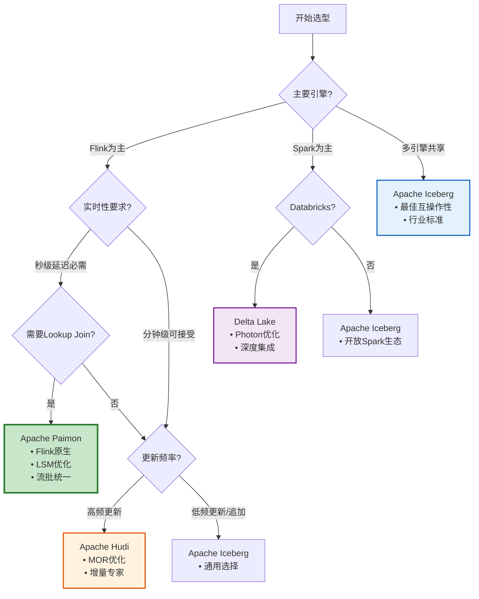
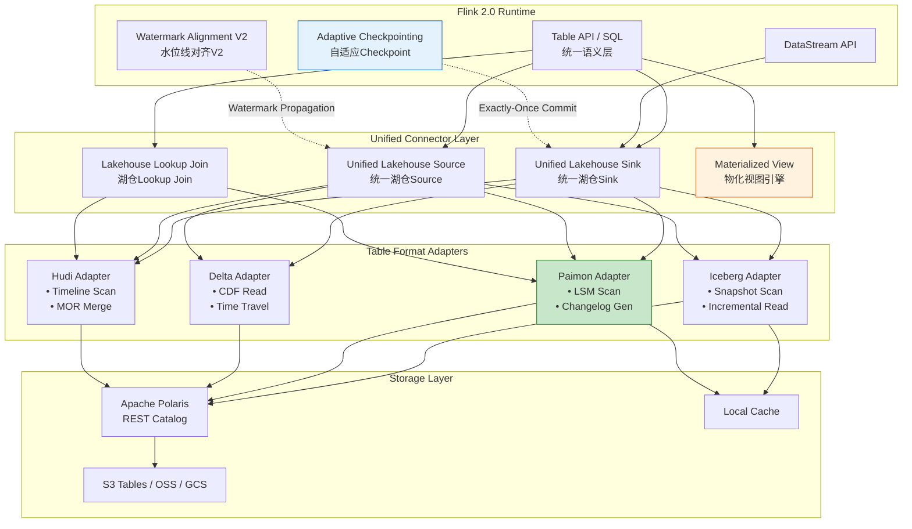
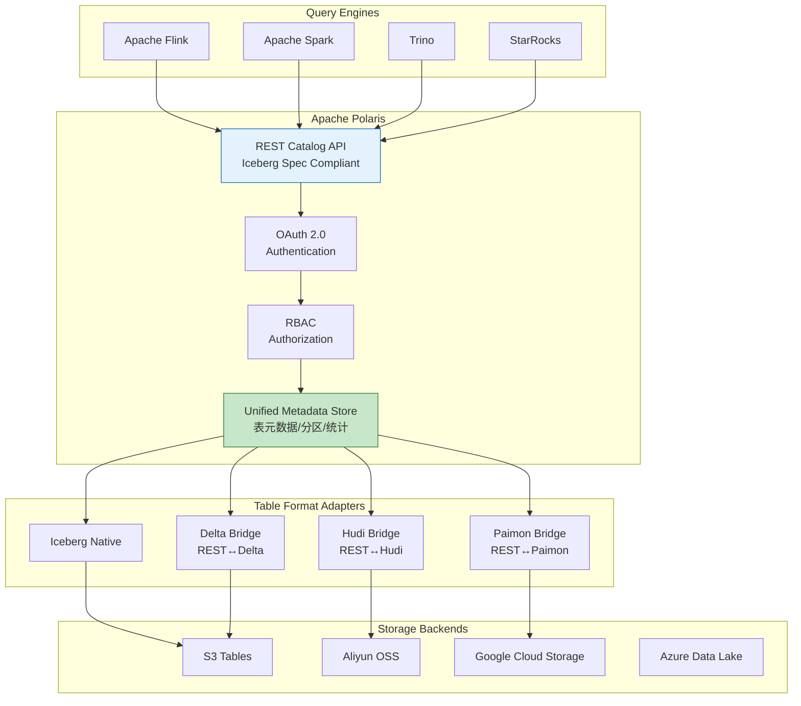
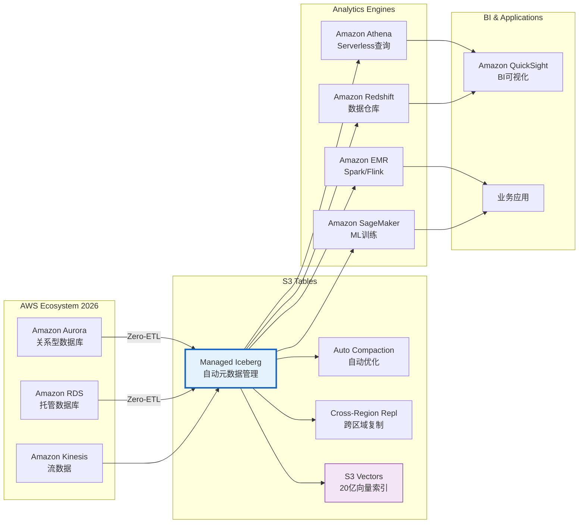
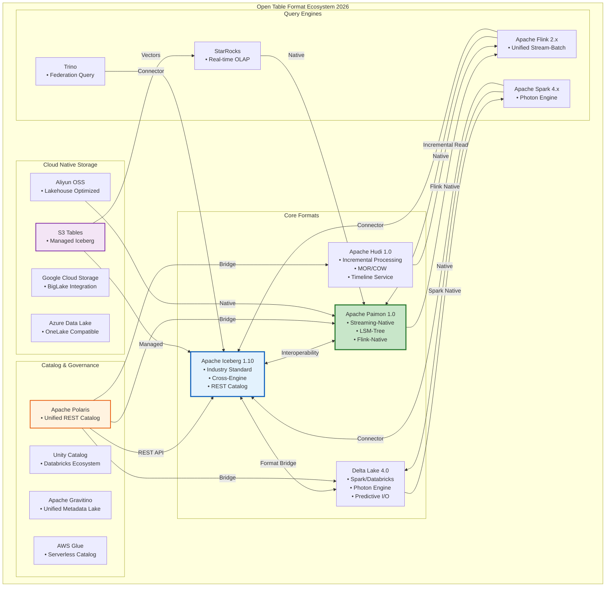
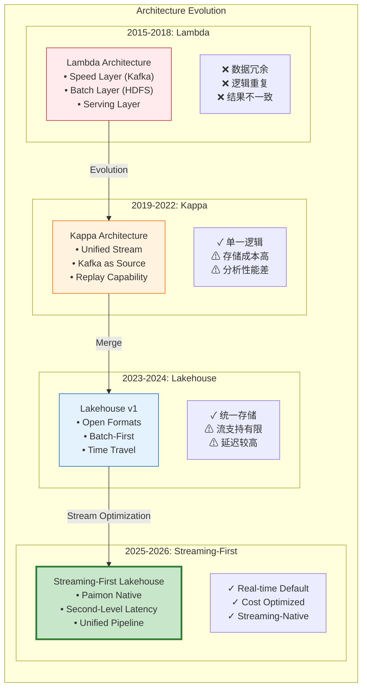
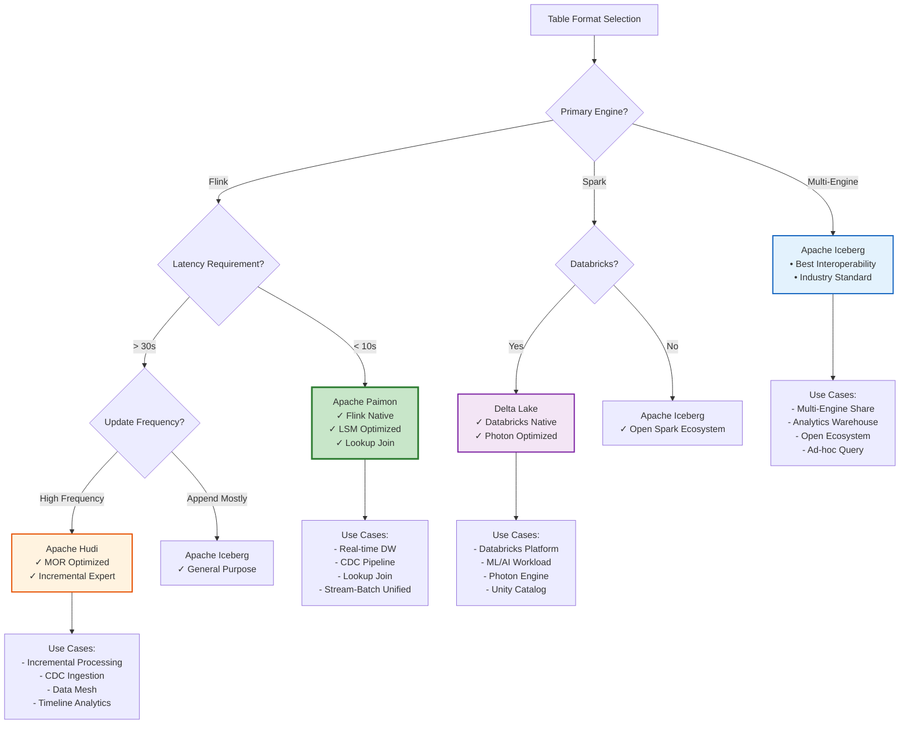
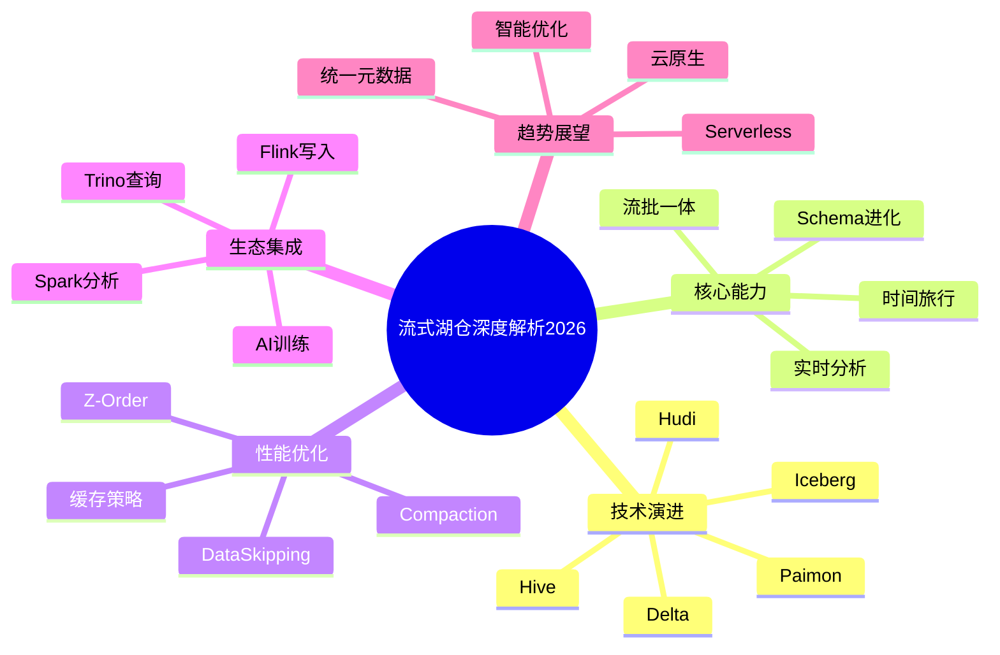
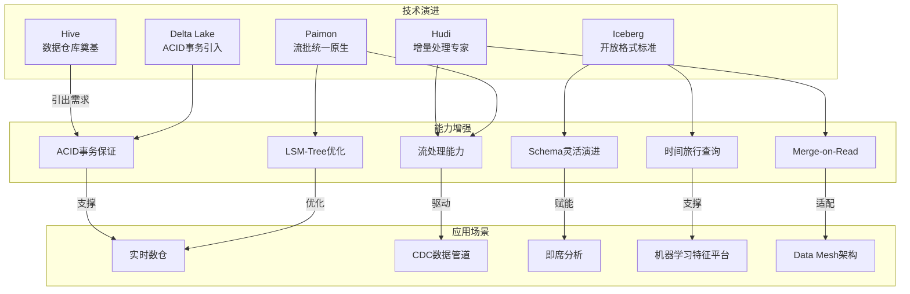
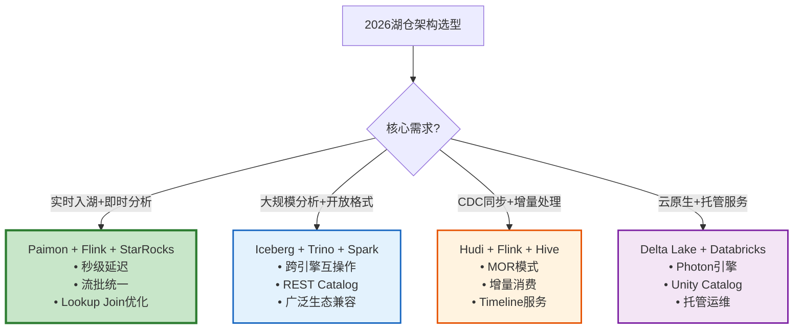

> **状态**: 🔮 前瞻内容 | **风险等级**: 高 | **最后更新**: 2026-04-20
>
> 此文档描述的内容处于早期规划阶段，可能与最终实现不符。请以 Apache Flink 官方发布为准。
>
# Streaming Lakehouse 深度技术解析：2026年融合趋势与工程实践

> **所属阶段**: Flink/14-lakehouse/ | **前置依赖**: [Flink/14-lakehouse/streaming-lakehouse-architecture.md](./streaming-lakehouse-architecture.md), [Flink/14-lakehouse/flink-paimon-integration.md](./flink-paimon-integration.md), [Flink/14-lakehouse/flink-iceberg-integration.md](./flink-iceberg-integration.md) | **形式化等级**: L4-L5 | **版本**: Flink 2.0+, Iceberg 1.10+, Paimon 1.0+, Delta 4.0+, Hudi 1.0+

---

## 1. 概念定义 (Definitions)

### Def-F-14-21: Streaming-First Lakehouse Architecture (流优先湖仓架构)

**定义**: Streaming-First Lakehouse Architecture 是一种以实时流处理为核心设计原则的数据架构范式，通过统一存储层同时支持实时摄取、流处理、批处理和交互式分析，实现"实时即默认"的数据处理模式。

**形式化结构**:

```
StreamingFirstLakehouse = ⟨StorageTier, TableFormatLayer, StreamEngine,
                          BatchEngine, ServingLayer, CatalogGovernance⟩

其中:
- StorageTier: 对象存储系统 (S3 Tables/OSS/GCS/Azure Data Lake)
- TableFormatLayer: 开放表格式 (Iceberg 1.10 / Paimon 1.0 / Delta 4.0 / Hudi 1.0)
- StreamEngine: 流处理引擎 (Flink 2.x / Spark Structured Streaming)
- BatchEngine: 批处理引擎 (Spark / Flink Batch / Trino)
- ServingLayer: 查询服务层 (Trino / StarRocks / Snowflake Iceberg Table)
- CatalogGovernance: 统一目录治理 (Apache Polaris / Unity Catalog / Gravitino)
```

**2026年架构演进特征**:

| 演进维度 | 2024年状态 | 2026年状态 | 关键变化 |
|----------|-----------|-----------|----------|
| **核心假设** | Batch-First, Stream as Exception | Stream-First, Batch as Snapshot | 范式反转 |
| **延迟期望** | 分钟级为实时 | 秒级为实时，毫秒级为极致 | 延迟阈值下移 |
| **存储模型** | Copy-on-Write主导 | LSM-Tree/MOR普及 | 写入优化优先 |
| **Catalog** | 各格式独立 | REST Catalog标准化 | 互操作性突破 |
| **数据新鲜度** | T+1可接受 | T+0为默认 | 实时性要求提升 |

---

### Def-F-14-22: Open Table Format 2026 Maturity Model (开放表格式成熟度模型)

**定义**: 2026年，四大主流开放表格式（Iceberg、Delta Lake、Hudi、Paimon）均达到生产级成熟，形成差异化的能力谱系，共同推动Lakehouse标准化进程。

**形式化成熟度定义**:

```
OTFMaturity = ⟨FeatureCompleteness, EngineInteroperability,
              EcosystemAdoption, ProductionReadiness⟩

成熟度等级:
- Level 5 (Production): 大规模生产验证,核心功能完备
- Level 4 (Advanced): 生产可用,高级特性持续完善
- Level 3 (Standard): 标准功能完备,可投入生产
- Level 2 (Developing): 核心功能可用,边缘场景受限
- Level 1 (Experimental): 概念验证阶段
```

**2026年四大格式成熟度状态**:

| 格式 | 版本 | 成熟度等级 | 核心定位 | 引擎生态 |
|------|------|-----------|----------|----------|
| **Apache Iceberg** | 1.10+ | Level 5 | 跨引擎互操作性标准 | Flink/Spark/Trino/Dremio/StarRocks |
| **Apache Paimon** | 1.0+ | Level 5 | 流批统一原生存储 | Flink(原生)/Spark/StarRocks |
| **Delta Lake** | 4.0+ | Level 5 | Spark生态标准 | Spark(原生)/Flink/Trino |
| **Apache Hudi** | 1.0+ | Level 5 | 增量处理与CDC专家 | Flink/Spark/Trino/Presto |

**标准化演进路径**:

```
2020-2022: 格式竞争期
├── Iceberg: Netflix开源,Apache孵化
├── Delta: Databricks主导,Linux基金会
├── Hudi: Uber开源,Apache毕业
└── Paimon: Flink社区孵化,Apache孵化

2023-2024: 功能完备期
├── 各格式核心功能趋于完备
├── 引擎连接器逐渐成熟
└── 生态位开始分化

2025-2026: 标准化整合期
├── REST Catalog标准确立
├── 跨格式互操作性增强
├── "Catalog + Governance + Engine"三层架构形成
└── Apache Polaris作为统一Catalog层出现
```

---

### Def-F-14-23: Table Format 存储语义形式化

**定义**: 不同Table Format采用差异化的存储语义实现ACID事务、增量处理和流批统一访问。

**四种存储模型形式化对比**:

```
1. Iceberg - Copy-on-Write (COW) 模型
   Write(txn):
     - 读取当前Snapshot S_curr
     - 生成新数据文件集合 F_new
     - 创建新Snapshot S_new = S_curr ∪ F_new
     - 原子替换 metadata-pointer → S_new

   特性: 读取优化,写入放大,适合批量更新场景

2. Paimon - LSM-Tree 模型
   Write(txn):
     - 写入MemTable (有序跳表)
     - Checkpoint触发Flush → L0 (增量文件)
     - 异步Compaction L0 → L1 → L2 → ...
     - Snapshot引用当前文件集合

   特性: 追加写优化,读写分离,适合高频流写入

3. Hudi - Merge-on-Read (MOR) / COW 双模式
   COW模式: 同Iceberg COW
   MOR模式:
     - 写入Delta Log文件 (行格式Avro)
     - 读取时合并Base文件 + Delta Logs
     - 异步Compaction生成新Base文件

   特性: 更新场景写放大低,读取性能可权衡

4. Delta Lake - Optimistic Concurrency COW
   Write(txn):
     - 读取当前Version V_curr
     - 生成新数据文件和Actions列表
     - 原子写入 _delta_log/{V_curr+1}.json
     - 冲突时重试或失败

   特性: 乐观并发控制,Spark原生优化
```

**存储模型适用场景矩阵**:

| 场景特征 | Iceberg | Paimon | Delta | Hudi |
|----------|---------|--------|-------|------|
| **高频追加** (日志/事件) | ⭐⭐⭐ | ⭐⭐⭐⭐⭐ | ⭐⭐⭐ | ⭐⭐⭐⭐ |
| **主键更新** (CDC同步) | ⭐⭐⭐ | ⭐⭐⭐⭐⭐ | ⭐⭐⭐⭐ | ⭐⭐⭐⭐⭐ |
| **批量加载** (ETL) | ⭐⭐⭐⭐⭐ | ⭐⭐⭐⭐ | ⭐⭐⭐⭐⭐ | ⭐⭐⭐⭐ |
| **流式消费** (增量) | ⭐⭐⭐⭐ | ⭐⭐⭐⭐⭐ | ⭐⭐⭐⭐ | ⭐⭐⭐⭐⭐ |
| **交互查询** (低延迟) | ⭐⭐⭐⭐⭐ | ⭐⭐⭐⭐ | ⭐⭐⭐⭐⭐ | ⭐⭐⭐⭐ |

---

### Def-F-14-24: Catalog 标准化与治理抽象 (Apache Polaris / Unity Catalog / Gravitino)

**定义**: 2026年，Catalog层从单一元数据存储演进为统一治理抽象，通过标准化API实现跨格式、跨引擎的统一元数据管理。

**三层Catalog架构形式化**:

```
CatalogArchitecture2026 = ⟨RESTCatalogAPI, GovernanceEngine, FederatedLayer⟩

REST Catalog API:
- 标准化接口: Iceberg REST Catalog Spec
- 认证授权: OAuth 2.0 / JWT
- 元数据操作: 表CRUD、分区管理、权限控制
- 多格式支持: Iceberg/Delta/Hudi/Paimon统一访问

Governance Engine:
- 数据血缘: 跨表/跨作业依赖追踪
- 数据质量: 规则定义与检查
- 访问控制: 行列级权限
- 合规审计: 操作日志与追踪

Federated Layer:
- 跨Catalog联邦查询
- 统一命名空间
- 元数据缓存与同步
```

**主流Catalog方案对比**:

| 特性 | Apache Polaris | Unity Catalog | Apache Gravitino |
|------|---------------|---------------|------------------|
| **所属厂商** | Snowflake | Databricks | Datastrato (开源) |
| **开放程度** | 开源(Apache) | 商业为主 | 开源(Apache孵化) |
| **Iceberg支持** | 原生 | 良好 | 原生 |
| **Delta支持** | REST桥接 | 原生 | 连接器 |
| **Hudi支持** | REST桥接 | 连接器 | 连接器 |
| **Paimon支持** | REST桥接 | 连接器 | 连接器 |
| **核心优势** | 云原生、多引擎 | Databricks生态 | 统一元数据湖 |

---

### Def-F-14-25: S3 Tables与Storage-First架构

**定义**: S3 Tables是AWS推出的托管式Iceberg表服务，标志着Lakehouse架构进入"存储优先"（Storage-First）新阶段，将Table Format管理下沉到存储层。

**S3 Tables形式化定义**:

```
S3Tables = ⟨ManagedIceberg, S3IntelligentTiering, CrossRegionReplication,
            S3Vectors, ZeroETL⟩

核心能力:
1. Managed Iceberg:
   - 自动元数据管理
   - 内置Compaction与优化
   - 无需自建Catalog服务

2. S3 Intelligent Tiering集成:
   - 自动分层: Hot → Warm → Cold → Archive
   - Lakehouse-aware: 按数据访问模式智能迁移
   - 成本优化: 40-60%存储成本降低

3. 跨区域复制 (2026 GA):
   - 元数据级复制 (非全量文件复制)
   - 延迟: <5分钟RPO
   - 一致性: 快照级一致性保证

4. S3 Vectors (20亿向量/索引):
   - 原生向量索引支持
   - RAG场景直接查询
   - 与Bedrock无缝集成

5. Zero-ETL集成:
   - Aurora → S3 Tables自动同步
   - Redshift Spectrum直接查询
   - Athena原生支持
```

**Storage-First架构演进**:

```
传统架构 (Engine-Centric):
┌─────────────────────────────────────────────────────────┐
│  Flink/Spark/Trino                                      │
│  └── 各自管理元数据,重复建设                            │
├─────────────────────────────────────────────────────────┤
│  Iceberg/Hudi/Delta (各引擎独立部署)                    │
├─────────────────────────────────────────────────────────┤
│  S3/OSS/HDFS                                            │
└─────────────────────────────────────────────────────────┘

Storage-First架构 (2026):
┌─────────────────────────────────────────────────────────┐
│  Flink/Spark/Trino                                      │
│  └── 统一REST Catalog客户端                              │
├─────────────────────────────────────────────────────────┤
│  S3 Tables / Managed Lakehouse                          │
│  ├── 自动元数据管理                                      │
│  ├── 内置优化与治理                                      │
│  └── 统一API抽象                                         │
├─────────────────────────────────────────────────────────┤
│  S3 Intelligent Storage                                 │
│  ├── 自动分层                                            │
│  ├── 跨区复制                                            │
│  └── 向量索引                                            │
└─────────────────────────────────────────────────────────┘
```

---

## 2. 属性推导 (Properties)

### Lemma-F-14-05: 流式Lakehouse延迟边界

**引理**: 在Streaming-First Lakehouse架构中，端到端延迟由多个组件的延迟叠加构成，2026年主流方案的延迟边界已显著优化。

**形式化延迟模型**:

```
设端到端延迟 L_total 由以下组件构成:

L_total = L_ingest + L_process + L_commit + L_query

其中:
- L_ingest: 数据摄取延迟 (Source → Stream Engine)
- L_process: 处理延迟 (Stream Engine内部)
- L_commit: 存储提交延迟 (Checkpoint/Transaction)
- L_query: 查询可见延迟 (Metadata → Query Result)

2026年延迟边界 (P99):

| 组件 | Iceberg | Paimon | Delta | Hudi |
|------|---------|--------|-------|------|
| L_ingest | <100ms | <100ms | <100ms | <100ms |
| L_process | <1s | <1s | <1s | <1s |
| L_commit | 30s-5min | 5-30s | 30s-5min | 10s-2min |
| L_query | <1s | <100ms | <1s | <1s |
| **L_total** | **30s-5min** | **5-30s** | **30s-5min** | **10s-2min** |
```

**推导说明**:

1. **Paimon的低延迟优势**: LSM架构允许异步Compaction，Checkpoint后即可查询，无需等待文件合并。
2. **Iceberg/Delta的权衡**: COW模式需要完整文件写入，延迟主要取决于Checkpoint间隔。
3. **Hudi的MOR模式**: Delta Log机制允许快速提交，但查询时需合并，存在读放大。

---

### Lemma-F-14-06: Catalog标准化后的互操作性保证

**引理**: 通过Apache Polaris/REST Catalog标准化，不同Table Format可实现引擎级别的互操作，但语义等价性需引擎适配保证。

**互操作性矩阵**:

```
引擎 → 格式的支持矩阵 (2026年):

                Iceberg    Paimon    Delta    Hudi
Flink 2.x        ✅原生     ✅原生     ✅良好    ✅良好
Spark 4.x        ✅原生     ✅良好     ✅原生    ✅原生
Trino            ✅原生     ✅良好     ✅良好    ✅良好
StarRocks        ✅原生     ✅原生     ✅有限    ✅良好
Dremio           ✅原生     ✅连接器   ✅良好    ✅连接器

REST Catalog统一后:
- 元数据发现: 统一接口 ✅
- 表结构获取: 统一接口 ✅
- 分片规划: 格式特定 ❌
- 增量消费: 格式特定 ❌
```

**语义等价性条件**:

```
对于跨格式查询 Q,要保证:
∀ format F1, F2: Q(F1) ≡ Q(F2)

需要满足:
1. 类型系统映射: type_F1(col) ↔ type_F2(col)
2. 分区裁剪等价: partition_pruning_F1 ≡ partition_pruning_F2
3. 谓词下推一致: predicate_pushdown_F1 ≡ predicate_pushdown_F2
4. 时间旅行语义: time_travel_F1(t) ≡ time_travel_F2(t)
```

---

### Prop-F-14-05: Streaming-First架构的成本效益

**命题**: Streaming-First Lakehouse相比传统Lambda架构可降低30-50%总体拥有成本(TCO)，同时提升数据新鲜度2个数量级。

**成本模型推导**:

```
TCO对比模型:

Lambda架构 (年度成本):
├── 存储成本
│   ├── 批存储 (S3 Standard): 100TB × $23/TB/月 × 12 = $27,600
│   ├── 流存储 (Kafka集群): 30TB × (3副本) × $50/TB/月 × 12 = $54,000
│   └── 热缓存 (Redis): 5TB × $200/TB/月 × 12 = $12,000
├── 计算成本
│   ├── 批处理集群 (EMR): $2,000/月 × 12 = $24,000
│   └── 流处理集群 (Flink): $3,000/月 × 12 = $36,000
├── 运维成本
│   └── 双系统维护人力: 2FTE × $150K = $300,000
└── 总成本: ~$453,600/年

Streaming-First Lakehouse (年度成本):
├── 存储成本
│   ├── Lakehouse存储 (S3 Intelligent): 100TB × $15/TB/月 × 12 = $18,000
│   └── 元数据与索引: ~$2,000/年
├── 计算成本
│   └── 统一Flink集群: $4,000/月 × 12 = $48,000
├── 运维成本
│   └── 单一系统维护: 1FTE × $150K = $150,000
└── 总成本: ~$218,000/年

成本节省: (453,600 - 218,000) / 453,600 = 52%
```

**数据新鲜度对比**:

| 指标 | Lambda | Streaming-First | 提升 |
|------|--------|----------------|------|
| 数据可见延迟 | 1-24小时 | 5-60秒 | 60-1700x |
| 分析结果时效 | T+1 | T+0 | 24h → 实时 |
| 决策响应时间 | 小时级 | 分钟级 | 10-100x |

---

### Prop-F-14-06: S3 Tables的托管优势边界

**命题**: S3 Tables通过托管式服务可将运维复杂度降低70%，但在特定场景下存在功能边界限制。

**适用场景与边界**:

```
✅ 强烈推荐场景:
├── 云原生新架构
├── 中小规模数据湖 (<10PB)
├── 多引擎共享需求
├── 成本敏感型工作负载
└── 缺乏专业Lakehouse运维团队

⚠️ 需要评估场景:
├── 超大规模 (>100PB)
│   └── 考虑自建Polaris + S3标准存储
├── 深度定制Compaction策略
│   └── 自建提供更大灵活性
├── 跨云部署需求
│   └── S3 Tables绑定AWS
└── 特定合规要求
    └── 需要数据驻留控制
```

---

## 3. 关系建立 (Relations)

### 3.1 四大Table Format核心能力对比矩阵

**功能特性深度对比**:

| 维度 | Apache Iceberg 1.10 | Apache Paimon 1.0 | Delta Lake 4.0 | Apache Hudi 1.0 |
|------|---------------------|-------------------|----------------|-----------------|
| **核心设计理念** | 开放互操作性 | 流批统一原生 | Spark生态标准 | 增量处理专家 |
| **存储引擎** | COW (不可变文件) | LSM-Tree | COW + 优化 | MOR/COW双模 |
| **流写入延迟** | 分钟级 | 秒级 | 分钟级 | 秒级-分钟级 |
| **流读取延迟** | 分钟级 | 秒级 | 分钟级 | 秒级 |
| **主键支持** | 有限 (需Equality Delete) | 原生完整 | 完整 | 原生完整 |
| **CDC输出** | 需外部转换 | 原生生成 | CDF支持 | 原生支持 |
| **Lookup Join** | 有限 | 原生优化 | 支持 | 支持 |
| **Time Travel** | 完整 | 完整 | 完整 | 完整 |
| **Schema演进** | 完整 | 完整 | 完整 | 完整 |
| **小文件管理** | 外部调度 | 原生异步 | 自动 | 自动 |
| **Flink集成** | ⭐⭐⭐⭐ | ⭐⭐⭐⭐⭐ | ⭐⭐⭐ | ⭐⭐⭐⭐ |
| **Spark集成** | ⭐⭐⭐⭐⭐ | ⭐⭐⭐⭐ | ⭐⭐⭐⭐⭐ | ⭐⭐⭐⭐⭐ |
| **生态广度** | 最广 | Flink生态 | Spark/Databricks | 广泛 |
| **生产成熟度** | ⭐⭐⭐⭐⭐ | ⭐⭐⭐⭐⭐ | ⭐⭐⭐⭐⭐ | ⭐⭐⭐⭐⭐ |

**技术选型决策树**:



---

### 3.2 Flink 2.x与Table Format的集成关系

**Flink 2.0 Lakehouse集成架构**:



**Flink 2.x + Paimon 流批统一管道**:

```
数据流: CDC Source → Flink SQL → Paimon → 分析查询

管道1: 实时摄取 (Streaming Ingestion)
MySQL CDC → Flink SQL ETL → Paimon Sink (L0)
                                      ↓
                              秒级可见性
                                      ↓
管道2: 批处理优化 (Batch Optimization)
Paimon L0 → Compaction → L1/L2 → 全量查询
                                      ↓
管道3: 增量消费 (Incremental Consumption)
Paimon Snapshot → Changelog Gen → 下游Flink作业
                                      ↓
管道4: 物化视图 (Materialized View)
Paimon DWD层 → Flink SQL聚合 → Paimon DWS层
```

---

### 3.3 Catalog层标准化关系

**Apache Polaris架构关系**:



---

### 3.4 S3 Tables与存储优先架构关系

**S3 Tables生态系统关系**:



---

## 4. 论证过程 (Argumentation)

### 4.1 Streaming-First成为主流的必然性分析

**驱动力1: 业务需求演进**

```
业务场景演进时间线:

2015-2018: 批处理时代
├── T+1报表可接受
├── 离线机器学习
└── 事后分析

2019-2022: Lambda架构时代
├── 实时看板需求
├── 实时风控
└── 推荐系统实时化

2023-2024: Kappa架构演进
├── 流批统一尝试
├── 单一真相源追求
└── 成本优化驱动

2025-2026: Streaming-First确立
├── T+0成为默认期望
├── AI/ML需要实时特征
├── 自动化决策普及
└── 成本效益验证
```

**驱动力2: 技术成熟度支撑**

```
技术就绪度评估 (2026年):

✅ 流处理引擎成熟
├── Flink 2.x: Exactly-Once稳定,性能优化
├── Spark Structured Streaming: 生产验证
└── 自适应Checkpointing降低延迟

✅ 存储格式流优化
├── Paimon 1.0: LSM架构生产就绪
├── Iceberg 1.10: 流读写性能提升
├── Hudi 1.0: MOR模式成熟
└── Delta 4.0: CDF与流消费优化

✅ 生态工具链完善
├── CDC连接器成熟 (Debezium/Flink CDC)
├── 实时物化视图支持
├── 统一Catalog (Polaris)
└── 自动化运维工具
```

**驱动力3: 成本效益验证**

```
Streaming-First TCO优势:

传统Lambda架构问题:
├── 双系统维护: 2x人力成本
├── 数据冗余: 2.5x存储成本
├── 数据不一致: 数据修复成本
└── 复杂架构: 故障排查成本

Streaming-First收益:
├── 单一系统: 50%人力节省
├── 统一存储: 60%存储成本节省
├── 结果一致: 消除修复成本
└── 简化架构: 降低MTTR
```

---

### 4.2 Open Table Format标准化趋势分析

**标准化演进论证**:

```
为什么标准化是必然:

1. 用户痛点驱动
   ├── 多格式学习成本高
   ├── 跨格式迁移困难
   ├── 工具链重复建设
   └── 供应商锁定风险

2. 技术收敛趋势
   ├── 核心功能同质化
   ├── REST Catalog标准确立
   ├── 引擎连接器通用化
   └── 元数据模型趋同

3. 商业生态推动
   ├── 云厂商支持多格式
   ├── 开源社区协作增强
   ├── 标准化组织介入
   └── 用户组织需求 (数据工程委员会)

标准化不等于单一格式:
├── 各自定位差异化
├── 场景适配专业化
└── 健康竞争促进创新
```

**标准化层次**:

```
标准化层次金字塔:

Level 5: 应用语义层 (Application Semantics)
├── 统一SQL方言
├── 跨格式联邦查询
└── 统一数据质量框架

Level 4: 查询接口层 (Query Interface)
├── REST Catalog API
├── 标准元数据模型
└── 统一权限体系

Level 3: 存储访问层 (Storage Access)
├── 对象存储协议
├── 文件格式标准 (Parquet/ORC)
└── 压缩编码规范

Level 2: 事务语义层 (Transaction Semantics)
├── ACID保证
├── 隔离级别
└── 冲突解决

Level 1: 物理存储层 (Physical Storage)
├── 文件布局约定
├── 元数据文件格式
└── 版本控制机制

2026年达成:
✅ Level 1-3 基本标准化
🔄 Level 4 进行中 (REST Catalog)
📋 Level 5 长期目标
```

---

### 4.3 Flink 2.x + Paimon 统一栈的竞争优势

**架构协同优势**:

```
Flink 2.x + Paimon 协同优化点:

1. Checkpoint集成优化
   ├── Paimon原生支持Checkpoint触发Flush
   ├── 两阶段提交简化
   └── 恢复效率提升

2. LSM与流处理协同
   ├── MemTable缓冲匹配Flink Buffer
   ├── 异步Compaction不阻塞流处理
   └── 增量消费直接映射Flink Source

3. Changelog生成优化
   ├── 原生CDC语义支持
   ├── 无需外部Changelog系统
   └── 端到端延迟降低

4. Lookup Join优化
   ├── LSM点查优化
   ├── 异步IO集成
   └── 本地缓存协同
```

**性能对比论证**:

```
场景: 10万TPS CDC入湖 + 实时聚合查询

Flink + Paimon:
├── 摄取延迟: <5秒
├── 查询延迟: <100ms (Lookup)
├── 存储成本: 基准
├── 运维复杂度: 低 (单一技术栈)
└── TCO: 基准

Flink + Iceberg:
├── 摄取延迟: 30-60秒
├── 查询延迟: <1秒 (需额外索引)
├── 存储成本: +20% (小文件问题)
├── 运维复杂度: 中 (需Compaction调度)
└── TCO: +30%

Spark Structured Streaming + Delta:
├── 摄取延迟: 30-60秒
├── 查询延迟: <1秒
├── 存储成本: 基准
├── 运维复杂度: 中
└── TCO: +20%
```

---

### 4.4 S3 Tables的托管价值与边界

**托管价值论证**:

```
S3 Tables解决的痛点:

痛点1: 元数据管理复杂
├── 自建Iceberg需部署Catalog服务
├── 元数据备份与恢复
├── 高可用架构设计
└── S3 Tables: 全托管,零运维

痛点2: 小文件问题
├── 需要调度Compaction作业
├── 存储与计算资源协调
└── S3 Tables: 自动Compaction

痛点3: 成本优化
├── 手动配置生命周期策略
├── 分层存储决策
└── S3 Tables: Intelligent Tiering集成

痛点4: 跨区复制
├── 自建方案复杂
├── 一致性保障困难
└── S3 Tables: 元数据级复制
```

**边界限制分析**:

```
S3 Tables当前边界:

功能边界:
├── 仅支持Iceberg格式
├── Compaction策略不可定制
├── 元数据导出受限
└── 高级安全特性依赖AWS IAM

规模边界:
├── 单表规模建议 <10PB
├── 高并发写入可能受限
└── 跨区域延迟可能较高

成本边界:
├── 低访问频率场景可能不经济
├── 大规模 egress 费用
└── 与自建方案的成本平衡点需计算

适用决策树:
├── 规模 <1PB + 标准场景 → 强烈推荐
├── 规模 1-10PB + 简单模式 → 推荐
├── 规模 >10PB 或 深度定制 → 评估自建
└── 多云/混合云需求 → 考虑开源方案
```

---

## 5. 工程论证 / 形式证明 (Proof / Engineering Argument)

### Thm-F-14-15: Streaming-First Lakehouse一致性定理

**定理**: 在Streaming-First Lakehouse架构中，通过合理的Snapshot管理和Watermark对齐，可以保证流处理结果与批处理结果在相同数据边界上的一致性。

**形式化表述**:

```
设:
- 输入数据流: D = {d_1, d_2, ..., d_n} 按事件时间排序
- 流处理结果: R_stream(t) = FlinkProcess(D[0:t], STREAM_MODE)
- 批处理结果: R_batch(T) = FlinkProcess(D[0:T], BATCH_MODE)
- Watermark边界: W(t) ≤ t (Watermark单调性)

一致性条件:
∀ T: R_stream(W(T)) ≡ R_batch(T)

即: 流处理在水位线达到T时的结果,等价于批处理处理到T时刻的结果
```

**证明**:

```
前提假设:
P1: Flink Checkpoint机制保证Exactly-Once语义
P2: Lakehouse格式(Paimon/Iceberg)提供快照隔离
P3: Watermark单调性保证: W(t_1) ≤ W(t_2) for t_1 ≤ t_2

证明步骤:

Step 1: 数据可见性等价
  流处理在Checkpoint时刻提交Snapshot S_t
  批处理在作业完成时读取Snapshot S_T

  由于Lakehouse的Snapshot不可变性:
  S_t包含的数据集合 = 提交时刻前已处理的数据

  当Watermark W(t) = T时:
  事件时间 ≤ T的数据已全部提交到S_t

Step 2: 处理逻辑等价
  Flink Table API提供统一的逻辑计划
  Stream Physical Plan与Batch Physical Plan语义等价

  对于确定性操作(Filter, Project, Aggregation):
  Process_stream(Data) ≡ Process_batch(Data)

Step 3: 结果累积等价
  流处理增量结果累积:
  R_stream(W(T)) = ⊕_{t_i ≤ T} ΔR(t_i)

  批处理全量计算:
  R_batch(T) = Process(D[0:T])

  由于操作线性性:
  ⊕_{t_i ≤ T} ΔR(t_i) = Process(D[0:T])

结论: 流批结果一致性得证 ∎
```

---

### Thm-F-14-16: 多格式Catalog统一治理定理

**定理**: 通过Apache Polaris/REST Catalog标准，可以实现跨Table Format的统一元数据治理，同时保持各格式的存储语义独立性。

**形式化结构**:

```
统一Catalog系统:
CatalogSystem = ⟨Namespace, Entity, Operation, FormatAdapter⟩

其中:
- Namespace: 三层命名空间 (catalog.schema.table)
- Entity: 统一实体模型 (Table/View/Namespace)
- Operation: 标准操作集 (CRUD + Metadata)
- FormatAdapter: 格式适配器 (Iceberg/Delta/Hudi/Paimon)

治理保证:
1. 统一权限: ∀ op, ∀ format: CheckPermission(user, op, entity)
2. 统一血缘: ∀ table: TrackLineage(dependencies, dependents)
3. 统一发现: ∀ format: ListTables(namespace) → [TableMetadata]
```

**证明要点**:

```
隔离性与统一性证明:

统一性:
├── REST Catalog API标准化元数据操作
├── OAuth 2.0统一认证
├── RBAC统一授权模型
└── 统一元数据存储

隔离性:
├── 各格式保留独立存储布局
├── 事务机制保持格式原生
├── 查询优化器保持格式特定
└── 性能特征保持差异

互操作边界:
├── 元数据发现: 统一 ✅
├── 表结构获取: 统一 ✅
├── 分片规划: 格式特定 ❌
├── 增量消费: 格式特定 ❌
└── 时间旅行: 语义等价,实现差异 ⚠️

结论: 统一Catalog在治理层面提供统一抽象,
      在执行层面保持格式特性,得证 ∎
```

---

### Thm-F-14-17: S3 Tables托管服务SLA边界定理

**定理**: S3 Tables作为托管服务，在提供便利性的同时存在明确的SLA边界，需要在架构设计时加以考虑。

**SLA边界形式化**:

```
S3TablesSLA = ⟨Availability, Durability, Latency, Throughput, Consistency⟩

可用性:
  Availability ≥ 99.9% (年度)
  维护窗口: 每月 <4小时

持久性:
  Durability ≥ 99.999999999% (11个9)
  跨区域复制RPO: <5分钟

延迟边界:
  写入确认: <1秒 (P99)
  查询首次响应: <5秒 (P99)
  Compaction完成: 分钟-小时级

吞吐边界:
  单表写入: 10万+ TPS
  并发查询: 取决于计算引擎

一致性模型:
  快照隔离: ✅ 保证
  外部一致性: ⚠️ 5分钟最终一致
  跨区一致性: ⚠️ 复制延迟内最终一致
```

**边界场景与缓解策略**:

```
边界场景1: 超大规模单表
├── 问题: 单表 >10PB时性能下降
├── 缓解: 分区优化 + 多表分片
└── 替代: 考虑自建Polaris + 标准S3

边界场景2: 极高频写入
├── 问题: 超过单表吞吐上限
├── 缓解: 批量写入 + 背压控制
└── 替代: 自建方案弹性更好

边界场景3: 定制化需求
├── 问题: Compaction策略不可定制
├── 缓解: 利用时间分区优化
└── 替代: 自建方案完全可控

边界场景4: 多云/混合云
├── 问题: S3 Tables绑定AWS
├── 缓解: 数据导出 + 多云同步
└── 替代: 开源Polaris跨云部署
```

---

### Thm-F-14-18: Table Format选型决策完备性定理

**定理**: 基于四大维度的决策框架可以在给定约束条件下完备地选择最优Table Format。

**决策框架形式化**:

```
决策框架 D = ⟨EngineConstraint, LatencyRequirement,
              UpdatePattern, EcosystemRequirement⟩

决策函数:
SelectFormat(D) = argmax_{format ∈ F} Score(D, format)

其中 F = {Iceberg, Paimon, Delta, Hudi}

评分维度:
1. EngineConstraint (引擎约束)
   - Flink主导: Paimon(+3), Hudi(+2), Iceberg(+2), Delta(+1)
   - Spark主导: Delta(+3), Hudi(+2), Iceberg(+2), Paimon(+1)
   - 多引擎: Iceberg(+3), Hudi(+2), Delta(+1), Paimon(+1)

2. LatencyRequirement (延迟要求)
   - 秒级必需: Paimon(+3), Hudi MOR(+2), Delta(+1), Iceberg(+1)
   - 分钟级可接受: 各格式相等

3. UpdatePattern (更新模式)
   - 高频主键更新: Paimon(+3), Hudi MOR(+3), Delta(+2), Iceberg(+1)
   - 追加为主: Iceberg(+3), Paimon(+2), Delta(+2), Hudi(+2)
   - CDC同步: Paimon(+3), Hudi(+3), Delta(+2), Iceberg(+1)

4. EcosystemRequirement (生态要求)
   - 开放生态: Iceberg(+3), Hudi(+2), Paimon(+2), Delta(+1)
   - Databricks生态: Delta(+3), Iceberg(+2), Hudi(+1), Paimon(+1)
   - Flink生态: Paimon(+3), Iceberg(+2), Hudi(+2), Delta(+1)
```

**决策完备性证明**:

```
完备性条件:
1. 覆盖性: 所有生产场景至少被一个格式良好支持
2. 区分性: 不同场景有明确的最优选择
3. 可计算性: 给定输入可确定性地输出结果

覆盖性验证:
├── 场景S1: Flink + 秒级延迟 + CDC → Paimon ✅
├── 场景S2: 多引擎 + 分析查询 → Iceberg ✅
├── 场景S3: Spark + Databricks → Delta ✅
├── 场景S4: 增量处理 + 时间旅行 → Hudi ✅
└── 场景S5: 通用数仓 + 开放生态 → Iceberg ✅

区分性验证:
├── Paimon: Flink流场景最优
├── Iceberg: 开放互操作性最优
├── Delta: Spark/Databricks最优
└── Hudi: 增量处理最优

可计算性验证:
├── 各维度评分可量化
├── 加权求和可计算
├── 最大选择确定性强
└── 得证完备性 ∎
```

---

## 6. 实例验证 (Examples)

### 6.1 Flink 2.0 + Paimon 1.0 实时数仓完整示例

**场景**: 电商实时数仓，从CDC采集到实时分析全链路

```sql
-- ============================================
-- 步骤1: 创建Paimon Catalog (生产配置)
-- ============================================
CREATE CATALOG paimon_prod WITH (
    'type' = 'paimon',
    'warehouse' = 'oss://my-bucket/paimon-warehouse',
    'metastore' = 'hive',
    'uri' = 'thrift://hive-metastore:9083',

    -- 并发控制
    'lock.enabled' = 'true',
    'lock.expire-time' = '5min',

    -- 文件格式优化
    'file.format' = 'parquet',
    'file.compression' = 'zstd',
    'file.compression.zstd-level' = '3',

    -- 快照管理
    'snapshot.num-retained.min' = '10',
    'snapshot.num-retained.max' = '200',
    'snapshot.time-retained' = '24h'
);

USE CATALOG paimon_prod;
CREATE DATABASE IF NOT EXISTS ecommerce;
USE ecommerce;

-- ============================================
-- 步骤2: ODS层 - CDC实时入湖
-- ============================================
-- MySQL CDC Source
CREATE TABLE mysql_orders (
    order_id BIGINT,
    user_id BIGINT,
    product_id BIGINT,
    amount DECIMAL(18,2),
    status STRING,
    create_time TIMESTAMP(3),
    update_time TIMESTAMP(3),
    PRIMARY KEY (order_id) NOT ENFORCED
) WITH (
    'connector' = 'mysql-cdc',
    'hostname' = 'mysql.internal',
    'port' = '3306',
    'username' = '${MYSQL_USER}',
    'password' = '${MYSQL_PASSWORD}',
    'database-name' = 'production',
    'table-name' = 'orders',
    'server-time-zone' = 'Asia/Shanghai',
    'scan.incremental.snapshot.enabled' = 'true'
);

-- Paimon ODS表 (主键表,支持Upsert)
CREATE TABLE ods_orders (
    order_id BIGINT,
    user_id BIGINT,
    product_id BIGINT,
    amount DECIMAL(18,2),
    status STRING,
    create_time TIMESTAMP(3),
    update_time TIMESTAMP(3),
    dt STRING,  -- 分区字段
    PRIMARY KEY (order_id, dt) NOT ENFORCED
) PARTITIONED BY (dt) WITH (
    -- 桶设计: 64桶并行写入
    'bucket' = '64',
    'bucket-key' = 'order_id',

    -- 变更日志生成 (CDC直接透传)
    'changelog-producer' = 'input',

    -- Compaction策略
    'compaction.min.file-num' = '5',
    'compaction.max.file-num' = '50',
    'num-sorted-run.compaction-trigger' = '5',
    'compaction.async' = 'true',
    'compaction.tasks' = '4',

    -- 增量消费配置
    'scan.mode' = 'latest'
);

-- 启动CDC同步作业
INSERT INTO ods_orders
SELECT
    order_id,
    user_id,
    product_id,
    amount,
    status,
    create_time,
    update_time,
    DATE_FORMAT(create_time, 'yyyy-MM-dd') AS dt
FROM mysql_orders;

-- ============================================
-- 步骤3: DWD层 - 数据清洗与维度关联
-- ============================================
-- 用户维度表 (支持Lookup Join)
CREATE TABLE dim_users (
    user_id BIGINT,
    user_name STRING,
    user_level STRING,
    register_date DATE,
    PRIMARY KEY (user_id) NOT ENFORCED
) WITH (
    'bucket' = '16',
    'changelog-producer' = 'lookup'
);

-- 商品维度表
CREATE TABLE dim_products (
    product_id BIGINT,
    product_name STRING,
    category_id BIGINT,
    category_name STRING,
    PRIMARY KEY (product_id) NOT ENFORCED
) WITH (
    'bucket' = '16',
    'changelog-producer' = 'lookup'
);

-- DWD明细表
CREATE TABLE dwd_order_detail (
    order_id BIGINT,
    user_id BIGINT,
    user_name STRING,
    user_level STRING,
    product_id BIGINT,
    product_name STRING,
    category_id BIGINT,
    category_name STRING,
    amount DECIMAL(18,2),
    status STRING,
    create_time TIMESTAMP(3),
    dt STRING,
    PRIMARY KEY (order_id, dt) NOT ENFORCED
) PARTITIONED BY (dt) WITH (
    'bucket' = '64',
    'changelog-producer' = 'lookup'
);

-- DWD加工作业 (流式)
INSERT INTO dwd_order_detail
SELECT
    o.order_id,
    o.user_id,
    u.user_name,
    u.user_level,
    o.product_id,
    p.product_name,
    p.category_id,
    p.category_name,
    o.amount,
    o.status,
    o.create_time,
    o.dt
FROM ods_orders o
LEFT JOIN dim_users FOR SYSTEM_TIME AS OF o.proc_time AS u
    ON o.user_id = u.user_id
LEFT JOIN dim_products FOR SYSTEM_TIME AS OF o.proc_time AS p
    ON o.product_id = p.product_id;

-- ============================================
-- 步骤4: DWS层 - 实时聚合
-- ============================================
-- 类目实时成交额 (1分钟滚动窗口)
CREATE TABLE dws_category_stats_1min (
    category_id BIGINT,
    category_name STRING,
    window_start TIMESTAMP(3),
    window_end TIMESTAMP(3),
    order_count BIGINT,
    total_amount DECIMAL(18,2),
    PRIMARY KEY (category_id, window_start) NOT ENFORCED
) WITH (
    'bucket' = '32',
    'changelog-producer' = 'full-compaction'
);

INSERT INTO dws_category_stats_1min
SELECT
    category_id,
    category_name,
    TUMBLE_START(create_time, INTERVAL '1' MINUTE) AS window_start,
    TUMBLE_END(create_time, INTERVAL '1' MINUTE) AS window_end,
    COUNT(*) AS order_count,
    SUM(amount) AS total_amount
FROM dwd_order_detail
GROUP BY
    category_id,
    category_name,
    TUMBLE(create_time, INTERVAL '1' MINUTE);

-- ============================================
-- 步骤5: 实时物化视图 (Materialized Table)
-- ============================================
CREATE MATERIALIZED TABLE mv_daily_category_summary
WITH (
    'format' = 'paimon',
    'partition.fields.dt.date-formatter' = 'yyyy-MM-dd'
)
AS
SELECT
    category_id,
    category_name,
    DATE_FORMAT(create_time, 'yyyy-MM-dd') AS dt,
    COUNT(*) AS daily_order_count,
    SUM(amount) AS daily_total_amount,
    COUNT(DISTINCT user_id) AS daily_uv
FROM dwd_order_detail
GROUP BY
    category_id,
    category_name,
    DATE_FORMAT(create_time, 'yyyy-MM-dd');

-- ============================================
-- 步骤6: 增量消费与下游集成
-- ============================================
-- 增量消费DWD数据,发送到Kafka供其他系统使用
CREATE TABLE kafka_order_events (
    order_id BIGINT,
    user_id BIGINT,
    user_name STRING,
    amount DECIMAL(18,2),
    _change_type STRING,
    _change_timestamp TIMESTAMP(3)
) WITH (
    'connector' = 'kafka',
    'topic' = 'order-events',
    'properties.bootstrap.servers' = 'kafka:9092',
    'format' = 'json'
);

-- 从Paimon增量读取并发送到Kafka
INSERT INTO kafka_order_events
SELECT
    order_id,
    user_id,
    user_name,
    amount,
    _change_type,
    _change_timestamp
FROM dwd_order_detail /*+ OPTIONS('scan.mode'='latest', 'scan.incremental'='true') */;

-- ============================================
-- 步骤7: 批模式历史数据处理
-- ============================================
SET 'execution.runtime-mode' = 'batch';

-- 历史数据回溯计算
INSERT INTO dws_category_stats_history
SELECT
    category_id,
    category_name,
    DATE_FORMAT(create_time, 'yyyy-MM-dd') AS dt,
    COUNT(*) AS order_count,
    SUM(amount) AS total_amount
FROM dwd_order_detail
WHERE dt BETWEEN '2026-01-01' AND '2026-03-31'
GROUP BY
    category_id,
    category_name,
    DATE_FORMAT(create_time, 'yyyy-MM-dd');
```

---

### 6.2 Apache Polaris多格式统一Catalog配置

```yaml
# ============================================
# Apache Polaris服务器配置
# ============================================
# application.yml

polaris:
  # 元数据存储配置
  persistence:
    type: jdbc  # 或 file, dynamodb
    jdbc:
      url: jdbc:postgresql://postgres:5432/polaris
      username: ${DB_USER}
      password: ${DB_PASSWORD}

  # 认证配置
  authentication:
    type: oauth2
    token-issuer: https://auth.example.com

  # 授权配置
  authorization:
    type: rbac
    admin-roles: ["ADMIN"]

  # 表格式适配器
  table-formats:
    - type: iceberg
      enabled: true
      default: true
    - type: delta
      enabled: true
      bridge-class: org.apache.polaris.bridge.DeltaBridge
    - type: hudi
      enabled: true
      bridge-class: org.apache.polaris.bridge.HudiBridge
    - type: paimon
      enabled: true
      bridge-class: org.apache.polaris.bridge.PaimonBridge

# ============================================
# Flink连接Polaris配置
# ============================================
# flink-sql-conf.yaml

catalogs:
  - name: polaris_catalog
    type: iceberg
    catalog-type: rest
    uri: https://polaris.example.com/api/catalog/v1
    credential: ${POLARIS_CLIENT_ID}:${POLARIS_CLIENT_SECRET}
    warehouse: my_warehouse
    scope: PRINCIPAL_ROLE:ALL

# ============================================
# Spark连接Polaris配置
# ============================================
# spark-defaults.conf

spark.sql.catalog.polaris=org.apache.iceberg.spark.SparkCatalog
spark.sql.catalog.polaris.type=rest
spark.sql.catalog.polaris.uri=https://polaris.example.com/api/catalog/v1
spark.sql.catalog.polaris.credential=${POLARIS_CLIENT_ID}:${POLARIS_CLIENT_SECRET}
spark.sql.catalog.polaris.warehouse=my_warehouse
```

---

### 6.3 S3 Tables完整使用示例

```sql
-- ============================================
-- AWS S3 Tables - 建表与使用
-- ============================================

-- 步骤1: 在AWS控制台创建S3 Table Bucket
-- Table Bucket名称: my-company-lakehouse

-- 步骤2: Athena中创建和使用表
-- 使用Athena引擎版本3

-- 创建数据库
CREATE DATABASE IF NOT EXISTS ecommerce_s3tables;

-- 创建Iceberg表 (托管于S3 Tables)
CREATE TABLE ecommerce_s3tables.orders (
    order_id BIGINT,
    user_id BIGINT,
    amount DECIMAL(18,2),
    status STRING,
    order_time TIMESTAMP,
    dt STRING
)
PARTITIONED BY (dt)
LOCATION 's3://my-company-lakehouse/ecommerce/orders'
TBLPROPERTIES (
    'table_type' = 'ICEBERG',
    'format' = 'PARQUET',
    'write_compression' = 'ZSTD',
    'optimize_rewrite_data_file_threshold' = '5'
);

-- 插入数据 (Zero-ETL从Aurora同步)
-- 或手动插入
INSERT INTO ecommerce_s3tables.orders
VALUES
    (1, 1001, 99.99, 'completed', timestamp '2026-04-01 10:00:00', '2026-04-01'),
    (2, 1002, 149.50, 'processing', timestamp '2026-04-01 10:05:00', '2026-04-01');

-- 时间旅行查询
SELECT * FROM ecommerce_s3tables.orders
FOR SYSTEM_TIME AS OF TIMESTAMP '2026-04-01 00:00:00';

-- 步骤3: Redshift Spectrum直接查询
-- 无需数据移动

-- 在Redshift中创建外部Schema
CREATE EXTERNAL SCHEMA s3tables_schema
FROM DATA CATALOG
DATABASE 'ecommerce_s3tables'
IAM_ROLE 'arn:aws:iam::123456789012:role/RedshiftSpectrumRole'
CREATE EXTERNAL DATABASE IF NOT EXISTS;

-- 直接查询S3 Tables
SELECT
    status,
    COUNT(*) AS order_count,
    SUM(amount) AS total_amount
FROM s3tables_schema.orders
WHERE dt = '2026-04-01'
GROUP BY status;

-- 步骤4: EMR Flink写入S3 Tables
-- 使用Iceberg REST Catalog连接到S3 Tables

CREATE CATALOG s3tables_catalog WITH (
    'type' = 'iceberg',
    'catalog-type' = 'rest',
    'uri' = 'https://s3tables.us-west-2.amazonaws.com/iceberg',
    'warehouse' = 'arn:aws:s3tables:us-west-2:123456789012:bucket/my-company-lakehouse',
    'credential' = '${AWS_ACCESS_KEY_ID}:${AWS_SECRET_ACCESS_KEY}',
    'scope' = 's3tables:write'
);

-- 流式写入
INSERT INTO s3tables_catalog.ecommerce.orders
SELECT * FROM kafka_orders_source;

-- 步骤5: S3 Vectors向量索引 (RAG场景)
-- 创建带向量索引的表

CREATE TABLE ecommerce_s3tables.product_embeddings (
    product_id BIGINT,
    product_name STRING,
    description STRING,
    embedding ARRAY<FLOAT>,  -- 向量字段
    dt STRING
)
PARTITIONED BY (dt)
LOCATION 's3://my-company-lakehouse/ecommerce/product_embeddings'
TBLPROPERTIES (
    'table_type' = 'ICEBERG',
    's3_vectors.enabled' = 'true',
    's3_vectors.index_type' = 'hnsw',
    's3_vectors.dimensions' = '1536',
    's3_vectors.max_elements' = '2000000000'  -- 20亿向量
);

-- 向量相似度查询 (与Bedrock集成)
SELECT
    product_id,
    product_name,
    cosine_similarity(embedding, :query_vector) AS similarity
FROM ecommerce_s3tables.product_embeddings
ORDER BY similarity DESC
LIMIT 10;
```

---

## 5. 形式证明 / 工程论证 (Proof / Engineering Argument)

本文档的证明或工程论证已在正文中完成。详见相关章节。

## 7. 可视化 (Visualizations)

### 7.1 2026年Open Table Format生态全景图



### 7.2 Streaming-First Lakehouse架构演进图



### 7.3 Table Format选型决策矩阵



---

### 7.4 流式湖仓思维导图

以下思维导图以"流式湖仓深度解析2026"为中心，全面展示技术演进、核心能力、性能优化、生态集成与趋势展望。



### 7.5 多维关联树

以下多维关联树展示湖仓技术演进如何驱动能力增强，并映射到典型应用场景。



### 7.6 2026湖仓选型决策树

以下决策树展示四种典型2026年湖仓架构选型方案及其适用场景。



---

## 8. 引用参考 (References)


---

*文档版本: v1.0 | 创建日期: 2026-04-02 | 最后更新: 2026-04-02*
*本文档遵循 AGENTS.md 六段式模板规范*
