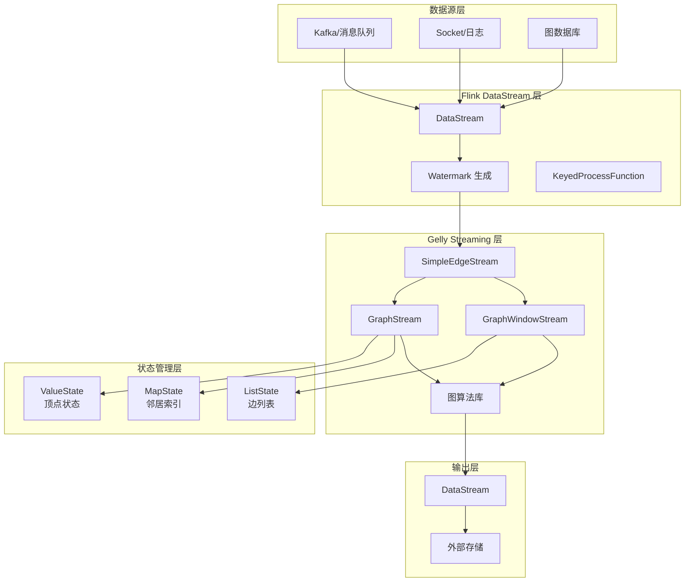
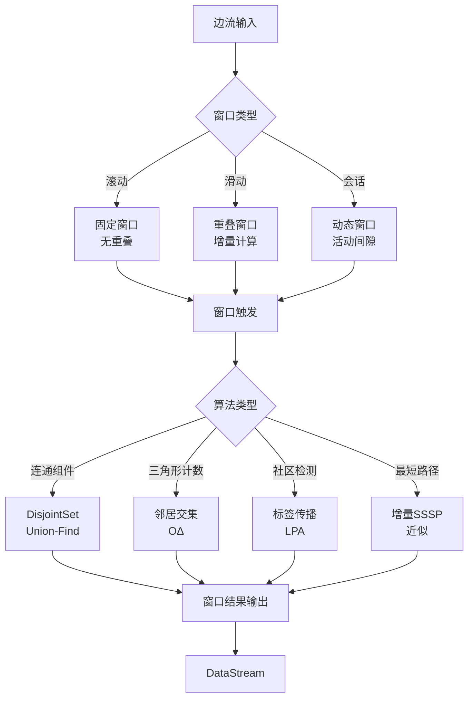
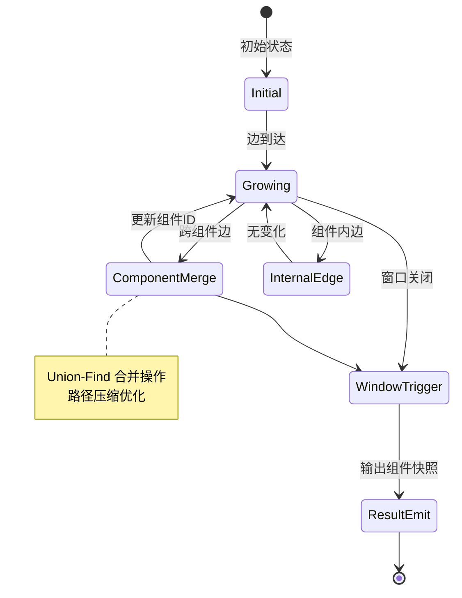
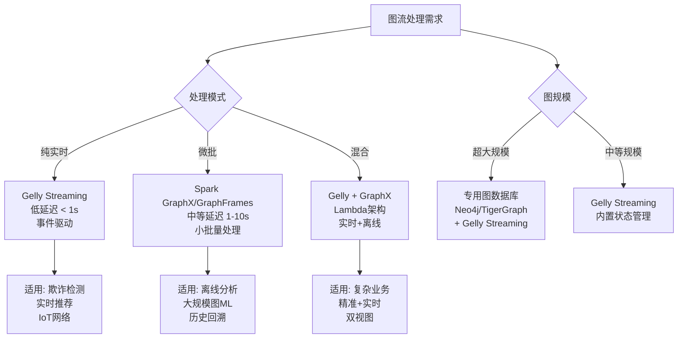

# Flink Gelly Streaming - 图流处理

> 所属阶段: Flink | 前置依赖: [Flink Gelly](flink-gelly.md), [Flink DataStream API](../01-architecture/datastream-v2-semantics.md) | 形式化等级: L4

---

## 1. 概念定义 (Definitions)

### 1.1 图流数据模型

**Def-F-14-31** (图流数据模型). 设图流为随时间演化的图序列 $𝒢 = \{G_t\}_{t=0}^{∞}$，其中每个时间点的图状态为：

$$
G_t = (V_t, E_t, A_t^V, A_t^E)
$$

- $V_t$: 时间 $t$ 的顶点集合
- $E_t \subseteq V_t \times V_t \times 𝕋$: 带时间戳的边集合，$𝕋$ 为时间域
- $A_t^V: V_t → Σ^*$: 顶点属性函数
- $A_t^E: E_t → Σ^*$: 边属性函数

图流的演化由边流 $ℰ = \{e_1, e_2, ..., e_n\}$ 驱动，其中每条边 $e_i = (u_i, v_i, t_i, a_i)$ 包含源顶点、目标顶点、时间戳和属性。

**Def-F-14-32** (边添加流模型 - Edge Addition Stream). Gelly Streaming 采用边添加流模型，定义图更新操作：

$$
G_{t+1} = G_t \oplus \{e | timestamp(e) = t+1\}
$$

其中 $\oplus$ 为图合并操作，包含隐式顶点创建（边端点不存在时自动创建）。

边添加流模型假设：

1. **单调性**: 边只增不减（边的删除通过标记实现）
2. **时间有序**: 边按时间戳非递减到达
3. **有限延迟**: 边延迟 $δ = t_{arrive} - t_{event}$ 有界

**Def-F-14-33** (GraphStream 抽象). Gelly Streaming 的核心抽象 `GraphStream<K, VV, EV>` 定义为：

```
GraphStream<K, VV, EV> = DataStream<Edge<K, EV>> × StateBackend
                         × WindowAssigner × Trigger
```

其中：

- `K`: 顶点标识符类型
- `VV`: 顶点值类型（存储在状态后端）
- `EV`: 边值类型
- `StateBackend`: 分布式状态存储（内存/RocksDB）
- `WindowAssigner`: 时间窗口分配器
- `Trigger`: 窗口触发策略

**Def-F-14-34** (图窗口切片 - Graph Window Slice). 设时间窗口 $W = [t_{start}, t_{end})$，图窗口切片定义为：

$$
G[W] = (V_W, E_W) = \left(\bigcup_{(u,v,t)∈E_W}\{u,v\}, \{(u,v,t)∈E | t∈W\}\right)
$$

窗口切片支持三种语义：

- **滚动窗口 (Tumbling)**: 不重叠的固定长度窗口 $W_i = [i·T, (i+1)·T)$
- **滑动窗口 (Sliding)**: 重叠窗口 $W_i = [i·S, i·S+L)$，滑动步长 $S < L$
- **会话窗口 (Session)**: 动态长度窗口，由活动间隙 $gap$ 定义

### 1.2 分布式图摘要

**Def-F-14-35** (分布式图摘要 - Distributed Graph Summarization). 设图 $G=(V,E)$，图摘要为映射函数 $φ: V → V'$ 诱导的压缩图 $G'=(V',E')$，其中：

$$
E' = \{(φ(u), φ(v), agg(\{w(u,v) | φ(u)=u' ∧ φ(v)=v'\})) | (u,v)∈E\}
$$

$agg$ 为边权重聚合函数（SUM/MAX/AVG）。

在流式场景下，图摘要需支持增量更新：

$$
φ_{t+1} = \begin{cases}
φ_t \cup \{v_{new} → c_{new}\} & \text{if } v_{new} \text{ 创建新簇} \\
φ_t \cup \{v_{new} → c_{existing}\} & \text{if } v_{new} \text{ 合并到现有簇}
\\
φ_t \setminus \{v_{del} → c\} & \text{if } v_{del} \text{ 被删除}
\end{cases}
$$

---

## 2. 属性推导 (Properties)

### 2.1 图流算法复杂度

**Lemma-F-14-11** (窗口切片复杂度). 对于时间窗口 $W$，设窗口内边数为 $|E_W|$，顶点数为 $|V_W|$，则：

1. **存储复杂度**: $O(|V_W| + |E_W|)$，由状态后端维护
2. **增量更新复杂度**: $O(Δ|E_W| · d_{avg})$，其中 $d_{avg}$ 为平均度数
3. **全量重算复杂度**: $O(|E_W| · T_{algo})$，$T_{algo}$ 为算法时间复杂度

**Proof.**

- 存储：状态后端以 Key-Value 形式存储顶点状态和边集，空间与图规模线性相关
- 增量：每条新边触发其两个端点的局部更新，影响范围为端点邻居集，规模与度数成正比
- 全量：窗口触发时执行完整算法，复杂度由算法本身决定 $□$

**Lemma-F-14-12** (流式连通组件的近似边界). 在边添加流模型下，设图演化速率为 $λ$（边/秒），算法处理延迟为 $τ$，则连通组件标识的滞后误差界为：

$$
|CC_{true}(t) - CC_{approx}(t)| \leq λ · τ · (1 + \frac{2}{|V|})
$$

**Lemma-F-14-13** (三角形计数的内存边界). 对于 $k$-跳邻居存储策略，流式三角形计数的内存消耗上界为：

$$
M_{triangle} \leq |V| · d_{max}^k · (|K| + |VV|)
$$

其中 $d_{max}$ 为最大度数，$k$ 为跳数，$|K|$ 为顶点ID大小，$|VV|$ 为顶点值大小。

### 2.2 状态管理性质

**Prop-F-14-21** (状态一致性保证). Gelly Streaming 的状态更新满足：

1. **原子性**: 单个边处理触发的事务内所有状态更新原子提交
2. **容错性**: Checkpoint 周期 $T_{cp}$ 内失败，状态回滚至最近检查点
3. **可重复读**: 相同边序列在任何故障恢复后产生相同状态

---

## 3. 关系建立 (Relations)

### 3.1 静态图与流图对比

| 维度 | 静态图 (Gelly Batch) | 流图 (Gelly Streaming) |
|------|---------------------|----------------------|
| **数据模型** | $G = (V, E)$ 快照 | $𝒢 = \{G_t\}_{t=0}^{∞}$ 序列 |
| **处理模式** | 全量批处理 | 增量/窗口处理 |
| **算法输出** | 精确收敛结果 | 近似/滑动结果 |
| **状态存储** | 迭代缓存 | Keyed State |
| **延迟要求** | 分钟-小时级 | 毫秒-秒级 |
| **内存策略** | 全图内存 | 窗口状态 + 增量索引 |

### 3.2 Gelly Streaming 与 DataStream 关系

```
DataStream<Edge<K, EV>>
         ↓
    SimpleEdgeStream  (图流抽象)
         ↓
    ┌────┴────┐
    ↓         ↓
GraphStream  GraphWindowStream
    ↓              ↓
Graph Algorithms  Windowed Analytics
    ↓              ↓
DataStream<Result>  DataStream<WindowResult>
```

**映射关系表**:

| Gelly Streaming | 底层 DataStream | 状态类型 |
|----------------|----------------|---------|
| `SimpleEdgeStream` | `DataStream<Edge>` | 无状态 |
| `GraphStream` | `KeyedProcessFunction` | `ValueState<VertexState>` |
| `GraphWindowStream` | `WindowedStream` | `ListState<Edge>` + `MapState<Vertex>` |
| `DisjointSet` (连通组件) | `KeyedBroadcastState` | `MapState<ComponentID>` |

### 3.3 与图数据库集成关系

| 系统类型 | 定位 | 集成模式 |
|---------|------|---------|
| **Gelly Streaming** | 流式图计算引擎 | 实时分析层 |
| **Neo4j** | 事务图数据库 | 查询结果导入/结果导出 |
| **JanusGraph** | 分布式图存储 | 批量数据交换 |
| **TigerGraph** | 原生并行图数据库 | 互补（批量 vs 实时） |

---

## 4. 论证过程 (Argumentation)

### 4.1 流式图处理适用性分析

**Prop-F-14-22** (流式图算法选择决策树). 对于给定图分析问题，选择流式处理的准则：

1. **实时性需求** $R < 10s$: 必须采用流式处理
2. **图演化频率** $f_{change} > 1/T_{batch}$: 批处理无法跟上变更速度
3. **算法可分解性**: 算法可表达为增量更新形式
4. **精度容忍度**: 可接受近似结果（误差 $< ε$）

**反例分析**:

- **全局 PageRank**: 需要全图迭代收敛，不适合纯流式处理（需近似算法如增量PageRank）
- **图着色**: 需要全局一致性约束，流式环境下可能产生冲突

### 4.2 边添加模型的局限性

**边界讨论**: 边添加模型假设边单调递增，实际应用中需处理：

1. **边删除**: 通过 tombstone 标记 + 垃圾回收实现
2. **属性更新**: 视为边删除+重新添加
3. **乱序到达**: 依赖 Watermark 机制，延迟数据加入后续窗口

---

## 5. 形式证明 / 工程论证 (Proof / Engineering Argument)

### 5.1 流式连通组件正确性

**Thm-F-14-21** (流式连通组件算法的正确性). 设边流 $ℰ$ 按时间戳非递减到达，算法在每个时间 $t$ 输出连通组件标识 $C_t(v)$，则：

$$
∀t, ∀u,v∈V_t: C_t(u) = C_t(v) \iff ∃\text{路径 } u \leadsto v \text{ in } G_t
$$

**Proof.** 归纳法：

*基础*: $t=0$，$G_0 = ∅$，所有顶点自成一个组件，命题成立。

*归纳假设*: 假设 $t$ 时刻命题成立。

*归纳步骤*: $t+1$ 时刻添加边 $e=(u,v)$，分两种情况：

1. **$C_t(u) = C_t(v)$**: 边在组件内部添加，组件结构不变，命题保持
2. **$C_t(u) \neq C_t(v)$**: 两个不同组件合并，算法更新所有 $C(v')$ 为 $C(u)$，新图中 $u,v$ 连通且属于同一组件，其他顶点连通性不变

由归纳法，命题对所有 $t$ 成立。$□$

### 5.2 增量三角形计数复杂度

**Thm-F-14-22** (增量三角形计数的复杂度上界). 设图 $G$ 的最大度数为 $Δ$，流式三角形计数算法处理单条边的时间复杂度为 $O(Δ)$。

**Proof Sketch.**

新边 $e=(u,v)$ 可能形成的三角形必须包含 $u$ 和 $v$ 的公共邻居。公共邻居集 $N(u) ∩ N(v)$ 的大小满足：

$$
|N(u) ∩ N(v)| \leq \min(|N(u)|, |N(v)|) \leq Δ
$$

算法需要查询 $u$ 和 $v$ 的邻居集（$O(1)$ 哈希查找）并计算交集（$O(Δ)$），因此单条边处理时间为 $O(Δ)$。$□$

### 5.3 工程性能优化论证

**分区策略论证**:

| 策略 | 适用场景 | 负载均衡 | 通信开销 |
|------|---------|---------|---------|
| **Hash Partition** | 通用场景 | 好 | 高 |
| **Range Partition** | 时序图 | 中 | 中 |
| **DGR (Degree-Based)** | 幂律图 | 差 | 低 |
| **HDRF** | 流式分割 | 中 | 低 |

**Thm-F-14-23** (分区策略对局部性的影响). 对于度分布服从幂律的图，度感知分区（DGR）相比哈希分区可减少 $O(\log |V|)$ 倍的跨分区边。

---

## 6. 实例验证 (Examples)

### 6.1 社交网络实时分析

**场景**: Twitter 实时社交网络，分析用户影响力传播和社区演化。

```java
// 从 DataStream 创建 SimpleEdgeStream
DataStream<Edge<Long, Double>> tweetEdges = tweets
    .flatMap(new TweetToEdgeMapper())  // 提取关注/转发关系
    .assignTimestampsAndWatermarks(
        WatermarkStrategy.<Edge<Long, Double>>forBoundedOutOfOrderness(
            Duration.ofSeconds(5)
        ).withTimestampAssigner((e, ts) -> e.getTimestamp())
    );

SimpleEdgeStream<Long, Double> edgeStream = new SimpleEdgeStream<>(tweetEdges, env);

// 创建带 5 分钟滚动窗口的 GraphWindowStream
GraphWindowStream<Long, NullValue, Double> windowedGraph = edgeStream
    .slice(Time.minutes(5), Time.minutes(5));  // 滚动窗口

// 计算每个窗口的连通组件
DataStream<Component<Long>> communities = windowedGraph
    .apply(new ConnectedComponentsAlgorithm<>())
    .mapWindowResult((window, components) -> {
        // 组件特征提取
        int componentCount = components.size();
        int maxComponentSize = components.stream()
            .mapToInt(c -> c.getVertices().size())
            .max().orElse(0);
        return new ComponentAnalysis(window.getEnd(), componentCount, maxComponentSize);
    });

// 社区演化检测
communities
    .keyBy(ComponentAnalysis::getWindowEnd)
    .window(SlidingEventTimeWindows.of(Time.hours(1), Time.minutes(10)))
    .aggregate(new CommunityEvolutionDetector())
    .addSink(new AlertSink());
```

### 6.2 金融风控实时图分析

**场景**: 实时交易网络，检测可疑的资金聚集和快速转移模式。

```java
// 构建交易边流
DataStream<Edge<String, TransactionInfo>> txEdges = transactions
    .map(tx -> new Edge<>(
        tx.getFromAccount(),
        tx.getToAccount(),
        new TransactionInfo(tx.getAmount(), tx.getTimestamp(), tx.getType())
    ));

SimpleEdgeStream<String, TransactionInfo> txStream = new SimpleEdgeStream<>(txEdges, env);

// 滑动窗口图分析（1小时窗口，5分钟滑动）
GraphWindowStream<String, AccountInfo, TransactionInfo> slidingGraph = txStream
    .slice(Time.hours(1), Time.minutes(5));

// 计算三角形计数（检测闭环交易）
DataStream<TriangleCountResult> triangleCounts = slidingGraph
    .apply(new TriangleCountAlgorithm<>())
    .mapWindowResult((window, count) ->
        new TriangleCountResult(window.getEnd(), count)
    );

// 异常检测：三角形数量突增可能指示洗钱行为
triangleCounts
    .keyBy(TriangleCountResult::getWindowEnd)
    .process(new AnomalyDetectionProcessFunction(
        /* threshold */ 100,
        /* z-score threshold */ 3.0
    ))
    .filter(alert -> alert.getSeverity() > AlertSeverity.MEDIUM)
    .addSink(new FraudAlertSink());
```

### 6.3 从 DataStream 构建 GraphStream

```java
// 定义顶点状态
public class VertexState {
    private long degree;
    private double pagerank;
    private long lastUpdateTime;
    // getters/setters
}

// 自定义 GraphStream 构建
DataStream<Edge<Long, Double>> edgeStream = ...;

// 方法1: 使用 SimpleEdgeStream（无状态边流）
SimpleEdgeStream<Long, Double> simpleStream = new SimpleEdgeStream<>(edgeStream, env);

// 方法2: 使用带顶点状态的 GraphStream
GraphStream<Long, VertexState, Double> graphStream = simpleStream
    .mapEdges(edge -> {
        edge.setValue(Math.log(edge.getValue() + 1));  // 边权重对数变换
        return edge;
    })
    .filterVertices((id, state) -> state.getDegree() > 10)  // 过滤低度顶点
    .withVertexState(
        // 初始状态工厂
        id -> new VertexState(0, 1.0, System.currentTimeMillis()),
        // 状态更新函数
        (state, edge, isSource) -> {
            state.setDegree(state.getDegree() + 1);
            state.setLastUpdateTime(System.currentTimeMillis());
            return state;
        }
    );

// 全局聚合：计算图统计信息
DataStream<GraphStatistics> stats = graphStream
    .globalAggregate(new GraphStatisticsAggregator() {
        @Override
        public GraphStatistics createAccumulator() {
            return new GraphStatistics();
        }

        @Override
        public void add(Edge<Long, Double> edge, GraphStatistics acc) {
            acc.incrementEdgeCount();
            acc.addToTotalWeight(edge.getValue());
        }

        @Override
        public GraphStatistics getResult(GraphStatistics acc) {
            acc.setAverageWeight(acc.getTotalWeight() / acc.getEdgeCount());
            return acc;
        }
    });

// 邻居聚合：计算每个顶点的加权入度
DataStream<Vertex<Long, Double>> weightedDegrees = graphStream
    .neighborhood(new NeighborhoodAggregation<Long, VertexState, Double, Double>() {
        @Override
        public Double mapEdge(Edge<Long, Double> edge, boolean isIncoming) {
            return isIncoming ? edge.getValue() : 0.0;
        }

        @Override
        public Double reduceEdges(Double v1, Double v2) {
            return v1 + v2;
        }

        @Override
        public Vertex<Long, Double> applyToVertex(
            Long vertexId,
            VertexState state,
            Double aggregatedValue
        ) {
            return new Vertex<>(vertexId, aggregatedValue);
        }
    });

// 结果转回 DataStream 进行后续处理
weightedDegrees
    .keyBy(Vertex::getId)
    .window(TumblingEventTimeWindows.of(Time.minutes(1)))
    .aggregate(new TopKAggregator(100))  // Top 100 高影响力用户
    .addSink(new DashboardSink());
```

### 6.4 状态后端配置优化

```java
// RocksDB 状态后端配置（大状态场景）
RocksDBStateBackend rocksDbBackend = new RocksDBStateBackend(
    "hdfs://namenode:8020/flink/checkpoints",
    true  // 增量 checkpoint
);

// 配置 RocksDB 调优
DefaultConfigurableOptionsFactory optionsFactory = new DefaultConfigurableOptionsFactory();
optionsFactory.setRocksDBOptions("max_background_jobs", "4");
optionsFactory.setRocksDBOptions("write_buffer_size", "64MB");
optionsFactory.setRocksDBOptions("target_file_size_base", "32MB");
rocksDbBackend.setRocksDBOptions(optionsFactory);

env.setStateBackend(rocksDbBackend);

// 启用增量 checkpoint 和本地恢复
env.getCheckpointConfig().enableExternalizedCheckpoints(
    ExternalizedCheckpointCleanup.RETAIN_ON_CANCELLATION
);
env.getCheckpointConfig().setPreferCheckpointForRecovery(true);
```

---

## 7. 可视化 (Visualizations)

### 7.1 Gelly Streaming 架构层次图



### 7.2 窗口切片与算法执行流程



### 7.3 流式连通组件状态演化



### 7.4 Gelly Streaming vs Spark GraphX 对比矩阵



### 7.5 三角形计数算法流程

```mermaid
flowchart LR
    A[新边到达<br/>e=u,v] --> B[查询 u 的邻居集<br/>N]
    A --> C[查询 v 的邻居集<br/>N']

    B --> D[计算交集<br/>N ∩ N']
    C --> D

    D --> E{交集大小}
    E -->|> 0| F[形成<br/>|N∩N'| 个<br/>新三角形]
    E -->|= 0| G[无新三角形]

    F --> H[更新全局计数]
    G --> I[保持状态]

    H --> J[更新邻居索引]
    I --> J

    J --> K[等待下一边]

    style F fill:#90EE90
    style G fill:#FFB6C1
```

---

## 8. 引用参考 (References)


---

*文档版本: 1.0 | 创建日期: 2026-04-02 | 状态: Complete*
