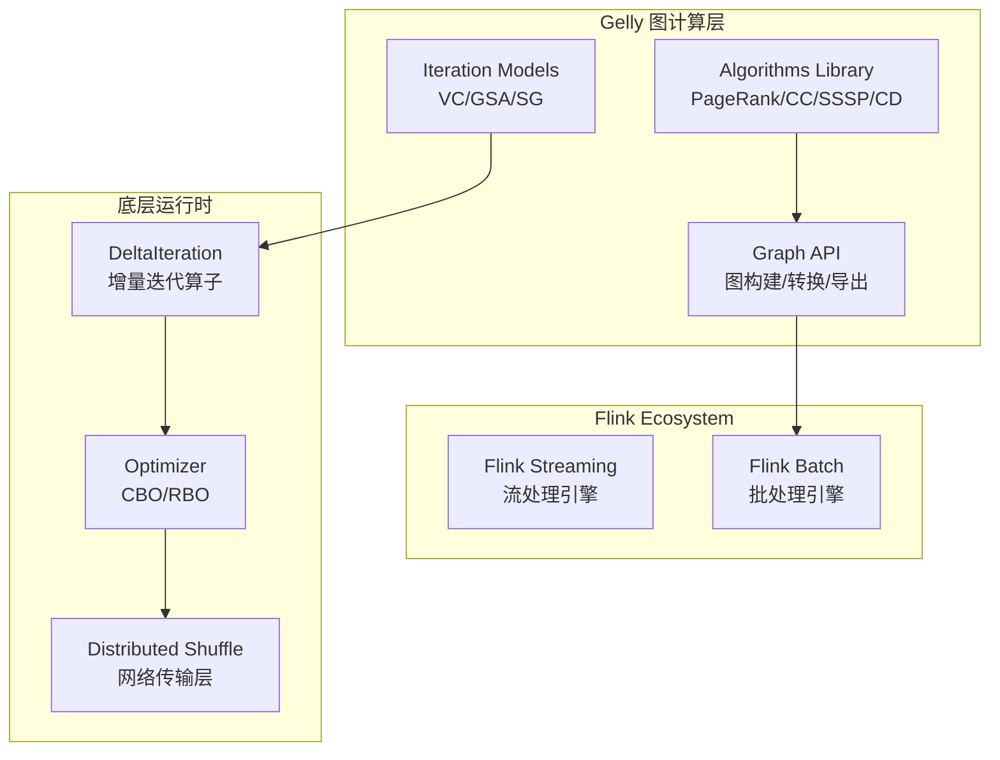
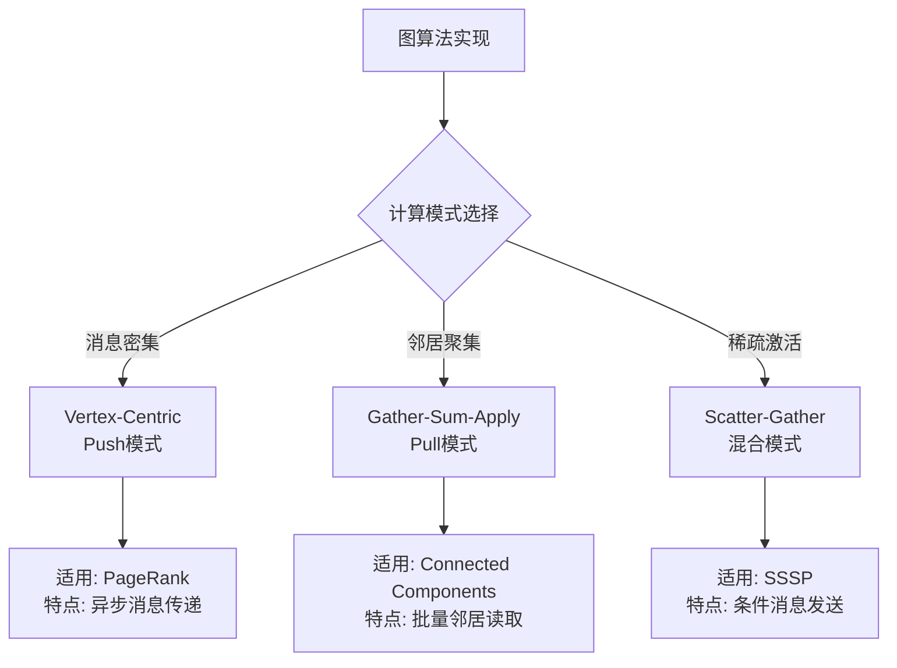
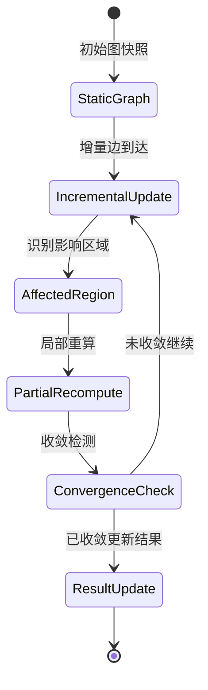
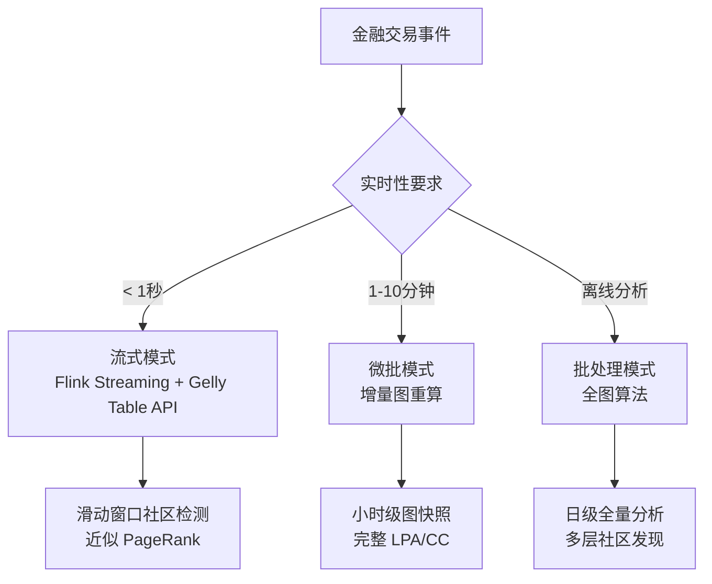

# Flink Gelly - 大规模图计算

> 所属阶段: Flink | 前置依赖: [Flink DataStream V2语义](../../01-concepts/datastream-v2-semantics.md), [迭代机制](./flink-gelly-streaming-graph-processing.md) | 形式化等级: L3

## 1. 概念定义 (Definitions)

**Def-F-14-01** (图数据模型). 设图数据模型为二元组 $G = (V, E)$，其中：

- $V$ 为顶点集合，每个顶点 $v ∈ V$ 具有唯一标识符 $id(v)$ 和属性值 $A_V(v): ℙ(V) → Σ^*$
- $E ⊆ V × V$ 为边集合，每条边 $e = (u, v) ∈ E$ 具有方向性、权重 $w(e) ∈ ℝ^+$ 和属性值 $A_E(e): ℙ(E) → Σ^*$

在 Flink Gelly 中，图被表示为两个 DataSet：

```
Graph<K, VV, EV> = (DataSet<Vertex<K, VV>>, DataSet<Edge<K, EV>>)
```

其中：

- `K`: 顶点标识符类型
- `VV`: 顶点值类型
- `EV`: 边值类型

**Def-F-14-02** (迭代图算法 - BSP模型). BSP (Bulk Synchronous Parallel) 模型定义图算法的执行语义：

设第 $i$ 次迭代的计算状态为 $S_i = (V_i, E_i, M_i)$，其中 $M_i$ 为消息集合。BSP 执行过程为：

$$
S_{i+1} = Γ(S_i) = (V_i', E_i', M_{i+1})
$$

其中 $Γ$ 为全局同步操作，包含三个有序阶段：

1. **本地计算 (Compute)**: 每个顶点 $v$ 基于当前状态和接收消息 $M_i(v)$ 执行用户定义函数，生成新状态和新消息
2. **全局通信 (Communication)**: 将消息路由到目标顶点
3. **同步屏障 (Synchronization)**: 等待所有顶点完成计算后进入下一轮迭代

终止条件：当满足 $M_i = ∅$ 或达到最大迭代次数 $I_{max}$ 时停止。

**Def-F-14-03** (增量图更新). 设原始图为 $G_t = (V_t, E_t)$，增量更新为 $ΔG = (ΔV^+, ΔV^-, ΔE^+, ΔE^-)$，其中：

- $ΔV^+$: 新增顶点集合
- $ΔV^-$: 删除顶点集合
- $ΔE^+$: 新增边集合
- $ΔE^-$: 删除边集合

增量图更新定义为：

$$
G_{t+1} = (V_t \setminus ΔV^- \cup ΔV^+, E_t \setminus ΔE^- \cup ΔE^+ \\ \{(u,v) | u ∈ ΔV^- ∨ v ∈ ΔV^-\})
$$

增量算法重算仅对受影响区域 $A(ΔG) ⊆ V$ 进行局部计算，而非全图重算。

---

## 2. 属性推导 (Properties)

**Lemma-F-14-01** (Gelly 图的不变性). 对于任何有效的 Flink Gelly 图实例，满足：

1. **标识符唯一性**: $∀ v_1, v_2 ∈ V: id(v_1) = id(v_2) ⇒ v_1 = v_2$
2. **边有效性**: $∀ (u,v) ∈ E: u ∈ V ∧ v ∈ V$
3. **分区局部性**: 边与其源顶点位于同一分区

**Proof.** 由 DataSet 的分布式哈希分区策略和 Gelly 的 `Graph.fromDataSet` 构造器保证。$□$

**Lemma-F-14-02** (BSP 迭代的单调性). 在 BSP 模型下，若顶点计算函数是单调的（即状态更新仅依赖于前序状态），则算法收敛性不受消息传递顺序影响。

**Lemma-F-14-03** (增量更新的影响范围). 增量更新 $ΔG$ 的影响范围 $A(ΔG)$ 满足：

$$
|A(ΔG)| ≤ |ΔV^+| + |ΔV^-| + 2|ΔE^+| + 2|ΔE^-| + Σ_{v ∈ ΔV} degree(v)
$$

即增量更新的计算复杂度与变更规模线性相关，而非全图规模。

---

## 3. 关系建立 (Relations)

### 3.1 Gelly 与 Flink 核心 API 的关系

| Gelly 组件 | 底层实现 | 数据流语义 |
|-----------|---------|-----------|
| `Graph` | `DataSet<Vertex>` + `DataSet<Edge>` | 批处理数据集 |
| `VertexCentricIteration` | `DeltaIteration` | 增量迭代算子 |
| `Gather-Sum-Apply` | `MapFunction` + `ReduceFunction` | 并行聚集操作 |
| `Scatter-Gather` | `JoinFunction` + `CoGroup` | 消息传递模式 |

### 3.2 图算法与计算模型映射

```
Vertex-Centric Model ←─BSP─→ Pregel/Giraph
         ↓
   Gather-Sum-Apply ←───→ Gelly GSA
         ↓
   Scatter-Gather   ←───→ Gelly SG
```

### 3.3 与流计算的融合点

| 维度 | 批处理图计算 | 流式图计算 |
|------|-------------|-----------|
| 图状态 | 静态快照 | 动态演化 |
| 更新模式 | 全量重算 | 增量更新 |
| 结果时效 | 离线小时级 | 实时秒级 |
| 适用算法 | 全局收敛算法 | 近似/滑动窗口算法 |

---

## 4. 论证过程 (Argumentation)

### 4.1 算法适用性分析

**Prop-F-14-01** (算法选择决策树). 对于给定图算法问题，选择 Gelly 计算模式的准则：

1. **消息密集型** (如 PageRank): 优先 Vertex-Centric Iteration
2. **邻居聚集型** (如 Connected Components): 优先 Gather-Sum-Apply
3. **稀疏激活型** (如 SSSP 从单源出发): 优先 Scatter-Gather

**反例分析**: 对于稠密图 ($|E| ≈ |V|^2$)，GSA 模式因 Gather 阶段需要拉取所有邻居数据，可能退化为全图广播，此时 Vertex-Centric 的消息推送模式更优。

### 4.2 增量计算的边界讨论

**边界条件**: 当图更新频率 $f_{update}$ 与算法收敛时间 $T_{converge}$ 满足 $f_{update} > 1/T_{converge}$ 时，增量算法可能无法在两次更新间完成收敛，需降级为近似算法或采样策略。

---

## 5. 形式证明 / 工程论证 (Proof / Engineering Argument)

### 5.1 核心算法正确性证明

**Thm-F-14-01** (PageRank 在 Gelly 中的收敛性). 设图 $G=(V,E)$ 的邻接矩阵为 $A$，阻尼系数为 $d$，则 Gelly 实现的 PageRank 迭代：

$$
PR_{i+1}(v) = \frac{1-d}{|V|} + d \sum_{u ∈ N_{in}(v)} \frac{PR_i(u)}{|N_{out}(u)|}
$$

当 $i → ∞$ 时收敛到主特征向量。

**Proof Sketch.**

1. 迭代公式对应 Google 原始 PageRank 的矩阵形式：$\vec{PR}_{i+1} = d \cdot M \cdot \vec{PR}_i + \frac{1-d}{|V|} \cdot \vec{1}$
2. 矩阵 $M$ 为列随机矩阵，根据 Perron-Frobenius 定理，存在唯一平稳分布
3. Gelly 的 BSP 迭代保证每轮全局同步，数值计算与理论模型一致
4. 收敛条件 $\|\vec{PR}_{i+1} - \vec{PR}_i\|_1 < \epsilon$ 由框架自动检测 $\square$

### 5.2 工程实现论证

**Gelly 架构优势论证**:

| 特性 | 工程收益 | 理论依据 |
|------|---------|---------|
| DataSet 基础 | 自动获得 Flink 的优化器 (CBO)、内存管理、序列化优势 | 关系代数等价变换 |
| 迭代算子复用 | 利用 `DeltaIteration` 的缓存机制减少数据传输 | 迭代空间局部性原理 |
| 三种编程模型 | 覆盖不同算法模式的最优实现选择 | 计算-通信权衡理论 |

---

## 6. 实例验证 (Examples)

### 6.1 社交网络实时推荐

**场景**: 基于用户-物品交互图，实时计算 Personalized PageRank 进行推荐。

```java
// 构建用户-物品二分图
Graph<Long, Double, Double> bipartiteGraph = Graph.fromDataSet(
    users.union(items),  // 顶点 DataSet
    interactions,        // 边 DataSet (user -> item, weight = interaction strength)
    env
);

// 为每个用户运行 Personalized PageRank
DataSet<Vertex<Long, Double>> recommendations = bipartiteGraph
    .runVertexCentricIteration(
        new PersonalizedPageRankComputeFunction(targetUser),
        new PersonalizedPageRankMessageCombiner(),
        maxIterations
    )
    .getVertices();

// 过滤物品顶点，按 PageRank 值排序推荐
DataSet<Tuple2<Long, Double>> topItems = recommendations
    .filter(v -> isItemVertex(v.getId()))
    .map(v -> new Tuple2<>(v.getId(), v.getValue()))
    .sortPartition(1, Order.DESCENDING)
    .first(topK);
```

**流式增强**: 结合 Flink Streaming 的 `IntervalJoin`，将增量用户行为实时合并到图快照，触发局部重算。

### 6.2 欺诈检测图分析

**场景**: 金融交易网络中，通过社区发现识别异常资金聚集模式。

```java
// 构建交易图：顶点=账户，边=交易（带金额和时间戳）
Graph<String, AccountInfo, Transaction> transactionGraph = ...;

// 应用标签传播算法 (Label Propagation) 检测社区
Graph<String, AccountInfo, Transaction> communities = transactionGraph
    .runScatterGatherIteration(
        new LabelPropagationScatter(),   // 发送标签给邻居
        new LabelPropagationGather(),    // 收集邻居标签
        maxIterations
    );

// 识别异常社区：规模小但交易密度高
DataSet<Community> suspiciousCommunities = communities
    .getVertices()
    .groupBy(Community::getLabel)
    .reduceGroup(new AnomalyScoreCalculator());
```

**时序图分析增强**:

```java
// 将交易流转换为时序图切片
DataStream<Graph<String, AccountInfo, Transaction>> timeSliceGraphs =
    transactions
        .keyBy(Transaction::getTimestamp)
        .window(TumblingEventTimeWindows.of(Time.hours(1)))
        .aggregate(new GraphBuilderAggregate());

// 检测社区演化异常
timeSliceGraphs
    .keyBy(Graph::getTimeSlice)
    .process(new CommunityEvolutionMonitor());
```

---

## 7. 可视化 (Visualizations)

### 7.1 Gelly 架构层次图

Gelly 在 Flink 技术栈中的位置：



### 7.2 三种迭代模型对比矩阵



### 7.3 动态图更新处理流程



### 7.4 欺诈检测场景决策树



---

## 8. 引用参考 (References)
