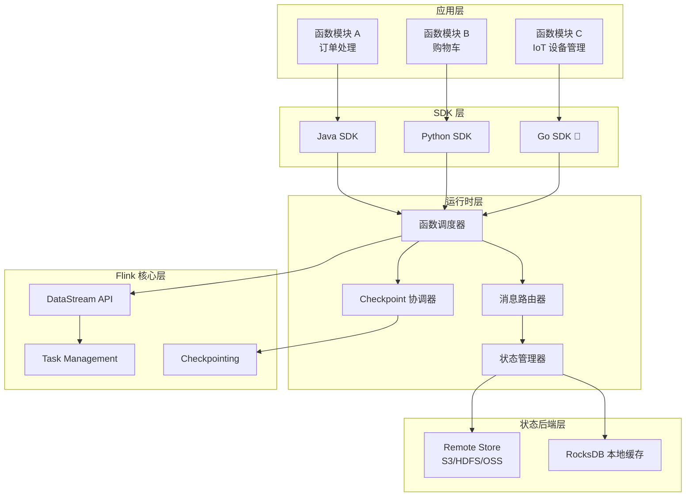
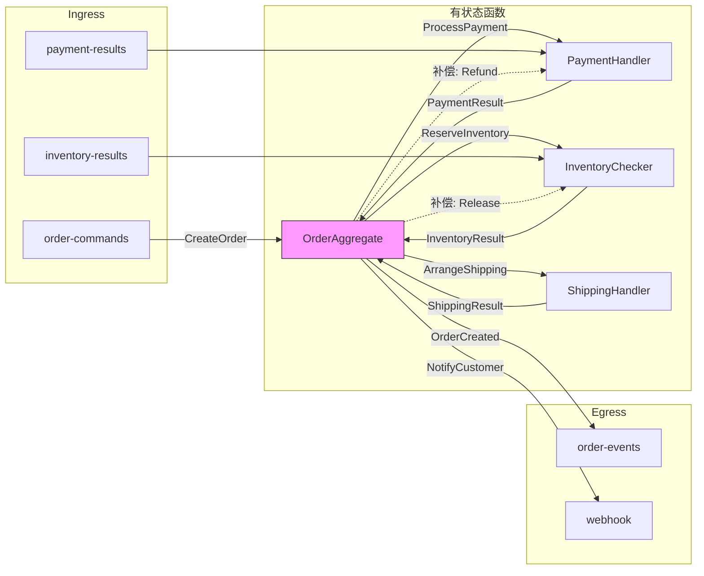
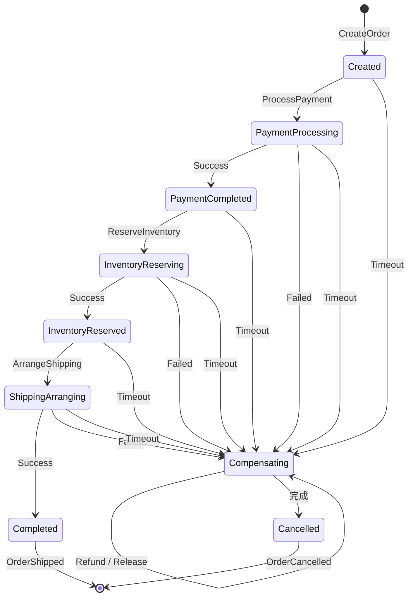
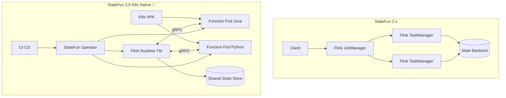
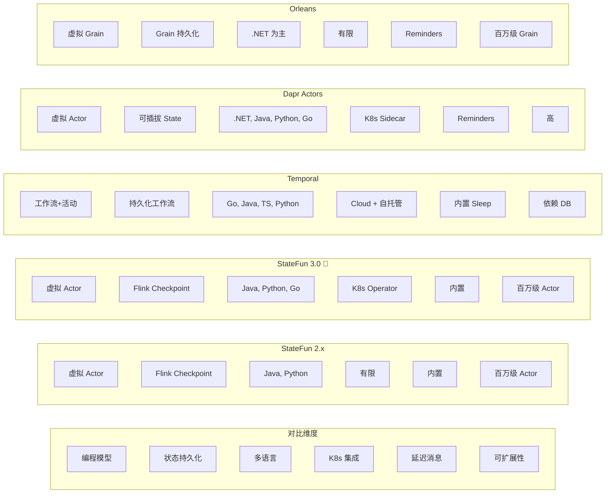

# Flink Stateful Functions (StateFun) 3.0 前瞻与生产实践

> **状态**: 🔮 前瞻内容 | **风险等级**: 高 | **最后更新**: 2026-04-20-20
>
> StateFun 3.0 尚未正式发布，当前处于社区早期规划阶段。预计目标版本为 Flink 2.5+。具体实现以 Apache Flink 官方发布为准。
>
> 此文档描述的 StateFun 3.0 特性处于早期规划阶段，可能与最终实现不符。请以 Apache Flink 官方发布为准。

> 所属阶段: Flink/05-ecosystem | 前置依赖: [Flink/01-concepts/flink-system-architecture-deep-dive.md](../../01-concepts/flink-system-architecture-deep-dive.md), [Struct/03-relationships/03.05-cross-model-mappings.md](../../../Struct/03-relationships/03.05-cross-model-mappings.md) | 形式化等级: L3-L5

## 摘要

Apache Flink Stateful Functions（StateFun）是一个基于**虚拟 Actor 模型**的分布式有状态计算框架，允许开发者以函数粒度构建高可扩展、低延迟的事件驱动应用。StateFun 将 Actor 模型的位置透明性与 Flink 的分布式容错能力相结合，为微服务编排、实时会话管理、IoT 设备状态机等场景提供了独特的技术方案。

StateFun 2.x 已于生产环境验证多年。当前社区正积极推进 **StateFun 3.0** 研发，核心方向包括：基于 gRPC/HTTP 的统一 RPC 协议、Kubernetes Native 部署模式、多语言 SDK 扩展、以及与 Flink DataStream/Table API 的深度集成。

本文档从形式化语义出发，系统阐述 StateFun 架构原理、3.0 路线图前瞻、典型应用场景、生产实践指南，以及与 Temporal、Dapr Actors、Orleans 的深度对比。

**关键词**: Stateful Functions, StateFun 3.0, 虚拟 Actor, 动态消息路由, Saga 模式, 事件溯源, Flink 集成

---

## 目录

- [1. 概念定义 (Definitions)](#1-概念定义-definitions)
- [2. 属性推导 (Properties)](#2-属性推导-properties)
- [3. 关系建立 (Relations)](#3-关系建立-relations)
- [4. 论证过程 (Argumentation)](#4-论证过程-argumentation)
- [5. 形式证明 / 工程论证 (Proof / Engineering Argument)](#5-形式证明-工程论证-proof-engineering-argument)
- [6. 实例验证 (Examples)](#6-实例验证-examples)
- [7. 可视化 (Visualizations)](#7-可视化-visualizations)
- [8. 引用参考 (References)](#8-引用参考-references)

---

## 1. 概念定义 (Definitions)

### Def-F-05-50: 有状态函数 (Stateful Function)

**定义**: 有状态函数是一个计算实体，由四元组 $\mathcal{F} = (S, M, \delta, \sigma)$ 定义，其中：

- $S$: 持久化状态空间，$s \in S$ 为具体状态实例
- $M$: 消息空间，$m \in M$ 为输入消息，$m^{out} \in M^{out}$ 为输出消息（含延迟消息）
- $\delta: S \times M \rightarrow S \times \mathcal{P}(M^{out})$: 状态转移函数
- $\sigma: S \rightarrow \mathbb{R}^+$: 状态大小度量函数

执行迹为序列 $\tau = (s_0, m_1, s_1, \mathcal{M}_1^{out}), (s_1, m_2, s_2, \mathcal{M}_2^{out}), \ldots$，其中 $(s_i, \mathcal{M}_i^{out}) = \delta(s_{i-1}, m_i)$。

**推论**: StateFun 函数的状态转移 $\delta$ 是**单线程执行**的——同一函数实例的消息按到达顺序串行处理，消除了锁和并发控制需求。

---

### Def-F-05-51: 虚拟 Actor (Virtual Actor)

**定义**: 虚拟 Actor 是一种 Actor 实现模型，核心特征为**位置透明性**和**按需实例化**。设物理计算节点集合为 $\mathcal{N} = \{N_1, \ldots, N_k\}$，虚拟 Actor 映射为：

$$\mathcal{V}: \text{ActorID} \rightarrow \mathcal{N} \cup \{\bot\}$$

其中 $\mathcal{V}(id) = \bot$ 表示该 Actor 当前未实例化；发送者无需知道 $\mathcal{V}(id)$ 的具体值；若节点故障，运行时自动迁移。

| 特性 | 虚拟 Actor (StateFun/Orleans) | 物理 Actor (Akka/Pekko) |
|------|------------------------------|------------------------|
| 生命周期 | 按需创建/销毁，空闲无资源占用 | 显式创建，常驻内存 |
| 位置管理 | 运行时自动分配 | 显式配置集群分片 |
| 状态持久化 | 与计算解耦，持久化到远程存储 | 通常与 Actor 生命周期绑定 |
| 故障恢复 | 状态从存储重建，Actor 重新激活 | 需要监督策略和持久化配置 |
| 可寻址性 | 逻辑地址唯一，物理位置无关 | 逻辑地址通常映射到物理节点 |

---

### Def-F-05-52: 函数类型与标识符 (Function Type and ID)

**定义**: 每个函数实例由**函数类型** $\tau$ 和**函数标识符** $id$ 唯一确定。

函数类型定义行为规范：$\tau = (\Sigma_{\text{in}}, \Sigma_{\text{out}}, \Sigma_{\text{state}}, \delta_{\tau})$

函数标识符为二元组：$id = (\tau, \kappa) \in \mathcal{T} \times \mathcal{K}$，其中 $\kappa$ 为业务实体 ID（如用户 ID、设备 ID）。全局地址：$\text{Address}(id) = \tau \cdot \kappa$。

---

### Def-F-05-53: 动态消息路由 (Dynamic Message Routing)

**定义**: 路由函数 $\mathcal{R}: M \times S_{\text{context}} \rightarrow \mathcal{P}(\mathcal{A})$ 将消息定向到目标函数实例，支持三种模式：

1. **显式路由**: $\mathcal{R}_{\text{explicit}}(m, s) = \{(\tau_{\text{target}}, \kappa_{\text{target}})\}$
2. **Egress 路由**: $\mathcal{R}_{\text{egress}}(m, s) = \text{Egress}(spec)$
3. **延迟消息路由**: $\mathcal{R}_{\text{delayed}}(m, s, \Delta t) = \{(\tau, \kappa, t_{\text{now}} + \Delta t)\}$

路由图 $\mathcal{G}_R = (\mathcal{A}, E_R)$ 中，边 $(a_i, a_j) \in E_R$ 当且仅当存在消息 $m$ 使得 $a_j \in \mathcal{R}(m, s_{a_i})$。

---

### Def-F-05-54: 状态局部性 (State Locality)

**定义**: 状态局部性是函数实例状态与其计算位置的关联关系。设函数实例地址为 $a = (\tau, \kappa)$，强状态局部性定义为：

$$\text{Locality}(a, t) = \text{true} \iff s_a \text{ 在节点 } \mathcal{V}_t(a) \text{ 的本地可访问存储中}$$

StateFun 通过**状态亲和调度**、**惰性加载**和**状态驱逐**实现局部性。定义**局部性命中率**：

$$\eta = \frac{\sum_{a} \mathbb{1}[\text{Locality}(a, t) = \text{true}]}{|\{a \mid a \text{ 在时刻 } t \text{ 活跃}\}|}$$

设计目标：典型负载下 $\eta > 0.95$。

---

### Def-F-05-55: 函数模块 (Function Module)

**定义**: 函数模块是部署单元，定义为 $\mathcal{M} = (\mathcal{T}_{\mathcal{M}}, \mathcal{E}_{\mathcal{M}}, \mathcal{R}_{\mathcal{M}}, \mathcal{C}_{\mathcal{M}})$，其中 $\mathcal{T}$ 为函数类型集合，$\mathcal{E}$ 为 Egress 集合，$\mathcal{R}$ 为路由规则，$\mathcal{C}$ 为配置参数。

组合操作：$\mathcal{M}_1 \oplus \mathcal{M}_2 = (\mathcal{T}_1 \cup \mathcal{T}_2, \mathcal{E}_1 \cup \mathcal{E}_2, \mathcal{R}_1 \cup \mathcal{R}_2, \mathcal{C}_{\text{merged}})$，要求 $\mathcal{T}_1 \cap \mathcal{T}_2 = \emptyset$。

---

### Def-F-05-56: 有状态函数图的闭包 (Stateful Function Graph Closure)

**定义**: 设路由图为 $\mathcal{G}_R = (\mathcal{A}, E_R)$，其传递闭包 $\mathcal{G}_R^* = (\mathcal{A}, E_R^*)$ 满足 $E_R^* = \{(a_i, a_j) \mid \text{存在从 } a_i \text{ 到 } a_j \text{ 的有向路径}\}$。

**强闭包**: $\forall a \in \mathcal{A}, (a, a) \in E_R^*$（允许通过延迟消息实现循环）。

**有界闭包**: 存在有限路径长度上界 $L$，使得所有闭包路径满足 $|p| \leq L$。

---

## 2. 属性推导 (Properties)

### Lemma-F-05-20: 虚拟 Actor 的幂等接收性

**引理**: 设虚拟 Actor 实例 $a$ 在状态 $s$ 下接收消息 $m$。由于单线程串行执行（Def-F-05-50 推论），状态转移满足：

$$\delta(\delta(s, m_1), m_2) = \delta(s, \langle m_1, m_2 \rangle)$$

即消息处理顺序是确定性的，与调度时序无关（只要消息到达顺序固定）。若消息 $m$ 被重复投递且 $\delta$ 设计为幂等的，则 $\delta_{\text{state}}(\delta_{\text{state}}(s, m), m) = \delta_{\text{state}}(s, m)$。

**Proof.** 由 Def-F-05-50，每个函数实例的消息队列是 FIFO 的，且处理函数 $\delta$ 是纯函数。因此给定相同的前置状态和消息序列，输出状态唯一确定。**∎**

---

### Prop-F-05-20: 动态路由的确定性

**命题**: 在函数状态确定的前提下，动态消息路由满足：

$$\forall m, s, \quad |\mathcal{R}(m, s)| \leq K_{\max}$$

且对于确定性路由策略：$\mathcal{R}(m, s_1) = \mathcal{R}(m, s_2)$ 若 $s_1 = s_2$。

**Proof.** 路由决策基于不可变消息 $m$、已确定的当前状态 $s$ 和运行时静态配置 $\mathcal{C}_{\mathcal{M}}$。$\mathcal{R}$ 不包含随机性，故给定相同的 $(m, s)$，路由结果必然相同。**∎**

---

### Lemma-F-05-21: 状态局部性的可达性保持

**引理**: 设函数实例 $a$ 的状态 $s_a$ 在时刻 $t$ 具有局部性（缓存在节点 $N = \mathcal{V}_t(a)$）。若从 $t$ 到 $t'$ 期间 $a$ 持续接收消息，则 $s_a$ 保持局部性，除非：节点 $N$ 故障、显式状态驱逐触发、或系统发生重平衡。

**Proof.** StateFun 调度器维护 $M_{\text{affinity}}: a \rightarrow N$，优先将消息路由到已缓存状态的节点。只要节点健康且无外部干预，局部性得以保持。**∎**

---

### Prop-F-05-21: 函数模块的组合封闭性

**命题**: 两个良构函数模块 $\mathcal{M}_1$ 和 $\mathcal{M}_2$（满足 $\mathcal{T}_1 \cap \mathcal{T}_2 = \emptyset$）的组合 $\mathcal{M} = \mathcal{M}_1 \oplus \mathcal{M}_2$ 仍然是良构的。

**Proof.** 组合后函数类型唯一性由前提保证；Egress 同名冲突采用覆盖或显式报错；路由规则按命名空间隔离；配置冲突采用显式合并策略。故 $\mathcal{M}$ 满足良构性。**∎**

---

## 3. 关系建立 (Relations)

### 3.1 与 Actor 模型的关系

StateFun 到经典 Actor 模型的编码映射 $\llbracket \cdot \rrbracket$：

| 维度 | 经典 Actor (Akka/Pekko) | StateFun |
|------|------------------------|----------|
| 状态存储 | 与 Actor 共存（内存中） | 与计算解耦（可远程持久化） |
| 生命周期 | 显式管理 | 按需激活/钝化 |
| 容错 | 监督树 + 可选持久化 | 内置 Checkpoint + 状态恢复 |
| 可扩展性 | 受限于物理节点容量 | 理论上无上限（虚拟化） |
| 延迟消息 | 需自定义实现 | 内置支持 |

StateFun 的虚拟 Actor 模型是经典 Actor 模型在**云原生环境**中的演化：状态的持久化和计算的弹性伸缩被运行时统一管理。

---

### 3.2 与 Flink DataStream API 的关系

StateFun 2.x 构建于 Flink DataStream API 之上，利用 Flink 的分布式流处理能力实现消息路由、状态管理和容错。StateFun 3.0 计划深化双向集成：StateFun 函数可作为 DataStream 作业中的 `ProcessFunction`；DataStream 作业可作为 StateFun 的 Ingress/Egress。

形式上，设 DataStream 程序为 $\mathcal{D} = (\mathcal{O}, \mathcal{E})$，StateFun 应用为 $\mathcal{S}$，映射为 $\Phi: \mathcal{S} \rightarrow \mathcal{D}$，其中每个函数类型 $\tau$ 映射为 `KeyedProcessFunction`，消息传递映射为 `keyBy` + `process` 边。

---

### 3.3 与 Flink Table API 的关系

集成模式：Table 作为 Ingress（SQL 查询结果流入 StateFun 函数）；Table 作为 Egress（函数消息输出到 Table Sink）。**3.0 前瞻**: 计划支持将 StateFun 状态直接暴露为虚拟表，允许通过 SQL 查询函数状态。

---

### 3.4 与事件溯源 (Event Sourcing) 的关系

StateFun 天然支持事件溯源：输入消息 $m$ 对应命令 $c$；状态变更 $\Delta s$ 对应事件 $e$；Checkpoint 机制提供隐式状态快照。区别在于 StateFun 直接维护状态快照，对于需要完整审计日志的场景，可通过 Egress 将状态变更事件输出到外部事件存储。

---

### 3.5 与 Saga 模式的关系

设 Saga 为补偿事务序列 $\mathcal{S} = (T_1, T_2, \ldots, T_n)$，每个 $T_i$ 有补偿操作 $C_i$。StateFun 实现机制：

1. **编排 Saga**: 使用 Saga 编排函数按顺序发送命令并等待响应
2. **编舞 Saga**: 各参与方通过事件消息自发协作
3. **补偿触发**: 失败时沿反向路径发送 $\text{Compensate}(C_i)$

虚拟 Actor 模型使得 Saga 参与方可长期存活（通过延迟消息保持心跳），状态持久化保证崩溃后可从中间状态恢复。

---

## 4. 论证过程 (Argumentation)

### 4.1 辅助定理：为什么需要虚拟 Actor 而非物理 Actor

**论证**: 对于"海量实体、低活跃率"的场景（如 IoT 设备管理、用户会话），虚拟 Actor 具有根本优势：

1. **资源效率**: 设系统有 $N = 10^7$ 个用户会话。物理 Actor 常驻内存，每个 1KB 即需 10GB；虚拟 Actor 只缓存热数据（如 1% 活跃，100MB）。
2. **故障域隔离**: 物理 Actor 节点故障导致状态丢失；虚拟 Actor 状态与计算解耦，其他节点可透明接管。
3. **弹性伸缩**: 物理 Actor 扩缩容需重新计算分片策略；虚拟 Actor 扩缩容透明，新增节点自动分担负载。

---

### 4.2 反例分析：StateFun 不适用于什么场景

1. **高频低延迟交易（< 1ms P99）**: StateFun 典型 P99 延迟 5-20ms，不适合高频交易。
2. **复杂图计算**: 邻居访问都是跨函数消息传递，效率低下。应使用 Flink Gelly 或专用图数据库。
3. **长时间运行的批量计算**: StateFun 面向事件驱动工作负载，大容量批处理应使用 DataStream API。
4. **强一致性 ACID 事务**: StateFun 提供最终一致性，不原生支持跨函数分布式 ACID 事务。

---

### 4.3 边界讨论：状态大小的理论边界

单节点缓存约束：$N_{\text{active}} \leq \frac{C_{\text{mem}} \cdot f_{\text{usable}}}{\bar{\sigma}}$，其中 $f_{\text{usable}} \approx 0.6-0.7$，$\bar{\sigma}$ 为平均状态大小。

**Checkpoint 开销**: $T_{\text{chkpt}} \propto \sum_{a \in \mathcal{A}} \sigma(s_a)$。建议：增量 Checkpoint；调大 Checkpoint 间隔；使用 RocksDB 状态后端。

StateFun 建议单个函数状态不超过 1MB，大对象采用**状态外引用**模式（对象存对象存储，状态中保存引用）。

---

### 4.4 构造性说明：3.0 RPC 协议的演进动机

StateFun 2.x 使用自定义 Flink 内部协议，限制了多语言扩展和云原生集成。3.0 计划引入基于 **gRPC/HTTP** 的标准协议：

```
┌─────────────────┐      gRPC/HTTP      ┌─────────────────┐
│  Function Pod   │ ◄─────────────────► │  StateFun       │
│  (Java/Python/  │    (标准协议)        │  Dispatcher     │
│   Go/Rust/...)  │                     │  (Flink 运行时)  │
└─────────────────┘                     └─────────────────┘
```

**优势**: 多语言友好（任何支持 gRPC 的语言）；天然支持 K8s Service Discovery、Istio Service Mesh；函数可独立部署；gRPC 拦截器支持统一分布式追踪。

---

## 5. 形式证明 / 工程论证 (Proof / Engineering Argument)

### Thm-F-05-20: StateFun 端到端一致性定理

**定理**: 在以下假设下，StateFun 应用提供**恰好一次处理语义**：

1. Flink 运行时配置为 Exactly-Once Checkpoint 模式
2. 函数状态后端支持事务性写入（RocksDB、Incremental HDFS）
3. Egress 连接器支持 2PC 或幂等写入
4. 函数实现满足幂等性（或消息去重由运行时保证）

**形式化表述**: 设函数实例 $a$ 的执行迹为 $\tau$。若系统在时刻 $t$ 发生故障并从 Checkpoint $C_k$ 恢复，则恢复后的迹 $\tau'$ 满足：

$$\tau' = \tau_{[0..k]} \cdot \tau_{[k+1..]}^{\text{replay}}$$

即恢复后的迹是原迹前缀加上剩余消息的重新处理，整体效果等价于无故障恰好一次执行。

**Proof.** StateFun 的 Exactly-Once 保证建立在 Flink 分布式快照算法（Chandy-Lamport）之上。

**步骤 1**: Checkpoint 一致性。Flink Checkpoint 屏障流经所有算子时，各算子状态快照构成全局一致状态。`StatefulFunctionDispatcher` 在接收到 Barrier 时暂停处理新消息，将函数状态写入状态后端，向 Checkpoint Coordinator 确认。

**步骤 2**: 状态恢复。故障恢复时从最近的完整 Checkpoint 加载状态 $S_{\text{recovered}} = \{s_a \mid a \in \mathcal{A}\}$，所有函数实例恢复到 Checkpoint 时刻状态。

**步骤 3**: 消息重放。Checkpoint 之后的消息从 Ingress 源重新消费（利用 Kafka/Pulsar 偏移量重置）。由于函数状态已恢复、消息按原有顺序重新投递、函数处理是确定性的（Lemma-F-05-20），重新处理产生与首次执行相同的状态变更和输出。

**步骤 4**: 输出一致性。幂等 Egress 通过唯一键去重；事务性 Egress 使用 2PC，输出仅在 Checkpoint 完成后提交。故障恢复后 Egress 端不会观察到重复输出。

综上，StateFun 满足端到端 Exactly-Once 语义。**∎**

---

### 工程论证：StateFun 3.0 K8s 原生部署的优势模型

**StateFun 2.x 问题**: 函数代码与运行时耦合，升级函数需重启 Flink 作业；资源粒度粗；与 K8s 生态集成困难。

**3.0 K8s Native 设计**: 引入 StateFun Operator（K8s CRD），将运行时和函数部署都作为 K8s 原生资源管理：

```
┌──────────────────────────────────────────────┐
│              Kubernetes Cluster              │
│  ┌─────────────┐    ┌─────────────────────┐  │
│  │  StateFun   │    │   Function Pods     │  │
│  │  Operator   │◄──►│  ┌───┐ ┌───┐ ┌───┐ │  │
│  │  (CRD)      │    │  │ A │ │ B │ │ C │ │  │
│  └─────────────┘    │  └───┘ └───┘ └───┘ │  │
│         ▲           │   Java  Python  Go  │  │
│         │           └─────────────────────┘  │
│    ┌────┴────┐                               │
│    │ Flink   │                               │
│    │ Runtime │                               │
│    │ (TM)    │                               │
│    └─────────┘                               │
└──────────────────────────────────────────────┘
```

**优势量化**: 函数 Pod 可独立 HPA，响应延迟从分钟级降至秒级；函数升级无需重启 Flink 运行时，实现"函数级 CI/CD"；不同函数类型可配置独立 CPU/内存限制；直接使用 K8s Service Discovery、Istio mTLS、Prometheus ServiceMonitor。

---

## 6. 实例验证 (Examples)

### 6.1 StateFun 模块定义（Java）

```java
package com.example.statefun;

import org.apache.flink.statefun.sdk.spi.StatefulFunctionModule;
import org.apache.flink.statefun.sdk.*;

public class OrderModule implements StatefulFunctionModule {
    @Override
    public void configure(Map<String, String> globalConfiguration, Binder binder) {
        binder.bindFunctionProvider(
            FunctionType.of("com.example", "order-aggregate"),
            new OrderAggregateProvider()
        );
        binder.bindFunctionProvider(
            FunctionType.of("com.example", "payment-handler"),
            new PaymentHandlerProvider()
        );
        binder.bindFunctionProvider(
            FunctionType.of("com.example", "inventory-checker"),
            new InventoryCheckerProvider()
        );

        binder.bindEgress(new KafkaEgressBuilder<>("order-events")
            .withKafkaAddress("kafka:9092")
            .withSerializer(new OrderEventSerializer())
            .withDeliveryGuarantee(DeliveryGuarantee.EXACTLY_ONCE)
        );

        binder.bindIngress(new KafkaIngressBuilder<>("order-commands")
            .withKafkaAddress("kafka:9092")
            .withTopic("order-commands")
            .withDeserializer(new OrderCommandDeserializer())
            .withConsumerGroup("statefun-order-processors")
        );

        binder.bindIngressRouter("order-commands", new OrderCommandRouter());
    }
}
```

---

### 6.2 有状态函数实现（Java）

```java
public class OrderAggregate implements StatefulFunction {
    @Persisted
    private final PersistedValue<OrderState> orderState =
        PersistedValue.of("order-state", OrderState.class);

    @Persisted
    private final PersistedValue<SagaContext> sagaContext =
        PersistedValue.of("saga-context", SagaContext.class);

    private static final EgressIdentifier<OrderEvent> ORDER_EVENTS_EGRESS =
        new EgressIdentifier<>("com.example", "order-events", OrderEvent.class);

    @Override
    public void invoke(Context context, Object input) {
        if (input instanceof CreateOrder) {
            handleCreateOrder(context, (CreateOrder) input);
        } else if (input instanceof PaymentResult) {
            handlePaymentResult(context, (PaymentResult) input);
        } else if (input instanceof InventoryResult) {
            handleInventoryResult(context, (InventoryResult) input);
        } else if (input instanceof CancelOrder) {
            handleCancelOrder(context, (CancelOrder) input);
        }
    }

    private void handleCreateOrder(Context context, CreateOrder cmd) {
        orderState.set(new OrderState(cmd.getOrderId(), cmd.getUserId(),
            cmd.getItems(), OrderStatus.CREATED, Instant.now()));
        sagaContext.set(new SagaContext(SagaStep.CREATED, new ArrayList<>(), cmd.getOrderId()));

        context.send(MessageBuilder
            .forAddress(FunctionType.of("com.example", "payment-handler"), cmd.getOrderId())
            .withCustomType(Types.PAYMENT_COMMAND_TYPE,
                new ProcessPayment(cmd.getOrderId(), cmd.getTotalAmount()))
            .build());

        emitEvent(context, new OrderCreatedEvent(cmd.getOrderId(), cmd.getUserId()));

        context.sendAfter(Duration.ofMinutes(30),
            MessageBuilder.forAddress(context.self())
                .withCustomType(Types.SAGA_TIMEOUT_TYPE, new SagaTimeout(cmd.getOrderId()))
                .build());
    }

    private void handlePaymentResult(Context context, PaymentResult result) {
        OrderState state = orderState.get();
        SagaContext saga = sagaContext.get();

        if (result.isSuccess()) {
            orderState.set(state.withStatus(OrderStatus.PAYMENT_COMPLETED));
            sagaContext.set(saga.withStepCompleted(SagaStep.PAYMENT_COMPLETED));

            context.send(MessageBuilder
                .forAddress(FunctionType.of("com.example", "inventory-checker"), state.getOrderId())
                .withCustomType(Types.INVENTORY_COMMAND_TYPE,
                    new ReserveInventory(state.getOrderId(), state.getItems()))
                .build());
            emitEvent(context, new PaymentCompletedEvent(state.getOrderId()));
        } else {
            orderState.set(state.withStatus(OrderStatus.CANCELLED));
            emitEvent(context, new OrderCancelledEvent(state.getOrderId(), "PAYMENT_FAILED"));
        }
    }

    private void handleInventoryResult(Context context, InventoryResult result) {
        OrderState state = orderState.get();
        if (result.isSuccess()) {
            orderState.set(state.withStatus(OrderStatus.INVENTORY_RESERVED));
            context.send(MessageBuilder
                .forAddress(FunctionType.of("com.example", "shipping-handler"), state.getOrderId())
                .withCustomType(Types.SHIPPING_COMMAND_TYPE,
                    new ArrangeShipping(state.getOrderId(), state.getItems()))
                .build());
            emitEvent(context, new InventoryReservedEvent(state.getOrderId()));
        } else {
            triggerCompensation(context, state, sagaContext.get(), "INVENTORY_SHORTAGE");
        }
    }

    private void triggerCompensation(Context context, OrderState state,
                                     SagaContext saga, String reason) {
        if (saga.hasStep(SagaStep.INVENTORY_RESERVED)) {
            context.send(MessageBuilder
                .forAddress(FunctionType.of("com.example", "inventory-checker"), state.getOrderId())
                .withCustomType(Types.INVENTORY_COMMAND_TYPE,
                    new ReleaseInventory(state.getOrderId(), state.getItems()))
                .build());
        }
        if (saga.hasStep(SagaStep.PAYMENT_COMPLETED)) {
            context.send(MessageBuilder
                .forAddress(FunctionType.of("com.example", "payment-handler"), state.getOrderId())
                .withCustomType(Types.PAYMENT_COMMAND_TYPE, new RefundPayment(state.getOrderId()))
                .build());
        }
        orderState.set(state.withStatus(OrderStatus.CANCELLED));
        emitEvent(context, new OrderCancelledEvent(state.getOrderId(), reason));
    }

    private void emitEvent(Context context, OrderEvent event) {
        context.send(ORDER_EVENTS_EGRESS, event);
    }
}
```

---

### 6.3 有状态函数实现（Python）

```python
from statefun import *
from datetime import datetime, timedelta

shopping_cart = StatefulFunctions()

@shopping_cart.bind(
    typename="com.example/shopping-cart",
    states=[ValueSpec(name="cart-state", type=JsonType)]
)
def shopping_cart_function(context, message):
    state = context.state("cart-state").unpack()
    if state is None:
        state = {
            "user_id": context.address.id,
            "items": [],
            "total": 0.0,
            "last_activity": datetime.utcnow().isoformat(),
            "status": "active"
        }

    msg = message.as_type(JsonType)
    action = msg.get("action")

    if action == "add_item":
        item = msg["item"]
        existing = next((i for i in state["items"] if i["sku"] == item["sku"]), None)
        if existing:
            existing["quantity"] += item["quantity"]
        else:
            state["items"].append(item)
        state["total"] = sum(i["price"] * i["quantity"] for i in state["items"])

        context.send(
            address=Address("com.example", "recommendation-engine", context.address.id),
            argument={"action": "get_recommendations",
                      "cart_items": [i["sku"] for i in state["items"]],
                      "user_id": context.address.id}
        )

    elif action == "remove_item":
        state["items"] = [i for i in state["items"] if i["sku"] != msg["sku"]]
        state["total"] = sum(i["price"] * i["quantity"] for i in state["items"])

    elif action == "checkout":
        state["status"] = "checking_out"
        context.send(
            address=Address("com.example", "order-aggregate", f"order-{datetime.utcnow().timestamp()}"),
            argument={"action": "create_order", "user_id": context.address.id,
                      "items": state["items"], "total": state["total"]}
        )
        state["items"] = []
        state["total"] = 0.0
        state["status"] = "active"

    elif action == "session_timeout":
        state["status"] = "expired"
        context.send_egress("user-events",
            {"event": "cart_expired", "user_id": context.address.id,
             "timestamp": datetime.utcnow().isoformat()})
        return

    state["last_activity"] = datetime.utcnow().isoformat()
    context.state("cart-state").pack(state)
    context.send_after(delay=timedelta(minutes=30),
        address=context.address, argument={"action": "session_timeout"})
```

---

### 6.4 消息路由规则配置

```yaml
# module.yaml - StateFun 模块配置
version: "3.0"
module:
  meta:
    type: umbrella
    name: ecommerce-platform

  functions:
    - function:
        meta:
          kind: embedded
          type: com.example/order-aggregate
        spec:
          container:
            image: registry.example.com/statefun/order-functions:1.2.0
            resources: {memory: 512Mi, cpu: 0.5}
          states:
            - {name: order-state, type: json}
            - {name: saga-context, type: protobuf:com.example.SagaContext}

    - function:
        meta:
          kind: remote
          type: com.example/shopping-cart
        spec:
          endpoint: {service: shopping-cart-service, port: 8000, protocol: grpc}
          states:
            - {name: cart-state, type: json}
          scale: {min: 2, max: 50, metrics: [{type: message-backlog, target: 100}]}

  ingresses:
    - ingress:
        meta: {type: com.example/kafka-ingress, id: order-commands}
        spec:
          address: kafka:9092
          consumerGroup: statefun-order-processors
          topics:
            - topic: order-commands
              valueType: protobuf:com.example.OrderCommand
              targets:
                - function: com.example/order-aggregate
                  keyExtractor: ".order_id"

  egresses:
    - egress:
        meta: {type: com.example/kafka-egress, id: order-events}
        spec:
          address: kafka:9092
          deliveryGuarantee: exactly_once
          topics: [{name: order-events, keyExtractor: ".order_id"}]

    - egress:
        meta: {type: com.example/http-egress, id: webhook-notifications}
        spec:
          url: https://api.example.com/webhooks/order
          method: POST
          retryPolicy: {maxRetries: 3, backoff: exponential}
```

---

### 6.5 IoT 设备状态机实现

```java
public class IoTDeviceStateMachine implements StatefulFunction {
    @Persisted
    private final PersistedValue<DeviceState> deviceState =
        PersistedValue.of("device-state", DeviceState.class);

    @Persisted
    private final PersistedTable<String, SensorReading> sensorHistory =
        PersistedTable.of("sensor-history", String.class, SensorReading.class);

    @Override
    public void invoke(Context context, Object input) {
        if (input instanceof DeviceMessage) handleDeviceMessage(context, (DeviceMessage) input);
        else if (input instanceof HeartbeatTimeout) handleHeartbeatTimeout(context);
        else if (input instanceof TelemetryBatch) handleTelemetry(context, (TelemetryBatch) input);
    }

    private void handleDeviceMessage(Context context, DeviceMessage msg) {
        DeviceState state = deviceState.getOrDefault(
            new DeviceState(context.self().id(), DeviceStatus.UNREGISTERED, Instant.now(), 0));

        switch (state.getStatus()) {
            case UNREGISTERED:
                if (msg.getType() == MessageType.REGISTER) {
                    deviceState.set(state.withStatus(DeviceStatus.ONLINE)
                        .withFirmwareVersion(msg.getFirmwareVersion()).withLastSeen(Instant.now()));
                    sendDeviceCommand(context, new RegistrationAck());
                    scheduleHeartbeatCheck(context);
                }
                break;
            case ONLINE:
            case SLEEPING:
                if (msg.getType() == MessageType.HEARTBEAT) {
                    deviceState.set(state.withStatus(DeviceStatus.ONLINE)
                        .withLastSeen(Instant.now()).withMissedHeartbeats(0));
                    scheduleHeartbeatCheck(context);
                } else if (msg.getType() == MessageType.SLEEP_REQUEST) {
                    deviceState.set(state.withStatus(DeviceStatus.SLEEPING)
                        .withSleepDuration(msg.getSleepDuration()));
                    context.sendAfter(msg.getSleepDuration(),
                        MessageBuilder.forAddress(context.self())
                            .withCustomType(Types.WAKEUP_CHECK_TYPE, new WakeupCheck(context.self().id()))
                            .build());
                } else if (msg.getType() == MessageType.TELEMETRY) {
                    processTelemetry(context, state, msg.getTelemetry());
                }
                break;
            case OFFLINE:
                if (msg.getType() == MessageType.HEARTBEAT) {
                    deviceState.set(state.withStatus(DeviceStatus.ONLINE)
                        .withLastSeen(Instant.now()).withMissedHeartbeats(0));
                    emitDeviceEvent(context, new DeviceBackOnlineEvent(context.self().id(), state.getOfflineSince()));
                    scheduleHeartbeatCheck(context);
                }
                break;
        }
    }

    private void handleHeartbeatTimeout(Context context) {
        DeviceState state = deviceState.get();
        if (state == null) return;
        int missed = state.getMissedHeartbeats() + 1;
        if (missed >= 3) {
            deviceState.set(state.withStatus(DeviceStatus.OFFLINE)
                .withOfflineSince(Instant.now()).withMissedHeartbeats(missed));
            emitDeviceEvent(context, new DeviceOfflineEvent(context.self().id(), missed));
        } else {
            deviceState.set(state.withMissedHeartbeats(missed));
            scheduleHeartbeatCheck(context);
        }
    }

    private void scheduleHeartbeatCheck(Context context) {
        context.sendAfter(Duration.ofSeconds(60),
            MessageBuilder.forAddress(context.self())
                .withCustomType(Types.HEARTBEAT_TIMEOUT_TYPE, new HeartbeatTimeout(context.self().id()))
                .build());
    }

    private void processTelemetry(Context context, DeviceState state, List<SensorReading> readings) {
        for (SensorReading reading : readings) {
            sensorHistory.set(reading.getSensorId() + "@" + reading.getTimestamp(), reading);
            if ("temperature".equals(reading.getSensorType()) && reading.getValue() > 80.0) {
                context.send(MessageBuilder
                    .forAddress(FunctionType.of("com.example", "alert-handler"), "alerts")
                    .withCustomType(Types.ALERT_TYPE,
                        new TemperatureAlert(context.self().id(), reading.getValue(), state.getLocation()))
                    .build());
            }
        }
    }
}
```

---

### 6.6 Kubernetes 部署配置（StateFun 3.0 前瞻）

> **注意**: 以下 K8s Native 部署配置基于 StateFun 3.0 路线图前瞻设计，可能与最终 API 不同。

```yaml
apiVersion: flink.apache.org/v1beta1
kind: StatefulFunctionsPlatform
metadata:
  name: ecommerce-statefun
  namespace: statefun-production
spec:
  version: "3.0.0-SNAPSHOT"
  runtime:
    flinkVersion: "1.20"
    image: flink:1.20-scala_2.12
    jobManager:
      replicas: 2
      resources: {memory: "2Gi", cpu: "1"}
    taskManager:
      replicas: 4
      resources: {memory: "8Gi", cpu: "4"}
      stateBackend:
        type: rocksdb
        checkpointsDir: s3://statefun-checkpoints/production/
        savepointsDir: s3://statefun-savepoints/production/
    checkpointing:
      mode: EXACTLY_ONCE
      interval: 30s
      timeout: 10m
      incremental: true
      externalizedCheckpointRetention: RETAIN_ON_CANCELLATION

  functions:
    - name: order-aggregate
      type: com.example/order-aggregate
      deploymentMode: embedded
      image: registry.example.com/statefun/order-functions:1.2.0
      resources: {memory: "512Mi", cpu: "500m"}
      states: [{name: order-state, type: json, ttl: 7d}]

    - name: shopping-cart
      type: com.example/shopping-cart
      deploymentMode: remote
      image: registry.example.com/statefun/cart-service:2.1.0
      protocol: grpc
      port: 8000
      resources: {memory: "256Mi", cpu: "200m"}
      replicas: {min: 3, max: 100}
      states: [{name: cart-state, type: json, ttl: 24h}]

  ingresses:
    - name: kafka-order-commands
      type: kafka
      spec:
        bootstrapServers: kafka-headless.kafka:9092
        consumerGroup: statefun-order-processors
        topics:
          - name: order-commands
            targetFunction: com.example/order-aggregate
            keyExtractor: ".order_id"

  egresses:
    - name: kafka-order-events
      type: kafka
      spec:
        bootstrapServers: kafka-headless.kafka:9092
        deliveryGuarantee: exactly_once
        topic: order-events

  observability:
    metrics: {enabled: true, backend: {type: prometheus}}
    tracing: {enabled: true, backend: {type: opentelemetry, endpoint: otel-collector.monitoring:4317}}
```

---

### 6.7 与 Flink DataStream 集成示例

```java
public class StateFunDataStreamIntegration {
    /**
     * 模式 1: StateFun 作为 DataStream 作业中的 ProcessFunction
     */
    public static void pattern1_StateFunAsProcessFunction(StreamExecutionEnvironment env) {
        KafkaSource<OrderEvent> source = KafkaSource.<OrderEvent>builder()
            .setBootstrapServers("kafka:9092")
            .setTopics("raw-order-events")
            .setGroupId("datastream-statefun-integration")
            .setValueOnlyDeserializer(new OrderEventDeserializationSchema())
            .build();

        DataStream<OrderEvent> stream = env.fromSource(source,
            WatermarkStrategy.forBoundedOutOfOrderness(Duration.ofSeconds(5)), "kafka-source");

        // 使用 StateFun 请求回复模式调用远程函数
        DataStream<EnrichedOrder> enriched = stream
            .keyBy(OrderEvent::getOrderId)
            .process(new StateFunRequestReplyFunction<>());

        enriched.filter(e -> e.getTotalAmount() > 1000)
            .addSink(new KafkaSink<>());
    }

    /**
     * 模式 2: DataStream 作业作为 StateFun Egress
     */
    public static void pattern2_DataStreamAsEgress(StreamExecutionEnvironment env) {
        DataStream<StateFunEgressRecord> statefunOutput = env
            .addSource(new StateFunEgressSource("analytics-egress"))
            .assignTimestampsAndWatermarks(WatermarkStrategy.forMonotonousTimestamps());

        statefunOutput
            .keyBy(record -> record.getFunctionType())
            .window(TumblingEventTimeWindows.of(Time.minutes(1)))
            .aggregate(new FunctionMetricsAggregate())
            .addSink(new PrometheusMetricsSink());
    }
}
```

---

### 6.8 监控与告警配置

```yaml
apiVersion: monitoring.coreos.com/v1
kind: PrometheusRule
metadata:
  name: statefun-alerts
  namespace: monitoring
spec:
  groups:
    - name: statefun-critical
      rules:
        - alert: StateFunHighProcessingLatency
          expr: histogram_quantile(0.99, statefun_function_processing_duration_seconds_bucket) > 1.0
          for: 5m
          labels: {severity: warning}
          annotations:
            summary: "StateFun 函数处理延迟过高"
            description: "函数 {{ $labels.function_type }} 的 P99 延迟超过 1s"

        - alert: StateFunMessageBacklog
          expr: statefun_pending_messages > 10000
          for: 2m
          labels: {severity: critical}
          annotations:
            summary: "StateFun 消息积压严重"
            description: "函数 {{ $labels.function_type }} 积压消息数: {{ $value }}"

        - alert: StateFunCheckpointFailure
          expr: rate(flink_checkpoint_counts_total{job_name=~"statefun.*"}[5m]) > 0
          for: 1m
          labels: {severity: critical}
          annotations:
            summary: "StateFun Checkpoint 失败"
            description: "作业 {{ $labels.job_name }} Checkpoint 失败率上升"

        - alert: StateFunHighErrorRate
          expr: rate(statefun_function_failures_total[5m]) / rate(statefun_function_invocations_total[5m]) > 0.05
          for: 3m
          labels: {severity: warning}
          annotations:
            summary: "StateFun 函数错误率过高"
            description: "函数 {{ $labels.function_type }} 错误率超过 5%"
```

---

### 6.9 故障排查速查表

| 症状 | 可能原因 | 排查步骤 | 解决方案 |
|------|---------|---------|---------|
| 消息处理延迟突增 | 状态局部性丢失、GC 压力、背压 | 检查 `statefun_state_load_latency`、JVM GC 指标、Flink 背压 | 增加 TM 内存、调整状态驱逐策略、增加并行度 |
| Checkpoint 超时 | 状态过大、网络拥塞、存储性能 | 检查 Checkpoint 时长、状态大小、S3/HDFS 延迟 | 启用增量 Checkpoint、增大超时、使用更快的状态存储 |
| 函数调用失败率高 | 代码异常、外部依赖故障、序列化错误 | 查看函数日志、异常堆栈、Egress 错误率 | 修复 Bug、增加重试、检查 Schema 兼容性 |
| 消息丢失 | Offset 提交问题、Egress 配置错误 | 检查 Kafka 消费者 Lag、Egress 投递保证配置 | 确认 `exactly_once`、检查序列化器 |
| 状态不一致 | 非幂等处理 | 检查函数是否使用外部可变状态 | 确保函数纯函数化 |
| 内存 OOM | 状态缓存过大、消息堆积 | 检查 TM 内存、每个 Key 的状态大小 | 限制单 Key 状态大小、增加资源、启用 RocksDB |

---

## 7. 可视化 (Visualizations)

### 7.1 StateFun 架构层次图



---

### 7.2 消息路由拓扑图



---

### 7.3 StateFun 与 Flink 集成模式图

```mermaid
graph TB
    subgraph "模式 1: StateFun 作为 ProcessFunction"
        D1[Kafka Source]
        D2[DataStream map/filter]
        D3[StateFun ProcessFunction]
        D4[窗口聚合]
        D5[Sink]
        D1 --> D2 --> D3 --> D4 --> D5
    end
    subgraph "模式 2: DataStream 作为 Egress"
        S1[StateFun 函数]
        S2[StateFun Egress]
        S3[DataStream 分析]
        S4[Prometheus]
        S1 --> S2 --> S3 --> S4
    end
    subgraph "模式 3: 双向集成 🔮"
        T1[DataStream 作业]
        T2[StateFun 运行时]
        T3[StateFun 函数]
        T1 <-->|viaStateFun API| T2
        T2 <-->|gRPC/HTTP| T3
    end
```



---

### 7.4 Saga 模式执行流程图



---

### 7.5 StateFun 3.0 部署拓扑演进图



---

### 7.6 竞品对比矩阵图



---

## 8. 引用参考 (References)
