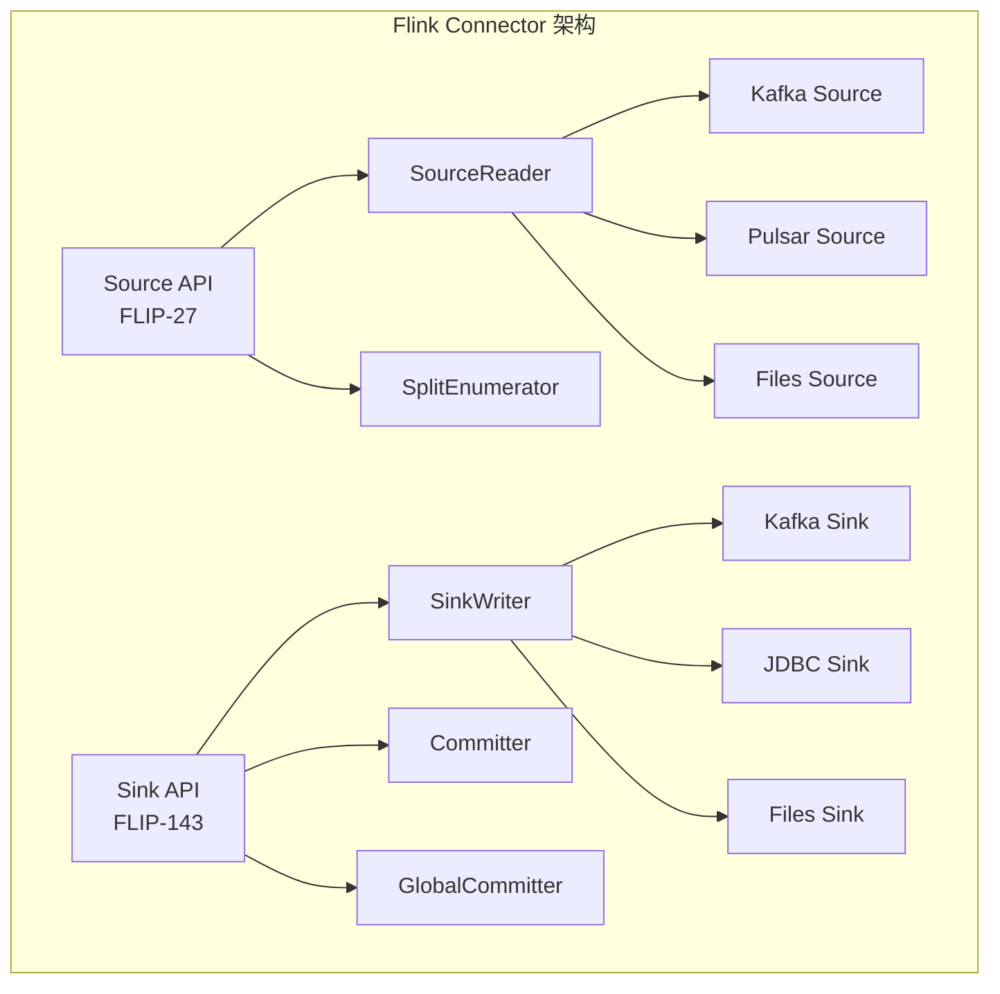
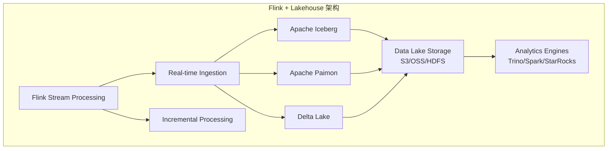
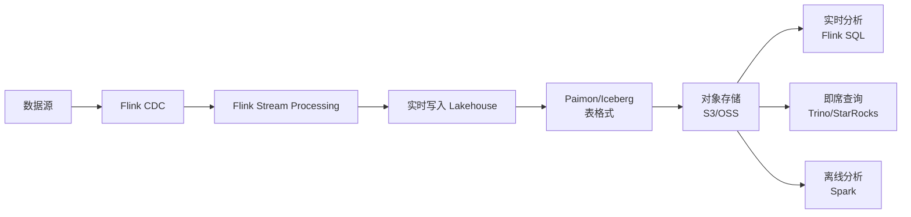
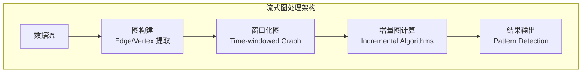
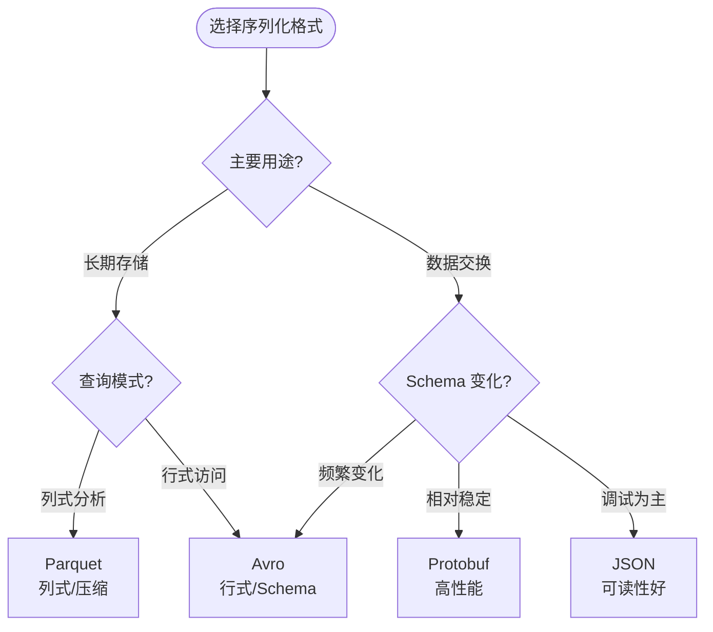
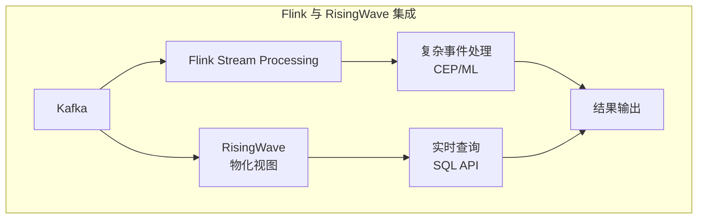
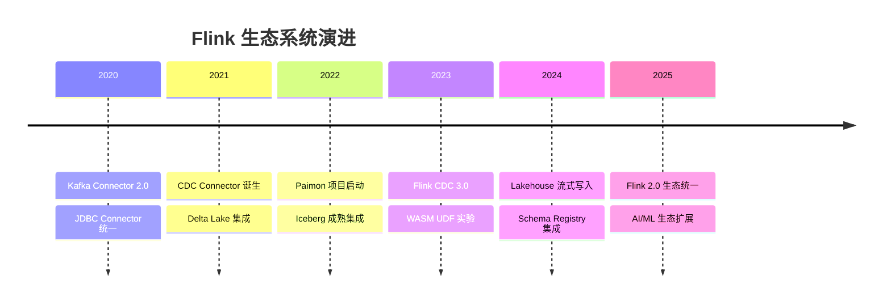
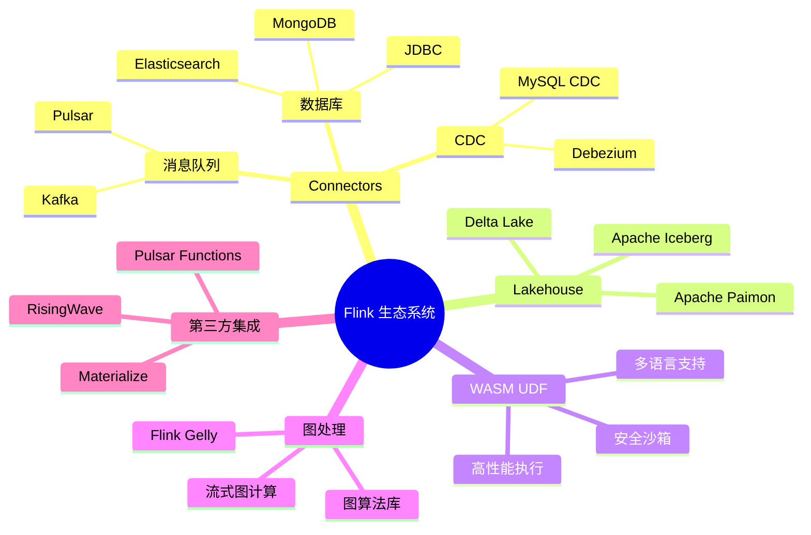

# Flink 生态系统概览

> **状态**: 前瞻 | **预计发布时间**: 2026-Q3 起 | **最后更新**: 2026-04-12
> 
> ⚠️ 本文档描述的特性处于早期讨论阶段，尚未正式发布。实现细节可能变更。

> 所属阶段: Flink | 前置依赖: [Flink API 层](../03-api/) | 形式化等级: L3

本文档是 Flink 生态系统层级的权威导航中心，全面覆盖 Flink 与外部系统的集成能力。从数据源/目的地的 Connectors、Lakehouse 存储集成、WASM UDF 扩展，到图计算和机器学习生态，本目录为构建端到端流处理解决方案提供完整的技术参考。

---

## 目录结构导航

```
05-ecosystem/
├── README.md                          # 本文件 - 生态概览
├── 05.01-connectors/                  # 连接器生态
│   ├── flink-connectors-ecosystem-complete-guide.md
│   ├── kafka-integration-patterns.md
│   ├── flink-cdc-3.0-data-integration.md
│   └── evolution/                     # Connector 演进
├── 05.02-lakehouse/                   # Lakehouse 集成
│   ├── streaming-lakehouse-architecture.md
│   ├── flink-iceberg-integration.md
│   ├── flink-paimon-integration.md
│   └── streaming-lakehouse-deep-dive-2026.md
├── 05.03-wasm-udf/                    # WASM UDF 扩展
│   ├── wasm-streaming.md
│   └── wasi-0.3-async-preview.md
├── 05.04-graph/                       # 图处理
│   ├── flink-gelly.md
│   └── flink-gelly-streaming-graph-processing.md
└── ecosystem/                         # 第三方系统集成
    ├── risingwave-integration-guide.md
    ├── pulsar-functions-integration.md
    └── materialize-comparison.md
```

---

## 1. 概念定义 (Definitions)

### Def-F-05-01: Flink 生态系统边界

Flink 生态系统定义了流处理引擎与**外部世界交互的完整接口集合**：

```
┌─────────────────────────────────────────────────────────────────┐
│                        Flink 生态边界                            │
├─────────────────────────────────────────────────────────────────┤
│                                                                 │
│    ┌─────────┐    ┌─────────┐    ┌─────────┐    ┌─────────┐    │
│    │Sources  │    │Sinks    │    │ Catalog │    │Formats  │    │
│    │(连接器) │    │(连接器) │    │(元数据) │    │(序列化) │    │
│    └────┬────┘    └────┬────┘    └────┬────┘    └────┬────┘    │
│         │              │              │              │         │
│    ┌────▼──────────────▼──────────────▼──────────────▼────┐    │
│    │                    Flink Core                        │    │
│    │            (Runtime, State, API)                     │    │
│    └────┬───────────────────────────────────────────┬────┘    │
│         │                                          │         │
│    ┌────▼────┐                              ┌──────▼────┐    │
│    │UDF/UDTF │                              │ML/AI 集成 │    │
│    │(WASM)   │                              │(FLIP-531) │    │
│    └─────────┘                              └───────────┘    │
│                                                                 │
└─────────────────────────────────────────────────────────────────┘
```

### Def-F-05-02: 生态系统分层

| 层级 | 组件类型 | 典型代表 |
|------|----------|----------|
| **数据接入层** | Source Connectors | Kafka、Pulsar、CDC、JDBC |
| **数据输出层** | Sink Connectors | Elasticsearch、JDBC、HBase |
| **存储集成层** | Lakehouse | Iceberg、Paimon、Delta Lake |
| **计算扩展层** | UDF/CEP/ML | WASM UDF、Flink ML、AI Agents |
| **生态对接层** | 第三方系统 | RisingWave、Materialize、Pulsar |

---

## 2. Connectors 生态系统

### 2.1 Connector 架构概览

Flink Connectors 是 Flink 与外部系统交互的桥梁，采用统一的 Source/Sink API 设计：



### 2.2 连接器分类导航

#### 2.2.1 消息队列连接器

| 连接器 | 版本支持 | 关键特性 | 文档 |
|--------|----------|----------|------|
| **Apache Kafka** | 官方维护 | Exactly-Once、动态发现、分区迁移 | [Kafka 集成模式](./05.01-connectors/kafka-integration-patterns.md) |
| **Apache Pulsar** | 官方维护 | 多租户、分层存储、Geo 复制 | [Pulsar 集成指南](./05.01-connectors/pulsar-integration-guide.md) |
| **Diskless Kafka** | 实验性 | 云原生无盘架构 | [Diskless Kafka 深度解析](./05.01-connectors/diskless-kafka-deep-dive.md) |

#### 2.2.2 数据库连接器

| 连接器 | 支持模式 | 关键特性 | 文档 |
|--------|----------|----------|------|
| **JDBC** | Source/Sink | 批量写入、连接池 | [JDBC 完整指南](./05.01-connectors/jdbc-connector-complete-guide.md) |
| **MongoDB** | Source/Sink | Change Stream、批量写入 | [MongoDB 指南](./05.01-connectors/mongodb-connector-complete-guide.md) |
| **Elasticsearch** | Sink | 批量索引、动态模板 | [ES 连接器指南](05.01-connectors/elasticsearch-connector-complete-guide.md) |

#### 2.2.3 CDC 连接器

**CDC (Change Data Capture)** 是实时数据集成的基础能力：

| 连接器 | 数据源 | 核心特性 |
|--------|--------|----------|
| Debezium | MySQL/PostgreSQL/MongoDB | 基于日志的 CDC |
| MySQL CDC | MySQL | 原生支持、Schema 变更 |
| Oracle CDC | Oracle | 支持多种捕获模式 |

**核心文档**:

- 📘 [Flink CDC 3.0 数据集成](./05.01-connectors/flink-cdc-3.0-data-integration.md)
- 📘 [Flink CDC 3.6.0 指南](./05.01-connectors/flink-cdc-3.6.0-guide.md)
- 🔗 [Debezium 集成](./05.01-connectors/04.04-cdc-debezium-integration.md)

### 2.3 Connector 演进历程

`05.01-connectors/evolution/` 目录记录了连接器技术的发展：

| 文档 | 主题 | 演进里程碑 |
|------|------|------------|
| [connector-framework.md](./05.01-connectors/evolution/connector-framework.md) | 连接器框架演进 | Source API v1→v2 |
| [kafka-connector.md](./05.01-connectors/evolution/kafka-connector.md) | Kafka 连接器演进 | Flink Kafka 0.9→3.0 |
| [cdc-connector.md](./05.01-connectors/evolution/cdc-connector.md) | CDC 连接器演进 | Debezium→Flink CDC |
| [lakehouse-connector.md](./05.01-connectors/evolution/lakehouse-connector.md) | Lakehouse 连接器演进 | 批处理→流式写入 |

---

## 3. Lakehouse 集成

### 3.1 Lakehouse 架构定位

Lakehouse 架构结合了数据湖的开放性和数据仓库的管理能力，Flink 作为流处理引擎提供实时写入能力：



### 3.2 Lakehouse 系统对比

| 特性 | Apache Iceberg | Apache Paimon | Delta Lake |
|------|----------------|---------------|------------|
| **定位** | 通用表格式 | 流式 Lakehouse | 开放表格式 |
| **流式写入** | ✅ | ✅ 原生优化 | ✅ |
| **增量读取** | ✅ | ✅ 原生支持 | ✅ |
| **时间旅行** | ✅ | ✅ | ✅ |
| **Flink 集成** | 官方 Connector | 原生支持 | 社区 Connector |
| **适用场景** | 通用分析 | 实时入湖 | Databricks 生态 |

### 3.3 Apache Iceberg 集成

**核心特性**:

- 隐藏分区（Hidden Partitioning）
- 分区演进（Partition Evolution）
- 时间旅行查询（Time Travel）
- 乐观并发控制（Optimistic Concurrency）

**核心文档**:

- 📘 [Flink Iceberg 集成指南](./05.02-lakehouse/flink-iceberg-integration.md)
- 🔗 [Flink Delta Lake 集成](./05.01-connectors/flink-delta-lake-integration.md)

### 3.4 Apache Paimon 集成

**核心特性**:

- 统一批流存储
- LSM 树结构优化
- 增量快照生成
- 实时分析能力

**核心文档**:

- 📘 [Flink Paimon 集成指南](./05.02-lakehouse/flink-paimon-integration.md)
- 📘 [Flink Paimon 连接器](./05.01-connectors/flink-paimon-integration.md)
- 📘 [流式 Lakehouse 深度解析 2026](./05.02-lakehouse/streaming-lakehouse-deep-dive-2026.md)

### 3.5 流式 Lakehouse 架构



---

## 4. WASM UDF 扩展

### 4.1 WASM 在 Flink 中的定位

WebAssembly (WASM) 为 Flink 提供了**语言无关的用户定义函数（UDF）执行环境**：

```
┌─────────────────────────────────────────────────────────────┐
│                    WASM UDF 架构                            │
├─────────────────────────────────────────────────────────────┤
│                                                             │
│   ┌──────────┐  ┌──────────┐  ┌──────────┐  ┌──────────┐   │
│   │Rust UDF  │  │C++ UDF   │  │Go UDF    │  │Python UDF│   │
│   └────┬─────┘  └────┬─────┘  └────┬─────┘  └────┬─────┘   │
│        │             │             │             │         │
│        └─────────────┴──────┬──────┴─────────────┘         │
│                             │                              │
│                      ┌──────▼──────┐                       │
│                      │ WASM Module │                       │
│                      └──────┬──────┘                       │
│                             │                              │
│                  ┌──────────▼──────────┐                   │
│                  │   WASI Runtime      │                   │
│                  │  (安全沙箱环境)      │                   │
│                  └──────────┬──────────┘                   │
│                             │                              │
│                  ┌──────────▼──────────┐                   │
│                  │   Flink Runtime     │                   │
│                  └─────────────────────┘                   │
│                                                             │
└─────────────────────────────────────────────────────────────┘
```

### 4.2 WASM UDF 优势

| 特性 | 说明 |
|------|------|
| **语言无关** | 支持 Rust、C/C++、Go、AssemblyScript 等 |
| **性能接近原生** | JIT 编译，接近 C++ UDF 性能 |
| **安全隔离** | WASI 沙箱保证运行时安全 |
| **可移植性** | 一次编译，多处运行 |
| **版本管理** | UDF 作为独立制品管理 |

### 4.3 核心文档

- 📘 [WASM 流处理](./05.03-wasm-udf/wasm-streaming.md)
- 🆕 [WASI 0.3 异步预览](./05.03-wasm-udf/wasi-0.3-async-preview.md)
- 🔗 [09-language-foundations WASM UDF 框架](../03-api/09-language-foundations/09-wasm-udf-frameworks.md)

---

## 5. 图处理生态

### 5.1 Flink Gelly 概述

Gelly 是 Apache Flink 的图处理 API，支持批处理和流式图计算：

| 特性 | 支持状态 |
|------|----------|
| 图构建 | ✅ 完整支持 |
| 图转换 | ✅ map、filter、join |
| 迭代算法 | ✅ 批处理迭代、增量迭代 |
| 图算法库 | ✅ PageRank、Community Detection、Triangles |

### 5.2 流式图处理

**应用场景**:

- 实时社交网络分析
- 金融欺诈检测
- 知识图谱实时更新
- 物联网拓扑分析

**核心文档**:

- 📘 [Flink Gelly 完全指南](./05.04-graph/flink-gelly.md)
- 📘 [Flink Gelly 流式图处理](./05.04-graph/flink-gelly-streaming-graph-processing.md)

### 5.3 图处理架构



---

## 6. 格式系统 (Formats)

### 6.1 序列化格式支持

Flink 支持多种数据序列化格式，用于不同场景的数据交换：

| 格式 | 类型 | 适用场景 |
|------|------|----------|
| **Avro** | Row | Schema 演进、跨语言 |
| **Parquet** | Bulk | 列式存储、分析优化 |
| **ORC** | Bulk | Hive 兼容、压缩高效 |
| **JSON** | Row | 调试友好、Web 集成 |
| **Protobuf** | Row | 高性能、微服务 |
| **Debezium JSON** | CDC | 变更数据捕获 |
| **Canal JSON** | CDC | MySQL 增量同步 |

### 6.2 格式选择决策



---

## 7. 第三方系统集成

### 7.1 流处理系统对比

`ecosystem/` 目录包含与其他流处理系统的对比和集成指南：

| 系统 | 定位 | 与 Flink 关系 | 文档 |
|------|------|---------------|------|
| **RisingWave** | 流处理数据库 | 互补/迁移 | [集成指南](./ecosystem/risingwave-integration-guide.md) |
| **Materialize** | SQL 流处理 | 竞品对比 | [对比分析](./ecosystem/materialize-comparison.md) |
| **Pulsar Functions** | 轻量流计算 | 集成方案 | [集成指南](./ecosystem/pulsar-functions-integration.md) |

### 7.2 集成架构模式



---

## 8. 快速导航与选型

### 8.1 场景化导航

| 应用场景 | 推荐生态组件 | 关键文档 |
|----------|--------------|----------|
| **实时数仓** | Kafka → Flink → Paimon/Iceberg | [Lakehouse 集成](./05.02-lakehouse/) |
| **CDC 数据同步** | Flink CDC → Kafka/Sink | [CDC 3.0 指南](./05.01-connectors/flink-cdc-3.0-data-integration.md) |
| **全文检索** | Flink → Elasticsearch | [ES 连接器](05.01-connectors/elasticsearch-connector-complete-guide.md) |
| **多语言 UDF** | WASM UDF | [WASM 流处理](./05.03-wasm-udf/wasm-streaming.md) |
| **实时图分析** | Flink Gelly | [Gelly 指南](./05.04-graph/flink-gelly.md) |
| **特征工程** | PyFlink → Feature Store | [AI/ML 生态](../06-ai-ml/) |

### 8.2 子目录核心内容速览

| 子目录 | 文档数量 | 核心主题 | 价值定位 |
|--------|----------|----------|----------|
| **05.01-connectors** | 20+ | Kafka、CDC、JDBC、NoSQL | 数据集成核心能力 |
| **05.02-lakehouse** | 6+ | Iceberg、Paimon、Delta | 现代数据架构基础 |
| **05.03-wasm-udf** | 2+ | WebAssembly UDF | 多语言扩展能力 |
| **05.04-graph** | 2+ | Gelly 图计算 | 关联分析场景 |
| **ecosystem** | 3+ | 第三方系统集成 | 生态互操作性 |

---

## 9. 生态系统演进趋势

### 9.1 技术演进方向



### 9.2 未来发展方向

1. **统一连接器框架**: FLIP-27 Source API 和 FLIP-143 Sink API 的全面落地
2. **Lakehouse 原生支持**: Paimon 成为 Flink 流式存储的首选
3. **AI/ML 生态扩展**: 与 Vector DB、LLM 服务的深度集成（参见 [06-ai-ml](../06-ai-ml/)）
4. **Serverless 连接器**: 云原生无服务器部署模式支持

---

## 10. 可视化总结



---

## 11. 相关资源

### 11.1 官方资源

- 🔗 [Flink Connectors 文档](https://nightlies.apache.org/flink/flink-docs-stable/docs/connectors/datastream/overview/)
- 🔗 [Flink CDC 文档](https://nightlies.apache.org/flink/flink-cdc-docs-stable/)
- 🔗 [Apache Iceberg](https://iceberg.apache.org/)
- 🔗 [Apache Paimon](https://paimon.apache.org/)

### 11.2 社区生态

- 🔗 [Flink Connector 仓库](https://github.com/apache/flink-connector-)
- 🔗 [Flink CDC 仓库](https://github.com/apache/flink-cdc)
- 🔗 [Ververica Platform 生态](https://www.ververica.com/)

---

## 引用参考
