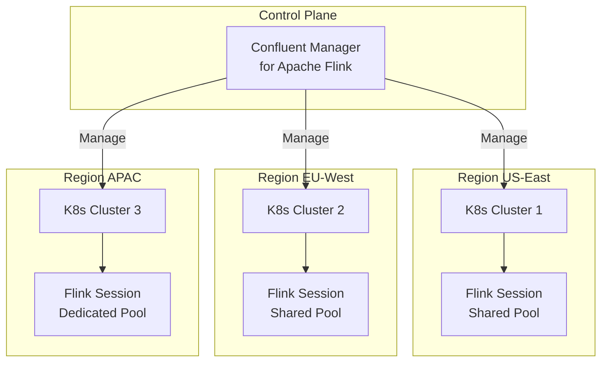

# Confluent Manager for Apache Flink 2.3.0：商业版特性跟踪

> 所属阶段: Flink/05-ecosystem | 前置依赖: [Flink Kubernetes Operator](../04-runtime/04.01-deployment/flink-kubernetes-operator-deep-dive.md), [Flink SQL GA](../03-api/03.02-table-sql-api/flink-table-sql-complete-guide.md) | 形式化等级: L3
> **版本**: CMF 2.3.0 | **状态**: ✅ 已发布 (2026-04) | **最后更新**: 2026-04-21

---

## 1. 概念定义 (Definitions)

### Def-F-05-100: Confluent Manager for Apache Flink (CMF)

**定义**: CMF 是 Confluent 基于 Apache Flink 构建的企业级流处理管理平台，提供多云、多集群的 Flink 生命周期管理能力：

$$
\mathcal{C}_{cmf} = \langle \mathcal{M}, \mathcal{P}, \mathcal{S}, \mathcal{O}, \mathcal{G} \rangle
$$

其中：

| 组件 | 符号 | 定义 | 描述 |
|------|------|------|------|
| 多集群管理 | $\mathcal{M}$ | $\mathcal{K}_1 \times \mathcal{K}_2 \times ... \rightarrow \text{Unified}$ | 跨 K8s 集群统一管理 |
| 计算池 | $\mathcal{P}$ | $\{shared, dedicated\}$ | 共享/专用计算资源池 |
| SQL 网关 | $\mathcal{S}$ | SQL $\rightarrow$ Flink Job | Flink SQL GA 服务 |
| 操作接口 | $\mathcal{O}$ | REST + UI + CLI | 多模式运维接口 |
| 治理层 | $\mathcal{G}$ | RBAC + Audit + Quota | 企业治理与安全 |

---

### Def-F-05-101: Shared Compute Pool (Session Cluster)

**定义**: CMF 2.3.0 引入的共享计算池类型，在单一 Flink Session 集群上运行多个 SQL 语句：

$$
\mathcal{P}_{shared} = \langle \mathcal{C}, \mathcal{J}, \mathcal{R}, \delta_{start} \rangle
$$

其中：

- $\mathcal{C}$: 共享的 Flink 集群资源
- $\mathcal{J}$: 并发的 SQL 语句集合
- $\mathcal{R}$: 资源隔离策略（slot sharing group）
- $\delta_{start}$: 语句启动延迟（共享池显著低于专用池）

**核心优势**：

- **启动延迟**: Shared pool 语句启动时间 << Dedicated pool（资源已预热）
- **资源利用率**: 多个低吞吐查询共享集群，避免资源碎片化
- **交互体验**: 适合 ad-hoc 查询和开发调试场景

---

### Def-F-05-102: Red Hat Certified Operator

**定义**: CMF 2.3.0 通过 Red Hat OpenShift OperatorHub 认证，成为企业级 K8s 平台的官方支持组件：

$$
\text{Certified}_{RH} = \langle \text{CMF}, \text{OpenShift}, \text{Support}_{L1} \rangle
$$

**认证意义**：

- 与 OpenShift 生命周期管理深度集成
- Red Hat 官方技术支持通道
- 企业安全合规（FIPS、SELinux、seccomp）

---

## 2. 属性推导 (Properties)

### Lemma-F-05-100: 共享计算池的启动延迟优势

**陈述**: 共享计算池的 SQL 语句启动延迟低于专用计算池：

$$
\delta_{start}^{shared} \ll \delta_{start}^{dedicated}
$$

**原因**：

- 共享池的 TaskManager 已运行，无需等待资源调度
- 专用池需经历：申请资源 → 启动 JobManager → 启动 TaskManager → 提交作业

**定量数据**（基于 Confluent 官方数据）：

- Shared pool: ~1-3 秒启动
- Dedicated pool: ~15-60 秒启动

---

### Lemma-F-05-101: 多集群管理的成本优化

**陈述**: CMF 多集群管理可降低跨地域部署的运维成本：

$$
C_{ops}^{multi} < \sum_{i=1}^{n} C_{ops}^{single}(\mathcal{K}_i)
$$

**原因**：统一控制平面减少重复运维工作。

---

## 3. 关系建立 (Relations)

### 3.1 CMF 2.3.0 vs 开源 Flink 对比

| 维度 | CMF 2.3.0 (商业版) | 开源 Apache Flink 2.2 |
|------|-------------------|----------------------|
| 多集群管理 | ✅ 原生支持 | ❌ 需自建 |
| Shared Compute Pool | ✅ 内置 | ❌ 需手动配置 Session |
| SQL DDL (CREATE/DROP TABLE) | ✅ 自动 provision Kafka topic | ❌ 纯元数据操作 |
| Red Hat 认证 | ✅ OperatorHub | ❌ 社区维护 |
| 企业支持 | ✅ Confluent L1/L2 | ❌ 社区支持 |
| 成本 | 按消耗付费 | 基础设施成本 |

### 3.2 CMF 与 Flink 社区版本的关系

```
┌─────────────────────────────────────────────────────────────┐
│                   Confluent Flink 生态                        │
├─────────────────────────────────────────────────────────────┤
│                                                             │
│  CMF 2.3.0 (商业增强层)                                       │
│  ├─ Multi-Kubernetes Cluster Management                     │
│  ├─ Shared Compute Pools (Session)                          │
│  ├─ SQL DDL → Kafka Topic Auto-provision                    │
│  ├─ Red Hat Certified Operator                              │
│  ├─ Server-side API Filtering / Search                      │
│  └─ Enterprise RBAC / Audit                                 │
│                                                             │
│  Apache Flink 2.2/2.3 (开源核心层)                            │
│  ├─ DataStream / Table API / SQL                            │
│  ├─ Checkpoint / State Management                           │
│  ├─ Connector Ecosystem                                     │
│  └─ 社区 FLIP 演进                                          │
│                                                             │
│  Confluent Platform (基础设施层)                              │
│  ├─ Kafka / Schema Registry                                 │
│  ├─ Connect / ksqlDB                                        │
│  └─ Control Center                                          │
│                                                             │
└─────────────────────────────────────────────────────────────┘
```

---

## 4. 论证过程 (Argumentation)

### 4.1 为什么选择 CMF 而非自建 Flink？

**适合 CMF 的场景**：

- 已有 Confluent Platform / Kafka 基础设施
- 需要多云/多地域统一管理
- 团队缺乏 Flink 运维经验
- 需要企业级支持（SLA、安全合规）

**适合自建 Flink 的场景**：

- 深度定制需求（自定义算子、调度策略）
- 成本敏感（云厂商竞价实例、混合云）
- 已有成熟的 K8s 运维团队
- 开源优先政策

### 4.2 Flink SQL GA 的战略意义

CMF 2.3.0 将 Flink SQL 标记为 GA，意味着：

- SQL 语法和功能稳定，生产环境可放心使用
- Shared compute pools 使 SQL 查询启动时间接近交互式
- `CREATE TABLE` 自动 provision Kafka topic 降低使用门槛

---

## 5. 形式证明 / 工程论证

### Thm-F-05-100: 共享计算池的资源效率定理

**定理**: 在 $n$ 个低吞吐 SQL 查询场景下，共享计算池的总资源消耗低于 $n$ 个专用计算池：

$$
R_{shared}(n) < \sum_{i=1}^{n} R_{dedicated}(i)
$$

**证明概要**：

1. 每个专用池需要独立的 JobManager（~2GB 内存开销）
2. 共享池的 JobManager 被 $n$ 个查询复用
3. TaskManager slot 在共享池中按需分配，利用率更高
4. 低吞吐查询无法占满专用池资源，造成浪费

$$
\therefore R_{shared}(n) = R_{JM} + \sum_{i=1}^{n} R_{slot}(i) < n \cdot R_{JM} + \sum_{i=1}^{n} R_{TM}(i)
$$

---

## 6. 实例验证 (Examples)

### 6.1 CMF 创建 Shared Compute Pool

```yaml
apiVersion: flink.confluent.io/v1
kind: ComputePool
metadata:
  name: shared-sql-pool
spec:
  type: SHARED
  flinkVersion: "2.2"
  regions:
    - us-east-1
    - eu-west-1
  resources:
    taskManagers:
      replicas: 4
      resources:
        memory: "4Gi"
        cpu: 2
```

### 6.2 SQL DDL 自动 provision Kafka topic

```sql
-- CMF 自动创建 Kafka topic 和 Schema Registry subject
CREATE TABLE user_events (
    user_id STRING,
    event_type STRING,
    event_time TIMESTAMP_LTZ
) WITH (
    'connector' = 'kafka',
    'topic' = 'user-events',
    'auto.create' = 'true'  -- CMF 自动 provision
);

-- 多语句执行
EXECUTE STATEMENT SET
BEGIN
  INSERT INTO sink1 SELECT * FROM source WHERE condition1;
  INSERT INTO sink2 SELECT * FROM source WHERE condition2;
END;
```

---

## 7. 可视化 (Visualizations)

### 7.1 CMF 多集群架构



---

## 8. 引用参考 (References)
