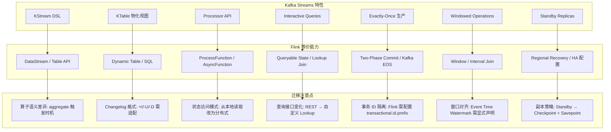
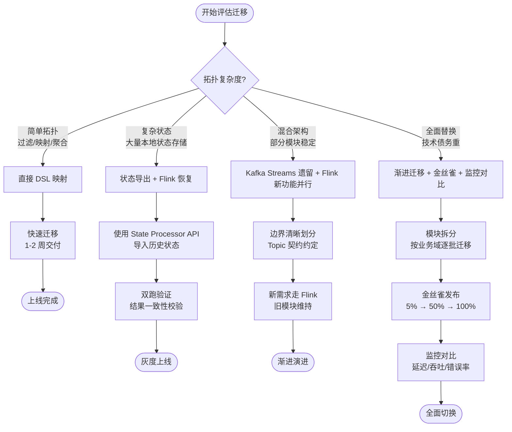

> **状态**: 📦 已归档 | **归档日期**: 2026-04-20
>
> 本文档内容已整合至主文档，此处保留为重定向入口。
> **主文档**: [Knowledge\05-mapping-guides\migration-guides\05.2-kafka-streams-to-flink-migration.md](../../../Knowledge/05-mapping-guides/migration-guides/05.2-kafka-streams-to-flink-migration.md)
> **归档位置**: [../../../archive/content-deduplication/2026-04/Flink/05-ecosystem/ecosystem/kafka-streams-migration.md](../../../archive/content-deduplication/2026-04/Flink/05-ecosystem/ecosystem/kafka-streams-migration.md)

---

## 思维表征补充

以下思维表征为迁移实践提供可视化导航。

### 思维导图：Kafka Streams 迁移到 Flink

迁移全景以 Kafka Streams 迁移到 Flink 为核心，从五大维度放射展开。

```mermaid
mindmap
  root((Kafka Streams<br/>迁移到 Flink))
    动机分析
      更丰富的算子
        KeyBy / Window / ProcessFunction
        SQL / Table API 声明式表达
      更好的状态管理
        Queryable State
        Incremental Checkpoint
        State TTL 细粒度控制
      更强的容错
        Exactly-Once 端到端
        自动 Barrier 对齐
        快速 Failover
      SQL支持
        Flink SQL 统一批流
        Hive / JDBC Catalog 集成
    概念映射
      KStream → DataStream
        无界流抽象等价
        Event Time / Processing Time 语义增强
      KTable → Table
        Changelog Stream 转 Dynamic Table
        Retraction 语义支持
      Topology → JobGraph
        Processor API → Transformation
        物理执行计划透明化
    状态迁移
      RocksDB状态
        复用 RocksDBStateBackend
        SST 文件格式兼容性评估
      Checkpoint格式
        Kafka Streams State Dir ≠ Flink Checkpoint
        自定义 State Processor API 导入
      状态大小评估
        全量 Checkpoint 耗时测算
        增量快照与历史状态清理
    代码迁移
      DSL转换
        stream() → env.fromSource()
        groupByKey() → keyBy()
        aggregate() → window().aggregate()
      ProcessFunction
        Processor → KeyedProcessFunction
        Punctuator → TimerService
      窗口语义
        Tumbling / Sliding / Session 窗口重映射
        Allowed Lateness 与 Watermark 对齐
      Join策略
        Stream-Stream Join → Interval Join / Window Join
        Stream-Table Join → Temporal Join
    验证上线
      并行运行
        双写 Kafka Topic
        影子流量旁路对比
      结果对比
        输出一致性校验
        延迟 / 吞吐指标对齐
      性能基准
        Nexmark / 自定义压测
        Backpressure 与 Checkpoint 调优
      灰度切换
        金丝雀发布
        流量权重渐进切流
```

### 多维关联树：特性映射与迁移注意点

展示 Kafka Streams 特性、Flink 等价能力与迁移注意点之间的映射关系。



### 决策树：迁移策略选择

根据现有 Kafka Streams 应用复杂度选择适配的迁移路径。



## 引用参考
