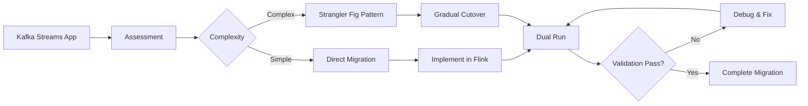
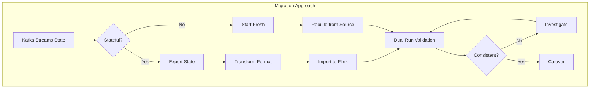
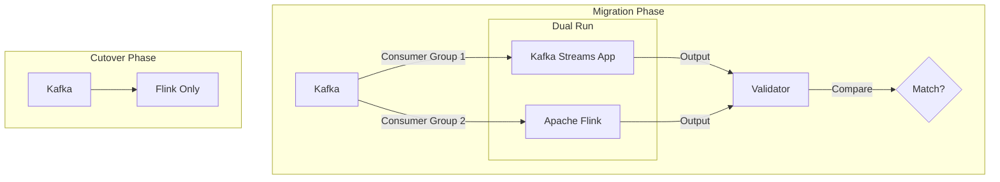

# Kafka Streams to Flink Migration Guide

> **Project**: P3-11 | **Type**: Migration Guide | **Version**: v1.0 | **Date**: 2026-04-04
>
> **Source**: Kafka Streams | **Target**: Apache Flink 1.17+

This guide provides a comprehensive roadmap for migrating applications from Kafka Streams to Apache Flink.

---

## 1. Migration Overview

### 1.1 Why Migrate?

| Factor | Kafka Streams | Apache Flink | Migration Benefit |
|--------|---------------|--------------|-------------------|
| **Scale** | Single Kafka cluster | Distributed, cluster-wide | Handle larger workloads |
| **State** | Local state stores | Distributed state backends | Better fault tolerance |
| **SQL** | Not supported | Native Table API/SQL | Lower development barrier |
| **ML** | Limited | FlinkML integration | ML pipelines |
| **Connectors** | Kafka-only | 30+ connectors | Data source flexibility |
| **Latency** | Milliseconds | Sub-second to minutes | Flexible time semantics |

### 1.2 Migration Strategy



---

## 2. Concept Mapping

### 2.1 Core Concepts

| Kafka Streams | Flink Equivalent | Notes |
|---------------|------------------|-------|
| **KStream** | DataStream / Table | Unbounded stream |
| **KTable** | Table (Dynamic) | Changelog stream |
| **GlobalKTable** | Broadcast State | Distributed lookup |
| **Topology** | JobGraph / Pipeline | Processing graph |
| **Processor API** | ProcessFunction | Low-level control |
| **DSL** | Table API / SQL | High-level API |
| **State Store** | KeyedStateBackend | Managed state |
| **Punctuation** | TimerService | Time-based triggers |

### 2.2 Code Pattern Mapping

#### Stream Creation

**Kafka Streams**:

```java
StreamsBuilder builder = new StreamsBuilder();
KStream<String, String> stream = builder.stream("input-topic");
```

**Flink DataStream**:

```java

import org.apache.flink.streaming.api.environment.StreamExecutionEnvironment;
import org.apache.flink.streaming.api.datastream.DataStream;

StreamExecutionEnvironment env =
    StreamExecutionEnvironment.getExecutionEnvironment();

KafkaSource<String> source = KafkaSource.<String>builder()
    .setBootstrapServers("kafka:9092")
    .setTopics("input-topic")
    .setGroupId("flink-group")
    .setStartingOffsets(OffsetsInitializer.earliest())
    .setValueOnlyDeserializer(new SimpleStringSchema())
    .build();

DataStream<String> stream = env.fromSource(
    source,
    WatermarkStrategy.noWatermarks(),
    "Kafka Source"
);
```

**Flink Table API**:

```java

import org.apache.flink.table.api.TableEnvironment;

StreamTableEnvironment tableEnv = StreamTableEnvironment.create(env);

tableEnv.executeSql("""
    CREATE TABLE input_table (
        key STRING,
        value STRING,
        event_time TIMESTAMP(3),
        WATERMARK FOR event_time AS event_time - INTERVAL '5' SECOND
    ) WITH (
        'connector' = 'kafka',
        'topic' = 'input-topic',
        'properties.bootstrap.servers' = 'kafka:9092',
        'format' = 'json'
    )
""");
```

#### Transformations

**Kafka Streams**:

```java
KStream<String, Integer> transformed = stream
    .filter((key, value) -> value != null)
    .mapValues(value -> value.length())
    .selectKey((key, value) -> key.toLowerCase())
    .filter((key, value) -> value > 10);
```

**Flink DataStream**:

```java

import org.apache.flink.streaming.api.datastream.DataStream;

DataStream<Tuple2<String, Integer>> transformed = stream
    .filter(value -> value != null)
    .map(value -> Tuple2.of(value.f0, value.f1.length()))
    .map(tuple -> Tuple2.of(tuple.f0.toLowerCase(), tuple.f1))
    .filter(tuple -> tuple.f1 > 10);
```

**Flink Table API**:

```java
Table transformed = tableEnv.from("input_table")
    .where($("value").isNotNull())
    .select(
        lower($("key")).as("key"),
        charLength($("value")).as("length")
    )
    .where($("length").greaterThan(10));
```

### 2.3 Stateful Operations

#### Aggregation

**Kafka Streams**:

```java
KTable<String, Long> counts = stream
    .groupByKey()
    .count(Materialized.as("counts-store"));
```

**Flink DataStream**:

```java

import org.apache.flink.streaming.api.datastream.DataStream;
import org.apache.flink.api.common.state.ValueState;
import org.apache.flink.api.common.state.ValueStateDescriptor;
import org.apache.flink.api.common.typeinfo.Types;

DataStream<Tuple2<String, Long>> counts = stream
    .keyBy(value -> value.f0)
    .countWindow(1000)
    .aggregate(new CountAggregate());

// Or with state
DataStream<Tuple2<String, Long>> keyedCounts = stream
    .keyBy(value -> value.f0)
    .process(new KeyedProcessFunction<String, String, Tuple2<String, Long>>() {
        private ValueState<Long> countState;

        @Override
        public void open(Configuration parameters) {
            countState = getRuntimeContext().getState(
                new ValueStateDescriptor<>("count", Types.LONG)
            );
        }

        @Override
        public void processElement(String value, Context ctx,
                Collector<Tuple2<String, Long>> out) throws Exception {
            Long current = countState.value();
            if (current == null) current = 0L;
            current++;
            countState.update(current);
            out.collect(Tuple2.of(ctx.getCurrentKey(), current));
        }
    });
```

#### Join

**Kafka Streams**:

```java
KStream<String, String> joined = stream1.join(
    stream2,
    (v1, v2) -> v1 + "-" + v2,
    JoinWindows.of(Duration.ofMinutes(5)),
    StreamJoined.with(Serdes.String(), Serdes.String(), Serdes.String())
);
```

**Flink DataStream**:

```java

import org.apache.flink.streaming.api.datastream.DataStream;
import org.apache.flink.streaming.api.windowing.time.Time;

DataStream<String> joined = stream1
    .join(stream2)
    .where(value -> value.f0)
    .equalTo(value -> value.f0)
    .window(TumblingEventTimeWindows.of(Time.minutes(5)))
    .apply((v1, v2) -> v1.f1 + "-" + v2.f1);
```

**Flink Table API**:

```java
Table joined = table1
    .join(table2)
    .where($("key").isEqual($("key")))
    .select($("key"), $("value1").concat("-").concat($("value2")));
```

---

## 3. State Migration

### 3.1 State Store Migration

| Kafka Streams | Flink Equivalent |
|---------------|------------------|
| `KeyValueStore` | `ValueState` |
| `WindowStore` | `WindowState` / `ListState` |
| `SessionStore` | Custom `MapState` |

### 3.2 State Migration Strategy



### 3.3 State Schema Transformation

**Kafka Streams State**:

```java
// KeyValueStore<String, UserStats>
public class UserStats {
    private long count;
    private double average;
    private long lastTimestamp;
}
```

**Flink State**:

```java
import org.apache.flink.api.common.state.ValueStateDescriptor;

public class UserStatsState {
    public long count = 0;
    public double sum = 0.0;
    public long lastTimestamp = 0L;

    // State descriptor
    public static final ValueStateDescriptor<UserStatsState> DESCRIPTOR =
        new ValueStateDescriptor<>("user-stats", UserStatsState.class);
}
```

---

## 4. Configuration Migration

### 4.1 Application Configuration

| Kafka Streams Config | Flink Config | Notes |
|---------------------|--------------|-------|
| `application.id` | `pipeline.name` | Job identifier |
| `bootstrap.servers` | `kafka.bootstrap.servers` | Kafka connection |
| `default.key.serde` | `format` | Serialization |
| `commit.interval.ms` | `checkpointing.interval` | State persistence |
| `processing.guarantee` | `execution.checkpointing.mode` | Exactly-once |

### 4.2 Parallelism Configuration

**Kafka Streams**:

```java
properties.put(StreamsConfig.NUM_STREAM_THREADS_CONFIG, 4);
```

**Flink**:

```java
env.setParallelism(4);

// Or per-operator
stream.map(...).setParallelism(2);
```

### 4.3 Fault Tolerance

**Kafka Streams**:

```java
properties.put(StreamsConfig.PROCESSING_GUARANTEE_CONFIG,
    StreamsConfig.EXACTLY_ONCE_V2);
properties.put(StreamsConfig.COMMIT_INTERVAL_MS_CONFIG, 100);
```

**Flink**:

```java

import org.apache.flink.streaming.api.CheckpointingMode;

env.enableCheckpointing(100);  // 100ms
env.getCheckpointConfig().setCheckpointingMode(
    CheckpointingMode.EXACTLY_ONCE);
env.getCheckpointConfig().setMinPauseBetweenCheckpoints(500);
env.getCheckpointConfig().setCheckpointTimeout(60000);
env.getCheckpointConfig().setMaxConcurrentCheckpoints(1);
env.getCheckpointConfig().enableExternalizedCheckpoints(
    ExternalizedCheckpointCleanup.RETAIN_ON_CANCELLATION);
```

---

## 5. Testing Migration

### 5.1 Unit Testing

**Kafka Streams Test**:

```java
@Test
public void testTopology() {
    TopologyTestDriver testDriver = new TopologyTestDriver(topology, props);

    TestInputTopic<String, String> inputTopic = testDriver
        .createInputTopic("input", Serdes.String().serializer(), ...);

    TestOutputTopic<String, Long> outputTopic = testDriver
        .createOutputTopic("output", Serdes.String().deserializer(), ...);

    inputTopic.pipeInput("key", "value");
    assertEquals(1L, outputTopic.readValue());
}
```

**Flink Test**:

```java

import org.apache.flink.streaming.api.environment.StreamExecutionEnvironment;
import org.apache.flink.streaming.api.datastream.DataStream;
import org.apache.flink.api.common.typeinfo.Types;

@Test
public void testPipeline() throws Exception {
    StreamExecutionEnvironment env =
        StreamExecutionEnvironment.getExecutionEnvironment();
    env.setParallelism(1);

    DataStream<String> input = env.fromElements("a", "b", "c");
    DataStream<Long> result = input
        .map(String::length)
        .returns(Types.LONG);

    // Collect results
    List<Long> results = result.executeAndCollect(100);
    assertEquals(Arrays.asList(1L, 1L, 1L), results);
}
```

### 5.2 Integration Testing

**Dual Run Validation**:

```java
@Test
public void testMigrationParity() {
    // Run both implementations
    List<Output> kafkaStreamsResults = runKafkaStreams(input);
    List<Output> flinkResults = runFlink(input);

    // Compare outputs (allowing for ordering differences)
    assertEquals(
        kafkaStreamsResults.stream().sorted().collect(Collectors.toList()),
        flinkResults.stream().sorted().collect(Collectors.toList())
    );
}
```

---

## 6. Production Deployment

### 6.1 Deployment Architecture



### 6.2 Monitoring During Migration

| Metric | Kafka Streams | Flink | Comparison |
|--------|---------------|-------|------------|
| **Latency** | Record end-to-end | Checkpoint alignment | Should match |
| **Throughput** | Records/second | Records/second | Should improve |
| **State Size** | Local disk | Distributed | Monitor growth |
| **Error Rate** | Failed records | Failed checkpoints | Should decrease |

### 6.3 Rollback Plan

```yaml
# Rollback triggers
triggers:
  - error_rate > 1%
  - latency_p99 > threshold * 2
  - data_mismatch_detected: true
  - manual_override: true

# Rollback procedure
rollback_steps:
  1: Stop Flink job with savepoint
  2: Verify Kafka Streams consumer group is ready
  3: Resume Kafka Streams application
  4: Verify data consistency
  5: Investigate Flink issues
```

---

## 7. Common Pitfalls

| Issue | Cause | Solution |
|-------|-------|----------|
| **Different Results** | Watermark handling | Align time semantics |
| **Higher Latency** | Checkpoint overhead | Tune checkpoint interval |
| **State Explosion** | Unbounded state | Add state TTL |
| **Serialization Errors** | Schema mismatch | Use schema registry |
| **Reprocessing** | Offset management | Commit offsets properly |

---

## 8. References

- [Kafka Streams Documentation](https://kafka.apache.org/documentation/streams/)
- [Flink DataStream API](https://nightlies.apache.org/flink/flink-docs-stable/docs/dev/datastream/overview/)
- [Flink Table API](https://nightlies.apache.org/flink/flink-docs-stable/docs/dev/table/overview/)
- [Flink Kafka Connector](https://nightlies.apache.org/flink/flink-docs-stable/docs/connectors/datastream/kafka/)

---

**Document Version History**:

| Version | Date | Changes |
|---------|------|---------|
| v1.0 | 2026-04-04 | Initial version |
