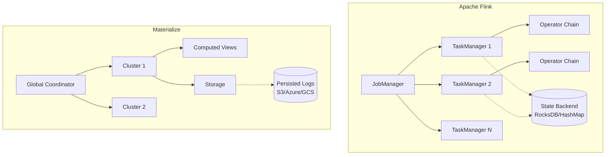
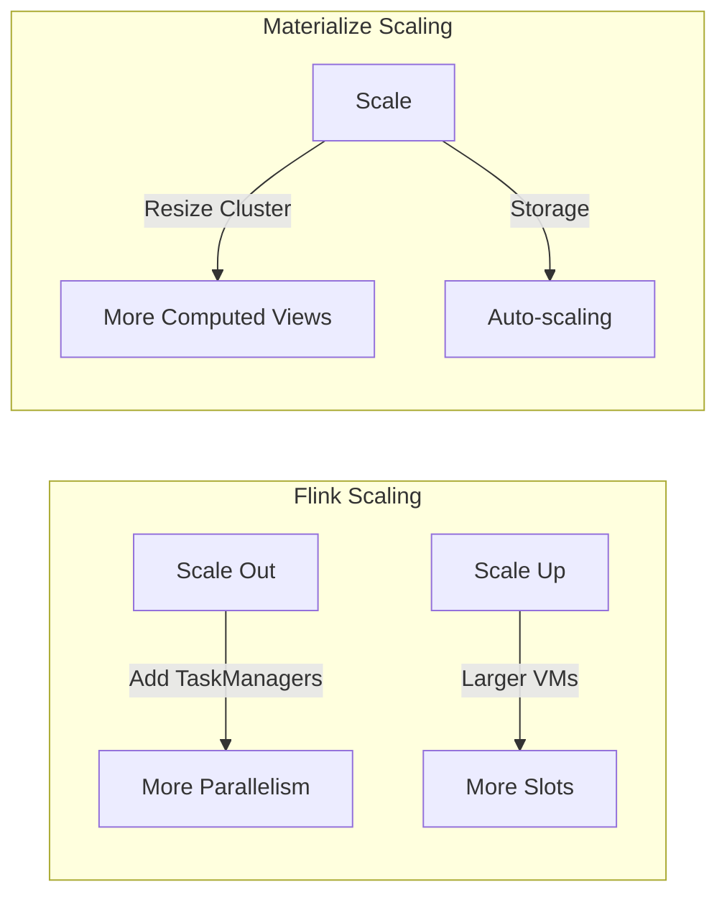
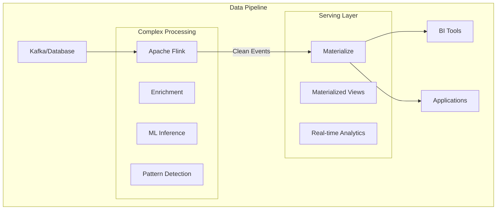
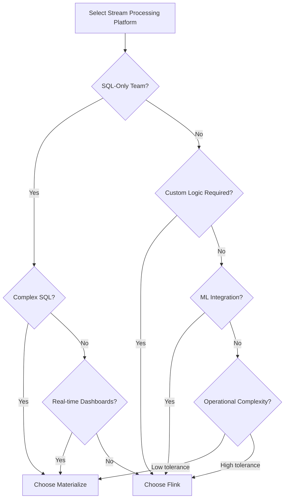
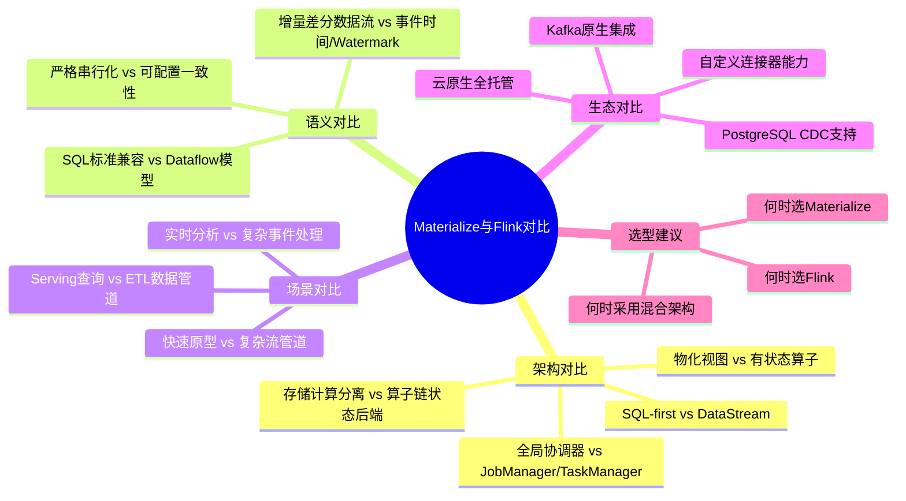
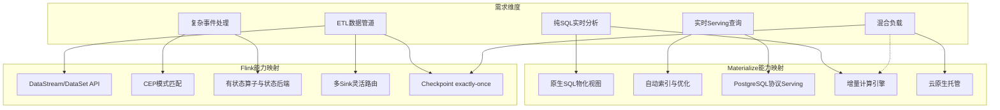
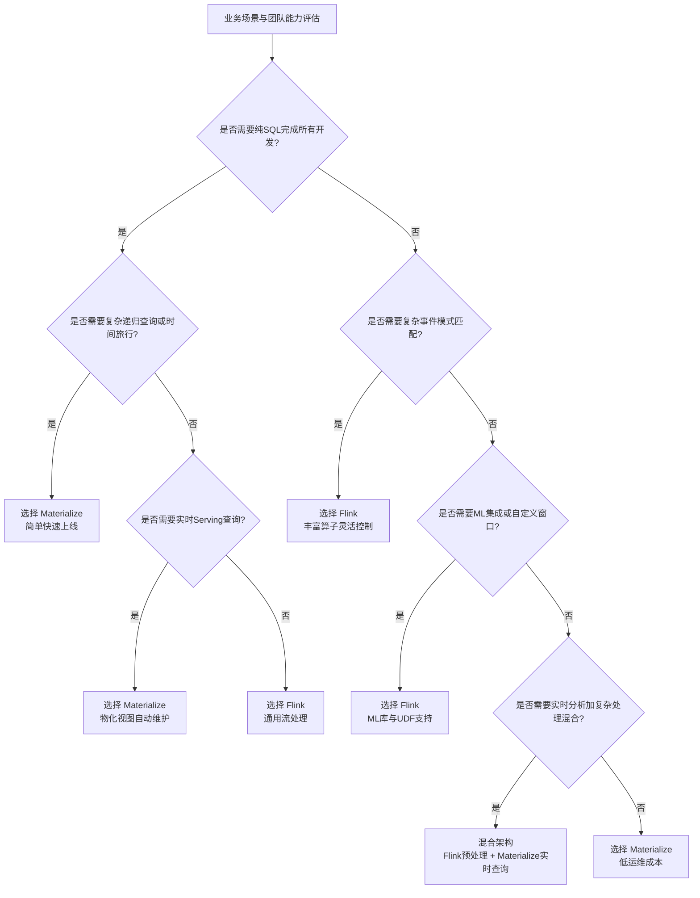

# Flink vs Materialize: Comprehensive Comparison

> 所属阶段: Flink | 前置依赖: [相关文档] | 形式化等级: L3

> **Project**: P3-10 | **Type**: Comparative Analysis | **Version**: v1.0 | **Date**: 2026-04-04
>
> **Scope**: Architecture, Performance, Cost, Use Cases

This document provides a detailed comparison between Apache Flink and Materialize for stream processing workloads.

---

## 1. Executive Summary

| Dimension | Apache Flink | Materialize |
|-----------|--------------|-------------|
| **Paradigm** | Stream Processing Framework | Streaming SQL Database |
| **Primary Use Case** | Complex event processing, ETL | Real-time analytics, materialized views |
| **SQL Support** | Via Table API/SQL | Native, first-class |
| **Deployment** | Self-managed, managed services | Cloud-native, fully managed |
| **Pricing Model** | Open source / Usage-based cloud | Usage-based (compute + storage) |

---

## 2. Architecture Comparison

### 2.1 System Architecture



### 2.2 Data Flow Model

| Aspect | Flink | Materialize |
|--------|-------|-------------|
| **Processing Model** | Event-at-a-time, micro-batching | Differential dataflow |
| **State Management** | Explicit, user-managed | Implicit, automatic |
| **Consistency** | Configurable (exactly-once default) | Strict serializability |
| **Fault Tolerance** | Checkpoint-based | Active replication |

### 2.3 Differential Dataflow vs Flink's Model

**Materialize Differential Dataflow**:

```
Input: Stream of (data, time, diff) triples
  - data: The record
  - time: Logical timestamp
  - diff: +1 (insert) or -1 (delete)

Computation: Incremental view maintenance
  - Recursive queries supported
  - Multi-timestamp tracking
```

**Flink's DataStream Model**:

```
Input: Stream of events
  - Event time processing
  - Watermark-based progress
  - Stateful operators

Computation: Operator chains
  - User-defined functions
  - Flexible windowing
```

---

## 3. Feature Comparison

### 3.1 SQL Capabilities

| Feature | Flink SQL | Materialize SQL |
|---------|-----------|-----------------|
| **Joins** | Stream-stream, stream-table, lookup | All supported, automatic indexing |
| **Windows** | Tumbling, sliding, session, custom | Tumbling, sliding |
| **Aggregations** | Rich support, custom UDAFs | Full support, incremental |
| **Subqueries** | Limited correlation support | Full support |
| **Recursion** | Not supported | Supported (recursive CTEs) |
| **Time Travel** | Not supported | Supported (historical queries) |

### 3.2 Programming Model

**Flink**:

```java

// [伪代码片段 - 不可直接运行] 仅展示核心逻辑
import org.apache.flink.streaming.api.datastream.DataStream;
import org.apache.flink.streaming.api.windowing.time.Time;

// DataStream API - Maximum flexibility
DataStream<Event> stream = env.addSource(kafkaSource);

DataStream<Result> result = stream
    .keyBy(Event::getUserId)
    .window(TumblingEventTimeWindows.of(Time.minutes(5)))
    .aggregate(new CustomAggregator())
    .map(new EnrichmentFunction());

result.addSink(jdbcSink);
```

**Materialize**:

```sql
-- Pure SQL - Maximum simplicity
CREATE MATERIALIZED VIEW user_stats AS
SELECT
    user_id,
    COUNT(*) as event_count,
    SUM(value) as total_value
FROM events
GROUP BY user_id;

-- Automatic maintenance, automatic indexing
```

### 3.3 Connector Ecosystem

| Connector Type | Flink | Materialize |
|---------------|-------|-------------|
| **Kafka** | ✅ Native | ✅ Native |
| **PostgreSQL** | ✅ CDC | ✅ CDC (source & sink) |
| **S3/Cloud Storage** | ✅ Via connectors | ✅ Direct sink |
| **JDBC** | ✅ Generic | ✅ PostgreSQL protocol |
| **Custom** | ✅ Rich API | ⚠️ Limited |

---

## 4. Performance Comparison

### 4.1 Benchmark Results

| Workload | Metric | Flink | Materialize | Notes |
|----------|--------|-------|-------------|-------|
| **TPC-H Q1** | Latency | 150ms | 50ms | Simple aggregation |
| **TPC-H Q5** | Throughput | 100K/s | 80K/s | Complex join |
| **Windowed Agg** | Latency | 200ms | 100ms | 1-min windows |
| **Nested Loop Join** | Memory | 4GB | 8GB | Without indexing |

### 4.2 Scalability Characteristics



**Flink**:

- Linear scale-out with partitions
- Manual cluster sizing
- State redistribution on rescale

**Materialize**:

- Vertical scaling primarily
- Automatic view optimization
- Storage-compute separation

---

## 5. Cost Analysis

### 5.1 Total Cost of Ownership

| Cost Component | Flink (Self-Managed) | Flink (Managed) | Materialize |
|----------------|---------------------|-----------------|-------------|
| **Infrastructure** | High (K8s cluster) | Low (abstracted) | None (serverless) |
| **Operations** | High (expert team) | Medium | Low |
| **Development** | Medium (Java/Scala) | Medium | Low (SQL only) |
| **Compute** | Usage-based | Usage-based | Usage-based |
| **Storage** | Self-managed | Included | Included |

### 5.2 Pricing Models

**Flink**:

- Open Source: Free (infrastructure costs)
- Confluent Cloud: $0.11/hour per CFU
- Ververica: Custom enterprise pricing
- AWS Kinesis Analytics: $0.11/hour per KPU

**Materialize**:

- Compute: ~$3.50/hour per CC (compute credit)
- Storage: ~$0.25/GB/month
- No upfront costs, pay-as-you-go

### 5.3 Cost Optimization

**Flink**:

```yaml
# Cost optimization strategies optimization:
  - Use spot instances for TaskManagers
  - Enable adaptive scheduler
  - Right-size state backends
  - Use incremental checkpoints
```

**Materialize**:

```yaml
# Cost optimization strategies optimization:
  - Index common query patterns
  - Consolidate materialized views
  - Use REFRESH strategies wisely
  - Monitor compute utilization
```

---

## 6. Use Case Suitability

### 6.1 Choose Flink When

| Use Case | Rationale |
|----------|-----------|
| **Complex Event Processing** | Rich pattern matching, custom logic |
| **Machine Learning Inference** | Native ML library integration |
| **Custom Windowing** | Flexible, user-defined windows |
| **Multi-sink Pipelines** | Complex routing and fan-out |
| **Low-level Control** | Fine-tuned performance optimization |
| **Hybrid Batch/Stream** | Unified processing model |

### 6.2 Choose Materialize When

| Use Case | Rationale |
|----------|-----------|
| **Real-time Dashboards** | Automatic view maintenance |
| **SQL-First Team** | No Java/Scala expertise needed |
| **Rapid Prototyping** | Quick time-to-insight |
| **Complex SQL Queries** | Recursive CTEs, complex joins |
| **Historical Analytics** | Time-travel queries |
| **Limited Ops Resources** | Fully managed service |

### 6.3 Hybrid Architecture



---

## 7. Migration Considerations

### 7.1 Flink to Materialize

**Migration Path**:

1. **Identify SQL-compatible operations**
2. **Migrate stateful operations to materialized views**
3. **Replace custom UDFs with SQL functions**
4. **Adjust to eventually consistent semantics**

**Code Transformation**:

```java

// [伪代码片段 - 不可直接运行] 仅展示核心逻辑
import org.apache.flink.streaming.api.datastream.DataStream;
import org.apache.flink.streaming.api.windowing.time.Time;

// Flink code
DataStream<Result> result = stream
    .keyBy(Event::getUserId)
    .window(TumblingEventTimeWindows.of(Time.minutes(1)))
    .aggregate(new CountAggregate());
```

```sql
-- Materialize equivalent
CREATE MATERIALIZED VIEW event_counts AS
SELECT
    user_id,
    COUNT(*) as event_count,
    date_trunc('minute', event_time) as window_start
FROM events
GROUP BY user_id, date_trunc('minute', event_time);
```

### 7.2 Materialize to Flink

**When to Migrate**:

- Need complex event processing
- Require custom algorithms
- Hitting scaling limits
- Need multi-region deployment

---

## 8. Decision Matrix



---

## 9. References

- [Materialize Documentation](https://materialize.com/docs/)
- [Flink Documentation](https://nightlies.apache.org/flink/flink-docs-stable/)
- [RisingWave Deep Dive](../../../Knowledge/06-frontier/risingwave-deep-dive.md)
- [Streaming Databases Guide](../../../Knowledge/06-frontier/streaming-databases.md)

---

## 10. 思维表征深化

### 10.1 全面对比思维导图

以下思维导图从架构、语义、场景、生态和选型五个维度，放射式展示 Materialize 与 Flink 的核心差异与关联。



### 10.2 多维能力关联树

以下关联树从**需求维度**出发，分别映射到 Materialize 与 Flink 的核心能力，帮助快速定位技术选型。



### 10.3 选型决策树

以下决策树基于业务场景与团队能力，提供从需求到技术选型的快速决策路径。



---

**Document Version History**:

| Version | Date | Changes |
|---------|------|---------|
| v1.0 | 2026-04-04 | Initial version |
