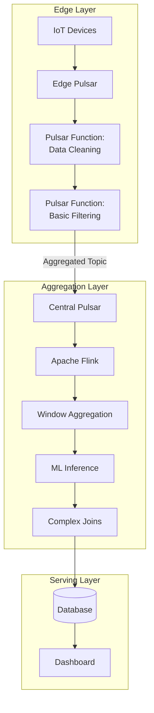
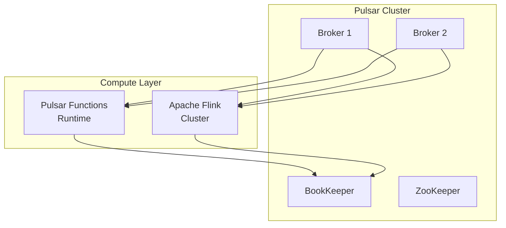
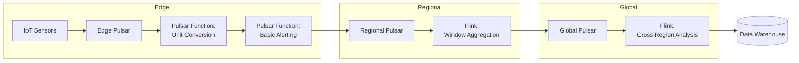
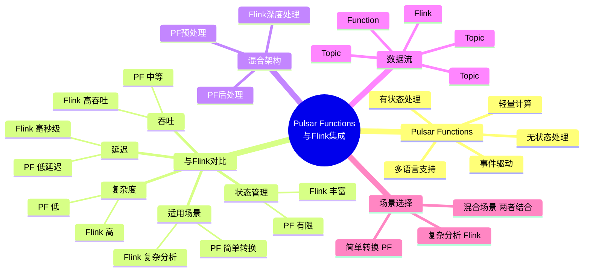
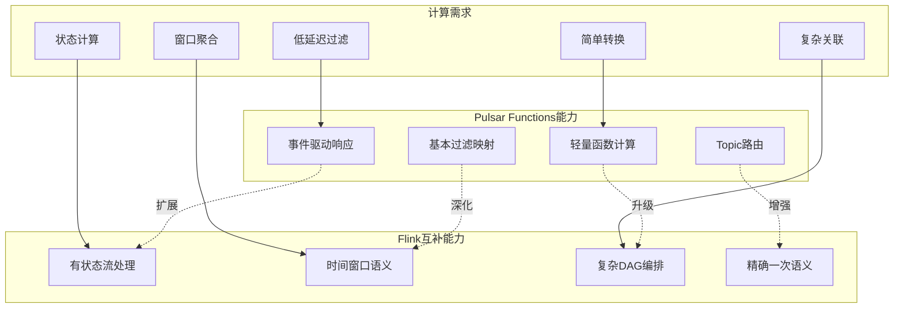
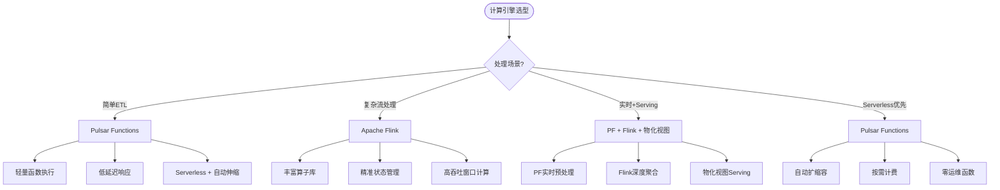

# Apache Pulsar Functions Integration with Flink

> 所属阶段: Flink | 前置依赖: [相关文档] | 形式化等级: L3

> **Project**: P3-12 | **Type**: Integration Guide | **Version**: v1.0 | **Date**: 2026-04-04
>
> **Flink Version**: 1.17+ | **Pulsar Version**: 2.11+ | **Difficulty**: Intermediate

This guide covers integrating Apache Flink with Apache Pulsar Functions for unified stream processing.

---

## 1. Overview

### 1.1 What is Pulsar Functions

Pulsar Functions are lightweight compute processes that:

- Consume messages from Pulsar topics
- Apply user-defined processing logic
- Publish results to output topics
- Support multiple runtimes (Java, Python, Go)

### 1.2 Integration Scenarios

| Scenario | Flink Role | Pulsar Functions Role |
|----------|-----------|---------------------|
| **Edge Processing** | Centralized analytics | Edge data preprocessing |
| **Multi-Tenancy** | Cross-tenant aggregation | Tenant-isolated processing |
| **Function Chaining** | Complex DAG orchestration | Simple function composition |
| **Multi-Cloud** | Cloud-agnostic processing | Region-local functions |

### 1.3 Architecture



---

## 2. Integration Methods

### 2.1 Pulsar as Flink Source/Sink

**Flink Pulsar Source**:

```java

// [伪代码片段 - 不可直接运行] 仅展示核心逻辑
import org.apache.flink.streaming.api.datastream.DataStream;

// Maven dependency
// <artifactId>flink-connector-pulsar</artifactId>
// <version>4.1.0-1.17</version>

PulsarSource<String> source = PulsarSource.builder()
    .setServiceUrl("pulsar://localhost:6650")
    .setAdminUrl("http://localhost:8080")
    .setStartCursor(StartCursor.earliest())
    .setTopics("persistent://public/default/input-topic")
    .setDeserializationSchema(new SimpleStringSchema())
    .setSubscriptionName("flink-subscription")
    .setSubscriptionType(SubscriptionType.Exclusive)
    .build();

DataStream<String> stream = env.fromSource(
    source,
    WatermarkStrategy.forBoundedOutOfOrderness(Duration.ofSeconds(5)),
    "Pulsar Source"
);
```

**Flink Pulsar Sink**:

```java
// [伪代码片段 - 不可直接运行] 仅展示核心逻辑
PulsarSink<String> sink = PulsarSink.builder()
    .setServiceUrl("pulsar://localhost:6650")
    .setAdminUrl("http://localhost:8080")
    .setTopics("persistent://public/default/output-topic")
    .setSerializationSchema(new SimpleStringSchema())
    .setDeliveryGuarantee(DeliveryGuarantee.AT_LEAST_ONCE)
    .build();

stream.sinkTo(sink);
```

### 2.2 Pulsar Functions Calling Flink

**Pulsar Function with Flink RPC**:

```java
public class EnrichmentFunction implements Function<String, String> {
    private transient FlinkRpcClient flinkClient;

    @Override
    public void open(Map<String, Object> config) {
        flinkClient = new FlinkRpcClient(
            (String) config.get("flink.jobmanager.url")
        );
    }

    @Override
    public String process(String input, Context context) {
        // Enrich with Flink-computed features
        EnrichedRecord enriched = flinkClient.enrich(input);
        return enriched.toJson();
    }
}
```

### 2.3 Flink Querying Pulsar State

**State Store Integration**:

```java
// Access Pulsar Function state from Flink
public class PulsarStateLookup extends RichAsyncFunction<String, EnrichedRecord> {
    private transient PulsarAdmin admin;

    @Override
    public void open(Configuration parameters) {
        admin = PulsarAdmin.builder()
            .serviceHttpUrl("http://localhost:8080")
            .build();
    }

    @Override
    public void asyncInvoke(String key, ResultFuture<EnrichedRecord> resultFuture) {
        // Query Pulsar Function's state store
        admin.functions().getFunctionState(
            "public", "default", "enrichment-function", key
        ).thenAccept(state -> {
            resultFuture.complete(Collections.singletonList(
                new EnrichedRecord(key, state)
            ));
        });
    }
}
```

---

## 3. Deployment Patterns

### 3.1 Shared Pulsar Cluster



### 3.2 Separate Clusters with Replication

```yaml
# Pulsar geo-replication replication:
  clusters:
    - edge-us-west
    - edge-us-east
    - central

  topics:
    - pattern: "persistent://tenant/app/.*"
      replication: [edge-us-west, central]

# Flink reads from central cluster flink:
  source:
    service_url: "pulsar://central.pulsar.svc:6650"
    topics: ["persistent://tenant/app/aggregated"]
```

---

## 4. Best Practices

### 4.1 Topic Naming Convention

```
persistent://{tenant}/{namespace}/{processing-layer}.{data-type}.{version}

Examples:
- persistent://ecommerce/orders/edge.raw.v1
- persistent://ecommerce/orders/edge.cleaned.v1
- persistent://ecommerce/orders/flink.aggregated.v1
- persistent://ecommerce/orders/flink.analytics.v1
```

### 4.2 Message Schema Management

**Pulsar Schema**:

```java
// [伪代码片段 - 不可直接运行] 仅展示核心逻辑
// Define schema in Pulsar
Schema<OrderEvent> schema = Schema.AVRO(OrderEvent.class);

Producer<OrderEvent> producer = client.newProducer(schema)
    .topic("persistent://ecommerce/orders/edge.raw.v1")
    .create();
```

**Flink Schema**:

```java
// [伪代码片段 - 不可直接运行] 仅展示核心逻辑
// Use same schema in Flink
PulsarSource<OrderEvent> source = PulsarSource.builder()
    .setDeserializationSchema(
        PulsarDeserializationSchema.pulsarSchema(
            Schema.AVRO(OrderEvent.class),
            OrderEvent.class
        )
    )
    // ...
    .build();
```

### 4.3 Exactly-Once Processing

**Flink Configuration**:

```java

// [伪代码片段 - 不可直接运行] 仅展示核心逻辑
import org.apache.flink.streaming.api.CheckpointingMode;

env.enableCheckpointing(5000);
env.getCheckpointConfig().setCheckpointingMode(
    CheckpointingMode.EXACTLY_ONCE);

PulsarSink<String> sink = PulsarSink.builder()
    // ...
    .setDeliveryGuarantee(DeliveryGuarantee.EXACTLY_ONCE)
    .setConfig(PulsarSinkOptions.PULSAR_WRITE_TRANSACTION_TIMEOUT, 60000)
    .build();
```

### 4.4 Backpressure Handling

```java
// [伪代码片段 - 不可直接运行] 仅展示核心逻辑
// Configure Pulsar consumer for backpressure
PulsarSource<String> source = PulsarSource.builder()
    // ...
    .setConfig(PulsarSourceOptions.PULSAR_MAX_NUM_MESSAGES, 1000)
    .setConfig(PulsarSourceOptions.PULSAR_RECEIVE_QUEUE_SIZE, 2000)
    .build();

// Flink backpressure automatically propagates
env.setBufferTimeout(100);
env.getConfig().setAutoWatermarkInterval(200);
```

---

## 5. Use Cases

### 5.1 IoT Data Pipeline



### 5.2 Multi-Tenant Analytics

```java
import java.util.Map;

import org.apache.flink.streaming.api.datastream.DataStream;


// Tenant isolation with Pulsar + Flink
public class TenantAwareProcessor {

    public static void main(String[] args) {
        // Read from multiple tenant topics
        Map<String, DataStream<Event>> tenantStreams = new HashMap<>();

        for (String tenant : getTenants()) {
            String topic = String.format(
                "persistent://%s/events/raw", tenant);

            DataStream<Event> stream = env.fromSource(
                createPulsarSource(topic),
                WatermarkStrategy.forMonotonousTimestamps(),
                tenant
            );

            // Process with tenant-specific logic
            DataStream<Result> processed = stream
                .keyBy(Event::getUserId)
                .process(new TenantAwareFunction(tenant));

            // Sink to tenant-specific output
            processed.sinkTo(createPulsarSink(
                String.format("persistent://%s/events/processed", tenant)));
        }
    }
}
```

---

## 6. Monitoring

### 6.1 Key Metrics

| Metric | Pulsar Functions | Flink | Alert Threshold |
|--------|-----------------|-------|-----------------|
| **Throughput** | msg/s per function | records/s | < 80% of peak |
| **Latency** | processing time | checkpoint duration | > p99 5s |
| **Lag** | subscription backlog | records behind | > 10000 |
| **Errors** | function exceptions | failed checkpoints | > 0.1% |

### 6.2 Unified Monitoring

```yaml
# Prometheus scrape configuration scrape_configs:
  - job_name: 'pulsar-functions'
    static_configs:
      - targets: ['pulsar-broker:8080']
    metrics_path: /metrics

  - job_name: 'flink-jobmanager'
    static_configs:
      - targets: ['flink-jobmanager:9249']

  - job_name: 'flink-taskmanager'
    static_configs:
      - targets: ['flink-taskmanager:9249']
```

---

## 7. Troubleshooting

| Issue | Symptoms | Solution |
|-------|----------|----------|
| **Schema Mismatch** | Serialization errors | Use schema registry |
| **Message Loss** | Count mismatch | Enable exactly-once |
| **High Lag** | Growing backlog | Scale Flink parallelism |
| **OOM Errors** | Function crashes | Reduce batch size |
| **Zombie Consumers** | Duplicate processing | Check subscription type |

---

## 8. References

- [Pulsar Functions Documentation](https://pulsar.apache.org/docs/next/functions-overview/)
- [Flink Pulsar Connector](https://nightlies.apache.org/flink/flink-docs-stable/docs/connectors/datastream/pulsar/)
- [Pulsar Geo-Replication](https://pulsar.apache.org/docs/next/concepts-replication/)

---

## 9. 思维表征（Visualizations）

以下思维表征补充用于系统化展示 Pulsar Functions 与 Flink 的集成关系、能力映射及选型决策。

### 9.1 思维导图

Pulsar Functions 与 Flink 集成的全景思维导图，展示核心概念、对比维度、混合架构、数据流与场景选择。



### 9.2 多维关联树

计算需求到 Pulsar Functions 能力再到 Flink 互补能力的映射关系。



### 9.3 决策树

基于计算特征选择 Pulsar Functions、Flink 或混合架构。



---

**Document Version History**:

| Version | Date | Changes |
|---------|------|---------|
| v1.0 | 2026-04-04 | Initial version |
