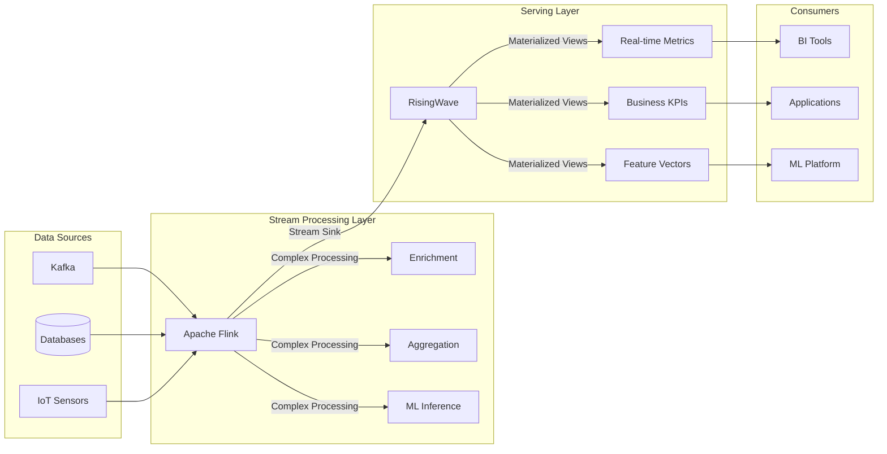
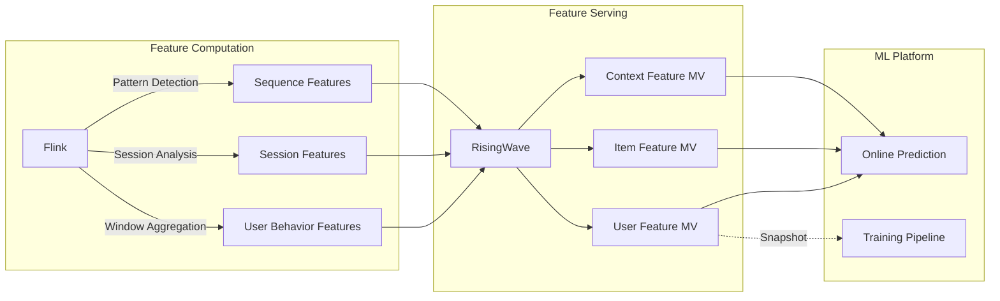

# RisingWave Integration Guide

> **Project**: P3-9 | **Type**: Integration Guide | **Version**: v1.0 | **Date**: 2026-04-04
>
> **Flink Version**: 1.17+ | **RisingWave Version**: 1.7+ | **Difficulty**: Intermediate

This guide covers integrating Apache Flink with RisingWave for unified stream processing and materialized view management.

---

## 1. Overview

### 1.1 What is RisingWave

RisingWave is a distributed SQL streaming database that enables:

- **Materialized Views**: Automatically maintained, incrementally updated views
- **Stream Processing**: Native stream processing with SQL
- **Unified Batch-Stream**: Single query language for both batch and streaming
- **Cloud-Native**: Kubernetes-native architecture

### 1.2 Integration Scenarios

| Scenario | Flink Role | RisingWave Role | Value |
|----------|-----------|-----------------|-------|
| **Complex Event Processing** | Event enrichment, pattern detection | Materialized analytics | Real-time dashboards |
| **Feature Store** | Real-time feature computation | Feature serving | ML pipeline acceleration |
| **CDC Pipeline** | Change data capture | Incremental materialization | Data warehouse sync |
| **Hybrid Processing** | Heavy stream processing | Queryable state | Separation of concerns |

### 1.3 Architecture



---

## 2. Integration Methods

### 2.1 Flink to RisingWave via JDBC

**Configuration**:

```java
// Flink JDBC Sink to RisingWave
JdbcSink.sink(
    "INSERT INTO user_events (user_id, event_type, event_time, payload) " +
    "VALUES (?, ?, ?, ?)",
    (ps, event) -> {
        ps.setString(1, event.getUserId());
        ps.setString(2, event.getEventType());
        ps.setTimestamp(3, Timestamp.from(event.getEventTime()));
        ps.setString(4, event.getPayload());
    },
    JdbcExecutionOptions.builder()
        .withBatchSize(1000)
        .withBatchIntervalMs(200)
        .withMaxRetries(5)
        .build(),
    new JdbcConnectionOptions.JdbcConnectionOptionsBuilder()
        .withUrl("jdbc:postgresql://risingwave:4566/dev")
        .withDriverName("org.postgresql.Driver")
        .withUsername("root")
        .withPassword("")
        .build()
);
```

**Maven Dependency**:

```xml
<dependency>
    <groupId>org.apache.flink</groupId>
    <artifactId>flink-connector-jdbc</artifactId>
    <version>3.1.2-1.17</version>
</dependency>
<dependency>
    <groupId>org.postgresql</groupId>
    <artifactId>postgresql</artifactId>
    <version>42.6.0</version>
</dependency>
```

### 2.2 Flink to RisingWave via Kafka

**Flink Producer**:

```java
// Configure Kafka producer
Properties props = new Properties();
props.put("bootstrap.servers", "kafka:9092");
props.put("acks", "all");

// Create Kafka sink
FlinkKafkaProducer<Event> kafkaSink = new FlinkKafkaProducer<>(
    "processed-events",
    new EventSerializer(),
    props,
    FlinkKafkaProducer.Semantic.EXACTLY_ONCE
);

stream.addSink(kafkaSink);
```

**RisingWave Source**:

```sql
-- Create source in RisingWave
CREATE SOURCE processed_events (
    user_id VARCHAR,
    event_type VARCHAR,
    event_time TIMESTAMP,
    payload JSONB,
    watermark FOR event_time AS event_time - INTERVAL '5 minutes'
) WITH (
    connector = 'kafka',
    topic = 'processed-events',
    properties.bootstrap.server = 'kafka:9092',
    scan.startup.mode = 'earliest'
) FORMAT PLAIN ENCODE JSON;

-- Create materialized view
CREATE MATERIALIZED VIEW user_event_stats AS
SELECT
    user_id,
    event_type,
    COUNT(*) as event_count,
    TUMBLE_START(event_time, INTERVAL '1 minute') as window_start
FROM processed_events
GROUP BY
    user_id,
    event_type,
    TUMBLE(event_time, INTERVAL '1 minute');
```

### 2.3 RisingWave to Flink via CDC

**RisingWave CDC Source**:

```sql
-- Create CDC source from RisingWave
CREATE TABLE risingwave_cdc (
    user_id STRING,
    event_count BIGINT,
    window_start TIMESTAMP(3),
    PRIMARY KEY (user_id, window_start) NOT ENFORCED
) WITH (
    'connector' = 'postgres-cdc',
    'hostname' = 'risingwave',
    'port' = '4566',
    'username' = 'root',
    'password' = '',
    'database-name' = 'dev',
    'table-name' = 'user_event_stats',
    'debezium.slot.name' = 'flink_slot'
);
```

---

## 3. Best Practices

### 3.1 Schema Design

**RisingWave Table Design**:

```sql
-- Time-series optimized table
CREATE TABLE flink_sink_events (
    -- Primary key for upserts
    event_id VARCHAR PRIMARY KEY,

    -- Business dimensions
    user_id VARCHAR,
    product_id VARCHAR,

    -- Event data
    event_type VARCHAR,
    event_value DECIMAL(18, 2),
    event_properties JSONB,

    -- Time handling
    event_time TIMESTAMP,
    processed_time TIMESTAMP DEFAULT NOW(),

    -- Indexes for query patterns
    INDEX idx_user_time (user_id, event_time),
    INDEX idx_product (product_id)
);

-- Partition by time for large tables
CREATE TABLE flink_sink_events_partitioned (
    event_id VARCHAR,
    user_id VARCHAR,
    event_time TIMESTAMP,
    data JSONB,
    PRIMARY KEY (event_id, event_time)
) PARTITION BY RANGE (event_time);
```

### 3.2 Exactly-Once Semantics

**Transaction Support**:

```java
// Two-phase commit for exactly-once
TwoPhaseCommitSinkFunction<Event, JdbcConnection, Void> exactlyOnceSink =
    new TwoPhaseCommitSinkFunction<Event, JdbcConnection, Void>(
        TypeInformation.of(Event.class).createSerializer(new ExecutionConfig())
    ) {
        @Override
        protected void invoke(JdbcConnection connection, Event value, Context context) {
            connection.prepareStatement(value);
        }

        @Override
        protected JdbcConnection beginTransaction() {
            return dataSource.getConnection();
        }

        @Override
        protected void preCommit(JdbcConnection transaction) {
            transaction.flush();
        }

        @Override
        protected void commit(JdbcConnection transaction) {
            transaction.commit();
        }

        @Override
        protected void abort(JdbcConnection transaction) {
            transaction.rollback();
        }
    };
```

### 3.3 Performance Optimization

**Batching Configuration**:

```java
// Optimal batch settings for RisingWave
JdbcExecutionOptions executionOptions = JdbcExecutionOptions.builder()
    .withBatchSize(5000)        // Larger batches for high throughput
    .withBatchIntervalMs(100)   // 100ms max wait
    .withMaxRetries(3)
    .build();

// Connection pooling
HikariConfig hikariConfig = new HikariConfig();
hikariConfig.setMaximumPoolSize(20);
hikariConfig.setMinimumIdle(5);
hikariConfig.setConnectionTimeout(30000);
hikariConfig.setIdleTimeout(600000);
hikariConfig.setMaxLifetime(1800000);
```

---

## 4. Use Cases

### 4.1 Real-Time Feature Store



**RisingWave Feature View**:

```sql
CREATE MATERIALIZED VIEW user_realtime_features AS
SELECT
    user_id,
    -- Real-time aggregations
    COUNT(*) OVER (PARTITION BY user_id ORDER BY event_time
                   RANGE BETWEEN INTERVAL '1 hour' PRECEDING AND CURRENT ROW) as events_1h,
    SUM(event_value) OVER (PARTITION BY user_id ORDER BY event_time
                           RANGE BETWEEN INTERVAL '24 hours' PRECEDING AND CURRENT ROW) as value_24h,
    -- Derived features
    events_1h / NULLIF(value_24h, 0) as event_density,
    -- Feature timestamp
    NOW() as feature_timestamp
FROM flink_sink_events;
```

### 4.2 CDC to Analytics

```sql
-- Flink CDC source from PostgreSQL
CREATE TABLE postgres_cdc (
    id BIGINT,
    user_id VARCHAR,
    order_amount DECIMAL(18, 2),
    order_status VARCHAR,
    created_at TIMESTAMP(3),
    PRIMARY KEY (id) NOT ENFORCED
) WITH (
    'connector' = 'postgres-cdc',
    'hostname' = 'postgres',
    'port' = '5432',
    'username' = 'flink',
    'password' = 'flink',
    'database-name' = 'orders',
    'table-name' = 'orders',
    'debezium.snapshot.mode' = 'initial'
);

-- Process in Flink
Table processed = tableEnv.sqlQuery(
    "SELECT " +
    "  user_id, " +
    "  order_status, " +
    "  COUNT(*) as order_count, " +
    "  SUM(order_amount) as total_amount, " +
    "  TUMBLE_START(created_at, INTERVAL '5' MINUTE) as window_start " +
    "FROM postgres_cdc " +
    "GROUP BY user_id, order_status, " +
    "  TUMBLE(created_at, INTERVAL '5' MINUTE)"
);

-- Sink to RisingWave
tableEnv.executeSql(
    "CREATE TABLE risingwave_sink (...) WITH ('connector' = 'jdbc', ...)"
);
processed.executeInsert("risingwave_sink");
```

---

## 5. Monitoring

### 5.1 Key Metrics

| Metric | Description | Alert Threshold |
|--------|-------------|-----------------|
| **Sink Throughput** | Records/second to RisingWave | < 1000/s |
| **Latency** | End-to-end processing time | > 5s |
| **Error Rate** | Failed writes percentage | > 0.1% |
| **RisingWave Lag** | MV refresh lag | > 10s |

### 5.2 Grafana Dashboard

```yaml
# Sample Prometheus queries
queries: 
  throughput: |
    rate(flink_taskmanager_job_task_operator_numRecordsIn[1m])

  latency: |
    flink_taskmanager_job_task_operator_latency

  error_rate: |
    rate(flink_taskmanager_job_task_operator_numRecordsFailed[5m])
```

---

## 6. Troubleshooting

| Issue | Cause | Solution |
|-------|-------|----------|
| Connection timeouts | Pool exhaustion | Increase connection pool size |
| Duplicate records | At-least-once delivery | Enable exactly-once or deduplicate in RisingWave |
| High latency | Small batch size | Increase batch.size and batch.interval |
| Schema mismatch | Evolution not handled | Use schema registry or manual migration |

---

## 7. References

- [RisingWave Documentation](https://docs.risingwave.com/)
- [Flink JDBC Connector](https://nightlies.apache.org/flink/flink-docs-stable/docs/connectors/table/jdbc/)
- [Flink Kafka Connector](https://nightlies.apache.org/flink/flink-docs-stable/docs/connectors/datastream/kafka/)
- [Flink vs RisingWave 深度架构对比](../../09-practices/09.03-performance-tuning/05-vs-competitors/flink-vs-risingwave-deep-dive.md)
- [Knowledge: Flink vs RisingWave](../../../Knowledge/04-technology-selection/flink-vs-risingwave.md)
- [Knowledge: 2026年流数据库全景对比分析](../../../Knowledge/04-technology-selection/streaming-databases-2026-comparison.md) —— 覆盖 RisingWave, Materialize, Timeplus, Snowflake, Databricks, BigQuery 六大系统

---

**Document Version History**:

| Version | Date | Changes |
|---------|------|---------|
| v1.0 | 2026-04-04 | Initial version |
