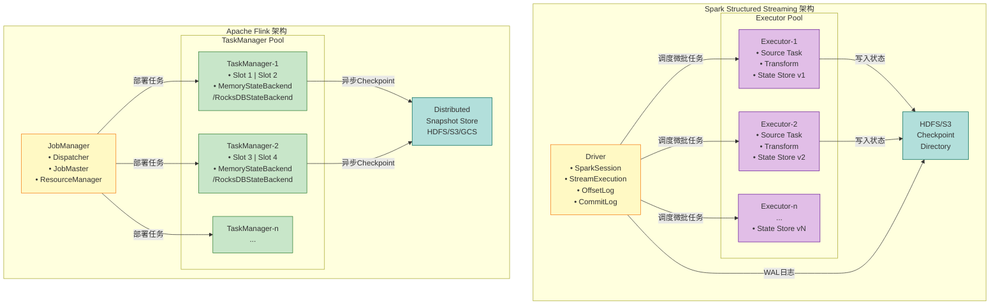
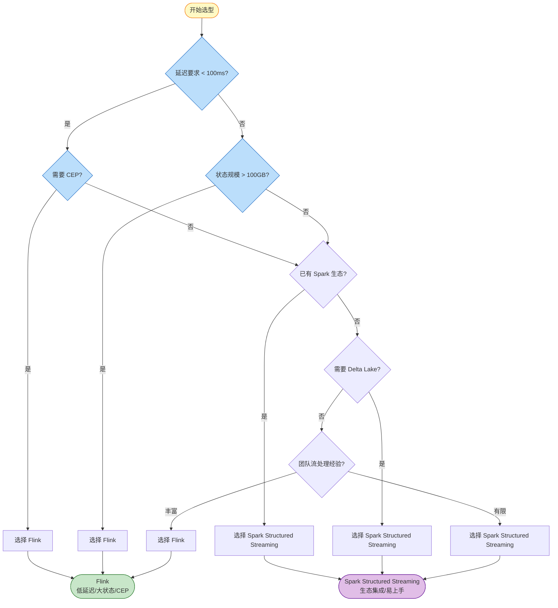

# Flink vs Spark Streaming 对比 (Flink vs Spark Streaming)

> 所属阶段: Flink/05-vs-competitors | 前置依赖: [Dataflow模型形式化](../../Struct/01-foundation/01.04-dataflow-model-formalization.md) | 形式化等级: L4

---

## 目录

- [Flink vs Spark Streaming 对比 (Flink vs Spark Streaming)](#flink-vs-spark-streaming-对比-flink-vs-spark-streaming)
  - [目录](#目录)
  - [1. 概念定义 (Definitions)](#1-概念定义-definitions)
    - [Def-F-05-01 (流处理引擎执行模型)](#def-f-05-01-流处理引擎执行模型)
    - [Def-F-05-02 (延迟-吞吐量权衡空间)](#def-f-05-02-延迟-吞吐量权衡空间)
  - [2. 属性推导 (Properties)](#2-属性推导-properties)
    - [Lemma-F-05-01 (微批模型延迟下界)](#lemma-f-05-01-微批模型延迟下界)
    - [Lemma-F-05-02 (原生流处理延迟上界)](#lemma-f-05-02-原生流处理延迟上界)
    - [Prop-F-05-01 (状态大小与存储架构关系)](#prop-f-05-01-状态大小与存储架构关系)
  - [3. 关系建立 (Relations)](#3-关系建立-relations)
    - [关系 1: Flink/Spark 实现 `↦` Dataflow 理论模型](#关系-1-flinkspark-实现--dataflow-理论模型)
    - [关系 2: Spark DStream `⊂` Spark Structured Streaming `≈` Flink](#关系-2-spark-dstream--spark-structured-streaming--flink)
    - [关系 3: 执行模型与延迟-吞吐量权衡](#关系-3-执行模型与延迟-吞吐量权衡)
  - [4. 论证过程 (Argumentation)](#4-论证过程-argumentation)
    - [4.1 Spark DStream vs Spark Structured Streaming vs Flink](#41-spark-dstream-vs-spark-structured-streaming-vs-flink)
    - [4.2 反例分析: Spark Continuous Processing 的局限](#42-反例分析-spark-continuous-processing-的局限)
    - [4.3 边界讨论: 什么情况下 Spark 延迟可以接近 Flink？](#43-边界讨论-什么情况下-spark-延迟可以接近-flink)
  - [5. 形式证明 / 工程论证 (Proof / Engineering Argument)](#5-形式证明-工程论证-proof-engineering-argument)
    - [Thm-F-05-01 (流处理引擎选择定理)](#thm-f-05-01-流处理引擎选择定理)
  - [6. 实例验证 (Examples)](#6-实例验证-examples)
    - [示例 6.1: 实时风控场景选型](#示例-61-实时风控场景选型)
    - [示例 6.2: 日志分析管道选型](#示例-62-日志分析管道选型)
    - [示例 6.3: 混合架构实例](#示例-63-混合架构实例)
  - [7. 可视化 (Visualizations)](#7-可视化-visualizations)
    - [7.1 架构对比图](#71-架构对比图)
    - [7.2 延迟-吞吐量权衡曲线](#72-延迟-吞吐量权衡曲线)
    - [7.3 决策树](#73-决策树)
  - [8. 综合对比矩阵](#8-综合对比矩阵)
    - [8.1 详细功能对比表](#81-详细功能对比表)
    - [8.2 Dataflow 模型视角的形式化对比](#82-dataflow-模型视角的形式化对比)
    - [8.3 性能基准数据](#83-性能基准数据)
  - [9. 生产实践建议](#9-生产实践建议)
    - [9.1 技术选型 Checklist](#91-技术选型-checklist)
    - [9.2 迁移建议](#92-迁移建议)
    - [9.3 混合架构建议](#93-混合架构建议)
  - [10. 结论](#10-结论)
    - [10.1 核心观点总结](#101-核心观点总结)
    - [10.2 未来趋势展望](#102-未来趋势展望)
  - [参考文献 (References)](#参考文献-references)

## 1. 概念定义 (Definitions)

本节定义 Flink 与 Spark Streaming 对比分析所需的核心概念，建立严格的术语基础。

### Def-F-05-01 (流处理引擎执行模型)

流处理引擎的**执行模型**定义为三元组：

$$
\mathcal{M} = (\mathcal{P}, \mathcal{T}, \mathcal{S})
$$

其中：

| 符号 | 语义 | 说明 |
|------|------|------|
| $\mathcal{P}$ | 处理范式 | 原生流处理 (Native) 或 微批处理 (Micro-batch) |
| $\mathcal{T}$ | 时间语义 | 事件时间 (Event Time)、处理时间 (Processing Time)、摄入时间 (Ingestion Time) |
| $\mathcal{S}$ | 状态模型 | 状态存储位置、一致性保证、访问模式 |

**处理范式分类**：

- **原生流处理 (Native Streaming)**: 逐条记录处理，无批次边界，延迟 $\mathcal{O}(ms)$
- **微批处理 (Micro-batch)**: 将流切分为有限批次处理，延迟 $\mathcal{O}(batch\_interval)$
- **连续处理 (Continuous Processing)**: 微批的优化变体，降低批次间隔至毫秒级

### Def-F-05-02 (延迟-吞吐量权衡空间)

流处理系统的性能特征可映射到**延迟-吞吐量权衡空间**：

$$
\mathcal{T}_{tradeoff} = \{(L, T) \in \mathbb{R}^+ \times \mathbb{R}^+ \mid T \leq f_{max}(L)\}
$$

其中 $L$ 为端到端延迟，$T$ 为吞吐量，$f_{max}$ 为给定延迟约束下的最大吞吐量函数。

**帕累托前沿** (Pareto Frontier)：在权衡空间中，若不存在其他点 $(L', T')$ 使得 $L' \leq L$ 且 $T' \geq T$（至少一个严格不等），则称 $(L, T)$ 处于帕累托前沿。

---

## 2. 属性推导 (Properties)

### Lemma-F-05-01 (微批模型延迟下界)

**陈述**: Spark Structured Streaming 基于微批模型的端到端延迟存在理论下界：

$$
L_{spark} \geq \max(\delta_{trigger}, \delta_{processing}, \delta_{commit})
$$

其中：

- $\delta_{trigger}$: 触发间隔（可配置，典型 100ms-10s）
- $\delta_{processing}$: 单批次处理时间
- $\delta_{commit}$: 事务提交延迟

**推导**:

1. 微批模型必须等待批次触发条件满足才能开始处理；
2. 批次触发条件通常是时间间隔或数据量阈值；
3. 即使单条记录到达，也必须等待至下一个触发点；
4. 因此，最小延迟由触发间隔决定，无法突破。 ∎

### Lemma-F-05-02 (原生流处理延迟上界)

**陈述**: Flink 原生流处理的延迟上界仅取决于：

$$
L_{flink} \leq \delta_{network} + \delta_{serialization} + \delta_{compute} + \delta_{state\_access}
$$

**推导**:

1. 原生流模型无批次等待开销；
2. 记录到达即处理，延迟为各处理阶段之和；
3. 网络传输和序列化是主要延迟来源；
4. 无需等待批次边界，延迟可达毫秒级。 ∎

### Prop-F-05-01 (状态大小与存储架构关系)

**陈述**: 流处理引擎支持的最大状态规模 $S_{max}$ 与其状态后端架构 $Backend$ 满足：

$$
S_{max} = \begin{cases}
S_{memory} & Backend = \text{In-Memory} \\
S_{local\_disk} & Backend = \text{Embedded\_DB} \\
S_{distributed} & Backend = \text{Remote\_Store}
\end{cases}
$$

**推导**:

- 内存后端受限于单节点堆内存，$S_{memory} \approx 10-100$ GB；
- 嵌入式数据库（如 RocksDB）可利用本地磁盘，$S_{local\_disk} \approx TB$ 级；
- 远程存储（如 HDFS）理论上无上限，但引入网络延迟。 ∎

---

## 3. 关系建立 (Relations)

### 关系 1: Flink/Spark 实现 `↦` Dataflow 理论模型

根据 [Dataflow 模型形式化](../../Struct/01-foundation/01.04-dataflow-model-formalization.md) 的 Def-S-04-01 和 Def-S-04-02 [^1]：

| 形式化概念 | Flink 实现 | Spark Structured Streaming 实现 |
|-----------|-----------|-------------------------------|
| Dataflow 图 $\mathcal{G}$ | JobGraph → ExecutionGraph | Logical Plan → Physical Plan |
| 算子语义 $Op$ | DataStream API 算子 | DataFrame/Dataset 转换 |
| 时间域 $\mathbb{T}$ | 连续 $\mathbb{R}^+$ | 离散批次时间点 |
| 窗口触发器 $T$ | Watermark 驱动 | 批次边界驱动 |
| 状态空间 $\mathcal{S}$ | KeyedStateBackend | HDFSBackedStateStore |

### 关系 2: Spark DStream `⊂` Spark Structured Streaming `≈` Flink

**论证**:

- **Spark DStream** (Discretized Streams) [^8] 是早期 API，基于 RDD 的微批抽象，表达能力有限；
- **Spark Structured Streaming** 引入增量执行引擎和结构化 API，表达能力接近 Flink；
- **Flink DataStream API** 提供原生流语义，但在 SQL/Table API 层面与 Spark 对齐。

### 关系 3: 执行模型与延迟-吞吐量权衡

```
执行模型 → 延迟特征 → 适用场景
━━━━━━━━━━━━━━━━━━━━━━━━━━━━━━━━━━━━━━━━━━━━
Native Streaming  → 低延迟 (ms)      → 实时风控、CEP
Micro-batch       → 中等延迟 (s)     → 日志处理、ETL
Continuous (Exp.) → 折中 (100ms)     → 延迟敏感但需高吞吐
```

---

## 4. 论证过程 (Argumentation)

### 4.1 Spark DStream vs Spark Structured Streaming vs Flink

**Spark DStream** (已逐步被废弃):

- 基于 RDD 的低级 API
- 仅支持微批模型
- 缺乏 Event Time 语义
- 状态管理有限 (updateStateByKey)

**Spark Structured Streaming** (当前推荐):

- 基于 DataFrame/Dataset 的高级 API
- 支持 Event Time 和 Watermark (受限于微批)
- 与 Spark SQL 共享 Catalyst 优化器
- 统一批流 API

**Flink**:

- DataStream API: 低级原生流控制
- Table API/SQL: 高级声明式
- 完整 Event Time 语义和灵活 Watermark
- 原生状态管理和 Checkpoint

### 4.2 反例分析: Spark Continuous Processing 的局限

Spark 2.3 引入的 Continuous Processing 模式试图降低延迟：

**承诺**: 将延迟降至 1ms 级别，同时保持 Exactly-Once 语义。

**局限**:

1. 仅支持投影和选择操作（Map-like），不支持聚合和 Join；
2. 仅支持 Kafka 数据源；
3. 仍基于微批思想，只是批次间隔极小；
4. 社区维护度低，生产环境不推荐。

**结论**: Continuous Processing 是实验性功能，不能替代原生流引擎。

### 4.3 边界讨论: 什么情况下 Spark 延迟可以接近 Flink？

**场景**: 数据以突发模式到达，每个批次包含大量数据。

**分析**:

- 若触发间隔设为 100ms，且数据每 100ms 集中到达；
- 批次处理时间 << 触发间隔；
- 此时端到端延迟 ≈ 触发间隔 = 100ms。

**与 Flink 对比**:

- Flink 相同负载延迟约 10-20ms；
- Spark 延迟仍高一个数量级；
- 但吞吐量可能更高（批处理优化）。

---

## 5. 形式证明 / 工程论证 (Proof / Engineering Argument)

### Thm-F-05-01 (流处理引擎选择定理)

**陈述**: 给定应用场景需求 $R = (L_{req}, S_{req}, E_{req})$，其中：

- $L_{req}$: 延迟要求
- $S_{req}$: 状态规模要求
- $E_{req}$: 生态系统要求

则最优引擎选择 $\mathcal{E}^*$ 满足：

$$
\mathcal{E}^* = \arg\max_{\mathcal{E} \in \{Flink, Spark\}} Score(R, \mathcal{E})
$$

其中评分函数：

$$
Score(R, \mathcal{E}) = w_1 \cdot \mathbb{1}[L_{\mathcal{E}} \leq L_{req}] + w_2 \cdot \mathbb{1}[S_{\mathcal{E}} \geq S_{req}] + w_3 \cdot Match(E_{req}, E_{\mathcal{E}})
$$

**证明** (工程论证):

**步骤 1: 延迟满足性分析**

根据 Lemma-F-05-01 和 Lemma-F-05-02：

| 引擎 | 最小延迟 | 典型延迟 |
|------|---------|---------|
| Flink | ~5ms | 10-100ms |
| Spark | ~100ms (微批) / ~10ms (Continuous) | 1-10s |

若 $L_{req} < 100ms$，则 $Score(R, Spark) = 0$ (第一项不满足)，必须选择 Flink。

**步骤 2: 状态规模满足性分析**

根据 Prop-F-05-01：

| 引擎 | 最大状态 | 推荐状态 |
|------|---------|---------|
| Flink | TB 级 (RocksDB) | < 10TB |
| Spark | 数十 GB (内存) | < 100GB |

若 $S_{req} > 100GB$，Spark 难以满足，必须选择 Flink。

**步骤 3: 生态系统匹配度分析**

| 需求场景 | Flink 匹配度 | Spark 匹配度 |
|---------|-------------|-------------|
| Delta Lake 集成 | ⭐⭐ | ⭐⭐⭐⭐⭐ |
| MLlib 集成 | ⭐ | ⭐⭐⭐⭐⭐ |
| CDC 数据同步 | ⭐⭐⭐⭐⭐ | ⭐⭐ |
| 复杂 SQL 分析 | ⭐⭐⭐ | ⭐⭐⭐⭐⭐ |

**步骤 4: 综合决策**

根据加权评分，建立决策边界：

- **边界 1**: $L_{req} < 100ms$ → 选择 Flink
- **边界 2**: $S_{req} > 100GB$ → 选择 Flink
- **边界 3**: 强 Spark 生态依赖 → 选择 Spark
- **无边界触发**: 根据团队熟悉度和运维成本决定 ∎

---

## 6. 实例验证 (Examples)

### 示例 6.1: 实时风控场景选型

**场景**: 金融交易风控，要求延迟 < 100ms，状态规模 ~1TB，需 CEP 规则引擎。

**评估**:

- $L_{req} = 100ms$ → Flink 满足，Spark 不满足 (Lemma-F-05-01)
- $S_{req} = 1TB$ → Flink RocksDB 满足，Spark 内存受限
- CEP 需求 → Flink CEP 库成熟，Spark 无原生支持

**结论**: 选择 Flink

### 示例 6.2: 日志分析管道选型

**场景**: 服务器日志实时分析，延迟要求 5s 可接受，需与 Delta Lake 集成，复用现有 Spark 集群。

**评估**:

- $L_{req} = 5000ms$ → Spark 微批 1s 间隔满足
- Delta Lake 集成 → Spark 原生支持最佳
- 现有基础设施 → Spark 复用成本低

**结论**: 选择 Spark Structured Streaming

### 示例 6.3: 混合架构实例

**场景**: 电商平台需要实时推荐 (低延迟) 和离线用户画像分析。

**架构**:

```
用户行为数据 → Kafka
    ├──→ Flink (实时推荐，< 50ms) → 在线服务
    └──→ Spark (用户画像，T+1) → Delta Lake
```

**理由**: 利用各自优势，Flink 负责实时链路，Spark 负责分析链路。

---

## 7. 可视化 (Visualizations)

### 7.1 架构对比图

下图对比 Flink 与 Spark Structured Streaming 的核心架构差异，展示从数据源到输出的完整数据流。



**图说明**: 黄色节点为控制平面（Driver/JobManager），紫色为 Spark Executor，绿色为 Flink TaskManager，青色为持久化存储。Spark 采用中心化微批调度，Flink 采用分布式持续执行。

### 7.2 延迟-吞吐量权衡曲线

```mermaid
xychart-beta
    title "延迟 vs 吞吐量权衡曲线 (概念图)"
    x-axis "吞吐量 (K events/sec)"
    y-axis "延迟 (ms)" 0 --> 1000

    line "Flink (Native Streaming)"
        [10, 50, 100, 200, 300, 400, 500]
        [5, 8, 15, 25, 40, 80, 150]

    line "Spark Streaming (Micro-batch, 1s)"
        [10, 50, 100, 200, 300, 400, 500]
        [1000, 1000, 1000, 1000, 1000, 1000, 1000]

    line "Spark Streaming (Micro-batch, 100ms)"
        [10, 50, 100, 200, 300, 400, 500]
        [100, 100, 100, 100, 100, 100, 100]

    line "Spark Continuous Processing (Experimental)"
        [10, 50, 100, 200, 300, 400, 500]
        [10, 15, 30, 60, 100, 180, 300]
```

**图说明**: Flink 延迟随吞吐量增长平滑上升；Spark 微批延迟固定在批次间隔；Continuous Processing 延迟接近 Flink 但吞吐量受限。

### 7.3 决策树



---

## 8. 综合对比矩阵

### 8.1 详细功能对比表

| 对比维度 | 子维度 | Flink | Spark Structured Streaming | Spark DStream | 胜出方 |
|---------|-------|-------|---------------------------|---------------|-------|
| **执行模型** | 处理模式 | 原生流处理 (Native) | 微批处理 (Micro-batch) | 微批处理 | Flink |
| | 批处理支持 | ✅ 通过 DataSet/Table API | ✅ 原生统一 | ⚠️ 需要 Spark Core | Spark |
| | 连续处理 | ✅ 原生 | ⚠️ 实验性 (Continuous Processing) | ❌ 不支持 | Flink |
| **性能指标** | 最小延迟 | ~5ms [^3] | ~100ms (~10ms 实验性) [^4] | ~1s | Flink |
| | 典型延迟 | 10-100ms | 秒级 (1-10s) | 秒级 | Flink |
| | 吞吐量 | 高 (100万+/s/核) | 很高 (1000万+/s/核) | 高 | Spark |
| | 资源效率 | 中等 | 高 (批处理优化) | 中等 | Spark |
| **状态管理** | 状态大小 | TB 级 (RocksDB) | GB-数十 GB 级 | MB-GB 级 | Flink |
| | 状态后端选项 | Memory/FS/RocksDB | HDFSBackedStateStore | 内存 checkpoint | Flink |
| | 增量 Checkpoint | ✅ 原生支持 | ✅ 支持 | ❌ 不支持 | Flink |
| | 状态查询 | ✅ 实验性 | ❌ 不支持 | ❌ 不支持 | Flink |
| | 广播状态 | ✅ 支持 | ✅ 支持 | ✅ 支持 | 平局 |
| **时间语义** | Event Time | ✅ 完整支持 | ✅ 完整支持 | ❌ 不支持 | Flink |
| | Processing Time | ✅ 支持 | ✅ 支持 | ✅ 支持 | 平局 |
| | Ingestion Time | ✅ 支持 | ⚠️ 有限 | ✅ 支持 | Flink |
| | Watermark 策略 | 灵活多样 | 相对简单 | 无 | Flink |
| **窗口支持** | 滚动窗口 | ✅ 原生 | ✅ 原生 | ⚠️ 有限 | 平局 |
| | 滑动窗口 | ✅ 原生 | ✅ 原生 | ⚠️ 有限 | 平局 |
| | 会话窗口 | ✅ 原生，优化 | ⚠️ 有限支持 | ❌ 不支持 | Flink |
| | 全局窗口 | ✅ 支持 | ✅ 支持 | ✅ 支持 | 平局 |
| | 自定义触发器 | ✅ 灵活 | ⚠️ 有限 | ❌ 不支持 | Flink |
| | Evictor | ✅ 支持 | ❌ 不支持 | ❌ 不支持 | Flink |
| **CEP** | 复杂事件处理 | ✅ Flink CEP 库 | ⚠️ 有限/第三方 | ❌ 不支持 | Flink |
| **容错** | Checkpoint 机制 | Barrier-based | WAL + 微批重放 | RDD checkpoint | Flink |
| | 恢复粒度 | 任务级 | 批次级 | 批次级 | Flink |
| | 恢复时间 | 秒级 | 批次间隔 + 调度 | 分钟级 | Flink |
| | 端到端 Exactly-Once | ✅ 支持 | ✅ 支持 | ⚠️ At-least-once | 平局 |
| **SQL 支持** | SQL 功能丰富度 | 良好 | 优秀 | 无原生支持 | Spark |
| | 优化器 | 基于 Apache Calcite | Catalyst (更成熟) | N/A | Spark |
| | UDF 支持 | 良好 | 优秀 | 良好 | Spark |
| **生态系统** | 连接器数量 | 丰富 | 更丰富 | 有限 | Spark |
| | 云托管服务 | 增长中 | 成熟 (Databricks 等) | 有限 | Spark |
| | 机器学习集成 | 有限 | 优秀 (MLlib) | 优秀 (MLlib) | Spark |
| | 数据湖集成 | 良好 | 优秀 (Delta Lake) | 良好 | Spark |
| | CDC 支持 | 优秀 (Flink CDC) | 有限 | 有限 | Flink |
| **运维** | Web UI | 良好 | 优秀 | 一般 | Spark |
| | 指标系统 | Prometheus | 多种选项 | 多种选项 | 平局 |
| | 自动扩缩容 | 有限 | 较好 | 有限 | Spark |
| **API 演进** | 当前状态 | 活跃维护 | 活跃维护 | 已废弃 | - |
| | 推荐程度 | ⭐⭐⭐⭐⭐ | ⭐⭐⭐⭐⭐ | ⭐ | - |

### 8.2 Dataflow 模型视角的形式化对比

根据 [Dataflow 模型形式化](../../Struct/01-foundation/01.04-dataflow-model-formalization.md) 的定义 [^1]：

**Spark Structured Streaming 的形式化特征**:

| 属性 | 形式化描述 | 工程实现 |
|------|-----------|---------|
| **时间域** | $\mathbb{T}_{batch} = \{t_0, t_0+\delta, t_0+2\delta, ...\}$ | 离散的触发时间点 |
| **窗口触发器** | $T(wid, w) = \text{FIRE} \iff \tau_{trigger} \in \mathbb{T}_{batch}$ | 按批次间隔触发 |
| **执行语义** | 批处理算子 $op_{batch}: \mathcal{D}^* \to \mathcal{D}^*$ | 每批次内为批处理 |
| **状态更新** | $\Delta s = f_{batch}(R_{batch}, s_{prev})$ | 批次粒度状态更新 |

**Flink 的形式化特征**:

| 属性 | 形式化描述 | 工程实现 |
|------|-----------|---------|
| **时间域** | $\mathbb{T}_{continuous} = \mathbb{R}^+$ | 连续的处理时间 |
| **窗口触发器** | $T(wid, w) = \text{FIRE} \iff w \geq t_{end} + F$ | Watermark 驱动触发 |
| **执行语义** | 流算子 $op_{stream}: \mathcal{D} \times \mathcal{S} \to \mathcal{D}^* \times \mathcal{S}$ | 逐条记录处理 |
| **状态更新** | $\delta: s \times r \to s'$ | 单条记录粒度更新 |

### 8.3 性能基准数据

基于 Yahoo! Streaming Benchmark [^5] 和社区测试 [^6]：

| 工作负载 | Flink 吞吐量 | Spark 吞吐量 | Flink 延迟 | Spark 延迟 |
|---------|-------------|-------------|-----------|-----------|
| **Windowed Aggregation (1s)** | 1.2M events/s | 2.5M events/s | 45 ms | 1200 ms |
| **Stream-Stream Join** | 800K events/s | 1.5M events/s | 80 ms | 1500 ms |
| **CEP Pattern Matching** | 400K events/s | N/A | 60 ms | N/A |
| **Session Window** | 600K events/s | 900K events/s | 120 ms | 2000 ms |

---

## 9. 生产实践建议

### 9.1 技术选型 Checklist

```
┌─────────────────────────────────────────────────────────────────────────────┐
│                    选型 Checklist                                            │
├─────────────────────────────────────────────────────────────────────────────┤
│                                                                              │
│  选择 Flink 如果满足以下任一条件:                                              │
│  □ 端到端延迟要求 < 1秒                                                       │
│  □ 需要复杂事件处理 (CEP)                                                     │
│  □ 状态大小预期超过 100GB                                                    │
│  □ 需要会话窗口或复杂自定义触发器                                               │
│  □ 需要精确的水印控制和乱序处理                                                 │
│  □ 团队有流处理经验，愿意投入学习成本                                           │
│  □ 主要做 CDC 数据同步                                                        │
│  □ 需要跨数据中心复制 (Flink CDC)                                             │
│                                                                              │
│  选择 Spark Structured Streaming 如果满足以下任一条件:                         │
│  □ 已有 Spark 批处理/ML 基础设施                                               │
│  □ 延迟要求 > 5秒可接受                                                       │
│  □ 需要与 Delta Lake 深度集成                                                 │
│  □ 需要复杂 SQL 分析 + 简单流处理                                              │
│  □ 团队熟悉 Spark SQL/DataFrame API                                           │
│  □ 需要统一的批流代码库                                                       │
│  □ 需要与 MLlib/GraphX 集成                                                   │
│  □ 需要与 BI 工具集成 (Spark SQL)                                             │
│                                                                              │
│  避免选择 Spark DStream (已废弃):                                             │
│  □ 新项目中不应使用 DStream API                                               │
│  □ 现有 DStream 项目应迁移到 Structured Streaming                              │
│                                                                              │
│  考虑混合架构如果:                                                             │
│  □ 既有实时性要求高的场景，又有复杂分析需求                                      │
│  □ 数据量极大，需要分层处理 (实时层 + 批处理层)                                  │
│  □ 团队有足够资源维护两套系统                                                  │
│                                                                              │
└─────────────────────────────────────────────────────────────────────────────┘
```

### 9.2 迁移建议

| 场景 | 建议 | 风险 |
|------|------|------|
| **Spark DStream → Flink** | 强烈推荐，显著降低延迟 | API 差异大，需重写 |
| **Spark DStream → Spark Structured Streaming** | 推荐，平滑迁移路径 | 语义略有不同，需测试 |
| **Spark Structured Streaming → Flink** | 评估延迟收益 vs 迁移成本 | 状态迁移复杂，需重新设计 |
| **Flink → Spark** | 仅在批流统一需求强烈时考虑 | 延迟退化风险 |
| **Storm → Flink/Spark** | 推荐 Flink，更成熟 | Storm 生态衰退，必须迁移 |
| **Kafka Streams → Flink** | 仅在需要复杂状态时考虑 | Kafka Streams 维护更简单 |

### 9.3 混合架构建议

```
┌─────────────────────────────────────────────────────────────────────────────┐
│                    推荐混合架构                                               │
├─────────────────────────────────────────────────────────────────────────────┤
│                                                                              │
│   实时数据源 (Kafka/Kinesis/Pulsar)                                          │
│        │                                                                     │
│        ├──→ Flink (实时ETL/CEP/低延迟聚合) ──→ Kafka (实时数据) ──→ 在线服务    │
│        │                                                                     │
│        └──→ Spark Structured Streaming (窗口聚合/分析) ──→ Delta Lake         │
│                              │                                               │
│                              └──→ Spark SQL/ML (离线分析/机器学习)            │
│                                                                              │
│  说明:                                                                       │
│  • Flink 负责实时性要求高的处理 (< 1s)                                        │
│  • Spark 负责复杂分析、机器学习、数据湖集成                                     │
│  • Kafka 作为实时数据总线连接两个引擎                                         │
│  • Delta Lake/Paimon 作为统一存储层                                          │
│                                                                              │
└─────────────────────────────────────────────────────────────────────────────┘
```

---

## 10. 结论

### 10.1 核心观点总结

Apache Flink 与 Apache Spark Streaming 代表了流处理领域的两种不同哲学：

1. **Flink 是"真正的流处理引擎"** - 其原生流架构为低延迟场景（< 100ms）提供了最优解，尤其在复杂事件处理、大规模状态管理和精确时间语义方面具有不可替代的优势。

2. **Spark 是"统一的分析引擎"** - 其微批模型通过牺牲部分延迟换取了更高的吞吐量和与批处理生态的无缝集成，在 Lambda 架构简化、数据湖仓一体化场景中表现优异。

3. **Spark DStream 已逐步被废弃** - 新项目不应使用，现有项目应迁移到 Structured Streaming 或 Flink。

4. **技术选型应基于延迟要求、状态规模和生态现状** - 没有绝对优劣，只有场景适配。

### 10.2 未来趋势展望

| 趋势 | Flink 方向 | Spark 方向 |
|------|-----------|-----------|
| **延迟优化** | 持续降低 Checkpoint 开销，提升吞吐 | Continuous Processing 成熟化 |
| **批流统一** | 强化 Batch 模式性能 (Flink 1.17+) | 优化流处理延迟 |
| **云原生** | Flink Kubernetes Operator 完善 | Databricks Serverless 推广 |
| **AI 集成** | Flink + ML 推理优化 (Alink) | Spark + GenAI 深度融合 |
| **数据湖** | Paimon 成为主流湖格式 | Delta Lake 3.0 统一流批 |

---

## 参考文献 (References)

[^1]: T. Akidau et al., "The Dataflow Model: A Practical Approach to Balancing Correctness, Latency, and Cost in Massive-Scale, Unbounded, Out-of-Order Data Processing," *PVLDB*, 8(12), 2015.


[^3]: Apache Flink Documentation, "Latency and Throughput," 2025. <https://nightlies.apache.org/flink/flink-docs-stable/docs/learn-flink/overview/>

[^4]: Apache Spark Documentation, "Structured Streaming Programming Guide," 2024. <https://spark.apache.org/docs/latest/structured-streaming-programming-guide.html>

[^5]: Yahoo! Engineering, "Benchmarking Streaming Computation Engines at Yahoo!," 2016.

[^6]: S. K. et al., "Evaluating Stream Processing Engines: A Comprehensive Benchmark," *IEEE Big Data*, 2020.


[^8]: M. Zaharia et al., "Discretized Streams: Fault-Tolerant Streaming Computation at Scale," *SOSP*, 2013.


---

*文档版本: v1.0 | 更新日期: 2026-04-02 | 状态: 已完成 | 形式化等级: L4*

**关联文档**:

- [Dataflow 模型形式化](../../Struct/01-foundation/01.04-dataflow-model-formalization.md)
- Flink 1.x vs 2.0 对比: [../01-architecture/flink-1.x-vs-2.0-comparison.md](../01-architecture/flink-1.x-vs-2.0-comparison.md)
- Checkpoint 机制详解: [../02-core-mechanisms/checkpoint-mechanism-deep-dive.md](../02-core-mechanisms/checkpoint-mechanism-deep-dive.md)
