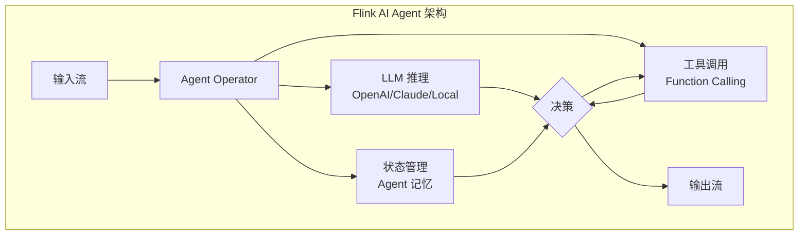
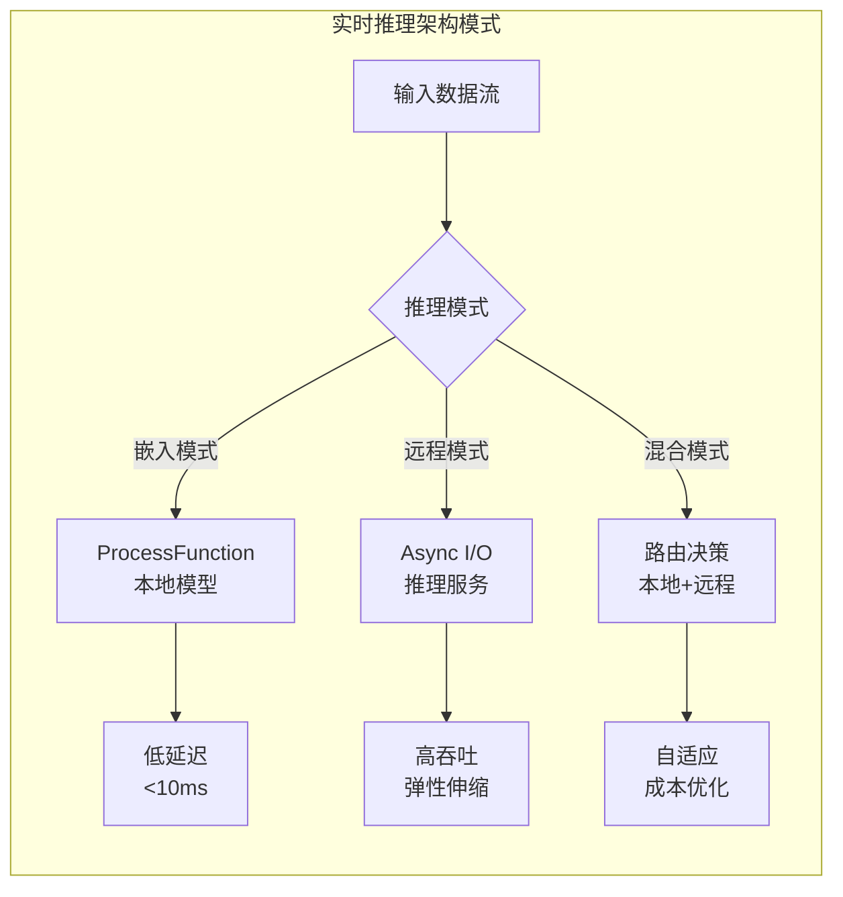
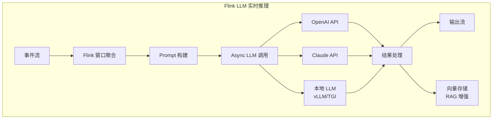
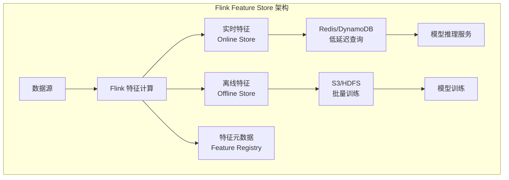
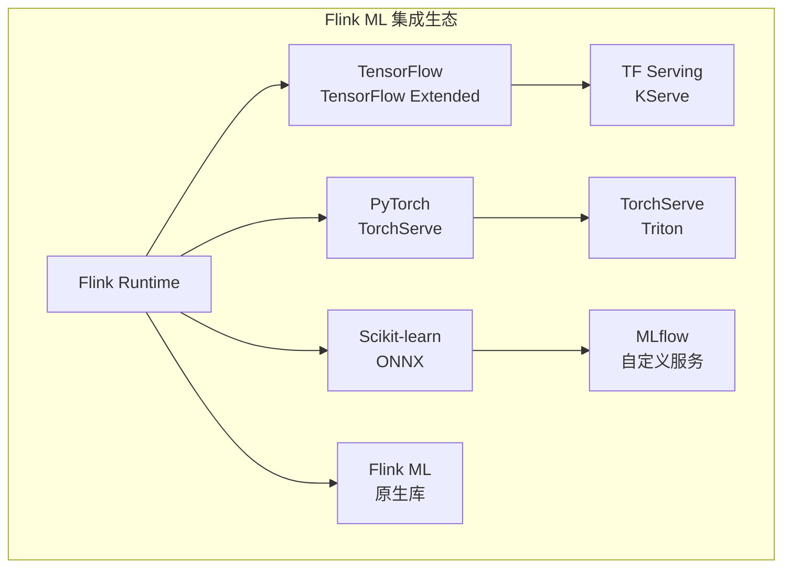
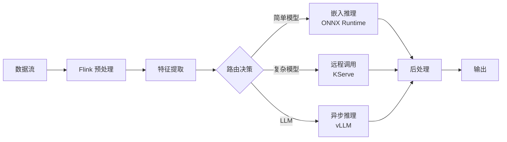
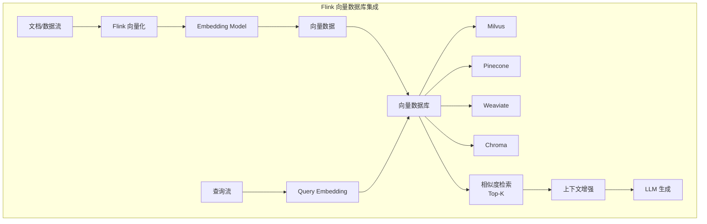
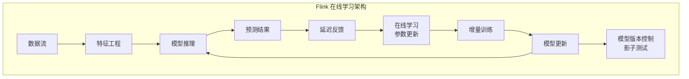
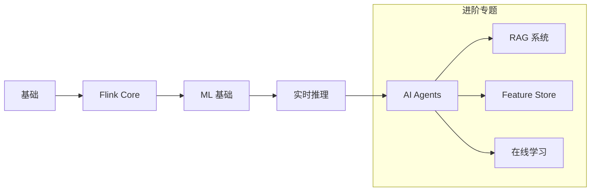
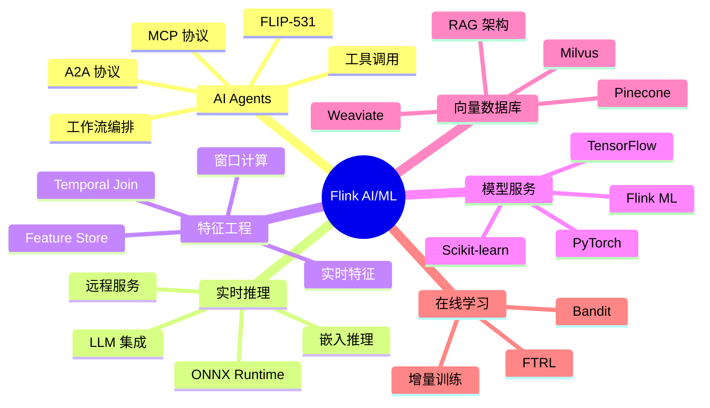

# Flink AI/ML 生态概览

> **状态**: 混合 — 已发布特性 + 前瞻特性 | **最后更新**: 2026-04-20
>
> 本文档为 Flink AI/ML 生态目录索引。包含已发布的集成能力，以及部分前瞻特性规划。

> 所属阶段: Flink | 前置依赖: [Flink API 层](../03-api/), [Flink 生态](../05-ecosystem/) | 形式化等级: L3

本文档是 Flink AI/ML 生态的权威导航中心，全面覆盖 Flink 在人工智能和机器学习领域的应用。从 FLIP-531 AI Agents 到实时推理架构、特征工程、与主流 ML 框架集成，以及向量数据库支持，本目录为构建实时 AI 应用提供完整的技术参考。

---

## 新增深度文档 (2026-Q3 AI for Streaming专题)

| 文档 | 主题 | 行数 | 形式化元素 |
|:-----|:-----|:----:|:----------:|
| [llm-streaming-inference-architecture.md](./llm-streaming-inference-architecture.md) | LLM实时推理架构 | 771 | 13 |
| [streaming-rag-implementation-patterns.md](./streaming-rag-implementation-patterns.md) | 流式RAG实现模式 | 735 | 16 |
| [ai-agent-streaming-patterns.md](./ai-agent-streaming-patterns.md) | AI Agent流处理模式 | 987 | 20 |
| [vector-db-streaming-integration-guide.md](./vector-db-streaming-integration-guide.md) | 向量数据库流式集成 | 327 | 10 |
| [realtime-feature-engineering-guide.md](./realtime-feature-engineering-guide.md) | 实时特征工程指南 | 294 | 13 |
| [flink-22-data-ai-platform.md](./flink-22-data-ai-platform.md) | Flink 2.2 Data+AI平台: ML_PREDICT/VECTOR_SEARCH/LLM连接器 | 1501 | 52 |
| [streaming-ml-libraries-landscape.md](./streaming-ml-libraries-landscape.md) | 流式ML库全景: River/Vowpal Wabbit/在线学习 | 2555 | 35 |
| [model-serving-frameworks-integration.md](./model-serving-frameworks-integration.md) | 模型服务框架集成: KServe/Seldon/BentoML/Triton/Ray Serve | 2648 | 32 |
| [ai-agent-frameworks-ecosystem-2025.md](./ai-agent-frameworks-ecosystem-2025.md) | AI Agent框架生态2025: Confluent/LangGraph/AutoGen/CrewAI | 1233 | 24 |

## 目录结构导航

```
# 伪代码示意，非完整可编译代码 06-ai-ml/
├── README.md                          # 本文件 - AI/ML 生态概览
├── flink-ai-agents-flip-531.md        # FLIP-531 AI Agents 核心
├── flink-agents-architecture-deep-dive.md
├── flink-agents-patterns-catalog.md
├── flink-agents-production-checklist.md
├── flink-agents-a2a-protocol.md       # Google A2A 协议集成
├── flink-agents-mcp-integration.md    # MCP 协议集成
├── flink-llm-realtime-rag-architecture.md
├── flink-realtime-ml-inference.md
├── flink-ml-architecture.md
├── realtime-feature-engineering-feature-store.md
├── vector-database-integration.md
├── ai-ml/evolution/                   # AI/ML 演进专题
│   ├── ai-agent-24.md
│   ├── ai-agent-25.md
│   ├── ai-agent-30.md
│   ├── feature-store.md
│   ├── llm-integration.md
│   ├── mcp-protocol.md
│   └── vector-search.md
└── ...
```

---

## 1. 概念定义 (Definitions)

### Def-F-06-01: Flink AI/ML 生态边界

Flink AI/ML 生态定义了流处理引擎与**人工智能工作流的集成能力集合**：

```
┌─────────────────────────────────────────────────────────────────┐
│                   Flink AI/ML 生态架构                          │
├─────────────────────────────────────────────────────────────────┤
│                                                                 │
│  ┌─────────────────────────────────────────────────────────┐   │
│  │                    AI Agents 层                          │   │
│  │    (FLIP-531: Agent 工作流编排、推理、工具调用)           │   │
│  └─────────────────────────────────────────────────────────┘   │
│                              │                                  │
│  ┌───────────────────────────┼─────────────────────────────┐   │
│  │                           ▼                             │   │
│  │  ┌─────────────┐  ┌─────────────┐  ┌─────────────────┐  │   │
│  │  │ 实时推理    │  │ 特征工程    │  │ 在线学习        │  │   │
│  │  │ Inference   │  │ Feature Eng │  │ Online Learning │  │   │
│  │  └──────┬──────┘  └──────┬──────┘  └────────┬────────┘  │   │
│  │         │                │                  │           │   │
│  │         └────────────────┼──────────────────┘           │   │
│  │                          ▼                              │   │
│  │              ┌─────────────────────┐                    │   │
│  │              │   ML Framework      │                    │   │
│  │              │   (TensorFlow/      │                    │   │
│  │              │    PyTorch/ONNX)    │                    │   │
│  │              └─────────────────────┘                    │   │
│  │                          │                              │   │
│  │              ┌───────────┴───────────┐                  │   │
│  │              ▼                       ▼                  │   │
│  │      ┌─────────────┐       ┌─────────────────┐          │   │
│  │      │ Vector DB   │       │ Model Registry  │          │   │
│  │      │ (Milvus/    │       │ (MLflow/        │          │   │
│  │      │  Pinecone)  │       │  KServe)        │          │   │
│  │      └─────────────┘       └─────────────────┘          │   │
│  │                                                         │   │
│  └─────────────────────────────────────────────────────────┘   │
│                              │                                  │
│  ┌───────────────────────────▼─────────────────────────────┐   │
│  │                   Flink Core Runtime                     │   │
│  └─────────────────────────────────────────────────────────┘   │
│                                                                 │
└─────────────────────────────────────────────────────────────────┘
```

### Def-F-06-02: 实时 AI 分层架构

| 层级 | 组件 | 技术代表 |
|------|------|----------|
| **交互层** | AI Agents | FLIP-531 Agents |
| **推理层** | 实时推理 | TensorFlow Serving, KServe |
| **特征层** | 特征工程 | Flink Feature Store |
| **学习层** | 在线学习 | Flink ML, River |
| **存储层** | 向量存储 | Milvus, Pinecone, Weaviate |

---

## 2. FLIP-531 AI Agents

### 2.1 FLIP-531 概述

**FLIP-531** 是 Flink 社区针对**AI Agent 流式工作流**的正式提案，目标是将 Flink 打造为：

> **"实时 AI 应用的首选流处理引擎"**

**核心设计理念**:

- **Agent 即算子**: 将 AI Agent 建模为 Flink 算子
- **流式编排**: 支持多 Agent 的流式协作
- **推理即服务**: 集成 LLM 推理能力
- **工具调用**: 支持外部工具/API 的动态调用

### 2.2 AI Agent 架构



### 2.3 核心能力矩阵

| 能力 | 状态 | 版本 | 文档 |
|------|------|------|------|
| **Agent 工作流引擎** | ✅ GA | 2.5+ | [Agent 工作流引擎](./flink-agent-workflow-engine.md) |
| **LLM 推理集成** | ✅ GA | 2.5+ | [LLM 实时推理指南](./flink-llm-realtime-inference-guide.md) |
| **工具调用框架** | ✅ GA | 2.5+ | [工具调用模式](./flink-agents-patterns-catalog.md) |
| **A2A 协议** | ⚠️ 实验 | 2.5+ | [A2A 协议集成](./flink-agents-a2a-protocol.md) |
| **MCP 协议** | ⚠️ 实验 | 2.6+ | [MCP 集成](./flink-agents-mcp-integration.md) |

### 2.4 核心文档索引

| 文档 | 主题 | 深度 |
|------|------|------|
| 📘 [FLIP-531 AI Agents](./flink-ai-agents-flip-531.md) | 提案详解与路线图 | ⭐⭐⭐⭐⭐ |
| 📘 [AI Agent 深度集成](./ai-agent-flink-deep-integration.md) | 架构设计与实现 | ⭐⭐⭐⭐⭐ |
| 📘 [Agent 架构深度解析](./flink-agents-architecture-deep-dive.md) | 运行时架构 | ⭐⭐⭐⭐ |
| 📘 [Agent 模式目录](./flink-agents-patterns-catalog.md) | 设计模式与最佳实践 | ⭐⭐⭐⭐ |
| 📘 [生产检查清单](./flink-agents-production-checklist.md) | 上线前检查项 | ⭐⭐⭐ |
| 🆕 [FLIP-531 GA 指南](flink-ai-agents-flip-531.md) | 生产环境部署 | ⭐⭐⭐⭐ |

### 2.5 AI Agent 演进路线

`ai-ml/evolution/` 目录记录了 AI Agent 技术的发展历程：

| 文档 | 版本 | 核心特性 |
|------|------|----------|
| [ai-agent-24.md](./ai-ml/evolution/ai-agent-24.md) | Flink 2.4 | Agent Operator 实验 |
| [ai-agent-25.md](./ai-ml/evolution/ai-agent-25.md) | Flink 2.5 | FLIP-531 GA、工作流引擎 |
| [ai-agent-30.md](./ai-ml/evolution/ai-agent-30.md) | Flink 3.0 | Multi-Agent 编排、自治 Agent |

---

## 3. 实时推理架构

### 3.1 推理架构模式

Flink 支持多种实时推理架构模式，适应不同的延迟和吞吐量需求：



### 3.2 推理模式对比

| 模式 | 延迟 | 吞吐量 | 模型复杂度 | 适用场景 |
|------|------|--------|------------|----------|
| **嵌入模式** | <10ms | 中等 | 轻量级 (ONNX) | 实时风控、推荐 |
| **远程模式** | 50-200ms | 高 | 任意 | LLM 推理、复杂模型 |
| **批推理模式** | 中等 | 极高 | 中等到复杂 | 批量特征生成 |
| **边缘模式** | <5ms | 低 | 微型模型 | IoT 边缘计算 |

### 3.3 LLM 集成方案

**Flink + LLM 集成架构**:



**核心文档**:

- 📘 [Flink LLM 实时推理指南](./flink-llm-realtime-inference-guide.md)
- 📘 [Flink LLM 集成架构](./flink-llm-integration.md)
- 📘 [RAG 流式架构](./rag-streaming-architecture.md)
- 📘 [实时 RAG 架构](./flink-llm-realtime-rag-architecture.md)

---

## 4. 特征工程与 Feature Store

### 4.1 流式特征工程

特征工程是 ML 管道的关键环节，Flink 提供实时特征计算能力：

| 特征类型 | 计算模式 | Flink 能力 |
|----------|----------|------------|
| **原始特征** | 简单转换 | Map/FlatMap |
| **聚合特征** | 窗口计算 | Window Aggregate |
| **时序特征** | 滑动窗口 | Sliding Window |
| **关联特征** | 流流/流表 Join | Temporal Join |
| **派生特征** | UDF 计算 | Python/Java UDF |

### 4.2 Feature Store 集成

**实时特征存储架构**:



**核心文档**:

- 📘 [实时特征工程与 Feature Store](./realtime-feature-engineering-feature-store.md)
- 🔗 [特征存储演进](./ai-ml/evolution/feature-store.md)

### 4.3 特征工程最佳实践

```python
# PyFlink 特征工程示例 from pyflink.table import StreamTableEnvironment
from pyflink.table.window import Tumble

t_env = StreamTableEnvironment.create(...)

# 实时特征计算:用户最近1小时行为统计 feature_sql = """
CREATE VIEW user_features AS
SELECT
    user_id,
    TUMBLE_START(event_time, INTERVAL '1' HOUR) as window_start,
    COUNT(*) as event_count,
    SUM(amount) as total_amount,
    COLLECT_SET(category) as categories
FROM user_events
GROUP BY
    user_id,
    TUMBLE(event_time, INTERVAL '1' HOUR)
"""
```

---

## 5. 与主流 ML 框架集成

### 5.1 集成架构

Flink 与主流 ML 框架的集成方式：



### 5.2 框架集成矩阵

| 框架 | 集成方式 | 部署模式 | 延迟 | 文档 |
|------|----------|----------|------|------|
| **TensorFlow** | SavedModel + TF Serving | 远程调用 | 中等 | [TF 集成](./flink-ml-architecture.md) |
| **PyTorch** | TorchScript + TorchServe | 远程/嵌入 | 中等 | [PyTorch 集成](./flink-ml-architecture.md) |
| **Scikit-learn** | ONNX 导出 | 嵌入 | 低 | [ONNX 集成](./flink-ml-architecture.md) |
| **Flink ML** | 原生 API | 嵌入 | 极低 | [Flink ML](./flink-ml-architecture.md) |
| **Hugging Face** | Transformers + vLLM | 远程 | 高 | [LLM 集成](./flink-llm-integration.md) |

### 5.3 模型服务架构

**模型即服务 (Model-as-a-Service) 集成**:



**核心文档**:

- 📘 [Flink ML 架构](./flink-ml-architecture.md)
- 📘 [实时 ML 推理](./flink-realtime-ml-inference.md)
- 📘 [模型服务流式化](./model-serving-streaming.md)

---

## 6. 向量数据库集成

### 6.1 向量检索架构

向量数据库是 RAG (Retrieval-Augmented Generation) 和语义搜索的基础设施：



### 6.2 向量数据库对比

| 数据库 | 部署模式 | 特色功能 | Flink 集成方式 |
|--------|----------|----------|----------------|
| **Milvus** | 自托管/云 | 分布式、GPU 加速 | REST/gRPC Client |
| **Pinecone** | 全托管 | 无服务器、自动扩缩 | REST API |
| **Weaviate** | 自托管/云 | GraphQL 接口、模块化 | GraphQL Client |
| **Chroma** | 嵌入式 | 轻量、易用 | 本地嵌入 |
| **pgvector** | PostgreSQL 扩展 | SQL 接口、事务 | JDBC |

### 6.3 核心文档

- 📘 [向量数据库集成指南](./vector-database-integration.md)
- 📘 [SQL 向量搜索](./../03-api/03.02-table-sql-api/vector-search.md)
- 📘 [向量搜索与 RAG](./../03-api/03.02-table-sql-api/flink-vector-search-rag.md)

---

## 7. 在线学习 (Online Learning)

### 7.1 在线学习架构

在线学习允许模型在流式数据上持续更新：



### 7.2 在线学习算法

| 算法类型 | 适用场景 | Flink 实现 |
|----------|----------|------------|
| **在线梯度下降** | 线性模型、神经网络 | 自定义 ProcessFunction |
| **FTRL** | 大规模稀疏特征 | Flink ML |
| **Bandit 算法** | 推荐系统、A/B 测试 | 自定义实现 |
| **增量聚类** | 用户分群、异常检测 | River + Flink |

**核心文档**:

- 📘 [在线学习算法](./online-learning-algorithms.md)
- 📘 [在线学习生产实践](./online-learning-production.md)

---

## 8. 开放协议与标准

### 8.1 A2A 协议 (Agent-to-Agent)

**Google A2A 协议** 是开放的 Agent 间通信标准：

| 特性 | 支持状态 | 文档 |
|------|----------|------|
| Agent 发现 | ✅ 支持 | [A2A 协议集成](./flink-agents-a2a-protocol.md) |
| 任务协商 | ✅ 支持 | [Flink Agents A2A](./flink-agents-a2a-protocol.md) |
| 安全通信 | ⚠️ 部分 | 开发中 |

### 8.2 MCP 协议 (Model Context Protocol)

**Anthropic MCP 协议** 是模型上下文交互标准：

| 特性 | 支持状态 | 文档 |
|------|----------|------|
| 工具调用 | ✅ 支持 | [MCP 集成](./flink-mcp-protocol-integration.md) |
| 资源访问 | ✅ 支持 | [Agent MCP 集成](./flink-agents-mcp-integration.md) |
| Prompt 模板 | ⚠️ 部分 | 开发中 |

---

## 9. 快速导航与选型

### 9.1 场景化导航

| 应用场景 | 推荐技术栈 | 关键文档 |
|----------|------------|----------|
| **实时智能客服** | Flink + LLM + RAG | [RAG 架构](./flink-llm-realtime-rag-architecture.md) |
| **实时推荐系统** | Flink + Feature Store + TF Serving | [特征工程](./realtime-feature-engineering-feature-store.md) |
| **实时风控** | Flink + 嵌入推理 + 规则引擎 | [实时推理](./flink-realtime-ml-inference.md) |
| **智能数据分析** | Flink + AI Agents | [FLIP-531](./flink-ai-agents-flip-531.md) |
| **实时语义搜索** | Flink + 向量数据库 | [向量集成](./vector-database-integration.md) |
| **在线广告竞价** | Flink + 在线学习 | [在线学习](./online-learning-algorithms.md) |

### 9.2 学习路径



---

## 10. 可视化总结



---

## 11. 相关资源

### 11.1 官方资源

- 🔗 [Flink ML 文档](https://nightlies.apache.org/flink/flink-ml-docs-stable/)
- 🔗 [FLIP-531 提案](https://github.com/apache/flink/tree/main/flink-docs/docs/flips/)
- 🔗 [Google A2A 协议](https://github.com/google/a2a)
- 🔗 [Anthropic MCP](https://modelcontextprotocol.io/)

### 11.2 社区资源

- 🔗 [Flink AI 扩展仓库](https://github.com/apache/flink-ml)
- 🔗 [Ververica ML 解决方案](https://archive.org/web/*/https://www.ververica.com/solutions/machine-learning)

---

## 引用参考
