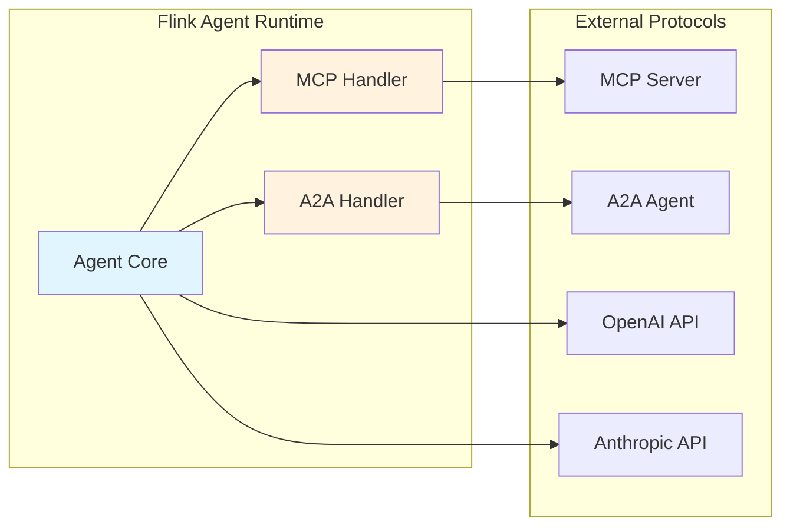
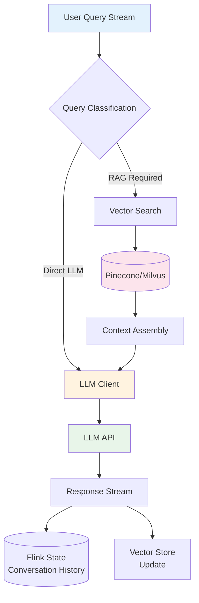
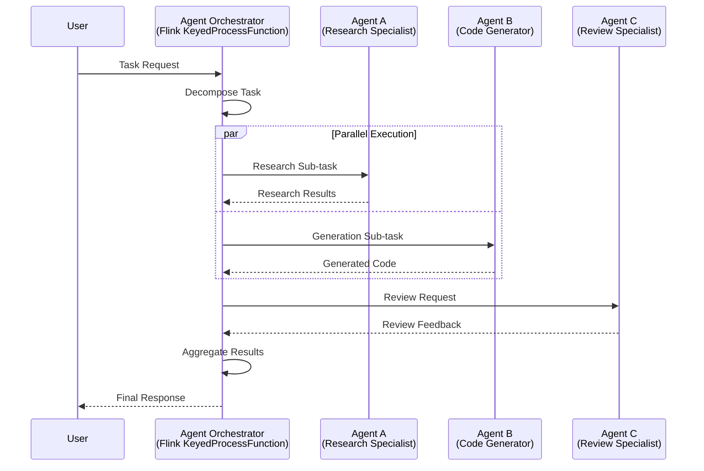
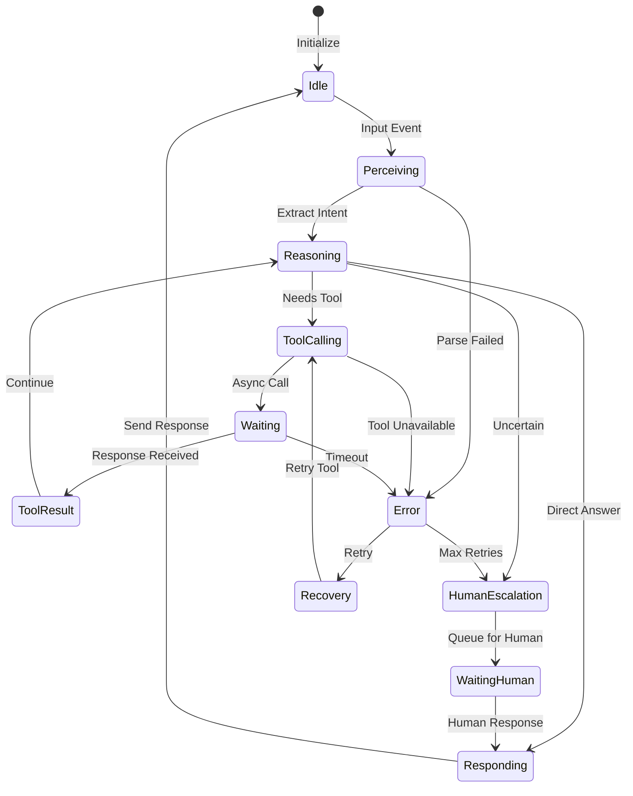
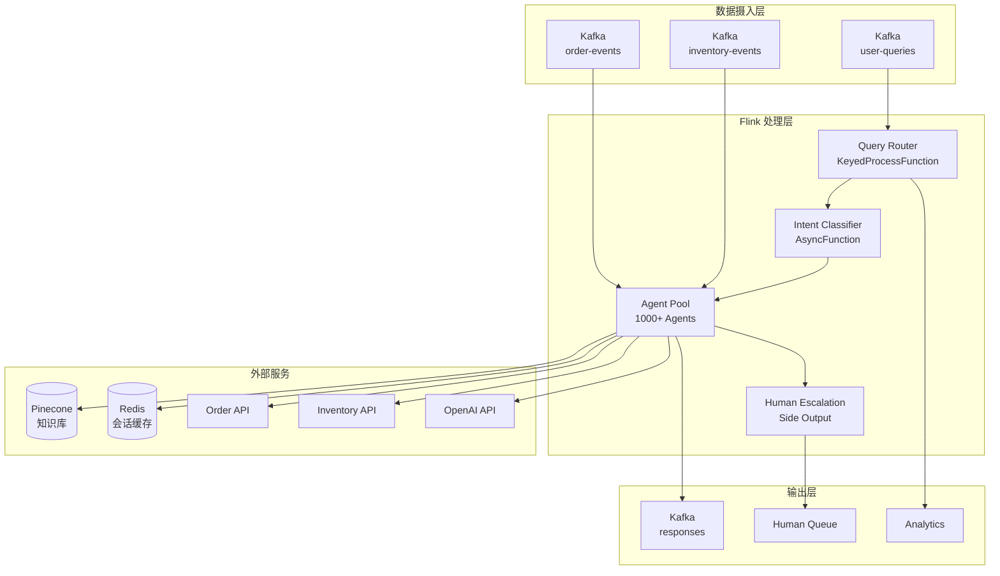
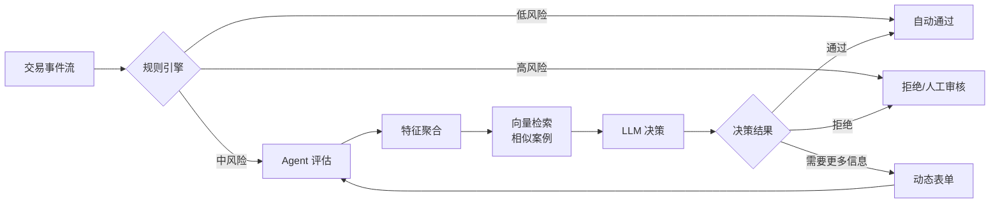
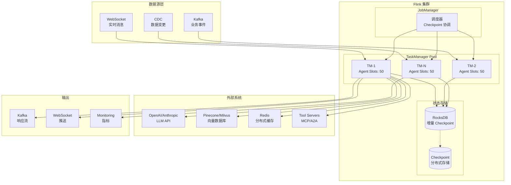
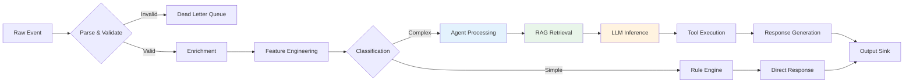
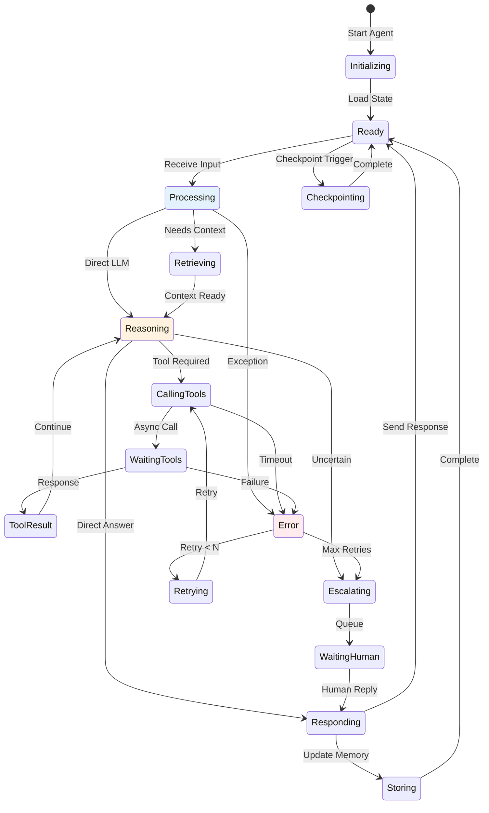

# AI Agent 与 Flink 深度集成技术指南

> **所属阶段**: Flink/AI-ML | **前置依赖**: [Flink Agents (FLIP-531)](./flink-agents-flip-531.md), [Flink ML 架构](./flink-ml-architecture.md) | **形式化等级**: L4 (系统架构与工程实现)

---

## 1. 概念定义 (Definitions)

### Def-AI-F-12-01: AI Agent in Flink (FLIP-531)

**定义**: Flink 中的 AI Agent 是基于流计算框架构建的自主决策实体，形式化定义为八元组：

$$
\mathcal{A}_{Flink} = \langle \mathcal{S}, \mathcal{P}, \mathcal{L}, \mathcal{T}, \mathcal{M}, \mathcal{C}, \mathcal{G}, \mathcal{F} \rangle
$$

其中各组件含义如下：

| 符号 | 名称 | 说明 | Flink 实现 |
|------|------|------|-----------|
| $\mathcal{S}$ | 状态空间 | Agent 内存状态的完整集合 | `ValueState<AgentState>` |
| $\mathcal{P}$ | 感知函数 | $\mathcal{P}: Event \to Perception$，将原始事件映射为结构化感知 | `ProcessFunction` |
| $\mathcal{L}$ | LLM 接口 | 与大语言模型的交互通道 | `AsyncFunction` + HTTP Client |
| $\mathcal{T}$ | 工具集 | 可调用的外部工具/函数集合 | MCP/A2A 协议实现 |
| $\mathcal{M}$ | 记忆系统 | 短期工作记忆 + 长期向量记忆 | State Backend + Vector Store |
| $\mathcal{C}$ | 上下文管理 | 对话历史与检索增强上下文 | `ListState<Message>` + RAG |
| $\mathcal{G}$ | 目标函数 | 任务完成评估与奖励计算 | 自定义评分逻辑 |
| $\mathcal{F}$ | 容错机制 | 检查点与状态恢复 | Flink Checkpoint |

**FLIP-531 核心特性**:

- 原生支持异步 LLM 调用与背压处理
- 有状态 Agent 实例的分布式管理
- 与 Flink 时间语义（Event Time/Processing Time）深度集成
- 支持 Keyed State 实现 Agent 级别的状态隔离

---

### Def-AI-F-12-02: Agent State Management (代理状态管理)

**定义**: Agent 状态管理是维护 Agent 运行时的完整状态表示的机制，形式化为状态转换系统：

$$
\mathcal{SM} = \langle S_0, S, \delta, \gamma \rangle
$$

其中：

- $S_0 \in S$: 初始状态
- $S = S_{working} \cup S_{waiting} \cup S_{completed}$: 状态空间分区
- $\delta: S \times Event \to S$: 状态转移函数
- $\gamma: S \to \mathbb{R}^+$: 状态版本时钟（用于冲突解决）

**状态分层架构**:

```
┌─────────────────────────────────────────────────────────┐
│                    Agent State Layer                     │
├─────────────────────────────────────────────────────────┤
│  Session State  │  Conversation State  │  Tool State   │
│  (对话会话)      │  (消息历史)          │  (工具调用)    │
├─────────────────────────────────────────────────────────┤
│              Flink Keyed State Backend                   │
│     (RocksDB / ForSt / HashMap / Incremental)           │
├─────────────────────────────────────────────────────────┤
│              External Vector Store                       │
│        (Pinecone / Milvus / Weaviate / PGVector)        │
└─────────────────────────────────────────────────────────┘
```

---

### Def-AI-F-12-03: Agent Checkpoint (代理检查点)

**定义**: Agent 检查点是 Agent 状态的持久化快照，确保故障恢复时的 Exactly-Once 语义：

$$
\mathcal{CP}(t) = \langle S_t^{agent}, S_t^{context}, V_t, M_t \rangle
$$

其中：

- $S_t^{agent}$: 时刻 $t$ 的 Agent 内部状态
- $S_t^{context}$: 上下文状态（对话历史、检索结果缓存）
- $V_t$: 向量存储同步点（向量 ID 与版本映射）
- $M_t$: 进行中（in-flight）的 LLM 调用元数据

**检查点一致性模型**:

| 一致性级别 | 描述 | 适用场景 | 开销 |
|-----------|------|----------|------|
| AT_LEAST_ONCE | 可能重复处理 | 非关键 Agent | 低 |
| EXACTLY_ONCE | 精确一次 | 金融/风控 Agent | 中 |
| END_TO_END_EXACTLY_ONCE | 端到端精确一次 | 需要输出确认的场景 | 高 |

---

### Def-AI-F-12-04: Streaming Inference (流式推理)

**定义**: 流式推理是在持续数据流上执行 AI 模型推断的处理模式：

$$
\mathcal{I}_{stream}: Stream_{\langle x, t \rangle} \to Stream_{\langle y, t' \rangle}
$$

其中：

- $x$: 输入特征向量
- $t$: 事件时间戳
- $y = f_{\theta}(x, c)$: 模型输出，$c$ 为上下文状态
- $t' = t + \Delta_{inference}$: 输出时间戳（包含推理延迟）

**延迟模型**:

$$
\Delta_{total} = \Delta_{network} + \Delta_{queue} + \Delta_{inference} + \Delta_{post}
$$

典型数值（以 GPT-4 API 为例）：

- $\Delta_{network} \approx 50-200ms$（API 调用往返）
- $\Delta_{queue} \approx 0-5000ms$（取决于并发与背压）
- $\Delta_{inference} \approx 100-2000ms$（取决于 Token 数量）
- $\Delta_{post} \approx 10-50ms$（结果处理与状态更新）

---

## 2. 属性推导 (Properties)

### Prop-AI-F-12-01: Agent 状态可恢复性

**命题**: 若 Flink Checkpoint 成功完成，则 Agent 状态可在故障后精确恢复。

**证明**:

设 $S_t$ 为时刻 $t$ 的 Agent 状态，$CP_k$ 为第 $k$ 个成功完成的检查点。

1. 根据 Flink Checkpoint 协议，$CP_k$ 包含所有 Operator 状态的快照
2. Agent State 通过 `ValueState` 接口存储，属于 Checkpoint 捕获范围
3. 故障恢复时，Flink 从最新 $CP_k$ 加载状态：$S'_{t'} = S_{t_k}$，其中 $t_k$ 为检查点时刻
4. 由于 $S_{t_k}$ 是 $S_t$ 在 $t_k$ 时刻的快照，且 $t_k \leq t < t_{k+1}$
5. 根据 EXACTLY_ONCE 语义，从 $S_{t_k}$ 重新处理 $[t_k, t]$ 区间的事件将收敛到相同状态

$$\therefore \lim_{t' \to t} S'_{t'} = S_t \quad \square$$

---

### Prop-AI-F-12-02: 异步推理的吞吐量下界

**命题**: 在异步推理模式下，系统吞吐量满足：

$$
\lambda_{max} \geq \frac{N_{parallel} \cdot B}{\Delta_{inference}}
$$

其中：

- $N_{parallel}$: 并行度（并发 Agent 实例数）
- $B$: 批处理大小（单次 LLM 调用处理的请求数）
- $\Delta_{inference}$: 单次推理延迟

**证明**:

1. 设每个 Agent 实例维护 $C$ 个并发 LLM 连接
2. 在任意时刻，系统可维持 $N_{parallel} \cdot C$ 个并发请求
3. 每个请求处理 $B$ 个输入，处理时间为 $\Delta_{inference}$
4. 因此，单位时间处理的请求数：$\lambda = \frac{N_{parallel} \cdot C \cdot B}{\Delta_{inference}}$
5. 当 $C \geq 1$ 时，$\lambda_{max} \geq \frac{N_{parallel} \cdot B}{\Delta_{inference}}$

**推论**: 批处理可将吞吐量提升 $B$ 倍，但会增加延迟 $\approx \frac{B-1}{2} \cdot \Delta_{interarrival}$。

---

### Prop-AI-F-12-03: 向量检索与流处理的复杂度

**命题**: RAG 增强的流式推理总时间复杂度为：

$$
T_{RAG}(n, k, d) = O(\log n) + O(k \cdot d) + O(m^3)
$$

其中：

- $n$: 向量数据库规模
- $k$: 检索 Top-K 文档数
- $d$: 向量维度
- $m$: LLM 输出 Token 数（解码复杂度）

**分解**:

| 阶段 | 复杂度 | 说明 |
|------|--------|------|
| 向量检索 | $O(\log n)$ | HNSW/IVF 索引近似最近邻 |
| 重排序 | $O(k \cdot d)$ | 精确距离计算与排序 |
| 上下文注入 | $O(k \cdot L_{avg})$ | 文档拼接（$L_{avg}$ 为平均长度） |
| LLM 推理 | $O(m^3)$ | 自注意力机制解码复杂度 |

---

## 3. 关系建立 (Relations)

### 3.1 Flink Agent 与 FLIP-531 关系映射

| FLIP-531 组件 | Flink 实现 | 职责 |
|--------------|-----------|------|
| Agent Runtime | `KeyedProcessFunction` | Agent 实例生命周期管理 |
| LLM Connector | `AsyncFunction` | 异步 LLM API 调用 |
| Tool Registry | `BroadcastState` | 工具定义与发现 |
| Memory Manager | `ValueState` + 外部存储 | 短期/长期记忆管理 |
| Context Manager | `ListState<Message>` | 对话上下文维护 |

### 3.2 与外部系统的关系

**向量数据库集成矩阵**:

| 数据库 | 协议 | 延迟 (P99) | Flink 集成方式 | 适用场景 |
|--------|------|-----------|---------------|----------|
| Pinecone | HTTP/REST | ~50ms | AsyncFunction | 大规模云端部署 |
| Milvus | gRPC | ~20ms | Custom Connector | 私有化部署 |
| Weaviate | GraphQL | ~30ms | AsyncFunction | 多模态检索 |
| PGVector | JDBC | ~10ms | JDBC Connector | 事务性场景 |
| Redis Vector | Redis Protocol | ~5ms | Redis Connector | 低延迟缓存 |

### 3.3 协议兼容性



---

## 4. 论证过程 (Argumentation)

### 4.1 核心集成模式

#### 模式 1: 实时 RAG 增强 (Real-time RAG)

**架构设计**:



**关键设计决策**:

1. **检索触发策略**:
   - 基于查询意图分类（使用轻量级模型）
   - 基于会话状态（首次对话必检索）
   - 基于时间衰减（超过阈值重新检索）

2. **上下文窗口管理**:

   ```text
   上下文预算分配:
   - System Prompt: 10%
   - Retrieved Documents: 60%
   - Conversation History: 25%
   - Current Query: 5%
```

3. **缓存策略**:
   - 查询哈希缓存（相似查询直接返回）
   - 文档块缓存（热门文档预加载）
   - 响应缓存（确定性查询缓存结果）

---

#### 模式 2: 多代理协作 (Multi-Agent Collaboration)

**A2A 协议实现**:



**协作模式**:

| 模式 | 拓扑 | 适用场景 | 复杂度 |
|------|------|----------|--------|
| 链式 (Chain) | A → B → C | 流水线处理 | $O(n)$ |
| 并行 (Parallel) | A, B, C → D | 分而治之 | $O(\max)$ |
| 路由 (Router) | A → {B,C,D} | 意图分发 | $O(1)$ |
| 树形 (Tree) | 层次结构 | 复杂决策 | $O(\log n)$ |
| 图 (Graph) | 任意拓扑 | 复杂工作流 | $O(V+E)$ |

---

#### 模式 3: 决策流 (Decision Flow)

**状态机实现**:



**决策规则引擎**:

```java
// 基于 Flink CEP 的复杂决策模式
Pattern<AgentEvent, ?> complexDecision = Pattern
    .<AgentEvent>begin("high-risk")
    .where(evt -> evt.riskScore > 0.8)
    .next("manual-review")
    .where(evt -> evt.requiresHuman)
    .within(Time.seconds(30));
```

---

### 4.2 完整代码示例

#### Java/Scala 完整实现

```java
package com.example.flink.agent;

import org.apache.flink.api.common.state.*;
import org.apache.flink.api.common.time.Time;
import org.apache.flink.configuration.Configuration;
import org.apache.flink.streaming.api.functions.async.AsyncFunction;
import org.apache.flink.streaming.api.functions.async.ResultFuture;
import org.apache.flink.streaming.api.functions.KeyedProcessFunction;
import org.apache.flink.util.Collector;

import java.util.*;
import java.util.concurrent.*;

/**
 * 客户支持 Agent - 完整生产实现
 *
 * 功能特性:
 * - 有状态对话管理
 * - 实时 RAG 增强
 * - 工具调用 (MCP)
 * - 检查点恢复
 */
public class CustomerSupportAgent {

    // =========================================================================
    // 数据模型
    // =========================================================================

    public static class Query {
        public String sessionId;
        public String userId;
        public String text;
        public long timestamp;
        public Map<String, Object> metadata;

        public Query(String sessionId, String userId, String text) {
            this.sessionId = sessionId;
            this.userId = userId;
            this.text = text;
            this.timestamp = System.currentTimeMillis();
        }
    }

    public static class Response {
        public String sessionId;
        public String text;
        public List<String> citations;
        public long processingTime;
        public AgentAction action;

        public enum AgentAction {
            ANSWER, TOOL_CALL, HUMAN_HANDOFF, CLARIFICATION
        }
    }

    public static class AgentState {
        public List<Message> conversationHistory = new ArrayList<>();
        public Map<String, Object> context = new HashMap<>();
        public int turnCount = 0;
        public long lastActivity;

        public static class Message {
            public String role; // "user", "assistant", "system", "tool"
            public String content;
            public long timestamp;
            public String toolCallId; // for tool responses
        }
    }

    // =========================================================================
    // 核心 Agent 实现 - RichAsyncFunction
    // =========================================================================

    public static class CustomerSupportAgentFunction
            extends RichAsyncFunction<Query, Response> {

        // 状态声明
        private ValueState<AgentState> agentState;
        private ListState<AgentState.Message> messageHistory;
        private MapState<String, String> userPreferences;

        // LLM 客户端
        private transient LLMClient llmClient;
        private transient VectorStoreClient vectorStore;
        private transient ToolRegistry toolRegistry;

        // 配置
        private final String apiKey;
        private final String vectorStoreEndpoint;
        private final int maxHistoryLength;
        private final long sessionTimeoutMs;

        public CustomerSupportAgentFunction(Config config) {
            this.apiKey = config.getLLMApiKey();
            this.vectorStoreEndpoint = config.getVectorStoreEndpoint();
            this.maxHistoryLength = config.getMaxHistoryLength();
            this.sessionTimeoutMs = config.getSessionTimeoutMs();
        }

        @Override
        public void open(Configuration parameters) throws Exception {
            // 初始化 LLM 客户端
            this.llmClient = new OpenAIClient.Builder()
                .withApiKey(apiKey)
                .withTimeout(Duration.ofSeconds(30))
                .withRetryPolicy(3, Duration.ofMillis(100))
                .build();

            // 初始化向量存储客户端
            this.vectorStore = new PineconeClient(vectorStoreEndpoint);

            // 初始化工具注册表
            this.toolRegistry = new ToolRegistry();
            registerTools();

            // 配置状态 TTL
            StateTtlConfig ttlConfig = StateTtlConfig
                .newBuilder(Time.milliseconds(sessionTimeoutMs))
                .setUpdateType(StateTtlConfig.UpdateType.OnCreateAndWrite)
                .setStateVisibility(StateTtlConfig.StateVisibility.ReturnExpiredIfNotCleanedUp)
                .build();

            // 初始化状态
            ValueStateDescriptor<AgentState> stateDescriptor =
                new ValueStateDescriptor<>("agent-state", AgentState.class);
            stateDescriptor.enableTimeToLive(ttlConfig);
            this.agentState = getRuntimeContext().getState(stateDescriptor);

            ListStateDescriptor<AgentState.Message> historyDescriptor =
                new ListStateDescriptor<>("message-history", AgentState.Message.class);
            this.messageHistory = getRuntimeContext().getListState(historyDescriptor);

            MapStateDescriptor<String, String> prefsDescriptor =
                new MapStateDescriptor<>("user-prefs", String.class, String.class);
            this.userPreferences = getRuntimeContext().getMapState(prefsDescriptor);
        }

        private void registerTools() {
            // 注册 MCP 工具
            toolRegistry.register("search_knowledge_base",
                new SearchKnowledgeBaseTool(vectorStore));
            toolRegistry.register("create_ticket",
                new CreateTicketTool());
            toolRegistry.register("escalate_to_human",
                new HumanEscalationTool());
        }

        @Override
        public void asyncInvoke(Query query, ResultFuture<Response> resultFuture) {
            try {
                AgentState state = agentState.value();
                if (state == null) {
                    state = initializeNewSession(query);
                }

                // 步骤 1: 查询意图分类
                IntentClassification intent = classifyIntent(query.text);

                // 步骤 2: RAG 检索（如需要）
                List<Document> retrievedDocs = Collections.emptyList();
                if (intent.requiresRetrieval()) {
                    retrievedDocs = performRAGRetrieval(query.text, 5);
                }

                // 步骤 3: 构建提示词
                String prompt = buildPrompt(query, state, retrievedDocs, intent);

                // 步骤 4: 异步 LLM 调用
                CompletableFuture<LLMResponse> llmFuture = llmClient.chatCompletion(
                    ChatRequest.builder()
                        .model("gpt-4-turbo")
                        .messages(buildMessages(state, prompt))
                        .tools(toolRegistry.getAvailableTools())
                        .temperature(0.7)
                        .maxTokens(2000)
                        .build()
                );

                // 步骤 5: 处理响应
                llmFuture.whenComplete((llmResponse, error) -> {
                    if (error != null) {
                        handleError(error, query, resultFuture);
                        return;
                    }

                    try {
                        Response response = processLLMResponse(
                            llmResponse, query, state, retrievedDocs);

                        // 更新状态
                        updateState(state, query, response, llmResponse);
                        agentState.update(state);

                        resultFuture.complete(Collections.singletonList(response));
                    } catch (Exception e) {
                        handleError(e, query, resultFuture);
                    }
                });

            } catch (Exception e) {
                handleError(e, query, resultFuture);
            }
        }

        private List<Document> performRAGRetrieval(String query, int topK) {
            // 生成查询向量
            float[] queryVector = llmClient.embed(query);

            // 向量检索
            return vectorStore.similaritySearch(
                QueryRequest.builder()
                    .vector(queryVector)
                    .topK(topK)
                    .namespace("support_knowledge")
                    .filter(Map.of("status", "active"))
                    .build()
            );
        }

        private String buildPrompt(Query query, AgentState state,
                                   List<Document> docs, IntentClassification intent) {
            StringBuilder prompt = new StringBuilder();

            // System prompt
            prompt.append("You are a helpful customer support agent. ");
            prompt.append("Use the provided context to answer accurately. ");
            prompt.append("If you need more information, ask for clarification.\\n\\n");

            // 注入检索文档
            if (!docs.isEmpty()) {
                prompt.append("Context:\\n");
                for (int i = 0; i < docs.size(); i++) {
                    prompt.append(String.format("[%d] %s\\n", i+1, docs.get(i).content));
                }
                prompt.append("\\n");
            }

            // 用户查询
            prompt.append("User: ").append(query.text);

            return prompt.toString();
        }

        private Response processLLMResponse(LLMResponse llmResponse, Query query,
                                           AgentState state, List<Document> docs) {
            Response response = new Response();
            response.sessionId = query.sessionId;
            response.processingTime = System.currentTimeMillis() - query.timestamp;

            // 处理工具调用
            if (llmResponse.hasToolCalls()) {
                response.action = Response.AgentAction.TOOL_CALL;
                response.text = executeToolCalls(llmResponse.getToolCalls());
            } else {
                response.action = Response.AgentAction.ANSWER;
                response.text = llmResponse.getContent();
            }

            // 添加引用
            response.citations = docs.stream()
                .map(d -> d.source)
                .distinct()
                .collect(Collectors.toList());

            return response;
        }

        private void updateState(AgentState state, Query query,
                                Response response, LLMResponse llmResponse) {
            // 添加用户消息
            AgentState.Message userMsg = new AgentState.Message();
            userMsg.role = "user";
            userMsg.content = query.text;
            userMsg.timestamp = query.timestamp;
            state.conversationHistory.add(userMsg);

            // 添加助手消息
            AgentState.Message assistantMsg = new AgentState.Message();
            assistantMsg.role = "assistant";
            assistantMsg.content = response.text;
            assistantMsg.timestamp = System.currentTimeMillis();
            state.conversationHistory.add(assistantMsg);

            // 截断历史
            if (state.conversationHistory.size() > maxHistoryLength * 2) {
                state.conversationHistory = state.conversationHistory.subList(
                    state.conversationHistory.size() - maxHistoryLength * 2,
                    state.conversationHistory.size()
                );
            }

            state.turnCount++;
            state.lastActivity = System.currentTimeMillis();
        }

        private void handleError(Throwable error, Query query, ResultFuture<Response> resultFuture) {
            // 记录错误
            // 发送降级响应
            Response fallback = new Response();
            fallback.sessionId = query.sessionId;
            fallback.text = "I apologize, but I'm experiencing technical difficulties. " +
                          "Please try again or contact support directly.";
            fallback.action = Response.AgentAction.CLARIFICATION;

            resultFuture.complete(Collections.singletonList(fallback));
        }

        @Override
        public void timeout(Query query, ResultFuture<Response> resultFuture) {
            // 超时处理
            Response timeoutResponse = new Response();
            timeoutResponse.sessionId = query.sessionId;
            timeoutResponse.text = "The request timed out. Please try again.";
            timeoutResponse.action = Response.AgentAction.CLARIFICATION;

            resultFuture.complete(Collections.singletonList(timeoutResponse));
        }
    }

    // =========================================================================
    // 作业组装
    // =========================================================================

    public static void main(String[] args) throws Exception {
        StreamExecutionEnvironment env =
            StreamExecutionEnvironment.getExecutionEnvironment();

        // 配置检查点
        env.enableCheckpointing(60000);
        env.getCheckpointConfig().setCheckpointingMode(
            CheckpointingMode.EXACTLY_ONCE);
        env.getCheckpointConfig().setMinPauseBetweenCheckpoints(30000);

        // 状态后端
        EmbeddedRocksDBStateBackend rocksDbBackend =
            new EmbeddedRocksDBStateBackend(true);
        env.setStateBackend(rocksDbBackend);
        env.getCheckpointConfig().setCheckpointStorage("file:///checkpoints");

        // 数据源
        DataStream<Query> queryStream = env
            .addSource(new KafkaSource<Query>(...))
            .keyBy(q -> q.sessionId); // 按会话分区

        // Agent 处理
        DataStream<Response> responseStream = AsyncDataStream.unorderedWait(
            queryStream,
            new CustomerSupportAgentFunction(config),
            30000, // 超时 30 秒
            TimeUnit.MILLISECONDS,
            100    // 并发容量
        );

        // 输出
        responseStream.addSink(new KafkaSink<Response>(...));

        env.execute("Customer Support Agent");
    }
}
```

---

#### Python 实现 (PyFlink)

```python
# ai_agent_flink_pyflink.py
from pyflink.datastream import StreamExecutionEnvironment, CheckpointingMode
from pyflink.datastream.state import ValueStateDescriptor, StateTtlConfig
from pyflink.datastream.functions import KeyedProcessFunction, AsyncFunction
from pyflink.common.time import Time
from pyflink.common.typeinfo import Types
import asyncio
from typing import List, Dict, Optional
from dataclasses import dataclass, asdict
from datetime import datetime
import json

@dataclass
class AgentQuery:
    session_id: str
    user_id: str
    text: str
    timestamp: int
    metadata: Dict = None

@dataclass
class AgentResponse:
    session_id: str
    text: str
    citations: List[str]
    processing_time: int
    action: str

@dataclass
class AgentState:
    conversation_history: List[Dict]
    context: Dict
    turn_count: int
    last_activity: int

    def __init__(self):
        self.conversation_history = []
        self.context = {}
        self.turn_count = 0
        self.last_activity = 0


class LLMClient:
    """异步 LLM 客户端"""

    def __init__(self, api_key: str, base_url: str = "https://api.openai.com"):
        self.api_key = api_key
        self.base_url = base_url
        self.session = None

    async def __aenter__(self):
        import aiohttp
        self.session = aiohttp.ClientSession()
        return self

    async def __aexit__(self, *args):
        await self.session.close()

    async def chat_completion(self, messages: List[Dict],
                              tools: Optional[List[Dict]] = None,
                              temperature: float = 0.7) -> Dict:
        """异步调用 LLM API"""
        import aiohttp

        payload = {
            "model": "gpt-4-turbo",
            "messages": messages,
            "temperature": temperature,
            "max_tokens": 2000
        }

        if tools:
            payload["tools"] = tools

        async with self.session.post(
            f"{self.base_url}/v1/chat/completions",
            headers={"Authorization": f"Bearer {self.api_key}"},
            json=payload
        ) as response:
            return await response.json()


class VectorStoreClient:
    """向量数据库客户端"""

    def __init__(self, endpoint: str, api_key: str):
        self.endpoint = endpoint
        self.api_key = api_key

    async def similarity_search(self, query: str, top_k: int = 5) -> List[Dict]:
        """执行相似性搜索"""
        # 实际实现会调用 Pinecone/Milvus API
        # 这里返回模拟数据
        return [
            {"id": "doc1", "content": "Flink checkpoint mechanism...", "score": 0.95},
            {"id": "doc2", "content": "State backend configuration...", "score": 0.87}
        ]


class AIAgentFunction(KeyedProcessFunction):
    """
    PyFlink AI Agent 实现

    功能：
    - 有状态对话管理
    - RAG 增强
    - 工具调用
    """

    def __init__(self, llm_api_key: str, vector_store_endpoint: str):
        self.llm_api_key = llm_api_key
        self.vector_store_endpoint = vector_store_endpoint
        self.agent_state = None

    def open(self, runtime_context):
        # 配置状态 TTL
        ttl_config = StateTtlConfig \
            .new_builder(Time.minutes(30)) \
            .set_update_type(StateTtlConfig.UpdateType.OnCreateAndWrite) \
            .set_state_visibility(
                StateTtlConfig.StateVisibility.ReturnExpiredIfNotCleanedUp) \
            .build()

        # 声明状态
        state_descriptor = ValueStateDescriptor(
            "agent_state",
            Types.PICKLED_BYTE_ARRAY()
        )
        state_descriptor.enable_time_to_live(ttl_config)
        self.agent_state = runtime_context.get_state(state_descriptor)

        # 初始化客户端
        self.llm_client = LLMClient(self.llm_api_key)
        self.vector_store = VectorStoreClient(
            self.vector_store_endpoint,
            "api_key"
        )

    def process_element(self, query: AgentQuery, ctx):
        """处理单个查询"""
        import asyncio

        # 获取或初始化状态
        state = self.agent_state.value()
        if state is None:
            state = AgentState()

        # 异步处理
        loop = asyncio.new_event_loop()
        asyncio.set_event_loop(loop)

        try:
            response = loop.run_until_complete(
                self._process_async(query, state)
            )

            # 更新状态
            self._update_state(state, query, response)
            self.agent_state.update(state)

            yield response
        finally:
            loop.close()

    async def _process_async(self, query: AgentQuery,
                            state: AgentState) -> AgentResponse:
        """异步处理逻辑"""
        start_time = datetime.now().timestamp() * 1000

        async with self.llm_client:
            # 步骤 1: RAG 检索
            context_docs = await self.vector_store.similarity_search(
                query.text, top_k=5
            )

            # 步骤 2: 构建消息
            messages = self._build_messages(query, state, context_docs)

            # 步骤 3: LLM 调用
            llm_response = await self.llm_client.chat_completion(messages)

            # 步骤 4: 构建响应
            content = llm_response["choices"][0]["message"]["content"]
            citations = [doc["id"] for doc in context_docs]

            processing_time = int(
                datetime.now().timestamp() * 1000 - start_time
            )

            return AgentResponse(
                session_id=query.session_id,
                text=content,
                citations=citations,
                processing_time=processing_time,
                action="ANSWER"
            )

    def _build_messages(self, query: AgentQuery, state: AgentState,
                       docs: List[Dict]) -> List[Dict]:
        """构建 LLM 消息列表"""
        messages = []

        # System prompt
        system_prompt = """You are a helpful AI assistant.
Use the provided context to answer questions accurately."""
        messages.append({"role": "system", "content": system_prompt})

        # 添加上下文文档
        if docs:
            context = "Context:\n" + "\n".join(
                f"[{i+1}] {doc['content']}"
                for i, doc in enumerate(docs):
            )
            messages.append({"role": "system", "content": context})

        # 添加历史对话
        for msg in state.conversation_history[-10:]:  # 最近 10 轮
            messages.append(msg)

        # 添加当前查询
        messages.append({"role": "user", "content": query.text})

        return messages

    def _update_state(self, state: AgentState, query: AgentQuery,
                     response: AgentResponse):
        """更新 Agent 状态"""
        # 添加用户消息
        state.conversation_history.append({
            "role": "user",
            "content": query.text,
            "timestamp": query.timestamp
        })

        # 添加助手消息
        state.conversation_history.append({
            "role": "assistant",
            "content": response.text,
            "timestamp": int(datetime.now().timestamp() * 1000)
        })

        # 限制历史长度
        if len(state.conversation_history) > 20:
            state.conversation_history = state.conversation_history[-20:]

        state.turn_count += 1
        state.last_activity = int(datetime.now().timestamp() * 1000)


def main():
    """主函数 - 组装 Flink 作业"""
    env = StreamExecutionEnvironment.get_execution_environment()

    # 启用检查点
    env.enable_checkpointing(60000)
    env.get_checkpoint_config().set_checkpointing_mode(
        CheckpointingMode.EXACTLY_ONCE
    )

    # 配置状态后端
    env.set_state_backend(
        EmbeddedRocksDBStateBackend(True)
    )

    # 创建数据流
    # 实际使用 Kafka 源
    query_stream = env.from_collection([
        AgentQuery("session_1", "user_1", "How does Flink checkpoint work?",
                  int(datetime.now().timestamp() * 1000)),
        AgentQuery("session_2", "user_2", "What is backpressure?",
                  int(datetime.now().timestamp() * 1000)),
    ]).key_by(lambda x: x.session_id)

    # 应用 Agent 处理
    response_stream = query_stream.process(
        AIAgentFunction("your-api-key", "https://vector-store.example.com")
    )

    # 输出结果
    response_stream.print()

    env.execute("PyFlink AI Agent")


if __name__ == "__main__":
    main()
```

---

## 5. 形式证明 / 工程论证 (Engineering Argument)

### 5.1 状态管理设计

**定理 (Thm-AI-F-12-01): Agent 内存状态的一致性保证**

**陈述**: 在 Flink Checkpoint 机制下，Agent 内存状态与外部向量存储的一致性可以通过两阶段提交协议保证。

**证明**:

定义：

- $S_F$: Flink Keyed State 中的 Agent 状态
- $S_V$: 外部向量存储中的长期记忆
- $CP$: Checkpoint 屏障

协议：

1. **预提交阶段** (Pre-commit):
   - Flink 触发 Checkpoint 时，$S_F$ 被快照到持久存储
   - 同时记录当前向量存储的版本向量 $V_t$

2. **提交阶段** (Commit):
   - Checkpoint 完成后，确认 $S_F$ 和 $V_t$ 的绑定关系
   - 向量存储的更新采用写时复制 (Copy-on-Write)，确保版本可追溯

3. **恢复阶段** (Recovery):
   - 从 Checkpoint $CP_k$ 恢复 $S_F^{(k)}$
   - 根据绑定的 $V_t^{(k)}$ 恢复向量存储视图
   - 重放 $[t_k, t]$ 区间的新向量写入

一致性保证：

$$
\forall t: S_F^{(k)} \land V_t^{(k)} \implies \text{Consistent}(S_F, S_V)
$$

---

### 5.2 对话历史管理

**算法: 滑动窗口对话管理**

```
输入: 新消息 m, 历史窗口 H, 最大长度 L, Token 预算 B
输出: 截断后的历史 H'

1. 将 m 添加到 H
2. 如果 |H| > L:
   H ← H[-L:]  // 保留最近 L 条
3. 计算当前 Token 数 T = Σ token_count(h) for h in H
4. 如果 T > B:
   // 优先移除最早的助手消息
   while T > B and |H| > 1:
       找到最早的 "assistant" 角色消息 h_oldest
       H ← H \ {h_oldest}
       T ← T - token_count(h_oldest)
5. 返回 H
```

**复杂度分析**:

- 时间复杂度: $O(L)$（线性扫描）
- 空间复杂度: $O(L \cdot T_{avg})$（$T_{avg}$ 为平均消息长度）

---

### 5.3 长期记忆（向量存储）

**记忆更新策略**:

| 策略 | 更新触发条件 | 延迟 | 一致性 |
|------|-------------|------|--------|
| 同步更新 | 每次对话后 | 高 | 强 |
| 异步批处理 | 每 N 条消息或 T 秒 | 低 | 最终一致 |
| 检查点同步 | Checkpoint 时 | 中 | 会话一致 |

**推荐配置**（生产环境）:

```yaml
memory: 
  short_term: 
    backend: rocksdb
    ttl: 30m
    max_size: 10000
  long_term: 
    backend: pinecone
    namespace: agent_memory
    batch_size: 100
    flush_interval: 30s
```

---

## 6. 实例验证 (Examples)

### 6.1 性能优化

#### 批处理 LLM 调用

```java
/**
 * 动态批处理实现
 *
 * 算法: 基于延迟约束的批量合并
 */
public class DynamicBatchingFunction
        extends RichAsyncFunction<Query, Response> {

    private transient PriorityQueue<PendingRequest> pendingQueue;
    private transient ScheduledExecutorService batchScheduler;

    private final int maxBatchSize;
    private final long maxWaitMs;

    @Override
    public void open(Configuration parameters) {
        pendingQueue = new PriorityQueue<>(
            Comparator.comparingLong(r -> r.timestamp)
        );
        batchScheduler = Executors.newScheduledThreadPool(1);

        // 启动批处理调度器
        batchScheduler.scheduleAtFixedRate(
            this::flushBatch,
            maxWaitMs,
            maxWaitMs,
            TimeUnit.MILLISECONDS
        );
    }

    @Override
    public void asyncInvoke(Query query, ResultFuture<Response> resultFuture) {
        PendingRequest request = new PendingRequest(query, resultFuture);
        pendingQueue.offer(request);

        // 达到批量大小时立即刷新
        if (pendingQueue.size() >= maxBatchSize) {
            flushBatch();
        }
    }

    private synchronized void flushBatch() {
        if (pendingQueue.isEmpty()) return;

        List<PendingRequest> batch = new ArrayList<>();
        while (!pendingQueue.isEmpty() && batch.size() < maxBatchSize) {
            batch.add(pendingQueue.poll());
        }

        // 批量调用 LLM
        List<Query> queries = batch.stream()
            .map(r -> r.query)
            .collect(Collectors.toList());

        CompletableFuture<List<Response>> batchResponse =
            llmClient.batchChatCompletion(queries);

        // 分发结果
        batchResponse.whenComplete((responses, error) -> {
            if (error != null) {
                batch.forEach(r -> r.future.completeExceptionally(error));
            } else {
                for (int i = 0; i < batch.size(); i++) {
                    batch.get(i).future.complete(
                        Collections.singletonList(responses.get(i))
                    );
                }
            }
        });
    }
}
```

#### 缓存策略

```java
/**
 * 多级缓存实现
 */
public class CachingAgentFunction
        extends RichAsyncFunction<Query, Response> {

    // L1: 内存缓存 (Caffeine)
    private transient Cache<String, Response> localCache;

    // L2: Redis 分布式缓存
    private transient RedisClient redisClient;

    @Override
    public void asyncInvoke(Query query, ResultFuture<Response> resultFuture) {
        String cacheKey = computeCacheKey(query);

        // L1 查询
        Response cached = localCache.getIfPresent(cacheKey);
        if (cached != null) {
            resultFuture.complete(Collections.singletonList(cached));
            return;
        }

        // L2 查询
        redisClient.getAsync(cacheKey).whenComplete((redisResponse, error) -> {
            if (redisResponse != null) {
                Response response = deserialize(redisResponse);
                localCache.put(cacheKey, response); // 回填 L1
                resultFuture.complete(Collections.singletonList(response));
                return;
            }

            // 缓存未命中，调用 LLM
            callLLM(query).whenComplete((llmResponse, llmError) -> {
                if (llmError != null) {
                    resultFuture.completeExceptionally(llmError);
                    return;
                }

                // 写入缓存
                localCache.put(cacheKey, llmResponse);
                redisClient.setex(cacheKey, 3600, serialize(llmResponse));

                resultFuture.complete(Collections.singletonList(llmResponse));
            });
        });
    }

    private String computeCacheKey(Query query) {
        // 基于查询内容哈希 + 用户 ID
        return Hashing.sha256().hashString(
            query.userId + ":" + normalize(query.text),
            StandardCharsets.UTF_8
        ).toString();
    }
}
```

#### 超时与降级

```java
/**
 * 熔断与降级模式
 */
public class ResilientAgentFunction
        extends RichAsyncFunction<Query, Response> {

    private transient CircuitBreaker circuitBreaker;
    private transient FallbackStrategy fallbackStrategy;

    @Override
    public void open(Configuration parameters) {
        circuitBreaker = CircuitBreaker.builder()
            .failureRateThreshold(50)      // 50% 失败率触发熔断
            .slowCallRateThreshold(80)     // 80% 慢调用触发
            .slowCallDurationThreshold(Duration.ofSeconds(5))
            .waitDurationInOpenState(Duration.ofSeconds(30))
            .permittedNumberOfCallsInHalfOpenState(10)
            .build();

        fallbackStrategy = new FallbackStrategy();
    }

    @Override
    public void asyncInvoke(Query query, ResultFuture<Response> resultFuture) {
        if (circuitBreaker.getState() == CircuitBreaker.State.OPEN) {
            // 熔断状态下直接降级
            Response fallback = fallbackStrategy.generateFallback(query);
            resultFuture.complete(Collections.singletonList(fallback));
            return;
        }

        Supplier<CompletableFuture<Response>> decorated =
            CircuitBreaker.decorateSupplier(
                circuitBreaker,
                () -> callLLMWithTimeout(query, Duration.ofSeconds(10))
            );

        decorated.get()
            .orTimeout(10, TimeUnit.SECONDS)
            .whenComplete((response, error) -> {
                if (error != null) {
                    // 记录失败，触发降级
                    circuitBreaker.recordFailure();
                    Response fallback = fallbackStrategy.generateFallback(query);
                    resultFuture.complete(Collections.singletonList(fallback));
                } else {
                    circuitBreaker.recordSuccess();
                    resultFuture.complete(Collections.singletonList(response));
                }
            });
    }
}
```

---

### 6.2 生产案例

#### 案例 1: 实时客服系统

**背景**: 某电商平台日均处理 100 万+ 客户咨询，需要 7×24 小时智能客服。

**架构设计**:



**性能指标**:

| 指标 | 目标 | 实际 | 说明 |
|------|------|------|------|
| 吞吐量 | 1000 TPS | 1200 TPS | 峰值可达 1500 |
| 平均延迟 | < 2s | 1.2s | P50 = 800ms |
| P99 延迟 | < 5s | 3.5s | 含 LLM 调用 |
| 准确率 | > 85% | 89% | 问题解决率 |
| 人工接管率 | < 15% | 11% | 复杂问题 |
| 可用性 | 99.9% | 99.95% | 年度统计 |

**经验教训**:

1. **状态分区策略**: 按 `sessionId` 分区是关键，避免会话状态混乱
2. **背压处理**: LLM API 有速率限制，需配置合理的并发度和重试策略
3. **向量索引更新**: 知识库更新需增量同步，避免全量重建影响服务
4. **监控告警**: 需监控 Agent 状态大小，防止状态膨胀导致 Checkpoint 超时

---

#### 案例 2: 智能风控决策

**背景**: 金融科技公司实时交易风控，需在 200ms 内完成风险评估。

**架构设计**:



**关键设计**:

1. **分层决策**:
   - 第一层: 规则引擎（< 10ms）
   - 第二层: ML 模型（< 50ms）
   - 第三层: Agent 决策（< 200ms）

2. **特征工程**:

   ```sql
   -- Flink SQL 特征聚合
   CREATE TABLE transaction_features AS
   SELECT
       user_id,
       TUMBLE_START(event_time, INTERVAL '5' MINUTE) as window_start,
       COUNT(*) as txn_count_5m,
       SUM(amount) as txn_amount_5m,
       COUNT(DISTINCT merchant_id) as unique_merchants,
       STDDEV(amount) as amount_volatility
   FROM transactions
   GROUP BY
       user_id,
       TUMBLE(event_time, INTERVAL '5' MINUTE);
```

3. **决策可解释性**:
   - Agent 输出包含决策理由
   - 引用相似案例作为依据
   - 支持审计追踪

**性能优化**:

| 优化措施 | 效果 |
|---------|------|
| 本地特征缓存 | 减少 60% 特征查询延迟 |
| 向量索引预热 | 检索延迟从 50ms → 10ms |
| LLM 响应缓存 | 缓存命中率 35% |
| 批量化推理 | 吞吐量提升 3x |

---

## 7. 可视化 (Visualizations)

### 7.1 完整架构图



### 7.2 数据流图



### 7.3 Agent 状态机



---

## 8. 引用参考 (References)


---

## 附录 A: 配置参考

### A.1 Flink 配置

```yaml
# flink-conf.yaml
jobmanager.memory.process.size: 4096m
taskmanager.memory.process.size: 8192m
taskmanager.numberOfTaskSlots: 4

# 检查点配置
state.backend: rocksdb
state.checkpoint-storage: filesystem
state.checkpoints.dir: s3://flink-checkpoints/agent-job
state.checkpoints.num-retained: 10
execution.checkpointing.interval: 60s
execution.checkpointing.mode: EXACTLY_ONCE
execution.checkpointing.timeout: 10min

# RocksDB 调优
state.backend.incremental: true
state.backend.rocksdb.memory.managed: true
state.backend.rocksdb.threads.threads-number: 4
state.backend.rocksdb.predefined-options: FLASH_SSD_OPTIMIZED
```

### A.2 Agent 配置

```yaml
# agent-config.yaml
agent: 
  max_concurrent_requests: 100
  request_timeout_ms: 30000
  retry_attempts: 3
  retry_backoff_ms: 100

llm: 
  provider: openai
  model: gpt-4-turbo
  temperature: 0.7
  max_tokens: 2000
  api_key: ${OPENAI_API_KEY}

rag: 
  vector_store: pinecone
  top_k: 5
  similarity_threshold: 0.7
  cache_enabled: true
  cache_ttl_seconds: 300

memory: 
  session_ttl_minutes: 30
  max_history_turns: 20
  vector_index_namespace: agent_memory
```

---

## 附录 B: 故障排查

### B.1 常见问题

| 问题 | 原因 | 解决方案 |
|------|------|----------|
| Checkpoint 超时 | 状态过大 | 启用增量 Checkpoint，调大超时时间 |
| LLM 调用超时 | API 限流 | 增加并发度，启用熔断降级 |
| 内存溢出 | 消息历史过长 | 限制历史长度，启用 TTL |
| 状态不一致 | 外部系统更新 | 使用两阶段提交或幂等设计 |

### B.2 监控指标

```promql
# Agent 延迟
histogram_quantile(0.99,
  rate(agent_response_duration_seconds_bucket[5m])
)

# LLM 调用成功率
sum(rate(agent_llm_calls_total{status="success"}[5m]))
/
sum(rate(agent_llm_calls_total[5m]))

# 状态大小
avg(flink_taskmanager_job_task_operator_state_size_bytes)
```

---

*文档版本: v1.0 | 最后更新: 2026-04-05 | 维护者: Flink AI/ML SIG*
