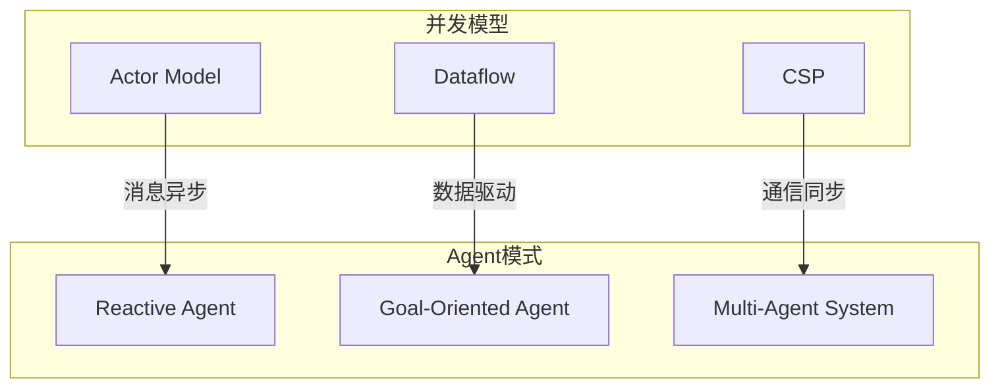
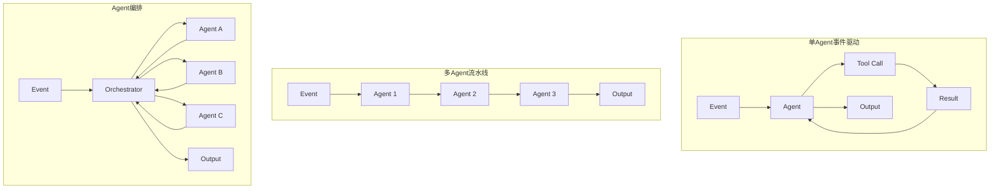
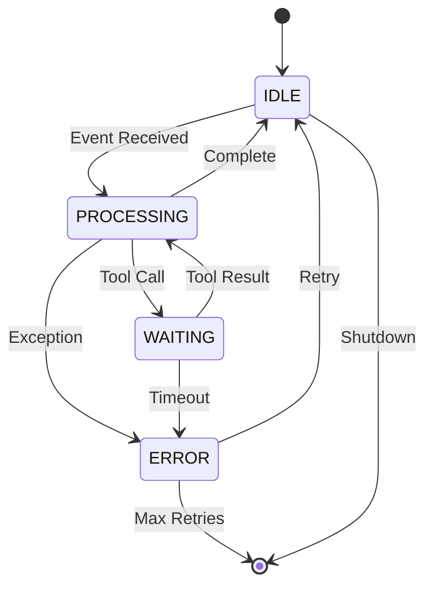
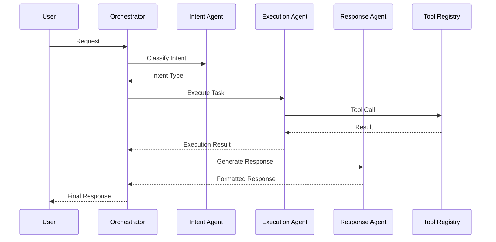

# AI Agent流处理模式

> **状态**: 前瞻 | **预计发布时间**: 2026-06 | **最后更新**: 2026-04-12
>
> ⚠️ 本文档描述的特性处于早期讨论阶段，尚未正式发布。实现细节可能变更。

> **所属阶段**: Flink/AI-ML | **前置依赖**: [Flink状态管理](../04-runtime/04.3-state-management.md) | **形式化等级**: L4-L5

## 执行摘要

本文档系统阐述了AI Agent在流处理场景中的设计模式与最佳实践，涵盖单Agent事件驱动、多Agent协作、Agent编排等架构模式，以及与Flink状态管理的深度集成方案。

| 模式 | 复杂度 | 可扩展性 | 适用场景 |
|:----:|:------:|:--------:|:---------|
| 单Agent事件驱动 | 低 | 高 | 独立任务处理 |
| 多Agent流水线 | 中 | 中 | 工作流编排 |
| Agent编排 | 高 | 高 | 复杂决策场景 |
| 分层Agent | 高 | 高 | 企业级应用 |

---

## 1. 概念定义 (Definitions)

### Def-AI-08-01: AI Agent状态 (Agent State)

**定义**: AI Agent状态 $S_{agent}$ 是Agent在特定时刻的完整信息表示：

$$S_{agent} = (M, C, T, G, K)$$

其中：

- $M$: 内存/记忆 (Memory)
- $C$: 当前上下文 (Context)
- $T$: 工具集合 (Tools)
- $G$: 目标/意图 (Goal)
- $K$: 知识库引用 (Knowledge)

**状态转换**:

$$S_{t+1} = \delta(S_t, e, a)$$

其中 $e$ 为输入事件，$a$ 为执行动作，$\delta$ 为状态转移函数。

---

### Def-AI-08-02: 工具调用 (Tool Calling)

**定义**: 工具调用是Agent使用外部功能扩展自身能力的机制：

$$ToolCall = (tool\_id, parameters, context) \rightarrow result$$

**形式化表示**:

$$\tau: \mathcal{T} \times \mathcal{P} \times \mathcal{C} \rightarrow \mathcal{R}$$

其中：

- $\mathcal{T}$: 工具空间
- $\mathcal{P}$: 参数空间
- $\mathcal{C}$: 上下文空间
- $\mathcal{R}$: 结果空间

---

### Def-AI-08-03: Agent记忆 (Agent Memory)

**定义**: Agent记忆 $\mathcal{M}$ 是Agent存储和检索历史信息的机制：

$$\mathcal{M} = (M_{short}, M_{long}, M_{episodic})$$

**类型**:

- **短期记忆** ($M_{short}$): 当前会话上下文，有限容量
- **长期记忆** ($M_{long}$): 持久化知识，向量数据库存储
- **情景记忆** ($M_{episodic}$): 特定事件序列的记忆

**记忆操作**:

- $Store: Event \times Memory \rightarrow Memory$
- $Retrieve: Query \times Memory \rightarrow List\langle Event \rangle$

---

### Def-AI-08-04: 多Agent协作 (Multi-Agent Coordination)

**定义**: 多Agent协作是一组Agent通过消息传递协调完成共同目标的过程：

$$Coordination = (A, M, Protocol, Goal)$$

其中：

- $A = \{a_1, a_2, ..., a_n\}$: Agent集合
- $M$: 消息传递机制
- $Protocol$: 协作协议
- $Goal$: 共同目标

**协作模式**:

- **流水线 (Pipeline)**: $a_1 \rightarrow a_2 \rightarrow ... \rightarrow a_n$
- **投票 (Voting)**: $Decision = majority(\{a_i.decision\})$
- **竞争 (Competition)**: $Winner = argmax_{a_i}(score_i)$
- **层次 (Hierarchical)**: $a_{manager} \rightarrow \{a_{worker}\}$

---

### Def-AI-08-05: Agent编排 (Agent Orchestration)

**定义**: Agent编排是动态调度多个Agent执行复杂工作流的过程：

$$Orchestration: Workflow \times State \rightarrow Schedule$$

**编排器状态**:

$$S_{orch} = (ActiveAgents, MessageQueue, ExecutionGraph, Metrics)$$

---

### Def-AI-08-06: 事件驱动Agent (Event-Driven Agent)

**定义**: 事件驱动Agent是响应外部事件触发执行逻辑的Agent架构：

$$EDA = (EventSource, EventProcessor, ActionExecutor)$$

**处理循环**:

$$\forall e \in EventStream: process(e) \rightarrow select\_action(S, e) \rightarrow execute(action)$$

---

### Def-AI-08-07: 反应式Agent (Reactive Agent)

**定义**: 反应式Agent基于当前感知直接选择动作，不维护内部状态：

$$Action = \pi(Observation)$$

其中 $\pi$ 为策略函数。

**特点**: 简单、快速、无状态依赖

---

### Def-AI-08-08: 目标导向Agent (Goal-Oriented Agent)

**定义**: 目标导向Agent维护目标表示，并规划动作序列实现目标：

$$Plan = Planner(Goal, State_{current}, Actions_{available})$$

**执行循环**:

$$while \neg GoalAchieved: execute(Plan.next\_action())$$

---

### Def-AI-08-09: Agent工作流 (Agent Workflow)

**定义**: Agent工作流是定义Agent执行步骤和转换条件的有向图：

$$Workflow = (Nodes, Edges, Entry, Exit)$$

其中 $Nodes$ 包含Agent节点、工具节点、决策节点。

---

### Def-AI-08-10: Agent间通信协议

**定义**: Agent间通信协议 $\mathcal{P}$ 规范Agent之间交换消息的格式和语义：

$$Message = (sender, receiver, type, payload, timestamp)$$

**消息类型**:

- $REQUEST$: 请求协作
- $RESPONSE$: 响应请求
- $NOTIFY$: 事件通知
- $DELEGATE$: 任务委派

---

### Def-AI-08-11: 观察-定向-决策-行动循环 (OODA Loop)

**定义**: OODA循环是Agent决策的理论模型：

$$OODA = Observe \rightarrow Orient \rightarrow Decide \rightarrow Act$$

**延迟组成**: $L_{OODA} = L_{obs} + L_{orient} + L_{decide} + L_{act}$

---

### Def-AI-08-12: Agent能力边界 (Agent Capability Boundary)

**定义**: Agent能力边界 $B_{cap}$ 定义Agent可处理的任务范围：

$$B_{cap} = \{task | Capability(task) \geq Threshold\}$$

**超出边界处理**: $Delegate(task) \rightarrow Agent_{capable}$

---

## 2. 属性推导 (Properties)

### Thm-AI-08-01: Agent状态一致性

**定理**: 在Flink的Checkpoint机制下，Agent状态满足Exactly-Once语义。

**证明**:

1. Flink Checkpoint周期性保存算子状态: $S_{checkpoint} = snapshot(S_{runtime})$
2. 故障恢复时，从最近Checkpoint恢复: $S_{recovered} = load(S_{checkpoint})$
3. 未确认的输出被重放，确保无丢失
4. 幂等性保证重复处理不导致状态不一致

**∎**

---

### Thm-AI-08-02: 工具调用幂等性

**定理**: 若工具实现满足幂等性，则Agent的工具调用链具有可重放性。

**证明**:

设工具调用序列 $[\tau_1, \tau_2, ..., \tau_n]$，每个 $\tau_i$ 幂等。

重放时，即使部分调用重复执行，由于幂等性：

$$\tau_i \circ \tau_i = \tau_i$$

最终状态与单次执行一致。

**∎**

---

### Thm-AI-08-03: 多Agent协作终止性

**定理**: 在有向无环图(DAG)工作流中，多Agent协作必然终止。

**证明**:

1. DAG无环，不存在无限循环
2. 每个Agent节点处理有限时间 (假设工具调用有超时)
3. 边表示数据依赖，数据有限则执行有限
4. 因此，总执行时间有限

**∎**

---

### Thm-AI-08-04: Exactly-Once执行保证

**定理**: 在Flink的Checkpoint + 两阶段提交模式下，Agent动作执行满足Exactly-Once语义。

**证明**:

1. **至少一次**: Checkpoint确保状态可恢复，故障后重放未确认事件
2. **至多一次**: 输出端两阶段提交确保无重复写入
3. 因此，恰好一次

**∎**

---

### Thm-AI-08-05: Agent记忆一致性

**定理**: 在最终一致性模型下，Agent记忆检索满足：

$$\lim_{t \to \infty} P(Retrieve(M_t, q) = Retrieve(M_{final}, q)) = 1$$

**直观解释**: 随着时间推移，记忆检索结果趋近于最终一致状态。

---

### Thm-AI-08-06: 分层Agent响应时间上界

**定理**: 在分层Agent架构中，请求响应时间 $L$ 满足：

$$L \leq \sum_{i=1}^{h} (L_{dispatch}^{(i)} + L_{process}^{(i)} + L_{collect}^{(i)})$$

其中 $h$ 为层级深度。

---

### Thm-AI-08-07: Agent编排最优性

**定理**: 给定工作流 $W$ 和Agent集合 $A$，存在最优编排方案最小化完成时间：

$$Schedule^* = \arg\min_{Schedule} Makespan(W, A, Schedule)$$

**NP-Hard证明**: 可规约到作业车间调度问题 (Job Shop Scheduling)。

---

### Thm-AI-08-08: 事件驱动Agent吞吐量下界

**定理**: 事件驱动Agent的吞吐量 $\Theta$ 满足：

$$\Theta \geq \frac{1}{L_{process} + L_{overhead}}$$

其中 $L_{process}$ 为平均处理延迟，$L_{overhead}$ 为系统开销。

---

## 3. 关系建立 (Relations)

### 3.1 Agent架构与Flink状态后端映射

| Agent概念 | Flink实现 | 状态类型 |
|:----------|:----------|:---------|
| Agent状态 | ValueState | 键控状态 |
| Agent记忆 | ListState + 外部向量DB | 混合状态 |
| 消息队列 | Kafka Source/Sink | 外部系统 |
| 工作流图 | ProcessFunction拓扑 | 算子链 |
| 工具调用 | AsyncFunction | 异步I/O |

### 3.2 Agent模式与并发模型的关系



---

## 4. 论证过程 (Argumentation)

### 4.1 单Agent vs 多Agent架构选型

| 维度 | 单Agent | 多Agent |
|:----:|:--------|:--------|
| **复杂度** | 低 | 高 |
| **可扩展性** | 垂直扩展 | 水平扩展 |
| **容错性** | 单点故障 | 故障隔离 |
| **协作能力** | 无 | 强 |
| **适用任务** | 简单、独立 | 复杂、协作 |

### 4.2 状态管理策略对比

| 策略 | 持久化 | 访问速度 | 容量 | 适用场景 |
|:----:|:------:|:--------:|:----:|:---------|
| 纯内存 | 否 | 快 | 小 | 临时状态 |
| Flink State | 是 | 快 | 中 | Agent状态 |
| Redis | 是 | 快 | 中 | 分布式状态 |
| VectorDB | 是 | 中 | 大 | 长期记忆 |

---

## 5. 形式证明/工程论证 (Proof)

### 5.1 Agent状态机正确性

**状态机定义**: $M = (S, S_0, \Sigma, \delta, F)$

- $S$: 状态集合 {IDLE, PROCESSING, WAITING, ERROR}
- $S_0$: 初始状态 IDLE
- $\Sigma$: 事件集合 {Event, ToolResult, Error, Timeout}
- $\delta$: 转移函数
- $F$: 终止状态集合

**转移函数**:

$$\delta(IDLE, Event) = PROCESSING$$
$$\delta(PROCESSING, ToolCall) = WAITING$$
$$\delta(WAITING, ToolResult) = PROCESSING$$
$$\delta(PROCESSING, Complete) = IDLE$$
$$\delta(*, Error) = ERROR$$

**正确性**: 所有状态都可到达终止状态，无死锁。

---

### 5.2 故障恢复语义保持

**故障场景**: Agent在处理过程中崩溃

**恢复过程**:

1. 从Checkpoint恢复状态 $S_{recovered}$
2. 重放未确认输入事件
3. 幂等性确保重复处理安全
4. 输出端去重确保一致性

**语义保持**:

$$Recovery(S_{checkpoint}, Events_{unacked}) \equiv NormalExecution(Events_{full})$$

---

## 6. 实例验证 (Examples)

### 示例1: 单Agent事件驱动实现

```java
import org.apache.flink.streaming.api.functions.KeyedProcessFunction;
import org.apache.flink.util.Collector;

import org.apache.flink.api.common.state.ValueState;
import org.apache.flink.api.common.state.ValueStateDescriptor;
import org.apache.flink.streaming.api.windowing.time.Time;


/**
 * 单Agent事件驱动ProcessFunction
 *
 * 功能: 独立处理每个key的事件，维护Agent状态
 * 特点:
 * 1. 每个key对应一个Agent实例
 * 2. 状态持久化到Flink State Backend
 * 3. 支持定时器实现超时处理
 */
public class SingleAgentProcessFunction
    extends KeyedProcessFunction<String, Event, AgentAction> {

    // Agent状态: 当前上下文
    private ValueState<AgentContext> contextState;

    // Agent记忆: 最近N条对话
    private ListState<ChatMessage> memoryState;

    // LLM服务客户端
    private transient LLMClient llmClient;

    @Override
    public void open(Configuration parameters) {
        StateTtlConfig ttlConfig = StateTtlConfig
            .newBuilder(Time.hours(24))
            .setUpdateType(StateTtlConfig.UpdateType.OnCreateAndWrite)
            .setStateVisibility(StateTtlConfig.StateVisibility.NeverReturnExpired)
            .build();

        ValueStateDescriptor<AgentContext> contextDescriptor =
            new ValueStateDescriptor<>("agent-context", AgentContext.class);
        contextDescriptor.enableTimeToLive(ttlConfig);
        contextState = getRuntimeContext().getState(contextDescriptor);

        ListStateDescriptor<ChatMessage> memoryDescriptor =
            new ListStateDescriptor<>("agent-memory", ChatMessage.class);
        memoryState = getRuntimeContext().getListState(memoryDescriptor);

        llmClient = new LLMClient(System.getenv("OPENAI_API_KEY"));
    }

    @Override
    public void processElement(Event event, Context ctx, Collector<AgentAction> out)
            throws Exception {

        AgentContext context = contextState.value();
        if (context == null) {
            context = initializeContext();
        }

        // 更新记忆
        memoryState.add(new ChatMessage("user", event.getContent()));

        // 构建提示
        String prompt = buildPrompt(context, event);

        // 调用LLM决策
        AgentDecision decision = llmClient.decide(prompt);

        // 根据决策执行动作
        switch (decision.getAction()) {
            case "respond":
                String response = generateResponse(decision);
                memoryState.add(new ChatMessage("assistant", response));
                out.collect(new AgentAction("respond", response, ctx.timestamp()));
                break;

            case "tool_call":
                ToolCall toolCall = parseToolCall(decision);
                // 异步执行工具调用
                scheduleToolCall(toolCall, ctx.timestamp());
                // 设置等待定时器
                ctx.timerService().registerProcessingTimeTimer(
                    ctx.timestamp() + 30000  // 30秒超时
                );
                context.setState(AgentContext.State.WAITING_TOOL);
                contextState.update(context);
                break;

            case "escalate":
                out.collect(new AgentAction("escalate", decision.getReason(), ctx.timestamp()));
                break;
        }
    }

    @Override
    public void onTimer(long timestamp, OnTimerContext ctx, Collector<AgentAction> out)
            throws Exception {

        AgentContext context = contextState.value();
        if (context != null && context.getState() == AgentContext.State.WAITING_TOOL) {
            // 工具调用超时
            out.collect(new AgentAction("timeout", "Tool call exceeded time limit", timestamp));
            context.setState(AgentContext.State.IDLE);
            contextState.update(context);
        }
    }

    private String buildPrompt(AgentContext context, Event event) {
        StringBuilder prompt = new StringBuilder();
        prompt.append("You are a helpful assistant.\n\n");
        prompt.append("Context: ").append(context.toString()).append("\n\n");
        prompt.append("Conversation history:\n");

        for (ChatMessage msg : memoryState.get()) {
            prompt.append(msg.getRole()).append(": ").append(msg.getContent()).append("\n");
        }

        prompt.append("\nDecide the next action: respond, tool_call, or escalate.");
        return prompt.toString();
    }

    private AgentContext initializeContext() {
        return new AgentContext(
            AgentContext.State.IDLE,
            new HashMap<>(),
            System.currentTimeMillis()
        );
    }
}
```

---

### 示例2: Agent状态管理 (KeyedProcessFunction)

```java
import org.apache.flink.api.common.state.MapState;
import org.apache.flink.api.common.state.MapStateDescriptor;

import org.apache.flink.streaming.api.windowing.time.Time;


/**
 * Agent状态管理示例
 *
 * 展示如何在Flink中管理复杂的Agent状态:
 * 1. 工具注册表
 * 2. 会话状态
 * 3. 工作流执行状态
 */
public class AgentStateManagement {

    // 工具注册表: 工具名称 -> 工具配置
    private MapState<String, ToolConfig> toolRegistryState;

    // 会话状态: 会话ID -> 会话数据
    private MapState<String, SessionData> sessionState;

    // 工作流执行状态: 执行ID -> 执行进度
    private MapState<String, WorkflowExecution> workflowState;

    @Override
    public void open(Configuration parameters) {
        // 工具注册表 - 长期存在
        toolRegistryState = getRuntimeContext().getMapState(
            new MapStateDescriptor<>("tool-registry", String.class, ToolConfig.class)
        );

        // 会话状态 - 24小时TTL
        StateTtlConfig sessionTtl = StateTtlConfig
            .newBuilder(Time.hours(24))
            .build();
        MapStateDescriptor<String, SessionData> sessionDescriptor =
            new MapStateDescriptor<>("session-state", String.class, SessionData.class);
        sessionDescriptor.enableTimeToLive(sessionTtl);
        sessionState = getRuntimeContext().getMapState(sessionDescriptor);

        // 工作流状态 - 7天TTL
        StateTtlConfig workflowTtl = StateTtlConfig
            .newBuilder(Time.days(7))
            .build();
        MapStateDescriptor<String, WorkflowExecution> workflowDescriptor =
            new MapStateDescriptor<>("workflow-state", String.class, WorkflowExecution.class);
        workflowDescriptor.enableTimeToLive(workflowTtl);
        workflowState = getRuntimeContext().getMapState(workflowDescriptor);
    }

    /**
     * 注册新工具
     */
    public void registerTool(String toolName, ToolConfig config) throws Exception {
        toolRegistryState.put(toolName, config);
    }

    /**
     * 获取工具配置
     */
    public ToolConfig getTool(String toolName) throws Exception {
        return toolRegistryState.get(toolName);
    }

    /**
     * 创建新会话
     */
    public void createSession(String sessionId) throws Exception {
        sessionState.put(sessionId, new SessionData(
            sessionId,
            System.currentTimeMillis(),
            new ArrayList<>()
        ));
    }

    /**
     * 更新会话消息
     */
    public void updateSession(String sessionId, ChatMessage message) throws Exception {
        SessionData session = sessionState.get(sessionId);
        if (session != null) {
            session.getMessages().add(message);
            sessionState.put(sessionId, session);
        }
    }

    /**
     * 启动工作流
     */
    public void startWorkflow(String executionId, WorkflowDefinition definition)
            throws Exception {
        workflowState.put(executionId, new WorkflowExecution(
            executionId,
            definition,
            WorkflowStatus.RUNNING,
            new HashMap<>(),
            System.currentTimeMillis()
        ));
    }

    /**
     * 更新工作流节点状态
     */
    public void updateWorkflowNode(String executionId, String nodeId, NodeStatus status)
            throws Exception {
        WorkflowExecution execution = workflowState.get(executionId);
        if (execution != null) {
            execution.getNodeStatus().put(nodeId, status);
            workflowState.put(executionId, execution);
        }
    }
}
```

---

### 示例3: 工具调用框架集成

```java
import java.util.Map;
import java.util.concurrent.CompletableFuture;

/**
 * 工具调用框架
 *
 * 功能: 统一管理Agent可调用的工具
 * 特性:
 * 1. 工具自动发现
 * 2. 参数验证
 * 3. 超时控制
 * 4. 结果缓存
 */
public class ToolCallingFramework {

    private Map<String, Tool> toolRegistry;
    private ToolResultCache cache;

    public ToolCallingFramework() {
        this.toolRegistry = new HashMap<>();
        this.cache = new ToolResultCache();

        // 注册内置工具
        registerBuiltinTools();
    }

    private void registerBuiltinTools() {
        // 搜索工具
        registerTool(new Tool(
            "search",
            "Search for information in the knowledge base",
            Map.of("query", "string", "limit", "integer"),
            this::executeSearch
        ));

        // 计算工具
        registerTool(new Tool(
            "calculate",
            "Perform mathematical calculations",
            Map.of("expression", "string"),
            this::executeCalculate
        ));

        // API调用工具
        registerTool(new Tool(
            "api_call",
            "Call external API",
            Map.of("endpoint", "string", "method", "string", "body", "object"),
            this::executeApiCall
        ));

        // 数据库查询工具
        registerTool(new Tool(
            "db_query",
            "Execute database query",
            Map.of("sql", "string"),
            this::executeDbQuery
        ));
    }

    public void registerTool(Tool tool) {
        toolRegistry.put(tool.getName(), tool);
    }

    public ToolCallResult callTool(String toolName, Map<String, Object> parameters) {
        Tool tool = toolRegistry.get(toolName);
        if (tool == null) {
            return ToolCallResult.error("Tool not found: " + toolName);
        }

        // 参数验证
        ValidationResult validation = validateParameters(tool, parameters);
        if (!validation.isValid()) {
            return ToolCallResult.error("Invalid parameters: " + validation.getErrors());
        }

        // 检查缓存
        String cacheKey = buildCacheKey(toolName, parameters);
        if (cache.contains(cacheKey)) {
            return cache.get(cacheKey);
        }

        // 执行工具
        try {
            ToolCallResult result = tool.execute(parameters);

            // 缓存结果 (如果是可缓存的)
            if (tool.isCacheable()) {
                cache.put(cacheKey, result);
            }

            return result;
        } catch (Exception e) {
            return ToolCallResult.error("Tool execution failed: " + e.getMessage());
        }
    }

    public CompletableFuture<ToolCallResult> callToolAsync(
            String toolName,
            Map<String, Object> parameters,
            long timeoutMillis) {

        return CompletableFuture.supplyAsync(() -> callTool(toolName, parameters))
            .orTimeout(timeoutMillis, TimeUnit.MILLISECONDS)
            .exceptionally(ex -> ToolCallResult.error("Timeout: " + ex.getMessage()));
    }

    /**
     * 获取工具描述 (用于LLM工具选择)
     */
    public List<ToolDescription> getToolDescriptions() {
        return toolRegistry.values().stream()
            .map(tool -> new ToolDescription(
                tool.getName(),
                tool.getDescription(),
                tool.getParameterSchema()
            ))
            .collect(Collectors.toList());
    }

    private ToolCallResult executeSearch(Map<String, Object> params) {
        String query = (String) params.get("query");
        int limit = (int) params.getOrDefault("limit", 5);

        // 调用向量检索
        List<SearchResult> results = vectorSearch(query, limit);

        return ToolCallResult.success(Map.of("results", results));
    }

    private ToolCallResult executeCalculate(Map<String, Object> params) {
        String expression = (String) params.get("expression");

        try {
            double result = evaluateExpression(expression);
            return ToolCallResult.success(Map.of("result", result));
        } catch (Exception e) {
            return ToolCallResult.error("Invalid expression: " + e.getMessage());
        }
    }

    private ToolCallResult executeApiCall(Map<String, Object> params) {
        String endpoint = (String) params.get("endpoint");
        String method = (String) params.get("method");
        Map<String, Object> body = (Map<String, Object>) params.get("body");

        // HTTP调用
        return httpClient.call(endpoint, method, body);
    }

    private ToolCallResult executeDbQuery(Map<String, Object> params) {
        String sql = (String) params.get("sql");

        // 执行SQL (只读)
        if (!isReadOnlyQuery(sql)) {
            return ToolCallResult.error("Only read-only queries are allowed");
        }

        List<Map<String, Object>> results = database.query(sql);
        return ToolCallResult.success(Map.of("rows", results));
    }
}
```

---

### 示例4: 多Agent流水线编排

```java
import org.apache.flink.streaming.api.datastream.DataStream;
import org.apache.flink.streaming.api.datastream.ConnectedStreams;

import org.apache.flink.streaming.api.environment.StreamExecutionEnvironment;


/**
 * 多Agent流水线编排
 *
 * 架构: Agent1 -> Agent2 -> Agent3
 * 模式: 每个Agent处理特定任务，结果传递给下一个
 */
public class MultiAgentPipeline {

    public static void main(String[] args) throws Exception {
        StreamExecutionEnvironment env =
            StreamExecutionEnvironment.getExecutionEnvironment();

        // 输入事件流
        DataStream<UserRequest> requests = env.addSource(
            new KafkaSource<>("user-requests")
        );

        // Agent 1: 意图识别与分类
        DataStream<ClassifiedIntent> classified = requests
            .keyBy(UserRequest::getUserId)
            .process(new IntentClassificationAgent());

        // Agent 2: 任务执行 (根据意图路由)
        DataStream<TaskResult> executed = classified
            .keyBy(ClassifiedIntent::getUserId)
            .process(new TaskExecutionAgent());

        // Agent 3: 响应生成
        DataStream<Response> responses = executed
            .keyBy(TaskResult::getUserId)
            .process(new ResponseGenerationAgent());

        // 输出
        responses.addSink(new KafkaSink<>("responses"));

        env.execute("Multi-Agent Pipeline");
    }
}

/**
 * 意图分类Agent
 */
class IntentClassificationAgent
    extends KeyedProcessFunction<String, UserRequest, ClassifiedIntent> {

    private transient LLMClient llm;

    @Override
    public void open(Configuration parameters) {
        llm = new LLMClient();
    }

    @Override
    public void processElement(UserRequest request, Context ctx,
                               Collector<ClassifiedIntent> out) {

        String prompt = "Classify the user intent: " + request.getMessage();

        String intent = llm.classify(prompt, Arrays.asList(
            "query", "action", "support", "chitchat"
        ));

        double confidence = llm.getConfidence();

        out.collect(new ClassifiedIntent(
            request.getUserId(),
            request.getMessage(),
            intent,
            confidence,
            request.getTimestamp()
        ));
    }
}

/**
 * 任务执行Agent
 */
class TaskExecutionAgent
    extends KeyedProcessFunction<String, ClassifiedIntent, TaskResult> {

    @Override
    public void processElement(ClassifiedIntent intent, Context ctx,
                               Collector<TaskResult> out) {

        TaskResult result;

        switch (intent.getIntent()) {
            case "query":
                result = executeQuery(intent);
                break;
            case "action":
                result = executeAction(intent);
                break;
            case "support":
                result = createTicket(intent);
                break;
            default:
                result = new TaskResult(intent.getUserId(), "fallback", null);
        }

        out.collect(result);
    }

    private TaskResult executeQuery(ClassifiedIntent intent) {
        // 查询知识库
        return new TaskResult(intent.getUserId(), "query",
            knowledgeBase.search(intent.getMessage()));
    }

    private TaskResult executeAction(ClassifiedIntent intent) {
        // 执行操作
        return new TaskResult(intent.getUserId(), "action",
            actionExecutor.execute(intent.getMessage()));
    }

    private TaskResult createTicket(ClassifiedIntent intent) {
        // 创建支持工单
        return new TaskResult(intent.getUserId(), "ticket",
            ticketSystem.create(intent.getMessage()));
    }
}

/**
 * 响应生成Agent
 */
class ResponseGenerationAgent
    extends KeyedProcessFunction<String, TaskResult, Response> {

    private transient LLMClient llm;

    @Override
    public void open(Configuration parameters) {
        llm = new LLMClient();
    }

    @Override
    public void processElement(TaskResult result, Context ctx, Collector<Response> out) {

        String prompt = buildPrompt(result);
        String responseText = llm.generate(prompt);

        out.collect(new Response(
            result.getUserId(),
            responseText,
            result.getType(),
            System.currentTimeMillis()
        ));
    }

    private String buildPrompt(TaskResult result) {
        return String.format(
            "Generate a user-friendly response for %s task. " +
            "Result data: %s",
            result.getType(),
            result.getData()
        );
    }
}
```

---

### 示例5: 智能运维Agent完整实现

```java
import org.apache.flink.streaming.api.windowing.assigners.TumblingProcessingTimeWindows;

import org.apache.flink.streaming.api.environment.StreamExecutionEnvironment;
import org.apache.flink.streaming.api.datastream.DataStream;
import org.apache.flink.api.common.state.ValueState;
import org.apache.flink.api.common.state.ValueStateDescriptor;
import org.apache.flink.streaming.api.windowing.time.Time;


/**
 * 智能运维Agent (AIOps Agent)
 *
 * 功能:
 * 1. 监控告警事件实时处理
 * 2. 自动根因分析
 * 3. 故障自愈决策
 * 4. 人工升级判断
 */
public class AIOpsAgentJob {

    public static void main(String[] args) throws Exception {
        StreamExecutionEnvironment env =
            StreamExecutionEnvironment.getExecutionEnvironment();

        // 1. 多源监控数据接入
        DataStream<AlertEvent> alerts = env.addSource(
            new PrometheusAlertSource()
        );

        DataStream<LogEvent> logs = env.addSource(
            new LogSource()
        );

        DataStream<MetricEvent> metrics = env.addSource(
            new MetricSource()
        );

        // 2. 告警聚合与关联 (10秒窗口)
        DataStream<AggregatedAlert> aggregatedAlerts = alerts
            .keyBy(AlertEvent::getService)
            .window(TumblingProcessingTimeWindows.of(Time.seconds(10)))
            .aggregate(new AlertAggregator());

        // 3. 根因分析Agent
        DataStream<RootCauseAnalysis> rootCauses = aggregatedAlerts
            .keyBy(AggregatedAlert::getService)
            .process(new RootCauseAnalysisAgent());

        // 4. 自愈决策Agent
        DataStream<RemediationAction> actions = rootCauses
            .keyBy(RootCauseAnalysis::getService)
            .process(new RemediationAgent());

        // 5. 执行与反馈
        actions
            .addSink(new RemediationSink())
            .name("Auto-Remediation");

        actions
            .filter(action -> action.getSeverity() == Severity.CRITICAL)
            .addSink(new EscalationSink())
            .name("Human Escalation");

        env.execute("AIOps Agent");
    }
}

/**
 * 根因分析Agent
 */
class RootCauseAnalysisAgent
    extends KeyedProcessFunction<String, AggregatedAlert, RootCauseAnalysis> {

    private ValueState<IncidentContext> incidentState;
    private transient LLMClient llm;
    private transient KnowledgeBase kb;

    @Override
    public void open(Configuration parameters) {
        incidentState = getRuntimeContext().getState(
            new ValueStateDescriptor<>("incident", IncidentContext.class)
        );
        llm = new LLMClient();
        kb = new KnowledgeBase();
    }

    @Override
    public void processElement(AggregatedAlert alert, Context ctx,
                               Collector<RootCauseAnalysis> out) throws Exception {

        IncidentContext incident = incidentState.value();
        if (incident == null) {
            incident = new IncidentContext(alert.getService());
        }

        // 更新事件上下文
        incident.addAlert(alert);

        // 查询历史相似事件
        List<HistoricalIncident> similar = kb.findSimilar(alert);

        // LLM根因分析
        String prompt = buildAnalysisPrompt(incident, similar);
        AnalysisResult analysis = llm.analyze(prompt);

        // 更新事件状态
        incident.setRootCause(analysis.getRootCause());
        incident.setConfidence(analysis.getConfidence());
        incidentState.update(incident);

        out.collect(new RootCauseAnalysis(
            alert.getService(),
            analysis.getRootCause(),
            analysis.getConfidence(),
            analysis.getSuggestedActions(),
            alert.getTimestamp()
        ));
    }

    private String buildAnalysisPrompt(IncidentContext incident,
                                       List<HistoricalIncident> similar) {
        StringBuilder prompt = new StringBuilder();
        prompt.append("Analyze the root cause of the following incident:\n\n");
        prompt.append("Current Alerts:\n");
        for (AlertEvent alert : incident.getAlerts()) {
            prompt.append("- ").append(alert.getName())
                  .append(": ").append(alert.getDescription()).append("\n");
        }

        prompt.append("\nHistorical Similar Incidents:\n");
        for (HistoricalIncident hist : similar) {
            prompt.append("- ").append(hist.getRootCause())
                  .append(" (").append(hist.getResolution()).append(")\n");
        }

        prompt.append("\nIdentify:\n");
        prompt.append("1. Root cause\n");
        prompt.append("2. Confidence level\n");
        prompt.append("3. Suggested remediation actions\n");

        return prompt.toString();
    }
}

/**
 * 自愈决策Agent
 */
class RemediationAgent
    extends KeyedProcessFunction<String, RootCauseAnalysis, RemediationAction> {

    private MapState<String, RemediationRule> ruleState;
    private transient LLMClient llm;

    @Override
    public void open(Configuration parameters) {
        ruleState = getRuntimeContext().getMapState(
            new MapStateDescriptor<>("rules", String.class, RemediationRule.class)
        );
        llm = new LLMClient();

        // 加载预定义规则
        loadRemediationRules();
    }

    @Override
    public void processElement(RootCauseAnalysis analysis, Context ctx,
                               Collector<RemediationAction> out) throws Exception {

        // 查找匹配规则
        RemediationRule rule = findMatchingRule(analysis.getRootCause());

        RemediationAction action;

        if (rule != null && rule.isAutoExecutable()) {
            // 自动执行
            action = new RemediationAction(
                analysis.getService(),
                rule.getAction(),
                rule.getParameters(),
                Severity.resolve(analysis.getConfidence()),
                false,  // auto-execute
                ctx.timestamp()
            );
        } else {
            // 生成建议，人工确认
            String suggestion = llm.generateRemediationSuggestion(analysis);
            action = new RemediationAction(
                analysis.getService(),
                "manual",
                Map.of("suggestion", suggestion),
                Severity.CRITICAL,
                true,  // requires approval
                ctx.timestamp()
            );
        }

        out.collect(action);
    }

    private RemediationRule findMatchingRule(String rootCause) throws Exception {
        for (Map.Entry<String, RemediationRule> entry : ruleState.entries()) {
            if (rootCause.contains(entry.getKey())) {
                return entry.getValue();
            }
        }
        return null;
    }

    private void loadRemediationRules() {
        // 预定义自愈规则
        Map<String, RemediationRule> rules = Map.of(
            "disk_full", new RemediationRule(
                "disk_full",
                "clean_logs",
                Map.of("retention_days", 7),
                true
            ),
            "memory_high", new RemediationRule(
                "memory_high",
                "restart_service",
                Map.of("service", "application"),
                true
            ),
            "connection_pool_exhausted", new RemediationRule(
                "connection_pool_exhausted",
                "increase_pool_size",
                Map.of("increment", 10),
                false  // 需要人工确认
            )
        );

        rules.forEach((k, v) -> {
            try {
                ruleState.put(k, v);
            } catch (Exception e) {
                throw new RuntimeException(e);
            }
        });
    }
}
```

---

## 7. 可视化 (Visualizations)

### Agent架构模式图



### 状态机转换图



### 多Agent协作序列图



---

## 8. 引用参考 (References)


---

## 附录: Agent设计模式速查表

| 模式 | 触发方式 | 状态管理 | 适用场景 |
|:----:|:--------:|:--------:|:---------|
| **Reactive** | 事件 | 无 | 简单响应 |
| **Deliberative** | 目标 | 有 | 规划任务 |
| **BDI** | 意图 | 复杂 | 智能决策 |
| **Layered** | 分层 | 分布式 | 企业应用 |
| **Blackboard** | 共享空间 | 共享 | 协作求解 |
