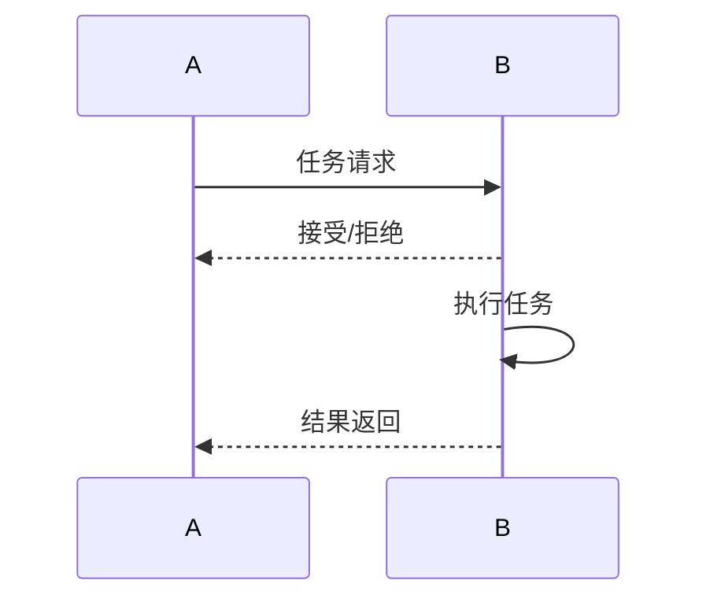

# A2A协议演进 特性跟踪

> 所属阶段: Flink/ai-ml/evolution | 前置依赖: [A2A Protocol][^1] | 形式化等级: L3

## 1. 概念定义 (Definitions)

### Def-F-A2A-01: Agent-to-Agent Protocol

Agent间协议：
$$
\text{A2A} : \text{Agent}_1 \leftrightarrow \text{Agent}_2
$$

## 2. 属性推导 (Properties)

### Prop-F-A2A-01: Interoperability

互操作性：
$$
\forall a_1, a_2 : \text{A2A}(a_1, a_2) = \text{Compatible}
$$

## 3. 关系建立 (Relations)

### A2A演进

| 版本 | 特性 | 状态 |
|------|------|------|
| 2.4 | 基础通信 | GA |
| 2.5 | 任务委托 | GA |
| 3.0 | 完整A2A | 设计中 |

## 4. 论证过程 (Argumentation)

### 4.1 A2A能力

| 能力 | 描述 |
|------|------|
| 发现 | Agent发现 |
| 任务 | 任务分配 |
| 协商 | 资源协商 |

## 5. 形式证明 / 工程论证

### 5.1 A2A消息

```java
A2AMessage msg = A2AMessage.builder()
    .from(agent1)
    .to(agent2)
    .task(task)
    .build();
```

## 6. 实例验证 (Examples)

### 6.1 Agent协作

```java
agent1.delegate(task, agent2);
```

## 7. 可视化 (Visualizations)



## 8. 引用参考 (References)

[^1]: Google A2A Protocol

---

## 跟踪信息

| 属性 | 值 |
|------|-----|
| 版本 | 2.4-3.0 |
| 当前状态 | 演进中 |
