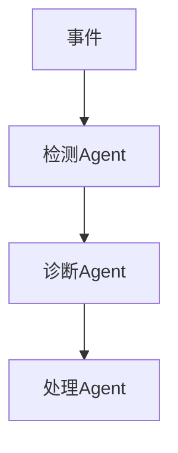

# AI Agent 2.5 演进 特性跟踪

> **状态**: 前瞻 | **预计发布时间**: 2026-09 | **最后更新**: 2026-04-12
>
> ⚠️ 本文档描述的特性处于早期讨论阶段，尚未正式发布。实现细节可能变更。

> 所属阶段: Flink/ai-ml/evolution | 前置依赖: [AI Agent 2.4][^1] | 形式化等级: L3

## 1. 概念定义 (Definitions)

### Def-F-AI-25-01: Multi-Agent System

多Agent系统：
$$
\text{MultiAgent} = \{ \text{Agent}_1, \text{Agent}_2, ..., \text{Agent}_n \}
$$

## 2. 属性推导 (Properties)

### Prop-F-AI-25-01: Agent Coordination

Agent协调：
$$
\text{Coordination} : \text{Agents} \to \text{GlobalGoal}
$$

## 3. 关系建立 (Relations)

### 2.5 Agent特性

| 特性 | 描述 | 状态 |
|------|------|------|
| 多Agent | 协作系统 | GA |
| 记忆增强 | 长期记忆 | GA |
| 学习优化 | RL微调 | GA |

## 4. 论证过程 (Argumentation)

### 4.1 多Agent协作

| Agent角色 | 职责 |
|-----------|------|
| 检测Agent | 异常发现 |
| 诊断Agent | 根因分析 |
| 处理Agent | 执行修复 |

## 5. 形式证明 / 工程论证

### 5.1 Agent协作

```java
MultiAgentSystem system = MultiAgentSystem.builder()
    .addAgent("detector", detectorAgent)
    .addAgent("diagnoser", diagnoserAgent)
    .build();
```

## 6. 实例验证 (Examples)

### 6.1 协作示例

```java
system.coordinate(event, (detector, diagnoser) -> {
    Alert alert = detector.detect(event);
    return diagnoser.diagnose(alert);
});
```

## 7. 可视化 (Visualizations)



## 8. 引用参考 (References)

[^1]: Flink AI Agent Documentation

---

## 跟踪信息

| 属性 | 值 |
|------|-----|
| 目标版本 | Flink 2.5 |
| 当前状态 | GA |
