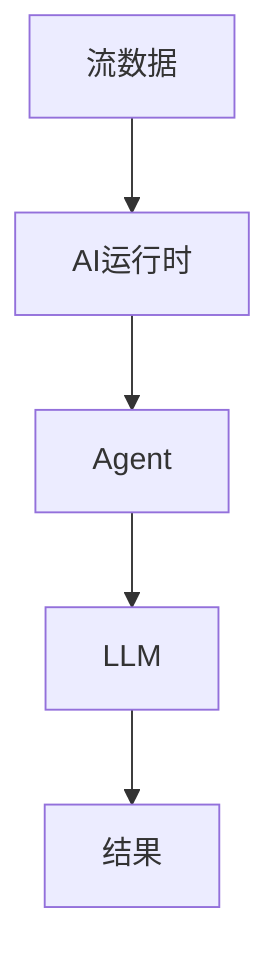

# AI Agent 3.0 演进 特性跟踪

> **状态**: 前瞻 | **预计发布时间**: 2027-Q1 | **最后更新**: 2026-04-12
>
> ⚠️ 本文档描述的特性处于早期讨论阶段，尚未正式发布。实现细节可能变更。

> 所属阶段: Flink/ai-ml/evolution | 前置依赖: [AI Agent 2.5][^1] | 形式化等级: L4

## 1. 概念定义 (Definitions)

### Def-F-AI-30-01: Native AI Support

原生AI支持：
$$
\text{NativeAI} = \text{FirstClassAgent} + \text{LLMRuntime} + \text{VectorStore}
$$

## 2. 属性推导 (Properties)

### Prop-F-AI-30-01: Low Latency Inference

低延迟推理：
$$
\text{Latency} < 100ms
$$

## 3. 关系建立 (Relations)

### 3.0 Agent特性

| 特性 | 描述 | 状态 |
|------|------|------|
| 原生Agent | 内置运行时 | 设计中 |
| 流式LLM | 增量生成 | 设计中 |
| 自动优化 | 自适应Agent | 设计中 |

## 4. 论证过程 (Argumentation)

### 4.1 原生Agent架构

```
Flink Core → AI Runtime → Agent Framework → LLM Gateway
```

## 5. 形式证明 / 工程论证

### 5.1 原生Agent API

```java
@Agent
public class AnomalyDetector {
    @LLM(model = "gpt-4")
    @Prompt("检测异常: {data}")
    public Alert detect(String data) { }
}
```

## 6. 实例验证 (Examples)

### 6.1 声明式Agent

```java
stream.processWithAgent(AnomalyDetector.class)
    .toSink(AlertSink.class);
```

## 7. 可视化 (Visualizations)



## 8. 引用参考 (References)

[^1]: Flink AI Native Documentation

---

## 跟踪信息

| 属性 | 值 |
|------|-----|
| 目标版本 | Flink 3.0 |
| 当前状态 | 设计中 |
