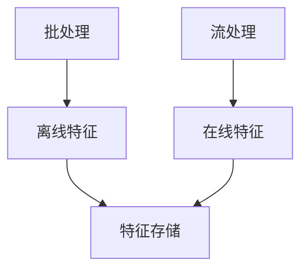

# 特征存储集成演进 特性跟踪

> 所属阶段: Flink/ai-ml/evolution | 前置依赖: [Feature Store][^1] | 形式化等级: L3

## 1. 概念定义 (Definitions)

### Def-F-FS-01: Feature Store

特征存储：
$$
\text{FeatureStore} = \text{OfflineStore} + \text{OnlineStore}
$$

## 2. 属性推导 (Properties)

### Prop-F-FS-01: Feature Consistency

特征一致性：
$$
\text{Offline} = \text{Online}
$$

## 3. 关系建立 (Relations)

### 特征存储演进

| 版本 | 特性 | 状态 |
|------|------|------|
| 2.4 | Tecton集成 | GA |
| 2.5 | Feast集成 | GA |
| 3.0 | 内置特征存储 | 设计中 |

## 4. 论证过程 (Argumentation)

### 4.1 特征类型

| 类型 | 时效性 | 存储 |
|------|--------|------|
| 离线 | 批 | 数据湖 |
| 在线 | 实时 | Redis |

## 5. 形式证明 / 工程论证

### 5.1 特征获取

```java
// [伪代码片段 - 不可直接运行] 仅展示核心逻辑
FeatureVector fv = featureStore.getOnlineFeatures(entityId, features);
```

## 6. 实例验证 (Examples)

### 6.1 流式特征

```java
// [伪代码片段 - 不可直接运行] 仅展示核心逻辑
stream.map(event -> {
    return enrich(event, featureStore);
});
```

## 7. 可视化 (Visualizations)



## 8. 引用参考 (References)

[^1]: Feature Store Documentation

---

## 跟踪信息

| 属性 | 值 |
|------|-----|
| 版本 | 2.4-3.0 |
| 当前状态 | 演进中 |
