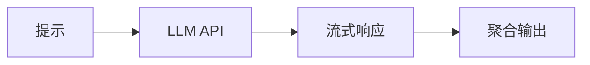

# 大模型集成演进 特性跟踪

> 所属阶段: Flink/ai-ml/evolution | 前置依赖: [LLM Integration][^1] | 形式化等级: L3

## 1. 概念定义 (Definitions)

### Def-F-LLM-01: LLM Inference

LLM推理：
$$
\text{LLM} : \text{Prompt} \to \text{Completion}
$$

### Def-F-LLM-02: Streaming Tokens

流式Token：
$$
\text{Stream} : \text{Token}_1, \text{Token}_2, ...
$$

## 2. 属性推导 (Properties)

### Prop-F-LLM-01: Token Throughput

Token吞吐量：
$$
\text{Tokens/sec} > 1000
$$

## 3. 关系建立 (Relations)

### LLM集成演进

| 版本 | 特性 | 状态 |
|------|------|------|
| 2.4 | API调用 | GA |
| 2.5 | 流式生成 | GA |
| 3.0 | 本地推理 | 设计中 |

## 4. 论证过程 (Argumentation)

### 4.1 支持模型

| 模型 | 提供商 | 状态 |
|------|--------|------|
| GPT-4 | OpenAI | 集成 |
| Claude | Anthropic | 集成 |
| Llama | Meta | 本地 |

## 5. 形式证明 / 工程论证

### 5.1 流式LLM

```java
llmClient.completeStream(prompt, token -> {
    output.collect(token);
});
```

## 6. 实例验证 (Examples)

### 6.1 批量提示

```java
stream.map(new LLMMapFunction("gpt-4", promptTemplate));
```

## 7. 可视化 (Visualizations)



## 8. 引用参考 (References)

[^1]: LLM Integration Documentation

---

## 跟踪信息

| 属性 | 值 |
|------|-----|
| 版本 | 2.4-3.0 |
| 当前状态 | 演进中 |
