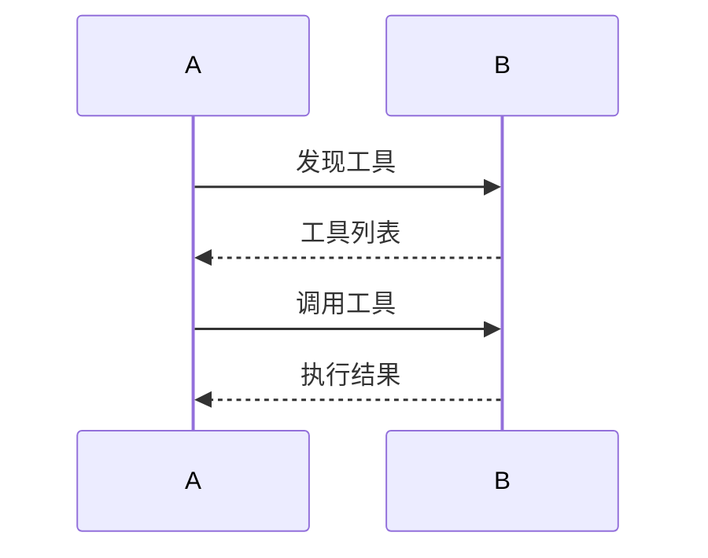

# MCP协议演进 特性跟踪

> 所属阶段: Flink/ai-ml/evolution | 前置依赖: [MCP Protocol][^1] | 形式化等级: L3

## 1. 概念定义 (Definitions)

### Def-F-MCP-01: Model Context Protocol

模型上下文协议：
$$
\text{MCP} = \langle \text{Tools}, \text{Resources}, \text{Prompts} \rangle
$$

## 2. 属性推导 (Properties)

### Prop-F-MCP-01: Tool Discovery

工具发现：
$$
\text{Discover} : \text{Server} \to \{\text{Tool}_i\}
$$

## 3. 关系建立 (Relations)

### MCP演进

| 版本 | 特性 | 状态 |
|------|------|------|
| 2.4 | 基础MCP | GA |
| 2.5 | 增强工具 | GA |
| 3.0 | 原生MCP | 设计中 |

## 4. 论证过程 (Argumentation)

### 4.1 MCP架构

```
Flink Agent ↔ MCP Server ↔ External Tools
```

## 5. 形式证明 / 工程论证

### 5.1 MCP客户端

```java
MCPClient client = MCPClient.connect("http://mcp-server:8080");
List<Tool> tools = client.discoverTools();
```

## 6. 实例验证 (Examples)

### 6.1 工具调用

```java
ToolResult result = client.callTool("query_database", params);
```

## 7. 可视化 (Visualizations)



## 8. 引用参考 (References)

[^1]: MCP Specification

---

## 跟踪信息

| 属性 | 值 |
|------|-----|
| 版本 | 2.4-3.0 |
| 当前状态 | 演进中 |
