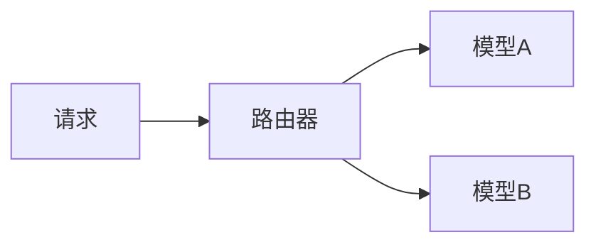

# 模型服务集成演进 特性跟踪

> 所属阶段: Flink/ai-ml/evolution | 前置依赖: [Model Serving][^1] | 形式化等级: L3

## 1. 概念定义 (Definitions)

### Def-F-Serving-01: Model Serving

模型服务：
$$
\text{Serving} : \text{Model} \times \text{Version} \to \text{Endpoint}
$$

## 2. 属性推导 (Properties)

### Prop-F-Serving-01: A/B Testing

A/B测试：
$$
\text{Traffic} = \alpha \cdot \text{Model}_A + (1-\alpha) \cdot \text{Model}_B
$$

## 3. 关系建立 (Relations)

### 模型服务演进

| 版本 | 特性 | 状态 |
|------|------|------|
| 2.4 | 本地模型 | GA |
| 2.5 | 模型注册 | GA |
| 3.0 | 完整MLOps | 设计中 |

## 4. 论证过程 (Argumentation)

### 4.1 服务架构

```
Flink → Model Registry → Model Server → Inference
```

## 5. 形式证明 / 工程论证

### 5.1 模型路由

```java
// [伪代码片段 - 不可直接运行] 仅展示核心逻辑
ModelRouter router = new ModelRouter()
    .addModel("v1", model1, 0.5)
    .addModel("v2", model2, 0.5);
```

## 6. 实例验证 (Examples)

### 6.1 动态加载

```java
// [伪代码片段 - 不可直接运行] 仅展示核心逻辑
ModelVersion version = registry.getLatest("fraud-detection");
Model model = loader.load(version);
```

## 7. 可视化 (Visualizations)



## 8. 引用参考 (References)

[^1]: Model Serving Documentation

---

## 跟踪信息

| 属性 | 值 |
|------|-----|
| 版本 | 2.4-3.0 |
| 当前状态 | 演进中 |
