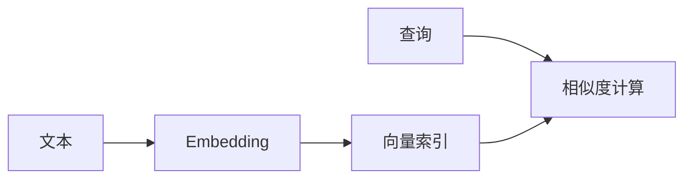

# 向量搜索演进 特性跟踪

> 所属阶段: Flink/ai-ml/evolution | 前置依赖: [Vector Search][^1] | 形式化等级: L3

## 1. 概念定义 (Definitions)

### Def-F-Vector-01: Vector Embedding

向量嵌入：
$$
\text{Embedding} : \text{Text} \to \mathbb{R}^n
$$

### Def-F-Vector-02: Similarity Search

相似性搜索：
$$
\text{Search} : \text{Query} \times \text{Corpus} \to \text{TopK}
$$

## 2. 属性推导 (Properties)

### Prop-F-Vector-01: Search Latency

搜索延迟：
$$
T_{\text{search}} < 10ms
$$

## 3. 关系建立 (Relations)

### 向量搜索演进

| 版本 | 特性 | 状态 |
|------|------|------|
| 2.4 | 外部集成 | GA |
| 2.5 | Milvus连接器 | GA |
| 3.0 | 内置向量索引 | 设计中 |

## 4. 论证过程 (Argumentation)

### 4.1 向量数据库

| 数据库 | 类型 | 状态 |
|--------|------|------|
| Milvus | 专用 | 集成 |
| Pinecone | 托管 | 集成 |
| PGVector | 扩展 | 集成 |

## 5. 形式证明 / 工程论证

### 5.1 向量索引

```java
// [伪代码片段 - 不可直接运行] 仅展示核心逻辑
VectorIndex index = new HNSWIndex.Builder()
    .withDimension(768)
    .withM(16)
    .build();
```

## 6. 实例验证 (Examples)

### 6.1 向量查询

```java
// [伪代码片段 - 不可直接运行] 仅展示核心逻辑
List<Vector> results = index.search(queryVector, 10);
```

## 7. 可视化 (Visualizations)



## 8. 引用参考 (References)

[^1]: Vector Search Documentation

---

## 跟踪信息

| 属性 | 值 |
|------|-----|
| 版本 | 2.4-3.0 |
| 当前状态 | 演进中 |

---

*文档版本: v1.0 | 创建日期: 2026-04-19*
