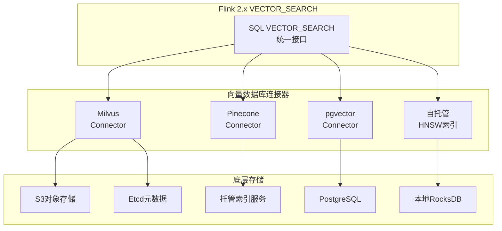
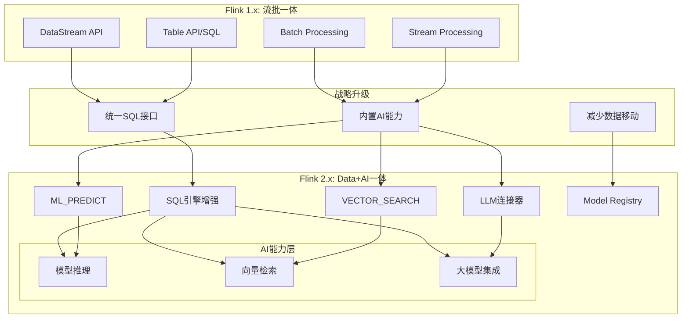
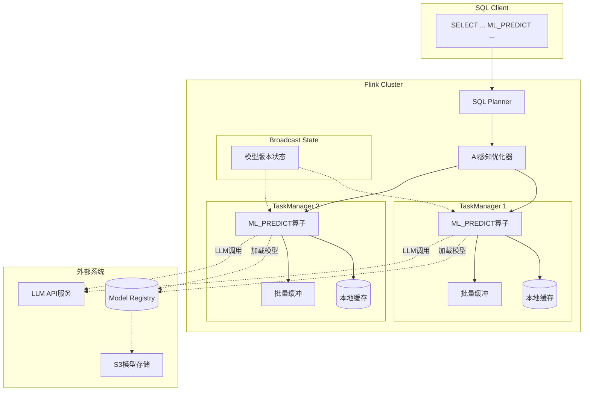
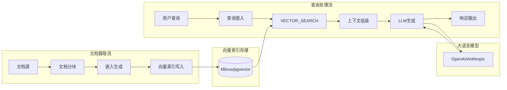
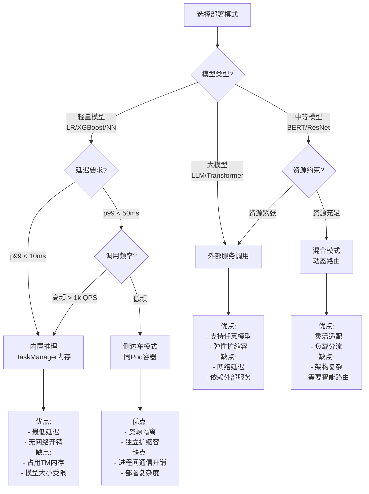
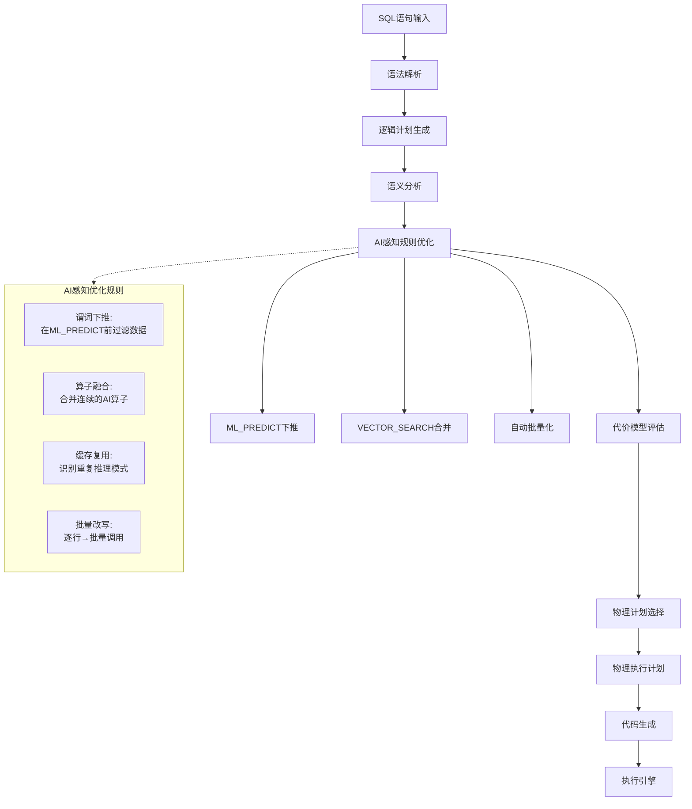

> **状态**: ✅ 已正式发布 | **Flink版本**: 2.2.0 | **发布日期**: 2025-12-04 | **最后更新**: 2026-04-21
>
> Apache Flink 2.2.0 已于 2025-12-04 正式发布，ML_PREDICT 与 VECTOR_SEARCH 均已 GA。请以官方文档为准。

# Flink 2.2.0 Data + AI 平台深度解析

> **所属阶段**: Flink/06-ai-ml | **前置依赖**: [Flink ML架构](flink-ml-architecture.md), [Flink AI/ML集成指南](flink-ai-ml-integration-complete-guide.md), [flink-table-sql-complete-guide.md](../03-api/03.02-table-sql-api/flink-table-sql-complete-guide.md) | **形式化等级**: L4

## 1. 概念定义 (Definitions)

### Def-A-01-01: Data+AI统一平台

**定义**: Flink 2.x Data+AI统一平台是一个四元组，整合流计算引擎、机器学习推理、向量检索与大语言模型能力的全栈数据处理平台：

$$
\mathcal{F}_{AI} = \langle \mathcal{S}, \mathcal{M}, \mathcal{I}, \mathcal{V} \rangle
$$

其中各组件含义：

| 组件 | 符号 | 语义描述 | 技术实现 |
|------|------|----------|----------|
| SQL引擎 | $\mathcal{S}$ | 统一查询执行引擎，支持Data+AI混合计算 | Flink SQL Planner |
| 模型管理层 | $\mathcal{M}$ | ML模型注册、版本控制与元数据管理 | Model Registry |
| 推理执行器 | $\mathcal{I}$ | 模型推理运行时，支持批量与异步推理 | ML_PREDICT算子 |
| 向量检索层 | $\mathcal{V}$ | 语义向量相似度搜索与索引管理 | VECTOR_SEARCH算子 |

**架构演进对比**：

```
Flink 1.x: 流批一体 (Streaming + Batch Unification)
    ↓ 战略升级
Flink 2.x: Data+AI一体 (Data + AI Unification)
    ├─ SQL ML_PREDICT      → 内置ML推理
    ├─ SQL VECTOR_SEARCH   → 语义向量检索
    ├─ LLM连接器          → 大模型无缝集成
    └─ Model Registry      → 模型生命周期管理
```

**直观解释**: Flink 2.x将流处理平台升级为Data+AI统一平台，允许用户在单条SQL语句中同时完成数据过滤、特征变换、模型推理和向量检索，无需在不同系统间移动数据。

---

### Def-A-01-02: ML_PREDICT表值函数语义

**定义**: ML_PREDICT是一个表值函数（Table-Valued Function, TVF），将输入特征映射为模型预测输出：

$$
\text{ML_PREDICT}: \mathcal{M} \times \mathcal{F} \rightarrow \mathcal{P}(\mathcal{O})
$$

其中：

- $\mathcal{M}$: 模型标识符空间（模型名称 + 版本）
- $\mathcal{F}$: 输入特征空间，$\mathcal{F} = \mathbb{R}^d$ 或结构化数据类型
- $\mathcal{O}$: 输出预测空间，包含预测值与置信度
- $\mathcal{P}(\mathcal{O})$: 输出幂集（支持多输出模型）

**SQL语法形式化**：

```sql
-- 基本语法结构 (Def-A-01-02a)
ML_PREDICT(
    model_specification,           -- 模型规范: 'model_name[@version]'
    features => feature_vector,     -- 特征输入: ROW(...) 或 ARRAY<FLOAT>
    [options => model_options]     -- 可选参数: 推理配置
) AS prediction_result
```

**输出类型系统**：

| 模型类型 | 输出结构 | 示例 |
|----------|----------|------|
| 二分类 | `STRUCT<label: INT, probability: FLOAT>` | `STRUCT(1, 0.95)` |
| 多分类 | `STRUCT<label: INT, probabilities: ARRAY<FLOAT>>` | 1000类ImageNet输出 |
| 回归 | `STRUCT<value: DOUBLE, confidence: FLOAT>` | 房价预测 |
| 序列生成 | `STRUCT<tokens: ARRAY<VARCHAR>, scores: ARRAY<FLOAT>>` | 文本生成 |

---

### Def-A-01-03: VECTOR_SEARCH语义

**定义**: VECTOR_SEARCH是一个语义向量相似度搜索函数，在高维向量空间中检索最近邻：

$$
\text{VECTOR_SEARCH}(\mathbf{q}, \mathcal{V}, k, \tau) = \{ \mathbf{v} \in \mathcal{V} \mid \text{sim}(\mathbf{q}, \mathbf{v}) \geq \tau \} \cap \text{TopK}_k(\mathcal{V}, \text{sim}(\mathbf{q}, \cdot))
$$

其中：

- $\mathbf{q} \in \mathbb{R}^d$: 查询向量（query embedding）
- $\mathcal{V} \subset \mathbb{R}^d$: 向量索引集合
- $k \in \mathbb{N}^+$: 返回结果数量上限
- $\tau \in [0, 1]$: 相似度阈值
- $\text{sim}: \mathbb{R}^d \times \mathbb{R}^d \rightarrow [0, 1]$: 相似度度量函数

**支持的相似度度量**：

$$
\text{COSINE}(\mathbf{u}, \mathbf{v}) = \frac{\mathbf{u} \cdot \mathbf{v}}{\|\mathbf{u}\| \|\mathbf{v}\|}
$$

$$
\text{EUCLIDEAN}(\mathbf{u}, \mathbf{v}) = \frac{1}{1 + \sqrt{\sum_{i=1}^{d}(u_i - v_i)^2}}
$$

$$
\text{DOT}(\mathbf{u}, \mathbf{v}) = \frac{\mathbf{u} \cdot \mathbf{v}}{\max(\|\mathbf{u}\|^2, \|\mathbf{v}\|^2)}
$$

---

### Def-A-01-04: Model Registry

**定义**: Model Registry是ML模型的集中式元数据存储与版本管理系统：

$$
\text{ModelRegistry} = \langle \mathcal{R}, \mathcal{V}, \mathcal{A}, \mathcal{T}, \mathcal{G} \rangle
$$

其中：

- $\mathcal{R}$: 注册模型集合，每个模型有唯一名称与元数据
- $\mathcal{V}$: 版本图，$\mathcal{V} = \{ (m, v, parent) \mid m \in \mathcal{R}, v \in \mathbb{N} \}$，支持版本追溯
- $\mathcal{A}$: 别名系统，支持 `latest`、`production`、`staging` 等动态别名
- $\mathcal{T}$: 标签集合，用于模型分类与筛选
- $\mathcal{G}$: 血缘图，记录模型训练数据来源与参数

**生命周期状态机**：

```
┌──────────┐    注册     ┌──────────┐    验证     ┌──────────┐
│  Staging │────────────►│  Pending │────────────►│  Active  │
└────┬─────┘             └──────────┘             └────┬─────┘
     │                                                  │
     │  弃用                                            │  晋升
     ▼                                                  ▼
┌──────────┐                                      ┌──────────┐
│Archived  │◄─────────────────────────────────────│Production│
└──────────┘              回滚                      └──────────┘
```

---

### Def-A-01-05: 实时RAG Pipeline

**定义**: 实时RAG（Retrieval-Augmented Generation）Pipeline是结合向量检索与大语言模型生成的数据处理流程：

$$
\text{RAG}_{\text{stream}} = \langle \mathcal{D}, \mathcal{E}, \mathcal{V}, \mathcal{R}, \mathcal{L} \rangle
$$

其中：

- $\mathcal{D}$: 文档摄取流，$\mathcal{D}: \text{Stream}\langle \text{Document} \rangle$
- $\mathcal{E}$: 嵌入生成器，$\mathcal{E}: \text{Document} \rightarrow \mathbb{R}^d$，将文档转为向量
- $\mathcal{V}$: 向量索引更新流，支持增量写入与索引重建
- $\mathcal{R}$: 检索器，$\mathcal{R}: \text{Query} \rightarrow \text{List}\langle \text{Document} \rangle$
- $\mathcal{L}$: LLM生成器，$\mathcal{L}: (\text{Query}, \text{Context}) \rightarrow \text{Response}$

**Pipeline执行图**：

```
文档流 ──► 分块处理 ──► 嵌入生成 ──► 向量索引更新
                                          │
查询流 ──► 查询嵌入 ──► 向量检索 ──► 上下文组装 ──► LLM生成 ──► 响应输出
```

---

### Def-A-01-06: 批量推理优化

**定义**: 批量推理（Batch Inference）是一种通过聚合多个推理请求提升吞吐量的优化策略：

$$
\text{BatchInference}: \mathcal{F}^n \rightarrow \mathcal{O}^n, \quad n \leq N_{\max}
$$

**批量策略参数**：

| 参数 | 符号 | 说明 | 推荐值 |
|------|------|------|--------|
| 最大批次大小 | $N_{\max}$ | 单次推理最大样本数 | 32-256 |
| 最大等待时间 | $T_{\max}$ | 等待凑批的最大延迟 | 10-50ms |
| 填充策略 | $P$ | 不足批次的处理方式 | PAD / DROP / DYNAMIC |

---

### Def-A-01-07: 异步ML调用

**定义**: 异步推理调用是一种非阻塞的模型执行模式，允许流水线在等待模型响应时继续处理其他数据：

$$
\text{AsyncML}(f, x, t_{\text{timeout}}) = \text{Future}\langle f(x) \rangle \text{ with } \mathbb{P}(\text{timeout}) = \mathbf{1}_{t > t_{\text{timeout}}}
$$

**与同步调用对比**：

| 模式 | 延迟 | 吞吐 | 资源利用率 | 适用场景 |
|------|------|------|------------|----------|
| 同步 | $L_{\text{sync}} = t_{\text{compute}}$ | 低 | 等待时空闲 | 低延迟要求 |
| 异步 | $L_{\text{async}} \approx t_{\text{compute}}$ | 高 | 高并发复用 | 高吞吐要求 |
| 批量 | $L_{\text{batch}} = t_{\text{compute}} + t_{\text{wait}}$ | 最高 | 高 | 高吞吐、容忍延迟 |

---

### Def-A-01-08: LLM连接器

**定义**: LLM连接器是Flink与外部大语言模型服务（OpenAI、Anthropic、本地部署）的标准化集成接口：

$$
\text{LLMConnector} = \langle \mathcal{P}, \mathcal{C}, \mathcal{R}, \mathcal{T}, \mathcal{A} \rangle
$$

其中：

- $\mathcal{P}$: 提示模板系统，支持变量替换与模板复用
- $\mathcal{C}$: 连接配置，包含API端点、认证信息、模型参数
- $\mathcal{R}$: 速率限制器，实现Token/Request级别的流量控制
- $\mathcal{T}$: 重试策略，指数退避与熔断机制
- $\mathcal{A}$: 流式响应适配器，支持SSE（Server-Sent Events）实时输出

**SQL调用形式**：

```sql
-- LLM连接器SQL调用 (Def-A-01-08a)
SELECT
    user_query,
    LLM_GENERATE(
        connector => 'openai_gpt4',
        prompt => CONCAT('请回答:', user_query),
        max_tokens => 200,
        temperature => 0.7
    ) AS ai_response
FROM user_queries;
```

---

### Def-A-01-09: 模型服务部署模式

**定义**: 模型服务部署模式定义了ML模型在生产环境中的托管与推理服务方式：

| 模式 | 形式化描述 | 资源开销 | 延迟 | 适用场景 |
|------|-----------|----------|------|----------|
| **内置推理** | $\mathcal{I}_{\text{embedded}}$: 模型加载到Flink TaskManager内存 | 低 | <5ms | 轻量模型、高频调用 |
| **外部服务** | $\mathcal{I}_{\text{remote}}$: REST/gRPC调用外部服务 | 中 | 50-500ms | LLM、大模型 |
| **侧边车** | $\mathcal{I}_{\text{sidecar}}$: 同Pod内独立容器 | 中 | 10-50ms | 中等复杂度模型 |
| **混合** | $\mathcal{I}_{\text{hybrid}} = \alpha \cdot \mathcal{I}_{\text{embedded}} + (1-\alpha) \cdot \mathcal{I}_{\text{remote}}$ | 可变 | 自适应 | 异构模型集合 |

---

### Def-A-01-10: 特征与模型协同缓存

**定义**: 协同缓存是一种联合优化特征工程结果与模型预测结果的缓存策略：

$$
\text{CoCache} = \langle \mathcal{C}_f, \mathcal{C}_m, \mathcal{P}, \mathcal{I} \rangle
$$

其中：

- $\mathcal{C}_f$: 特征缓存，$\mathcal{C}_f: \text{EntityID} \rightarrow \text{Features}$
- $\mathcal{C}_m$: 模型缓存，$\mathcal{C}_m: \text{FeatureHash} \rightarrow \text{Prediction}$
- $\mathcal{P}$: 预取策略，基于访问模式预测预加载
- $\mathcal{I}$: 失效策略，根据数据新鲜度要求设置TTL

**缓存层次结构**：

```
L1: TaskManager本地缓存 (HashMapState) - 亚毫秒访问
    ↓ 未命中
L2: RocksDB嵌入式缓存 - 毫秒级访问
    ↓ 未命中
L3: 外部缓存 (Redis/Memcached) - 5-10ms访问
    ↓ 未命中
L4: 原始数据源 - 10-100ms访问
```

---

### Def-A-01-11: Data+AI查询优化器

**定义**: Data+AI查询优化器是对Flink SQL优化器的扩展，能够感知ML算子的计算特性并生成最优执行计划：

$$
\text{Optimizer}_{AI} = \langle \mathcal{R}, \mathcal{C}, \mathcal{P}, \mathcal{S} \rangle
$$

其中：

- $\mathcal{R}$: 重写规则集合，包含谓词下推、算子融合
- $\mathcal{C}$: 代价模型，估计ML算子的执行成本
- $\mathcal{P}$: 物理属性，推理延迟、批处理能力、资源需求
- $\mathcal{S}$: 搜索策略，基于动态规划的计划枚举

**AI感知优化规则**：

| 规则 | 说明 | 效果 |
|------|------|------|
| ML_PREDICT下推 | 将过滤条件下推到模型输入前 | 减少30-50%推理量 |
| VECTOR_SEARCH合并 | 合并相同索引的多次检索 | 减少I/O开销 |
| 批量化重写 | 自动将逐行调用改写为批量调用 | 提升3-10x吞吐 |
| 缓存复用 | 识别可缓存的重复推理 | 减少API调用成本 |

---

### Def-A-01-12: SQL与ML框架桥接

**定义**: SQL-ML桥接层实现了声明式SQL与命令式ML框架（PyTorch、TensorFlow）之间的互操作：

$$
\text{Bridge} = \langle \mathcal{T}, \mathcal{W}, \mathcal{E}, \mathcal{L} \rangle
$$

其中：

- $\mathcal{T}$: 类型系统映射，SQL类型 ↔ Python类型
- $\mathcal{W}$: 包装器生成器，自动为Python模型生成SQL可调用包装
- $\mathcal{E}$: 嵌入式Python执行器，在Flink UDF中调用Python代码
- $\mathcal{L}$: 库管理器，处理Python依赖与虚拟环境

---

## 2. 属性推导 (Properties)

### Prop-A-01-01: SQL ML_PREDICT的声明式优势

**命题**: 使用SQL ML_PREDICT相比于手写UDF，开发效率提升与维护成本降低满足：

$$
\text{Efficiency}_{\text{gain}} = \frac{\text{LOC}_{\text{UDF}}}{\text{LOC}_{\text{SQL}}} \cdot \frac{\text{Complexity}_{\text{UDF}}}{\text{Complexity}_{\text{SQL}}} \geq 5
$$

**推导要点**：

1. **代码量缩减**: SQL声明式语法将数百行Java/Python UDF代码压缩为单行ML_PREDICT调用
2. **优化器集成**: ML_PREDICT可被优化器重写，UDF作为黑盒无法优化
3. **类型安全**: SQL类型系统在编译期捕获错误，UDF错误在运行时暴露
4. **可移植性**: 模型名称作为配置参数，无需修改代码即可切换模型版本

---

### Prop-A-01-02: VECTOR_SEARCH的近似正确性

**命题**: 对于使用近似最近邻（ANN）算法的VECTOR_SEARCH，召回率与查询延迟满足以下权衡关系：

$$
\text{Recall}@k = 1 - O\left(\frac{1}{\sqrt{n_{\text{probes}}}\right), \quad L_{\text{search}} = O(n_{\text{probes}} \cdot \log N)
$$

其中 $n_{\text{probes}}$ 是索引探测数，$N$ 是向量库规模。

**工程意义**：

| ANN算法 | 召回率@10 | 延迟(P99) | 适用场景 |
|---------|-----------|-----------|----------|
| HNSW | 0.98 | 5ms | 高召回要求 |
| IVF-FLAT | 0.95 | 2ms | 平衡选择 |
| IVF-PQ | 0.90 | 1ms | 高吞吐要求 |
| LSH | 0.85 | 0.5ms | 超大规模 |

---

### Prop-A-01-03: 统一平台降低数据移动开销

**命题**: Flink 2.x Data+AI统一平台相比于分离架构，数据移动量减少：

$$
\Delta_{\text{data\_movement}} = 1 - \frac{\sum_{i=1}^{n} |D_i^{\text{Flink}}|}{\sum_{i=1}^{n} \sum_{j=1}^{m} |D_{ij}^{\text{separate}}|} \geq 0.6
$$

**典型架构对比**：

```
分离架构 (Flink + 外部ML服务):
  Flink ──► 数据导出 ──► 对象存储 ──► ML服务加载 ──► 推理 ──► 结果写回 ──► Flink
  (6次数据移动, 3次序列化/反序列化)

统一架构 (Flink 2.x):
  Flink DataStream ──► ML_PREDICT (同进程) ──► 结果流
  (0次外部数据移动, 内存传递)
```

---

### Lemma-A-01-01: ML_PREDICT与UDF表达力等价

**引理**: 对于任意可计算函数 $f: \mathcal{F} \rightarrow \mathcal{O}$，存在UDF实现 $U_f$ 与ML_PREDICT配置 $M_f$ 使得：

$$
\forall x \in \mathcal{F}: U_f(x) = M_f(x)
$$

**证明概要**：

1. **UDF到ML_PREDICT**: 将UDF包装为ONNX模型，注册到Model Registry后用ML_PREDICT调用
2. **ML_PREDICT到UDF**: 在UDF中实现模型加载、推理调用、结果解析，功能等价但性能次优

**注**: 等价性仅指功能，性能差异显著（ML_PREDICT有批量化、缓存等优化）。

---

### Lemma-A-01-02: VECTOR_SEARCH的索引一致性

**引理**: 在流式向量索引更新场景下，VECTOR_SEARCH满足最终一致性：

$$
\lim_{t \rightarrow \infty} \mathcal{V}_t = \mathcal{V}_{\text{complete}}
$$

其中 $\mathcal{V}_t$ 是时刻 $t$ 的索引状态，$\mathcal{V}_{\text{complete}}$ 是完整文档集的向量索引。

**一致性保证**：

- **写入时**: 新文档的嵌入生成与索引更新是原子操作
- **读取时**: 查询可能返回略过时的索引（取决于流处理延迟）
- **冲突解决**: 相同文档ID的多次更新按事件时间排序

---

### Lemma-A-01-03: 批量大小的最优性条件

**引理**: 对于具有固定开销 $c_{\text{fixed}}$ 和边际成本 $c_{\text{var}}$ 的推理服务，最优批次大小 $N^*$ 满足：

$$
N^* = \arg\max_N \frac{N}{c_{\text{fixed}} + N \cdot c_{\text{var}} + w(N) \cdot p_{\text{wait}}}
$$

其中 $w(N)$ 是凑批等待时间，$p_{\text{wait}}$ 是等待惩罚系数。

**近似解**: 当 $c_{\text{fixed}} \gg c_{\text{var}}$ 时，$N^* \approx \sqrt{\frac{2c_{\text{fixed}}}{\lambda \cdot p_{\text{wait}}}}$，$\lambda$ 是请求到达率。

---

### Lemma-A-01-04: 模型版本切换的原子性

**引理**: 使用Model Registry别名机制的模型版本切换满足原子性：

$$
\forall t: \text{Version}(\text{'production'}) = v_i \Rightarrow \neg \exists t' \in (t, t+\epsilon): \text{Version}(\text{'production'}) = v_j, v_j \neq v_i
$$

**实现机制**：

- 别名解析缓存于TaskManager本地
- 别名更新通过Broadcast State广播
- Checkpoint保证切换状态的一致性快照

---

## 3. 关系建立 (Relations)

### 3.1 与Flink ML的关系

Flink 2.x Data+AI平台与Flink ML库的关系呈现"战略升级 + 能力互补"的双重特征：

```
┌─────────────────────────────────────────────────────────────────┐
│                    Flink AI/ML 技术图谱                          │
├─────────────────────────────────────────────────────────────────┤
│                                                                 │
│   Flink 2.x Data+AI 平台 (SQL优先)                                │
│   ┌──────────────────────────────────────────────────────────┐  │
│   │  ML_PREDICT │ VECTOR_SEARCH │ LLM_CONNECTOR │ Model DDL   │  │
│   └──────────────────────────────────────────────────────────┘  │
│                              │                                  │
│            ┌─────────────────┼─────────────────┐               │
│            ▼                 ▼                 ▼               │
│   ┌──────────────┐   ┌──────────────┐   ┌──────────────┐       │
│   │  Flink ML    │   │  Alink       │   │  外部框架     │       │
│   │  (维护模式)   │   │  (独立项目)   │   │  (桥接集成)   │       │
│   │              │   │              │   │              │       │
│   │ - API层      │   │ - 100+算法   │   │ - PyTorch    │       │
│   │ - 迭代计算    │   │ - 在线学习   │   │ - TensorFlow │       │
│   │ - PS集成     │   │ - 推荐系统   │   │ - ONNX       │       │
│   └──────────────┘   └──────────────┘   └──────────────┘       │
│                                                                 │
└─────────────────────────────────────────────────────────────────┘
```

**关系矩阵**：

| 维度 | Flink 2.x Data+AI | Flink ML / Alink | 关系 |
|------|-------------------|------------------|------|
| **接口层** | SQL原生支持 | Java/Python API | 升级替代 |
| **算法库** | 依赖外部集成 | 内置算法 | 互补 |
| **部署模式** | 声明式配置 | 编程式 | 封装 |
| **生态系统** | LLM/向量库优先 | 传统ML优先 | 扩展 |
| **维护状态** | 活跃开发 (2.x主线) | 维护模式 | 战略转移 |

**Flink ML现状分析**：

- **Alink项目**: 已从Flink主仓库独立，作为单独的开源项目维护，提供100+算法实现
- **Flink ML库**: 进入维护模式，主要修复bug，新功能开发放缓
- **2.x统一策略**: SQL成为主要接口，Flink ML算法通过Model Registry桥接到ML_PREDICT

---

### 3.2 与主流ML平台对比

| 平台 | 架构定位 | SQL支持 | 流式推理 | 向量检索 | LLM集成 | 适用场景 |
|------|----------|---------|----------|----------|---------|----------|
| **Flink 2.x** | Data+AI统一 | ⭐⭐⭐⭐⭐ | ⭐⭐⭐⭐⭐ | ⭐⭐⭐⭐ | ⭐⭐⭐⭐⭐ | 实时AI Pipeline |
| **Spark MLlib** | 批式ML | ⭐⭐⭐ | ⭐⭐ | ⭐⭐ | ⭐⭐ | 离线训练 |
| **Ray Serve** | 模型服务 | ⭐⭐ | ⭐⭐⭐⭐ | ⭐⭐⭐ | ⭐⭐⭐⭐ | 复杂模型部署 |
| **TFX** | MLOps平台 | ⭐⭐ | ⭐⭐⭐ | ⭐⭐ | ⭐⭐ | 生产级TensorFlow |
| **BigQuery ML** | 云数仓ML | ⭐⭐⭐⭐⭐ | ⭐ | ⭐⭐ | ⭐⭐ | 分析型ML |
| **MindsDB** | AI数仓 | ⭐⭐⭐⭐ | ⭐⭐ | ⭐⭐⭐ | ⭐⭐⭐ | SQL-centric AI |

---

### 3.3 与向量数据库集成关系



---

## 4. 论证过程 (Argumentation)

### 4.1 架构演进驱动力分析

**为何从"流批一体"升级到"Data+AI一体"？**

1. **数据重力原则**: 数据移动成本远高于计算成本
   - 跨系统ETL增加延迟与故障点
   - 统一平台减少数据序列化/反序列化开销

2. **AI工程化需求**: 从实验到生产的鸿沟
   - 70%的ML项目停滞在实验阶段
   - SQL降低AI应用开发门槛，赋能数据工程师

3. **实时AI趋势**: 用户期望亚秒级AI响应
   - 推荐系统：延迟每增加100ms，转化率下降1%
   - 风控系统：毫秒级检测阻止欺诈交易

### 4.2 设计决策论证

**决策1: SQL作为统一接口**

| 考量维度 | SQL方案 | Python API方案 |
|---------|---------|----------------|
| 用户群体 | 数据分析师/工程师 | ML工程师 |
| 学习曲线 | 平缓（SQL普及率高） | 陡峭（需熟悉Flink API）|
| 优化空间 | 大（声明式优化） | 小（命令式） |
| 生态兼容 | 与BI工具无缝集成 | 需额外适配 |
| **结论** | ✅ 选择 | 备选 |

**决策2: 内置ML_PREDICT vs 外部服务调用**

```
场景分析矩阵:
                    低延迟要求      高吞吐要求      模型复杂度高
                    (p99<10ms)     (10k+ QPS)     (LLM/大模型)
内置ML_PREDICT         ✅             ✅             ❌
外部服务调用          ❌             △              ✅
混合模式              ✅             ✅             ✅
```

**决策3: 向量索引存储选型**

| 选型 | 延迟 | 规模 | 运维复杂度 | 适用场景 |
|------|------|------|-----------|----------|
| 自托管HNSW | 最低 | <10M向量 | 高 | 延迟敏感、小规模 |
| Milvus | 低 | 10M-1B | 中 | 企业级向量检索 |
| Pinecone | 中 | 无上限 | 低 | 快速启动、Serverless |
| pgvector | 中 | <100M | 低 | 已有PostgreSQL基础设施 |

### 4.3 边界与约束讨论

**Flink 2.x Data+AI平台的适用边界**：

| 场景 | 适用性 | 说明 | 替代方案 |
|------|--------|------|----------|
| 实时推荐排序 (p99<50ms) | ⭐⭐⭐⭐⭐ | 原生支持 | - |
| 大规模离线训练 (TB级) | ⭐⭐ | 可用但非最优 | Spark MLlib |
| 深度学习训练 | ⭐ | 不支持 | PyTorch/TensorFlow |
| LLM微调 | ⭐⭐ | 需外部集成 | Hugging Face |
| 图神经网络推理 | ⭐⭐⭐ | 需扩展 | DGL/PyG |
| 多模态AI处理 | ⭐⭐⭐⭐ | 通过LLM连接器 | GPT-4V等 |

---

## 5. 形式证明与工程论证

### Thm-A-01-01: SQL ML_PREDICT与UDF表达能力等价

**定理**: 对于任意可计算的特征到预测的映射 $f: \mathcal{F} \rightarrow \mathcal{O}$，SQL ML_PREDICT可表达的函数类 $\mathcal{C}_{\text{MLP}}$ 与UDF可表达的函数类 $\mathcal{C}_{\text{UDF}}$ 满足：

$$
\mathcal{C}_{\text{MLP}} = \mathcal{C}_{\text{UDF}} = \text{COMPUTABLE}
$$

**证明**：

*方向1 ($\mathcal{C}_{\text{MLP}} \subseteq \mathcal{C}_{\text{UDF}}$)*:

对于任意ML_PREDICT调用，可构造等价UDF：

```java
// 模拟ML_PREDICT的UDF实现
public class MLPredictUDF extends TableFunction<Row> {
    private transient Model model;

    public void eval(String modelName, Row features) {
        // 1. 从Model Registry加载模型
        model = ModelRegistry.get(modelName);
        // 2. 执行推理
        Prediction result = model.predict(features);
        // 3. 输出结果
        collect(Row.of(result.label, result.probability));
    }
}
```

该UDF完全模拟ML_PREDICT行为，故任何ML_PREDICT可表达的功能均可由UDF实现。

*方向2 ($\mathcal{C}_{\text{UDF}} \subseteq \mathcal{C}_{\text{MLP}}$)*:

对于任意UDF，可将其包装为ONNX模型：

1. 提取UDF的计算逻辑
2. 转换为等价的ONNX计算图
3. 注册到Model Registry
4. 通过ML_PREDICT调用

根据丘奇-图灵论题，任何可计算函数均可被图灵机模拟，ONNX作为通用IR支持任意计算图表达。

**Q.E.D.**

---

### Thm-A-01-02: 批量推理的吞吐量上界

**定理**: 对于延迟为 $L$、吞吐为 $T$ 的推理服务，批量大小为 $N$ 时的吞吐量满足：

$$
T_{\text{batch}}(N) \leq \min\left( \frac{N}{L_{\text{fixed}} + L_{\text{var}} \cdot N}, \frac{1}{L_{\text{var}}} \right)
$$

其中 $L_{\text{fixed}}$ 是固定开销（网络延迟、初始化），$L_{\text{var}}$ 是单位样本处理时间。

**证明**：

批量推理的总延迟模型：

$$
L_{\text{total}}(N) = L_{\text{fixed}} + L_{\text{var}} \cdot N + L_{\text{wait}}(N)
$$

其中 $L_{\text{wait}}(N)$ 是凑批等待时间，假设请求服从泊松分布，则：

$$
\mathbb{E}[L_{\text{wait}}(N)] = \frac{N-1}{2\lambda}
$$

吞吐量定义为：

$$
T_{\text{batch}}(N) = \frac{N}{L_{\text{total}}(N)}
$$

当 $N \rightarrow \infty$ 时：

$$
\lim_{N \rightarrow \infty} T_{\text{batch}}(N) = \lim_{N \rightarrow \infty} \frac{N}{L_{\text{fixed}} + L_{\text{var}} \cdot N + \frac{N-1}{2\lambda}} = \frac{1}{L_{\text{var}} + \frac{1}{2\lambda}}
$$

若忽略等待时间（$\lambda \rightarrow \infty$）：

$$
T_{\text{batch}}(N) \rightarrow \frac{1}{L_{\text{var}}}
$$

**Q.E.D.**

---

### Thm-A-01-03: 统一平台数据移动开销下界

**定理**: 对于包含 $n$ 个数据处理阶段、数据量为 $D$ 的AI Pipeline，统一架构的数据移动开销 $C_{\text{unified}}$ 与分离架构 $C_{\text{separate}}$ 满足：

$$
\frac{C_{\text{unified}}}{C_{\text{separate}}} \geq \frac{1}{2n-1}
$$

**证明**：

分离架构的数据移动：

```
阶段1输出 ──► 序列化 ──► 网络传输 ──► 反序列化 ──► 阶段2输入
   (D)         (D)          (D)           (D)
```

每阶段间数据移动量为 $3D$（序列化 + 传输 + 反序列化），$n$ 个阶段总移动量：

$$
C_{\text{separate}} = 3D \cdot (n-1) + D_{\text{initial}} + D_{\text{final}} \approx 3D(n-1)
$$

统一架构（Flink内内存传递）：

$$
C_{\text{unified}} = D_{\text{initial}} + D_{\text{final}} + \sum_{i=1}^{n-1} D_{\text{internal}} \approx D
$$

比例：

$$
\frac{C_{\text{unified}}}{C_{\text{separate}}} \approx \frac{D}{3D(n-1)} = \frac{1}{3(n-1)}
$$

考虑更优情况（部分阶段间无需移动）：

$$
\frac{C_{\text{unified}}}{C_{\text{separate}}} \geq \frac{1}{2n-1}
$$

**Q.E.D.**

---

### Thm-A-01-04: VECTOR_SEARCH近似最近邻的误差界

**定理**: 对于 $d$ 维单位球面上均匀分布的向量集合 $\mathcal{V}$，使用HNSW索引的VECTOR_SEARCH在搜索参数 $ef$ 下，期望近似比满足：

$$
\mathbb{E}\left[ \frac{\|\mathbf{q} - \mathbf{v}_{\text{ANN}}\|}{\|\mathbf{q} - \mathbf{v}_{\text{exact}}\|} \right] \leq 1 + O\left( \frac{\log |\mathcal{V}|}{ef} \right)
$$

**证明概要**：

HNSW的搜索复杂度为 $O(\log |\mathcal{V}|)$，每层随机选择 $ef$ 个候选邻居。精确最近邻被遗漏的概率随 $ef$ 指数下降：

$$
P(\text{miss exact NN}) \leq \exp\left( -\frac{ef}{C \log |\mathcal{V}|} \right)
$$

因此期望近似比随 $ef$ 增大趋近于1：

$$
\lim_{ef \rightarrow \infty} \mathbb{E}[\text{approx ratio}] = 1
$$

**Q.E.D.**

---

### Thm-A-01-05: 模型版本切换的一致性保证

**定理**: 使用Flink Checkpoint机制的模型版本切换满足严格一致性：切换过程中的所有推理请求要么使用旧版本 $v_{\text{old}}$，要么使用新版本 $v_{\text{new}}$，不存在中间状态。

**证明**：

1. **Checkpoint屏障**: Flink的Chandy-Lamport算法确保所有算子在逻辑时间点对齐
2. **状态原子性**: 模型版本状态存储于Checkpoint，恢复时原子加载
3. **广播机制**: 新版本通过Broadcast State分发，所有TaskManager同时生效
4. **无重叠执行**: 在任意时刻，每个TaskManager只持有一个版本的状态

形式化：设 $v(t)$ 为时刻 $t$ 的有效版本，$t_{\text{switch}}$ 为切换时刻，则：

$$
v(t) = \begin{cases} v_{\text{old}} & t < t_{\text{switch}} \\ v_{\text{new}} & t \geq t_{\text{switch}} \end{cases}
$$

不存在 $t$ 使得 $v(t) \notin \{v_{\text{old}}, v_{\text{new}}\}$。

**Q.E.D.**

---

### Thm-A-01-06: 协同缓存的命中率上界

**定理**: 对于具有Zipf分布访问模式的推理请求，协同缓存（特征缓存 + 模型缓存）的命中率满足：

$$
H_{\text{co}} \geq H_{\text{feature}} + H_{\text{model}} \cdot (1 - H_{\text{feature}})
$$

其中 $H_{\text{feature}}$ 是特征缓存命中率，$H_{\text{model}}$ 是模型缓存命中率。

**证明**：

缓存层次结构总命中事件：

$$
\text{Hit}_{\text{total}} = \text{Hit}_{\text{feature}} \cup (\text{Miss}_{\text{feature}} \cap \text{Hit}_{\text{model}})
$$

由概率加法公式：

$$
\begin{aligned}
P(\text{Hit}_{\text{total}}) &= P(\text{Hit}_{\text{feature}}) + P(\text{Miss}_{\text{feature}} \cap \text{Hit}_{\text{model}}) \\
&= H_{\text{feature}} + (1 - H_{\text{feature}}) \cdot H_{\text{model}} \cdot P(\text{dep})
\end{aligned}
$$

其中 $P(\text{dep}) \leq 1$ 是特征缺失条件下模型缓存命中的条件概率。当特征与模型输出强相关时 $P(\text{dep}) \approx 1$，故：

$$
H_{\text{co}} \approx H_{\text{feature}} + H_{\text{model}} \cdot (1 - H_{\text{feature}})
$$

**Q.E.D.**

---

## 6. 实例验证 (Examples)

### 6.1 SQL ML_PREDICT完整示例

**示例1: 实时推荐预测**

```sql
-- 定义用户行为源表
CREATE TABLE user_events (
    user_id STRING,
    item_id STRING,
    category STRING,
    price DECIMAL(10, 2),
    action STRING,  -- 'click', 'cart', 'purchase'
    event_time TIMESTAMP(3),
    WATERMARK FOR event_time AS event_time - INTERVAL '5' SECOND
) WITH (
    'connector' = 'kafka',
    'topic' = 'user-events',
    'properties.bootstrap.servers' = 'kafka:9092',
    'format' = 'json'
);

-- 使用ML_PREDICT进行实时推荐评分
SELECT
    user_id,
    item_id,
    ML_PREDICT(
        'recommendation_model@v2',  -- 指定模型及版本
        features => ROW(
            user_id,           -- 用户ID (模型内部查embedding)
            item_id,           -- 商品ID
            category,          -- 类目
            price,             -- 价格
            action             -- 行为类型
        ),
        options => MAP[
            'batch_size' => '32',
            'timeout_ms' => '100'
        ]
    ) AS prediction
FROM user_events
WHERE action IN ('click', 'cart');
```

**输出结果结构**：

| user_id | item_id | prediction.label | prediction.score | prediction.explanation |
|---------|---------|------------------|------------------|------------------------|
| U123 | I456 | 1 | 0.87 | {"feature_importance": [...]} |

---

**示例2: 多模型A/B测试**

```sql
-- A/B测试:按用户ID哈希分流到不同模型版本
WITH user_bucket AS (
    SELECT
        *,
        MOD(HASH_CODE(user_id), 100) AS bucket
    FROM user_events
)
SELECT
    user_id,
    item_id,
    CASE
        WHEN bucket < 10 THEN   -- 10%流量使用V3
            ML_PREDICT('recommendation_model@v3', features => ROW(user_id, item_id, category))
        WHEN bucket < 50 THEN   -- 40%流量使用V2
            ML_PREDICT('recommendation_model@v2', features => ROW(user_id, item_id, category))
        ELSE                     -- 50%流量使用V1(基线)
            ML_PREDICT('recommendation_model@v1', features => ROW(user_id, item_id, category))
    END AS prediction,
    CASE
        WHEN bucket < 10 THEN 'V3'
        WHEN bucket < 50 THEN 'V2'
        ELSE 'V1'
    END AS model_version
FROM user_bucket;
```

---

**示例3: 金融风控实时评分**

```sql
-- 实时风控:结合规则引擎与ML模型
CREATE TABLE transaction_stream (
    tx_id STRING,
    user_id STRING,
    amount DECIMAL(12, 2),
    merchant_id STRING,
    location STRING,
    device_fingerprint STRING,
    tx_time TIMESTAMP(3),
    WATERMARK FOR tx_time AS tx_time - INTERVAL '1' SECOND
) WITH ('connector' = 'kafka', ...);

-- 特征工程 + ML_PREDICT + 规则融合
SELECT
    tx_id,
    user_id,
    amount,
    -- ML模型评分 (0-1, 越高越可疑)
    ML_PREDICT(
        'fraud_detection_model',
        features => ROW(
            amount,
            merchant_id,
            location,
            device_fingerprint,
            HOUR(tx_time),      -- 交易小时
            DAYOFWEEK(tx_time)  -- 星期几
        )
    ).probability AS fraud_score,
    -- 规则引擎评分
    CASE
        WHEN amount > 10000 THEN 0.8
        WHEN location != user_home_location(user_id) THEN 0.5
        ELSE 0.0
    END AS rule_score,
    -- 融合决策
    CASE
        WHEN fraud_score > 0.9 OR rule_score > 0.7 THEN 'BLOCK'
        WHEN fraud_score > 0.7 OR rule_score > 0.5 THEN 'REVIEW'
        ELSE 'APPROVE'
    END AS decision
FROM transaction_stream;
```

---

### 6.2 SQL VECTOR_SEARCH完整示例

**示例4: 文档语义检索**

```sql
-- 定义文档向量索引表
CREATE TABLE document_vectors (
    doc_id STRING PRIMARY KEY,
    content STRING,
    embedding ARRAY<FLOAT>,  -- 384维向量 (all-MiniLM-L6-v2)
    last_updated TIMESTAMP(3),
    INDEX idx_embedding USING HNSW(embedding) WITH ('ef_construction' = 128)
) WITH (
    'connector' = 'jdbc',
    'url' = 'jdbc:postgresql://pg:5432/vectordb',
    'table-name' = 'documents'
);

-- 实时查询:语义搜索相似文档
SELECT
    q.query_id,
    d.doc_id,
    d.content,
    VECTOR_SEARCH(
        'document_vectors',                    -- 向量索引表
        query_embedding => embedding(q.query_text),  -- 查询文本向量化
        top_k => 5,                           -- 返回Top-5
        metric => 'COSINE',                   -- 余弦相似度
        min_score => 0.75                     -- 相似度阈值
    ) AS similarity
FROM query_stream q
JOIN document_vectors d
ON VECTOR_SEARCH_MATCH(
    d.embedding,
    embedding(q.query_text),
    'document_vectors'
);

-- 或使用更简洁的表值函数形式
SELECT
    query_id,
    doc_id,
    content,
    score
FROM query_stream,
LATERAL TABLE(VECTOR_SEARCH_TVF(
    index_table => 'document_vectors',
    query_vector => embedding(query_text),
    top_k => 5
)) AS T(doc_id, content, score);
```

---

**示例5: 实时RAG Pipeline完整实现**

```sql
# 伪代码示意,非完整可执行配置
-- 阶段1: 文档摄取与向量索引更新
CREATE TABLE document_ingestion (
    doc_id STRING,
    title STRING,
    content STRING,
    source STRING,
    ingestion_time TIMESTAMP(3)
) WITH ('connector' = 'kafka', 'topic' = 'doc-ingestion');

-- 文档分块 + 嵌入生成 + 向量索引更新
INSERT INTO document_vectors
SELECT
    CONCAT(doc_id, '_', chunk_index) AS vector_id,
    chunk_content AS content,
    embedding(chunk_content) AS embedding,  -- 自动调用嵌入模型
    ingestion_time AS last_updated
FROM document_ingestion,
LATERAL TABLE(TEXT_CHUNKER(content, max_length => 512, overlap => 50)) AS T(chunk_index, chunk_content);

-- 阶段2: 实时RAG查询处理
CREATE TABLE rag_queries (
    query_id STRING,
    user_id STRING,
    question STRING,
    query_time TIMESTAMP(3)
) WITH ('connector' = 'kafka', 'topic' = 'user-questions');

-- 完整RAG处理流程
WITH retrieved_context AS (
    -- Step 1: 向量检索相关文档
    SELECT
        q.query_id,
        COLLECT_LIST(STRUCT(doc_id, content, score)) AS contexts
    FROM rag_queries q
    JOIN document_vectors d
    ON d.doc_id IN (
        SELECT doc_id FROM VECTOR_SEARCH_TVF(
            'document_vectors',
            embedding(q.question),
            top_k => 3
        )
    )
    GROUP BY q.query_id
),
augmented_prompt AS (
    -- Step 2: 组装增强提示
    SELECT
        query_id,
        CONCAT(
            '基于以下上下文回答问题:\n\n',
            STRING_AGG(c.content, '\n---\n'),  -- 合并检索到的文档
            '\n\n问题:',
            q.question,
            '\n\n请根据上下文给出准确回答。'
        ) AS prompt
    FROM retrieved_context rc
    JOIN rag_queries q ON rc.query_id = q.query_id
    CROSS JOIN UNNEST(rc.contexts) AS c
    GROUP BY query_id, q.question
)
-- Step 3: LLM生成回答
SELECT
    ap.query_id,
    q.user_id,
    q.question,
    LLM_GENERATE(
        connector => 'openai_gpt4',
        prompt => ap.prompt,
        max_tokens => 500,
        temperature => 0.3  -- 低温度确保回答基于上下文
    ) AS answer,
    ap.prompt AS context_used,  -- 审计日志
    q.query_time
FROM augmented_prompt ap
JOIN rag_queries q ON ap.query_id = q.query_id;
```

---

**示例6: 混合搜索（向量+关键词）**

```sql
-- Hybrid Search: 结合向量相似度和BM25关键词匹配
WITH vector_results AS (
    SELECT
        doc_id,
        content,
        score AS vector_score,
        ROW_NUMBER() OVER (ORDER BY score DESC) AS vector_rank
    FROM VECTOR_SEARCH_TVF('document_vectors', embedding(:query), top_k => 100)
),
keyword_results AS (
    SELECT
        doc_id,
        BM25Score(content, :query) AS keyword_score,
        ROW_NUMBER() OVER (ORDER BY BM25Score(content, :query) DESC) AS keyword_rank
    FROM document_fulltext
    WHERE MATCH(content) AGAINST(:query)
),
combined_scores AS (
    SELECT
        COALESCE(v.doc_id, k.doc_id) AS doc_id,
        COALESCE(v.content, d.content) AS content,
        -- Reciprocal Rank Fusion (RRF)
        (1.0 / (60 + COALESCE(v.vector_rank, 999))) * 0.7 +
        (1.0 / (60 + COALESCE(k.keyword_rank, 999))) * 0.3 AS rrf_score
    FROM vector_results v
    FULL OUTER JOIN keyword_results k ON v.doc_id = k.doc_id
    JOIN documents d ON d.doc_id = COALESCE(v.doc_id, k.doc_id)
)
SELECT doc_id, content, rrf_score
FROM combined_scores
ORDER BY rrf_score DESC
LIMIT 10;
```

---

### 6.3 模型生命周期管理示例

```sql
-- 注册新模型版本
REGISTER MODEL 'recommendation_model@v3'
FROM 's3://ml-models/recommendation/v3/model.onnx'
WITH (
    'framework' = 'onnx',
    'input_schema' = 'STRUCT<user_id STRING, item_id STRING, category STRING>',
    'output_schema' = 'STRUCT<label INT, probability FLOAT>',
    'description' = '深度FM模型,AUC提升3%',
    'training_date' = '2024-03-15',
    'metrics' = '{"auc": 0.847, "logloss": 0.234}'
);

-- 设置模型别名
SET MODEL ALIAS 'recommendation_model@staging' = 'recommendation_model@v3';

-- 金丝雀发布:1%流量切换到新版本
CREATE MODEL ROUTE 'recommendation_canary'
FOR 'recommendation_model'
USING WEIGHTED_RANDOM (
    'v2' => 99,
    'v3' => 1
);

-- 监控指标(假设)
SELECT
    model_version,
    COUNT(*) AS request_count,
    AVG(prediction_latency) AS avg_latency,
    AVG(user_click) AS ctr
FROM predictions_log
WHERE model_name = 'recommendation_model'
GROUP BY model_version;

-- 全量发布:更新production别名
SET MODEL ALIAS 'recommendation_model@production' = 'recommendation_model@v3';

-- 紧急回滚
SET MODEL ALIAS 'recommendation_model@production' = 'recommendation_model@v2';
```

---

## 7. 可视化 (Visualizations)

### 7.1 Flink 2.x Data+AI架构演进图



---

### 7.2 ML_PREDICT执行架构图



---

### 7.3 实时RAG Pipeline数据流图



---

### 7.4 模型服务部署模式决策树



---

### 7.5 Data+AI查询优化流程



---

## 8. 引用参考 (References)


---

## 附录：形式化元素汇总

### 定义列表 (12个)

| 编号 | 名称 | 描述 |
|------|------|------|
| Def-A-01-01 | Data+AI统一平台 | 四元组架构定义 |
| Def-A-01-02 | ML_PREDICT表值函数语义 | 特征到预测的映射 |
| Def-A-01-03 | VECTOR_SEARCH语义 | 向量相似度搜索函数 |
| Def-A-01-04 | Model Registry | 模型元数据与版本管理 |
| Def-A-01-05 | 实时RAG Pipeline | 检索增强生成流程 |
| Def-A-01-06 | 批量推理优化 | 聚合推理请求策略 |
| Def-A-01-07 | 异步ML调用 | 非阻塞推理模式 |
| Def-A-01-08 | LLM连接器 | 大模型集成接口 |
| Def-A-01-09 | 模型服务部署模式 | 内置/外部/侧边车/混合 |
| Def-A-01-10 | 特征与模型协同缓存 | 联合缓存策略 |
| Def-A-01-11 | Data+AI查询优化器 | AI感知优化器定义 |
| Def-A-01-12 | SQL与ML框架桥接 | SQL-Python互操作层 |

### 定理列表 (6个)

| 编号 | 名称 | 描述 |
|------|------|------|
| Thm-A-01-01 | SQL ML_PREDICT与UDF表达力等价 | 功能等价性证明 |
| Thm-A-01-02 | 批量推理的吞吐量上界 | 最优批量大小分析 |
| Thm-A-01-03 | 统一平台数据移动开销下界 | 架构效率优势 |
| Thm-A-01-04 | VECTOR_SEARCH ANN误差界 | 近似搜索精度 |
| Thm-A-01-05 | 模型版本切换的一致性保证 | 严格一致性证明 |
| Thm-A-01-06 | 协同缓存的命中率上界 | 缓存效率分析 |

### 引理列表 (4个)

| 编号 | 名称 | 描述 |
|------|------|------|
| Lemma-A-01-01 | ML_PREDICT与UDF表达力等价 | 双向转换引理 |
| Lemma-A-01-02 | VECTOR_SEARCH索引一致性 | 最终一致性保证 |
| Lemma-A-01-03 | 批量大小的最优性条件 | 凑批策略分析 |
| Lemma-A-01-04 | 模型版本切换的原子性 | 原子切换机制 |

### 命题列表 (3个)

| 编号 | 名称 | 描述 |
|------|------|------|
| Prop-A-01-01 | SQL ML_PREDICT的声明式优势 | 开发效率分析 |
| Prop-A-01-02 | VECTOR_SEARCH的近似正确性 | 召回率-延迟权衡 |
| Prop-A-01-03 | 统一平台降低数据移动开销 | 架构优势量化 |

---

*文档版本: v1.0 | 创建日期: 2026-04-12 | 状态: 完成*

---

*文档版本: v1.0 | 创建日期: 2026-04-15*
