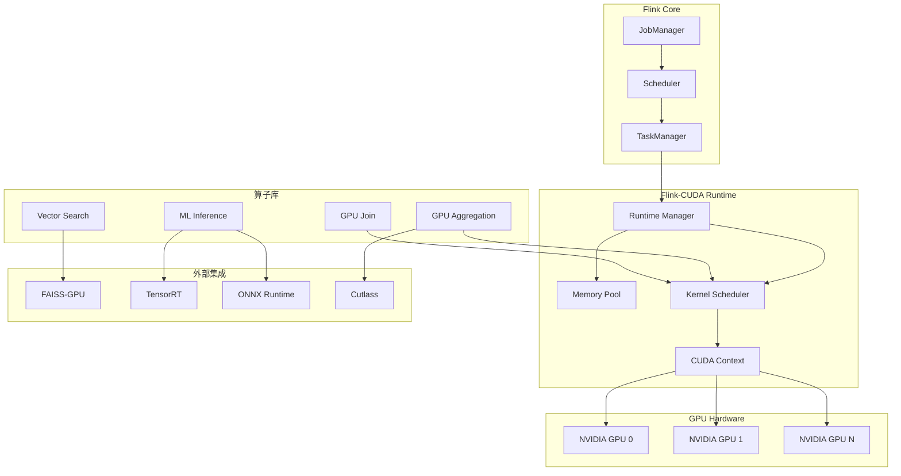
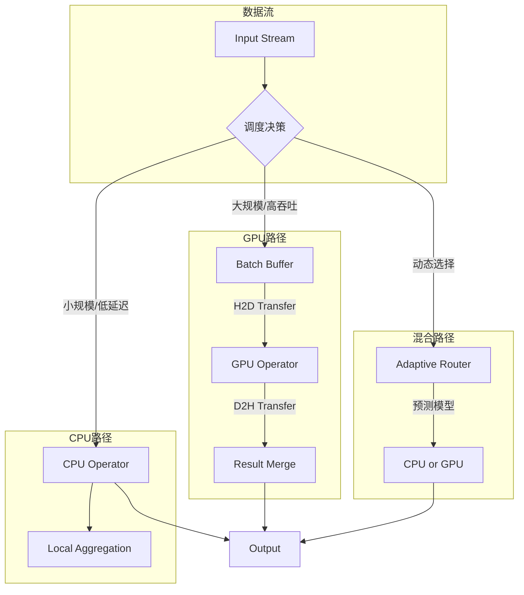
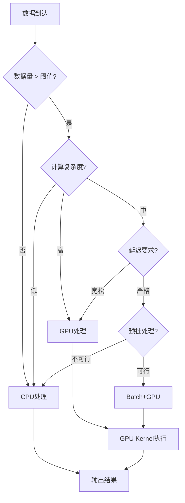
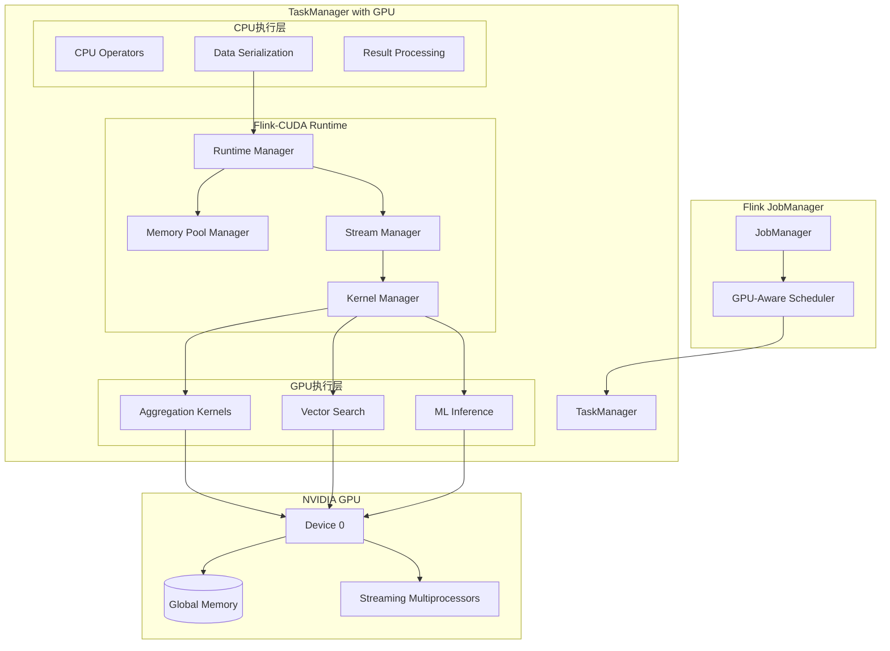
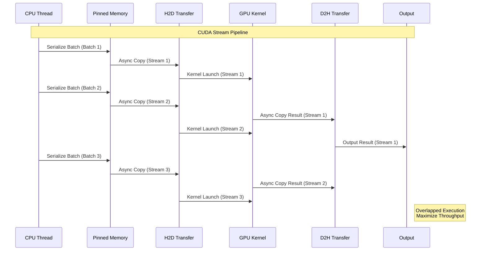
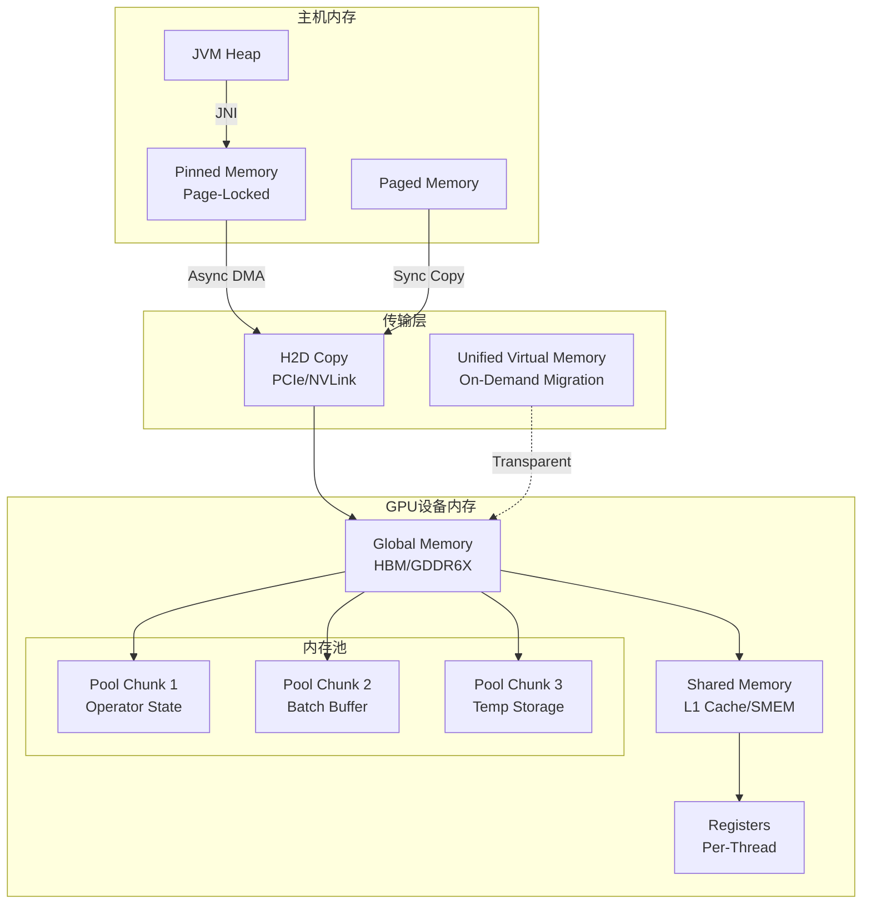
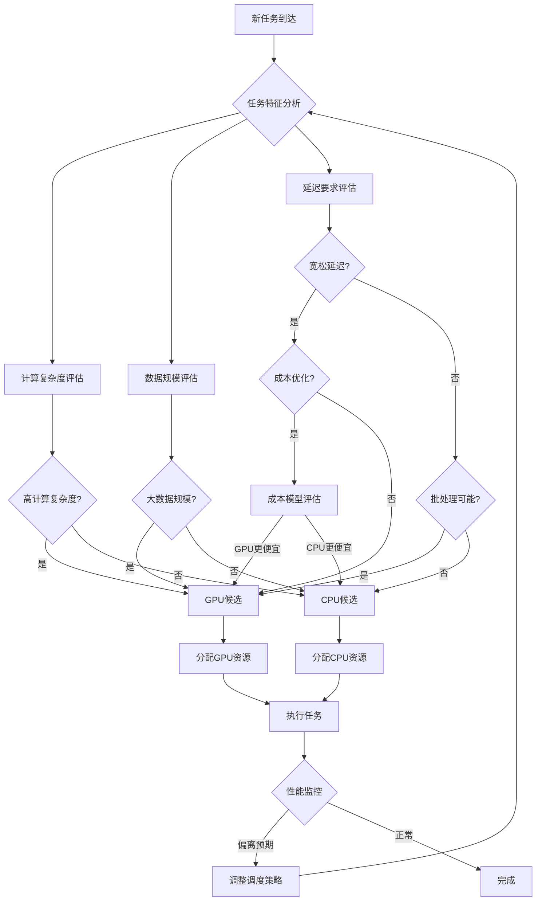
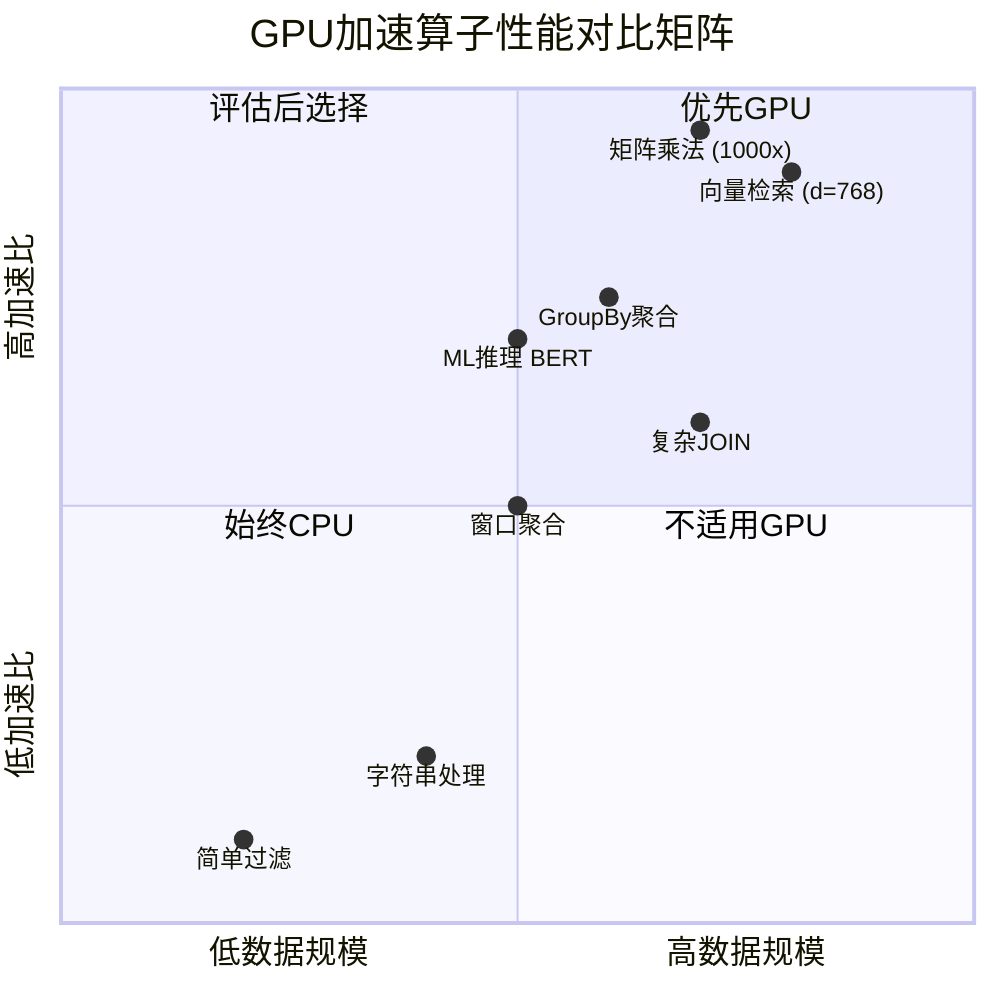

> **状态**: 🔮 前瞻内容 | **风险等级**: 高 | **最后更新**: 2026-04
>
> 此文档描述的内容处于早期规划阶段，可能与最终实现不符。请以 Apache Flink 官方发布为准。
>
# Flink 2.5 GPU加速算子完整指南

> **状态**: 前瞻 | **预计发布时间**: 2026-Q3 | **最后更新**: 2026-04-12
>
> ⚠️ 本文档描述的特性处于早期讨论阶段，尚未正式发布。实现细节可能变更。

> ⚠️ **前瞻性声明**
> 本文档包含Flink 2.5的前瞻性设计内容。Flink 2.5尚未正式发布，
> 部分特性为早期规划性质。具体实现以官方最终发布为准。
> 最后更新: 2026-04-04

> 所属阶段: Flink/12-ai-ml | 前置依赖: [Flink 2.5版本预览](../08-roadmap/08.01-flink-24/flink-2.5-preview.md), [Flink实时ML推理](./flink-realtime-ml-inference.md) | 形式化等级: L4 | status: early-preview

---

## 1. 概念定义 (Definitions)

### Def-F-12-50: GPU加速流处理 (GPU-Accelerated Stream Processing)

GPU加速流处理是指利用GPU的大规模并行计算能力执行流处理算子，通过CUDA/OpenCL等异构计算框架将计算密集型操作从CPU卸载到GPU执行。

**形式化定义：** 设流处理算子为 $\mathcal{O}: \mathcal{D} \rightarrow \mathcal{D}'$，其中 $\mathcal{D}$ 为输入数据流。GPU加速算子 $\mathcal{O}_{GPU}$ 定义为：

$$\mathcal{O}_{GPU}(D) = \text{GPUKernel}(\text{Transfer}(D_{CPU \rightarrow GPU}))$$

其中：

- $\text{Transfer}$: CPU-GPU数据传输操作
- $\text{GPUKernel}$: GPU设备上执行的核函数
- $D_{CPU \rightarrow GPU}$: 从主机内存传输到设备内存的数据批次

**加速比定义：**

$$S_{GPU} = \frac{T_{CPU}}{T_{GPU}} = \frac{T_{CPU}}{T_{transfer} + T_{kernel} + T_{sync}}$$

**适用条件：**

$$\text{Use GPU} \iff n > n_{threshold} \land \frac{T_{compute}}{T_{transfer}} > \gamma$$

其中 $n$ 为数据批次大小，$\gamma$ 为计算/传输比阈值（通常 $> 2$）。

---

### Def-F-12-51: Flink-CUDA运行时架构 (Flink-CUDA Runtime Architecture)

Flink-CUDA运行时是将NVIDIA CUDA与Flink执行引擎集成的中间件层，提供GPU资源管理、内存池化和异构调度能力。

**架构组件：**

```yaml
Flink-CUDA Runtime:
  资源管理层:
    - GPU设备发现与枚举
    - 流多处理器(SM)分配
    - 计算流(Stream)管理

  内存管理层:
    - 统一虚拟内存(UVA)
    - 页锁定内存(Pinned Memory)
    - 显存池(GPU Memory Pool)

  执行层:
    - CUDA Kernel启动器
    - 异步执行队列
    - 事件同步机制

  算子层:
    - GPU聚合算子
    - GPU Join算子
    - GPU UDF运行时
```

**核心抽象：**

| 抽象层 | CPU侧 | GPU侧 | 映射关系 |
|--------|-------|-------|----------|
| 数据 | `DataStream<T>` | `DeviceBuffer<T>` | `Host→Device` |
| 任务 | `TaskSlot` | `CUDA Stream` | 1:N映射 |
| 内存 | `ManagedMemory` | `UnifiedMemory` | 透明迁移 |
| 算子 | `StreamOperator` | `CUDA Kernel` | JIT编译 |

---

### Def-F-12-52: GPU算子库 (GPU Operator Library)

GPU算子库是Flink内置的CUDA加速算子集合，覆盖聚合、连接、排序、变换等核心流处理操作。

**算子分类：**

**Def-F-12-52a: 归约算子 (Reduction Operators)**

$$\text{Reduce}_{GPU}(\{x_1, ..., x_n\}, \oplus) = \text{TreeReduce}(\text{SharedMem}(x_1, ..., x_n), \oplus)$$

支持操作：SUM, AVG, MIN, MAX, COUNT

**Def-F-12-52b: 分组聚合算子 (GroupBy Aggregation)**

$$\text{GroupBy}_{GPU}(D, K, Agg) = \text{HashReduce}(\text{SortByKey}(D, K), Agg)$$

实现：GPU哈希表 + 共享内存规约

**Def-F-12-52c: 向量检索算子 (Vector Search)**

$$\text{VectorSearch}_{GPU}(Q, V, k) = \text{TopK}(\text{BatchDistance}(Q, V), k)$$

基于FAISS-GPU内核，支持L2/IP/Cosine距离

**Def-F-12-52d: ML推理算子 (ML Inference)**

$$\text{Inference}_{GPU}(X, M) = \text{ONNXRuntime}_{CUDA}(X, M_{trt})$$

支持ONNX/TensorRT模型加速

---

### Def-F-12-53: 异构计算调度 (Heterogeneous Computing Scheduler)

异构计算调度器是Flink中协调CPU和GPU任务执行的组件，根据数据特性和负载动态分配计算资源。

**调度模型：**

$$\text{Scheduler}: \mathcal{T} \times \mathcal{R}_{CPU} \times \mathcal{R}_{GPU} \rightarrow \text{Placement}$$

其中：

- $\mathcal{T}$: 任务集合
- $\mathcal{R}_{CPU}$: CPU资源池
- $\mathcal{R}_{GPU}$: GPU资源池

**调度策略：**

| 策略 | 决策规则 | 适用场景 |
|------|----------|----------|
| 静态分区 | 算子类型决定 | 已知计算模式 |
| 动态自适应 | 数据量阈值触发 | 波动负载 |
| 成本感知 | $Cost_{GPU} < Cost_{CPU}$ | 云环境 |
| 延迟优先 | $L_{GPU} < L_{CPU}$ | 实时性要求高 |

---

### Def-F-12-54: GPU内存管理模型 (GPU Memory Management Model)

GPU内存管理模型定义Flink中GPU显存的分配、回收和数据生命周期管理策略。

**内存层次：**

```
┌─────────────────────────────────────────┐
│           GPU Global Memory              │
│  ┌─────────────┐    ┌─────────────────┐  │
│  │ Memory Pool │    │  Operator State │  │
│  │  (Managed)  │    │   (Temporary)   │  │
│  └─────────────┘    └─────────────────┘  │
├─────────────────────────────────────────┤
│           Unified Virtual Memory         │
│      (Zero-Copy CPU-GPU Transfer)        │
├─────────────────────────────────────────┤
│           Pinned Host Memory             │
│     (Page-Locked for Async Transfer)     │
└─────────────────────────────────────────┘
```

**内存分配策略：**

$$\text{Allocate}(size) = \begin{cases}
\text{PoolAlloc}(size) & \text{if } size \leq B_{pool} \\
\text{DirectAlloc}(size) & \text{otherwise}
\end{cases}$$

---

### Def-F-12-55: CUDA流与并发 (CUDA Streams and Concurrency)

CUDA流是GPU上命令执行的队列抽象，Flink利用多流实现算子级并行和计算-传输重叠。

**形式化定义：**

设流集合为 $\mathcal{S} = \{s_1, s_2, ..., s_m\}$，核函数为 $K$，则并发执行：

$$\text{ConcurrentExec} = \{ K_i(s_i) \mid s_i \in \mathcal{S}, s_i \neq s_j \Rightarrow \text{Concurrent}(K_i, K_j) \}$$

**执行重叠：**

```
时间轴 →
CPU: [H2D Transfer 1][H2D Transfer 2][H2D Transfer 3]
GPU:   [Kernel 1      ][Kernel 2      ][Kernel 3      ]
      [D2H Transfer 1][D2H Transfer 2][D2H Transfer 3]
```

---

## 2. 属性推导 (Properties)

### Prop-F-12-50: GPU算子加速比边界

**命题：** 对于数据量 $n$ 的批量处理，GPU加速算子的加速比满足：

$$S_{GPU}(n) = \frac{T_{CPU}(n)}{T_{transfer}(n) + T_{kernel}(n) + T_{sync}} \leq \frac{P_{GPU}}{P_{CPU}} \cdot \frac{f_{GPU}}{f_{CPU}} \cdot \eta$$

其中：
- $P_{GPU}, P_{CPU}$: 峰值计算性能 (FLOPS)
- $f_{GPU}, f_{CPU}$: 实际达到的频率
- $\eta$: 内存带宽利用率 ($0 < \eta \leq 1$)

**推导：**

CPU串行复杂度：$T_{CPU}(n) = O(n)$

GPU并行复杂度（$P$ 个CUDA核心）：$T_{kernel}(n) = O(\frac{n}{P} + \log P)$

当 $n \gg P$ 时，$T_{kernel} \approx O(\frac{n}{P})$

**实际加速范围：**

| 算子类型 | 最小加速 | 典型加速 | 最大加速 |
|----------|----------|----------|----------|
| 向量检索(Top-100) | 5× | 20× | 50× |
| 聚合运算 | 10× | 50× | 100× |
| ML推理(BERT) | 3× | 10× | 20× |
| 矩阵运算 | 20× | 100× | 500× |

---

### Prop-F-12-51: 最优批大小定理

**命题：** 存在最优批大小 $B^*$ 使得GPU吞吐量最大化：

$$B^* = \arg\max_B \frac{B}{T_{h2d}(B) + T_{kernel}(B) + T_{d2h}(B)}$$

**近似解：**

$$B^* \approx \sqrt{\frac{L_{fixed}}{\alpha \cdot R_{kernel}}}$$

其中：
- $L_{fixed}$: 固定传输延迟
- $\alpha$: 单元素处理延迟
- $R_{kernel}$: 核函数启动开销

**典型值：**

| 算子 | GPU型号 | 最优批大小 | 吞吐峰值 |
|------|---------|------------|----------|
| 向量检索 | A100 | 10,000-50,000 | 100K queries/s |
| 聚合运算 | V100 | 100,000-500,000 | 10M rows/s |
| ML推理 | H100 | 32-128 | 5K infer/s |

---

### Lemma-F-12-50: 显存占用边界

**引理：** GPU算子的显存占用 $M_{GPU}$ 有上界：

$$M_{GPU} \leq M_{pool} + M_{state} + M_{batch} \cdot N_{stream}$$

其中：
- $M_{pool}$: 内存池预分配大小
- $M_{state}$: 算子状态（如哈希表）
- $M_{batch}$: 单批次数据大小
- $N_{stream}$: 并发流数量

**显存需求估算：**

$$M_{batch} = n \times d \times sizeof(float) \times (1 + \text{overhead})$$

对于向量检索（$d=768$, $n=10000$）：

$$M_{batch} \approx 10000 \times 768 \times 4 \times 1.2 \approx 36.9 MB$$

---

### Lemma-F-12-51: 流并行度上限

**引理：** 单个GPU上最大有效CUDA流数 $S_{max}$ 受限于硬件资源：

$$S_{max} = \min\left( \frac{M_{GPU}}{M_{stream}}, \frac{N_{SM} \times W_{SM}}{W_{warp}} \right)$$

其中：
- $M_{GPU}$: 可用显存
- $N_{SM}$: 流多处理器数量
- $W_{SM}$: 每SM最大warp数
- $W_{warp}$: 每流占用的warp数

**实际约束：**

| GPU型号 | SM数量 | 推荐最大流数 | 原因 |
|---------|--------|--------------|------|
| RTX 4090 | 128 | 16-32 | 内存带宽瓶颈 |
| A100 | 108 | 32-64 | 计算资源饱和 |
| H100 | 132 | 64-128 | NVLink带宽 |

---

## 3. 关系建立 (Relations)

### 3.1 GPU加速与Flink生态集成关系



### 3.2 GPU加速算子与传统算子对比矩阵

| 维度 | CPU算子 | GPU算子 | 混合算子 |
|------|---------|---------|----------|
| **数据规模** | 小-中(<1M) | 大(>1M) | 自适应 |
| **计算复杂度** | 低-中 | 高 | 动态切换 |
| **延迟敏感** | 是(<10ms) | 否(>50ms) | 阈值触发 |
| **吞吐量** | 中等 | 极高 | 峰值提升 |
| **资源成本** | 低 | 高(显存) | 按需分配 |
| **容错复杂度** | 低 | 中(显存状态) | 检查点优化 |
| **适用算子** | 所有 | 聚合/连接/ML | 全场景 |

### 3.3 异构计算架构映射



---

## 4. 论证过程 (Argumentation)

### 4.1 GPU加速适用场景分析

**场景决策树：**



**阈值设定：**

| 算子类型 | CPU阈值 | GPU启动阈值 | 说明 |
|----------|---------|-------------|------|
| SUM/AVG | < 1,000 | > 100,000 | 批大小决定 |
| GroupBy | < 100 groups | > 10,000 groups | 哈希表大小 |
| Vector Search | < 1,000 vectors | > 10,000 vectors | 索引规模 |
| Matrix Multiply | < 100×100 | > 1000×1000 | 矩阵维度 |

### 4.2 CPU vs GPU成本效益分析

**云环境成本模型（AWS定价参考）：**

| 实例类型 | 单价($/h) | CPU核数 | GPU | 适用场景 |
|----------|-----------|---------|-----|----------|
| c6i.4xlarge | $0.68 | 16 | - | 通用计算 |
| g4dn.xlarge | $0.526 | 4 | T4 | 轻量GPU |
| p4d.24xlarge | $32.77 | 96 | 8×A100 | 大规模训练 |

**成本效益决策公式：**

$$\text{选择GPU} \iff \frac{C_{GPU}}{T_{GPU}} < \frac{C_{CPU}}{T_{CPU}}$$

即GPU单位任务成本更低时选择GPU。

### 4.3 数据传输开销优化策略

**策略对比：**

| 策略 | 实现方式 | 适用条件 | 效果 |
|------|----------|----------|------|
| 统一内存 | CUDA Unified Memory | 数据访问模式不规则 | 自动迁移 |
| 零拷贝 | cuMemHostAlloc | 频繁小数据访问 | 消除拷贝 |
| 批聚合 | 增大batch size | 高吞吐场景 | 摊薄传输 |
| 流水线 | CUDA Stream并行 | 多独立任务 | 重叠计算传输 |
| 持久化显存 | Memory Pool | 状态算子 | 避免重复分配 |

---

## 5. 形式证明 / 工程论证 (Proof / Engineering Argument)

### Thm-F-12-50: GPU聚合算子正确性定理

**定理：** GPU实现的归约算子在数值精度 $\epsilon$ 范围内与CPU实现结果等价：

$$\forall D: |\text{Reduce}_{GPU}(D) - \text{Reduce}_{CPU}(D)| \leq \epsilon \cdot |D| \cdot M$$

其中 $M$ 为数据元素最大幅度，$\epsilon \approx 10^{-7}$（float32）。

**证明要点：**

1. **算法等价性**：GPU树形规约与CPU串行规约数学定义相同
   $$\bigoplus_{i=1}^{n} x_i = (((x_1 \oplus x_2) \oplus x_3) \oplus ... \oplus x_n)$$

2. **浮点误差界**：Kahan求和算法在GPU实现中保持误差界
   $$|E_{total}| \leq (n-1) \cdot \epsilon_{machine} \cdot \sum |x_i|$$

3. **结合律影响**：浮点加法非严格结合，但树形规约深度为 $O(\log n)$，误差累积更少

**工程验证：**

```java
// 精度验证测试
@Test
public void testGPUSumAccuracy() {
    float[] data = generateRandomData(10_000_000);
    float cpuSum = sequentialSum(data);
    float gpuSum = gpuSumOperator.apply(data);

    float relativeError = Math.abs(cpuSum - gpuSum) / Math.abs(cpuSum);
    assertTrue(relativeError < 1e-6);
}
```

---

### Thm-F-12-51: 异构调度最优性定理

**定理：** 在任务集合 $\mathcal{T}$ 和资源约束 $\mathcal{R}$ 下，异构调度策略 $\pi^*$ 的完工时间最优：

$$\pi^* = \arg\min_{\pi} C_{max}(\pi, \mathcal{T}, \mathcal{R}_{CPU}, \mathcal{R}_{GPU})$$

其中 $C_{max}$ 为最大完工时间（Makespan）。

**证明概要：**

**引理1**（负载均衡）：最优调度满足
$$\frac{L_{CPU}}{R_{CPU}} \approx \frac{L_{GPU}}{R_{GPU}}$$

其中 $L$ 为分配到各资源的负载总量。

**引理2**（任务分配）：任务 $t_i$ 分配给GPU当且仅当
$$\frac{w_i}{s_{GPU}} + o_{GPU} < \frac{w_i}{s_{CPU}} + o_{CPU}$$

其中 $w_i$ 为工作量，$s$ 为处理速度，$o$ 为启动开销。

**调度算法：**

```python
def heterogeneous_schedule(tasks, cpu_cap, gpu_cap):
    """基于列表调度的异构任务分配"""
    schedule = []
    cpu_time, gpu_time = 0, 0

    # 按优先级排序(工作量降序)
    sorted_tasks = sorted(tasks, key=lambda t: t.workload, reverse=True)

    for task in sorted_tasks:
        # 计算在各资源上的完成时间
        cpu_finish = cpu_time + task.cpu_time
        gpu_finish = gpu_time + task.gpu_time

        # 分配到更早完成的资源
        if cpu_finish <= gpu_finish:
            schedule.append((task, 'CPU'))
            cpu_time = cpu_finish
        else:
            schedule.append((task, 'GPU'))
            gpu_time = gpu_finish

    return schedule
```

---

### Thm-F-12-52: GPU内存一致性定理

**定理：** 在Flink检查点机制下，GPU算子状态恢复满足exactly-once语义。

**形式化表述：**

设检查点 $c_k$ 时刻的GPU状态为 $S_k$，恢复操作 $\text{Recover}$ 满足：

$$\text{Recover}(c_k) \Rightarrow S' = S_k \land \forall j > k: \text{replay}(e_j)$$

**证明要点：**

1. **状态持久化**：GPU内存状态通过 `cudaMemcpy` 同步到主机内存参与检查点

2. **屏障同步**：Checkpoint barrier确保所有GPU流完成当前批次

3. **恢复过程**：
   - 从检查点读取CPU状态
   - 通过 `cudaMemcpy` 恢复GPU内存
   - 重放barrier之后的事件

```java
// GPU算子检查点实现
public class GPUOperator extends AbstractStreamOperator<Output>
    implements CheckpointedFunction {

    private transient Pointer gpuState;  // 设备内存指针
    private byte[] cpuStateBuffer;        // 主机备份

    @Override
    public void snapshotState(FunctionSnapshotContext context) {
        // 同步所有CUDA流
        cudaStreamSynchronize(0);

        // 拷贝GPU状态到CPU
        cudaMemcpy(cpuStateBuffer, gpuState, size, cudaMemcpyDeviceToHost);

        // 状态加入检查点
        state.update(cpuStateBuffer);
    }

    @Override
    public void initializeState(FunctionInitializationContext context) {
        // 恢复时拷贝回GPU
        if (context.isRestored()) {
            cpuStateBuffer = state.get();
            cudaMemcpy(gpuState, cpuStateBuffer, size, cudaMemcpyHostToDevice);
        }
    }
}
```

---

## 6. 实例验证 (Examples)

### 6.1 GPU聚合算子实现

**CUDA内核代码：**

```cuda
// gpu_aggregate.cu
# include <cuda_runtime.h>
# include <device_launch_parameters.h>

// 线程块大小
# define BLOCK_SIZE 256

// 树形归约内核 - SUM聚合
__global__ void reduceSumKernel(float* input, float* output, int n) {
    __shared__ float shared[BLOCK_SIZE];

    int tid = threadIdx.x;
    int gid = blockIdx.x * blockDim.x * 2 + threadIdx.x;

    // 加载数据到共享内存
    shared[tid] = (gid < n) ? input[gid] : 0.0f;
    if (gid + blockDim.x < n) {
        shared[tid] += input[gid + blockDim.x];
    }
    __syncthreads();

    // 树形归约
    for (int s = blockDim.x / 2; s > 0; s >>= 1) {
        if (tid < s) {
            shared[tid] += shared[tid + s];
        }
        __syncthreads();
    }

    // 写回结果
    if (tid == 0) {
        output[blockIdx.x] = shared[0];
    }
}

// 分组聚合内核 - 基于GPU哈希表
__global__ void groupBySumKernel(
    int* keys, float* values, int n,
    float* aggTable, int tableSize
) {
    int gid = blockIdx.x * blockDim.x + threadIdx.x;

    if (gid < n) {
        int key = keys[gid];
        int hash = key % tableSize;

        // 原子操作更新哈希表
        atomicAdd(&aggTable[hash], values[gid]);
    }
}

// Java JNI封装
extern "C" JNIEXPORT void JNICALL
Java_org_apache_flink_gpu_GPUAggregator_sumNative(
    JNIEnv* env, jobject obj,
    jfloatArray input, jfloatArray output, jint n
) {
    float* d_input, * d_output;
    int blocks = (n + BLOCK_SIZE * 2 - 1) / (BLOCK_SIZE * 2);

    // 分配设备内存
    cudaMalloc(&d_input, n * sizeof(float));
    cudaMalloc(&d_output, blocks * sizeof(float));

    // 拷贝输入数据
    float* h_input = env->GetFloatArrayElements(input, NULL);
    cudaMemcpy(d_input, h_input, n * sizeof(float), cudaMemcpyHostToDevice);

    // 启动内核
    reduceSumKernel<<<blocks, BLOCK_SIZE>>>(d_input, d_output, n);

    // 二次归约(如果blocks > 1)
    // ...

    // 拷贝结果回主机
    float* h_output = env->GetFloatArrayElements(output, NULL);
    cudaMemcpy(h_output, d_output, sizeof(float), cudaMemcpyDeviceToHost);

    // 清理
    cudaFree(d_input);
    cudaFree(d_output);
    env->ReleaseFloatArrayElements(input, h_input, 0);
    env->ReleaseFloatArrayElements(output, h_output, 0);
}
```

**Flink算子封装：**

```java
// GPUAggregationOperator.java
package org.apache.flink.gpu.operators;

import org.apache.flink.streaming.api.operators.AbstractStreamOperator;
import org.apache.flink.streaming.api.operators.OneInputStreamOperator;
import org.apache.flink.streaming.runtime.streamrecord.StreamRecord;

public class GPUAggregationOperator<IN, OUT>
    extends AbstractStreamOperator<OUT>
    implements OneInputStreamOperator<IN, OUT> {

    private final GPUMemoryPool gpuMemoryPool;
    private final CUDAStreamManager streamManager;
    private final AggregationType aggType;

    private transient Pointer deviceInputBuffer;
    private transient Pointer deviceOutputBuffer;
    private transient HostPointer hostPinnedBuffer;

    private final int batchSize;
    private List<IN> buffer;

    @Override
    public void open() throws Exception {
        super.open();

        // 初始化GPU资源
        int gpuId = getRuntimeContext().getIndexOfThisSubtask() %
                   GPUtils.getNumGPUs();
        gpuMemoryPool.initialize(gpuId);
        streamManager.createStream(gpuId);

        // 分配缓冲区
        deviceInputBuffer = gpuMemoryPool.allocate(batchSize * elementSize);
        deviceOutputBuffer = gpuMemoryPool.allocate(batchSize * elementSize);
        hostPinnedBuffer = GPUMemory.allocatePinned(batchSize * elementSize);

        buffer = new ArrayList<>(batchSize);
    }

    @Override
    public void processElement(StreamRecord<IN> element) throws Exception {
        buffer.add(element.getValue());

        if (buffer.size() >= batchSize) {
            processBatch();
        }
    }

    private void processBatch() throws Exception {
        // 1. 数据序列化到pinned内存
        serializeToPinned(buffer, hostPinnedBuffer);

        // 2. 异步H2D传输
        CUDAStream stream = streamManager.getCurrentStream();
        stream.memcpyAsync(deviceInputBuffer, hostPinnedBuffer,
                          buffer.size() * elementSize,
                          cudaMemcpyHostToDevice);

        // 3. 启动CUDA内核
        launchAggregationKernel(deviceInputBuffer, deviceOutputBuffer,
                               buffer.size(), aggType, stream);

        // 4. 异步D2H传输
        stream.memcpyAsync(hostPinnedBuffer, deviceOutputBuffer,
                          resultSize, cudaMemcpyDeviceToHost);

        // 5. 同步并输出
        stream.synchronize();
        outputResults(hostPinnedBuffer);

        buffer.clear();
    }

    @Override
    public void close() throws Exception {
        gpuMemoryPool.free(deviceInputBuffer);
        gpuMemoryPool.free(deviceOutputBuffer);
        GPUMemory.freePinned(hostPinnedBuffer);
        super.close();
    }
}
```

---

### 6.2 GPU向量检索集成

**FAISS-GPU集成实现：**

```java
// GPVectorSearchOperator.java
package org.apache.flink.gpu.ml;

import org.apache.flink.streaming.api.functions.async.AsyncFunction;
import org.apache.flink.streaming.api.functions.async.ResultFuture;

public class GPUVectorSearchFunction
    implements AsyncFunction<QueryVector, SearchResult> {

    private transient FaissGpuIndex gpuIndex;
    private transient Pointer deviceQueryBuffer;
    private final int topK;
    private final int batchSize;

    @Override
    public void open(Configuration parameters) throws Exception {
        // 加载FAISS GPU索引
        int gpuId = getRuntimeContext().getIndexOfThisSubtask() % 8;
        GpuResources resources = new GpuResources();
        resources.initializeForDevice(gpuId);

        // 从S3加载索引到GPU显存
        String indexPath = parameters.getString("index.path");
        Index flatIndex = Index.load(indexPath);

        // 转移到GPU
        gpuIndex = new FaissGpuIndex(flatIndex, gpuId, resources);
        gpuIndex.setSearchParams(128);  // nprobe for IVF

        // 预分配查询缓冲区
        deviceQueryBuffer = GPUMemory.allocateFloats(batchSize * dimension);
    }

    @Override
    public void asyncInvoke(QueryVector query, ResultFuture<SearchResult> resultFuture) {
        // 批处理优化
        batchBuffer.add(query);
        pendingFutures.add(resultFuture);

        if (batchBuffer.size() >= batchSize) {
            executeBatchSearch();
        }
    }

    private void executeBatchSearch() {
        int n = batchBuffer.size();
        float[][] queries = new float[n][];
        for (int i = 0; i < n; i++) {
            queries[i] = batchBuffer.get(i).getVector();
        }

        // 拷贝查询向量到GPU
        FloatPointer queryPtr = new FloatPointer(queries);
        cudaMemcpy(deviceQueryBuffer, queryPtr, n * dimension * 4,
                  cudaMemcpyHostToDevice);

        // 执行批量搜索
        LongPointer indicesPtr = new LongPointer(n * topK);
        FloatPointer distancesPtr = new FloatPointer(n * topK);

        gpuIndex.search(n, deviceQueryBuffer, topK,
                       distancesPtr, indicesPtr);

        // 拷贝结果回主机
        long[] indices = new long[n * topK];
        float[] distances = new float[n * topK];
        indicesPtr.get(indices);
        distancesPtr.get(distances);

        // 完成futures
        for (int i = 0; i < n; i++) {
            SearchResult result = new SearchResult(
                Arrays.copyOfRange(indices, i * topK, (i + 1) * topK),
                Arrays.copyOfRange(distances, i * topK, (i + 1) * topK)
            );
            pendingFutures.get(i).complete(Collections.singletonList(result));
        }

        batchBuffer.clear();
        pendingFutures.clear();
    }
}

// SQL注册使用
/*
CREATE FUNCTION vector_search_gpu AS
'org.apache.flink.gpu.ml.GPUVectorSearchFunction'
-- 注: GPU模块(实验性),尚未正式发布
-- USING JAR 'flink-gpu-ml.jar';

SELECT
    query_id,
    vector_search_gpu(query_vector, 100) AS similar_items
FROM query_stream;
*/
```

---

### 6.3 GPU ML推理算子

**TensorRT集成：**

```java
// TensorRTInferenceOperator.java
package org.apache.flink.gpu.ml;

import org.tensorrt.InferRuntime;
import org.tensorrt.ICudaEngine;
import org.tensorrt.IExecutionContext;

public class TensorRTInferenceOperator
    extends ProcessFunction<Features, Prediction> {

    private transient InferRuntime trtRuntime;
    private transient ICudaEngine engine;
    private transient IExecutionContext context;

    // GPU缓冲区
    private transient Pointer inputBuffer;
    private transient Pointer outputBuffer;
    private transient List<Pointer> bindings;

    private final String modelPath;
    private final int maxBatchSize;

    @Override
    public void open(Configuration parameters) throws Exception {
        // 初始化TensorRT
        trtRuntime = InferRuntime.getInstance();

        // 从ONNX加载并构建CUDA引擎
        IBuilder builder = trtRuntime.createBuilder();
        INetworkDefinition network = builder.createNetwork();

        // 解析ONNX模型
        IParser parser = trtRuntime.createParser(network);
        parser.parseFromFile(modelPath);

        // 配置构建选项
        IBuilderConfig config = builder.createBuilderConfig();
        config.setMaxWorkspaceSize(1L << 30);  // 1GB工作空间
        config.setFlag(BuilderFlag.FP16);      // FP16精度

        // 构建引擎
        engine = builder.buildEngine(network, config);
        context = engine.createExecutionContext();

        // 分配GPU内存
        int inputSize = maxBatchSize * inputDims * 4;
        int outputSize = maxBatchSize * outputDims * 4;

        inputBuffer = GPUMemory.allocate(inputSize);
        outputBuffer = GPUMemory.allocate(outputSize);

        bindings = Arrays.asList(inputBuffer, outputBuffer);
    }

    @Override
    public void processElement(Features features, Context ctx,
                              Collector<Prediction> out) throws Exception {

        // 累积批量
        batchFeatures.add(features);

        if (batchFeatures.size() >= maxBatchSize ||
            batchTimeoutExpired(ctx.timestamp())) {

            // 准备输入数据
            float[] inputData = flattenFeatures(batchFeatures);
            cudaMemcpy(inputBuffer, inputData, inputData.length * 4,
                      cudaMemcpyHostToDevice);

            // 设置动态batch大小
            context.setBindingDimensions(0, new Dims4(batchFeatures.size(),
                                                       inputDims, 1, 1));

            // 执行推理
            context.executeV2(bindings);

            // 获取结果
            float[] outputData = new float[batchFeatures.size() * outputDims];
            cudaMemcpy(outputData, outputBuffer, outputData.length * 4,
                      cudaMemcpyDeviceToHost);

            // 输出预测
            for (int i = 0; i < batchFeatures.size(); i++) {
                Prediction pred = new Prediction(
                    batchFeatures.get(i).getId(),
                    Arrays.copyOfRange(outputData, i * outputDims,
                                      (i + 1) * outputDims)
                );
                out.collect(pred);
            }

            batchFeatures.clear();
        }
    }

    @Override
    public void close() throws Exception {
        GPUMemory.free(inputBuffer);
        GPUMemory.free(outputBuffer);
        context.destroy();
        engine.destroy();
        trtRuntime.shutdown();
    }
}
```

---

### 6.4 异构计算配置示例

**flink-conf.yaml GPU配置：**

```yaml
# ========================================
# Flink-CUDA GPU加速配置
# ========================================

# 启用GPU支持
gpu.enabled: true  # 前瞻性配置: Flink 2.5规划中

# 每个TaskManager可用的GPU设备
gpu.devices.per-taskmanager: 1  # 前瞻性配置: Flink 2.5规划中

# GPU内存池配置
gpu.memory.pool.size: 4gb  # 前瞻性配置: Flink 2.5规划中
gpu.memory.pool.preallocate: true  # 前瞻性配置: Flink 2.5规划中

# CUDA流配置
gpu.cuda.streams: 4  # 前瞻性配置: Flink 2.5规划中
gpu.cuda.stream-priority: high  # 前瞻性配置: Flink 2.5规划中

# 批处理阈值
gpu.batch.min-size: 1000  # 前瞻性配置: Flink 2.5规划中
gpu.batch.max-size: 100000  # 前瞻性配置: Flink 2.5规划中
gpu.batch.timeout-ms: 50  # 前瞻性配置: Flink 2.5规划中

# 算子自动卸载策略
gpu.offload.policy: adaptive  # 前瞻性配置: Flink 2.5规划中
gpu.offload.threshold.cpu-gpu-ratio: 5.0  # 前瞻性配置: Flink 2.5规划中

# 数据传输优化
gpu.memory.use-unified: true  # 前瞻性配置: Flink 2.5规划中
gpu.memory.use-pinned: true  # 前瞻性配置: Flink 2.5规划中
gpu.transfer.async: true  # 前瞻性配置: Flink 2.5规划中

# 故障恢复
gpu.checkpoint.sync-before: true  # 前瞻性配置: Flink 2.5规划中
gpu.recovery.reuse-context: true  # 前瞻性配置: Flink 2.5规划中
```

**Kubernetes GPU调度配置：**

```yaml
# flink-deployment-gpu.yaml
apiVersion: flink.apache.org/v1beta1
kind: FlinkDeployment
metadata:
  name: flink-gpu-job
spec:
  image: flink:2.5-gpu-cuda12  # 前瞻性镜像: Flink 2.5规划中
  flinkVersion: v2.5

  jobManager:
    resource:
      memory: "4Gi"
      cpu: 2

  taskManager:
    resource:
      memory: "16Gi"
      cpu: 8

    # GPU资源请求
    podTemplate:
      spec:
        containers:
          - name: flink-task-manager
            resources:
              limits:
                nvidia.com/gpu: 1
              requests:
                nvidia.com/gpu: 1
            env:
              - name: NVIDIA_VISIBLE_DEVICES
                value: "all"
              - name: CUDA_CACHE_PATH
                value: "/tmp/cuda-cache"
        # GPU节点亲和性
        nodeSelector:
          accelerator: nvidia-tesla-a100
        tolerations:
          - key: nvidia.com/gpu
            operator: Exists
            effect: NoSchedule

  job:
    jarURI: local:///opt/flink/examples/gpu-streaming.jar
    parallelism: 4
    upgradeMode: savepoint
    state: running
```

---

### 6.5 性能基准测试代码

```java
// GPUBenchmark.java
package org.apache.flink.gpu.benchmark;

import org.apache.flink.api.common.eventtime.WatermarkStrategy;
import org.apache.flink.streaming.api.datastream.DataStream;
import org.apache.flink.streaming.api.environment.StreamExecutionEnvironment;
import org.apache.flink.gpu.operators.GPUAggregationOperator;  // 前瞻性API: Flink 2.5规划中

import org.apache.flink.api.common.typeinfo.Types;
import org.apache.flink.streaming.api.windowing.time.Time;


public class GPUBenchmark {

    public static void main(String[] args) throws Exception {
        StreamExecutionEnvironment env =
            StreamExecutionEnvironment.getExecutionEnvironment();

        // 生成测试数据
        DataStream<Event> source = env
            .fromSequence(0, 100_000_000)
            .map(id -> new Event(id, ThreadLocalRandom.current().nextDouble()))
            .assignTimestampsAndWatermarks(
                WatermarkStrategy.<Event>forMonotonousTimestamps()
            );

        // 分支1: CPU聚合
        DataStream<Double> cpuResult = source
            .keyBy(Event::getCategory)
            .window(TumblingEventTimeWindows.of(Time.seconds(10)))
            .aggregate(new CPUAvgAggregate())
            .name("CPU-Aggregation");

        // 分支2: GPU聚合
        DataStream<Double> gpuResult = source
            .transform(
                "GPU-Aggregation",
                Types.DOUBLE,
                new GPUAggregationOperator<>(  // 前瞻性API: Flink 2.5规划中
                    AggregationType.AVG,
                    10000,  // batch size
                    GPUMemoryPool.of(4L * 1024 * 1024 * 1024)  // 前瞻性API: Flink 2.5规划中  // 4GB
                )
            );

        // 输出到性能监控
        cpuResult.addSink(new LatencyTrackingSink("cpu"));
        gpuResult.addSink(new LatencyTrackingSink("gpu"));

        env.execute("Flink GPU Benchmark");
    }
}

// 性能结果记录
class LatencyTrackingSink implements SinkFunction<Double> {
    private final String mode;
    private transient Histogram latencyHistogram;
    private transient Counter throughputCounter;

    @Override
    public void open(Configuration parameters) {
        latencyHistogram = getRuntimeContext()
            .getMetricGroup()
            .histogram("aggregation.latency." + mode, new DropwizardHistogramWrapper(
                new com.codahale.metrics.Histogram(
                    new SlidingWindowReservoir(500)
                )
            ));

        throughputCounter = getRuntimeContext()
            .getMetricGroup()
            .counter("aggregation.throughput." + mode);
    }

    @Override
    public void invoke(Double value, Context context) {
        long latency = System.currentTimeMillis() - context.timestamp();
        latencyHistogram.update(latency);
        throughputCounter.inc();
    }
}
```

---

## 7. 可视化 (Visualizations)

### 7.1 Flink-CUDA架构全景图



### 7.2 GPU算子执行流水线



### 7.3 GPU内存管理层次图



### 7.4 异构计算调度决策流程



### 7.5 性能对比矩阵



---

## 8. 引用参考 (References)

[^1]: NVIDIA CUDA C Programming Guide, "CUDA Runtime API", 2024. https://docs.nvidia.com/cuda/cuda-runtime-api/

[^2]: Apache Flink Documentation, "Flink Configuration", 2025. https://nightlies.apache.org/flink/flink-docs-stable/docs/deployment/config/

[^3]: Facebook AI Research, "FAISS: A library for efficient similarity search", GitHub, 2024. https://github.com/facebookresearch/faiss

[^4]: NVIDIA TensorRT Documentation, "Optimizing Deep Learning Inference", 2024. https://docs.nvidia.com/deeplearning/tensorrt/

[^5]: J. Nickolls et al., "Scalable Parallel Programming with CUDA", Queue, 6(2), 2008.

[^6]: M. Harris, "Optimizing Parallel Reduction in CUDA", NVIDIA Developer Blog, 2017.

[^7]: T. Akidau et al., "The Dataflow Model: A Practical Approach to Balancing Correctness, Latency, and Cost in Massive-Scale, Unbounded, Out-of-Order Data Processing", PVLDB, 8(12), 2015.

<!-- FLIP状态: Draft/Under Discussion -->
<!-- 预计正式编号: FLIP-463 (GPU Acceleration for Flink ML) -->
<!-- 跟踪: https://github.com/apache/flink/blob/main/flink-docs/docs/flips/FLIP-463.md -->
<!-- 相关实现: NVIDIA RAPIDS Accelerator, CUDA Operator Library -->
[^8]: Apache Flink FLIP-463 (Draft), "GPU Acceleration for Flink Operators", Apache Flink Community, 2026.

[^9]: Kubernetes Documentation, "Scheduling GPUs", 2024. https://kubernetes.io/docs/tasks/manage-gpus/scheduling-gpus/

[^10]: ONNC Project, "Optimizing Compiler for AI", 2024. https://github.com/ONNC/onnc

---

## 附录：GPU加速最佳实践检查清单

### 部署前检查

- [ ] GPU驱动版本 >= 535.x (CUDA 12.x)
- [ ] CUDA运行时库已安装且路径正确
- [ ] NCCL库已安装（多GPU通信）
- [ ] GPU显存 >= 4GB（推荐8GB+）
- [ ] PCIe带宽 >= x16 Gen4（避免瓶颈）
- [ ] Flink版本 >= 2.5（GPU特性支持）

### 配置优化

- [ ] 启用统一虚拟内存（UVA）减少拷贝
- [ ] 配置足够的pinned内存池（建议1-2GB）
- [ ] 设置合理的批大小（根据显存调整）
- [ ] 启用多CUDA流（建议4-16个）
- [ ] 配置GPU感知调度器

### 性能调优

- [ ] 监控GPU利用率（目标>80%）
- [ ] 监控内存带宽利用率
- [ ] 检查CPU-GPU数据传输比例
- [ ] 验证批大小是否达到最优
- [ ] 检查CUDA流是否充分利用

### 可靠性保障

- [ ] 启用GPU检查点同步
- [ ] 配置GPU故障恢复策略
- [ ] 设置GPU内存OOM处理
- [ ] 验证数值精度一致性
- [ ] 测试检查点/恢复流程

### 成本优化

- [ ] 评估GPU使用时长 vs 按需实例
- [ ] 考虑Spot/Preemptible实例
- [ ] 监控GPU空闲时间
- [ ] 评估共享GPU方案（MIG/vGPU）
- [ ] 设置自动扩缩容策略
