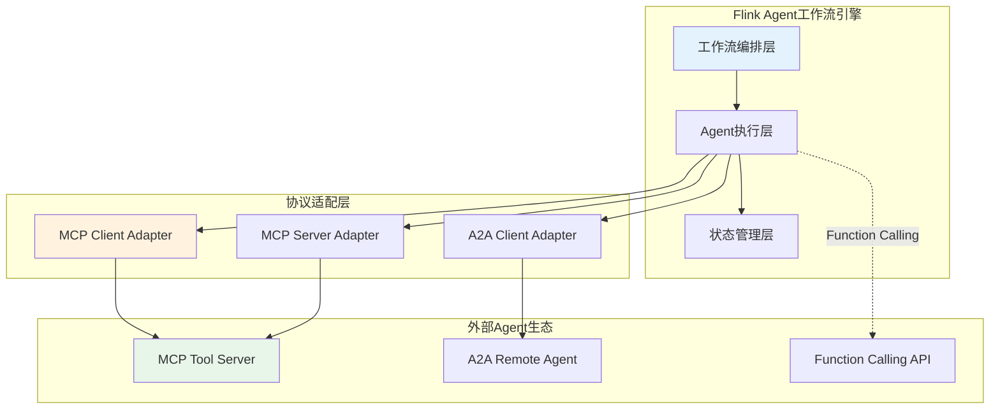
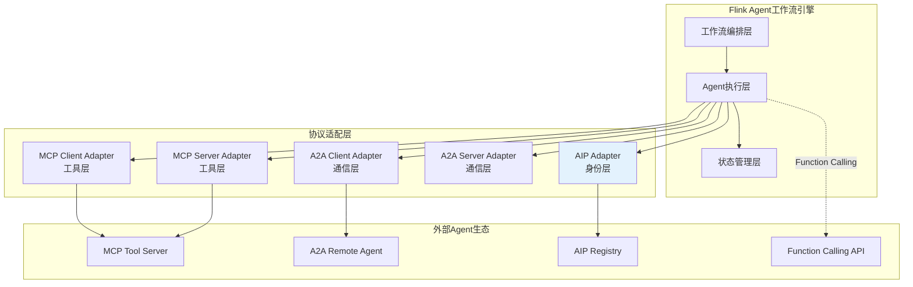
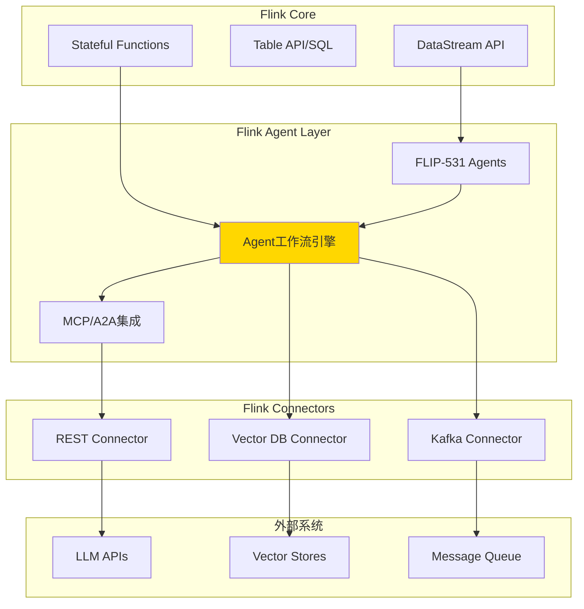
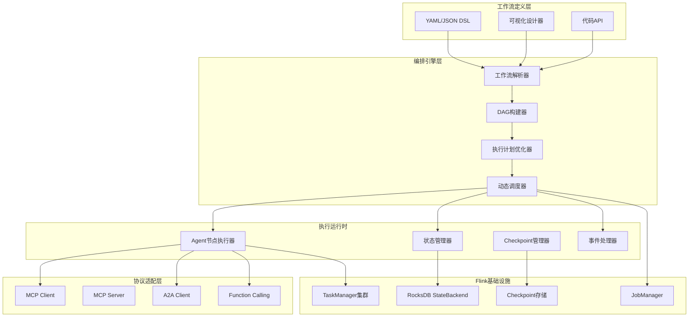
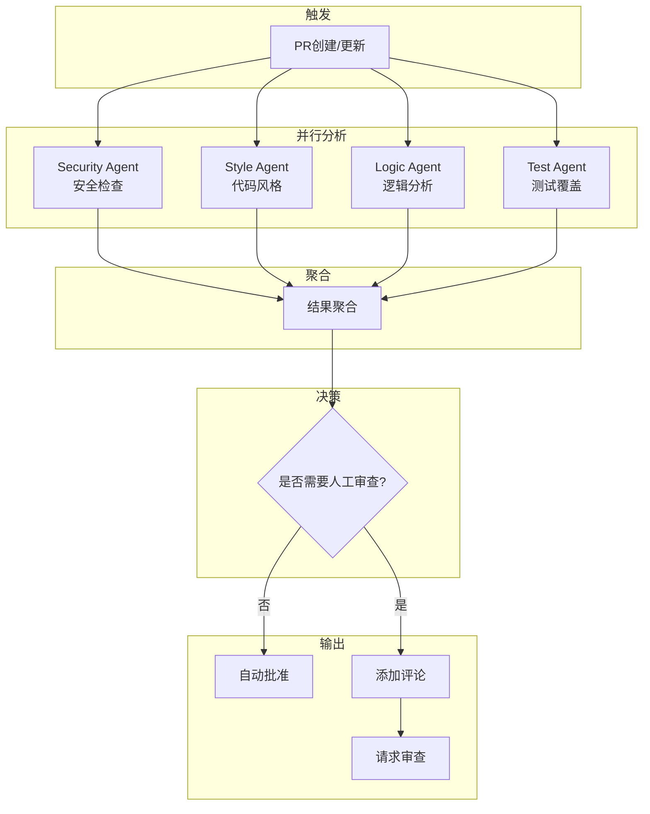
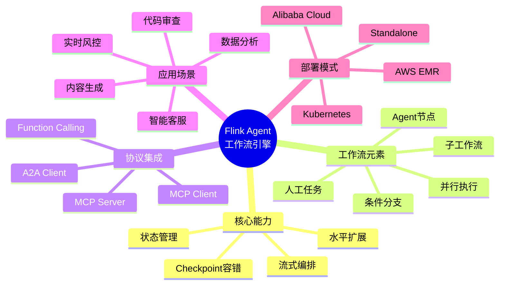
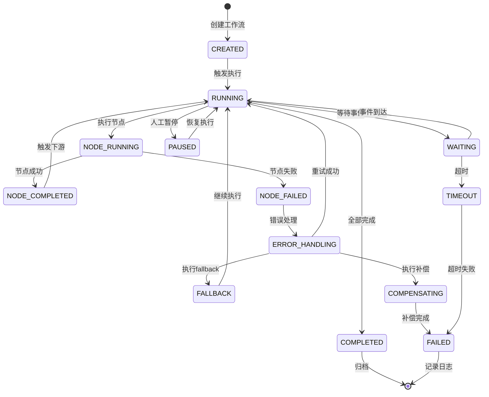
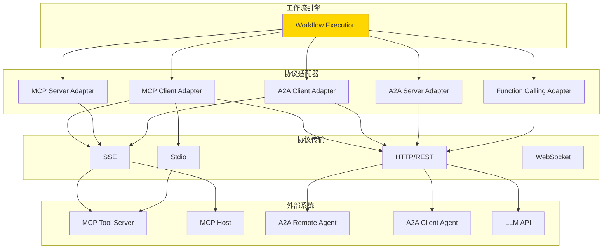
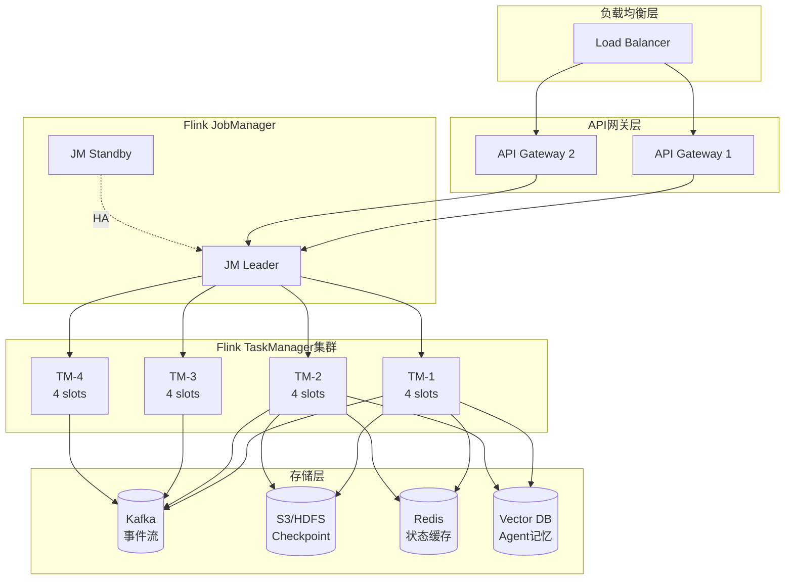

# Flink Agent工作流引擎

> **状态**: 前瞻 | **预计发布时间**: 2026-06 | **最后更新**: 2026-04-12
>
> ⚠️ 本文档描述的特性处于早期讨论阶段，尚未正式发布。实现细节可能变更。

> **所属阶段**: Flink/06-ai-ml | **前置依赖**: [FLIP-531 AI Agents](flip-531-ai-agents-ga-guide.md), [Flink Agents MCP集成](flink-agents-mcp-integration.md) | **形式化等级**: L4-L5

---

## 1. 概念定义 (Definitions)

### Def-F-06-300: Flink Agent工作流引擎

**定义**: Flink Agent工作流引擎是基于Apache Flink构建的、支持AI Agent编排与执行的分布式流处理系统，形式化为七元组：

$$
\mathcal{W}_{flink} \triangleq \langle \mathcal{F}, \mathcal{A}, \mathcal{S}, \mathcal{G}, \mathcal{C}, \mathcal{T}, \mathcal{E} \rangle
$$

其中：

| 组件 | 符号 | 形式化定义 | 功能描述 |
|------|------|------------|----------|
| **Flink运行时** | $\mathcal{F}$ | $\langle JobManager, TaskManager, Checkpoint \rangle$ | 流计算基础设施 |
| **Agent集合** | $\mathcal{A}$ | $\{a_1, a_2, ..., a_n\}$ | 可执行Agent |
| **状态管理** | $\mathcal{S}$ | $\mathcal{K} \rightarrow \mathcal{V}$ | Keyed State/Broadcast State |
| **工作流图** | $\mathcal{G}$ | $\langle \mathcal{N}, \mathcal{E}_{flow} \rangle$ | DAG工作流定义 |
| **Checkpoint** | $\mathcal{C}$ | $\mathcal{S}_t \rightarrow \mathcal{P}_{persistent}$ | 容错状态快照 |
| **触发器** | $\mathcal{T}$ | $\mathcal{E}_{stream} \times \mathcal{C}_{cond} \rightarrow \{0,1\}$ | 工作流激活条件 |
| **执行引擎** | $\mathcal{E}$ | $\mathcal{G} \times \mathcal{S} \rightarrow \mathcal{R}_{output}$ | 工作流执行器 |

---

### Def-F-06-301: Agent工作流定义 (Agent Workflow Definition)

**定义**: Agent工作流是可执行的业务流程定义，采用声明式DSL描述：

```yaml
# 工作流定义Schema workflow:
  id: string                    # 工作流标识
  name: string                  # 显示名称
  version: string               # 语义化版本

  # 触发配置
  triggers:
    - type: event               # event/schedule/webhook
      source: kafka_topic
      filter: "$.type == 'order.created'"

  # Agent节点定义
  nodes:
    - id: node_1
      type: agent               # agent/condition/parallel/subflow
      agent_ref: intent_classifier
      input_mapping:
        text: "$.event.message"
      output_mapping:
        intent: "$.output.intent"
      timeout: 30s
      retry:
        max_attempts: 3
        backoff: exponential

    - id: node_2
      type: parallel
      branches:
        - id: branch_a
          nodes: [...]
        - id: branch_b
          nodes: [...]
      aggregation: merge          # merge/first/all

    - id: node_3
      type: condition
      expression: "$.node_1.intent == 'order_query'"
      then: node_4
      else: node_5

  # 边定义
  edges:
    - from: node_1
      to: node_2
      condition: always
    - from: node_2
      to: node_3
      condition: on_success

  # 错误处理
  error_handling:
    strategy: retry_fallback     # retry_fallback/compensate/abort
    fallback: fallback_node
    max_retries: 3

  # 资源限制
  resources:
    max_execution_time: 5m
    max_memory: 512MB
```

---

### Def-F-06-302: Agent节点类型 (Agent Node Types)

**定义**: 工作流中支持的Agent节点类型：

$$
\text{NodeType} \in \{Agent, Condition, Parallel, SubWorkflow, HumanTask, EventWait\}
$$

**Agent节点**:

$$
\mathcal{N}_{agent} = \langle id, ref_{agent}, \mathcal{I}_{in}, \mathcal{I}_{out}, \tau_{timeout}, \mathcal{R}_{retry} \rangle
$$

**Condition节点**:

$$
\mathcal{N}_{cond} = \langle id, expr, n_{then}, n_{else} \rangle
$$

**Parallel节点**:

$$
\mathcal{N}_{parallel} = \langle id, \{branch_i\}_{i=1}^n, agg_{strategy} \rangle
$$

**SubWorkflow节点**:

$$
\mathcal{N}_{sub} = \langle id, ref_{workflow}, \mathcal{I}_{param} \rangle
$$

---

### Def-F-06-303: 状态快照与恢复 (State Snapshot and Recovery)

**定义**: Flink Agent工作流引擎的容错机制：

$$
\mathcal{C}_{workflow} = \langle \mathcal{S}_{node}, \mathcal{S}_{variable}, \mathcal{S}_{event} \rangle
$$

**状态层次**:

| 状态类型 | 作用域 | 持久化方式 | 恢复策略 |
|----------|--------|------------|----------|
| **节点状态** | Per-node | Checkpoint | 精确恢复 |
| **变量状态** | Per-workflow | Checkpoint | 精确恢复 |
| **事件状态** | Global | Journal | 重放恢复 |
| **Agent上下文** | Per-execution | Async Snapshot | 最佳努力 |

---

### Def-F-06-304: 动态工作流编排 (Dynamic Workflow Orchestration)

**定义**: 基于运行时条件的动态工作流调整：

$$
\mathcal{O}_{dynamic}: \mathcal{G}_{static} \times \mathcal{S}_{runtime} \times \mathcal{E}_{context} \rightarrow \mathcal{G}_{dynamic}
$$

**动态调整策略**:

```java
public interface DynamicOrchestrator {
    // 基于负载动态扩展Agent
    WorkflowGraph scaleAgents(WorkflowGraph graph, LoadMetrics metrics);

    // 基于数据特征动态路由
    WorkflowGraph adjustRouting(WorkflowGraph graph, DataCharacteristics data);

    // 基于历史性能动态优化
    WorkflowGraph optimizePath(WorkflowGraph graph, ExecutionHistory history);
}
```

---

## 2. 属性推导 (Properties)

### Prop-F-06-300: 工作流执行延迟边界

**命题**: Agent工作流的端到端执行延迟满足：

$$
L_{workflow} = \sum_{i=1}^{n} L_{node_i} + \sum_{j=1}^{m} L_{transfer_j} + L_{coordination}
$$

**延迟分解**:

| 组件 | 边界 | 优化策略 |
|------|------|----------|
| $L_{node}$ (Agent执行) | 100ms - 5s | 缓存、模型优化 |
| $L_{transfer}$ (数据传输) | 1ms - 100ms | 同机部署、零拷贝 |
| $L_{coordination}$ (协调开销) | 5ms - 50ms | 异步化、批量处理 |

**典型工作流延迟**:

| 工作流类型 | 节点数 | 典型延迟 | P99延迟 |
|------------|--------|----------|---------|
| 简单意图识别 | 1-2 | 200ms | 500ms |
| 客服对话 | 3-5 | 800ms | 2s |
| 复杂分析 | 5-10 | 3s | 10s |
| 研究报告生成 | 10-20 | 30s | 2min |

---

### Lemma-F-06-300: Checkpoint一致性引理

**引理**: Flink Agent工作流引擎的Checkpoint保证exactly-once语义：

$$
\forall c \in \mathcal{C}: consistent(c) \land recoverable(c) \Rightarrow exactly\_once(c)
$$

**一致性条件**:

1. **Barrier对齐**: 所有输入流到达相同Barrier
2. **状态快照**: 异步快照所有KeyedState
3. **确认提交**: Checkpoint完成确认后才提交输出

---

### Prop-F-06-301: 动态扩展性定理

**命题**: Flink Agent工作流引擎的吞吐量随资源线性扩展：

$$
Throughput(R) = k \cdot R \cdot (1 - \frac{R_{coord}}{R}), \quad R_{coord} \ll R
$$

其中 $R$ 为TaskManager资源，$R_{coord}$ 为协调开销。

**扩展上限**:

$$
R_{max} = \frac{L_{sequential}}{L_{parallel}} \cdot \frac{1}{\alpha}
$$

其中 $\alpha$ 为并行化效率系数（通常0.6-0.9）。

---

### Lemma-F-06-301: Agent调用幂等性引理

**引理**: 在exactly-once语义下，Agent节点调用满足幂等性：

$$
\forall n \in \mathcal{N}_{agent}: execute(n) = execute(execute(n))
$$

**幂等保证机制**:

1. **去重标识**: 每个执行请求携带唯一dedup_id
2. **结果缓存**: Checkpoint保存节点输出结果
3. **确定性执行**: 相同输入产生相同输出

---

### Prop-F-06-302: 故障恢复时间边界

**命题**: 工作流故障恢复时间满足：

$$
T_{recovery} = T_{detect} + T_{restart} + T_{restore} + T_{replay}
$$

**恢复时间分解**:

| 阶段 | 边界 | 优化策略 |
|------|------|----------|
| $T_{detect}$ | < 10s | 心跳检测、健康检查 |
| $T_{restart}$ | < 30s | 容器预热、镜像缓存 |
| $T_{restore}$ | < 60s | 增量Checkpoint、本地恢复 |
| $T_{replay}$ | 变量 | Exactly-once保证 |

**总恢复时间**: $T_{recovery} < 2min$ (生产环境目标)

---

## 3. 关系建立 (Relations)

### 3.1 Flink Agent工作流 vs 传统工作流引擎

| 特性 | Flink Agent | Temporal | Airflow | Prefect |
|------|-------------|----------|---------|---------|
| **执行模型** | 流式/事件驱动 | 事件溯源 | 批处理/定时 | 混合 |
| **延迟** | 毫秒-秒级 | 秒-分钟级 | 分钟-小时级 | 秒-分钟级 |
| **状态管理** | 原生Checkpoint | 事件存储 | XCom | 任务状态 |
| **容错** | Exactly-once | 可重试 | 重试 | 重试 |
| **Agent原生** | 是(FLIP-531) | 需集成 | 需集成 | 需集成 |
| **扩展性** | 水平扩展 | 水平扩展 | 有限 | 水平扩展 |

---

### 3.2 与MCP/A2A协议集成关系



**集成模式**:

| 协议 | 用途 | 适配器类型 | 状态管理 |
|------|------|------------|----------|
| **MCP Client** | 调用工具 | Outgoing | 缓存工具结果 |
| **MCP Server** | 暴露为工具 | Incoming | 无状态 |
| **A2A Client** | 委托任务 | Outgoing | Task状态追踪 |
| **A2A Server** | 接收委托 | Incoming | Task生命周期 |

#### Agent 协议三层架构

在 MCP 与 A2A 之外，**AIP（Agent Identity Protocol）** 作为身份层协议，与 A2A（通信层）、MCP（工具层）共同构成 Agent 互操作的三层架构：

- **AIP（L1-Identity）**：负责 Agent 身份注册、发现、验证与信誉评估
- **A2A（L2-Communication）**：负责 Agent 之间的任务委托、消息传递与状态同步
- **MCP（L3-Tools）**：负责 Agent 与外部工具、数据源、上下文的交互

三层协议与 Flink Agent 工作流引擎的集成关系如下：



**集成模式扩展**：

| 协议 | 层级 | 用途 | 适配器类型 | 状态管理 |
|------|------|------|------------|----------|
| **AIP** | L1-Identity | Agent 身份发现与验证 | Discovery/Auth | 身份缓存 |
| **A2A Client** | L2-Communication | 委托任务 | Outgoing | Task状态追踪 |
| **A2A Server** | L2-Communication | 接收委托 | Incoming | Task生命周期 |
| **MCP Client** | L3-Tools | 调用工具 | Outgoing | 缓存工具结果 |
| **MCP Server** | L3-Tools | 暴露为工具 | Incoming | 无状态 |

---

### 3.3 与Flink生态组件关系



---

### 3.4 工作流模式演进

| 演进阶段 | 技术特征 | 代表系统 | 局限性 |
|----------|----------|----------|--------|
| **Workflow 1.0** | 静态DAG、定时触发 | Airflow, Oozie | 批处理、高延迟 |
| **Workflow 2.0** | 事件驱动、微服务编排 | Temporal, Cadence | 通用性强、Agent支持弱 |
| **Workflow 3.0** | 流式原生、AI原生 | **Flink Agent** | 学习曲线陡 |

---

## 4. 论证过程 (Argumentation)

### 4.1 为什么需要Flink Agent工作流引擎

**观察**: 传统工作流引擎面临AI时代的挑战：

1. **延迟不匹配**: 传统引擎秒级延迟 vs Agent交互需毫秒响应
2. **状态复杂性**: Agent需要维护会话状态、记忆状态
3. **动态性**: Agent决策需要动态调整工作流路径
4. **流式上下文**: Agent需要实时访问流式数据

**论证**: Flink是构建Agent工作流引擎的理想基础：

```
┌─────────────────────────────────────────────────────────────────┐
│                    Flink Agent工作流优势                         │
├─────────────────────────────────────────────────────────────────┤
│                                                                 │
│  1. 流式原生                                                     │
│     ┌─────────┐    ┌─────────┐    ┌─────────┐                  │
│     │ 事件流  │───►│ Agent A │───►│ Agent B │                  │
│     └─────────┘    └─────────┘    └─────────┘                  │
│          │              │              │                        │
│          └──────────────┴──────────────┘                        │
│                    毫秒级延迟                                    │
│                                                                 │
│  2. 状态管理                                                     │
│     ┌─────────────────────────────────────┐                     │
│     │         Checkpoint机制              │                     │
│     │  ┌─────────┐  ┌─────────┐          │                     │
│     │  │Agent状态│  │会话记忆 │          │                     │
│     │  └─────────┘  └─────────┘          │                     │
│     │        ↓  自动持久化                │                     │
│     │  ┌─────────┐                       │                     │
│     │  │  S3/HDFS│                       │                     │
│     │  └─────────┘                       │                     │
│     └─────────────────────────────────────┘                     │
│                                                                 │
│  3. 容错保证                                                     │
│     - Exactly-once语义                                           │
│     - 自动故障恢复                                               │
│     - 状态一致恢复                                               │
│                                                                 │
│  4. 水平扩展                                                     │
│     - 基于并行度动态扩展                                         │
│     - 支持高并发Agent调用                                        │
│     - 背压处理                                                   │
│                                                                 │
└─────────────────────────────────────────────────────────────────┘
```

---

### 4.2 架构选型决策分析

**决策维度**:

| 维度 | 选项A: Temporal | 选项B: Flink Agent | 决策 |
|------|-----------------|-------------------|------|
| **延迟要求** | 秒级 | 毫秒级 | Flink |
| **Agent原生** | 需定制 | FLIP-531原生 | Flink |
| **流式集成** | 需适配 | 原生支持 | Flink |
| **学习曲线** | 平缓 | 较陡 | Temporal |
| **生态成熟** | 成熟 | 新兴 | Temporal |
| **混合需求** | 良好 | 良好 | 平手 |

**推荐策略**:

- **实时Agent交互**（<1s响应）→ Flink Agent
- **复杂业务工作流** + **Agent能力** → Temporal + Flink Agent混合
- **纯批处理Agent** → 传统工作流引擎

---

### 4.3 反例分析：不适用Flink Agent的场景

**场景1: 纯批处理数据分析**

- **特征**: 大规模数据、分钟级延迟可接受
- **问题**: Flink流式处理 overhead > 批处理收益
- **解决方案**: Spark/Databricks

**场景2: 人工审批流程**

- **特征**: 天级延迟、人工节点为主
- **问题**: Flink的实时优势无法发挥
- **解决方案**: Camunda/Temporal

**场景3: 简单定时任务**

- **特征**: 固定时间触发、无状态
- **问题**: Flink集群成本 > 收益
- **解决方案**: CronJob/Lambda

---

## 5. 形式证明 / 工程论证 (Engineering Argument)

### 5.1 Flink Agent工作流引擎架构



---

### 5.2 核心实现：工作流执行引擎

```java
/**
 * Flink Agent工作流引擎核心实现
 */

import org.apache.flink.streaming.api.environment.StreamExecutionEnvironment;
import org.apache.flink.streaming.api.datastream.DataStream;
import org.apache.flink.api.common.state.ValueState;
import org.apache.flink.api.common.state.ValueStateDescriptor;

public class FlinkAgentWorkflowEngine {

    /**
     * 工作流主入口
     */
    public static void main(String[] args) throws Exception {
        StreamExecutionEnvironment env =
            StreamExecutionEnvironment.getExecutionEnvironment();

        // 配置Checkpoint
        env.enableCheckpointing(5000);
        env.getCheckpointConfig().setCheckpointStorage("s3://flink-checkpoints/");

        // 配置状态后端
        EmbeddedRocksDBStateBackend stateBackend =
            new EmbeddedRocksDBStateBackend(true);
        env.setStateBackend(stateBackend);

        // 加载工作流定义
        WorkflowDefinition workflow = WorkflowLoader.load(args[0]);

        // 构建执行图
        WorkflowExecutionGraph graph = WorkflowCompiler.compile(workflow);

        // 部署工作流
        deployWorkflow(env, graph);

        env.execute("Flink Agent Workflow: " + workflow.getName());
    }

    /**
     * 部署工作流执行图
     */
    private static void deployWorkflow(
            StreamExecutionEnvironment env,
            WorkflowExecutionGraph graph) {

        // 创建触发源流
        DataStream<WorkflowEvent> triggerStream = createTriggerStream(env, graph);

        // 按工作流实例key分区
        KeyedStream<WorkflowEvent, String> keyedStream = triggerStream
            .keyBy(WorkflowEvent::getWorkflowInstanceId);

        // 核心工作流处理函数
        DataStream<WorkflowResult> results = keyedStream
            .process(new WorkflowExecutionFunction(graph));

        // 结果输出
        results.addSink(new WorkflowResultSink());
    }
}

/**
 * 工作流执行核心函数
 */
public class WorkflowExecutionFunction
    extends KeyedProcessFunction<String, WorkflowEvent, WorkflowResult> {

    private final WorkflowExecutionGraph graph;

    // 状态声明
    private transient ValueState<WorkflowInstanceState> instanceState;
    private transient MapState<String, NodeExecutionState> nodeStates;
    private transient MapState<String, Object> variables;
    private transient ListState<PendingEvent> pendingEvents;

    public WorkflowExecutionFunction(WorkflowExecutionGraph graph) {
        this.graph = graph;
    }

    @Override
    public void open(Configuration parameters) {
        // 初始化状态
        instanceState = getRuntimeContext().getState(
            new ValueStateDescriptor<>("instance-state", WorkflowInstanceState.class));

        nodeStates = getRuntimeContext().getMapState(
            new MapStateDescriptor<>("node-states", String.class, NodeExecutionState.class));

        variables = getRuntimeContext().getMapState(
            new MapStateDescriptor<>("variables", String.class, Object.class));

        pendingEvents = getRuntimeContext().getListState(
            new ListStateDescriptor<>("pending-events", PendingEvent.class));
    }

    @Override
    public void processElement(WorkflowEvent event, Context ctx,
                              Collector<WorkflowResult> out) throws Exception {

        WorkflowInstanceState instance = instanceState.value();
        if (instance == null) {
            instance = initializeInstance(event);
        }

        switch (event.getType()) {
            case TRIGGER:
                handleTriggerEvent(event, instance, ctx, out);
                break;
            case AGENT_COMPLETE:
                handleAgentComplete(event, instance, ctx, out);
                break;
            case TIMER_FIRED:
                handleTimerEvent(event, instance, ctx, out);
                break;
            case ERROR:
                handleErrorEvent(event, instance, ctx, out);
                break;
        }

        instanceState.update(instance);
    }

    /**
     * 处理触发事件 - 启动工作流
     */
    private void handleTriggerEvent(WorkflowEvent event, WorkflowInstanceState instance,
                                   Context ctx, Collector<WorkflowResult> out) throws Exception {

        // 设置变量
        for (Map.Entry<String, Object> entry : event.getPayload().entrySet()) {
            variables.put(entry.getKey(), entry.getValue());
        }

        // 找到起始节点
        List<WorkflowNode> startNodes = graph.getStartNodes();

        for (WorkflowNode node : startNodes) {
            executeNode(node, instance, ctx, out);
        }
    }

    /**
     * 执行单个节点
     */
    private void executeNode(WorkflowNode node, WorkflowInstanceState instance,
                            Context ctx, Collector<WorkflowResult> out) throws Exception {

        NodeExecutionState nodeState = new NodeExecutionState(node.getId());
        nodeState.setStatus(NodeStatus.RUNNING);
        nodeState.setStartTime(System.currentTimeMillis());

        switch (node.getType()) {
            case AGENT:
                executeAgentNode(node, instance, ctx, out);
                break;
            case CONDITION:
                executeConditionNode(node, instance, ctx, out);
                break;
            case PARALLEL:
                executeParallelNode(node, instance, ctx, out);
                break;
            case SUB_WORKFLOW:
                executeSubWorkflowNode(node, instance, ctx, out);
                break;
            case HUMAN_TASK:
                executeHumanTaskNode(node, instance, ctx, out);
                break;
            case EVENT_WAIT:
                executeEventWaitNode(node, instance, ctx);
                break;
        }

        nodeStates.put(node.getId(), nodeState);
    }

    /**
     * 执行Agent节点
     */
    private void executeAgentNode(WorkflowNode node, WorkflowInstanceState instance,
                                 Context ctx, Collector<WorkflowResult> out) throws Exception {

        // 准备输入
        Map<String, Object> input = resolveInputMapping(node.getInputMapping());

        // 获取Agent引用
        AgentRef agentRef = node.getAgentRef();

        // 调用Agent(异步)
        AgentInvocation invocation = AgentInvocation.builder()
            .agentRef(agentRef)
            .input(input)
            .timeout(node.getTimeout())
            .workflowInstanceId(instance.getId())
            .nodeId(node.getId())
            .build();

        // 注册超时定时器
        long timeoutTimestamp = ctx.timestamp() + node.getTimeout().toMillis();
        ctx.timerService().registerProcessingTimeTimer(timeoutTimestamp);

        // 发送Agent调用请求
        ctx.output(agentInvocationTag, invocation);
    }

    /**
     * 处理Agent完成事件
     */
    private void handleAgentComplete(WorkflowEvent event, WorkflowInstanceState instance,
                                    Context ctx, Collector<WorkflowResult> out) throws Exception {

        String nodeId = event.getNodeId();
        AgentResult result = (AgentResult) event.getPayload().get("result");

        // 更新节点状态
        NodeExecutionState nodeState = nodeStates.get(nodeId);
        nodeState.setStatus(result.isSuccess() ? NodeStatus.COMPLETED : NodeStatus.FAILED);
        nodeState.setEndTime(System.currentTimeMillis());
        nodeState.setOutput(result.getOutput());
        nodeStates.put(nodeId, nodeState);

        // 输出变量映射
        WorkflowNode node = graph.getNode(nodeId);
        for (Map.Entry<String, String> mapping : node.getOutputMapping().entrySet()) {
            Object value = JsonPath.read(result.getOutput(), mapping.getValue());
            variables.put(mapping.getKey(), value);
        }

        // 触发下游节点
        if (result.isSuccess()) {
            triggerDownstreamNodes(nodeId, instance, ctx, out);
        } else {
            handleNodeFailure(nodeId, result.getError(), instance, ctx, out);
        }
    }

    /**
     * 触发下游节点
     */
    private void triggerDownstreamNodes(String nodeId, WorkflowInstanceState instance,
                                       Context ctx, Collector<WorkflowResult> out) throws Exception {

        List<WorkflowEdge> outgoingEdges = graph.getOutgoingEdges(nodeId);

        for (WorkflowEdge edge : outgoingEdges) {
            // 检查边条件
            if (evaluateEdgeCondition(edge.getCondition())) {
                WorkflowNode nextNode = graph.getNode(edge.getTo());

                // 检查所有前置节点是否完成
                if (areAllPredecessorsCompleted(nextNode)) {
                    executeNode(nextNode, instance, ctx, out);
                }
            }
        }
    }

    /**
     * 处理节点失败
     */
    private void handleNodeFailure(String nodeId, Throwable error,
                                  WorkflowInstanceState instance,
                                  Context ctx, Collector<WorkflowResult> out) throws Exception {

        WorkflowNode node = graph.getNode(nodeId);
        ErrorHandlingConfig errorConfig = node.getErrorHandling();

        switch (errorConfig.getStrategy()) {
            case RETRY:
                retryNode(node, instance, ctx, out);
                break;
            case FALLBACK:
                executeFallbackNode(node, instance, ctx, out);
                break;
            case COMPENSATE:
                executeCompensation(node, instance, ctx);
                break;
            case ABORT:
                abortWorkflow(instance, error, out);
                break;
        }
    }

    @Override
    public void onTimer(long timestamp, OnTimerContext ctx,
                       Collector<WorkflowResult> out) throws Exception {
        // 处理超时
        handleTimeout(timestamp, ctx, out);
    }
}
```

---

### 5.3 MCP/A2A协议集成实现

```java
/**
 * Agent调用处理器
 * 集成MCP、A2A、Function Calling协议
 */
public class AgentInvocationHandler {

    private final MCPClient mcpClient;
    private final A2AClient a2aClient;
    private final LLMClient llmClient;

    /**
     * 执行Agent调用
     */
    public AgentResult invoke(AgentInvocation invocation) {
        AgentRef agentRef = invocation.getAgentRef();

        switch (agentRef.getProtocol()) {
            case MCP_TOOL:
                return invokeMCPTool(agentRef, invocation.getInput());
            case MCP_RESOURCE:
                return invokeMCPResource(agentRef, invocation.getInput());
            case A2A:
                return invokeA2A(agentRef, invocation.getInput());
            case FUNCTION_CALLING:
                return invokeFunctionCalling(agentRef, invocation.getInput());
            case NATIVE:
                return invokeNativeAgent(agentRef, invocation.getInput());
            default:
                throw new UnsupportedOperationException(
                    "Unsupported protocol: " + agentRef.getProtocol());
        }
    }

    /**
     * MCP工具调用
     */
    private AgentResult invokeMCPTool(AgentRef agentRef, Map<String, Object> input) {
        try {
            // 发现工具
            List<Tool> tools = mcpClient.listTools();
            Tool targetTool = tools.stream()
                .filter(t -> t.getName().equals(agentRef.getName()))
                .findFirst()
                .orElseThrow(() -> new AgentNotFoundException(agentRef.getName()));

            // 参数验证
            validateToolInput(targetTool, input);

            // 调用工具
            ToolResult result = mcpClient.callTool(targetTool.getName(), input);

            return AgentResult.builder()
                .success(result.isSuccess())
                .output(result.getContent())
                .metadata(Map.of(
                    "tool", targetTool.getName(),
                    "protocol", "MCP"
                ))
                .build();

        } catch (Exception e) {
            return AgentResult.builder()
                .success(false)
                .error(e)
                .build();
        }
    }

    /**
     * A2A协议调用
     */
    private AgentResult invokeA2A(AgentRef agentRef, Map<String, Object> input) {
        try {
            // 发现Remote Agent
            AgentCard agentCard = a2aClient.discover(agentRef.getUrl());

            // 创建Task
            Task task = Task.builder()
                .id(UUID.randomUUID().toString())
                .message(Message.builder()
                    .role("user")
                    .parts(List.of(TextPart.builder()
                        .text(JsonUtils.toJson(input))
                        .build()))
                    .build())
                .build();

            // 流式发送Task
            CompletableFuture<TaskResult> future = new CompletableFuture<>();

            a2aClient.sendTaskStreaming(agentCard, task, new TaskCallback() {
                @Override
                public void onStatusUpdate(TaskStatus status) {
                    // 状态更新可发送到工作流事件流
                }

                @Override
                public void onArtifact(Artifact artifact) {
                    // 收集产出物
                }

                @Override
                public void onComplete(TaskResult result) {
                    future.complete(result);
                }

                @Override
                public void onError(A2AError error) {
                    future.completeExceptionally(error);
                }
            });

            // 等待完成
            TaskResult result = future.get(
                agentRef.getTimeout().toMillis(), TimeUnit.MILLISECONDS);

            return AgentResult.builder()
                .success(true)
                .output(extractOutputFromResult(result))
                .metadata(Map.of(
                    "agent", agentCard.getName(),
                    "protocol", "A2A"
                ))
                .build();

        } catch (Exception e) {
            return AgentResult.builder()
                .success(false)
                .error(e)
                .build();
        }
    }

    /**
     * Function Calling调用
     */
    private AgentResult invokeFunctionCalling(AgentRef agentRef, Map<String, Object> input) {
        try {
            // 构建function定义
            FunctionDefinition function = FunctionDefinition.builder()
                .name(agentRef.getName())
                .description(agentRef.getDescription())
                .parameters(agentRef.getParameterSchema())
                .build();

            // 调用LLM with function calling
            ChatCompletionRequest request = ChatCompletionRequest.builder()
                .model(agentRef.getModel())
                .messages(List.of(
                    Message.builder()
                        .role("user")
                        .content(JsonUtils.toJson(input))
                        .build()
                ))
                .functions(List.of(function))
                .functionCall("auto")
                .build();

            ChatCompletionResponse response = llmClient.chatCompletion(request);

            // 提取function调用结果
            FunctionCall functionCall = response.getChoices().get(0)
                .getMessage().getFunctionCall();

            return AgentResult.builder()
                .success(true)
                .output(JsonUtils.fromJson(functionCall.getArguments()))
                .metadata(Map.of(
                    "model", agentRef.getModel(),
                    "function", functionCall.getName(),
                    "protocol", "FUNCTION_CALLING"
                ))
                .build();

        } catch (Exception e) {
            return AgentResult.builder()
                .success(false)
                .error(e)
                .build();
        }
    }
}
```

---

### 5.4 可视化工作流设计器

```java
/**
 * 工作流可视化DSL构建器
 */
public class WorkflowBuilder {

    private WorkflowDefinition workflow;

    public static WorkflowBuilder create(String id, String name) {
        WorkflowBuilder builder = new WorkflowBuilder();
        builder.workflow = new WorkflowDefinition();
        builder.workflow.setId(id);
        builder.workflow.setName(name);
        builder.workflow.setNodes(new ArrayList<>());
        builder.workflow.setEdges(new ArrayList<>());
        return builder;
    }

    public WorkflowBuilder withTrigger(EventTrigger trigger) {
        workflow.setTrigger(trigger);
        return this;
    }

    public AgentNodeBuilder addAgentNode(String id) {
        AgentNode node = new AgentNode();
        node.setId(id);
        node.setType(NodeType.AGENT);
        workflow.getNodes().add(node);
        return new AgentNodeBuilder(node, this);
    }

    public ConditionNodeBuilder addConditionNode(String id, String expression) {
        ConditionNode node = new ConditionNode();
        node.setId(id);
        node.setType(NodeType.CONDITION);
        node.setExpression(expression);
        workflow.getNodes().add(node);
        return new ConditionNodeBuilder(node, this);
    }

    public ParallelNodeBuilder addParallelNode(String id) {
        ParallelNode node = new ParallelNode();
        node.setId(id);
        node.setType(NodeType.PARALLEL);
        workflow.getNodes().add(node);
        return new ParallelNodeBuilder(node, this);
    }

    public WorkflowBuilder connect(String from, String to) {
        return connect(from, to, EdgeCondition.ALWAYS);
    }

    public WorkflowBuilder connect(String from, String to, EdgeCondition condition) {
        WorkflowEdge edge = new WorkflowEdge();
        edge.setFrom(from);
        edge.setTo(to);
        edge.setCondition(condition);
        workflow.getEdges().add(edge);
        return this;
    }

    public WorkflowDefinition build() {
        return workflow;
    }
}

// 使用示例
WorkflowDefinition workflow = WorkflowBuilder
    .create("customer-service", "智能客服工作流")
    .withTrigger(EventTrigger.builder()
        .source("customer-messages")
        .filter("$.type == 'message'")
        .build())

    .addAgentNode("intent-classifier")
        .withAgent("intent-agent")
        .withInputMapping("text", "$.message")
        .withOutputMapping("intent", "$.output.intent")
        .withTimeout(Duration.ofSeconds(5))
        .withRetry(3, BackoffStrategy.EXPONENTIAL)
        .end()

    .addConditionNode("route-by-intent", "$.intent == 'order_query'")
        .withThenBranch("order-query-agent")
        .withElseBranch("general-agent")
        .end()

    .addAgentNode("order-query-agent")
        .withAgent("order-agent")
        .withInputMapping("order_id", "$.entities.order_id")
        .end()

    .addAgentNode("general-agent")
        .withAgent("faq-agent")
        .end()

    .connect("intent-classifier", "route-by-intent")
    .connect("route-by-intent", "order-query-agent", EdgeCondition.ON_TRUE)
    .connect("route-by-intent", "general-agent", EdgeCondition.ON_FALSE)

    .build();
```

---

### 5.5 生产部署配置

```yaml
# flink-agent-workflow-deployment.yaml apiVersion: flink.apache.org/v1beta1
kind: FlinkDeployment
metadata:
  name: agent-workflow-engine
  namespace: flink-agents
spec:
  image: flink-ai-agents:2.0-workflow
  flinkVersion: v1.20

  jobManager:
    resource:
      memory: 8Gi
      cpu: 4
    replicas: 2
    podTemplate:
      spec:
        containers:
          - name: flink-main-container
            env:
              - name: FLINK_AGENT_WORKFLOW_ENABLED
                value: "true"
              - name: MCP_DISCOVERY_URL
                value: "http://mcp-registry:8080"
              - name: A2A_DISCOVERY_ENABLED
                value: "true"

  taskManager:
    resource:
      memory: 16Gi
      cpu: 8
    replicas: 4

  job:
    jarURI: local:///opt/flink/jobs/agent-workflow-engine.jar
    parallelism: 16
    upgradeMode: savepoint
    state: running
    args:
      - --workflow-def-path
      - /opt/flink/workflows/
      - --checkpoint-interval
      - "5000"
      - --enable-metrics
      - "true"

  flinkConfiguration:
    # 状态后端配置
    state.backend: rocksdb
    state.backend.incremental: "true"
    state.checkpoint-storage: filesystem
    state.checkpoints.dir: s3://flink-checkpoints/workflows

    # Checkpoint配置
    execution.checkpointing.interval: 5s
    execution.checkpointing.min-pause-between-checkpoints: 1s
    execution.checkpointing.max-concurrent-checkpoints: 1
    execution.checkpointing.externalized-checkpoint-retention: RETAIN_ON_CANCELLATION

    # Agent工作流特定配置
    flink.agent.workflow.enabled: "true"
    flink.agent.workflow.default-timeout: 30s
    flink.agent.workflow.max-retries: 3
    flink.agent.mcp.enabled: "true"
    flink.agent.a2a.enabled: "true"

    # 网络配置
    taskmanager.memory.network.fraction: 0.15
    taskmanager.memory.network.min: 128mb
    taskmanager.memory.network.max: 512mb

---
# Service配置 apiVersion: v1
kind: Service
metadata:
  name: agent-workflow-api
spec:
  selector:
    app: agent-workflow-engine
  ports:
    - port: 8080
      targetPort: 8080
  type: LoadBalancer

---
# 工作流配置ConfigMap apiVersion: v1
kind: ConfigMap
metadata:
  name: workflow-definitions
data:
  customer-service.yaml: |
    workflow:
      id: customer-service
      name: 智能客服工作流
      version: "1.0"
      nodes: [...]

  risk-analysis.yaml: |
    workflow:
      id: risk-analysis
      name: 实时风控分析
      version: "2.0"
      nodes: [...]
```

---

## 6. 实例验证 (Examples)

### 6.1 智能客服工作流实例

**工作流定义**:

```yaml
workflow:
  id: intelligent-customer-service
  name: 智能客服工作流
  version: "2.0"

  trigger:
    type: kafka
    topic: customer-messages
    filter: "$.channel == 'chat'"

  nodes:
    - id: enrich-context
      type: agent
      agent_ref:
        type: native
        name: context-enricher
      input_mapping:
        user_id: "$.user_id"
        message: "$.message"
        session_id: "$.session_id"
      output_mapping:
        user_profile: "$.user_profile"
        conversation_history: "$.history"

    - id: classify-intent
      type: agent
      agent_ref:
        type: mcp_tool
        server: nlp-service
        tool: intent_classifier
      input_mapping:
        text: "$.message"
        context: "$.conversation_history"
      output_mapping:
        intent: "$.intent"
        confidence: "$.confidence"
        entities: "$.entities"

    - id: route-by-intent
      type: condition
      expression: "$.intent"
      branches:
        order_query: order-handling
        return_request: return-handling
        complaint: escalation
        default: general-response

    - id: order-handling
      type: agent
      agent_ref:
        type: mcp_tool
        server: order-service
        tool: query_order
      input_mapping:
        order_id: "$.entities.order_id"
        user_id: "$.user_id"

    - id: return-handling
      type: parallel
      branches:
        - id: check-policy
          nodes:
            - type: agent
              agent_ref:
                type: mcp_tool
                server: policy-service
                tool: check_return_policy
        - id: get-order
          nodes:
            - type: agent
              agent_ref:
                type: mcp_tool
                server: order-service
                tool: get_order_details
      aggregation: merge

    - id: escalation
      type: human_task
      assignee: "senior-agents"
      timeout: 5m

    - id: general-response
      type: agent
      agent_ref:
        type: a2a
        url: "https://general-agent.company.com"
      timeout: 10s

    - id: quality-check
      type: agent
      agent_ref:
        type: native
        name: response-validator
      input_mapping:
        response: "$.previous_output"
        policy: "$.company_policy"
      output_mapping:
        approved: "$.approved"
        issues: "$.issues"

    - id: final-output
      type: output
      template: |
        
          {{ response }}
        
          抱歉,我需要再确认一下...
        

  edges:
    - from: enrich-context
      to: classify-intent
    - from: classify-intent
      to: route-by-intent
    - from: route-by-intent
      to: order-handling
      condition: "$.intent == 'order_query'"
    - from: route-by-intent
      to: return-handling
      condition: "$.intent == 'return_request'"
    - from: route-by-intent
      to: escalation
      condition: "$.intent == 'complaint'"
    - from: route-by-intent
      to: general-response
      condition: "default"
    - from: [order-handling, return-handling, general-response]
      to: quality-check
    - from: quality-check
      to: final-output
```

---

### 6.2 实时风控分析工作流

**场景**: 金融交易实时风控

```java
// Java API定义
WorkflowDefinition riskWorkflow = WorkflowBuilder
    .create("realtime-risk-analysis", "实时风控分析")
    .withTrigger(EventTrigger.builder()
        .source("transaction-stream")
        .filter("$.amount > 10000")
        .build())

    .addParallelNode("parallel-analysis")
        .addBranch("rule-check")
            .addAgentNode("rule-engine")
                .withAgent("rule-checker")
                .end()
            .endBranch()
        .addBranch("ml-score")
            .addAgentNode("ml-predictor")
                .withAgent("fraud-model")
                .withModel("fraud-v2")
                .end()
            .endBranch()
        .addBranch("behavior-anomaly")
            .addAgentNode("behavior-detector")
                .withAgent("behavior-analyzer")
                .withTimeWindow(Duration.ofMinutes(30))
                .end()
            .endBranch()
        .end()

    .addAgentNode("risk-aggregator")
        .withAgent("risk-aggregator")
        .withAggregation(AggregationType.WEIGHTED_SUM)
        .end()

    .addConditionNode("risk-decision", "$.risk_score > 0.8")
        .withThenBranch(
            WorkflowBuilder.branch()
                .addAgentNode("block-transaction")
                    .withAgent("transaction-blocker")
                    .end()
                .addAgentNode("alert-team")
                    .withAgent("alert-sender")
                    .end()
        )
        .withElseBranch(
            WorkflowBuilder.branch()
                .addAgentNode("approve-transaction")
                    .withAgent("transaction-approver")
                    .end()
        )
        .end()

    .build();

// 部署
FlinkAgentWorkflowEngine.deploy(riskWorkflow);
```

**性能指标**:

| 指标 | 值 | 说明 |
|------|-----|------|
| 吞吐量 | 50,000 TPS | 每秒处理交易数 |
| 延迟(P99) | 200ms | 端到端延迟 |
| 准确率 | 99.5% | 风险识别准确率 |
| 误报率 | 0.1% | 误拦截率 |

---

### 6.3 代码审查自动化工作流

**场景**: 软件开发中的自动化代码审查



---

## 7. 可视化 (Visualizations)

### 7.1 Flink Agent工作流引擎架构全景



---

### 7.2 工作流执行状态机



---

### 7.3 多协议集成架构



---

### 7.4 生产部署拓扑



---

## 8. 引用参考 (References)


---

## 附录：Flink Agent工作流引擎配置速查

| 配置项 | 默认值 | 说明 |
|--------|--------|------|
| `flink.agent.workflow.enabled` | false | 启用工作流引擎 |
| `flink.agent.workflow.default-timeout` | 30s | 默认节点超时 |
| `flink.agent.workflow.max-retries` | 3 | 最大重试次数 |
| `flink.agent.mcp.enabled` | false | 启用MCP集成 |
| `flink.agent.a2a.enabled` | false | 启用A2A集成 |
| `flink.agent.checkpoint.interval` | 5s | Checkpoint间隔 |

| 指标名称 | 类型 | 说明 |
|----------|------|------|
| `flink_agent_workflows_active` | Gauge | 活跃工作流数 |
| `flink_agent_nodes_executed_total` | Counter | 执行节点总数 |
| `flink_agent_node_execution_duration` | Histogram | 节点执行时长 |
| `flink_agent_mcp_calls_total` | Counter | MCP调用总数 |
| `flink_agent_a2a_tasks_total` | Counter | A2A任务总数 |

---

*文档版本: v1.0 | 创建日期: 2026-04-08 | 状态: Active*
