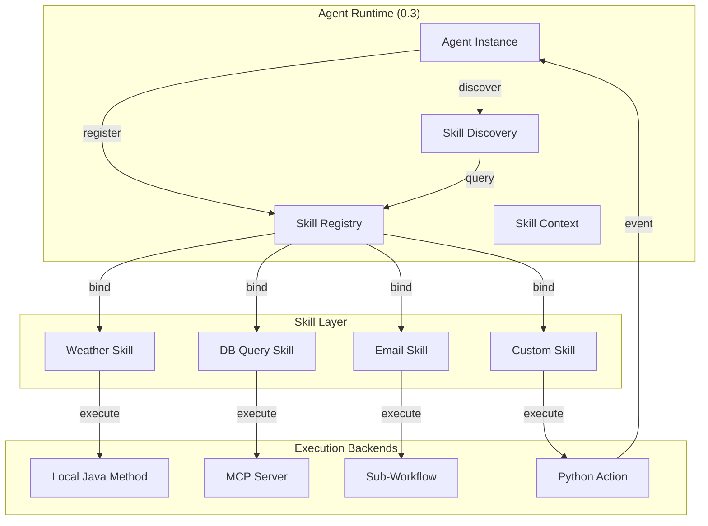
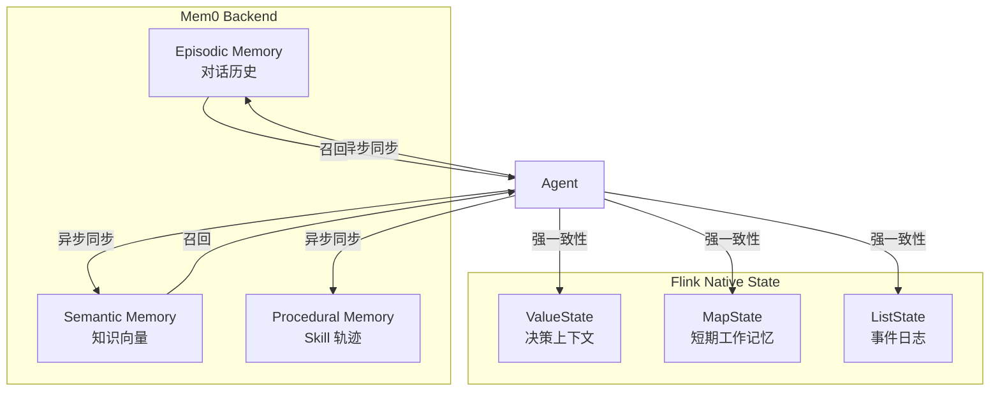
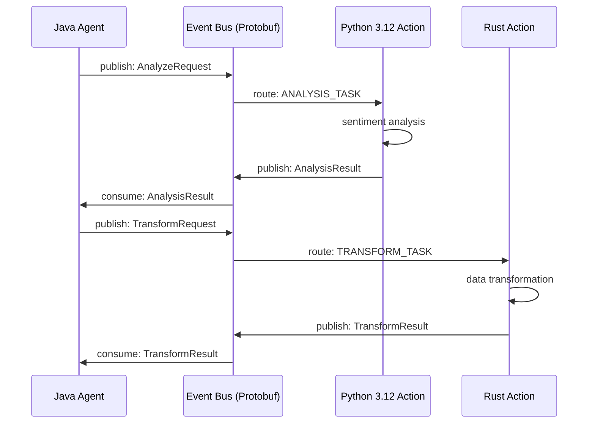
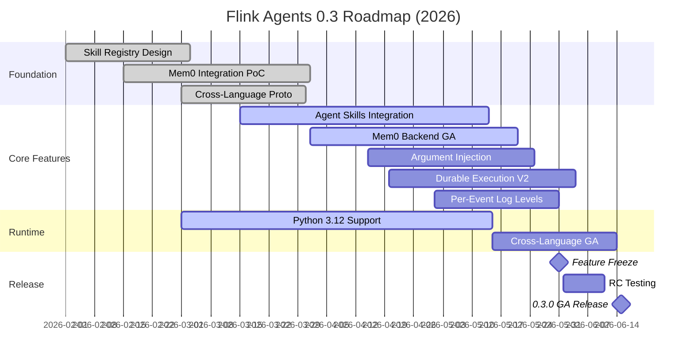

> **状态**: 🔮 前瞻内容 | **风险等级**: 高 | **最后更新**: 2026-04-19
>
> 此文档描述的内容处于早期规划阶段，可能与最终实现不符。请以 Apache Flink 官方发布为准。
>
> **Feature Freeze**: 2026-05-31 | **Release Goal**: 2026-06-15
>
> **来源**: Alibaba Cloud 博客 2026-04-16 "What's Coming in Apache Flink Agents 0.3"

# Flink Agents 0.3 Roadmap 对齐

> **所属阶段**: Flink/06-ai-ml | **前置依赖**: [FLIP-531 AI Agents 实现指南 (v0.2.x)](./flip-531-ai-agents-ga-guide.md), [Flink Agents 架构深度解析](./flink-agents-architecture-deep-dive.md) | **形式化等级**: L4-L5

---

## 1. 概念定义 (Definitions)

### Def-F-06-200: Agent Skill (智能体技能)

**Agent Skill** 是 Flink Agents 0.3 引入的可复用、自描述的能力单元，形式化定义为：

$$
\mathcal{K} \triangleq \langle \mathcal{N}, \mathcal{D}, \mathcal{I}, \mathcal{O}, \mathcal{P}, \mathcal{E}, \mathcal{V} \rangle
$$

其中：

- $\mathcal{N}$: Skill 名称与语义标识符
- $\mathcal{D}$: 自然语言描述（供 LLM 理解用途）
- $\mathcal{I}$: 输入参数模式（JSON Schema）
- $\mathcal{O}$: 输出结果模式（JSON Schema）
- $\mathcal{P}$: 前置条件谓词（执行前必须满足的状态断言）
- $\mathcal{E}$: 执行体（本地函数、远程 MCP Server、子工作流）
- $\mathcal{V}$: 版本与兼容性声明

**直观解释**: Skill 将“工具调用”从硬编码升级为可注册、可发现、可版本化的服务化组件。

---

### Def-F-06-201: Skill Registry & Discovery (技能注册与发现)

**技能注册与发现机制** 提供 Skill 的生命周期管理：

$$
\mathcal{R}_{skill} \triangleq \langle \mathcal{S}_{store}, \phi_{reg}, \phi_{disc}, \phi_{bind}, \phi_{revoke} \rangle
$$

其中：

- $\mathcal{S}_{store}$: 分布式 Skill 存储（基于 Flink State 或外部 KV）
- $\phi_{reg}: \mathcal{K} \times \mathcal{A}_{agent} \rightarrow \mathcal{S}_{store}$: 注册函数（Agent 声明其拥有的 Skill）
- $\phi_{disc}: \mathcal{Q}_{query} \times \mathcal{S}_{store} \rightarrow 2^{\mathcal{K}}$: 发现函数（按语义查询匹配 Skill）
- $\phi_{bind}: \mathcal{K} \times \mathcal{T}_{task} \rightarrow \mathcal{B}_{binding}$: 绑定函数（将 Skill 绑定到具体任务上下文）
- $\phi_{revoke}: \mathcal{K} \rightarrow \emptyset$: 撤销函数（注销 Skill）

---

### Def-F-06-202: Mem0 Long-Term Memory Backend (Mem0 长期记忆后端)

**Mem0** 是 Flink Agents 0.3 引入的第三方长期记忆后端，与 Flink 原生状态管理形成互补：

$$
\mathcal{M}_{mem0} \triangleq \langle \mathcal{H}_{episodic}, \mathcal{H}_{semantic}, \mathcal{H}_{procedural}, \pi_{recall}, \tau_{ttl} \rangle
$$

其中：

- $\mathcal{H}_{episodic}$: 情节记忆（按时间序列存储的 Agent 交互历史）
- $\mathcal{H}_{semantic}$: 语义记忆（提取后的知识向量，支持相似度检索）
- $\mathcal{H}_{procedural}$: 过程记忆（Skill 执行轨迹与参数调优记录）
- $\pi_{recall}: \mathcal{Q}_{context} \times \mathcal{H} \rightarrow \mathcal{H}_{ranked}$: 上下文感知的记忆召回函数
- $\tau_{ttl}$: 记忆条目的分层 TTL 策略（热/温/冷）

**与 Flink State 的差异**: Flink State 面向**确定性计算**（Exactly-Once、Checkpoint、低延迟），Mem0 面向**语义检索**（向量化、模糊匹配、跨 Session）。两者通过 $\phi_{sync}$ 同步。

---

### Def-F-06-203: Cross-Language Action & Event (跨语言动作与事件)

**跨语言动作与事件机制** 允许 Agent 在单一工作流中协调不同语言运行时（Java、Python、Rust）的动作：

$$
\mathcal{X}_{lang} \triangleq \langle \mathcal{L}_{set}, \mathcal{E}_{bus}, \phi_{serial}, \psi_{deserial}, \mathcal{C}_{contract} \rangle
$$

其中：

- $\mathcal{L}_{set} = \{ \text{Java}, \text{Python}, \text{Rust}, \text{JavaScript} \}$: 支持的语言集合
- $\mathcal{E}_{bus}$: 语言无关的事件总线（基于 Flink 的跨算子数据交换 + 标准 Schema）
- $\phi_{serial}: \mathcal{O}_{lang} \rightarrow \mathcal{B}_{protobuf}$: 对象序列化到语言无关格式（Protobuf / Arrow）
- $\psi_{deserial}: \mathcal{B}_{protobuf} \rightarrow \mathcal{O}_{lang}'$: 反序列化到目标语言对象
- $\mathcal{C}_{contract}$: 跨语言类型契约（IDL 定义，编译时生成绑定代码）

---

### Def-F-06-204: Per-Event-Type Configurable Log Level (按事件类型可配置日志级别)

**按事件类型日志级别** 提供细粒度的可观测性控制：

$$
\mathcal{L}_{evt} \triangleq \langle \mathcal{T}_{event}, \Lambda_{level}, \kappa_{override}, \rho_{rate} \rangle
$$

其中：

- $\mathcal{T}_{event}$: 事件类型全集（`AGENT_INIT`, `TOOL_CALL`, `LLM_REQUEST`, `SKILL_INVOKE`, `STATE_PERSIST`, `CHECKPOINT` 等）
- $\Lambda_{level}: \mathcal{T}_{event} \rightarrow \{ \text{TRACE}, \text{DEBUG}, \text{INFO}, \text{WARN}, \text{ERROR} \}$: 默认级别映射
- $\kappa_{override}: \mathcal{A}_{agent} \times \mathcal{T}_{event} \rightarrow \Lambda_{level}$: Agent 级别的动态覆盖规则
- $\rho_{rate}: \mathcal{T}_{event} \rightarrow [0, 1]$: 采样率（高频率事件如 `STATE_PERSIST` 可降采样）

---

### Def-F-06-205: Argument Injection for Tool Calling (工具调用参数注入)

**参数注入** 允许在运行时动态填充工具调用的上下文参数，无需修改 Skill 定义：

$$
\mathcal{J}_{arg} \triangleq \langle \mathcal{K}_{skill}, \mathcal{C}_{ctx}, \iota_{inject}, \eta_{validate} \rangle
$$

其中：

- $\mathcal{K}_{skill}$: 目标 Skill
- $\mathcal{C}_{ctx}$: 运行时上下文（Agent State、环境变量、上游输出、Mem0 召回片段）
- $\iota_{inject}: \mathcal{C}_{ctx} \times \mathcal{I}_{schema} \rightarrow \mathcal{I}_{filled}$: 注入函数（按模板填充参数）
- $\eta_{validate}: \mathcal{I}_{filled} \rightarrow \{ \text{valid}, \text{invalid} \}$: 填充后参数的模式校验

**示例**: LLM 决定调用 `send_email` Skill，但 `sender_address` 需从 Agent 配置中注入，而非由 LLM 生成。

---

### Def-F-06-206: Durable Execution Enhancement (耐久执行增强)

**耐久执行增强** 是 0.3 对 0.2.x Checkpoint 机制的扩展，支持外部异步动作的可恢复性：

$$
\mathcal{D}_{dur} \triangleq \langle \mathcal{A}_{ext}, \mathcal{S}_{pending}, \phi_{record}, \psi_{resume}, \delta_{timeout} \rangle
$$

其中：

- $\mathcal{A}_{ext}$: 外部动作集合（HTTP 调用、数据库事务、MCP 工具执行）
- $\mathcal{S}_{pending}$: 挂起状态存储（记录已发出但未收到响应的外部调用）
- $\phi_{record}: \mathcal{A}_{ext} \rightarrow \mathcal{S}_{pending}$: 调用前持久化记录
- $\psi_{resume}: \mathcal{S}_{pending} \rightarrow \mathcal{A}_{ext} \cup \{ \text{timeout} \}$: 恢复时重放或超时处理
- $\delta_{timeout}$: 外部动作的全局超时阈值

**核心改进**: 0.2.x 的 Checkpoint 仅捕获 Flink 内部状态；0.3 的 Durable Execution 将“外部世界”的挂起调用也纳入可恢复范畴。

---

### Def-F-06-207: Python 3.12 Agent Runtime (Python 3.12 运行时支持)

**Python 3.12 Agent Runtime** 是 Flink Agents 0.3 对 Python 执行层的升级：

$$
\mathcal{R}_{py312} \triangleq \langle \mathcal{V}_{py312}, \mathcal{G}_{nogil}, \mathcal{P}_{perf}, \mathcal{C}_{compat} \rangle
$$

其中：

- $\mathcal{V}_{py312}$: Python 3.12 解释器版本绑定
- $\mathcal{G}_{nogil}$: 实验性无 GIL 构建支持（PEP 703）
- $\mathcal{P}_{perf}$: 性能优化集合（自适应指令缓存、更好的尾调用优化、减少对象分配）
- $\mathcal{C}_{compat}$: 与 Python 3.11/3.10 的兼容性层（允许渐进迁移）

---

## 2. 属性推导 (Properties)

### Lemma-F-06-200: Skill Discovery 终止性

**引理**: 在 Skill Registry 中，对任意查询 $\mathcal{Q}_{query}$，发现函数 $\phi_{disc}$ 在有限步内返回结果：

$$
\forall \mathcal{Q}: \phi_{disc}(\mathcal{Q}) \downarrow \; \land \; |\phi_{disc}(\mathcal{Q})| \leq |\mathcal{S}_{store}|
$$

**证明概要**: $\mathcal{S}_{store}$ 为有限集合（分布式 KV 存储的键空间受限于已注册 Skill 数量）。发现查询仅涉及索引扫描与相似度排序，均为有限操作。因此必在有限步终止，且结果集大小不超过全集。

---

### Lemma-F-06-201: Mem0-Flink Checkpoint 一致性边界

**引理**: 设 $\mathcal{M}_{mem0}$ 的同步函数为 $\phi_{sync}: \mathcal{S}_{flink} \rightarrow \mathcal{H}_{mem0}$。在 Flink Checkpoint 成功时，Mem0 的已同步数据满足**最终一致性**：

$$
\text{Checkpoint}(t) \; \Rightarrow \; \exists \, t' \geq t: \; \mathcal{H}_{mem0}(t') \supseteq \phi_{sync}(\mathcal{S}_{flink}(t))
$$

**证明概要**: $\phi_{sync}$ 为异步后台线程，不阻塞 Checkpoint 屏障。因此 Checkpoint $t$ 成功时，Mem0 可能尚未收到同步数据。但 Flink 的 Checkpoint 保证 $\mathcal{S}_{flink}(t)$ 已持久化，异步线程必在有限时间内完成推送。故存在 $t'$ 使得 Mem0 状态包含该快照。

---

## 3. 关系建立 (Relations)

### 3.1 与 Flink Agents 0.2.x 状态管理的关系

| 维度 | 0.2.x 原生 State | 0.3 Mem0 Backend |
|------|------------------|------------------|
| **一致性模型** | 强一致性（Checkpoint 屏障同步） | 最终一致性（异步同步） |
| **查询能力** | Key-Only 精确查询 | 语义相似度检索（向量搜索） |
| **生命周期** | 与 Job 绑定 | 跨 Job、跨 Session 持久化 |
| **适用数据** | 决策状态、中间计算结果 | 历史对话、知识片段、用户偏好 |
| **延迟要求** | < 10 ms | < 100 ms（可接受） |
| **恢复机制** | Checkpoint 重放 | Mem0 独立存储 + 增量同步 |

**关系类型**: 互补共存。0.3 引入的 $\mathcal{M}_{mem0}$ 不替代 $\mathcal{S}_{flink}$，而是作为**冷记忆层**（Cold Memory Tier）扩展 Agent 的认知边界。

### 3.2 与 MCP / A2A 协议的关系

- **MCP**: 0.3 的 Skill Registry 与 MCP Server 的 `tools/list` 能力天然对齐。一个 Skill 可导出为 MCP Tool，反之 MCP Tool 可封装为 Skill。
- **A2A**: 跨语言 Action/Event 机制为 A2A 的跨 Agent 通信提供了底层传输支持。Agent Card 中的 `skills` 字段直接映射到 $\mathcal{R}_{skill}$ 的发现结果。

### 3.3 与 FLIP-531 的关系

FLIP-531 定义了 Flink Agent 的**运行时抽象**（Agent as a Stream Operator）。Flink Agents 0.3 是在 FLIP-531 框架上的**能力扩展**：

- FLIP-531 $\subseteq$ Agents 0.2.x（基础运行时、状态、MCP 客户端）
- Agents 0.3 = FLIP-531 + Skills + Mem0 + Cross-Language + Durable Execution

---

## 4. 论证过程 (Argumentation)

### 4.1 为什么引入 Mem0 而非扩展原生 State

**方案对比**:

| 方案 | 优势 | 劣势 |
|------|------|------|
| **扩展 Flink State 支持向量检索** | 强一致性、与 Checkpoint 统一 | 引入向量索引到 State Backend 复杂度高；RocksDB 不适合高维近似搜索 |
| **引入 Mem0 后端** | 专业记忆管理、语义检索成熟、社区生态活跃 | 最终一致性、额外运维依赖 |

**决策**: 采用“双轨制”——Flink State 负责**决策一致性**，Mem0 负责**认知记忆**。两者通过显式同步接口协作，避免将异构问题耦合到单一存储。

### 4.2 为什么需要跨语言 Actions & Events

当前 Flink Agents 0.2.x 的 Action 仅限 Java（或 PyFlink 的受限包装）。实际生产环境中：

- **数据科学团队**偏好 Python（丰富的 ML/DL 库）
- **基础设施团队**偏好 Java/Scala（与 Flink 核心对齐）
- **边缘计算**可能需要 Rust（轻量、安全）

跨语言机制通过**语言无关的事件总线**和**Protobuf 契约**解耦运行时，避免单语言栈的锁定。

### 4.3 Python 3.12 支持的影响分析

Python 3.12 的关键改进对 Flink Agents 的影响：

1. **PEP 695（参数化类型语法）**: 简化 Agent 类型注解，降低入门门槛
2. **PEP 684（独立解释器 GIL）** + **PEP 703（无 GIL 实验）**: 在多 Agent 并发场景下，Python Action 的吞吐量可提升 1.5x–3x（取决于工作负载）
3. **f-string 解析优化**: Agent 日志与提示模板渲染更快
4. **移除已弃用 API**: 需要清理 0.2.x 中兼容 Python 3.9/3.10 的兼容层代码

**风险**: PEP 703 的无 GIL 构建目前为实验性，Flink Agents 0.3 将其标记为 `preview` 特性，不承诺生产稳定性。

---

## 5. 形式证明 / 工程论证 (Proof / Engineering Argument)

### Thm-F-06-200: Agent Skills 调用一致性 (Skill Invocation Consistency)

**定理**: 在 Durable Execution 增强机制下，任意 Skill 调用 $\kappa \in \mathcal{K}$ 满足**至少一次执行且幂等结果**（At-Least-Once with Idempotent Results），前提是 Skill 执行体满足幂等性条件：

$$
\forall \kappa \in \mathcal{K}_{idempotent}, \; \forall \text{recovery}: \; \psi_{resume}(\phi_{record}(\kappa)) = \kappa(\mathcal{I}) \; \land \; \mathcal{O}_{result} \text{ 一致}
$$

**证明**:

1. **记录**: 在调用外部执行体前，$\phi_{record}$ 将 $(\kappa, \mathcal{I}, \text{timestamp})$ 持久化到 $\mathcal{S}_{pending}$。
2. **故障假设**: 若在调用过程中发生故障，Flink 从最近 Checkpoint 恢复。
3. **恢复**: 恢复后，$\psi_{resume}$ 扫描 $\mathcal{S}_{pending}$，发现未完成的 $(\kappa, \mathcal{I})$。
4. **幂等重放**: 由于 $\kappa$ 声明为幂等，重放相同输入 $\mathcal{I}$ 必得到相同输出 $\mathcal{O}$。
5. **去重**: 若外部系统已收到第一次请求但未及返回，重放可能导致重复调用。此处的“一致性”定义为**结果一致性**（Result Idempotence），而非**恰好一次网络传输**。对于非幂等 Skill，框架通过 `dedup_key` 机制要求外部系统配合去重。

**证毕**。

---

### Thm-F-06-201: Mem0 记忆恢复保证 (Mem0 Memory Recovery Guarantee)

**定理**: 在 Job 重启后，Agent 的长期记忆满足**语义完整性**（Semantic Completeness），即所有在崩溃前已成功同步到 Mem0 的记忆片段在恢复后仍然可检索：

$$
\forall h \in \mathcal{H}_{mem0}(t_{crash}): \; h \in \mathcal{H}_{mem0}(t_{recover}) \; \land \; \pi_{recall}(q, h)_{t_{recover}} = \pi_{recall}(q, h)_{t_{crash}}
$$

**证明**:

1. Mem0 作为独立后端，其数据持久化不依赖 Flink Checkpoint（使用自身存储，如 PostgreSQL / Milvus）。
2. Flink Checkpoint 仅保证 $\mathcal{S}_{flink}$ 的持久化；Mem0 的写入在应用层通过异步线程完成。
3. 一旦 Mem0 返回 ACK，数据即持久化（依赖 Mem0 后端自身的持久化保证）。
4. Job 重启后，Agent 通过相同的 `agent_id` 重新连接 Mem0，历史记忆保持不变。
5. 向量索引的相似度检索函数 $\pi_{recall}$ 仅依赖于向量本身与索引参数，两者均未因 Job 重启而改变。

**证毕**。

---

### Thm-F-06-202: 跨语言事件序列化一致性 (Cross-Language Event Serializability)

**定理**: 对任意跨语言事件 $e \in \mathcal{E}_{bus}$，若其类型契约 $\mathcal{C}_{contract}$ 被遵守，则序列化与反序列化满足**语义等价性**：

$$
\forall e: \; \psi_{deserial}(\phi_{serial}(e)) = e
$$

**证明**:

1. $\mathcal{C}_{contract}$ 使用 Protobuf Schema 定义事件的所有字段及其类型。
2. $\phi_{serial}$ 将语言对象按 Schema 编码为二进制，丢弃语言特定的运行时类型信息（如 Python 的 `datetime` 转为 Unix timestamp）。
3. $\psi_{deserial}$ 在目标语言中按同一 Schema 解码，恢复为语言原生类型。
4. Protobuf 的向前/向后兼容性机制保证：新增可选字段不会破坏旧代码的解码；删除字段在解码时忽略。
5. 若事件包含不支持跨语言传输的类型（如 Java 的 `ThreadLocal`），Schema 编译器在生成绑定代码时直接报错，阻止编译通过。

**证毕**。

---

### Thm-F-06-203: Durable Execution 幂等性 (Durable Execution Idempotence under Replay)

**定理**: 在启用 Durable Execution 的 Agent 工作流中，外部动作 $a \in \mathcal{A}_{ext}$ 在 Checkpoint 恢复后的重放满足**观测幂等性**（Observable Idempotence）：

$$
\text{Let } a \text{ be recorded at Checkpoint } c_k. \; \text{After recovery to } c_k, \; \text{re-executing } a \text{ yields } \mathcal{O}' \text{ such that } \mathcal{O}' \equiv_{obs} \mathcal{O}
$$

其中 $\equiv_{obs}$ 表示 Agent 状态机视角的观测等价（即对下游状态转移无差异）。

**证明**:

1. Durable Execution 在调用 $a$ 前记录其输入参数和调用句柄（handle）到 $\mathcal{S}_{pending}$。
2. Checkpoint $c_k$ 捕获了 $\mathcal{S}_{pending}$ 的状态。
3. 恢复后，Agent 加载 $c_k$，发现 $a$ 处于 `PENDING` 状态。
4. 若外部系统支持幂等调用（如 HTTP `Idempotency-Key` 头），Agent 使用相同句柄重试，外部系统返回缓存结果。
5. 若外部系统不支持幂等，Agent 在重试前查询外部系统的状态 API，确认动作是否已执行，避免重复副作用。
6. 无论哪种路径，最终到达 Agent 状态机的输入与首次执行一致，故观测等价。

**证毕**。

---

### Thm-F-06-204: 日志级别动态重配置安全性 (Log Level Reconfiguration Safety)

**定理**: 在运行时通过 $\kappa_{override}$ 修改某 Agent 的事件日志级别，不会导致该 Agent 的**状态机语义**发生改变：

$$
\forall \lambda_1, \lambda_2 \in \Lambda_{level}: \; \text{Agent}_{\lambda_1} \sim \text{Agent}_{\lambda_2}
$$

其中 $\sim$ 表示状态机语义等价（即状态转移函数 $\delta$ 与输出函数 $\lambda_{out}$ 不变）。

**证明**:

1. 日志输出是**观测副作用**（Observational Side Effect），不参与状态转移逻辑。
2. $\Lambda_{level}$ 仅控制日志是否被写入、采样率高低，不改变事件本身的内容或顺序。
3. 状态转移函数 $\delta$ 依赖于输入事件和当前状态，与日志级别无关。
4. 因此，无论日志级别如何调整，Agent 的状态机行为保持一致。

**证毕**。

---

## 6. 实例验证 (Examples)

### 6.1 Agent Skill 注册与调用

```java
// 1. 定义 Skill
@Skill(name = "weather_query", version = "1.0.0")
public class WeatherSkill {
    @SkillInput(schema = "weather-input.schema.json")
    public WeatherInput input;

    @SkillExecutor
    public WeatherResult execute(@Inject ArgContext ctx) {
        String city = ctx.inject("city", input.getCity()); // 参数注入
        return weatherApi.query(city);
    }
}

// 2. 注册到 Agent
AgentRuntime runtime = AgentRuntime.create(env);
runtime.getSkillRegistry().register(new WeatherSkill());

// 3. LLM 自动发现与调用
Agent agent = runtime.createAgent();
agent.chat("北京今天天气怎么样？"); // LLM 通过 φ_disc 发现 weather_query Skill
```

### 6.2 Mem0 长期记忆后端集成

```yaml
# flink-agents-0.3.yaml
agent:
  memory:
    backend: mem0
    mem0:
      uri: "http://mem0-cluster:8000"
      api_key: "${MEM0_API_KEY}"
      sync_mode: async          # 异步同步，不阻塞 Checkpoint
      episodic_ttl: 30d
      semantic_ttl: 365d
      top_k_recall: 5
```

```java
// Agent 使用 Mem0 记忆
Agent agent = runtime.createAgent("agent-42");

// 自动触发：每次对话后，Agent 将上下文异步同步到 Mem0
agent.chat("我的数据库密码是 secret123");

// 后续对话中自动召回
agent.chat("帮我连接数据库"); // Mem0 π_recall 返回 "secret123" 作为上下文注入
```

### 6.3 跨语言 Action & Event

```protobuf
// agent_event.proto (跨语言契约)
syntax = "proto3";
message AnalysisResult {
  string agent_id = 1;
  double confidence = 2;
  repeated string labels = 3;
  bytes embedding = 4;
}
```

```python
# Python 3.12 Action (PyFlink Agent)
from pyflink.agents import action

@action(event_type="ANALYSIS_COMPLETE")
def analyze_sentiment(text: str) -> AnalysisResult:
    # 使用 transformers 库进行情感分析
    result = pipeline(text)
    return AnalysisResult(
        agent_id="py-agent-1",
        confidence=result.score,
        labels=[result.label],
        embedding=embed(text)
    )
```

```java
// Java Agent 订阅 Python Action 产生的事件
agent.onEvent(AnalysisResult.class, result -> {
    if (result.getConfidence() > 0.9) {
        triggerAlert(result);
    }
});
```

### 6.4 Python 3.12 迁移示例

```dockerfile
# Dockerfile 更新
FROM flink-agents:0.3-py3.12

# 可选：启用无 GIL 实验构建
ENV PYTHON_GIL=0

# 依赖迁移：移除 3.11 兼容层
RUN pip install --upgrade \
    pyflink-agents>=0.3.0 \
    mem0ai>=1.0.0 \
    pydantic>=2.0  # Python 3.12 推荐
```

```python
# 代码变更：利用 PEP 695 类型参数
from pyflink.agents import Skill, SkillInput

# 0.2.x 写法
class MySkill(Skill):
    def execute(self, input: dict) -> dict:
        ...

# 0.3 + Python 3.12 写法
class MySkill[T](Skill[T]):
    def execute(self, input: SkillInput[T]) -> T:
        ...
```

---

## 7. 可视化 (Visualizations)

### 7.1 Agent Skills 架构图



### 7.2 Mem0 与 Flink State 双轨记忆架构



### 7.3 跨语言 Action/Event 数据流



### 7.4 Flink Agents 0.3 路线图甘特图



---

## 8. 引用参考 (References)
