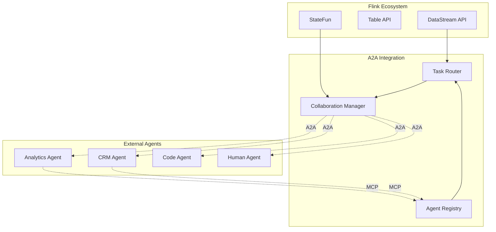
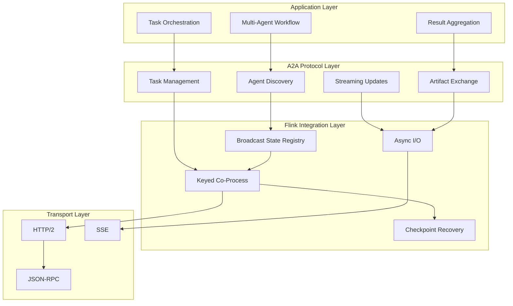
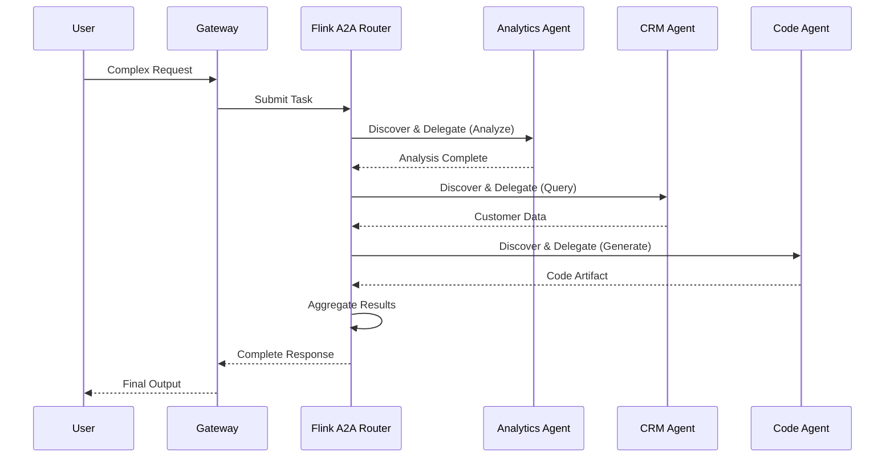
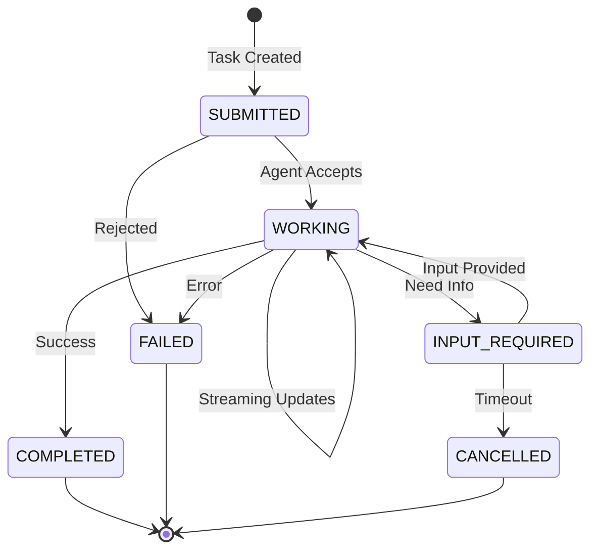

# Flink Agents A2A 协议实现指南

> **所属阶段**: Flink/06-ai-ml | **前置依赖**: [Flink Agents 架构深度解析](./flink-agents-architecture-deep-dive.md), [Flink Agents MCP集成](./flink-agents-mcp-integration.md) | **形式化等级**: L4-L5

---

## 1. 概念定义 (Definitions)

### Def-P2-15: Agent-to-Agent (A2A) Protocol

**A2A Protocol** is an open standard for Agent interoperability, formally defined as:

$$
\text{A2A} \triangleq \langle \mathcal{A}, \mathcal{T}, \mathcal{M}, \mathcal{C}, \mathcal{S}, \mathcal{P} \rangle
$$

Where:

- $\mathcal{A}$: Set of participating Agents
- $\mathcal{T}$: Task space with lifecycle states
- $\mathcal{M}$: Message format for communication
- $\mathcal{C}$: Capability discovery mechanism (Agent Card)
- $\mathcal{S}$: Security framework (OAuth2/mTLS)
- $\mathcal{P}$: Protocol primitives (send, subscribe, cancel)

### Def-P2-16: Flink A2A Integration

**Flink A2A Integration** maps streaming concepts to A2A protocol:

$$
\mathcal{I}_{A2A} = \langle \mathcal{F}_{stream}, \mathcal{G}_{a2a}, \phi_{task}, \psi_{event} \rangle
$$

**Mapping Relations**:

| Flink Concept | A2A Concept | Mapping |
|---------------|-------------|---------|
| Keyed Stream | Agent Instance | 1:1 per `agent_id` |
| Event Time | Task Timestamp | Direct mapping |
| Watermark | Task Timeout Boundary | Alert trigger |
| Checkpoint | Task State Persistence | Recovery point |
| Window | Task Aggregation | Result collection |

### Def-P2-17: Agent Card Registry

**Agent Card Registry** in Flink is a distributed capability directory:

$$
\mathcal{R}_{card} = \langle \mathcal{C}_{registry}, \mathcal{I}_{index}, \mathcal{Q}_{query}, \mathcal{U}_{update} \rangle
$$

**Registry Operations**:

| Operation | Description | State Type |
|-----------|-------------|------------|
| Register | Add new Agent Card | Broadcast State |
| Query | Search by capability | Keyed Query |
| Update | Refresh Agent Card | Incremental |
| Expire | Remove stale entries | TTL-based |

### Def-P2-18: Task Lifecycle in Streaming Context

**Task State Machine** adapted for Flink streaming:

$$
\mathcal{M}_{task} = \langle Q_{A2A} \cup \{STREAMING\}, \Sigma_{stream}, \delta_{flink}, q_0, F \rangle
$$

**Extended States**:

```
submitted → working → [streaming updates] → completed
   ↓           ↓              ↓               ↑
 failed ←── retry ──── stream_heartbeat ────┘
```

### Def-P2-19: Multi-Agent Streaming Topology

**Collaboration Topology** for streaming multi-Agent systems:

$$
\mathcal{T}_{collab} = \langle \mathcal{A}_{agents}, \mathcal{E}_{messaging}, \mathcal{R}_{roles}, \mathcal{B}_{backpressure} \rangle
$$

Where backpressure $\mathcal{B}$ ensures flow control across Agent boundaries.

---

## 2. 属性推导 (Properties)

### Thm-P2-10: A2A Task Delivery Guarantee

**定理**: A2A task delivery in Flink satisfies at-least-once semantics:

$$
\forall t \in \text{Tasks}: P(\text{Delivered}(t)) \geq 1 - \epsilon
$$

**Proof**:

1. **Kafka Source**: Offset tracking ensures no message loss
2. **Keyed Processing**: Task state isolated per Agent
3. **Retry Mechanism**: Failed deliveries retried with backoff
4. **Dead Letter Queue**: Exhausted retries captured for analysis

### Lemma-P2-04: Agent Card Cache Consistency

**引理**: Agent Card cache maintains eventual consistency:

$$
\forall c \in \text{Cards}: \Diamond (\text{Cache}(c) = \text{Origin}(c))
$$

**TTL Strategy**: Default 5 minutes with background refresh

### Prop-P2-06: Streaming Collaboration Latency

**命题**: End-to-end latency in multi-Agent streaming:

$$
L_{e2e} = L_{discovery} + L_{routing} + L_{execution} + L_{aggregation}
$$

**Typical Bounds**: $L_{e2e} < 5s$ for simple tasks, $< 30s$ for complex orchestration

---

## 3. 关系建立 (Relations)

### 3.1 A2A vs MCP Integration

| Dimension | MCP | A2A |
|-----------|-----|-----|
| **Abstraction** | Tool/Resource access | Agent collaboration |
| **Communication** | Request-Response | Bidirectional async |
| **State** | Connection-level | Task lifecycle-level |
| **Discovery** | Capability negotiation | Agent Card |
| **Flink Mapping** | Async I/O Operator | Keyed Co-Process |
| **Use Case** | Tool calling | Multi-Agent workflow |

### 3.2 A2A in Flink Ecosystem



### 3.3 Collaboration Patterns

| Pattern | Topology | Use Case | Flink Implementation |
|---------|----------|----------|---------------------|
| **Hub-Spoke** | Star | Central orchestration | KeyedBroadcastProcessFunction |
| **Pipeline** | Linear | Sequential processing | ConnectedStreams |
| **Mesh** | Full graph | Decentralized collaboration | IterativeDataSet |
| **Hierarchical** | Tree | Enterprise workflow | AsyncFunction chain |

---

## 4. 论证过程 (Argumentation)

### 4.1 Why A2A for Flink Agents?

**Problem**: Multi-Agent workflows require standardized coordination.

**Solution Comparison**:

| Approach | Pros | Cons | Fit |
|----------|------|------|-----|
| Custom RPC | Full control | Ecosystem lock-in | ❌ |
| Message Queue | Reliable | No standard semantics | ⚠️ |
| Workflow Engine | Structured | Not streaming-native | ⚠️ |
| A2A | Standard + Streaming | New protocol | ✅ |

### 4.2 Streaming vs Request-Response A2A

**Traditional A2A**: Synchronous, request-response based

**Streaming A2A Extensions**:

- Continuous task updates via SSE
- Real-time artifact streaming
- Event-driven collaboration triggers
- Backpressure-aware message flow

### 4.3 Fault Tolerance in Multi-Agent Systems

**Challenges**:

1. Partial failure of Agent network
2. Message loss in collaboration
3. Inconsistent task states

**Flink Solutions**:

1. **Checkpointing**: Capture collaboration state
2. **Exactly-once**: Ensure message delivery
3. **Timeout Handling**: Detect stale tasks
4. **Compensation**: Saga pattern for long-running workflows

---

## 5. 形式证明 / 工程论证 (Proof / Engineering Argument)

### Thm-P2-11: Multi-Agent Collaboration Consistency

**定理**: In Flink A2A integration, collaborative task outcomes are consistent across failures:

$$
\forall w \in \text{Workflows}: \text{Recover}(w) \Rightarrow \text{State}(w) = \text{State}_{expected}(w)
$$

**Proof**:

1. **State Capture**: Task states checkpointed at barriers
2. **Deterministic Replay**: Agent responses idempotent with request IDs
3. **Transaction Boundaries**: Task completion atomically committed
4. **Compensation Log**: Undo operations recorded for rollback

### Thm-P2-12: Agent Discovery Completeness

**定理**: Agent discovery via Flink registry is complete within bounded time:

$$
\forall a \in \text{Agents}: \Diamond (\text{Discovered}(a)) \land T_{discover} < T_{timeout}
$$

**Implementation**: Heartbeat-based liveness + periodic full sync

---

## 6. 实例验证 (Examples)

### 6.1 Java: A2A Protocol Implementation

```java
/**
 * Flink A2A Protocol Implementation
 * Supports Agent discovery, task delegation, and collaboration
 */
public class FlinkA2AProtocol {

    /**
     * Agent Card Registry using Broadcast State
     */
    public static class AgentRegistryFunction
        extends KeyedBroadcastProcessFunction<String, AgentHeartbeat,
            AgentRegistryCommand, AgentRegistryEvent> {

        // Broadcast state for Agent Cards
        private BroadcastState<String, AgentCard> agentCards;

        // Keyed state for agent liveness
        private MapState<String, Long> lastHeartbeat;

        // Configuration
        private static final long HEARTBEAT_TIMEOUT_MS = 60000;
        private static final long CHECK_INTERVAL_MS = 30000;

        @Override
        public void open(Configuration parameters) {
            MapStateDescriptor<String, AgentCard> cardDescriptor =
                new MapStateDescriptor<>("agent-cards", String.class, AgentCard.class);
            agentCards = getRuntimeContext().getBroadcastState(cardDescriptor);

            MapStateDescriptor<String, Long> heartbeatDescriptor =
                new MapStateDescriptor<>("last-heartbeat", String.class, Long.class);
            lastHeartbeat = getRuntimeContext().getMapState(heartbeatDescriptor);
        }

        @Override
        public void processElement(AgentHeartbeat heartbeat, ReadOnlyContext ctx,
                                   Collector<AgentRegistryEvent> out) throws Exception {
            String agentId = heartbeat.getAgentId();

            // Update liveness
            lastHeartbeat.put(agentId, ctx.currentProcessingTime());

            // Check if new or updated
            AgentCard existing = agentCards.get(agentId);
            if (existing == null || !existing.equals(heartbeat.getCard())) {
                // Register new or updated card
                agentCards.put(agentId, heartbeat.getCard());
                out.collect(new AgentRegistryEvent(
                    AgentRegistryEvent.Type.REGISTERED,
                    agentId,
                    heartbeat.getCard()
                ));
            }
        }

        @Override
        public void processBroadcastElement(AgentRegistryCommand command, Context ctx,
                                           Collector<AgentRegistryEvent> out) throws Exception {
            switch (command.getType()) {
                case QUERY:
                    // Query agents by capability
                    List<AgentCard> matches = new ArrayList<>();
                    for (Map.Entry<String, AgentCard> entry : agentCards.immutableEntries()) {
                        if (matchesCapability(entry.getValue(), command.getRequiredCapability())) {
                            matches.add(entry.getValue());
                        }
                    }
                    out.collect(new AgentRegistryEvent(
                        AgentRegistryEvent.Type.QUERY_RESULT,
                        null,
                        matches
                    ));
                    break;

                case EXPIRE_CHECK:
                    // Check for expired agents
                    long currentTime = ctx.currentProcessingTime();
                    List<String> expired = new ArrayList<>();

                    for (Map.Entry<String, Long> entry : lastHeartbeat.entries()) {
                        if (currentTime - entry.getValue() > HEARTBEAT_TIMEOUT_MS) {
                            expired.add(entry.getKey());
                        }
                    }

                    for (String agentId : expired) {
                        agentCards.remove(agentId);
                        lastHeartbeat.remove(agentId);
                        out.collect(new AgentRegistryEvent(
                            AgentRegistryEvent.Type.EXPIRED,
                            agentId,
                            null
                        ));
                    }
                    break;
            }
        }

        @Override
        public void onTimer(long timestamp, OnTimerContext ctx,
                           Collector<AgentRegistryEvent> out) throws Exception {
            // Schedule next expiration check
            ctx.timerService().registerProcessingTimeTimer(
                timestamp + CHECK_INTERVAL_MS
            );
        }

        private boolean matchesCapability(AgentCard card, String required) {
            return card.getSkills().stream()
                .anyMatch(skill -> skill.getId().equals(required));
        }
    }

    /**
     * A2A Task Router for multi-Agent collaboration
     */
    public static class A2ATaskRouter
        extends KeyedCoProcessFunction<String, TaskRequest, AgentResponse, TaskResult> {

        // Task state
        private ValueState<TaskContext> taskState;

        // Pending subtasks
        private MapState<String, SubTaskStatus> subTasks;

        // A2A client
        private transient A2AClient a2aClient;

        @Override
        public void open(Configuration parameters) {
            taskState = getRuntimeContext().getState(
                new ValueStateDescriptor<>("task-context", TaskContext.class));

            subTasks = getRuntimeContext().getMapState(
                new MapStateDescriptor<>("subtasks", String.class, SubTaskStatus.class));

            a2aClient = A2AClient.builder()
                .withDiscovery(new AgentCardDiscovery())
                .withAuth(OAuth2Provider.fromEnv())
                .withStreamingSupport(true)
                .build();
        }

        @Override
        public void processElement1(TaskRequest request, Context ctx,
                                   Collector<TaskResult> out) throws Exception {
            TaskContext context = taskState.value();
            if (context == null) {
                context = new TaskContext(request.getTaskId());
            }

            // Decompose task if needed
            if (request.isComplex()) {
                List<SubTask> subtasks = decomposeTask(request);

                for (SubTask subtask : subtasks) {
                    // Find capable agent
                    AgentCard targetAgent = findAgentForSubTask(subtask);

                    if (targetAgent != null) {
                        // Send task via A2A
                        sendA2ATask(subtask, targetAgent, ctx);
                        subTasks.put(subtask.getId(), SubTaskStatus.SENT);
                    } else {
                        // No agent available
                        subTasks.put(subtask.getId(), SubTaskStatus.FAILED);
                    }
                }

                context.setPendingSubTasks(subtasks.size());
            } else {
                // Simple task - execute directly
                TaskResult result = executeDirectly(request);
                out.collect(result);
            }

            taskState.update(context);
        }

        @Override
        public void processElement2(AgentResponse response, Context ctx,
                                   Collector<TaskResult> out) throws Exception {
            // Handle A2A response
            String subtaskId = response.getSubTaskId();
            SubTaskStatus status = subTasks.get(subtaskId);

            if (status != null) {
                status.setCompleted(true);
                status.setResult(response.getResult());
                subTasks.put(subtaskId, status);

                // Check if all subtasks complete
                TaskContext context = taskState.value();
                if (allSubTasksComplete()) {
                    TaskResult aggregated = aggregateResults(context);
                    out.collect(aggregated);

                    // Cleanup
                    taskState.clear();
                    subTasks.clear();
                }
            }
        }

        private void sendA2ATask(SubTask subtask, AgentCard targetAgent, Context ctx) {
            // Build A2A task
            Task a2aTask = Task.builder()
                .id(subtask.getId())
                .message(buildTaskMessage(subtask))
                .metadata(Map.of(
                    "parent_task", taskState.value().getTaskId(),
                    "requested_skill", subtask.getRequiredSkill()
                ))
                .build();

            // Send with streaming updates
            a2aClient.sendTaskStreaming(targetAgent, a2aTask, new TaskCallback() {
                @Override
                public void onStatusUpdate(TaskStatus status) {
                    // Forward status update
                    ctx.output(STATUS_TAG, new TaskStatusUpdate(
                        subtask.getId(), status
                    ));
                }

                @Override
                public void onArtifact(Artifact artifact) {
                    // Handle streaming artifact
                    ctx.output(ARTIFACT_TAG, new TaskArtifact(
                        subtask.getId(), artifact
                    ));
                }

                @Override
                public void onComplete(TaskResult result) {
                    // Will be handled by processElement2
                }

                @Override
                public void onError(A2AError error) {
                    // Mark subtask as failed
                    try {
                        subTasks.put(subtask.getId(), SubTaskStatus.FAILED);
                    } catch (Exception e) {
                        LOG.error("Failed to update subtask status", e);
                    }
                }
            });
        }

        private AgentCard findAgentForSubTask(SubTask subtask) {
            // Query registry for capable agent
            // Consider: load, latency, cost
            return a2aClient.discoverAgents(subtask.getRequiredSkill())
                .stream()
                .min(Comparator.comparing(this::estimateLoad))
                .orElse(null);
        }
    }

    /**
     * A2A Server implementation for Flink-hosted Agents
     */
    public static class FlinkA2AServer {

        private final AgentCard agentCard;
        private final A2ARequestHandler requestHandler;

        public FlinkA2AServer(AgentConfig config) {
            this.agentCard = buildAgentCard(config);
            this.requestHandler = new A2ARequestHandler(config);
        }

        public void start() {
            // Expose Agent Card at well-known endpoint
            exposeAgentCard();

            // Start HTTP server for A2A protocol
            Undertow server = Undertow.builder()
                .addHttpListener(8080, "0.0.0.0")
                .setHandler(path()
                    .addPrefixPath("/.well-known/agent.json",
                        exchange -> serveAgentCard(exchange))
                    .addPrefixPath("/a2a/tasks",
                        exchange -> handleTaskRequest(exchange))
                    .addPrefixPath("/a2a/tasks/{taskId}",
                        exchange -> handleTaskUpdate(exchange))
                )
                .build();

            server.start();
        }

        private void handleTaskRequest(HttpServerExchange exchange) {
            // Parse A2A task request
            TaskRequest request = parseRequest(exchange);

            // Validate against capabilities
            if (!validateCapability(request)) {
                exchange.setStatusCode(400);
                exchange.getResponseSender().send("Capability not supported");
                return;
            }

            // Submit to Flink for processing
            String taskId = submitToFlink(request);

            // Return task ID for polling/streaming
            exchange.setStatusCode(202);
            exchange.getResponseSender().send(
                JsonUtils.toJson(Map.of("taskId", taskId))
            );
        }

        private AgentCard buildAgentCard(AgentConfig config) {
            return AgentCard.builder()
                .name(config.getName())
                .description(config.getDescription())
                .url(config.getEndpoint())
                .version(config.getVersion())
                .capabilities(Capabilities.builder()
                    .streaming(true)
                    .pushNotifications(false)
                    .stateTransitionHistory(true)
                    .build())
                .authentication(Authentication.builder()
                    .schemes(Arrays.asList("Bearer", "OAuth2"))
                    .build())
                .skills(config.getSkills())
                .build();
        }
    }
}
```

### 6.2 Python: A2A Client and Server

```python
from typing import List, Dict, Optional, Callable
from dataclasses import dataclass, field
from enum import Enum
import asyncio
import aiohttp
from pyflink.datastream import StreamExecutionEnvironment
from pyflink.datastream.state import MapStateDescriptor, ValueStateDescriptor

class TaskStatus(Enum):
    SUBMITTED = "submitted"
    WORKING = "working"
    INPUT_REQUIRED = "input_required"
    COMPLETED = "completed"
    FAILED = "failed"
    CANCELLED = "cancelled"

@dataclass
class AgentCard:
    """A2A Agent Card representation"""
    name: str
    description: str
    url: str
    version: str
    capabilities: Dict
    authentication: Dict
    skills: List[Dict]

@dataclass
class Task:
    """A2A Task representation"""
    id: str
    message: Dict
    metadata: Dict = field(default_factory=dict)
    status: TaskStatus = TaskStatus.SUBMITTED
    artifacts: List[Dict] = field(default_factory=list)

class A2AClient:
    """
    A2A Protocol Client for Python/Flink
    """

    def __init__(self, discovery_endpoint: str = None):
        self.discovery_endpoint = discovery_endpoint
        self.agent_cache: Dict[str, AgentCard] = {}
        self.session: Optional[aiohttp.ClientSession] = None

    async def __aenter__(self):
        self.session = aiohttp.ClientSession()
        return self

    async def __aexit__(self, exc_type, exc_val, exc_tb):
        if self.session:
            await self.session.close()

    async def discover_agent(self, agent_url: str) -> AgentCard:
        """Discover Agent via well-known endpoint"""
        if agent_url in self.agent_cache:
            return self.agent_cache[agent_url]

        well_known_url = f"{agent_url}/.well-known/agent.json"

        async with self.session.get(well_known_url) as resp:
            if resp.status == 200:
                data = await resp.json()
                card = AgentCard(**data)
                self.agent_cache[agent_url] = card
                return card
            else:
                raise Exception(f"Agent discovery failed: {resp.status}")

    async def send_task(self, agent_card: AgentCard, task: Task) -> Task:
        """Send task to remote Agent"""
        task_url = f"{agent_card.url}/a2a/tasks"

        headers = {
            "Content-Type": "application/json",
            "Authorization": f"Bearer {self._get_auth_token()}"
        }

        async with self.session.post(
            task_url,
            json={
                "id": task.id,
                "message": task.message,
                "metadata": task.metadata
            },
            headers=headers
        ) as resp:
            if resp.status == 202:
                result = await resp.json()
                task.id = result.get("taskId", task.id)
                return task
            else:
                raise Exception(f"Task submission failed: {resp.status}")

    async def send_task_streaming(
        self,
        agent_card: AgentCard,
        task: Task,
        callback: Callable
    ) -> None:
        """Send task with streaming updates via SSE"""
        task_url = f"{agent_card.url}/a2a/tasks"

        headers = {
            "Content-Type": "application/json",
            "Authorization": f"Bearer {self._get_auth_token()}",
            "Accept": "text/event-stream"
        }

        async with self.session.post(
            task_url,
            json={"id": task.id, "message": task.message},
            headers=headers
        ) as resp:
            async for line in resp.content:
                line = line.decode('utf-8').strip()
                if line.startswith('data: '):
                    data = json.loads(line[6:])
                    await self._handle_sse_event(data, callback)

    async def _handle_sse_event(self, data: Dict, callback: Callable):
        """Handle SSE event from A2A server"""
        event_type = data.get("type")

        if event_type == "status":
            await callback.on_status_update(TaskStatus(data.get("status")))
        elif event_type == "artifact":
            await callback.on_artifact(data.get("artifact"))
        elif event_type == "completed":
            await callback.on_complete(data.get("result"))
        elif event_type == "error":
            await callback.on_error(data.get("error"))

    def _get_auth_token(self) -> str:
        # Implement token retrieval
        return os.getenv("A2A_AUTH_TOKEN")


class A2AStreamingIntegration:
    """
    Flink Streaming integration for A2A protocol
    """

    def __init__(self, env: StreamExecutionEnvironment):
        self.env = env
        self.agent_registry = {}

    def create_collaboration_flow(
        self,
        input_stream,
        orchestrator_agent: str,
        worker_agents: List[str]
    ):
        """
        Create a streaming multi-Agent collaboration flow

        Pattern: Orchestrator-Workers with A2A
        """

        # Step 1: Task decomposition by orchestrator
        decomposed = input_stream.map(
            lambda event: self._decompose_task(event, orchestrator_agent)
        )

        # Step 2: Distribute to worker agents via A2A
        distributed = decomposed.key_by(lambda x: x["worker_id"])\
            .process(A2ATaskSender(worker_agents))

        # Step 3: Collect responses
        collected = distributed.key_by(lambda x: x["parent_task_id"])\
            .window(TumblingProcessingTimeWindows.of(Time.seconds(30)))\
            .aggregate(ResultAggregator())

        # Step 4: Final synthesis
        result = collected.map(
            lambda agg: self._synthesize_results(agg, orchestrator_agent)
        )

        return result

    def _decompose_task(self, event: Dict, orchestrator: str) -> List[Dict]:
        """Decompose complex task into subtasks"""
        # Use LLM or rule-based decomposition
        # Return list of subtasks with assigned workers
        pass

    def _synthesize_results(self, aggregated: Dict, orchestrator: str) -> Dict:
        """Synthesize worker results into final output"""
        # Use orchestrator Agent for synthesis
        pass


class A2ATaskSender(KeyedProcessFunction):
    """
    Flink ProcessFunction for sending A2A tasks
    """

    def __init__(self, worker_agents: List[str]):
        self.worker_agents = worker_agents
        self.pending_tasks = None
        self.a2a_client = None

    def open(self, runtime_context):
        self.pending_tasks = runtime_context.get_map_state(
            MapStateDescriptor("pending-tasks", Types.STRING(), Types.PICKLED_BYTE_ARRAY())
        )
        self.a2a_client = A2AClient()

    def process_element(self, subtask, ctx, out):
        # Send via A2A
        asyncio.run(self._send_task(subtask))

        # Track pending
        self.pending_tasks.put(subtask["id"], subtask)

        # Register timeout
        ctx.timer_service().register_processing_time_timer(
            ctx.timestamp() + 60000  # 1 minute timeout
        )

    def on_timer(self, timestamp, ctx, out):
        # Check for timed out tasks
        for task_id, task in self.pending_tasks.items():
            if task["status"] == "SENT":
                # Retry or fail
                pass

    async def _send_task(self, subtask: Dict):
        async with self.a2a_client as client:
            agent_card = await client.discover_agent(subtask["agent_url"])
            task = Task(
                id=subtask["id"],
                message={"content": subtask["instruction"]},
                metadata={"parent_task": subtask["parent_id"]}
            )
            await client.send_task(agent_card, task)
```

### 6.3 Agent Card Configuration

```json
{
  "name": "flink-analytics-agent",
  "description": "Flink-based real-time analytics Agent",
  "url": "https://analytics-agents.flink.internal:8080",
  "version": "1.0.0",
  "provider": {
    "organization": "DataFlow Team",
    "url": "https://dataflow.example.com"
  },
  "capabilities": {
    "streaming": true,
    "pushNotifications": false,
    "stateTransitionHistory": true
  },
  "authentication": {
    "schemes": ["Bearer", "OAuth2"]
  },
  "defaultInputModes": ["text/plain", "application/json"],
  "defaultOutputModes": ["text/markdown", "application/json"],
  "skills": [
    {
      "id": "realtime_aggregation",
      "name": "Real-time Data Aggregation",
      "description": "Aggregate streaming data with windowing",
      "tags": ["analytics", "streaming", "aggregation"],
      "examples": [
        "Calculate real-time sales metrics for the last hour",
        "Aggregate user events by region"
      ],
      "inputModes": ["application/json"],
      "outputModes": ["application/json"]
    },
    {
      "id": "anomaly_detection",
      "name": "Streaming Anomaly Detection",
      "description": "Detect anomalies in real-time data streams",
      "tags": ["ml", "anomaly", "monitoring"],
      "examples": [
        "Detect unusual patterns in server metrics",
        "Identify fraud transactions in real-time"
      ]
    }
  ]
}
```

---

## 7. 可视化 (Visualizations)

### 7.1 A2A Protocol Stack in Flink



### 7.2 Multi-Agent Collaboration Flow



### 7.3 Task State Machine



---

## 8. 引用参考 (References)
