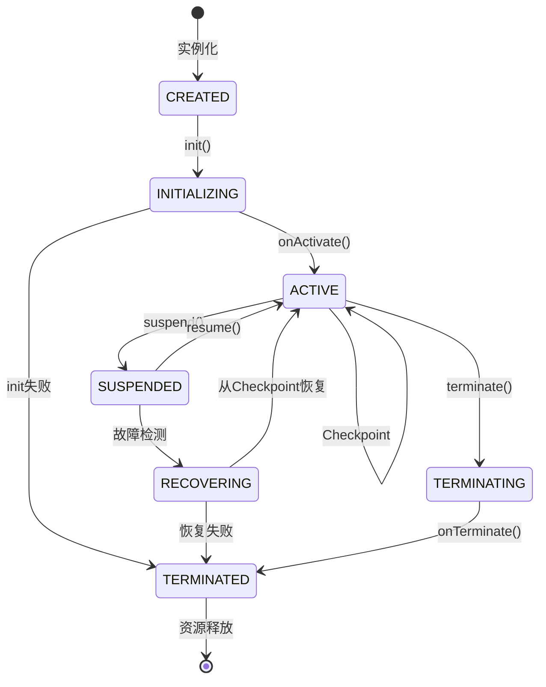
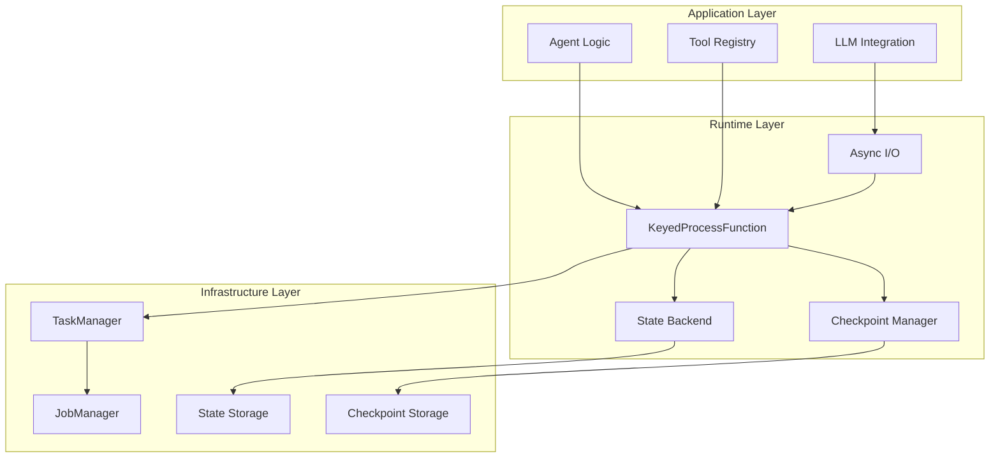
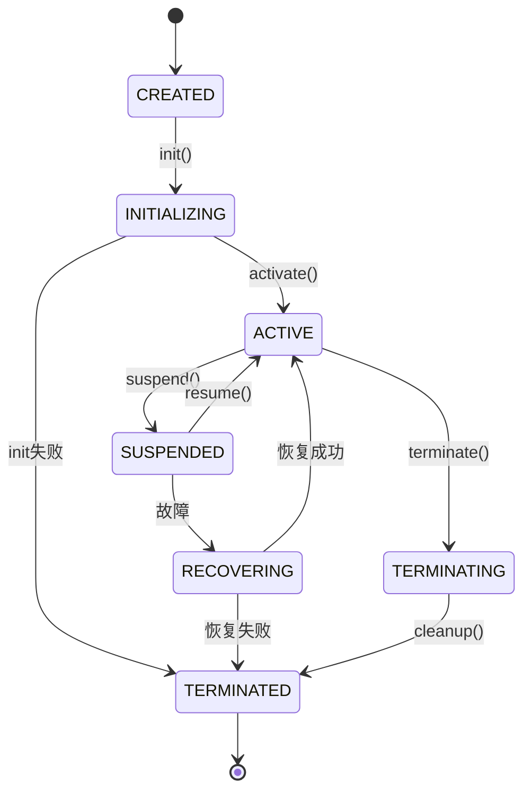
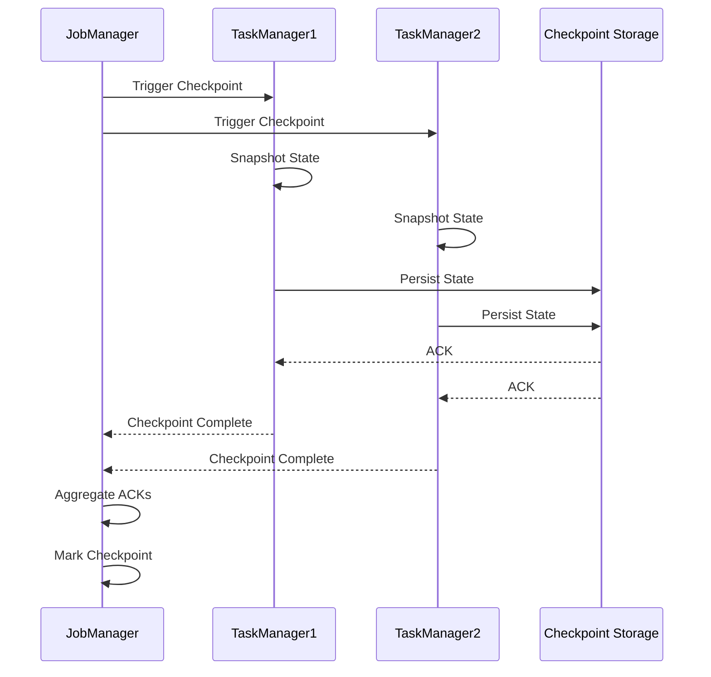

# Flink Agents 架构深度解析

> **状态**: ✅ Released (2026-02-06, Flink Agents 0.2.0)
> **Flink 版本**: Flink Agents 0.2.0+
> **稳定性**: GA (Generally Available)
>
> Apache Flink Agents 0.2.0 已于 2026-02-06 正式发布，新增 Embedding Models、Vector Stores、Java 异步执行等能力[^1]。
> **所属阶段**: Flink/06-ai-ml | **前置依赖**: [FLIP-531 AI Agents](flink-agents-flip-531.md), [Flink MCP集成](flink-agents-mcp-integration.md) | **形式化等级**: L4-L5

---

## 1. 概念定义 (Definitions)

### Def-P2-01: Agent Stream Processing Model

An Agent Stream Processing System is a tuple $\mathcal{A} = (A, S, M, \delta, \lambda)$ where:

- $A$: Set of agents
- $S$: State space
- $M$: Message alphabet
- $\delta: S \times M \rightarrow S$: State transition function
- $\lambda: S \rightarrow O$: Output function

### Def-P2-02: Flink Agent Lifecycle States

Flink Agent 生命周期状态机定义为一个七元组：

$$
\mathcal{L}_{agent} = \langle Q, \Sigma, \delta, q_0, F, \eta, \tau \rangle
$$

其中：

| 组件 | 符号 | 定义 | 描述 |
|------|------|------|------|
| 状态集 | $Q$ | $\{CREATED, INITIALIZING, ACTIVE, SUSPENDED, RECOVERING, TERMINATING, TERMINATED\}$ | Agent生命周期状态 |
| 输入字母表 | $\Sigma$ | $\{init, activate, suspend, recover, terminate, checkpoint\}$ | 触发事件 |
| 转移函数 | $\delta$ | $Q \times \Sigma \rightarrow Q$ | 状态转换 |
| 初始状态 | $q_0$ | $CREATED$ | 创建完成 |
| 终止状态 | $F$ | $\{TERMINATED\}$ | 生命周期结束 |
| 守卫条件 | $\eta$ | $\mathcal{V} \rightarrow \{true, false\}$ | 转换条件 |
| 超时约束 | $\tau$ | $Q \rightarrow \mathbb{R}^+$ | 状态最大停留时间 |

**状态转移语义**：

```
CREATED --init--> INITIALIZING --activate--> ACTIVE
   |                  |                |        |
   |                  |                |        v
   |                  |           suspend   RECOVERING
   |                  |                |        |
   |                  v                v        v
   +-----------> TERMINATING <------ TERMINATED
```

> **延伸阅读**: [Flink Agent生命周期状态机的形式化行为契约验证](../../formal-methods/08-ai-formal-methods/agent-behavior-contract-verification.md) —— 状态转移约束 $\mathcal{T}$ 满足状态机所有可达路径的 LTL 安全性与活性。

### Def-P2-03: Agent State Persistence Model

Agent 状态持久化模型定义：

$$
\mathcal{P}_{state} = \langle \mathcal{S}_{hot}, \mathcal{S}_{warm}, \mathcal{S}_{cold}, \phi_{migrate}, \psi_{recover} \rangle
$$

| 层级 | 存储介质 | 访问延迟 | 容量限制 | 持久化保证 |
|------|----------|----------|----------|------------|
| $\mathcal{S}_{hot}$ (热状态) | Heap Memory | < 1μs | 有限 | Checkpoint |
| $\mathcal{S}_{warm}$ (温状态) | RocksDB/ForSt | < 10ms | 较大 | Async Snapshot |
| $\mathcal{S}_{cold}$ (冷状态) | Remote Storage | < 100ms | 无限制 | Full Backup |

**状态迁移函数** $\phi_{migrate}$:
当热状态超过容量阈值 $\theta_{hot}$ 时，按 LRU 策略迁移至温状态：

$$
\phi_{migrate}(s) = \begin{cases}
\mathcal{S}_{hot} & \text{if } freq(s) > \theta_{freq} \\
\mathcal{S}_{warm} & \text{if } \theta_{cold} < freq(s) \leq \theta_{freq} \\
\mathcal{S}_{cold} & \text{otherwise}
\end{cases}
$$

### Def-P2-04: Agent Fault Tolerance Model

Agent 容错模型定义：

$$
\mathcal{F}_{tolerance} = \langle \mathcal{C}, \mathcal{R}, \mathcal{T}_{RTO}, \mathcal{T}_{RPO} \rangle
$$

其中：

- $\mathcal{C}$: Checkpoint 序列 $\{c_1, c_2, ..., c_n\}$
- $\mathcal{R}$: 恢复策略 $\{exactly-once, at-least-once, at-most-once\}$
- $\mathcal{T}_{RTO}$: 恢复时间目标 (Recovery Time Objective)
- $\mathcal{T}_{RPO}$: 恢复点目标 (Recovery Point Objective)

### Def-P2-05: Agent Scaling Model

### Def-P2-06: Embedding Models & Vector Stores (Agents 0.2.0)

**Embedding Models** 是 Flink Agents 0.2.0 引入的内置文本/图像嵌入能力，支持将原始数据转换为向量表示并存储到 Vector Store 中[^1]。

$$
\mathcal{E}_{model}: \mathcal{X} \rightarrow \mathbb{R}^d
$$

**Vector Stores** 提供向量的持久化存储与近邻检索接口：

$$
\mathcal{V}_{store} = \langle \mathcal{D}_{vectors}, \text{index}, \text{search}_k \rangle
$$

**Agents 0.2.0 内置能力矩阵：**

| 组件 | 支持模型/存储 | 说明 |
|------|--------------|------|
| Embedding Models | OpenAI text-embedding-3-small, sentence-transformers/all-MiniLM | 文本嵌入 |
| Vector Stores | In-memory HNSW, Milvus, Pinecone | 向量检索 |
| Async Execution | Java CompletableFuture, Python asyncio | 异步推理 |
| MCP Server | 内置 MCP Server 实现 | 对外暴露 Flink 数据 |

Agent 动态扩缩容模型：

$$
\mathcal{S}_{scale} = \langle \mathcal{M}_{metric}, \mathcal{T}_{threshold}, \mathcal{A}_{action}, \Delta_{cooldown} \rangle
$$

**扩容触发条件**：

$$
\text{ScaleOut} \iff \frac{load_{current}}{capacity_{current}} > \theta_{upper} \land \Delta t > \Delta_{cooldown}
$$

**缩容触发条件**：

$$
\text{ScaleIn} \iff \frac{load_{current}}{capacity_{current}} < \theta_{lower} \land \Delta t > \Delta_{cooldown}
$$

---

## 2. 属性推导 (Properties)

### Thm-P2-01: Agent Checkpoint Consistency

**定理**: Given an Agent Stream Processing System with checkpoint interval $\tau$, if all agents support stateful serialization, then the system achieves exactly-once semantics.

**证明概要**:

1. **Barrier 注入**: Checkpoint Coordinator 周期性地向所有 Source 注入 Barrier
2. **状态快照**: 当 Barrier 到达 Operator 时，触发状态异步快照
3. **确认收集**: 当所有 Sink 确认 Barrier 后，Checkpoint 完成
4. **故障恢复**: 从最近完成的 Checkpoint 恢复，重放未确认数据

$$
\forall e \in \text{Events}: \text{processed}(e) = 1 \land \text{state}(e) = \text{consistent}
$$

### Lemma-P2-01: State Serialization Completeness

**引理**: Agent 状态的可序列化性保证：

$$
\forall s \in S: \exists s' = serialize(s) \land deserialize(s') = s
$$

**约束条件**:

- 所有状态必须是 `java.io.Serializable` 或 Kryo 可序列化
- 避免存储不可序列化的资源（如网络连接、文件句柄）
- 状态大小需在配置限制内

### Prop-P2-01: Recovery Time Bound

**命题**: 故障恢复时间 $T_{recovery}$ 满足：

$$
T_{recovery} \leq T_{detect} + T_{load} + T_{replay}
$$

其中：

- $T_{detect}$: 故障检测时间（通常 < 10s）
- $T_{load}$: 状态加载时间（取决于状态大小）
- $T_{replay}$: 数据重放时间（通常 < Checkpoint 间隔）

### Thm-P2-02: Scaling Consistency

**定理**: 在动态扩缩容过程中，Agent 状态保持一致性：

$$
\forall k_{old}, k_{new}: \text{Rescale}(k_{old} \rightarrow k_{new}) \Rightarrow \bigcup_{i=1}^{k_{new}} S_i = \bigcup_{j=1}^{k_{old}} S_j
$$

**状态重分布策略**: 基于 Key Group 的哈希分区保证状态完整迁移。

---

## 3. 关系建立 (Relations)

### 3.1 Flink Agent 与流计算核心概念映射

| 流计算概念 | Flink Agent 映射 | 说明 |
|-----------|-----------------|------|
| Keyed Stream | Agent 实例 | 按 `agent_id` 分区，每个 Agent 独立状态 |
| ProcessFunction | Agent 决策逻辑 | 事件驱动的感知-决策-行动循环 |
| State Backend | Agent 记忆存储 | 持久化工作记忆和长期记忆 |
| Checkpoint | 可重放快照 | 支持调试、审计、故障恢复 |
| Watermark | 时间感知 | Agent 处理时间敏感任务 |
| Async I/O | LLM/工具调用 | 非阻塞外部服务调用 |

### 3.2 生命周期状态与 Checkpoint 关系



### 3.3 Agent 架构层次关系

```
┌─────────────────────────────────────────────────────────────────┐
│                    Application Layer                             │
│  ┌─────────────┐  ┌─────────────┐  ┌─────────────────────────┐  │
│  │ Agent Logic │  │ LLM Client  │  │ Tool Registry           │  │
│  └──────┬──────┘  └──────┬──────┘  └───────────┬─────────────┘  │
└─────────┼────────────────┼─────────────────────┼────────────────┘
          │                │                     │
          └────────────────┼─────────────────────┘
                           │ Flink Agent API
┌──────────────────────────┼──────────────────────────────────────┐
│                    Runtime Layer                                 │
│  ┌─────────────┐  ┌──────┴──────┐  ┌─────────────┐  ┌─────────┐  │
│  │ KeyedState  │  │ Checkpoint  │  │ Async I/O   │  │ Metrics │  │
│  └─────────────┘  └─────────────┘  └─────────────┘  └─────────┘  │
└──────────────────────────┬──────────────────────────────────────┘
                           │
┌──────────────────────────┼──────────────────────────────────────┐
│                    Infrastructure Layer                          │
│  ┌─────────────┐  ┌─────────────┐  ┌─────────────────────────┐  │
│  │ StateBackend│  │ JobManager  │  │ TaskManager             │  │
│  └─────────────┘  └─────────────┘  └─────────────────────────┘  │
└─────────────────────────────────────────────────────────────────┘
```

> **延伸阅读**: [Agent行为契约的形式化验证框架](../../formal-methods/08-ai-formal-methods/agent-behavior-contract-verification.md) —— 将 Agent 行为约束映射为流处理算子语义，通过 TLA+/Iris 证明状态转移、工具调用、副作用控制的正确性。

---

## 4. 论证过程 (Argumentation)

### 4.1 架构选型：为何选择 Flink 作为 Agent 运行时？

**传统 Agent 框架的局限**:

| 框架类型 | 代表 | 局限 |
|---------|------|------|
| 单进程框架 | LangChain, LlamaIndex | 无分布式能力，状态易失 |
| 微服务架构 | 自建服务 | 运维复杂，一致性难保证 |
| 批处理 | Spark | 延迟高，不适合实时交互 |

**Flink 的优势**:

1. **有状态流处理**: 每个 Agent 实例拥有独立的 Keyed State，自动故障恢复
2. **事件驱动架构**: 实时响应输入事件，毫秒级延迟
3. **可重放性**: Checkpoint + Event Log 支持完整重放
4. **水平扩展**: Agent 实例随分区自动分布

### 4.2 状态持久化策略对比

| 策略 | 优点 | 缺点 | 适用场景 |
|------|------|------|----------|
| 全内存 (Memory) | 最低延迟 | 无持久化、容量受限 | 临时计算、缓存 |
| RocksDB | 大容量、持久化 | 较高延迟 | 生产环境首选 |
| ForSt | 云原生优化 | 较新、生态待完善 | K8s 部署 |
| 增量 Checkpoint | 恢复快、网络少 | 依赖历史 Checkpoint | 大状态场景 |

### 4.3 反例分析：纯异步状态管理的风险

**场景**: Agent 需要维护跨会话的长期记忆

**纯异步方案问题**:

1. **状态丢失风险**: 进程崩溃导致未持久化状态丢失
2. **一致性难保证**: 并发更新导致状态冲突
3. **恢复复杂**: 需要手动重建状态

**Flink 解决方案**:

1. **增量 Checkpoint**: 自动持久化状态变更
2. **一致性语义**: 基于 Barrier 的同步点
3. **自动恢复**: 从 Checkpoint 自动重建

---

## 5. 形式证明 / 工程论证 (Proof / Engineering Argument)

### Thm-P2-03: Agent 状态恢复的 Exactly-Once 保证

**定理**: 在启用 Checkpoint 的 Flink Agent 系统中，故障恢复后状态与故障前一致：

$$
\forall t_{failure}: state_{recovered}(t_{failure}) = state_{original}(t_{failure})
$$

**证明**:

1. **Checkpoint 原子性**: 所有状态在 Barrier 对齐点原子性快照
2. **幂等处理**: 从 Checkpoint 恢复后，未确认数据重放保证幂等
3. **Sink 事务性**: 两阶段提交保证输出只提交一次

$$
\therefore \text{Exactly-Once 语义成立}
$$

### Thm-P2-04: 动态扩缩容的状态一致性

**定理**: 在扩容/缩容过程中，Agent 状态完整且不丢失：

$$
\text{Rescale}(k_1 \rightarrow k_2) \Rightarrow |\bigcup S_i|_{after} = |\bigcup S_j|_{before}
$$

**证明**:

1. **状态哈希**: Key Group 基于哈希分布，确定性地映射到并行实例
2. **迁移原子性**: 停止处理 → 状态序列化 → 重新分区 → 状态反序列化 → 恢复处理
3. **无数据丢失**: 每个 Key Group 恰好被一个实例管理

---

## 6. 实例验证 (Examples)

### 6.1 Java: Agent 生命周期管理实现

```java
import org.apache.flink.streaming.api.functions.KeyedProcessFunction;

import org.apache.flink.api.common.state.ValueState;
import org.apache.flink.api.common.state.ValueStateDescriptor;


/**
 * Agent 生命周期管理函数
 * 演示完整的生命周期状态转换
 */
public class AgentLifecycleFunction
    extends KeyedProcessFunction<String, AgentEvent, AgentState> {

    // 状态声明
    private ValueState<AgentContext> agentState;
    private ListState<AgentMemory> memoryState;
    private MapState<String, ToolConfig> toolRegistry;

    // 配置参数
    private final long checkpointInterval;
    private final Duration stateTTL;

    @Override
    public void open(Configuration parameters) {
        // 初始化热状态
        StateTtlConfig ttlConfig = StateTtlConfig.newBuilder(stateTTL)
            .setUpdateType(StateTtlConfig.UpdateType.OnCreateAndWrite)
            .setStateVisibility(StateTtlConfig.StateVisibility.NeverReturnExpired)
            .build();

        ValueStateDescriptor<AgentContext> stateDescriptor =
            new ValueStateDescriptor<>("agent-context", AgentContext.class);
        stateDescriptor.enableTimeToLive(ttlConfig);
        agentState = getRuntimeContext().getState(stateDescriptor);

        // 初始化记忆状态
        ListStateDescriptor<AgentMemory> memoryDescriptor =
            new ListStateDescriptor<>("agent-memory", AgentMemory.class);
        memoryState = getRuntimeContext().getListState(memoryDescriptor);

        // 初始化工具注册表
        MapStateDescriptor<String, ToolConfig> toolDescriptor =
            new MapStateDescriptor<>("tool-registry", String.class, ToolConfig.class);
        toolRegistry = getRuntimeContext().getMapState(toolDescriptor);
    }

    @Override
    public void processElement(AgentEvent event, Context ctx,
                               Collector<AgentState> out) throws Exception {
        AgentContext context = agentState.value();

        switch (event.getEventType()) {
            case INIT:
                // CREATED -> INITIALIZING
                context = initializeAgent(event);
                agentState.update(context);
                emitState(out, AgentLifecycleState.INITIALIZING, context);

                // 异步激活
                ctx.timerService().registerProcessingTimeTimer(
                    ctx.timestamp() + 100
                );
                break;

            case ACTIVATE:
                // INITIALIZING -> ACTIVE
                context.activate();
                agentState.update(context);
                emitState(out, AgentLifecycleState.ACTIVE, context);
                break;

            case SUSPEND:
                // ACTIVE -> SUSPENDED
                context.suspend();
                agentState.update(context);
                emitState(out, AgentLifecycleState.SUSPENDED, context);
                break;

            case RESUME:
                // SUSPENDED -> ACTIVE
                context.resume();
                agentState.update(context);
                emitState(out, AgentLifecycleState.ACTIVE, context);
                break;

            case TERMINATE:
                // ACTIVE/SUSPENDED -> TERMINATING
                context.startTermination();
                agentState.update(context);
                emitState(out, AgentLifecycleState.TERMINATING, context);

                // 延迟清理
                ctx.timerService().registerProcessingTimeTimer(
                    ctx.timestamp() + 5000
                );
                break;

            case CHECKPOINT:
                // 触发状态快照
                performCheckpoint(context);
                break;
        }
    }

    @Override
    public void onTimer(long timestamp, OnTimerContext ctx,
                       Collector<AgentState> out) throws Exception {
        AgentContext context = agentState.value();

        if (context.getState() == AgentLifecycleState.INITIALIZING) {
            // 自动激活
            context.activate();
            agentState.update(context);
            emitState(out, AgentLifecycleState.ACTIVE, context);
        } else if (context.getState() == AgentLifecycleState.TERMINATING) {
            // 完成终止
            context.completeTermination();
            emitState(out, AgentLifecycleState.TERMINATED, context);

            // 清理状态
            agentState.clear();
            memoryState.clear();
        }
    }

    private AgentContext initializeAgent(AgentEvent event) {
        return AgentContext.builder()
            .agentId(event.getAgentId())
            .state(AgentLifecycleState.INITIALIZING)
            .createdAt(System.currentTimeMillis())
            .config(event.getConfig())
            .build();
    }

    private void performCheckpoint(AgentContext context) {
        // 状态已在 Flink 管理层自动处理
        // 此处可添加自定义检查点逻辑
        context.updateCheckpointTimestamp();
    }

    private void emitState(Collector<AgentState> out,
                          AgentLifecycleState state,
                          AgentContext context) {
        out.collect(new AgentState(context.getAgentId(), state,
                                   System.currentTimeMillis(), context));
    }
}
```

### 6.2 Python: Agent 状态管理客户端

```python
from pyflink.datastream import StreamExecutionEnvironment
from pyflink.datastream.state import ValueStateDescriptor
from dataclasses import dataclass
from typing import Optional, Dict, Any
import json

@dataclass
class AgentState:
    """Agent 状态数据类"""
    agent_id: str
    lifecycle_state: str
    context: Dict[str, Any]
    memory: list
    tools_registered: list
    last_checkpoint: int

class FlinkAgentStateManager:
    """
    Flink Agent 状态管理器
    提供状态持久化、恢复和迁移功能
    """

    def __init__(self, env: StreamExecutionEnvironment):
        self.env = env
        self.state_backend = env.get_state_backend()

    def create_agent_state_descriptor(self, agent_type: str) -> ValueStateDescriptor:
        """创建 Agent 状态描述符"""
        return ValueStateDescriptor(
            name=f"agent-state-{agent_type}",
            type_info=Types.PICKLED_BYTE_ARRAY()  # 使用 Kryo 序列化
        )

    def configure_checkpointing(self,
                                 interval_ms: int = 60000,
                                 mode: str = "EXACTLY_ONCE") -> None:
        """配置 Checkpoint 策略"""
        self.env.enable_checkpointing(interval_ms)

        # Checkpoint 配置
        checkpoint_config = self.env.get_checkpoint_config()
        checkpoint_config.set_checkpointing_mode(
            CheckpointingMode.EXACTLY_ONCE if mode == "EXACTLY_ONCE"
            else CheckpointingMode.AT_LEAST_ONCE
        )
        checkpoint_config.set_min_pause_between_checkpoints(30000)
        checkpoint_config.set_checkpoint_timeout(600000)
        checkpoint_config.set_max_concurrent_checkpoints(1)
        checkpoint_config.enable_externalized_checkpoints(
            ExternalizedCheckpointCleanup.RETAIN_ON_CANCELLATION
        )

    def configure_state_backend(self, backend_type: str = "rocksdb") -> None:
        """配置状态后端"""
        if backend_type == "rocksdb":
            backend = RocksDBStateBackend("hdfs://checkpoints/agents")
            backend.setPredefinedOptions(PredefinedOptions.SPINNING_DISK_OPTIMIZED)
        elif backend_type == "memory":
            backend = MemoryStateBackend()
        elif backend_type == "fs":
            backend = FsStateBackend("hdfs://checkpoints/agents")
        else:
            raise ValueError(f"Unknown backend type: {backend_type}")

        self.env.set_state_backend(backend)

        # 增量 Checkpoint
        self.env.get_checkpoint_config().enable_unaligned_checkpoints()

class AgentLifecycleController:
    """
    Agent 生命周期控制器
    管理 Agent 的创建、激活、暂停、恢复和终止
    """

    def __init__(self, state_manager: FlinkAgentStateManager):
        self.state_manager = state_manager
        self.agents: Dict[str, AgentState] = {}

    async def create_agent(self, agent_id: str, config: Dict) -> AgentState:
        """创建新 Agent"""
        state = AgentState(
            agent_id=agent_id,
            lifecycle_state="CREATED",
            context={"config": config, "version": "1.0"},
            memory=[],
            tools_registered=[],
            last_checkpoint=0
        )
        self.agents[agent_id] = state
        return state

    async def activate_agent(self, agent_id: str) -> AgentState:
        """激活 Agent"""
        state = self.agents.get(agent_id)
        if not state:
            raise ValueError(f"Agent {agent_id} not found")

        if state.lifecycle_state not in ["CREATED", "SUSPENDED"]:
            raise ValueError(f"Cannot activate agent in state {state.lifecycle_state}")

        state.lifecycle_state = "ACTIVE"
        state.context["activated_at"] = time.time()
        return state

    async def suspend_agent(self, agent_id: str) -> AgentState:
        """暂停 Agent (用于维护或扩缩容)"""
        state = self.agents.get(agent_id)
        if not state or state.lifecycle_state != "ACTIVE":
            raise ValueError(f"Agent {agent_id} not active")

        state.lifecycle_state = "SUSPENDED"
        state.context["suspended_at"] = time.time()

        # 触发 Checkpoint 确保状态持久化
        await self.trigger_checkpoint(agent_id)
        return state

    async def recover_agent(self, agent_id: str,
                           checkpoint_path: Optional[str] = None) -> AgentState:
        """从 Checkpoint 恢复 Agent"""
        if checkpoint_path:
            # 从指定 Checkpoint 恢复
            state = await self.load_from_checkpoint(agent_id, checkpoint_path)
        else:
            # 从最新 Checkpoint 恢复
            state = await self.load_latest_checkpoint(agent_id)

        state.lifecycle_state = "RECOVERING"

        # 执行恢复逻辑
        await self.perform_recovery(state)

        state.lifecycle_state = "ACTIVE"
        return state

    async def terminate_agent(self, agent_id: str,
                              grace_period_ms: int = 5000) -> None:
        """优雅终止 Agent"""
        state = self.agents.get(agent_id)
        if not state:
            return

        state.lifecycle_state = "TERMINATING"

        # 最终 Checkpoint
        await self.trigger_checkpoint(agent_id)

        # 等待优雅关闭
        await asyncio.sleep(grace_period_ms / 1000)

        state.lifecycle_state = "TERMINATED"
        del self.agents[agent_id]

    async def trigger_checkpoint(self, agent_id: str) -> str:
        """触发手动 Checkpoint"""
        # 触发 Flink Checkpoint
        checkpoint_path = await self.state_manager.trigger_checkpoint(agent_id)

        state = self.agents.get(agent_id)
        if state:
            state.last_checkpoint = time.time()

        return checkpoint_path

    async def scale_agent(self, agent_id: str,
                         new_parallelism: int) -> AgentState:
        """动态扩缩容 Agent"""
        state = self.agents.get(agent_id)
        if not state:
            raise ValueError(f"Agent {agent_id} not found")

        # 先暂停
        await self.suspend_agent(agent_id)

        # 执行扩缩容(Flink 自动处理状态重分布)
        await self.state_manager.rescale(agent_id, new_parallelism)

        # 恢复
        return await self.resume_agent(agent_id)

# 使用示例 async def main():
    env = StreamExecutionEnvironment.get_execution_environment()

    # 创建状态管理器
    state_manager = FlinkAgentStateManager(env)
    state_manager.configure_checkpointing(interval_ms=30000)
    state_manager.configure_state_backend("rocksdb")

    # 创建生命周期控制器
    controller = AgentLifecycleController(state_manager)

    # 创建 Agent
    agent = await controller.create_agent(
        agent_id="analytics-agent-001",
        config={
            "llm_model": "gpt-4",
            "tools": ["search", "calculate", "visualize"],
            "memory_limit": "1GB"
        }
    )

    # 激活
    await controller.activate_agent(agent.agent_id)

    # 运行一段时间后...

    # 触发手动 Checkpoint
    checkpoint = await controller.trigger_checkpoint(agent.agent_id)
    print(f"Checkpoint created: {checkpoint}")

    # 模拟故障恢复
    recovered = await controller.recover_agent(agent.agent_id)
    print(f"Agent recovered: {recovered.lifecycle_state}")

    # 扩缩容
    await controller.scale_agent(agent.agent_id, new_parallelism=4)

    # 终止
    await controller.terminate_agent(agent.agent_id)

if __name__ == "__main__":
    asyncio.run(main())
```

### 6.3 生产环境配置模板

```yaml
# flink-agent-lifecycle.yaml
# Flink Agent 生命周期与状态管理配置

state:
  backend: rocksdb
  checkpoints:
    dir: hdfs:///flink/checkpoints/agents
    interval: 30s
    min-pause-between-checkpoints: 10s
    timeout: 10min
    max-concurrent: 1

  # 增量 Checkpoint 配置
  incremental-checkpoints: true

  # 本地恢复配置
  local-recovery: true

  # 状态 TTL
  ttl:
    enabled: true
    update-type: OnCreateAndWrite
    state-visibility: NeverReturnExpired

agent:
  lifecycle:
    # 初始化超时
    init-timeout: 30s

    # 激活延迟
    activation-delay: 100ms

    # 终止优雅期
    termination-grace-period: 5s

    # 自动 Checkpoint 间隔
    auto-checkpoint-interval: 60s

  # 状态大小限制
  state:
    max-hot-state-size: 100MB
    max-warm-state-size: 1GB

  # 恢复配置
  recovery:
    rto-target: 60s
    rpo-target: 30s
    max-retry-attempts: 3
    retry-backoff: exponential

# 扩缩容配置 scaling:
  enabled: true
  metric-window: 60s

  # 扩容阈值
  scale-up-threshold: 0.8
  scale-up-cooldown: 120s

  # 缩容阈值
  scale-down-threshold: 0.3
  scale-down-cooldown: 300s

  # 最大/最小并行度
  max-parallelism: 32
  min-parallelism: 1
```

---

## 7. 可视化 (Visualizations)

### 7.1 Agent 架构层次图



### 7.2 生命周期状态机



### 7.3 Checkpoint 流程



---

## 8. 引用参考 (References)

[^1]: Apache Flink Blog, "Apache Flink Agents 0.2.0 Release Announcement", February 6, 2026. <https://flink.apache.org/2026/02/06/apache-flink-agents-0.2.0-release-announcement/>


---

## 附录：Flink Agents 0.3 迁移指引与对比

> **状态**: 🔮 前瞻内容 | **风险等级**: 高 | **适用目标版本**: 0.3.0 (预计 2026-06-15)

### 架构演进：0.2.x → 0.3

| 架构层次 | 0.2.x 设计 | 0.3 设计 | 迁移注意点 |
|----------|------------|----------|------------|
| **API 层** | Agent Runtime API (0.2.x) | Agent Runtime API + Skill API | 新增 Skill 注册与发现端点 |
| **核心运行时** | Core Runtime Layer | Core Runtime + Durable Execution V2 | 外部调用状态纳入 Checkpoint |
| **记忆管理** | Hot/Warm/Cold 三级 Flink State | 双轨制：Flink State + Mem0 后端 | Mem0 作为冷记忆层异步挂载 |
| **协议层** | MCP Client/Server + A2A | 同上，新增跨语言事件总线 | Protobuf Schema 需在编译期生成 |
| **执行层** | Java 异步执行器 | Java + Python 3.12 + Rust 跨语言执行器 | 语言运行时资源隔离需重新评估 |

### 状态模型扩展

0.3 在原有 $\mathcal{P}_{state}$（Def-P2-03）基础上增加 Mem0 冷记忆层：

$$
\mathcal{P}_{state}^{0.3} = \langle \mathcal{S}_{hot}, \mathcal{S}_{warm}, \mathcal{S}_{cold}, \mathcal{M}_{mem0}, \phi_{migrate}, \psi_{recover}, \phi_{sync} \rangle
$$

- $\phi_{sync}: \mathcal{S}_{warm} \rightarrow \mathcal{M}_{mem0}$ 为后台异步同步线程
- 运维影响：需监控 Mem0 后端延迟与 Flink TaskManager 的堆外内存占用

### 配置迁移示例

```yaml
# 0.2.x 配置
agent:
  memory:
    hot_fraction: 0.4
    warm_backend: rocksdb

# 0.3 配置
agent:
  memory:
    hot_fraction: 0.3          # 建议下调，为 Mem0 同步预留资源
    warm_backend: rocksdb
    cold_backend:
      type: mem0
      uri: http://mem0:8000
      sync_batch_size: 100
```

### 性能影响预期

- **Skill Discovery**: 首次调用延迟增加 ~5 ms（注册表查询），后续命中本地缓存后消除
- **Mem0 同步**: 对 Checkpoint 间隔无影响（异步），但会增加网络 I/O
- **跨语言序列化**: Protobuf 序列化开销约 0.1–0.3 ms/事件，建议在批处理场景使用 Arrow

---
