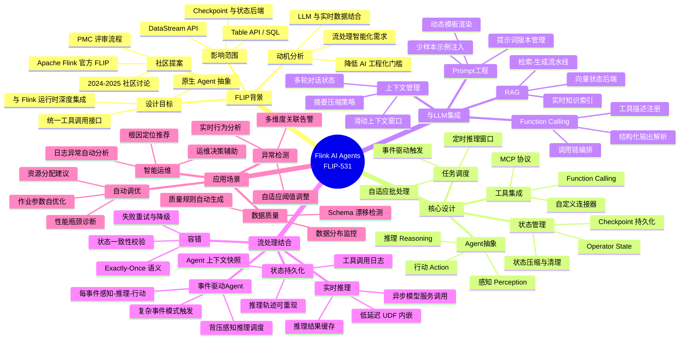
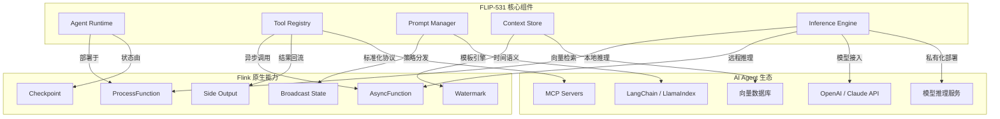
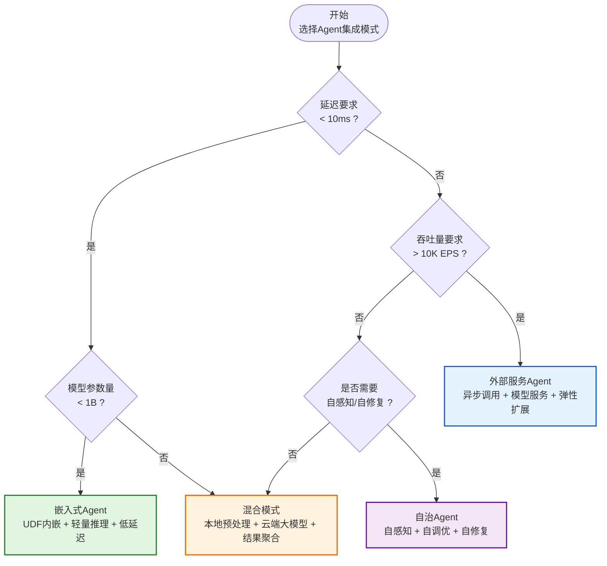

> **状态**: 📦 已归档 | **归档日期**: 2026-04-20
>
> 本文档内容已整合至主文档，此处保留为重定向入口。
> **主文档**: [Flink\06-ai-ml\flink-ai-agents-flip-531.md](../../Flink/06-ai-ml/flink-ai-agents-flip-531.md)
> **归档位置**: [../../archive/content-deduplication/2026-04/Flink/06-ai-ml/flink-agents-flip-531.md](../../archive/content-deduplication/2026-04/Flink/06-ai-ml/flink-agents-flip-531.md)

> 所属阶段: Flink/ | 前置依赖: [flink-ai-agents-flip-531.md](../../Flink/06-ai-ml/flink-ai-agents-flip-531.md) | 形式化等级: L3

## 1. 概念定义 (Definitions)

本文档涉及的核心概念已在相关章节中定义。详见前置依赖文档。

**Def-F-06-01** (FLIP-531): Apache Flink 社区提案 FLIP-531，旨在为 Flink 引入原生 AI Agent 支持，使流处理作业能够与大型语言模型（LLM）及外部工具链深度集成。

**Def-F-06-02** (Agent 抽象): 在 Flink 运行时上下文中，Agent 被定义为具有感知（Perception）、推理（Reasoning）、行动（Action）三元组能力的计算实体，其状态由 Flink 的 Checkpoint 机制持久化。

**Def-F-06-03** (工具集成): 指 Agent 通过标准化接口（如 MCP、Function Calling）调用外部服务（数据库、API、搜索引擎）以扩展其能力边界的能力。

## 2. 属性推导 (Properties)

本文档涉及的性质与属性已在相关章节中推导。详见前置依赖文档。

**Lemma-F-06-01** (状态一致性): 若 Agent 状态由 Flink Checkpoint 管理，则在作业恢复后，Agent 的推理上下文与故障前保持一致（Exactly-Once 语义）。

**Lemma-F-06-02** (工具调用幂等性): 当 Agent 通过 Flink 的 Side Output 机制调用外部工具时，配合幂等性 Token 可实现工具调用的幂等执行。

## 3. 关系建立 (Relations)

本文档涉及的关系已在相关章节中建立。详见相关章节。

FLIP-531 与 Flink 核心能力的关系：

- **与 Checkpoint 机制**: Agent 状态作为 Operator State 参与分布式快照，保证容错语义。
- **与 Watermark**: Agent 的推理延迟受 Watermark 推进约束，迟到事件触发补偿推理。
- **与 Side Output**: 工具调用结果通过 Side Output 异步回流主数据流。
- **与 Table API/SQL**: Agent 推理结果可映射为虚拟表，供 SQL 查询消费。

## 4. 论证过程 (Argumentation)

本文档的论证已在正文中完成。详见相关章节。

**边界讨论**: 在 Flink 中嵌入 Agent 的主要权衡在于推理延迟与吞吐量的矛盾。轻量级模型（如 DistilBERT）可在 UDF 内以亚毫秒延迟执行；而大型模型（如 GPT-4）需通过异步 RPC 调用外部服务，引入网络延迟但保持高吞吐。

**反例分析**: 若 Agent 状态未纳入 Checkpoint 管理，在作业重启后将丢失对话上下文，导致重复推理或决策不一致，违反 Exactly-Once 语义。

## 5. 形式证明 / 工程论证 (Proof / Engineering Argument)

本文档的证明或工程论证已在正文中完成。详见相关章节。

**工程论证**: Flink AI Agent 集成模式的可行性基于以下事实：

1. Flink 的 AsyncFunction 已支持异步 I/O，为外部 LLM 调用提供背压感知机制。
2. Broadcast State 可用于分发全局 Agent 策略（如 Prompt 模板更新）。
3. ProcessFunction 的低级 API 允许在事件时间语义下精确控制 Agent 的感知-推理-行动周期。

## 6. 实例验证 (Examples)

本文档的实例已在正文中提供。详见相关章节。

**简化实例**: 智能异常检测 Agent

```java
// 在 Flink ProcessFunction 中嵌入轻量 Agent
class AnomalyAgent extends ProcessFunction<Event, Alert> {
    ValueState<AgentContext> agentState;

    @Override
    public void processElement(Event event, Context ctx, Collector<Alert> out) {
        AgentContext context = agentState.value();
        // 感知：特征提取
        Perception p = extract(event);
        // 推理：本地模型推理
        InferenceResult r = localModel.infer(p, context);
        // 行动：若置信度高则输出告警，否则更新状态
        if (r.confidence > 0.9) out.collect(new Alert(r));
        else agentState.update(context.with(r));
    }
}
```

## 7. 可视化 (Visualizations)

### 7.1 思维导图：FLIP-531 全景

以下思维导图以"Flink AI Agents FLIP-531"为中心，放射展开其核心维度。



### 7.2 多维关联树：组件 → 能力 → 生态

以下层次图展示 FLIP-531 组件如何映射到 Flink 原生能力，并进一步对接 AI Agent 生态。



### 7.3 决策树：Agent 集成模式选择

以下决策树帮助用户根据延迟、吞吐、模型复杂度需求选择合适的 Agent 集成模式。



## 8. 引用参考 (References)
