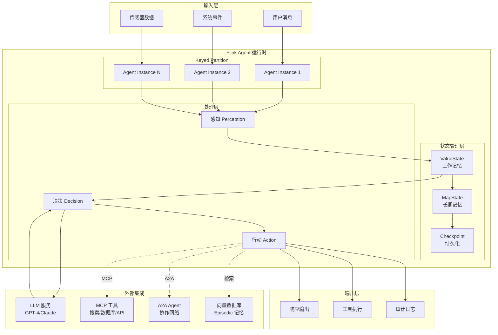
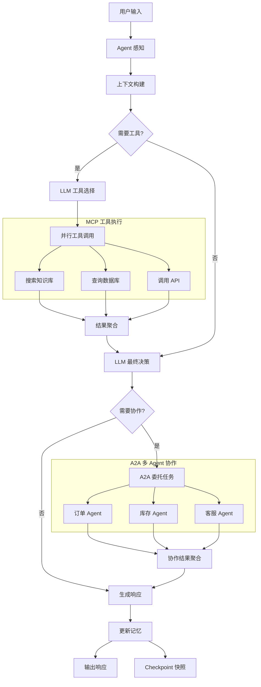
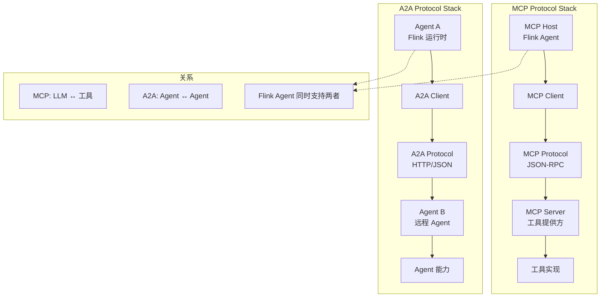
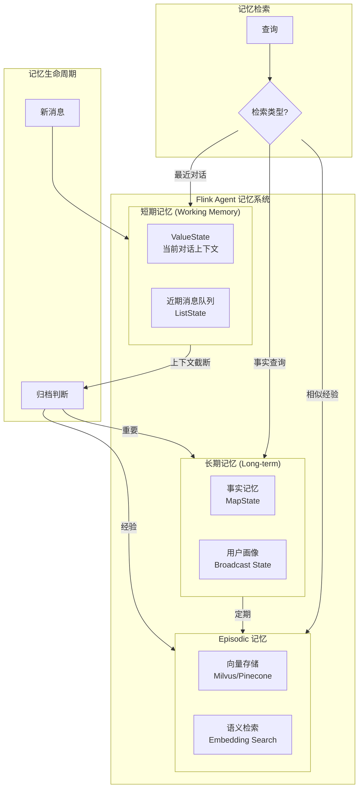
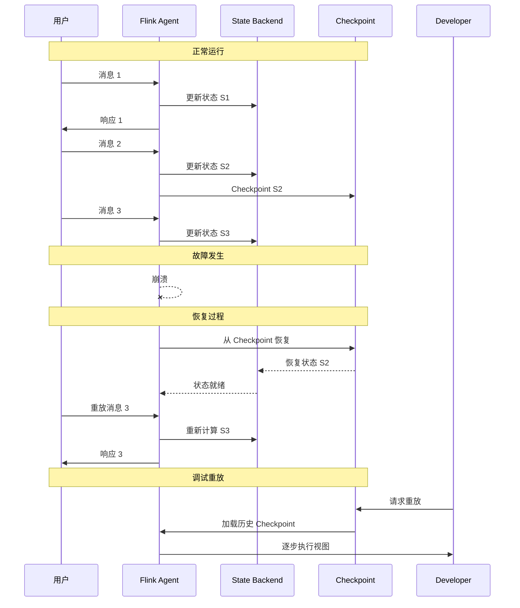

# Flink Agents (FLIP-531) - AI Agent原生运行时支持

> **所属阶段**: Flink AI/ML 扩展 | **前置依赖**: [Flink 与 LLM 集成](./flink-llm-integration.md), [Flink ML 架构](./flink-ml-architecture.md) | **形式化等级**: L3 (工程实现)

---

## 1. 概念定义 (Definitions)

### Def-F-12-30: Flink Agent

**定义**: Flink Agent 是一种基于流计算框架构建的自主智能体，形式化定义为六元组：

$$
\mathcal{A}_{Flink} = \langle S_{state}, P_{perception}, D_{decision}, A_{action}, M_{memory}, G_{goal} \rangle
$$

其中：

- $S_{state}$: Agent 状态空间，由 Flink Keyed State 持久化管理
- $P_{perception}$: 感知函数，将输入事件流映射为内部表示
- $D_{decision}$: 决策函数，基于当前状态和感知输入选择行动
- $A_{action}$: 行动集合，包括 LLM 调用、工具执行、消息发送等
- $M_{memory}$: 记忆存储，支持短期工作记忆和长期 episodic 记忆
- $G_{goal}$: 目标函数，定义任务完成条件和奖励机制

**直观解释**: Flink Agent 利用 Flink 的有状态流处理能力，使 AI Agent 能够持续接收环境输入、维护对话历史、调用外部工具，并在分布式环境中可靠运行。

---

### Def-F-12-31: Agentic Workflow (智能体工作流)

**定义**: Agentic Workflow 是一种支持多步骤推理和工具调用的流处理模式，形式化为有向图：

$$
\mathcal{W} = \langle N, E, \tau, \phi \rangle
$$

其中：

- $N = N_{agent} \cup N_{tool} \cup N_{llm}$: 节点集合，包含 Agent 节点、工具节点、LLM 节点
- $E \subseteq N \times N$: 控制流边，定义执行顺序
- $\tau: N \to \mathbb{T}$: 节点类型映射函数
- $\phi: E \to \mathcal{C}$: 边条件函数，定义状态转换谓词

**执行语义**: 工作流以事件驱动方式执行，每个节点处理完成后根据条件路由到下一个节点，形成动态执行路径。

---

### Def-F-12-32: MCP (Model Context Protocol) 集成

**定义**: MCP 是 Anthropic 提出的开放协议，用于标准化 LLM 与外部工具的交互。Flink MCP 集成定义如下：

$$
\text{MCP}_{Flink} = \langle \mathcal{T}, \mathcal{R}, \mathcal{C}, \mathcal{H} \rangle
$$

其中：

- $\mathcal{T} = \{t_1, t_2, ..., t_n\}$: 可用工具集合，每个工具具有 JSON Schema 描述的输入/输出
- $\mathcal{R}: Query \times \mathcal{T} \to [0,1]$: 工具选择相关性函数
- $\mathcal{C}: Prompt \times \mathcal{T} \to ToolCall$: 工具调用构造函数
- $\mathcal{H}: Observation \to Memory$: 观察结果到记忆的映射

**协议消息格式**:

```json
{
  "role": "assistant",
  "content": null,
  "tool_calls": [{
    "id": "call_xxx",
    "type": "function",
    "function": {
      "name": "search_database",
      "arguments": "{\"query\": \"...\"}"
    }
  }]
}
```

---

### Def-F-12-33: A2A (Agent-to-Agent) 协议

**定义**: A2A 协议是 Google 提出的开放 Agent 互操作标准，Flink A2A 实现支持：

$$
\text{A2A}_{Flink} = \langle \mathcal{P}, \mathcal{M}, \mathcal{S}, \mathcal{A} \rangle
$$

其中：

- $\mathcal{P}$: 参与 Agent 集合，每个 Agent 具有唯一的 `agent_id` 和 `endpoint`
- $\mathcal{M}$: 消息类型集合，包括 `task`, `response`, `status_update`, `artifact`
- $\mathcal{S}$: 会话状态机，定义任务生命周期（pending → working → input-required → completed/failed）
- $\mathcal{A}$: 认证与授权机制，支持 OAuth2 和 mTLS

**A2A 任务状态流转**:

```
pending → working → input-required → completed
   ↓         ↓            ↓              ↓
failed ←────┴────────────┴──────────────┘
```

---

### Def-F-12-34: Agent 记忆管理

**定义**: Flink Agent 记忆管理是一种分层状态存储机制：

$$
\mathcal{M}_{agent} = \langle M_{short}, M_{long}, M_{episodic} \rangle
$$

| 记忆类型 | 存储位置 | 生命周期 | 容量限制 |
|---------|---------|---------|---------|
| $M_{short}$ (工作记忆) | ValueState | 当前会话 | 上下文窗口 $C_{max}$ |
| $M_{long}$ (事实记忆) | State Backend + 外部 KV | 持久化 | 无限制 |
| $M_{episodic}$ ( episodic 记忆) | Vector DB | 长期存储 | 依赖向量存储 |

**记忆检索**: 使用向量相似度搜索实现语义检索：

$$
\text{Retrieve}(q, M_{episodic}, k) = \text{TopK}(\text{Embed}(q), V_M, k)
$$

---

### Def-F-12-35: Replayability (可重放性)

**定义**: Replayability 是 Flink Agent 的核心特性，支持基于 Checkpoint 的完整执行历史重放：

$$
\mathcal{R}_{replay} = \langle \mathcal{C}, \mathcal{L}, \mathcal{H} \rangle
$$

其中：

- $\mathcal{C}$: Checkpoint 序列 $\{c_1, c_2, ..., c_n\}$
- $\mathcal{L}$: 事件日志，记录所有输入事件和 Agent 决策
- $\mathcal{H}$: 重放函数，能够从任意 Checkpoint 恢复并重新执行

**应用场景**:

- **调试**: 重现特定场景下的 Agent 行为
- **审计**: 完整追溯决策过程
- **测试**: 基于真实历史数据回归测试
- **回滚**: 撤销错误决策并恢复状态

---

## 2. 属性推导 (Properties)

### Lemma-F-12-18: Agent 状态一致性

**陈述**: 设 Checkpoint 间隔为 $\Delta_c$，Agent 状态更新频率为 $f_s$，则状态一致性满足：

$$
\forall t: S_t = S_{c_k} + \sum_{i=c_k}^{t} \delta_i, \quad \text{其中 } c_k \leq t < c_{k+1}
$$

**工程推论**: Flink 的 Exactly-Once 语义确保 Agent 在故障恢复后状态完全一致，不会出现重复决策或状态丢失。

---

### Lemma-F-12-19: LLM 调用幂等性

**陈述**: 当启用 `request_id` 去重机制时，相同的 LLM 调用满足幂等性：

$$
\forall r: \text{LLM}(r) = \text{LLM}(r), \quad \text{且重复调用成本} = 0
$$

**实现机制**:

- 每个 LLM 请求生成唯一 UUID
- 响应缓存到 State Backend
- Checkpoint 包含未完成请求队列

---

### Lemma-F-12-20: Agent 工作流延迟边界

**陈述**: 设 Agent 工作流包含 $n$ 个节点，单节点平均处理延迟为 $\bar{l}$，LLM 调用延迟为 $l_{llm}$，则端到端延迟满足：

$$
L_{e2e} \leq n \cdot \bar{l} + k \cdot l_{llm} + O(\text{network overhead})
$$

其中 $k$ 为工作流中 LLM 调用次数。

**优化策略**:

- 并行化独立的工具调用
- 异步 LLM 调用避免阻塞
- 智能缓存减少重复推理

---

### Prop-F-12-03: MCP 工具选择的准确性

**命题**: 设工具集合大小为 $|\mathcal{T}| = n$，查询 $q$ 与工具 $t_i$ 的相关性为 $r_i = \mathcal{R}(q, t_i)$，则最优工具选择满足：

$$
t^* = \arg\max_{t \in \mathcal{T}} r_t, \quad \text{且 } r_{t^*} > \theta_{threshold}
$$

**准确性约束**: 当 $r_{t^*} \leq \theta_{threshold}$ 时，Agent 应请求澄清而非盲目执行。

---

### Prop-F-12-04: A2A 多 Agent 协作的收敛性

**命题**: 在有限状态空间下，A2A 协作任务的收敛时间 $T_{conv}$ 满足：

$$
T_{conv} \leq \frac{|S_{total}|}{\lambda_{progress}} \cdot \bar{l}_{response}
$$

其中 $\lambda_{progress}$ 为每轮平均状态推进率，$\bar{l}_{response}$ 为平均响应延迟。

**终止保证**: 设置全局超时 $T_{max}$，确保任务不会无限挂起。

---

## 3. 关系建立 (Relations)

### 3.1 Flink Agent 与流计算概念的映射

| 流计算概念 | Flink Agent 映射 | 说明 |
|-----------|-----------------|------|
| Keyed Stream | Agent 实例 | 按 `agent_id` 分区，每个 Agent 独立状态 |
| ProcessFunction | Agent 决策逻辑 | 事件驱动的感知-决策-行动循环 |
| State Backend | Agent 记忆存储 | 持久化工作记忆和长期记忆 |
| Checkpoint | 可重放快照 | 支持调试、审计、故障恢复 |
| Watermark | 时间感知 | Agent 处理时间敏感任务 |
| Async I/O | LLM/工具调用 | 非阻塞外部服务调用 |

### 3.2 FLIP-531 与现有 Flink 特性的关系

```
┌─────────────────────────────────────────────────────────────────┐
│                     FLIP-531 特性依赖图                          │
├─────────────────────────────────────────────────────────────────┤
│                                                                 │
│   ┌──────────────┐    ┌──────────────┐    ┌──────────────┐     │
│   │  DataStream  │    │   Table API  │    │    SQL       │     │
│   │     API      │◄───┤  ENDPOINT    │◄───┤   Agent DDL  │     │
│   └──────┬───────┘    └──────────────┘    └──────────────┘     │
│          │                                                      │
│          ▼                                                      │
│   ┌──────────────┐    ┌──────────────┐    ┌──────────────┐     │
│   │ Async I/O    │    │  Keyed State │    │  Checkpoint  │     │
│   └──────┬───────┘    └──────┬───────┘    └──────┬───────┘     │
│          │                   │                   │             │
│          └───────────────────┼───────────────────┘             │
│                              ▼                                 │
│                      ┌──────────────┐                         │
│                      │ Flink Agent  │                         │
│                      │  (FLIP-531)  │                         │
│                      └──────┬───────┘                         │
│                             │                                  │
│          ┌──────────────────┼──────────────────┐              │
│          ▼                  ▼                  ▼              │
│   ┌──────────────┐   ┌──────────────┐   ┌──────────────┐     │
│   │ MCP Protocol │   │ A2A Protocol │   │ LLM Router   │     │
│   └──────────────┘   └──────────────┘   └──────────────┘     │
│                                                                 │
└─────────────────────────────────────────────────────────────────┘
```

### 3.3 MCP vs A2A 协议对比

| 维度 | MCP | A2A |
|------|-----|-----|
| **定位** | LLM-工具交互标准 | Agent-Agent 通信标准 |
| **发起方** | Agent → Tool | Agent ↔ Agent |
| **通信模式** | 请求-响应 | 双向异步消息 |
| **状态管理** | 无状态 | 有状态 (会话) |
| **发现机制** | 工具目录注册 | Agent 能力卡片 |
| **主要场景** | 函数调用、RAG | 多 Agent 协作、任务委托 |

---

## 4. 论证过程 (Argumentation)

### 4.1 架构选择：为何选择 Flink 作为 Agent 运行时？

**传统 Agent 框架的局限**:

| 框架类型 | 代表 | 局限 |
|---------|------|------|
| 单进程框架 | LangChain, LlamaIndex | 无分布式能力，状态易失 |
| 微服务架构 | 自建服务 | 运维复杂，一致性难保证 |
| 批处理 | Spark | 延迟高，不适合实时交互 |

**Flink 的优势**:

```
优势1: 有状态流处理
┌─────────────────────────────────────────┐
│  每个 Agent 实例拥有独立的 Keyed State   │
│  → 自动故障恢复，状态不丢失               │
└─────────────────────────────────────────┘

优势2: 事件驱动架构
┌─────────────────────────────────────────┐
│  实时响应输入事件，毫秒级延迟            │
│  → 支持实时对话、流式输出                │
└─────────────────────────────────────────┘

优势3: 可重放性
┌─────────────────────────────────────────┐
│  Checkpoint + Event Log 支持完整重放     │
│  → 调试、审计、A/B 测试                  │
└─────────────────────────────────────────┘

优势4: 水平扩展
┌─────────────────────────────────────────┐
│  Agent 实例随分区自动分布               │
│  → 支持大规模多 Agent 部署               │
└─────────────────────────────────────────┘
```

### 4.2 反例分析：纯异步 LLM 调用的风险

**场景**: Agent 需要顺序执行 "查询数据库 → 分析结果 → 生成报告"

**纯异步方案问题**:

1. **状态竞争**: 并发 LLM 调用导致响应乱序
2. **上下文丢失**: 中间结果被覆盖
3. **调试困难**: 执行路径难以追踪

**Flink Agent 解决方案**:

1. **有序处理**: Keyed Stream 保证同 Agent 事件顺序
2. **状态隔离**: 每个步骤结果存储到 ValueState
3. **可追溯**: Checkpoint 记录完整执行历史

### 4.3 边界讨论：Agent 与 Workflow 的边界

| 特征 | Agent | Workflow |
|------|-------|----------|
| 决策能力 | 自主决策 | 预定义规则 |
| LLM 调用 | 动态规划 | 固定节点 |
| 工具使用 | 自适应选择 | 硬编码路径 |
| 适用场景 | 开放域任务 | 确定业务流程 |
| 可预测性 | 中等 | 高 |

**混合架构建议**:

- 使用 Workflow 编排确定性步骤
- 在决策节点嵌入 Agent 实现动态路由
- 复杂子任务委托给专用 Agent

---

## 5. 形式证明 / 工程论证 (Proof / Engineering Argument)

### Thm-F-12-30: Flink Agent 的 Exactly-Once 语义保证

**定理**: 在启用 Checkpoint 的 Flink Agent 系统中，对于任意 Agent 实例 $a_i$，其执行满足 Exactly-Once 语义：

$$
\forall e \in \text{Events}: \text{Process}(e) = 1 \land \text{Effect}(e) = \text{Consistent}
$$

**证明概要**:

1. **事件摄入层**: Kafka Source 使用 offset 跟踪，确保不丢不重
   - 设事件 $e$ 的 offset 为 $o_e$
   - Checkpoint 包含 $\{(o_1, s_1), (o_2, s_2), ...\}$

2. **Agent 处理层**: KeyedProcessFunction 状态更新原子性
   - 设状态转换函数为 $\delta: S \times E \to S'$
   - Checkpoint Barrier 确保 $S$ 和 $S'$ 同时快照

3. **LLM 调用层**: 幂等性通过 `request_id` 保证
   - 重复调用返回缓存结果
   - 成本只计算一次

4. **输出层**: 事务性 Sink 确保输出只提交一次

$$
\therefore \forall \text{failure scenario}: \text{recovery leads to consistent state}
$$

---

### Thm-F-12-31: Agent 记忆检索的准确性下界

**定理**: 设 episodic 记忆库大小为 $|M|$，查询嵌入与相关记忆嵌入的相似度为 $\cos(\theta)$，检索 Top-K 的准确率 $Acc@K$ 满足：

$$
Acc@K \geq 1 - \left(1 - \frac{K}{|M|}\right)^{\cos(\theta) \cdot |M_{relevant}|}
$$

**工程推论**:

- 当 $|M|$ 增大时，需要更精确的嵌入模型保持准确率
- 建议 $|M_{relevant}| \geq 5$ 且 $\cos(\theta) > 0.85$

---

### Thm-F-12-32: 多 Agent 协作的死锁避免

**定理**: 在 A2A 协议下，当满足以下条件时，系统无死锁：

1. **超时机制**: $\forall \text{task}: \exists T_{max}, \text{timeout}(\text{task}) \leq T_{max}$
2. **资源排序**: 工具资源按全局顺序申请
3. **循环检测**: 任务依赖图无环

**证明**:

假设存在死锁，则存在任务集合 $\{t_1, t_2, ..., t_n\}$ 形成循环等待：

$$
t_1 \to t_2 \to ... \to t_n \to t_1
$$

根据条件3，A2A 协议禁止循环依赖声明，矛盾。

根据条件1，即使循环形成，超时机制也会打破等待。

$$
\therefore \text{System is deadlock-free}
$$

---

## 6. 实例验证 (Examples)

### 6.1 基础配置：定义 Flink Agent

**Table API 方式**:

```sql
-- Def-F-12-30: Flink Agent DDL 定义

-- 注: 以下为未来可能的语法（概念设计阶段）
CREATE AGENT customer_support_agent
WITH (
  'agent.id' = 'support_agent_v1',
  'llm.model' = 'gpt-4-turbo',
  'llm.provider' = 'openai',
  'llm.temperature' = '0.7',
  'memory.type' = 'episodic',
  'memory.vector_store' = 'milvus',
  'mcp.enabled' = 'true',
  'mcp.tools' = 'search_knowledge_base,create_ticket,escalate'
);

-- Agent 输入表
CREATE TABLE customer_messages (
  session_id STRING,
  message_id STRING,
  content STRING,
  ts TIMESTAMP(3),
  WATERMARK FOR ts AS ts - INTERVAL '5' SECOND
) WITH (
  'connector' = 'kafka',
  'topic' = 'customer.messages'
);

-- Agent 输出表
CREATE TABLE agent_responses (
  session_id STRING,
  response_id STRING,
  content STRING,
  actions ARRAY<STRING>,
  confidence DOUBLE,
  ts TIMESTAMP(3)
) WITH (
  'connector' = 'kafka',
  'topic' = 'agent.responses'
);

-- 运行 Agent
INSERT INTO agent_responses
SELECT * FROM AGENT_RUN(
  'customer_support_agent',
  customer_messages
);
```

**DataStream API 方式**:

```java
// Def-F-12-31: DataStream API Agent 定义

public class CustomerSupportAgent {
    public static void main(String[] args) throws Exception {
        StreamExecutionEnvironment env =
            StreamExecutionEnvironment.getExecutionEnvironment();

        // 创建 Agent 配置
        AgentConfig config = AgentConfig.builder()
            .setAgentId("support_agent_v1")
            .setLlmModel("gpt-4-turbo")
            .setMemoryType(MemoryType.EPISODIC)
            .enableMcp(true)
            .addMcpTool("search_knowledge_base")
            .addMcpTool("create_ticket")
            .build();

        // 输入流
        DataStream<Message> messages = env
            .addSource(new KafkaSource<>())
            .keyBy(Message::getSessionId);

        // 创建并运行 Agent
        DataStream<AgentResponse> responses = messages
            .process(new FlinkAgentProcessFunction(config));

        // 输出
        responses.addSink(new KafkaSink<>());

        env.execute("Customer Support Agent");
    }
}

// Agent 处理函数
public class FlinkAgentProcessFunction
    extends KeyedProcessFunction<String, Message, AgentResponse> {

    private ValueState<AgentState> agentState;
    private transient LLMClient llmClient;
    private transient McpClient mcpClient;

    @Override
    public void open(Configuration parameters) {
        agentState = getRuntimeContext().getState(
            new ValueStateDescriptor<>("agent_state", AgentState.class));
        llmClient = LLMClient.create(config);
        mcpClient = McpClient.create(config);
    }

    @Override
    public void processElement(Message msg, Context ctx,
                               Collector<AgentResponse> out) {
        AgentState state = agentState.value();
        if (state == null) state = new AgentState();

        // 1. 感知：构建上下文
        PerceptionContext perception = buildPerception(msg, state);

        // 2. 决策：调用 LLM
        Decision decision = llmClient.decide(perception);

        // 3. 行动：执行工具调用
        if (decision.hasToolCalls()) {
            for (ToolCall call : decision.getToolCalls()) {
                Observation obs = mcpClient.execute(call);
                state.addObservation(obs);
            }
        }

        // 4. 更新状态
        state.addToHistory(msg, decision);
        agentState.update(state);

        // 5. 输出响应
        out.collect(new AgentResponse(
            msg.getSessionId(),
            decision.getResponse(),
            decision.getActions(),
            decision.getConfidence()
        ));
    }
}
```

---

### 6.2 MCP 工具调用示例

```java
// MCP 工具定义
@McpTool(
    name = "search_knowledge_base",
    description = "Search the knowledge base for relevant articles",
    schema = SearchRequest.class
)
public class KnowledgeBaseSearch implements McpToolHandler {

    @Override
    public ToolResponse execute(SearchRequest request) {
        // 向量检索
        List<Article> results = vectorStore.search(
            request.getQuery(),
            request.getTopK()
        );

        return ToolResponse.builder()
            .setResults(results)
            .setSource("knowledge_base")
            .build();
    }
}

// Agent 中的工具使用
public class AgentWithTools extends KeyedProcessFunction<String, Query, Response> {

    @Override
    public void processElement(Query query, Context ctx, Collector<Response> out) {
        // LLM 决定调用工具
        String llmPrompt = buildPrompt(query);
        LlmResponse llmResp = llmClient.complete(llmPrompt);

        if (llmResp.hasToolCalls()) {
            // 并行执行多个工具调用
            List<ToolCall> calls = llmResp.getToolCalls();
            List<Observation> observations = AsyncUtils.parallelExecute(
                calls,
                call -> mcpClient.execute(call),
                30, TimeUnit.SECONDS
            );

            // 将观察结果反馈给 LLM
            String finalResponse = llmClient.complete(
                buildFollowUpPrompt(llmResp, observations)
            );

            out.collect(new Response(query.getId(), finalResponse));
        }
    }
}
```

---

### 6.3 A2A 多 Agent 协作示例

```java
// A2A Agent 能力卡片定义
@AgentCard(
    name = "OrderProcessingAgent",
    version = "1.0.0",
    capabilities = {
        @Capability(name = "process_order", description = "..."),
        @Capability(name = "check_inventory", description = "...")
    },
    endpoint = "http://order-agent.flink:8080/a2a"
)
public class OrderProcessingAgent {

    // 处理来自其他 Agent 的任务
    @TaskHandler
    public TaskResponse handleTask(TaskRequest request) {
        switch (request.getCapability()) {
            case "process_order":
                return processOrder(request);
            case "check_inventory":
                return checkInventory(request);
            default:
                return TaskResponse.error("Unknown capability");
        }
    }
}

// 主 Agent 委托任务给子 Agent
public class MainAgent extends KeyedProcessFunction<String, UserRequest, Response> {
    private transient A2AClient a2aClient;

    @Override
    public void processElement(UserRequest req, Context ctx, Collector<Response> out) {
        // 分析请求并决定委托
        if (req.isOrderRelated()) {
            // 委托给订单处理 Agent
            TaskResponse orderResp = a2aClient.sendTask(
                AgentId.of("order_agent"),
                TaskRequest.builder()
                    .setCapability("process_order")
                    .setPayload(req.getOrderDetails())
                    .setTimeout(Duration.ofMinutes(5))
                    .build()
            );

            // 处理响应
            if (orderResp.isSuccess()) {
                out.collect(new Response(
                    req.getId(),
                    "Order processed: " + orderResp.getResult()
                ));
            } else {
                // 故障转移或人工介入
                escalateToHuman(req, orderResp.getError());
            }
        }
    }
}
```

---

### 6.4 记忆管理实现

```java
// 分层记忆管理
public class HierarchicalMemory {
    private ValueState<List<Message>> shortTermMemory;
    private MapState<String, Fact> longTermMemory;
    private transient VectorStore episodicMemory;

    public void addToMemory(Message message, Embedding embedding) {
        // 1. 更新工作记忆
        List<Message> workingMem = shortTermMemory.value();
        workingMem.add(message);

        // 2. 上下文截断
        if (estimateTokens(workingMem) > MAX_CONTEXT_TOKENS) {
            Message removed = workingMem.remove(0);
            // 重要消息转移到长期记忆
            if (removed.isImportant()) {
                longTermMemory.put(removed.getId(), new Fact(removed));
            }
        }

        shortTermMemory.update(workingMem);

        // 3. 更新 episodic 记忆
        episodicMemory.store(new MemoryEntry(
            message.getId(),
            embedding,
            message.getContent(),
            message.getTimestamp()
        ));
    }

    public List<MemoryEntry> retrieveRelevant(String query, int topK) {
        Embedding queryEmbedding = embeddingModel.embed(query);
        return episodicMemory.search(queryEmbedding, topK);
    }
}
```

---

### 6.5 Checkpoint 重放调试

```java
// 从特定 Checkpoint 重放 Agent
public class AgentReplay {
    public static void main(String[] args) throws Exception {
        StreamExecutionEnvironment env =
            StreamExecutionEnvironment.getExecutionEnvironment();

        // 加载 Checkpoint
        CheckpointLoader loader = CheckpointLoader.fromPath(
            "hdfs://checkpoints/agent-job/2025-04-01/chk-123"
        );

        // 重放配置
        ReplayConfig replayConfig = ReplayConfig.builder()
            .setStartTimestamp(Instant.parse("2025-04-01T10:00:00Z"))
            .setEndTimestamp(Instant.parse("2025-04-01T10:30:00Z"))
            .setSpeed(ReplaySpeed.REALTIME)  // 或 FAST_FORWARD
            .setDebugMode(true)
            .build();

        // 创建重放 Job
        DataStream<AgentEvent> replayedEvents = env
            .addSource(new CheckpointReplaySource(loader, replayConfig))
            .keyBy(AgentEvent::getAgentId)
            .process(new DebuggableAgentFunction());

        // 输出到调试 Sink
        replayedEvents.addSink(new DebugSink());

        env.execute("Agent Replay");
    }
}
```

---

### 6.6 生产部署配置

```yaml
# flink-conf.yaml - Agent 相关配置

# Agent 状态后端
state.backend: rocksdb
state.checkpoint-storage: filesystem
state.checkpoints.dir: hdfs:///flink/checkpoints/agents

# Checkpoint 配置
execution.checkpointing.interval: 30s
execution.checkpointing.min-pause-between-checkpoints: 10s
execution.checkpointing.timeout: 10min

# Agent 异步调用配置
agent.async.timeout: 60s
agent.async.capacity: 100
agent.retry.max-attempts: 3
agent.retry.backoff: exponential

# LLM 连接池
llm.connection.pool.size: 50
llm.connection.max-per-route: 20
llm.request.timeout: 30s

# MCP 配置
mcp.tools.auto-discover: true
mcp.tools.timeout: 10s
mcp.tools.cache.enabled: true

# A2A 配置
a2a.server.port: 8080
a2a.auth.enabled: true
a2a.auth.type: oauth2
a2a.task.timeout: 5min
```

---

## 7. 可视化 (Visualizations)

### 7.1 Flink Agent 整体架构图



### 7.2 Agent 工作流执行流程



### 7.3 MCP / A2A 协议栈对比



### 7.4 记忆管理层次结构



### 7.5 FLIP-531 路线图时间线

```mermaid
gantt
    title FLIP-531 Flink Agents 路线图
    dateFormat YYYY-MM
    section 规划中（以官方为准）
    FLIP 设计           :done, design, 规划中, 规划中
    社区评审            :active, review, 规划中, 规划中

    section 规划中（以官方为准）
    MVP 核心实现        :mvp, 规划中, 规划中
    Table API 扩展      :table, 规划中, 规划中
    MCP 集成            :mcp, 规划中, 规划中
    DataStream API      :ds, 规划中, 规划中

    section 规划中（以官方为准）
    A2A 协议支持        :a2a, 规划中, 规划中
    多 Agent 协作        :multi, 规划中, 规划中
    SQL 支持            :sql, 规划中, 规划中

    section 规划中（以官方为准）
    GA 发布             :ga, 规划中, 规划中
    生态工具            :eco, after ga, 规划中
```

### 7.6 Agent 故障恢复与重放机制



---

## 8. 引用参考 (References)


---

## 附录：定理与定义汇总

### 定义列表

| 编号 | 名称 | 描述 |
|------|------|------|
| Def-F-12-30 | Flink Agent | 基于流计算的智能体六元组定义 |
| Def-F-12-31 | Agentic Workflow | 智能体工作流有向图定义 |
| Def-F-12-32 | MCP 集成 | Model Context Protocol 集成定义 |
| Def-F-12-33 | A2A 协议 | Agent-to-Agent 协议定义 |
| Def-F-12-34 | Agent 记忆管理 | 分层状态存储机制 |
| Def-F-12-35 | Replayability | 可重放性定义 |

### 定理/命题/引理列表

| 编号 | 名称 | 描述 |
|------|------|------|
| Lemma-F-12-18 | Agent 状态一致性 | Checkpoint 一致性保证 |
| Lemma-F-12-19 | LLM 调用幂等性 | 去重机制保证 |
| Lemma-F-12-20 | Agent 工作流延迟边界 | 端到端延迟分析 |
| Prop-F-12-03 | MCP 工具选择准确性 | 工具选择下界 |
| Prop-F-12-04 | A2A 多 Agent 协作收敛性 | 协作任务收敛分析 |
| Thm-F-12-30 | Exactly-Once 语义保证 | 核心容错定理 |
| Thm-F-12-31 | 记忆检索准确性下界 | 语义检索分析 |
| Thm-F-12-32 | 多 Agent 协作死锁避免 | 并发安全定理 |
