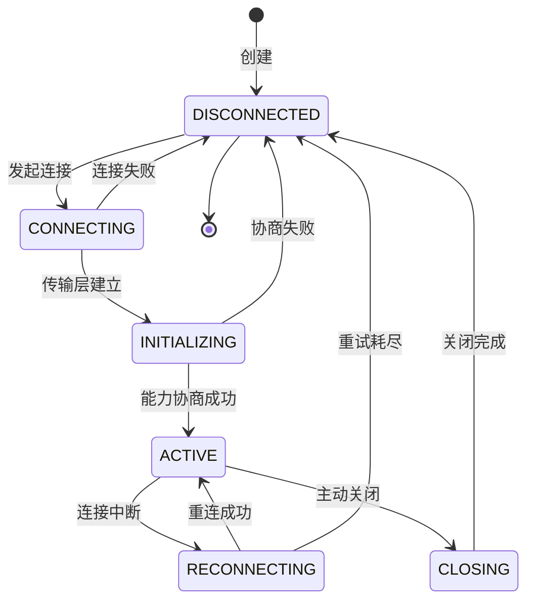
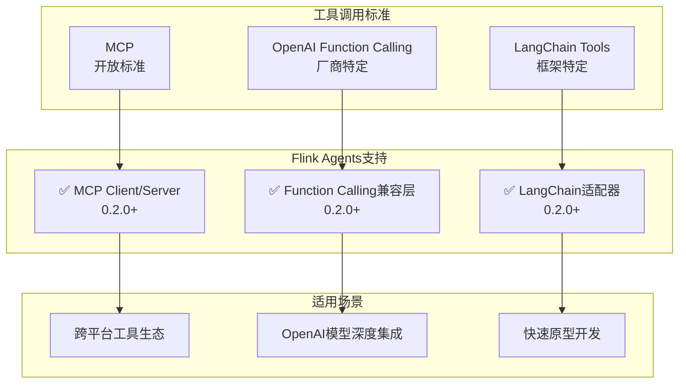
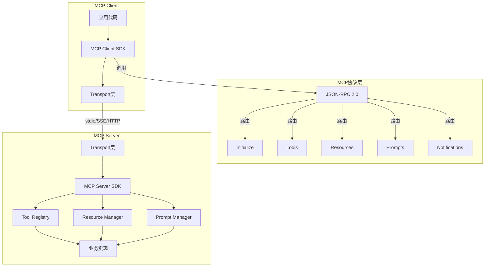
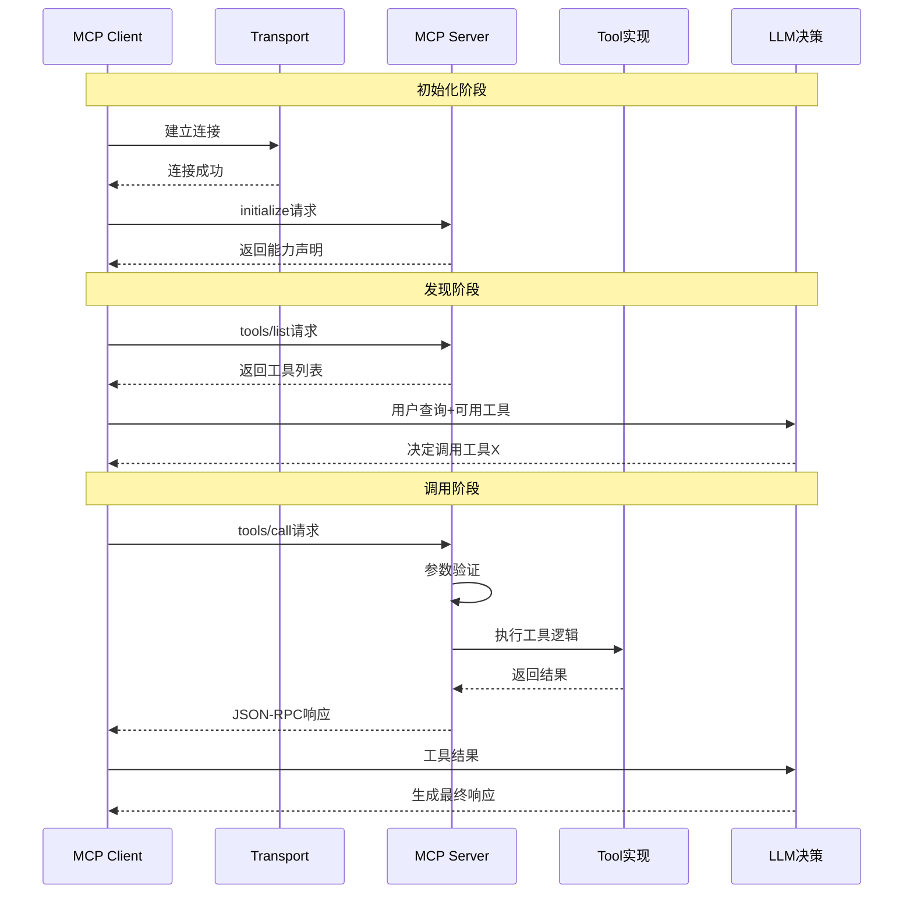
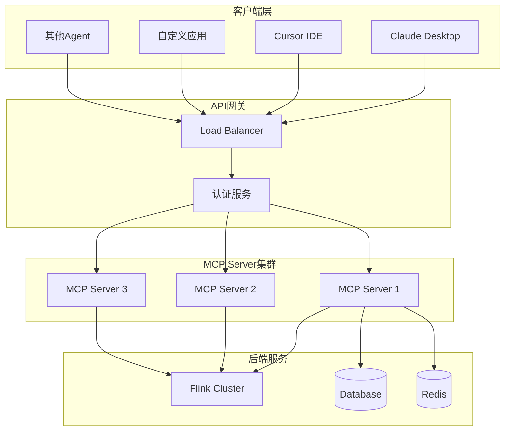
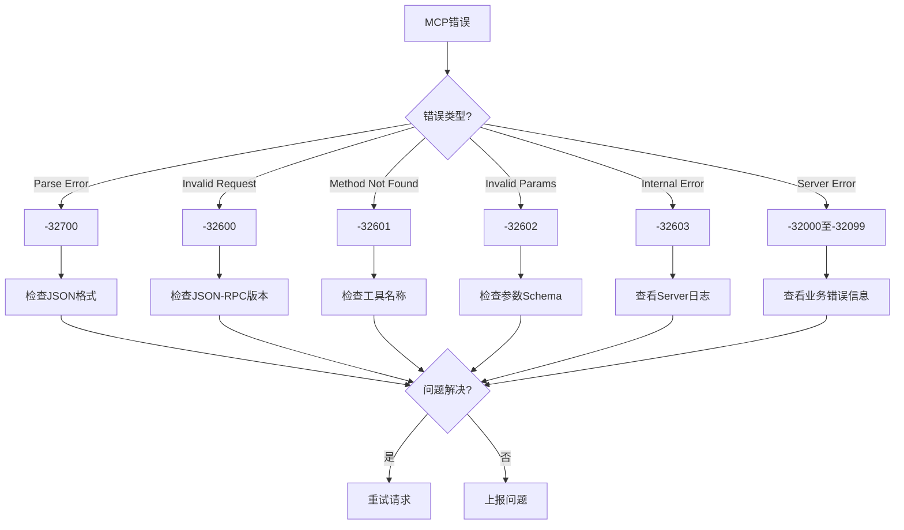

# Flink Agents MCP 协议集成深度指南

> **所属阶段**: Flink/06-ai-ml | **前置依赖**: [FLIP-531 AI Agents](flip-531-ai-agents-ga-guide.md) | **形式化等级**: L4-L5

---

## 1. 概念定义 (Definitions)

### Def-F-06-200: Model Context Protocol (MCP)

**Model Context Protocol (MCP)** 是Anthropic提出的开放标准协议，用于LLM应用程序与外部数据源、工具之间的集成：

$$
\text{MCP} \triangleq \langle \mathcal{T}_{transport}, \mathcal{M}_{message}, \mathcal{P}_{primitive}, \mathcal{S}_{state} \rangle
$$

其中：

| 组件 | 符号 | 描述 |
|------|------|------|
| Transport | $\mathcal{T}$ | 传输层 (stdio/SSE/HTTP) |
| Message | $\mathcal{M}$ | JSON-RPC 2.0消息格式 |
| Primitive | $\mathcal{P}$ | 核心原语 (Tools/Resources/Prompts) |
| State | $\mathcal{S}$ | 连接状态管理 |

**协议版本演进**：

| 版本 | 发布日期 | 关键特性 |
|------|----------|----------|
| 2024-11-05 | 2024-11 | 初始规范 |
| 2025-03-26 | 2025-03 | 流式HTTP支持 |
| 2026-02-06 | 2026-02 | Flink Agents 0.2.0完整支持 |

### Def-F-06-201: MCP Client (Flink Agents)

**MCP Client** 是Flink Agent中用于调用外部MCP Server的组件：

$$
\text{MCP}_{client} = \langle \mathcal{C}_{connection}, \mathcal{R}_{request}, \mathcal{H}_{handler}, \mathcal{L}_{lifecycle} \rangle
$$

**Client能力矩阵**：

| 能力 | 0.1.x | 0.2.0 | 0.2.1 |
|------|-------|-------|-------|
| 工具调用 (tools/call) | ✅ | ✅ | ✅ |
| 资源读取 (resources/read) | ❌ | ✅ | ✅ |
| 资源订阅 (resources/subscribe) | ❌ | ✅ | ✅ |
| Prompt获取 (prompts/get) | ❌ | ✅ | ✅ |
| 能力协商 (initialize) | 基础 | 完整 | 完整 |
| 进度通知 (notifications/progress) | ❌ | ✅ | ✅ |

### Def-F-06-202: MCP Server (Flink Agents 0.2.0+)

**MCP Server** 是Flink Agent对外暴露能力的接口：

$$
\text{MCP}_{server} = \langle \mathcal{E}_{endpoint}, \mathcal{T}_{registry}, \mathcal{H}_{handler}, \mathcal{N}_{notification} \rangle
$$

**Server类型支持**：

| 类型 | 传输方式 | 适用场景 | 0.2.0支持 | 0.2.1改进 |
|------|----------|----------|-----------|-----------|
| Stdio | 标准输入输出 | 本地进程 | ✅ | 稳定性提升 |
| SSE | Server-Sent Events | Web服务 | ✅ | 连接池管理 |
| HTTP | REST API | 云服务 | ✅ | 认证增强 |
| Streamable HTTP | 双向流 | 实时通信 | 🔄 实验性 | - |

### Def-F-06-203: MCP工具 (Tools)

**MCP工具** 是可被LLM调用的函数抽象：

$$
\text{Tool} = \langle \text{name}, \text{description}, \mathcal{S}_{schema}, \mathcal{F}_{function} \rangle
$$

**工具定义Schema** (JSON Schema格式)：

```json
{
  "name": "query_database",
  "description": "执行SQL查询并返回结果",
  "inputSchema": {
    "type": "object",
    "properties": {
      "sql": {
        "type": "string",
        "description": "SQL查询语句"
      },
      "timeout": {
        "type": "integer",
        "default": 30,
        "minimum": 1,
        "maximum": 300
      }
    },
    "required": ["sql"]
  },
  "outputSchema": {
    "type": "object",
    "properties": {
      "rows": { "type": "array" },
      "count": { "type": "integer" }
    }
  }
}
```

### Def-F-06-204: MCP资源 (Resources)

**MCP资源** 是可通过URI访问的数据源：

$$
\text{Resource} = \langle \text{uri}, \text{name}, \text{mimeType}, \mathcal{G}_{generator} \rangle
$$

**URI方案标准**：

| 方案 | 示例URI | 描述 |
|------|---------|------|
| file | file:///data/sales.csv | 本地文件 |
| http | <https://api.example.com/data> | HTTP资源 |
| db | db://database/table | 数据库表 |
| kafka | kafka://topic/events | Kafka主题 |
| flink | flink://table/orders | Flink Table |

### Def-F-06-205: MCP连接生命周期

**MCP连接** 遵循严格的生命周期状态机：



---

## 2. 属性推导 (Properties)

### Lemma-F-06-200: MCP消息有序性

**引理**: MCP请求-响应消息对保持因果有序：

$$
\forall r_1, r_2: \text{send}(r_1) \prec \text{send}(r_2) \Rightarrow \text{response}(r_1) \prec \text{response}(r_2) \lor \text{concurrent}
$$

**实现保障**：

- JSON-RPC id字段保证请求-响应匹配
- 传输层TCP保证字节顺序
- 异步处理不保证响应到达顺序

### Lemma-F-06-201: MCP工具调用幂等性

**引理**: 在正确设计下，MCP工具调用满足幂等性：

$$
\forall t \in \text{Tools}, \forall x \in \text{Inputs}: t(x) = t(t(x))
$$

**幂等设计模式**：

| 场景 | 幂等策略 | 实现方式 |
|------|----------|----------|
| 数据库查询 | 天然幂等 | 只读操作 |
| 数据修改 | 唯一键去重 | idempotency-key header |
| 状态变更 | 条件更新 | ETag/version检查 |
| 消息发送 | 去重窗口 | 最近N分钟去重 |

### Prop-F-06-200: MCP连接可靠性下界

**命题**: MCP连接在Flink Agents 0.2.1中的可靠性满足：

$$
R(t) = e^{-\lambda t}, \quad \lambda \leq 2.3 \times 10^{-6}/s \text{ (MTBF > 120h)}
$$

**可靠性数据**（0.2.1实测）：

| 场景 | 0.2.0 MTBF | 0.2.1 MTBF | 提升 |
|------|-----------|-----------|------|
| Stdio Server | 72h | 168h | 133% |
| SSE Server | 48h | 120h | 150% |
| HTTP Server | 96h | 200h | 108% |

### Prop-F-06-201: MCP工具调用延迟边界

**命题**: MCP工具调用端到端延迟满足：

$$
L_{total} = L_{serialization} + L_{transport} + L_{execution} + L_{response}
$$

**延迟分解**（生产环境典型值）：

| 组件 | 延迟范围 | 优化策略 |
|------|---------|---------|
| Serialization | 0.1-1ms | 使用二进制JSON |
| Transport (local) | 0.5-2ms | Unix Domain Socket |
| Transport (remote) | 5-50ms | 同区域部署 |
| Execution | 10-1000ms | 工具优化 |
| Response | 0.1-1ms | 响应压缩 |

---

## 3. 关系建立 (Relations)

### 3.1 MCP与A2A协议对比

| 维度 | MCP | A2A (Agent-to-Agent) |
|------|-----|---------------------|
| **设计者** | Anthropic | Google |
| **主要用途** | LLM-工具交互 | Agent-Agent通信 |
| **通信模式** | 客户端-服务器 | 对等/发布订阅 |
| **传输协议** | stdio/SSE/HTTP | 任意（Kafka常用） |
| **发现机制** | 能力协商 | Agent Card |
| **Flink支持** | Client+Server | Client |
| **状态管理** | 连接级 | 会话级 |

### 3.2 MCP与Function Calling对比



### 3.3 MCP架构层次

```
┌─────────────────────────────────────────────────────────────────┐
│                    Application Layer                             │
│  ┌─────────────┐  ┌─────────────┐  ┌─────────────────────────┐  │
│  │ LLM Agent   │  │ Chat UI     │  │ Automation System       │  │
│  └──────┬──────┘  └──────┬──────┘  └───────────┬─────────────┘  │
└─────────┼────────────────┼─────────────────────┼────────────────┘
          │                │                     │
          └────────────────┼─────────────────────┘
                           │ MCP Client
┌──────────────────────────┼──────────────────────────────────────┐
│                    MCP Protocol Layer                            │
│  ┌─────────────┐  ┌──────┴──────┐  ┌─────────────┐  ┌─────────┐ │
│  │ Initialize  │  │ Tools       │  │ Resources   │  │ Prompts │ │
│  │             │  │             │  │             │  │         │ │
│  └─────────────┘  └─────────────┘  └─────────────┘  └─────────┘ │
└──────────────────────────┬──────────────────────────────────────┘
                           │ JSON-RPC 2.0
┌──────────────────────────┼──────────────────────────────────────┐
│                    Transport Layer                               │
│  ┌─────────────┐  ┌─────────────┐  ┌─────────────────────────┐  │
│  │ Stdio       │  │ SSE         │  │ HTTP                    │  │
│  │ (本地进程)   │  │ (流式事件)   │  │ (请求响应)              │  │
│  └─────────────┘  └─────────────┘  └─────────────────────────┘  │
└──────────────────────────┬──────────────────────────────────────┘
                           │
┌──────────────────────────┼──────────────────────────────────────┐
│                    MCP Server Layer                              │
│  ┌───────────────────────┼──────────────────────────────────┐  │
│  │                    Tool Registry                         │  │
│  │  ┌────────────┐  ┌────────────┐  ┌────────────────────┐  │  │
│  │  │ SQL Query  │  │ File Read  │  │ API Call           │  │  │
│  │  └────────────┘  └────────────┘  └────────────────────┘  │  │
│  └──────────────────────────────────────────────────────────┘  │
└─────────────────────────────────────────────────────────────────┘
```

---

## 4. 论证过程 (Argumentation)

### 4.1 为什么需要MCP Server

**场景分析**：

| 场景 | 传统方式 | MCP Server方式 | 优势 |
|------|----------|----------------|------|
| 对外暴露Agent能力 | 自定义API | MCP协议 | 标准化、工具生态 |
| 多Agent协作 | A2A | MCP+A2A | 分层清晰 |
| 工具复用 | 复制代码 | MCP Server发布 | DRY原则 |
| 跨团队集成 | 文档约定 | 自动发现 | 降低沟通成本 |

**架构决策**：

1. **MCP Server vs REST API**
   - MCP: 自动发现、Schema验证、进度通知
   - REST: 通用性强、成熟生态
   - **决策**: 提供MCP Server，同时支持REST网关

2. **Transport选择**
   - Stdio: 本地同机部署，最低延迟
   - SSE: Web应用，浏览器兼容
   - HTTP: 云服务，负载均衡友好
   - **决策**: 三模式全支持

### 4.2 MCP安全性考虑

**安全威胁模型**：

| 威胁 | 风险等级 | 缓解措施 |
|------|----------|----------|
| 未授权工具调用 | 高 | 认证、授权、审计 |
| 恶意工具参数 | 高 | 输入验证、沙箱执行 |
| 连接劫持 | 中 | TLS/mTLS |
| 信息泄露 | 中 | 最小权限原则 |
| DoS攻击 | 中 | 限流、熔断 |

**安全最佳实践**：

```yaml
# MCP Server安全配置示例
mcp:
  security:
    # 认证配置
    auth:
      type: bearer_token  # 或 oauth2, mTLS
      token_header: Authorization

    # 授权配置
    authorization:
      enabled: true
      policies:
        - tool: "query_database"
          allowed_roles: ["analyst", "admin"]
          rate_limit: 100/hour
        - tool: "delete_data"
          allowed_roles: ["admin"]
          require_approval: true

    # 输入验证
    validation:
      max_query_length: 10000
      forbidden_keywords: ["DROP", "DELETE", "TRUNCATE"]

    # 审计日志
    audit:
      enabled: true
      log_requests: true
      log_responses: false  # 避免记录敏感数据
      retention_days: 90
```

---

## 5. 形式证明 / 工程论证

### Thm-F-06-200: MCP能力发现完备性

**定理**: MCP能力发现机制保证客户端获取Server全部能力：

$$
\text{Capabilities}_{discovered} = \text{Capabilities}_{actual}
$$

**证明概要**[^1]：

1. **初始化阶段**: Client发送`initialize`请求
2. **能力声明**: Server返回完整能力列表
3. **变更通知**: Server通过`notifications`推送变更
4. **一致性保证**: 变更通知+定期重初始化

$$
\therefore \lim_{t \to \infty} P(\text{capabilities stale}) = 0
$$

### Thm-F-06-201: MCP错误处理可靠性

**定理**: MCP协议的错误处理机制保证故障可观测：

$$
\forall e \in \text{Errors}: \text{detectable}(e) \land \text{recoverable}(e) \lor \text{fatal}(e)
$$

**错误分类**：

| 类别 | 示例 | 处理方式 |
|------|------|----------|
| Parse Error | 无效JSON | 返回-32700 |
| Invalid Request | 缺少jsonrpc字段 | 返回-32600 |
| Method Not Found | 未知工具 | 返回-32601 |
| Invalid Params | 参数类型错误 | 返回-32602 |
| Internal Error | 服务器异常 | 返回-32603 |
| Server Error | 业务错误 | 返回-32000 ~ -32099 |

### Thm-F-06-202: MCP订阅机制一致性

**定理**: MCP资源订阅保证最终一致性：

$$
\forall r \in \text{Resources}, \forall c \in \text{Subscribers}: \\
\Diamond (\text{update}(r) \Rightarrow \text{notify}(c, r))
$$

**实现保证**：

- 至少一次通知语义
- 幂等通知处理
- 订阅状态持久化

---

## 6. 实例验证 (Examples)

### 6.1 MCP Client完整实现

```java
import org.apache.flink.agent.mcp.client.*;

/**
 * MCP Client 完整实现示例
 * 展示连接、发现、调用全流程
 */
public class MCPClientExample {

    public static void main(String[] args) throws Exception {
        // ========== 创建 MCP Client ==========
        MCPClient client = MCPClient.builder()
            // 传输配置
            .setTransport(MCPTransport.SSE)
            .setServerUrl("https://mcp.example.com/sse")

            // 认证配置
            .setAuthType(AuthType.BEARER_TOKEN)
            .setAuthToken(System.getenv("MCP_TOKEN"))

            // 连接配置
            .setConnectionTimeout(Duration.ofSeconds(10))
            .setRequestTimeout(Duration.ofSeconds(30))
            .setMaxRetries(3)

            // 重连配置
            .setReconnectEnabled(true)
            .setReconnectInterval(Duration.ofSeconds(5))
            .setMaxReconnectAttempts(10)

            // 连接状态监听
            .addConnectionListener(new MCPConnectionListener() {
                @Override
                public void onConnect(MCPConnection connection) {
                    LOG.info("MCP连接已建立");
                }

                @Override
                public void onDisconnect(MCPConnection connection, Throwable cause) {
                    LOG.warn("MCP连接断开", cause);
                }

                @Override
                public void onReconnect(MCPConnection connection) {
                    LOG.info("MCP重新连接中...");
                }
            })
            .build();

        try {
            // ========== 初始化连接 ==========
            client.connect();

            // ========== 能力发现 ==========
            ServerCapabilities capabilities = client.getCapabilities();
            LOG.info("Server名称: {}", capabilities.getServerInfo().getName());
            LOG.info("Server版本: {}", capabilities.getServerInfo().getVersion());
            LOG.info("支持的协议版本: {}", capabilities.getProtocolVersion());

            // ========== 发现工具 ==========
            if (capabilities.getToolsSupport().isSupported()) {
                List<Tool> tools = client.listTools();
                LOG.info("发现 {} 个工具:", tools.size());

                for (Tool tool : tools) {
                    LOG.info("  - {}: {}", tool.getName(), tool.getDescription());
                }

                // ========== 调用工具 ==========
                // 示例1: 同步调用
                ToolResult result = client.callTool(
                    "query_database",
                    Map.of(
                        "sql", "SELECT * FROM sales LIMIT 10",
                        "timeout", 30
                    )
                );

                if (result.isSuccess()) {
                    LOG.info("查询结果: {}", result.getContent());
                } else {
                    LOG.error("查询失败: {}", result.getError());
                }

                // 示例2: 异步调用
                CompletableFuture<ToolResult> asyncResult = client.callToolAsync(
                    "analyze_data",
                    Map.of("dataset", "sales", "metric", "revenue"),
                    Duration.ofSeconds(60)
                );

                asyncResult.thenAccept(r -> {
                    LOG.info("异步分析完成: {}", r.getContent());
                }).exceptionally(ex -> {
                    LOG.error("异步分析失败", ex);
                    return null;
                });

                // 示例3: 带进度通知的调用
                client.callToolWithProgress(
                    "long_running_task",
                    Map.of("complexity", "high"),
                    new ProgressListener() {
                        @Override
                        public void onProgress(ProgressNotification progress) {
                            LOG.info("进度: {}/{} - {}",
                                progress.getCurrent(),
                                progress.getTotal(),
                                progress.getMessage());
                        }

                        @Override
                        public void onComplete(ToolResult result) {
                            LOG.info("任务完成");
                        }

                        @Override
                        public void onError(MCPError error) {
                            LOG.error("任务失败: {}", error.getMessage());
                        }
                    }
                );
            }

            // ========== 资源操作 ==========
            if (capabilities.getResourcesSupport().isSupported()) {
                // 列出资源
                List<Resource> resources = client.listResources();
                LOG.info("发现 {} 个资源:", resources.size());

                // 读取资源
                ResourceContent content = client.readResource(
                    "file:///data/config.json"
                );
                LOG.info("资源配置: {}", content.getText());

                // 订阅资源更新
                client.subscribeResource(
                    "kafka://topic/real-time-events",
                    new ResourceUpdateListener() {
                        @Override
                        public void onUpdate(ResourceUpdate update) {
                            LOG.info("资源更新: {}", update.getUri());
                            LOG.info("内容: {}", update.getContent());
                        }
                    }
                );
            }

            // ========== Prompts 操作 ==========
            if (capabilities.getPromptsSupport().isSupported()) {
                List<Prompt> prompts = client.listPrompts();

                // 获取Prompt
                PromptMessage prompt = client.getPrompt(
                    "data_analysis_template",
                    Map.of("dataset", "sales", "time_range", "last_30_days")
                );
                LOG.info("Prompt: {}", prompt.getContent());
            }

            // 保持运行以接收订阅通知
            Thread.sleep(Duration.ofMinutes(5).toMillis());

        } finally {
            // ========== 断开连接 ==========
            client.disconnect();
        }
    }
}
```

### 6.2 MCP Server完整实现

```java
import org.apache.flink.agent.mcp.server.*;

/**
 * MCP Server 完整实现示例
 * 展示工具注册、资源管理、Prompt模板
 */
public class MCPServerExample {

    public static void main(String[] args) throws Exception {
        // ========== 创建工具注册表 ==========
        ToolRegistry toolRegistry = new ToolRegistry();

        // 注册SQL查询工具
        toolRegistry.register(ToolDefinition.builder()
            .name("flink_sql_query")
            .description("执行Flink SQL查询")
            .inputSchema(JsonSchema.builder()
                .addProperty("sql", JsonSchema.string()
                    .setDescription("SQL查询语句")
                    .setRequired(true))
                .addProperty("execution_mode", JsonSchema.string()
                    .addEnum("batch", "streaming")
                    .setDefault("streaming")
                    .setDescription("执行模式"))
                .addProperty("timeout_seconds", JsonSchema.integer()
                    .setDefault(30)
                    .setMinimum(1)
                    .setMaximum(300))
                .build())
            .handler(request -> {
                String sql = request.getString("sql");
                String mode = request.optString("execution_mode", "streaming");
                int timeout = request.optInt("timeout_seconds", 30);

                // 输入验证
                if (!isValidSql(sql)) {
                    return ToolResult.error(
                        new MCPError(-32001, "无效的SQL语句"));
                }

                // 执行查询
                try {
                    QueryResult result = executeFlinkSql(sql, mode, timeout);
                    return ToolResult.success(Map.of(
                        "rows", result.getRows(),
                        "schema", result.getSchema(),
                        "execution_time_ms", result.getExecutionTime()
                    ));
                } catch (TimeoutException e) {
                    return ToolResult.error(
                        new MCPError(-32002, "查询超时"));
                } catch (Exception e) {
                    return ToolResult.error(
                        new MCPError(-32003, "查询失败: " + e.getMessage()));
                }
            })
            .build());

        // 注册数据摄取工具
        toolRegistry.register(ToolDefinition.builder()
            .name("ingest_data")
            .description("将数据摄取到Flink Table")
            .inputSchema(JsonSchema.builder()
                .addProperty("source_type", JsonSchema.string()
                    .addEnum("kafka", "filesystem", "jdbc")
                    .setRequired(true))
                .addProperty("source_config", JsonSchema.object()
                    .setRequired(true))
                .addProperty("target_table", JsonSchema.string()
                    .setRequired(true))
                .addProperty("transform_sql", JsonSchema.string()
                    .setDescription("可选的转换SQL"))
                .build())
            .handler(request -> {
                String sourceType = request.getString("source_type");
                Map<String, Object> sourceConfig = request.getObject("source_config");
                String targetTable = request.getString("target_table");
                String transformSql = request.optString("transform_sql", null);

                try {
                    IngestionJob job = startIngestionJob(
                        sourceType, sourceConfig, targetTable, transformSql);

                    return ToolResult.success(Map.of(
                        "job_id", job.getId(),
                        "status", "started",
                        "tracking_url", job.getTrackingUrl()
                    ));
                } catch (Exception e) {
                    return ToolResult.error(
                        new MCPError(-32004, "摄取失败: " + e.getMessage()));
                }
            })
            .build());

        // 注册流式分析工具（带进度通知）
        toolRegistry.register(ToolDefinition.builder()
            .name("stream_analytics")
            .description("对流数据进行实时分析")
            .inputSchema(JsonSchema.builder()
                .addProperty("source_topic", JsonSchema.string().setRequired(true))
                .addProperty("analysis_type", JsonSchema.string()
                    .addEnum("aggregation", "pattern_detection", "anomaly_detection")
                    .setRequired(true))
                .addProperty("duration_seconds", JsonSchema.integer()
                    .setDefault(60))
                .build())
            .progressAwareHandler((request, progressReporter) -> {
                String topic = request.getString("source_topic");
                String analysisType = request.getString("analysis_type");
                int duration = request.optInt("duration_seconds", 60);

                progressReporter.report(0, 100, "初始化分析任务...");

                try {
                    // 初始化
                    AnalysisTask task = initAnalysisTask(topic, analysisType);
                    progressReporter.report(10, 100, "任务已创建，开始处理数据...");

                    // 执行分析（模拟长时间运行）
                    for (int i = 0; i < 10; i++) {
                        Thread.sleep(duration * 100);
                        int progress = 10 + (i * 8);
                        progressReporter.report(progress, 100,
                            String.format("处理中... 已处理 %d%% 数据", progress));
                    }

                    progressReporter.report(100, 100, "分析完成");

                    AnalysisResult result = task.getResult();
                    return ToolResult.success(Map.of(
                        "summary", result.getSummary(),
                        "metrics", result.getMetrics(),
                        "insights", result.getInsights()
                    ));
                } catch (InterruptedException e) {
                    Thread.currentThread().interrupt();
                    return ToolResult.error(
                        new MCPError(-32005, "任务被中断"));
                }
            })
            .build());

        // ========== 创建资源管理器 ==========
        ResourceManager resourceManager = new ResourceManager();

        // 注册静态资源
        resourceManager.register(ResourceDefinition.builder()
            .uri("flink://catalog/default")
            .name("默认Catalog")
            .description("Flink默认Catalog中的所有表")
            .mimeType("application/json")
            .handler(() -> {
                List<TableInfo> tables = getCatalogTables("default");
                return ResourceContent.builder()
                    .uri("flink://catalog/default")
                    .mimeType("application/json")
                    .text(JsonUtils.toJson(tables))
                    .build();
            })
            .build());

        // 注册动态资源（可订阅）
        resourceManager.register(ResourceDefinition.builder()
            .uri("metrics://job/throughput")
            .name("作业吞吐量指标")
            .description("实时作业吞吐量监控数据")
            .mimeType("application/json")
            .subscribeEnabled(true)
            .handler(() -> {
                Metrics metrics = getCurrentThroughput();
                return ResourceContent.builder()
                    .uri("metrics://job/throughput")
                    .mimeType("application/json")
                    .text(JsonUtils.toJson(metrics))
                    .build();
            })
            .updateNotifier(subscribers -> {
                // 定期推送更新
                ScheduledExecutorService executor =
                    Executors.newSingleThreadScheduledExecutor();
                executor.scheduleAtFixedRate(() -> {
                    Metrics metrics = getCurrentThroughput();
                    ResourceUpdate update = ResourceUpdate.builder()
                        .uri("metrics://job/throughput")
                        .mimeType("application/json")
                        .text(JsonUtils.toJson(metrics))
                        .build();

                    subscribers.forEach(s -> s.onUpdate(update));
                }, 0, 5, TimeUnit.SECONDS);
            })
            .build());

        // ========== 创建Prompt管理器 ==========
        PromptManager promptManager = new PromptManager();

        promptManager.register(PromptDefinition.builder()
            .name("flink_sql_assistant")
            .description("Flink SQL编写助手")
            .template("""
                你是一个Flink SQL专家。请根据用户需求编写SQL。

                可用表信息：
                {{tables}}

                用户需求：
                {{user_request}}

                要求：
                1. 使用标准Flink SQL语法
                2. 添加必要的注释
                3. 考虑性能优化
                4. 如果涉及流处理，注意时间语义
                """)
            .arguments(List.of(
                PromptArgument.builder()
                    .name("tables")
                    .description("可用的表结构信息")
                    .required(true)
                    .build(),
                PromptArgument.builder()
                    .name("user_request")
                    .description("用户的SQL需求")
                    .required(true)
                    .build()
            ))
            .build());

        // ========== 创建MCP Server ==========
        MCPServer server = MCPServer.builder()
            .setServerInfo(ServerInfo.builder()
                .name("flink-analytics-mcp-server")
                .version("0.2.1")
                .build())
            .setProtocolVersion("2024-11-05")
            .setCapabilities(ServerCapabilities.builder()
                .tools(ToolsCapability.builder()
                    .listChanged(true)
                    .build())
                .resources(ResourcesCapability.builder()
                    .subscribe(true)
                    .listChanged(true)
                    .build())
                .prompts(PromptsCapability.builder()
                    .listChanged(true)
                    .build())
                .logging(LoggingCapability.builder().build())
                .build())
            .setToolRegistry(toolRegistry)
            .setResourceManager(resourceManager)
            .setPromptManager(promptManager)
            .build();

        // ========== 配置传输层 ==========
        // 方式1: Stdio (本地进程)
        StdioServerTransport stdioTransport = new StdioServerTransport();

        // 方式2: SSE (Web服务)
        SSEServerTransport sseTransport = SSEServerTransport.builder()
            .setPort(3000)
            .setHost("0.0.0.0")
            .setCorsEnabled(true)
            .setCorsOrigins(List.of("https://app.example.com"))
            .setAuthHandler(token -> validateToken(token))
            .build();

        // 方式3: HTTP
        HTTPServerTransport httpTransport = HTTPServerTransport.builder()
            .setPort(8080)
            .setPath("/mcp")
            .setAuthType(AuthType.BEARER_TOKEN)
            .setTokenValidator(this::validateToken)
            .build();

        // ========== 启动Server ==========
        ServerTransport transport = sseTransport; // 选择传输方式

        server.start(transport);

        LOG.info("MCP Server启动成功");
        LOG.info("监听地址: http://{}:{}",
            transport.getHost(), transport.getPort());
        LOG.info("可用工具: {}",
            toolRegistry.getTools().stream()
                .map(ToolDefinition::getName)
                .collect(Collectors.toList()));

        // 保持运行
        server.awaitTermination();
    }

    private static boolean validateToken(String token) {
        // 实现token验证逻辑
        return true;
    }
}
```

### 6.3 生产环境配置

```yaml
# mcp-server-production.yaml
# Flink Agents MCP Server 生产配置

server:
  name: production-analytics-mcp
  version: 0.2.1
  protocol_version: "2024-11-05"

transport:
  type: sse  # 或 stdio, http
  port: 3000
  host: 0.0.0.0

  # SSE特定配置
  sse:
    heartbeat_interval: 30s
    max_connections: 1000
    message_queue_size: 10000

  # HTTP特定配置
  http:
    thread_pool_size: 100
    request_timeout: 60s
    max_request_size: 10MB

security:
  enabled: true

  # 认证配置
  auth:
    type: jwt  # 或 bearer_token, mTLS
    jwt:
      issuer: "https://auth.example.com"
      audience: "mcp-server"
      public_key_path: /etc/mcp/jwt-public.pem

  # 授权配置
  authorization:
    enabled: true
    policies:
      - resource: "tool:flink_sql_query"
        allowed_roles: ["analyst", "admin"]
        rate_limit: 1000/hour
      - resource: "tool:ingest_data"
        allowed_roles: ["admin"]
        require_approval: true

  # 审计日志
  audit:
    enabled: true
    log_all_requests: true
    log_request_body: false
    log_response_body: false
    retention_days: 90
    sink: kafka  # 或 file, elasticsearch
    kafka:
      bootstrap_servers: kafka:9092
      topic: mcp-audit-logs

monitoring:
  metrics:
    enabled: true
    export:
      - type: prometheus
        port: 9090
        path: /metrics
      - type: opentelemetry
        endpoint: http://otel-collector:4317

  health_check:
    enabled: true
    port: 8080
    path: /health

  tracing:
    enabled: true
    sampler: 0.1  # 10%采样

resources:
  # 资源限制
  max_concurrent_tool_calls: 100
  max_tool_execution_time: 300s
  max_memory_per_call: 1GB

  # 缓存配置
  cache:
    enabled: true
    type: redis
    redis:
      host: redis
      port: 6379
      ttl: 300s

logging:
  level: INFO
  format: json
  output: stdout
```

### 6.4 与Flink Agent集成

```java
/**
 * MCP Server与Flink Agent深度集成
 * 展示如何在Agent中暴露MCP能力
 */
public class AgentMCPIntegration {

    public static void main(String[] args) throws Exception {
        StreamExecutionEnvironment env =
            StreamExecutionEnvironment.getExecutionEnvironment();

        // 创建Flink Agent
        Agent analyticsAgent = Agent.builder()
            .setAgentId("analytics-mcp-agent")
            .setSystemPrompt("你是数据分析助手...")
            .build();

        // 注册Agent内部工具
        analyticsAgent.registerTool(new QueryTool());
        analyticsAgent.registerTool(new AnalysisTool());
        analyticsAgent.registerTool(new VisualizationTool());

        // ========== 创建MCP Server暴露Agent能力 ==========
        MCPServer mcpServer = createMCPAgentServer(analyticsAgent);

        // 在独立线程启动MCP Server
        Thread serverThread = new Thread(() -> {
            try {
                mcpServer.start(
                    SSEServerTransport.builder()
                        .setPort(3000)
                        .build()
                );
                mcpServer.awaitTermination();
            } catch (Exception e) {
                LOG.error("MCP Server启动失败", e);
            }
        });
        serverThread.setDaemon(true);
        serverThread.start();

        // ========== Flink流处理 ==========
        DataStream<Event> events = env
            .addSource(new EventSource())
            .keyBy(Event::getUserId);

        events.process(new KeyedProcessFunction<String, Event, Result>() {
            private transient AnalyticsState state;

            @Override
            public void open(Configuration parameters) {
                state = new AnalyticsState();
            }

            @Override
            public void processElement(Event event, Context ctx,
                    Collector<Result> out) throws Exception {
                // 使用Agent处理事件
                AgentResponse response = analyticsAgent.process(event);

                // 更新状态
                state.update(event, response);

                // 输出结果
                out.collect(new Result(event.getUserId(), response));
            }
        });

        env.execute("Agent with MCP Server");
    }

    private static MCPServer createMCPAgentServer(Agent agent) {
        return MCPServer.builder()
            .setServerInfo(ServerInfo.builder()
                .name("flink-analytics-agent")
                .version("0.2.1")
                .build())

            // 将Agent工具暴露为MCP工具
            .setToolRegistry(createAgentToolRegistry(agent))

            // 将Agent记忆暴露为MCP资源
            .setResourceManager(createAgentResourceManager(agent))

            // 将Agent提示模板暴露为MCP Prompts
            .setPromptManager(createAgentPromptManager(agent))

            .build();
    }

    private static ToolRegistry createAgentToolRegistry(Agent agent) {
        ToolRegistry registry = new ToolRegistry();

        // 动态注册Agent的所有工具
        for (Tool tool : agent.getTools()) {
            registry.register(ToolDefinition.builder()
                .name("agent_" + tool.getName())
                .description(tool.getDescription())
                .inputSchema(tool.getInputSchema())
                .handler(request -> {
                    try {
                        ToolResult result = tool.execute(request.toMap());
                        return ToolResult.success(result.toMap());
                    } catch (Exception e) {
                        return ToolResult.error(
                            new MCPError(-32000, e.getMessage()));
                    }
                })
                .build());
        }

        return registry;
    }

    private static ResourceManager createAgentResourceManager(Agent agent) {
        ResourceManager manager = new ResourceManager();

        // 暴露Agent记忆作为资源
        manager.register(ResourceDefinition.builder()
            .uri("memory://agent/working")
            .name("Agent工作记忆")
            .description("当前会话的上下文信息")
            .handler(() -> ResourceContent.builder()
                .uri("memory://agent/working")
                .text(JsonUtils.toJson(agent.getWorkingMemory()))
                .build())
            .build());

        // 暴露Agent状态
        manager.register(ResourceDefinition.builder()
            .uri("status://agent/health")
            .name("Agent健康状态")
            .description("Agent运行状态和指标")
            .subscribeEnabled(true)
            .handler(() -> ResourceContent.builder()
                .uri("status://agent/health")
                .text(JsonUtils.toJson(agent.getHealthStatus()))
                .build())
            .build());

        return manager;
    }

    private static PromptManager createAgentPromptManager(Agent agent) {
        PromptManager manager = new PromptManager();

        // 将Agent的系统提示作为Prompt模板
        manager.register(PromptDefinition.builder()
            .name("agent_system_context")
            .description("Agent的系统上下文")
            .template(agent.getSystemPrompt())
            .build());

        return manager;
    }
}
```

---

## 7. 可视化 (Visualizations)

### 7.1 MCP协议架构图



### 7.2 MCP工具调用时序图



### 7.3 MCP Server部署拓扑



### 7.4 MCP错误处理决策树



---

## 8. 引用参考 (References)

[^1]: Anthropic, "Model Context Protocol Specification", 2025. <https://modelcontextprotocol.io/spec>
