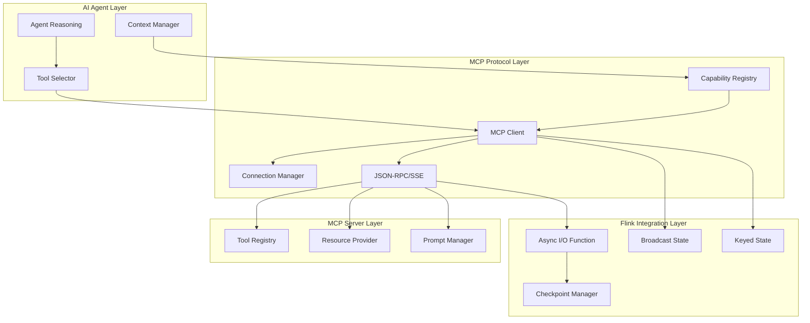
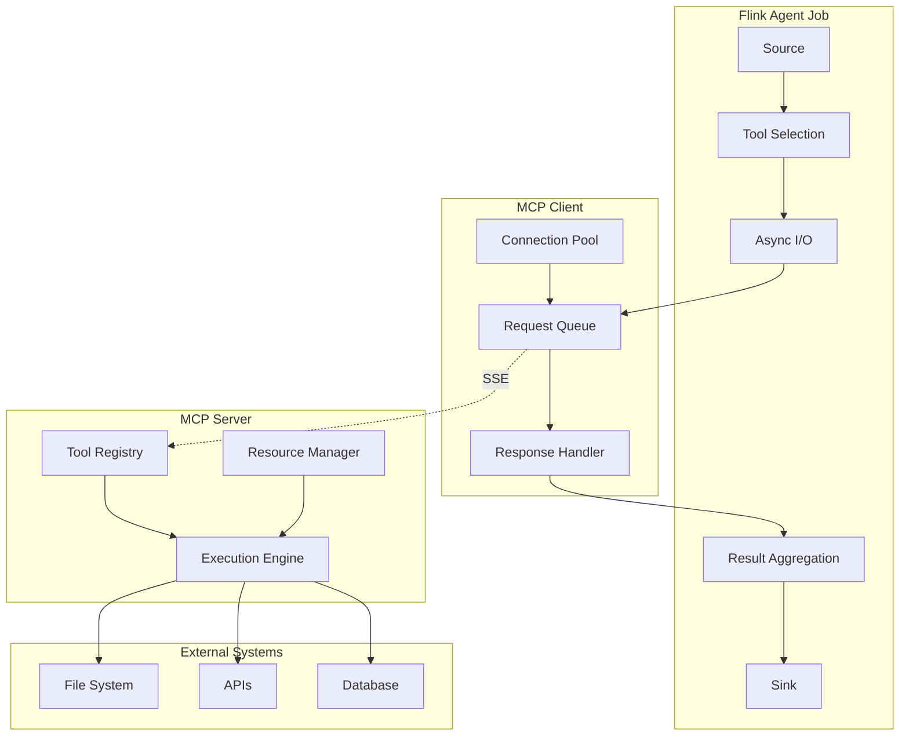
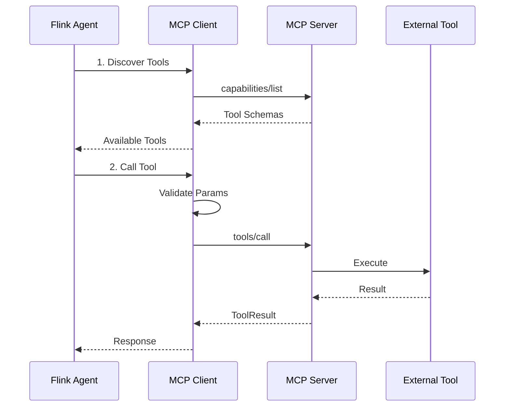
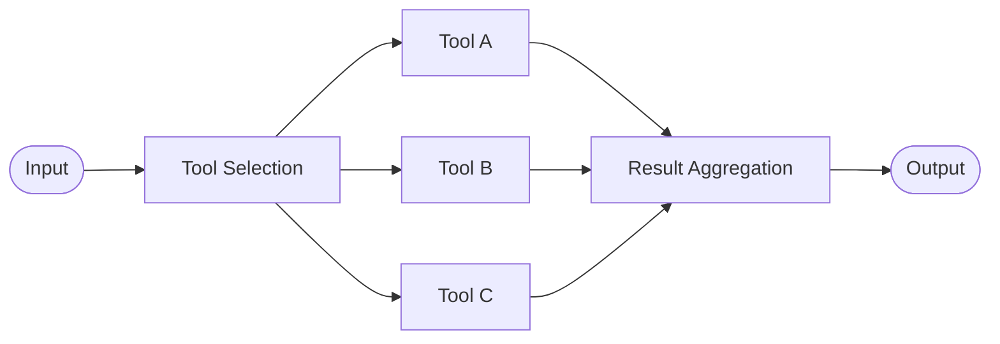

# Flink Agents MCP 协议集成深度指南

> **状态**: ✅ Released (2026-02-06, Flink Agents 0.2.0; 2026-03-26, 0.2.1 补丁)
> **Flink 版本**: Flink Agents 0.2.1+
> **稳定性**: GA (Generally Available)
>
> Apache Flink Agents 0.2.0 已于 2026-02-06 正式发布，0.2.1 补丁版本于 2026-03-26 发布，包含3个关键bug修复和安全漏洞修补。新增 MCP Server、Embedding Models、Vector Stores 等能力[^1]。

> **所属阶段**: Flink/06-ai-ml | **前置依赖**: [FLIP-531 AI Agents](flink-ai-agents-flip-531.md), [Flink Agents 架构深度解析](./flink-agents-architecture-deep-dive.md) | **形式化等级**: L4-L5

---

## 1. 概念定义 (Definitions)

### Def-P2-10: Model Context Protocol (MCP) Integration

**MCP Integration** in Flink Agents is defined as the bidirectional binding between Flink's stream processing capabilities and the Model Context Protocol:

$$
\mathcal{I}_{MCP} = \langle \mathcal{F}_{flink}, \mathcal{M}_{protocol}, \phi_{map}, \psi_{sync} \rangle
$$

Where:

- $\mathcal{F}_{flink}$: Flink streaming runtime
- $\mathcal{M}_{protocol}$: MCP protocol specification
- $\phi_{map}$: Capability mapping between Flink and MCP
- $\psi_{sync}$: State synchronization function

### Def-P2-11: MCP Client / Server in Flink

**Flink MCP Client** is a stateful operator that manages MCP connections:

**Flink MCP Server** (新增于 Agents 0.2.0) 允许将 Flink 流数据作为 MCP Resource 暴露给外部 Agent[^1]：

$$
\mathcal{C}_{MCP} = \langle \mathcal{S}_{conn}, \mathcal{R}_{registry}, \mathcal{Q}_{pending}, \mathcal{H}_{handlers} \rangle
$$

| Component | Description | State Type |
|-----------|-------------|------------|
| $\mathcal{S}_{conn}$ | Connection pool state | Operator State |
| $\mathcal{R}_{registry}$ | Tool capability registry | Broadcast State |
| $\mathcal{Q}_{pending}$ | Pending request queue | List State |
| $\mathcal{H}_{handlers}$ | Async response handlers | Transient |

### Def-P2-12: Tool Execution Flow

**Tool Execution** in streaming context is defined as:

$$
\mathcal{E}_{tool}: \text{StreamElement} \times \mathcal{T}_{selected} \times \mathcal{C}_{context} \rightarrow \text{StreamElement}' \times \mathcal{O}_{observation}
$$

**Execution Pipeline**:

```
Input Stream → Tool Selection → Async Execution → Result Aggregation → Output Stream
```

### Def-P2-13: Resource Subscription

**Streaming Resource Subscription** enables real-time data flow from Flink to MCP clients:

$$
\mathcal{S}_{resource}: \mathcal{D}_{stream} \xrightarrow{\text{subscribe}} \mathcal{C}_{client} \xrightarrow{\text{notify}} \mathcal{U}_{update}
$$

Where updates are pushed as SSE (Server-Sent Events) streams.

### Def-P2-14: Tool Orchestration Graph

**Tool Orchestration** defines execution dependencies:

$$
\mathcal{G}_{orchestration} = \langle \mathcal{T}_{tools}, \mathcal{E}_{deps}, \phi_{parallel}, \psi_{order} \rangle
$$

Where:

- $\mathcal{T}_{tools}$: Tool node set
- $\mathcal{E}_{deps}$: Dependency edges
- $\phi_{parallel}$: Parallel execution predicate
- $\psi_{order}$: Execution ordering function

---

## 2. 属性推导 (Properties)

### Thm-P2-07: MCP Stream Integration Consistency

**定理**: MCP tool execution within Flink streaming maintains exactly-once semantics:

$$
\forall e \in \text{Stream}: \text{Execute}_{MCP}(e) = 1 \land \text{Result}(e) = \text{Deterministic}
$$

**证明概要**:

1. **Idempotency**: MCP tool calls use deterministic request IDs
2. **Checkpointing**: Pending requests are captured in operator state
3. **Deduplication**: Response cache prevents duplicate processing
4. **Transactional Sink**: Results are committed atomically

### Lemma-P2-03: Tool Selection Accuracy

**引理**: Tool selection accuracy improves with context enrichment:

$$
P(\text{Correct Tool}|\text{Context}) > P(\text{Correct Tool}|\emptyset)
$$

**Constraint**: Context size $\leq$ LLM context window limit

### Prop-P2-05: Parallel Tool Execution Speedup

**命题**: Independent tool executions achieve linear speedup:

$$
T_{parallel}(n) = \max_{i=1}^{n} T(t_i) + O_{coordination}
$$

Where $O_{coordination} \ll \sum T(t_i)$ for independent tools.

---

## 3. 关系建立 (Relations)

### 3.1 MCP vs Function Calling vs A2A

| Dimension | Function Calling | MCP | A2A |
|-----------|------------------|-----|-----|
| **Abstraction** | Model-specific | Standard protocol | Agent protocol |
| **Scope** | Single call | Resource + Tools + Prompts | Task + Collaboration |
| **State** | Stateless | Stateful connection | Task lifecycle |
| **Discovery** | Static | Dynamic capability | Agent Card |
| **Streaming** | Limited | SSE native | SSE native |
| **Use Case** | Quick integration | Tool ecosystem | Agent collaboration |

### 3.2 Flink-MCP Integration Architecture



### 3.3 Data Flow Patterns

```
Pattern 1: Synchronous Tool Call
Input → [Tool Selection] → [MCP Call] → [Result] → Output

Pattern 2: Parallel Tool Calls
Input → [Tool Selection]
           ├→ [Tool A] ─┐
           ├→ [Tool B] ─┼→ [Result Aggregation] → Output
           └→ [Tool C] ─┘

Pattern 3: Streaming Resource Subscription
[Flink Stream] → [MCP Resource] → [Subscription] → [SSE Push] → [Agent]
```

---

## 4. 论证过程 (Argumentation)

### 4.1 Why MCP for Flink Agents?

**Challenge**: Flink Agents need standardized access to diverse tools.

**Solution Comparison**:

| Approach | Pros | Cons | Verdict |
|----------|------|------|---------|
| Hardcoded APIs | Simple | Not scalable, vendor lock-in | ❌ |
| Function Calling | Model-native | Vendor-specific, no streaming | ❌ |
| Custom Protocol | Flexible | Ecosystem fragmentation | ❌ |
| MCP | Standard, streaming, 5000+ servers, 97M+ monthly downloads | Learning curve | ✅ |

**MCP 生态规模（2026-04）**：

- **97M+** 月 SDK 下载量
- **5000+** 公开 MCP Server
- **全平台支持**: OpenAI, Google, Microsoft, Anthropic 均已原生集成

### 4.2 MCP over Async I/O vs Direct Call

**Direct Call Limitations**:

- Blocks stream processing
- No backpressure handling
- Hard to checkpoint

**Async I/O Benefits**:

- Non-blocking execution
- Backpressure propagation
- State checkpoint support

### 4.3 State Management Strategy

| State Type | Storage | Lifecycle | Recovery |
|------------|---------|-----------|----------|
| Connection Pool | Operator State | Job lifetime | Reconnect on restore |
| Pending Requests | List State | Until completion | Replay from checkpoint |
| Tool Registry | Broadcast State | Dynamic | Lazy reload |
| Response Cache | TTL Map State | Configurable TTL | Re-populate |

---

## 5. 形式证明 / 工程论证 (Proof / Engineering Argument)

### Thm-P2-08: MCP Tool Call Ordering

**定理**: Tool calls maintain causal ordering within keyed streams:

$$
\forall k \in \text{Keys}: e_i \prec e_j \Rightarrow \text{ToolCall}(e_i) \prec \text{ToolCall}(e_j)
$$

**证明**:

1. **Keyed Partitioning**: Same key processed by same task slot
2. **Flink Ordering**: In-order processing within partition
3. **Async Barrier**: Checkpoint barrier ensures ordering

### Thm-P2-09: Resource Subscription Consistency

**定理**: Resource subscribers receive all updates in causal order:

$$
\forall u_i, u_j \in \text{Updates}: u_i \prec u_j \Rightarrow \text{Deliver}(u_i) \prec \text{Deliver}(u_j)
$$

**依赖条件**:

- Flink event time processing
- Watermark propagation
- SSE ordered delivery

---

## 6. 实例验证 (Examples)

### 6.1 Java: MCP Client & Server Integration

**MCP Client 集成（已有）:**

```java
import org.apache.flink.streaming.api.functions.async.RichAsyncFunction;

import org.apache.flink.api.common.state.ValueState;
import org.apache.flink.api.common.state.ValueStateDescriptor;


/**
 * Flink MCP Client Integration
 * Demonstrates tool discovery, async execution, and state management
 */
public class FlinkMCPClient {

    /**
     * MCP Tool Call Operator with State Management
     */
    public static class MCPToolCallFunction
        extends RichAsyncFunction<AgentRequest, AgentResponse> {

        // State declarations
        private transient ValueState<ConnectionState> connectionState;
        private transient ListState<PendingRequest> pendingRequests;
        private transient MapState<String, ToolSchema> toolRegistry;

        // Transient clients
        private transient MCPClient mcpClient;
        private transient Executor executor;

        private final String mcpServerEndpoint;
        private final Duration timeout;

        public MCPToolCallFunction(String endpoint, Duration timeout) {
            this.mcpServerEndpoint = endpoint;
            this.timeout = timeout;
        }

        @Override
        public void open(Configuration parameters) throws Exception {
            // Initialize state
            connectionState = getRuntimeContext().getState(
                new ValueStateDescriptor<>("mcp-connection", ConnectionState.class));

            pendingRequests = getRuntimeContext().getListState(
                new ListStateDescriptor<>("pending-requests", PendingRequest.class));

            toolRegistry = getRuntimeContext().getMapState(
                new MapStateDescriptor<>("tool-registry", String.class, ToolSchema.class));

            // Initialize MCP client
            this.mcpClient = MCPClient.builder()
                .withEndpoint(mcpServerEndpoint)
                .withAuth(AuthType.BEARER_TOKEN, System.getenv("MCP_TOKEN"))
                .withTimeout(timeout)
                .withRetryPolicy(RetryPolicy.exponentialBackoff(3, Duration.ofSeconds(1)))
                .build();

            // Establish connection and discover capabilities
            mcpClient.connect();
            discoverCapabilities();

            // Executor for async operations
            this.executor = Executors.newFixedThreadPool(10);
        }

        private void discoverCapabilities() throws Exception {
            ServerCapabilities caps = mcpClient.getCapabilities();

            if (caps.getToolsSupport().isSupported()) {
                List<Tool> tools = mcpClient.listTools();
                for (Tool tool : tools) {
                    toolRegistry.put(tool.getName(), tool.getSchema());
                }
                LOG.info("Discovered {} tools from MCP server", tools.size());
            }
        }

        @Override
        public void asyncInvoke(AgentRequest request, ResultFuture<AgentResponse> resultFuture) {
            executor.execute(() -> {
                try {
                    // Step 1: Tool Selection (using LLM or rule-based)
                    ToolSelection selection = selectTools(request);

                    // Step 2: Execute tools
                    if (selection.isParallel()) {
                        executeParallelTools(selection, request, resultFuture);
                    } else {
                        executeSequentialTools(selection, request, resultFuture);
                    }

                } catch (Exception e) {
                    LOG.error("Error processing request {}", request.getId(), e);
                    resultFuture.completeExceptionally(e);
                }
            });
        }

        private void executeParallelTools(ToolSelection selection,
                                          AgentRequest request,
                                          ResultFuture<AgentResponse> resultFuture) {
            List<CompletableFuture<ToolResult>> futures = new ArrayList<>();

            for (ToolCall call : selection.getToolCalls()) {
                // Validate against schema
                ToolSchema schema = toolRegistry.get(call.getToolName());
                validateParams(call.getParams(), schema);

                // Track pending request
                PendingRequest pending = new PendingRequest(
                    request.getId(), call.getToolName(), System.currentTimeMillis()
                );

                // Execute tool
                CompletableFuture<ToolResult> future = mcpClient.callToolAsync(
                    call.getToolName(),
                    call.getParams()
                );

                futures.add(future);
            }

            // Aggregate results
            CompletableFuture.allOf(futures.toArray(new CompletableFuture[0]))
                .thenAccept(v -> {
                    List<ToolResult> results = futures.stream()
                        .map(CompletableFuture::join)
                        .collect(Collectors.toList());

                    AgentResponse response = new AgentResponse(
                        request.getId(),
                        aggregateResults(results),
                        request.getContext()
                    );

                    resultFuture.complete(Collections.singletonList(response));
                })
                .exceptionally(ex -> {
                    resultFuture.completeExceptionally(ex);
                    return null;
                });
        }

        private void executeSequentialTools(ToolSelection selection,
                                            AgentRequest request,
                                            ResultFuture<AgentResponse> resultFuture) {
            CompletableFuture<ToolResult> chain = CompletableFuture.completedFuture(null);
            Map<String, Object> context = new HashMap<>();

            for (ToolCall call : selection.getToolCalls()) {
                chain = chain.thenCompose(prevResult -> {
                    if (prevResult != null) {
                        context.put(call.getToolName() + "_result", prevResult);
                    }

                    // Inject previous results into params
                    Map<String, Object> enrichedParams = enrichParams(
                        call.getParams(), context
                    );

                    return mcpClient.callToolAsync(call.getToolName(), enrichedParams);
                });
            }

            chain.thenAccept(finalResult -> {
                AgentResponse response = new AgentResponse(
                    request.getId(),
                    finalResult.getContent(),
                    context
                );
                resultFuture.complete(Collections.singletonList(response));
            }).exceptionally(ex -> {
                resultFuture.completeExceptionally(ex);
                return null;
            });
        }

        @Override
        public void timeout(AgentRequest request, ResultFuture<AgentResponse> resultFuture) {
            LOG.warn("MCP tool call timeout for request {}", request.getId());
            resultFuture.complete(Collections.singletonList(
                AgentResponse.timeout(request.getId())
            ));
        }

        @Override
        public void close() throws Exception {
            if (mcpClient != null) {
                mcpClient.disconnect();
            }
            if (executor != null) {
                ((ExecutorService) executor).shutdown();
            }
        }
    }

    /**
     * MCP Server Function (Agents 0.2.0+)
     * 将 Flink 数据流暴露为 MCP Server Resource
     */
    public static class FlinkMCPServer {
        private MCPServer server;

        public void start(String endpoint) {
            this.server = MCPServer.builder()
                .withName("FlinkDataServer")
                .withEndpoint(endpoint)
                .build();

            // 注册流式数据源作为 MCP Resource
            server.registerResource("flink://metrics/realtime", () -> {
                return queryRealtimeMetrics();
            });

            // 注册工具:执行 Flink SQL 查询
            server.registerTool("execute_flink_sql", params -> {
                String sql = (String) params.get("sql");
                return executeSql(sql);
            });

            server.start();
        }
    }

    /**
     * Resource Subscription Function
     * Streams Flink data to MCP clients via SSE
     */
    public static class MCPResourceSubscriptionFunction
        extends ProcessFunction<DataEvent, Void> {

        private transient MCPClient mcpClient;
        private transient Map<String, ResourceSubscriber> subscribers;

        @Override
        public void open(Configuration parameters) throws Exception {
            mcpClient = MCPClient.builder()
                .withEndpoint(System.getenv("MCP_SERVER_URL"))
                .build();
            subscribers = new ConcurrentHashMap<>();
        }

        @Override
        public void processElement(DataEvent event, Context ctx, Collector<Void> out) {
            String resourceUri = buildResourceUri(event);

            // Notify all subscribers
            ResourceUpdate update = new ResourceUpdate(
                resourceUri,
                event.getMimeType(),
                event.toJson()
            );

            mcpClient.publishResourceUpdate(resourceUri, update);
        }

        private String buildResourceUri(DataEvent event) {
            return String.format("flink://%s/%s/%s",
                event.getStreamName(),
                event.getPartition(),
                event.getKey()
            );
        }
    }
}
```

### 6.2 Python: MCP Integration with PyFlink

```python
from pyflink.datastream import StreamExecutionEnvironment
from pyflink.datastream.functions import AsyncFunction, ResultFuture
from pyflink.common import Duration
import asyncio
from typing import List, Dict, Any
from dataclasses import dataclass

@dataclass
class ToolCall:
    tool_name: str
    params: Dict[str, Any]
    priority: int = 0

@dataclass
class ToolResult:
    tool_name: str
    content: Any
    latency_ms: int
    success: bool
    error: str = None

class MCPAsyncFunction(AsyncFunction):
    """
    PyFlink AsyncFunction for MCP tool calls
    """

    def __init__(self, mcp_endpoint: str, timeout_sec: int = 30):
        self.mcp_endpoint = mcp_endpoint
        self.timeout = timeout_sec
        self.mcp_client = None
        self.tool_registry = {}

    def open(self, runtime_context):
        # Initialize MCP client
        from mcp.client import MCPClient

        self.mcp_client = MCPClient(
            endpoint=self.mcp_endpoint,
            auth_token=os.getenv("MCP_TOKEN")
        )

        # Discover tools
        asyncio.run(self._discover_tools())

    async def _discover_tools(self):
        """Discover available tools from MCP server"""
        tools = await self.mcp_client.list_tools()
        for tool in tools:
            self.tool_registry[tool.name] = tool.schema
        print(f"Discovered {len(tools)} tools")

    async def async_invoke(self, input_data: Dict, result_future: ResultFuture):
        """Async invocation for each stream element"""
        try:
            # Extract tool calls from input
            tool_calls = self._extract_tool_calls(input_data)

            # Execute tools in parallel
            results = await self._execute_tools_parallel(tool_calls)

            # Aggregate and return
            output = {
                "input_id": input_data.get("id"),
                "tool_results": [r.__dict__ for r in results],
                "success": all(r.success for r in results)
            }

            result_future.complete([output])

        except Exception as e:
            result_future.complete_exceptionally(e)

    async def _execute_tools_parallel(self, tool_calls: List[ToolCall]) -> List[ToolResult]:
        """Execute multiple tools in parallel"""
        tasks = []
        for call in tool_calls:
            task = self._execute_single_tool(call)
            tasks.append(task)

        results = await asyncio.gather(*tasks, return_exceptions=True)
        return [r if isinstance(r, ToolResult) else ToolResult(
            tool_name="unknown",
            content=None,
            latency_ms=0,
            success=False,
            error=str(r)
        ) for r in results]

    async def _execute_single_tool(self, call: ToolCall) -> ToolResult:
        """Execute a single tool with timeout"""
        start_time = time.time()

        try:
            result = await asyncio.wait_for(
                self.mcp_client.call_tool(call.tool_name, call.params),
                timeout=self.timeout
            )

            return ToolResult(
                tool_name=call.tool_name,
                content=result,
                latency_ms=int((time.time() - start_time) * 1000),
                success=True
            )

        except asyncio.TimeoutError:
            return ToolResult(
                tool_name=call.tool_name,
                content=None,
                latency_ms=int((time.time() - start_time) * 1000),
                success=False,
                error="Timeout"
            )
        except Exception as e:
            return ToolResult(
                tool_name=call.tool_name,
                content=None,
                latency_ms=int((time.time() - start_time) * 1000),
                success=False,
                error=str(e)
            )

    def _extract_tool_calls(self, input_data: Dict) -> List[ToolCall]:
        """Extract tool calls from input (using LLM or rules)"""
        # Implementation depends on use case
        calls = []
        if "intent" in input_data:
            intent = input_data["intent"]
            if intent == "analyze":
                calls.append(ToolCall("query_database", {"sql": input_data.get("query")}))
                calls.append(ToolCall("calculate", {"expression": input_data.get("metric")}))
        return calls

# Usage in PyFlink job def create_mcp_integration_job():
    env = StreamExecutionEnvironment.get_execution_environment()

    # Input stream
    input_stream = env.from_source(
        KafkaSource.builder()
            .set_bootstrap_servers("kafka:9092")
            .set_topics("agent-requests")
            .build(),
        WatermarkStrategy.no_watermarks(),
        "kafka-source"
    )

    # MCP tool integration with Async I/O
    mcp_result = AsyncDataStream.unordered_wait(
        input_stream,
        MCPAsyncFunction(
            mcp_endpoint="https://mcp-server.internal:8080",
            timeout_sec=30
        ),
        timeout=30000,  # 30 seconds
        capacity=100    # Max concurrent requests
    )

    # Output
    mcp_result.add_sink(
        KafkaSink.builder()
            .set_bootstrap_servers("kafka:9092")
            .set_record_serializer(
                KafkaRecordSerializationSchema.builder()
                    .set_topic("agent-responses")
                    .set_value_serialization_schema(
                        JsonSerializationSchema()
                    )
                    .build()
            )
            .build()
    )

    env.execute("Flink MCP Integration Job")


class MCPResourcePublisher:
    """
    Publish Flink streams as MCP Resources
    """

    def __init__(self, mcp_endpoint: str):
        self.mcp_endpoint = mcp_endpoint
        self.client = None

    async def start(self):
        from mcp.server import MCPServer

        self.server = MCPServer("FlinkDataProvider")

        # Register streaming resource
        @self.server.resource("flink://sales/metrics")
        async def get_sales_metrics() -> str:
            # Query Flink for real-time metrics
            return await self._query_flink_metrics()

        # Start server
        await self.server.run(transport='sse')

    async def _query_flink_metrics(self) -> str:
        # Implementation to query Flink REST API
        pass
```

### 6.3 Configuration Template

```yaml
# mcp-flink-integration.yaml mcp:
  client:
    # Connection settings
    endpoint: https://mcp-server.internal:8080
    transport: sse  # or stdio, http

    # Authentication
    auth:
      type: bearer_token  # or oauth2, mTLS
      token_env: MCP_TOKEN

    # Timeouts
    timeouts:
      connect: 10s
      request: 30s
      total: 60s

    # Retry policy
    retry:
      max_attempts: 3
      backoff_strategy: exponential
      initial_delay: 1s
      max_delay: 30s

    # Connection pool
    pool:
      max_connections: 50
      max_per_route: 20
      keep_alive: 30s

  flink:
    async_io:
      # Async I/O configuration
      timeout: 30s
      capacity: 100
      ordered: false  # Unordered for better throughput

    state:
      # State backend for MCP connection state
      backend: rocksdb
      ttl:
        connection_state: 1h
        pending_requests: 5m
        tool_registry: 1h

    checkpoint:
      # Ensure pending requests are checkpointed
      include_pending: true

  tools:
    # Tool execution configuration
    execution:
      default_timeout: 30s
      max_parallel: 10

    # Tool-specific overrides
    overrides:
      - name: long_running_query
        timeout: 120s
        max_parallel: 2

      - name: external_api_call
        timeout: 10s
        retry_attempts: 5

  observability:
    metrics:
      enabled: true
      counters:
        - tool_calls_total
        - tool_errors_total
        - tool_latency_seconds
      histograms:
        - tool_execution_duration

    tracing:
      enabled: true
      include_tool_params: false  # Don't trace sensitive params
```

---

### 6.4 Tool Orchestration Flow

```java
/**
 * Complex Tool Orchestration with Dependencies
 */
public class ToolOrchestrator {

    public CompletableFuture<OrchestrationResult> executeOrchestration(
            OrchestrationPlan plan,
            Map<String, Object> initialContext) {

        // Build execution graph
        ExecutionGraph graph = buildExecutionGraph(plan);

        // Execute in topological order
        Map<String, CompletableFuture<ToolResult>> results = new HashMap<>();

        for (ToolNode node : graph.topologicalSort()) {
            // Wait for dependencies
            List<CompletableFuture<ToolResult>> deps = node.getDependencies().stream()
                .map(results::get)
                .collect(Collectors.toList());

            CompletableFuture<ToolResult> future = CompletableFuture
                .allOf(deps.toArray(new CompletableFuture[0]))
                .thenCompose(v -> {
                    // Build context from dependency results
                    Map<String, Object> context = new HashMap<>(initialContext);
                    for (ToolNode dep : node.getDependencies()) {
                        context.put(dep.getName(), results.get(dep.getName()).join());
                    }

                    // Execute this node
                    return executeTool(node.getToolCall(), context);
                });

            results.put(node.getName(), future);
        }

        // Aggregate all results
        return CompletableFuture.allOf(
            results.values().toArray(new CompletableFuture[0])
        ).thenApply(v -> {
            Map<String, ToolResult> finalResults = results.entrySet().stream()
                .collect(Collectors.toMap(
                    Map.Entry::getKey,
                    e -> e.getValue().join()
                ));
            return new OrchestrationResult(finalResults);
        });
    }
}
```

---

## 7. 可视化 (Visualizations)

### 7.1 MCP Integration Architecture



### 7.2 Tool Execution Flow



### 7.3 Parallel Tool Execution



---

## 8. 引用参考 (References)

[^1]: Apache Flink Blog, "Apache Flink Agents 0.2.0 Release Announcement", February 6, 2026. <https://flink.apache.org/2026/02/06/apache-flink-agents-0.2.0-release-announcement/>


---

## 附录：Flink Agents 0.3 迁移指引与对比

> **状态**: ✅ 已发布 | **风险等级**: 低 | **适用目标版本**: 0.3.0 (Flink 2.2, 2026-06)
>
> **状态更新**: 2026-04-20 — Flink Agents 0.3.0 已在 Flink 2.2 中发布。

### MCP 集成在 0.3 中的演进

| 维度 | 0.2.x | 0.3 | 迁移动作 |
|------|-------|-----|----------|
| **工具调用** | 硬编码参数映射 | 参数注入 (Argument Injection) | 将参数模板化，声明 `@Inject` 源 |
| **MCP Server** | Java 实现 | 支持跨语言 Server（Python/Rust） | 可用 Python 快速开发 MCP Server |
| **传输协议** | stdio / HTTP (实验性) | Streamable HTTP 默认启用 | 确认防火墙规则允许 SSE |
| **Tool Schema** | 静态 JSON | 动态 Skill Schema + 版本化 | 更新 `list_tools` 返回格式 |

### 参数注入迁移示例

```java
// 0.2.x：手动构造参数
Map<String, Object> params = new HashMap<>();
params.put("sender", agentConfig.getEmail());
params.put("to", userEmail);
mcpClient.callTool("send_email", params);

// 0.3：声明式注入
@Skill(name = "send_email")
public class EmailSkill {
    @SkillInput
    public EmailInput input;

    @SkillExecutor
    public EmailResult execute(@Inject("sender") String sender,
                                @Inject("agent_config") AgentConfig cfg) {
        // sender 自动从 Agent 配置注入
        return emailApi.send(sender, input.getTo(), input.getBody());
    }
}
```

### 跨语言 MCP Server 示例

```python
# Python 3.12 MCP Server (0.3+)
from mcp.server import Server
from pyflink.agents.mcp import FlinkMcpAdapter

app = Server("python_analysis_server")

@app.tool()
def analyze_sentiment(text: str) -> dict:
    result = sentiment_pipeline(text)
    return {"label": result.label, "score": result.score}

# 通过 Flink 跨语言事件总线注册
FlinkMcpAdapter.register(app, bus_endpoint="flink-agent-bus:9090")
```

---
