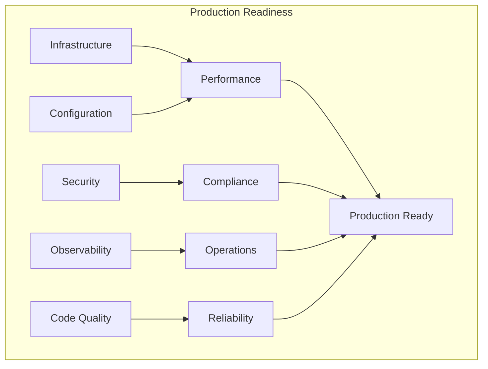
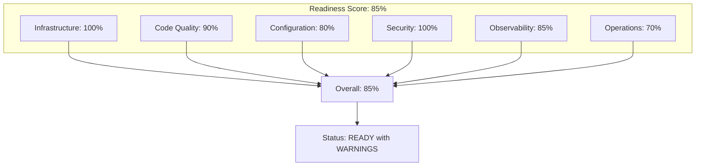
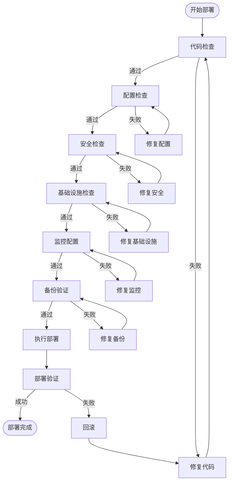

> **状态**: 🔮 前瞻内容 | **风险等级**: 高 | **最后更新**: 2026-04
>
> 此文档描述的内容处于早期规划阶段，可能与最终实现不符。请以 Apache Flink 官方发布为准。
>
# Flink Agents 生产环境检查清单

> **所属阶段**: Flink/06-ai-ml | **前置依赖**: [Flink Agents 架构深度解析](./flink-agents-architecture-deep-dive.md), [Flink Agents 设计模式](./flink-agents-patterns-catalog.md) | **形式化等级**: L4 (工程实践)

---

## 1. 概念定义 (Definitions)

### Def-P2-08: Production Readiness

**生产就绪**定义为系统满足以下条件的程度：

$$
\mathcal{R}_{prod} = \langle \mathcal{R}_{reliability}, \mathcal{R}_{performance}, \mathcal{R}_{security}, \mathcal{R}_{observability}, \mathcal{R}_{maintainability} \rangle
$$

其中每个维度 $\mathcal{R}_i \in [0, 1]$，系统整体就绪度：

$$
\text{Readiness} = \prod_{i} \mathcal{R}_i
$$

### Def-P2-09: Checklist Item

检查清单项定义为：

$$
\mathcal{I}_{check} = \langle \text{category}, \text{description}, \text{criteria}, \text{severity}, \text{verification} \rangle
$$

| 属性 | 说明 | 取值 |
|------|------|------|
| category | 检查类别 | {Infrastructure, Code, Config, Security, Operations} |
| description | 检查描述 | 文字描述 |
| criteria | 通过标准 | 可验证的条件 |
| severity | 严重程度 | {P0-Critical, P1-High, P2-Medium, P3-Low} |
| verification | 验证方式 | {Manual, Automated, Review} |

---

## 2. 属性推导 (Properties)

### Prop-P2-03: Checklist Completeness

**命题**: 完整的生产检查清单覆盖系统所有关键路径：

$$
\forall p \in \text{CriticalPaths}: \exists i \in \text{Checklist}: \text{covers}(i, p)
$$

### Prop-P2-04: Checklist Effectiveness

**命题**: 严格执行检查清单可降低生产故障率：

$$
P(\text{Failure}|\text{ChecklistPassed}) < P(\text{Failure}|\text{NoChecklist})
$$

---

## 3. 关系建立 (Relations)

### 3.1 Checklist Categories Relationship



### 3.2 Checklist vs Development Phase

| Phase | Checklist Focus | Key Items |
|-------|-----------------|-----------|
| Development | Code Quality | Linting, Testing, Documentation |
| Staging | Integration | End-to-end, Load Testing |
| Pre-Prod | Configuration | Security, Resources, Backups |
| Production | Operations | Monitoring, Alerting, Runbooks |

---

## 4. 论证过程 (Argumentation)

### 4.1 Why Production Checklists Matter

**观察**: 生产环境中 Agent 系统面临独特挑战：

1. **LLM 不确定性**: 输出非确定性，需要护栏
2. **状态复杂性**: 多层级记忆需要持久化
3. **工具安全性**: 外部工具调用存在风险
4. **成本敏感性**: Token 消耗需要控制

**论证**: 系统化的检查清单是生产稳定性的必要保障。

### 4.2 Checklist Anti-Patterns

| Anti-Pattern | Problem | Solution |
|-------------|---------|----------|
| Checklist Theater | 机械执行不理解 | 培训+解释每个检查项 |
| Outdated Checklist | 不随系统演进 | 定期审查更新 |
| Incomplete Coverage | 遗漏关键路径 | 故障驱动补充 |
| No Verification | 虚假勾选 | 自动化验证+审计 |

---

## 5. 形式证明 / 工程论证 (Proof / Engineering Argument)

### Thm-P2-06: Production Safety

**定理**: 通过完整检查清单的系统满足生产安全要求：

$$
\text{ChecklistPassed}(\mathcal{S}) \Rightarrow \text{SafeForProduction}(\mathcal{S})
$$

**证明概要**:

1. **完备性**: 检查清单覆盖所有已知风险点
2. **验证性**: 每项检查有明确通过标准
3. **可追溯**: 检查结果可审计
4. **迭代性**: 新发现的问题补充到清单

---

## 6. 实例验证 (Examples)

---

## 生产环境检查清单

### 6.1 基础设施检查 (Infrastructure)

| # | 检查项 | 检查内容 | 通过标准 | 严重级别 | 验证方式 |
|---|--------|----------|----------|----------|----------|
| I-01 | Flink 集群版本 | 使用受支持的 Flink 版本 | ≥ 1.18 | P0 | 自动 |
| I-02 | JVM 配置 | 堆内存、GC 策略配置 | G1GC, 堆 ≤ 容器限制 | P0 | 自动 |
| I-03 | 状态后端 | RocksDB/ForSt 配置 | 增量 Checkpoint 启用 | P0 | 自动 |
| I-04 | Checkpoint 配置 | 检查点间隔、超时 | 间隔 ≤ 60s, 超时 ≤ 10min | P0 | 自动 |
| I-05 | 高可用配置 | JobManager HA | 至少 2 个 JM | P0 | 手动 |
| I-06 | 资源预留 | TaskManager 资源 | CPU/内存预留 ≥ 20% | P1 | 自动 |
| I-07 | 网络配置 | 缓冲区、超时设置 | 网络内存 ≥ 15% | P1 | 自动 |
| I-08 | 磁盘配置 | Checkpoint/Savepoint 目录 | 独立磁盘，容量充足 | P1 | 手动 |
| I-09 | 安全通信 | TLS/mTLS 配置 | 集群间通信加密 | P0 | 自动 |
| I-10 | 网络隔离 | Namespace/安全组 | 按需访问控制 | P1 | 手动 |

**配置模板**:

```yaml
# infrastructure-config.yaml
flink:
  version: "1.20.0"

  jobmanager:
    memory:
      process:
        size: 4096m
    high-availability: zookeeper
    high-availability.zookeeper.quorum: zk-1:2181,zk-2:2181,zk-3:2181

  taskmanager:
    memory:
      process:
        size: 8192m
      managed:
        fraction: 0.4
    numberOfTaskSlots: 4

  state:
    backend: rocksdb
    checkpoint-storage: filesystem
    checkpoints:
      dir: hdfs:///flink/checkpoints
    savepoints:
      dir: hdfs:///flink/savepoints

  execution:
    checkpointing:
      interval: 30s
      min-pause-between-checkpoints: 10s
      timeout: 10min
      max-concurrent-checkpoints: 1
      unaligned: true
      incremental: true

  security:
    ssl:
      enabled: true
      truststore: /etc/flink/ssl/truststore.jks
      keystore: /etc/flink/ssl/keystore.jks
```

---

### 6.2 Agent 代码检查 (Code Quality)

| # | 检查项 | 检查内容 | 通过标准 | 严重级别 | 验证方式 |
|---|--------|----------|----------|----------|----------|
| C-01 | 错误处理 | 异常捕获和处理 | 所有异常被捕获并记录 | P0 | 自动 |
| C-02 | 资源管理 | 连接、流正确关闭 | try-with-resources | P0 | 自动 |
| C-03 | 状态访问 | 状态线程安全 | 仅通过 KeyedContext 访问 | P0 | 自动 |
| C-04 | 序列化 | 状态类可序列化 | 实现 Serializable/Kryo | P0 | 自动 |
| C-05 | 日志规范 | 日志级别、格式 | 结构化日志，无敏感信息 | P1 | 自动 |
| C-06 | 度量指标 | 关键指标暴露 | 延迟、吞吐量、错误率 | P1 | 自动 |
| C-07 | 超时设置 | 外部调用超时 | 所有阻塞调用有超时 | P0 | 自动 |
| C-08 | 重试逻辑 | 失败重试策略 | 指数退避，最大重试限制 | P1 | 代码审查 |
| C-09 | 输入验证 | 参数校验 | 所有输入经过验证 | P0 | 自动 |
| C-10 | 敏感数据处理 | PII 处理 | 脱敏/加密存储 | P0 | 代码审查 |

**代码检查清单示例 (Java)**:

```java
// ✅ 正确: 完整的错误处理和资源管理

import org.apache.flink.api.common.state.ValueState;
import org.apache.flink.api.common.state.ValueStateDescriptor;

public class ProductionReadyAgent extends KeyedProcessFunction<String, Event, Result> {

    private static final Logger LOG = LoggerFactory.getLogger(ProductionReadyAgent.class);
    private static final Duration TIMEOUT = Duration.ofSeconds(30);
    private static final int MAX_RETRIES = 3;

    private transient ValueState<AgentState> state;
    private transient LLMClient llmClient;

    @Override
    public void open(Configuration parameters) {
        // 状态声明
        StateTtlConfig ttlConfig = StateTtlConfig.newBuilder(Duration.ofHours(24))
            .setUpdateType(OnCreateAndWrite)
            .setStateVisibility(NeverReturnExpired)
            .cleanupIncrementally(10, true)
            .build();

        ValueStateDescriptor<AgentState> descriptor =
            new ValueStateDescriptor<>("agent-state", AgentState.class);
        descriptor.enableTimeToLive(ttlConfig);
        state = getRuntimeContext().getState(descriptor);

        // 客户端初始化
        llmClient = LLMClient.builder()
            .withTimeout(TIMEOUT)
            .withRetryPolicy(RetryPolicy.exponentialBackoff(MAX_RETRIES))
            .build();
    }

    @Override
    public void processElement(Event event, Context ctx, Collector<Result> out) {
        try {
            // 输入验证
            if (!isValid(event)) {
                LOG.warn("Invalid event received: {}", event.getId());
                metrics.counter("events.invalid").inc();
                return;
            }

            // 处理逻辑
            AgentState currentState = state.value();
            if (currentState == null) {
                currentState = new AgentState(event.getAgentId());
            }

            // 带超时的外部调用
            Result result = processWithTimeout(event, currentState);

            // 更新状态
            currentState.update(result);
            state.update(currentState);

            // 输出结果
            out.collect(result);

            // 记录指标
            metrics.histogram("processing.latency").update(
                System.currentTimeMillis() - ctx.timestamp()
            );

        } catch (ValidationException e) {
            LOG.error("Validation failed for event {}", event.getId(), e);
            metrics.counter("errors.validation").inc();
            // 发送到死信队列
            ctx.output(DEAD_LETTER_TAG, new DeadLetter(event, e));

        } catch (LLMException e) {
            LOG.error("LLM call failed for event {}", event.getId(), e);
            metrics.counter("errors.llm").inc();
            // 有限重试
            if (shouldRetry(event)) {
                retryLater(event, ctx);
            } else {
                ctx.output(DEAD_LETTER_TAG, new DeadLetter(event, e));
            }

        } catch (Exception e) {
            LOG.error("Unexpected error processing event {}", event.getId(), e);
            metrics.counter("errors.unexpected").inc();
            throw e; // 让 Flink 决定处理策略
        }
    }

    private boolean isValid(Event event) {
        return event != null
            && event.getId() != null
            && event.getAgentId() != null
            && event.getPayload() != null
            && event.getPayload().length() < MAX_PAYLOAD_SIZE;
    }

    private Result processWithTimeout(Event event, AgentState state)
        throws TimeoutException {
        return CompletableFuture.supplyAsync(() -> process(event, state))
            .orTimeout(TIMEOUT.getSeconds(), TimeUnit.SECONDS)
            .join();
    }
}
```

---

### 6.3 LLM 与 Agent 配置检查

| # | 检查项 | 检查内容 | 通过标准 | 严重级别 | 验证方式 |
|---|--------|----------|----------|----------|----------|
| L-01 | 模型配置 | LLM 模型选择 | 生产级模型，版本固定 | P0 | 手动 |
| L-02 | Token 限制 | 上下文窗口设置 | 不超过模型限制 | P0 | 自动 |
| L-03 | 温度参数 | Temperature 设置 | 任务类型匹配 | P1 | 手动 |
| L-04 | 重试策略 | API 失败重试 | 指数退避，最大延迟 | P0 | 自动 |
| L-05 | 连接池 | HTTP 连接池 | 连接复用，池大小合理 | P1 | 自动 |
| L-06 | 超时配置 | API 调用超时 | 根据 SLA 设置 | P0 | 自动 |
| L-07 | 成本监控 | Token 消耗追踪 | 按 Agent/任务统计 | P1 | 自动 |
| L-08 | 缓存配置 | 响应缓存 | 相似查询缓存 | P2 | 手动 |
| L-09 | 护栏配置 | 输入/输出过滤 | 有害内容检测 | P0 | 自动 |
| L-10 | 回退策略 | 模型失败回退 | 备用模型/降级策略 | P0 | 手动 |

**LLM 配置模板**:

```yaml
# llm-production-config.yaml
llm:
  # 主模型配置
  primary:
    provider: openai
    model: gpt-4-turbo-preview
    api_key: ${OPENAI_API_KEY}  # 从环境变量读取

    # 生成参数
    temperature: 0.7
    max_tokens: 4096
    top_p: 1.0
    frequency_penalty: 0.0
    presence_penalty: 0.0

    # 连接配置
    base_url: https://api.openai.com/v1
    timeout: 30s
    connect_timeout: 10s

    # 重试配置
    retry:
      max_attempts: 3
      backoff_strategy: exponential
      initial_delay: 1s
      max_delay: 30s

    # 连接池
    connection_pool:
      max_total: 50
      max_per_route: 20

  # 备用模型
  fallback:
    provider: anthropic
    model: claude-3-opus-20240229
    api_key: ${ANTHROPIC_API_KEY}

    # 简化的参数配置
    temperature: 0.7
    max_tokens: 4096
    timeout: 60s

  # 成本监控
  cost_tracking:
    enabled: true
    metrics_enabled: true
    alert_threshold_usd: 1000  # 每日预算告警

  # 缓存配置
  cache:
    enabled: true
    type: redis
    redis:
      host: ${REDIS_HOST}
      port: 6379
      ttl: 3600  # 1小时
    similarity_threshold: 0.95

  # 护栏配置
  guardrails:
    input:
      toxicity_detection: true
      prompt_injection_detection: true
      max_input_tokens: 8000

    output:
      toxicity_detection: true
      pii_detection: true
      max_output_tokens: 4096

    rate_limiting:
      requests_per_minute: 100
      tokens_per_minute: 100000
```

---

### 6.4 MCP 工具集成检查

| # | 检查项 | 检查内容 | 通过标准 | 严重级别 | 验证方式 |
|---|--------|----------|----------|----------|----------|
| M-01 | 工具注册 | MCP Server 配置 | 所有工具已注册 | P0 | 自动 |
| M-02 | Schema 验证 | 工具输入输出定义 | JSON Schema 完整 | P0 | 自动 |
| M-03 | 超时配置 | 工具调用超时 | 每个工具有独立超时 | P0 | 自动 |
| M-04 | 错误处理 | 工具失败处理 | 优雅降级 | P0 | 自动 |
| M-05 | 权限控制 | 工具访问权限 | RBAC 配置 | P0 | 手动 |
| M-06 | 审计日志 | 工具调用记录 | 记录完整参数和结果 | P1 | 自动 |
| M-07 | 限流配置 | 工具调用限流 | 防止过载 | P1 | 自动 |
| M-08 | 健康检查 | MCP Server 健康 | 定期探测 | P1 | 自动 |
| M-09 | 熔断配置 | 故障熔断 | 错误率阈值触发 | P1 | 自动 |
| M-10 | 资源隔离 | 工具执行隔离 | 沙箱/容器隔离 | P2 | 手动 |

**MCP 安全配置模板**:

```yaml
# mcp-security-config.yaml
mcp:
  servers:
    - name: analytics-server
      endpoint: https://mcp-analytics.internal:8080
      auth:
        type: mTLS
        cert_path: /etc/certs/mcp-client.crt
        key_path: /etc/certs/mcp-client.key

      # 工具权限
      tools:
        - name: query_database
          allowed_roles: [analyst, admin]
          rate_limit: 100/hour
          timeout: 30s

        - name: delete_data
          allowed_roles: [admin]
          require_approval: true
          audit_required: true

        - name: export_report
          allowed_roles: [analyst, admin, viewer]
          rate_limit: 10/hour
          max_file_size: 100MB

  # 安全策略
  security:
    # 输入验证
    validation:
      enabled: true
      max_query_length: 10000
      forbidden_keywords: ["DROP", "DELETE", "TRUNCATE"]

    # 审计日志
    audit:
      enabled: true
      log_requests: true
      log_responses: false  # 避免记录敏感数据
      retention_days: 90
      sink: kafka
      kafka:
        bootstrap_servers: kafka:9092
        topic: mcp-audit-logs

    # 熔断配置
    circuit_breaker:
      enabled: true
      failure_rate_threshold: 50  # 50% 错误率触发
      wait_duration_in_open_state: 60s
      permitted_calls_in_half_open: 5
```

---

### 6.5 监控与告警检查

| # | 检查项 | 检查内容 | 通过标准 | 严重级别 | 验证方式 |
|---|--------|----------|----------|----------|----------|
| O-01 | 指标暴露 | Prometheus 指标 | /metrics 端点可用 | P0 | 自动 |
| O-02 | 日志聚合 | 日志收集配置 | 结构化 JSON 日志 | P0 | 自动 |
| O-03 | 分布式追踪 | OpenTelemetry | 全链路追踪 | P1 | 自动 |
| O-04 | 健康检查 | 存活/就绪探针 | Kubernetes 探针配置 | P0 | 自动 |
| O-05 | 告警规则 | 关键指标告警 | CPU/内存/延迟告警 | P0 | 手动 |
| O-06 | Dashboard | Grafana 看板 | 业务指标可视化 | P1 | 手动 |
| O-07 | 错误追踪 | Sentry/类似工具 | 异常自动上报 | P1 | 自动 |
| O-08 | 成本监控 | Token 消耗监控 | 按维度统计 | P2 | 自动 |
| O-09 | SLA 监控 | 服务级别指标 | 可用性、延迟 SLO | P0 | 手动 |
| O-10 | 告警路由 | 告警通知配置 | 分级通知策略 | P0 | 手动 |

**监控配置模板**:

```yaml
# monitoring-config.yaml
monitoring:
  # Prometheus 指标
  metrics:
    enabled: true
    port: 9249
    path: /metrics

    # 自定义指标
    custom_metrics:
      - name: agent_processing_latency
        type: histogram
        labels: [agent_type, status]
        buckets: [10, 50, 100, 500, 1000, 5000]

      - name: llm_token_usage
        type: counter
        labels: [model, agent_id]

      - name: tool_call_duration
        type: histogram
        labels: [tool_name, status]

      - name: agent_state_size
        type: gauge
        labels: [agent_id, state_type]

  # 日志配置
  logging:
    format: json
    level: INFO
    structured: true
    fields:
      - timestamp
      - level
      - logger
      - message
      - agent_id
      - trace_id
      - span_id

  # 分布式追踪
  tracing:
    enabled: true
    exporter: otlp
    otlp:
      endpoint: http://otel-collector:4317
    sampler:
      type: probabilistic
      rate: 0.1  # 10% 采样

  # 告警规则
  alerts:
    - name: HighProcessingLatency
      expr: histogram_quantile(0.99, agent_processing_latency_bucket) > 5000
      for: 5m
      severity: warning
      annotations:
        summary: "Agent processing latency is high"

    - name: LLMRateLimit
      expr: rate(llm_errors_total{reason="rate_limit"}[5m]) > 0
      for: 1m
      severity: critical
      annotations:
        summary: "LLM API rate limit hit"

    - name: HighErrorRate
      expr: rate(agent_errors_total[5m]) / rate(agent_events_total[5m]) > 0.05
      for: 5m
      severity: critical
      annotations:
        summary: "Agent error rate exceeds 5%"

    - name: StateSizeGrowing
      expr: agent_state_size > 1000000000  # 1GB
      for: 10m
      severity: warning
      annotations:
        summary: "Agent state size exceeds 1GB"
```

---

### 6.6 安全与合规检查

| # | 检查项 | 检查内容 | 通过标准 | 严重级别 | 验证方式 |
|---|--------|----------|----------|----------|----------|
| S-01 | 密钥管理 | API Key 存储 | Vault/Secret Manager | P0 | 手动 |
| S-02 | 传输加密 | 数据加密传输 | TLS 1.3 | P0 | 自动 |
| S-03 | 静态加密 | 状态数据加密 | 磁盘加密 | P1 | 手动 |
| S-04 | 访问控制 | 身份认证 | OAuth2/mTLS | P0 | 手动 |
| S-05 | 授权策略 | 权限最小化 | RBAC 配置 | P0 | 手动 |
| S-06 | PII 处理 | 个人数据处理 | 脱敏/匿名化 | P0 | 代码审查 |
| S-07 | 审计日志 | 安全事件记录 | 完整审计追踪 | P0 | 自动 |
| S-08 | 数据保留 | 数据生命周期 | 自动清理策略 | P1 | 手动 |
| S-09 | 合规认证 | SOC2/GDPR | 认证有效 | P1 | 手动 |
| S-10 | 漏洞扫描 | 依赖安全检查 | 无高危漏洞 | P0 | 自动 |

---

### 6.7 备份与恢复检查

| # | 检查项 | 检查内容 | 通过标准 | 严重级别 | 验证方式 |
|---|--------|----------|----------|----------|----------|
| B-01 | Checkpoint 备份 | 自动备份配置 | 定期 Checkpoint | P0 | 自动 |
| B-02 | Savepoint 策略 | 版本发布 Savepoint | 升级前创建 | P0 | 手动 |
| B-03 | 备份验证 | 备份可恢复性 | 定期恢复演练 | P0 | 手动 |
| B-04 | 恢复 RTO | 恢复时间目标 | RTO ≤ 5分钟 | P0 | 演练 |
| B-05 | 恢复 RPO | 恢复点目标 | RPO ≤ 1分钟 | P0 | 演练 |
| B-06 | 跨区域备份 | 异地备份 | 多区域复制 | P1 | 手动 |
| B-07 | 备份加密 | 备份数据加密 | 加密存储 | P1 | 自动 |
| B-08 | 保留策略 | 备份保留期 | 30天默认 | P1 | 手动 |

---

## 7. 可视化 (Visualizations)

### 7.1 Production Readiness Dashboard



### 7.2 Deployment Checklist Flow



---

## 8. 引用参考 (References)
