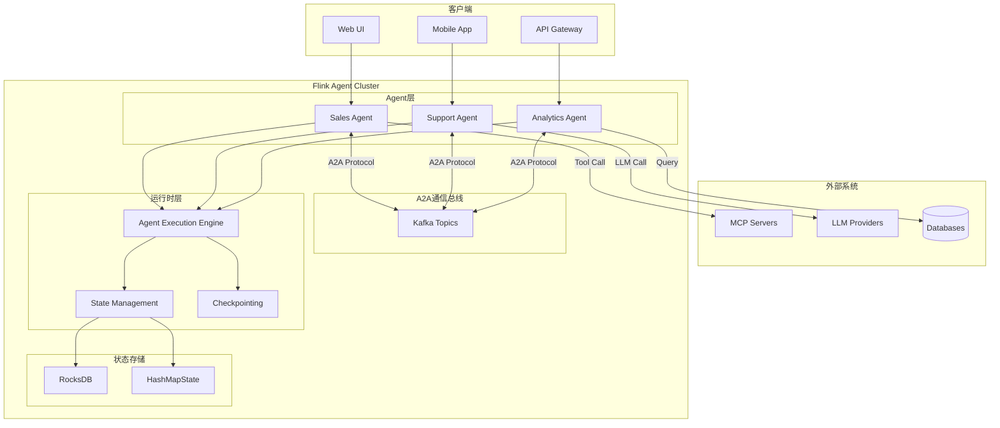
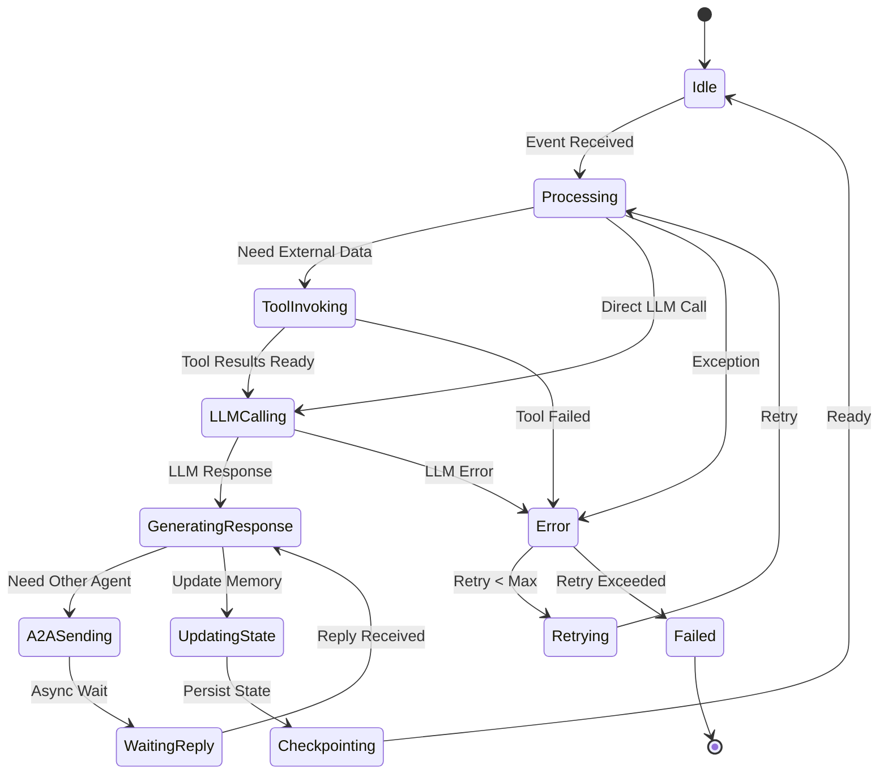
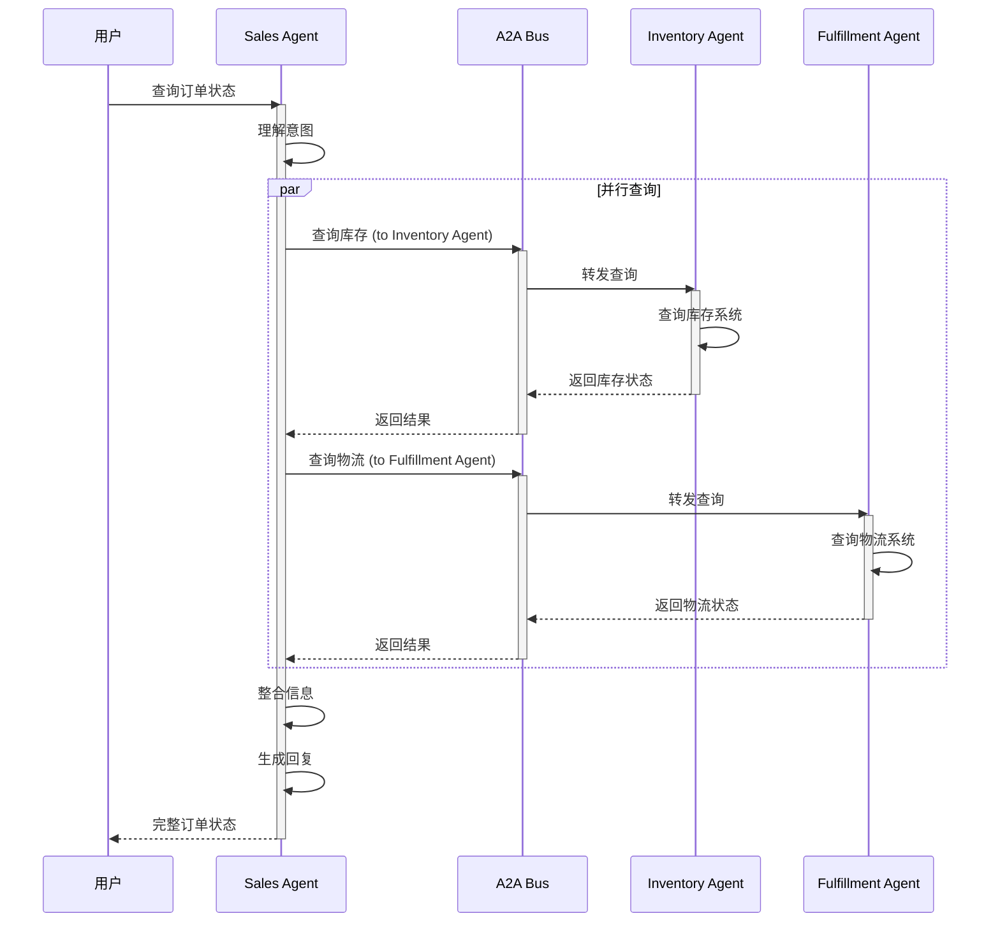
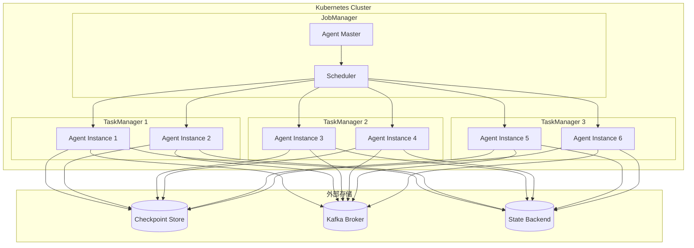

# Flink AI Agents (FLIP-531) 原生Agent支持

> 所属阶段: Flink/12-ai-ml | 前置依赖: [Flink LLM集成](flink-llm-integration.md), [MCP协议](../../Knowledge/06-frontier/../06-frontier/mcp-protocol-agent-streaming.md) | 形式化等级: L3-L4

> ⚠️ **前瞻性声明**
> Flink Agents 目前为 Preview 版本 (0.2.0, 2026-02-06)，API 可能变更。
> 最后更新: 2026-04-06

## 1. 概念定义 (Definitions)

### Def-F-12-90: Flink AI Agent

**Flink AI Agent** 是 FLIP-531 引入的原生Agent抽象，将Flink的流处理能力扩展到自主AI Agent领域：

$$
\text{Agent} \triangleq \langle \mathcal{S}, \mathcal{M}, \mathcal{T}, \mathcal{L}, \mathcal{R} \rangle
$$

其中：

- $\mathcal{S}$: State - 使用Flink状态后端作为Agent记忆
- $\mathcal{M}$: Model - LLM端点配置 (OpenAI/Anthropic/自定义)
- $\mathcal{T}$: Tools - 可调用的工具集合
- $\mathcal{L}$: Logic - Agent行为逻辑 (DataStream API/Table API)
- $\mathcal{R}$: Replayability - 可重放性保证

**核心特性**：

- 事件驱动、长运行Agent
- 原生MCP协议集成
- A2A (Agent-to-Agent) 通信支持
- 状态管理作为长期记忆
- 完全可重放用于审计和测试

### Def-F-12-91: Agent State as Memory

**Agent记忆** 利用Flink的分布式状态后端实现：

```java
// Agent状态定义示例
public class AgentState {
    // 工作记忆 - ValueState
    private ValueState<ConversationContext> workingMemory;

    // 长期记忆 - 带TTL的MapState
    private MapState<String, Fact> longTermMemory;

    // 工具调用历史 - ListState
    private ListState<ToolInvocation> toolHistory;

    // Agent间共享状态 - BroadcastState
    private MapState<String, SharedContext> sharedMemory;
}
```

**状态后端选型**：

| 记忆类型 | 状态类型 | 后端 | TTL |
|---------|---------|------|-----|
| 工作记忆 | ValueState | HashMapState | 会话级 |
| 长期记忆 | MapState | RocksDB | 永久/配置 |
| 历史记录 | ListState | RocksDB | 7-30天 |
| 共享状态 | BroadcastState | RocksDB | 动态 |

### Def-F-12-92: Agent Tool Definition

**Agent工具** 定义了Agent可调用的能力：

```yaml
# 工具定义 schema
tool: 
  name: "query_sales_data"
  description: "查询实时销售数据"
  parameters: 
    - name: "time_range"
      type: "string"
      required: true
      enum: ["1h", "24h", "7d"]
    - name: "product_category"
      type: "string"
      required: false

  # Flink SQL实现的工具
  implementation: 
    type: "sql"
    sql: |
      SELECT
        SUM(amount) as total_sales,
        COUNT(*) as order_count
      FROM sales_events
      WHERE event_time > NOW() - INTERVAL '${time_range}'
      ${product_category != null ? "AND category = '" + product_category + "'" : ""}

  # 执行配置
  execution: 
    timeout_ms: 5000
    retry_policy: "exponential_backoff"
    max_retries: 3
```

### Def-F-12-93: A2A Communication

**Agent-to-Agent (A2A) 通信** 支持多Agent协作：

$$
\text{A2A} \triangleq \langle \mathcal{A}_{sender}, \mathcal{A}_{receiver}, \mathcal{M}, \mathcal{P} \rangle
$$

- $\mathcal{A}_{sender}$: 发送Agent
- $\mathcal{A}_{receiver}$: 接收Agent
- $\mathcal{M}$: 消息内容
- $\mathcal{P}$: 协议 (异步/同步)

**通信模式**：

1. **Request-Reply**: 同步查询
2. **Publish-Subscribe**: 事件广播
3. **Workflow Orchestration**: 工作流编排
4. **Competitive Collaboration**: 竞争协作

### Def-F-12-94: Agent Replayability

**可重放性** 确保Agent行为可审计、可测试：

```
Replay(Agent, t₀, t₁) → Trace
```

**重放维度**：

- 输入事件序列重放
- LLM响应Mock
- 工具调用Stub
- 状态时间旅行

## 2. 属性推导 (Properties)

### Lemma-F-12-90: Agent状态持久化延迟

**引理**: Agent状态写入状态后端的延迟满足：

$$
L_{state} \leq L_{sync} + L_{serialization} + L_{network}}
$$

典型值：

- HashMapState: < 1ms
- RocksDB: 1-5ms
- ForSt (远程): 5-20ms

### Prop-F-12-90: Agent工具调用幂等性

**命题**: 在正确设计下，Agent工具调用满足幂等性：

$$
\text{Tool}(x) = \text{Tool}(\text{Tool}(x)), \quad \forall x \in \text{Inputs}
$$

**约束**：

- 工具无副作用
- 输入参数包含确定性ID
- 输出结果缓存

### Prop-F-12-91: A2A通信因果一致性

**命题**: A2A消息传递满足因果一致性：

$$
m_1 \prec m_2 \Rightarrow \text{Deliver}(\mathcal{A}, m_1) \text{ before } \text{Deliver}(\mathcal{A}, m_2)
$$

**依赖**：Flink的Watermark和Checkpoint机制

### Lemma-F-12-91: Agent记忆容量边界

**引理**: Agent长期记忆的容量受限于状态后端：

$$
|\text{Memory}| \leq \frac{\text{StateBackendCapacity}}{\text{AvgFactSize}}
$$

RocksDB典型值：TB级

## 3. 关系建立 (Relations)

### 3.1 Flink Agent vs 传统Agent框架

| 维度 | LangChain/LlamaIndex | Flink AI Agents |
|------|---------------------|-----------------|
| **运行时** | Python同步 | Java/Scala/Python异步流 |
| **状态管理** | 内存/外部存储 | 原生分布式状态 |
| **可扩展性** | 垂直扩展 | 水平自动扩展 |
| **容错** | 应用层处理 |  exactly-once语义 |
| **重放性** | 有限 | 完整事件重放 |
| **延迟** | 100ms+ | < 50ms |

### 3.2 Agent架构层次

```
┌─────────────────────────────────────────────────────────────────┐
│                     Agent Application                           │
│  ┌──────────────┐  ┌──────────────┐  ┌──────────────────────┐  │
│  │   Agent 1    │  │   Agent 2    │  │   Agent N            │  │
│  │  (Sales)     │  │  (Support)   │  │  (Analytics)         │  │
│  └──────┬───────┘  └──────┬───────┘  └──────────┬───────────┘  │
└─────────┼─────────────────┼─────────────────────┼──────────────┘
          │                 │                     │
          └─────────────────┼─────────────────────┘
                            │ A2A Protocol
┌───────────────────────────┴─────────────────────────────────────┐
│                    Flink Runtime                                │
│  ┌──────────────────────────────────────────────────────────┐  │
│  │              Agent Execution Engine                       │  │
│  │  - Event-driven processing                               │  │
│  │  - State management (memory)                             │  │
│  │  - Tool invocation                                       │  │
│  │  - LLM integration                                       │  │
│  └──────────────────────────────────────────────────────────┘  │
│  ┌──────────────────────────────────────────────────────────┐  │
│  │              Flink Core                                  │  │
│  │  - Checkpointing                                         │  │
│  │  - Watermark management                                  │  │
│  │  - State backends                                        │  │
│  └──────────────────────────────────────────────────────────┘  │
└─────────────────────────────────────────────────────────────────┘
```

### 3.3 MCP与A2A关系

```
┌─────────────────────────────────────────────────────────────────┐
│                      External World                             │
│  ┌──────────────┐  ┌──────────────┐  ┌──────────────────────┐  │
│  │   MCP Server │  │   MCP Server │  │   Other Agents       │  │
│  │  (Database)  │  │  (Search)    │  │  (External)          │  │
│  └──────┬───────┘  └──────┬───────┘  └──────────┬───────────┘  │
└─────────┼─────────────────┼─────────────────────┼──────────────┘
          │                 │                     │
          └─────────────────┼─────────────────────┘
                            │
                    ┌───────▼────────┐
                    │   MCP Client   │
                    └───────┬────────┘
                            │
┌───────────────────────────┼─────────────────────────────────────┐
│                      Flink Agent Cluster                        │
│  ┌────────────────────────┼─────────────────────────────────┐  │
│  │                        │                                 │  │
│  │  ┌─────────┐    ┌─────▼─────┐    ┌─────────┐            │  │
│  │  │ Agent A │◄──►│  A2A Bus  │◄──►│ Agent B │            │  │
│  │  └────┬────┘    └───────────┘    └────┬────┘            │  │
│  │       │                                │                 │  │
│  │       ▼                                ▼                 │  │
│  │  ┌──────────────────────────────────────────────┐       │  │
│  │  │           Shared State (Memory)              │       │  │
│  │  └──────────────────────────────────────────────┘       │  │
│  └──────────────────────────────────────────────────────────┘  │
└─────────────────────────────────────────────────────────────────┘
```

## 4. 论证过程 (Argumentation)

### 4.1 为什么需要Flink原生Agent？

**现有方案问题**：

1. **LangChain**: 单进程，难以扩展
2. **AutoGPT**: 无持久化状态，故障即丢失
3. **自定义服务**: 需要自行实现容错、扩展

**Flink Agent优势**：

1. **原生分布式**: 自动水平扩展
2. **状态持久化**: exactly-once语义
3. **事件驱动**: 毫秒级响应
4. **可重放性**: 完整审计追踪
5. **生态集成**: 与Flink SQL/DataStream无缝衔接

### 4.2 Agent设计反模式

**反模式1: 无界状态增长**

```java
// ❌ 错误：无限增长的历史记录
class BadAgent {
    ListState<Message> allHistory;  // 永不清理！
}

// ✅ 正确：使用TTL和窗口
class GoodAgent {
    ListState<Message> recentHistory;  // 只保留最近100条
    MapState<String, Fact> summarizedMemory;  // 聚合后的长期记忆
}
```

**反模式2: 同步LLM调用**

```java
// ❌ 错误：阻塞等待LLM响应
String response = llmClient.completeSync(prompt);  // 阻塞！

// ✅ 正确：异步非阻塞
CompletableFuture<String> future = llmClient.completeAsync(prompt);
future.thenApply(response -> process(response));
```

**反模式3: 忽略Backpressure**

```java
// ❌ 错误：无限速生成请求
while (true) {
    generateLLMRequest();  // 可能压垮服务！
}

// ✅ 正确：使用Flink背压机制
// Flink自动处理背压，无需额外代码
```

## 5. 形式证明 / 工程论证

### Thm-F-12-90: Agent状态一致性定理

**定理**: 在Flink Agent架构中，Agent状态满足exactly-once一致性：

$$
\forall s \in \text{States}: \text{checkpoint}(s) \Rightarrow \text{recover}(s) = s
$$

**证明概要**：

1. Flink的Checkpoint机制保证状态原子性快照
2. Agent状态使用Flink原生状态抽象
3. 两阶段提交协议确保外部系统一致性
4. 因此故障恢复后状态完全一致

### Thm-F-12-91: A2A消息可靠性定理

**定理**: A2A消息传递满足至少一次语义，可配置为exactly-once：

$$
\forall m \in \text{Messages}: \Diamond \text{delivered}(m) \land \text{configurable-once}
$$

**工程实现**：

- 默认：at-least-once (Kafka作为传输)
- 可选：exactly-once (事务性Kafka生产者)

### Thm-F-12-92: Agent重放等价性定理

**定理**: Agent重放产生与原始执行等价的行为：

$$
\text{Replay}(\text{Agent}, t_0, t_1) \sim \text{Original}(\text{Agent}, t_0, t_1)
$$

**等价条件**：

- 相同的输入事件序列
- Mock的LLM响应
- Stub的工具调用
- 验证状态转换序列一致

## 6. 实例验证 (Examples)

### 6.1 基础Agent定义 (Java)

```java
import org.apache.flink.agent.api.*;

public class SalesAnalyticsAgent {

    public static void main(String[] args) {
        // 创建Agent环境
        AgentEnvironment env = AgentEnvironment
            .create()
            .setParallelism(4)
            .setStateBackend(new RocksDBStateBackend("hdfs://checkpoint"));

        // 定义Agent
        Agent agent = Agent.builder()
            .name("sales-analytics-agent")
            .model(ModelEndpoint.openai("gpt-4"))
            .systemPrompt("你是一个销售数据分析助手...")
            .build();

        // 注册工具
        agent.registerTool(Tool.sql(
            "query_sales",
            "查询销售数据",
            "SELECT * FROM sales WHERE date >= ${start_date}"
        ));

        agent.registerTool(Tool.python(
            "forecast_sales",
            "预测未来销售趋势",
            "ml_models/sales_forecaster.py"
        ));

        // 定义Agent行为
        agent.onEvent(UserQuery.class, (query, context) -> {
            // 1. 理解用户意图
            Intent intent = agent.analyzeIntent(query.getText());

            // 2. 调用相关工具
            List<ToolResult> results = agent.invokeTools(intent.getRequiredTools());

            // 3. 生成回复
            Response response = agent.generateResponse(query, results, context);

            // 4. 更新记忆
            context.getWorkingMemory().update(query, response);

            return response;
        });

        // 执行
        env.execute(agent);
    }
}
```

### 6.2 Python API (PyFlink Agent)

```python
from pyflink.agent import Agent, Tool, ModelEndpoint

# 定义Agent
sales_agent = Agent.builder() \
    .name("sales-agent") \
    .model(ModelEndpoint.anthropic("claude-3-opus")) \
    .system_prompt("你是一个销售分析助手") \
    .build()

# SQL工具
@sales_agent.tool(
    name="get_sales_summary",
    description="获取销售汇总数据"
)
def get_sales_summary(time_range: str) -> dict:
    """Flink SQL实现的工具"""
    sql = f"""
        SELECT
            SUM(amount) as total,
            COUNT(*) as count,
            AVG(amount) as avg
        FROM sales
        WHERE event_time > NOW() - INTERVAL '{time_range}'
    """
    return flink_table_env.execute_sql(sql).fetch_one()

# Python函数工具
@sales_agent.tool(
    name="analyze_trend",
    description="分析销售趋势"
)
def analyze_trend(data: list) -> str:
    """Python实现的分析工具"""
    import numpy as np

    values = [row['total'] for row in data]
    trend = np.polyfit(range(len(values)), values, 1)[0]

    if trend > 0:
        return f"上升趋势 (斜率: {trend:.2f})"
    else:
        return f"下降趋势 (斜率: {trend:.2f})"

# Agent事件处理
@sales_agent.on_event("user_query")
def handle_query(query: str, context: AgentContext):
    # 访问工作记忆
    history = context.working_memory.get_conversation_history()

    # 访问长期记忆
    user_preference = context.long_term_memory.get("user_preference")

    # LLM决策
    response = sales_agent.llm.complete(
        prompt=query,
        context=history,
        tools=sales_agent.get_tools()
    )

    # 执行工具调用
    if response.has_tool_calls():
        results = sales_agent.execute_tool_calls(response.tool_calls)
        final_response = sales_agent.llm.synthesize(response, results)
    else:
        final_response = response

    # 更新记忆
    context.working_memory.add_exchange(query, final_response)

    return final_response

# 启动Agent
sales_agent.execute()
```

### 6.3 SQL API (Table API Agent)

```sql
-- 创建Agent
-- 注: 以下为未来可能的语法（概念设计阶段）
<!-- 以下语法为概念设计，实际 Flink 版本尚未支持 -->
~~CREATE AGENT sales_analytics_agent~~ (未来可能的语法)
WITH (
  'model.endpoint' = 'openai:gpt-4',
  'model.temperature' = '0.7',
  'system.prompt' = '你是一个销售数据分析助手',
  'state.backend' = 'rocksdb',
  'state.ttl' = '7d'
);

-- 注册SQL工具
-- 注: 以下为未来可能的语法（概念设计阶段）
<!-- 以下语法为概念设计，实际 Flink 版本尚未支持 -->
~~CREATE TOOL query_sales_summary~~ (未来可能的语法)
FOR AGENT sales_analytics_agent
AS $$
  SELECT
    DATE_TRUNC('day', event_time) as date,
    SUM(amount) as total_sales,
    COUNT(*) as order_count
  FROM sales_events
  WHERE ${time_filter}
  GROUP BY DATE_TRUNC('day', event_time)
$$;

-- 注册外部工具
-- 注: 以下为未来可能的语法（概念设计阶段）
~~CREATE TOOL send_alert~~ (未来可能的语法)
FOR AGENT sales_analytics_agent
TYPE 'webhook'
CONFIG (
  'url' = 'https://alerts.company.com/webhook',
  'method' = 'POST'
);

-- Agent工作流
<!-- 以下语法为概念设计，实际 Flink 版本尚未支持 -->
~~CREATE WORKFLOW sales_monitoring~~ (未来可能的语法)
AS AGENT sales_analytics_agent
ON TABLE sales_events
WITH RULES (
  -- 规则1: 销售额下降超过10%时告警
  RULE sales_drop_alert
  WHEN (
    SELECT (today.total - yesterday.total) / yesterday.total
    FROM sales_summary today, sales_summary yesterday
    WHERE today.date = CURRENT_DATE
    AND yesterday.date = CURRENT_DATE - INTERVAL '1' DAY
  ) < -0.1
  THEN CALL TOOL send_alert(
    message => '销售额下降超过10%',
    severity => 'high'
  ),

  -- 规则2: 每日生成报告
  RULE daily_report
  EVERY INTERVAL '1' DAY
  THEN CALL AGENT sales_analytics_agent(
    prompt => '生成昨日销售分析报告'
  )
);
```

### 6.4 A2A多Agent协作

```java
// Agent A: 销售分析Agent
Agent salesAgent = Agent.builder()
    .name("sales-agent")
    .build();

// Agent B: 库存管理Agent
Agent inventoryAgent = Agent.builder()
    .name("inventory-agent")
    .build();

// Agent C: 客服Agent
Agent supportAgent = Agent.builder()
    .name("support-agent")
    .build();

// 建立A2A通信
A2ABus bus = new A2ABus(kafkaConfig);

// 注册Agent到总线
bus.register(salesAgent);
bus.register(inventoryAgent);
bus.register(supportAgent);

// Agent A 向 Agent B 发送查询
salesAgent.sendA2A(
    Message.builder()
        .to("inventory-agent")
        .type(MessageType.QUERY)
        .content("查询热销商品的库存水平")
        .correlationId(UUID.randomUUID())
        .build(),
    Duration.ofSeconds(5)  // 超时
).thenAccept(response -> {
    // 处理响应
    processInventoryResponse(response);
});

// Agent B 处理查询并回复
inventoryAgent.onA2A(MessageType.QUERY, message -> {
    if (message.getContent().contains("库存")) {
        InventoryReport report = queryInventory();
        return Message.builder()
            .to(message.getFrom())
            .type(MessageType.REPLY)
            .content(report.toJson())
            .correlationId(message.getCorrelationId())
            .build();
    }
});

// 发布-订阅模式：销售数据更新广播
salesAgent.publish(
    Channel.of("sales.updates"),
    SalesUpdate.builder()
        .productId("P123")
        .salesCount(100)
        .timestamp(Instant.now())
        .build()
);

// Agent B和C订阅销售更新
inventoryAgent.subscribe(Channel.of("sales.updates"), update -> {
    // 根据销售情况调整库存预警阈值
    adjustInventoryThreshold(update.getProductId(), update.getSalesCount());
});

supportAgent.subscribe(Channel.of("sales.updates"), update -> {
    // 更新客服话术中的热销商品信息
    updateHotProducts(update.getProductId());
});
```

## 7. 可视化 (Visualizations)

### 7.1 Flink Agent架构图



### 7.2 Agent状态管理



### 7.3 A2A协作流程



### 7.4 部署拓扑



## 8. 引用参考 (References)
