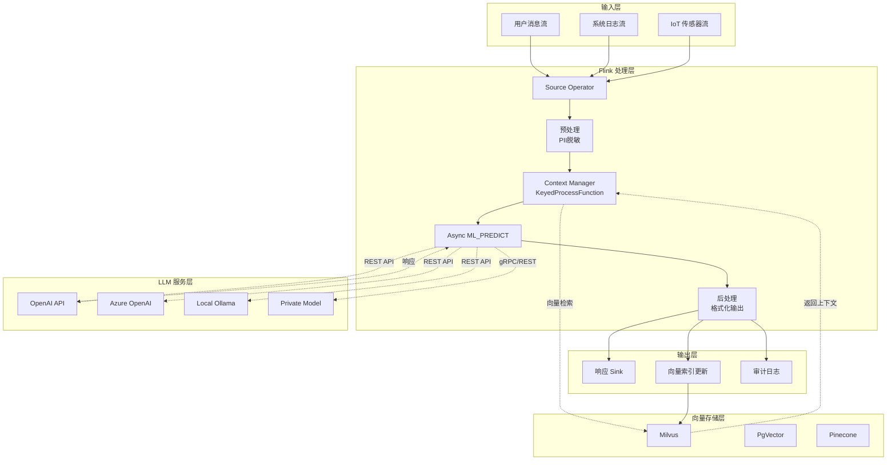
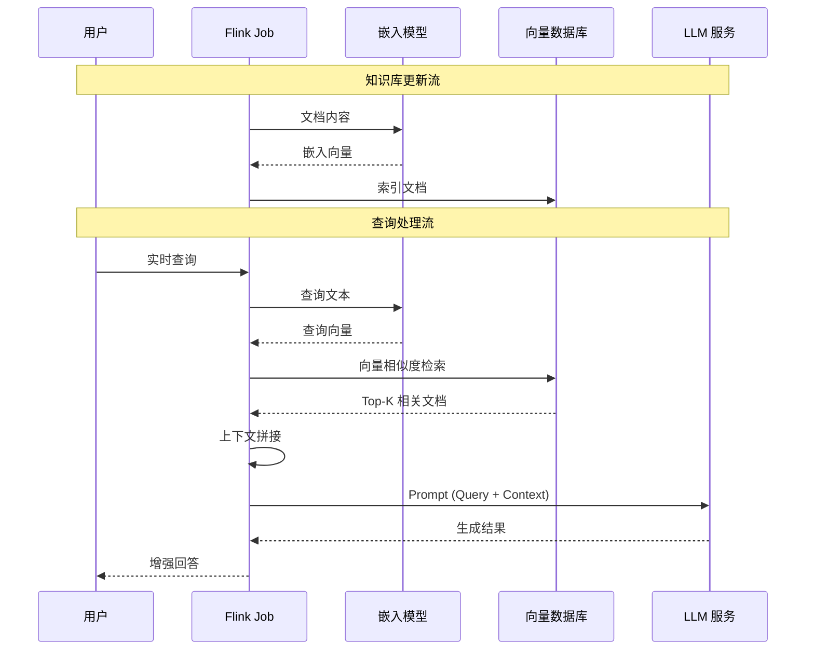
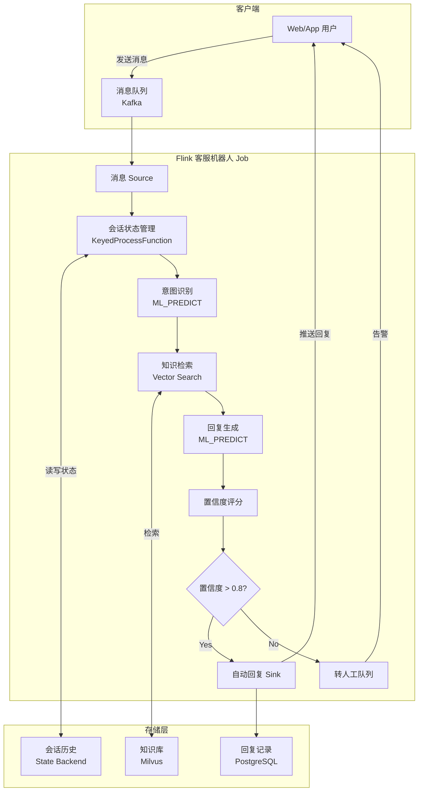
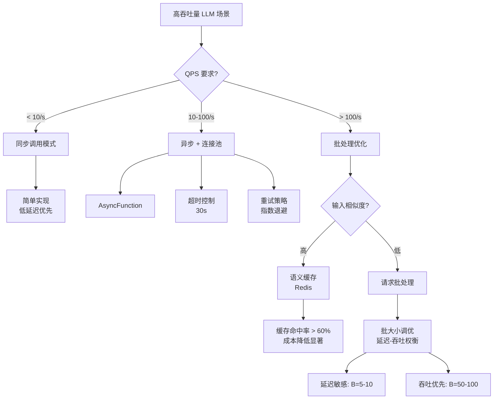
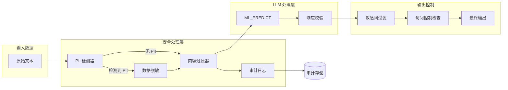

> **状态**: 🔮 前瞻内容 | **风险等级**: 高 | **最后更新**: 2026-04
>
> 此文档描述的内容处于早期规划阶段，可能与最终实现不符。请以 Apache Flink 官方发布为准。
>
# Flink 与 LLM 集成：实时生成式 AI 应用

> **所属阶段**: Flink AI/ML 扩展 | **前置依赖**: [Flink SQL 高级特性](../03-api/03.02-table-sql-api/built-in-functions-complete-list.md), [Flink ML 基础](./flink-ml-architecture.md) | **形式化等级**: L3 (工程实现)

---

## 1. 概念定义 (Definitions)

### Def-F-12-40: 流式 LLM 推理架构 (Streaming LLM Inference Architecture)

**定义**: 流式 LLM 推理架构是一种将大型语言模型 (LLM) 的推理能力与流计算框架集成的分布式计算范式，形式化定义为五元组：

$$
\mathcal{F}_{LLM} = \langle S_{stream}, M_{model}, P_{prompt}, R_{response}, C_{context} \rangle
$$

其中：

- $S_{stream}$: 无界输入流，元素为待推理的文本或结构化数据
- $M_{model}$: 外部 LLM 服务或本地部署模型的抽象接口
- $P_{prompt}$: 提示模板引擎，支持动态变量绑定
- $R_{response}$: 响应解析器，将模型输出映射为结构化字段
- $C_{context}$: 上下文管理器，维护对话历史和检索增强上下文

**直观解释**: 该架构允许 Flink 将实时数据流（如用户消息、传感器数据、日志事件）作为输入，通过 LLM 进行智能处理，并输出结构化结果（如分类标签、生成文本、嵌入向量）。

### Def-F-12-41: Model DDL (模型定义语言)

**定义**: Model DDL 是 Flink SQL 的扩展语法，用于声明式地定义外部 AI/ML 模型连接：

```sql
<!-- 以下语法为概念设计，实际 Flink 版本尚未支持 -->
~~CREATE MODEL~~ (未来可能的语法)
  [ WITH (
    'provider' = '<provider_type>',
    'endpoint' = '<api_endpoint>',
    'api_key' = '<secret_reference>',
    'model' = '<model_identifier>',
    'task' = '<inference_task>',
    <provider_specific_options>
  ) ]
  [ INPUT ( <column_definitions> ) ]
  [ OUTPUT ( <column_definitions> ) ]
```

**语义**: Model DDL 将模型推理抽象为表函数 (Table Function)，支持 SQL 原生调用，屏蔽底层 API 差异。

### Def-F-12-42: ML_PREDICT 函数

**定义**: ML_PREDICT 是 Flink SQL 的内置表值函数 (TVF)，用于在 SQL 查询中调用已定义的模型：

```sql
ML_PREDICT(
  model_name,           -- 模型名称 (STRING)
  input_columns,        -- 输入列或表达式
  [task_override],      -- 可选：覆盖模型默认任务
  [options]             -- 可选：推理参数 (temperature, max_tokens等)
)
```

**返回类型**: TABLE，包含模型输出字段（如 `response`, `embedding`, `confidence`, `tokens_used` 等）。

### Def-F-12-43: RAG 流式架构 (Retrieval-Augmented Generation Streaming)

**定义**: RAG 流式架构是一种结合向量检索与生成式模型的实时推理模式，形式化为：

$$
\text{RAG}(q, D, k) = LLM(q \oplus \text{TopK}(\text{Embed}(q), V_D, k))
$$

其中：

- $q$: 实时查询（流元素）
- $D$: 动态知识库（支持实时更新）
- $V_D$: 文档集合的向量索引
- $\text{Embed}(q)$: 查询的嵌入向量
- $\text{TopK}$: 向量相似度检索（余弦相似度或点积）
- $\oplus$: 上下文拼接操作

### Def-F-12-44: OpenAI API 兼容层

**定义**: OpenAI API 兼容层是 Flink 与 LLM 服务通信的标准化适配器，支持统一的 REST 接口调用：

| 功能 | 端点 | Flink 映射 |
|------|------|-----------|
| Chat Completion | POST /v1/chat/completions | ML_PREDICT with task='chat' |
| Embeddings | POST /v1/embeddings | ML_PREDICT with task='embedding' |
| Completions | POST /v1/completions | ML_PREDICT with task='completion' |

### Def-F-12-45: 令牌预算管理 (Token Budget Management)

**定义**: 令牌预算管理是一种成本控制机制，定义为单位时间内的令牌消耗约束：

$$
\mathcal{B} = \langle T_{window}, R_{max}, A_{alert} \rangle
$$

- $T_{window}$: 预算窗口（如 1 小时）
- $R_{max}$: 最大令牌消耗率（tokens/minute）
- $A_{alert}$: 告警阈值（百分比）

---

## 2. 属性推导 (Properties)

### Lemma-F-12-15: 流式 LLM 推理的延迟边界

**陈述**: 设 $t_{network}$ 为网络往返延迟，$t_{inference}$ 为模型推理时间，$t_{parse}$ 为响应解析时间，则端到端延迟满足：

$$
L_{e2e} = t_{network} + t_{inference} + t_{parse} + O(\text{checkpoint interval})
$$

**工程推论**: 对于实时应用，建议采用异步非阻塞调用，将 $t_{inference}$ 与流处理解耦。

### Lemma-F-12-16: ML_PREDICT 的确定性保证

**陈述**: 给定相同的输入 $x$ 和模型参数 $\theta$，ML_PREDICT 在确定性模型（temperature=0）下保证输出一致性：

$$
\forall x, \theta: \text{ML_PREDICT}(x, \theta, T=0) \equiv \text{const}
$$

**非确定性场景**: 当 temperature > 0 或启用 top_p/top_k 采样时，输出为概率分布采样结果，需通过 `seed` 参数控制可复现性。

### Lemma-F-12-17: RAG 上下文窗口约束

**陈述**: 设上下文窗口最大长度为 $C_{max}$，检索到的文档块数为 $k$，平均块长度为 $L_{chunk}$，查询长度为 $L_q$，则必须满足：

$$
L_q + k \cdot L_{chunk} + L_{response} \leq C_{max}
$$

**工程推论**: 需要动态调整 $k$ 或实现智能截断策略，防止上下文溢出。

---

## 3. 关系建立 (Relations)

### 3.1 Flink LLM 与流计算范式的映射

| 流计算概念 | LLM 集成映射 | 说明 |
|-----------|-------------|------|
| Source | 实时输入流 | 用户消息、系统日志、IoT 数据 |
| Transformation | ML_PREDICT 调用 | 文本生成、分类、嵌入 |
| Sink | 响应输出 + 向量存储 | 下游系统、知识库更新 |
| Watermark | 推理超时控制 | 防止慢请求阻塞流水线 |
| Checkpoint | 幂等性保证 | 故障恢复时避免重复计费 |

### 3.2 与标准 ML 推理的对比

```
传统 ML Inference (Flink ML):
  ┌─────────┐    ┌──────────┐    ┌─────────┐
  │ Feature │───→│ Model    │───→│ Prediction│
  │ Vector  │    │ (Local)  │    │ (Label)   │
  └─────────┘    └──────────┘    └─────────┘

LLM Inference (Flink + External API):
  ┌─────────┐    ┌──────────┐    ┌───────────┐    ┌─────────┐
  │ Text/   │───→│ Prompt   │───→│ LLM API   │───→│ Generated │
  │ Context │    │ Template │    │ (Remote)  │    │ Text      │
  └─────────┘    └──────────┘    └───────────┘    └─────────┘
```

### 3.3 与 Vector DB 的集成矩阵

| 向量数据库 | 集成方式 | 适用场景 |
|-----------|---------|---------|
| Milvus | SQL Connector (JDBC/REST) | 大规模企业级 RAG |
| PgVector | PostgreSQL Connector | 已有 PG 基础设施 |
| Pinecone | REST API Async Lookup | 托管向量服务 |
| Weaviate | gRPC/REST Connector | GraphQL 原生支持 |
| Chroma | Local/Remote REST | 轻量级本地开发 |

---

## 4. 论证过程 (Argumentation)

### 4.1 架构选择分析：同步 vs 异步调用

**同步调用模型**:

```
优点: 实现简单，天然背压支持
缺点: 高延迟阻塞，吞吐量受限于 LLM RTT
适用: 低 QPS、高准确率要求的场景
```

**异步调用模型** (推荐):

```
优点: 高并发，流水线并行，吞吐量高
缺点: 实现复杂，需要超时和重试机制
适用: 高吞吐实时流处理
```

### 4.2 反例分析：纯批处理 LLM 推理的局限

**场景**: 实时客服机器人需要基于最新订单状态生成回复。

**批处理方案问题**:

1. 延迟：批次等待时间导致响应滞后
2. 新鲜度：知识库更新无法实时反映
3. 状态隔离：无法维护每会话的上下文历史

**流式方案优势**:

1. 事件驱动：订单状态变更即时触发推理
2. 持续上下文：通过 KeyedProcessFunction 维护会话状态
3. 实时 RAG：向量库更新立即影响检索结果

### 4.3 边界条件：上下文长度溢出处理

当检索到的上下文超过模型窗口限制时，可选策略：

| 策略 | 描述 | 适用场景 |
|------|------|---------|
| 截断 (Truncation) | 从末尾截断，保留开头 | 指令遵循型任务 |
| 摘要压缩 | 用轻量模型预摘要长文档 | 信息密度高的场景 |
| 分层检索 | 先检索粗粒度，再细粒度过滤 | 文档库层次化场景 |
| 滑动窗口 | 分块处理，多次调用 | 长文档生成 |

---

## 5. 工程论证 (Engineering Argument)

### Thm-F-12-35: 流式 LLM 集成系统的容错性保证

**定理**: 在启用 Checkpoint 的 Flink 流式 LLM 集成系统中，当满足以下条件时，系统提供 Exactly-Once 处理保证：

1. LLM API 调用具有幂等性（通过 `request_id` 去重）
2. 状态后端持久化上下文和令牌计数
3. 输出 Sink 支持事务性写入

**证明概要**:

设 $S$ 为系统状态，$f$ 为 ML_PREDICT 算子，$O$ 为输出操作。

1. **Checkpoint 一致性**: Flink 在 barrier 处快照状态 $S_k$，包含未完成的 API 请求队列 $Q_k$。

2. **故障恢复**: 从 $S_k$ 恢复时，$Q_k$ 中的请求重新提交。由于 LLM API 支持 `request_id` 去重，重复请求返回缓存结果，不产生额外计费。

3. **输出幂等**: 事务性 Sink 确保 $O(S_k)$ 只执行一次，即使算子重启。

$$
\therefore \forall \text{failure}: \text{output} = f(S_{consistent}) \land \text{cost} = \text{expected}
$$

### Thm-F-12-36: RAG 流式架构的一致性约束

**定理**: 在 RAG 流式架构中，检索-生成一致性要求向量索引的更新延迟 $L_{index}$ 满足：

$$
L_{index} < \frac{1}{\lambda_{query}}
$$

其中 $\lambda_{query}$ 为查询到达率。

**工程推论**:

- 若 $L_{index} > 1/\lambda_{query}$，存在知识陈旧风险（Stale Read）
- 解决方案：近线索引更新 + 查询时校验版本

### Thm-F-12-37: 批处理优化的吞吐量下限

**定理**: 设单请求平均延迟为 $t_{lat}$，批大小为 $B$，则批处理优化的有效吞吐量满足：

$$
\text{Throughput}_{batch} \geq \frac{B}{t_{lat} + t_{overhead}(B)}
$$

其中 $t_{overhead}(B)$ 为批处理额外开销，通常为次线性增长 $O(\log B)$。

**最优批大小**: 存在 $B^*$ 使得边际收益等于边际成本：

$$
\frac{\partial Throughput}{\partial B}\bigg|_{B=B^*} = \frac{\partial \text{Latency}}{\partial B}\bigg|_{B=B^*}
$$

---

## 6. 实例验证 (Examples)

### 6.1 基础配置：创建 LLM 模型连接

```sql
-- Def-F-12-41: Model DDL 实例

-- OpenAI GPT-4 模型
~~CREATE MODEL gpt4_chat~~ (未来可能的语法)
WITH (
  'provider' = 'openai',
  'endpoint' = 'https://api.openai.com/v1',
  'api-key' = '${OPENAI_API_KEY}',
  'model' = 'gpt-4-turbo-preview',
  'task' = 'chat',
  'temperature' = '0.7',
  'max-tokens' = '2048'
);

-- 文本嵌入模型
~~CREATE MODEL text_embedding_3~~ (未来可能的语法)
WITH (
  'provider' = 'openai',
  'endpoint' = 'https://api.openai.com/v1',
  'api-key' = '${OPENAI_API_KEY}',
  'model' = 'text-embedding-3-small',
  'task' = 'embedding',
  'dimensions' = '1536'
);

-- 兼容 Ollama 本地模型
~~CREATE MODEL local_llama~~ (未来可能的语法)
WITH (
  'provider' = 'ollama',
  'endpoint' = 'http://localhost:11434',
  'model' = 'llama2:13b',
  'task' = 'completion'
);
```

### 6.2 Flink SQL LLM 功能示例

**文本生成与补全**:

```sql
-- 实时生成产品描述
SELECT
  p.product_id,
  p.product_name,
  r.response AS generated_description
FROM products p,
LATERAL TABLE(
  ML_PREDICT(
    'gpt4_chat',
    CONCAT('Write a compelling product description for: ', p.product_name),
    'chat',
    MAP('temperature', '0.8')
  )
) AS r;
```

**文本嵌入 (Embedding)**:

```sql
-- 实时计算用户查询的嵌入向量
INSERT INTO query_embeddings
SELECT
  q.query_id,
  q.user_id,
  q.query_text,
  e.embedding,
  CURRENT_TIMESTAMP AS embedding_time
FROM user_queries q,
LATERAL TABLE(
  ML_PREDICT('text_embedding_3', q.query_text, 'embedding')
) AS e;
```

**情感分析**:

```sql
-- 实时客服消息情感分析
~~CREATE MODEL sentiment_analyzer~~ (未来可能的语法)
WITH (
  'provider' = 'openai',
  'api-key' = '${OPENAI_API_KEY}',
  'model' = 'gpt-3.5-turbo',
  'task' = 'classification',
  'labels' = 'positive,negative,neutral'
);

SELECT
  m.message_id,
  m.customer_id,
  m.message_content,
  s.label AS sentiment,
  s.confidence
FROM customer_messages m,
LATERAL TABLE(
  ML_PREDICT(
    'sentiment_analyzer',
    CONCAT('Classify sentiment: ', m.message_content)
  )
) AS s;
```

**实体提取**:

```sql
-- 从新闻流中提取命名实体
SELECT
  n.news_id,
  n.headline,
  e.entities
FROM news_stream n,
LATERAL TABLE(
  ML_PREDICT(
    'gpt4_chat',
    CONCAT('Extract entities (JSON format) from: ', n.headline),
    'chat',
    MAP('response_format', 'json_object')
  )
) AS e;
```

**文本摘要**:

```sql
-- 实时文档摘要
SELECT
  d.doc_id,
  d.content,
  s.response AS summary
FROM documents d,
LATERAL TABLE(
  ML_PREDICT(
    'gpt4_chat',
    CONCAT('Summarize in 100 words: ', LEFT(d.content, 4000)),
    'chat',
    MAP('max_tokens', '200')
  )
) AS s
WHERE LENGTH(d.content) > 500;
```

**翻译**:

```sql
-- 实时多语言翻译
~~CREATE MODEL translator~~ (未来可能的语法)
WITH (
  'provider' = 'openai',
  'api-key' = '${OPENAI_API_KEY}',
  'model' = 'gpt-4',
  'task' = 'translation'
);

SELECT
  t.text_id,
  t.source_lang,
  t.target_lang,
  t.source_text,
  tr.response AS translated_text
FROM translation_requests t,
LATERAL TABLE(
  ML_PREDICT(
    'translator',
    CONCAT('Translate from ', t.source_lang, ' to ', t.target_lang, ': ', t.source_text)
  )
) AS tr;
```

### 6.3 RAG 流式架构实现

**向量检索集成**:

```sql
-- Def-F-12-43: RAG 流式架构实例

-- 步骤 1: 实时索引文档到 Milvus
INSERT INTO milvus_documents
SELECT
  d.doc_id,
  d.content,
  e.embedding,
  d.metadata
FROM document_updates d,
LATERAL TABLE(
  ML_PREDICT('text_embedding_3', d.content, 'embedding')
) AS e;

-- 步骤 2: RAG 查询处理
WITH query_with_context AS (
  SELECT
    q.query_id,
    q.query_text,
    -- 向量检索 Top-K 相关文档
    (SELECT STRING_AGG(doc.content, '\n---\n' ORDER BY doc.score DESC)
     FROM TABLE(
       VECTOR_SEARCH(
         'milvus_documents',
         (SELECT embedding FROM ML_PREDICT('text_embedding_3', q.query_text)),
         3  -- Top-K
       )
     ) AS doc
    ) AS retrieved_context
  FROM user_queries q
)
SELECT
  c.query_id,
  c.query_text,
  r.response AS generated_answer,
  c.retrieved_context
FROM query_with_context c,
LATERAL TABLE(
  ML_PREDICT(
    'gpt4_chat',
    CONCAT(
      'Context:\n', c.retrieved_context,
      '\n\nQuestion: ', c.query_text,
      '\n\nAnswer based on context:'
    ),
    'chat',
    MAP('temperature', '0.3')
  )
) AS r;
```

**上下文窗口管理**:

```java
// Java API: 智能上下文截断

import org.apache.flink.api.common.state.ValueState;

public class ContextWindowManager extends KeyedProcessFunction<String, Query, EnrichedQuery> {
    private static final int MAX_CONTEXT_TOKENS = 6000;
    private ValueState<List<String>> conversationHistory;

    @Override
    public void processElement(Query query, Context ctx, Collector<EnrichedQuery> out) {
        List<String> history = conversationHistory.value();
        if (history == null) history = new ArrayList<>();

        // 添加新消息
        history.add(query.getMessage());

        // 智能截断：保留最近的对话，确保不超过上下文限制
        int estimatedTokens = estimateTokens(history);
        while (estimatedTokens > MAX_CONTEXT_TOKENS && history.size() > 1) {
            history.remove(0); // 移除最早的消息
            estimatedTokens = estimateTokens(history);
        }

        conversationHistory.update(history);
        out.collect(new EnrichedQuery(query, history));
    }

    private int estimateTokens(List<String> messages) {
        // 近似估算：1 token ≈ 4 characters (英文)
        return messages.stream()
            .mapToInt(s -> s.length() / 4)
            .sum();
    }
}
```

### 6.4 生产场景：实时客服机器人

```sql
-- 完整的实时客服 RAG 流程

-- 输入：客户消息流
CREATE TABLE customer_messages (
  session_id STRING,
  message_id STRING,
  customer_id STRING,
  message_content STRING,
  message_ts TIMESTAMP(3),
  WATERMARK FOR message_ts AS message_ts - INTERVAL '5' SECOND
) WITH (
  'connector' = 'kafka',
  'topic' = 'customer.messages',
  'properties.bootstrap.servers' = 'kafka:9092'
);

-- 输出：机器人回复
CREATE TABLE bot_responses (
  session_id STRING,
  response_id STRING,
  response_content STRING,
  confidence DOUBLE,
  sources ARRAY<STRING>,
  response_ts TIMESTAMP(3),
  PRIMARY KEY (response_id) NOT ENFORCED
) WITH (
  'connector' = 'jdbc',
  'url' = 'jdbc:postgresql://db:5432/support',
  'table-name' = 'bot_responses'
);

-- RAG 客服机器人查询
INSERT INTO bot_responses
WITH
-- 1. 检索相关知识
retrieved_knowledge AS (
  SELECT
    m.session_id,
    m.message_id,
    m.message_content,
    (SELECT STRING_AGG(k.answer, '\n')
     FROM TABLE(
       VECTOR_SEARCH('knowledge_base',
         (SELECT embedding FROM ML_PREDICT('text_embedding_3', m.message_content)),
         2
       )
     ) AS k
    ) AS knowledge
  FROM customer_messages m
),
-- 2. 生成回复
ai_responses AS (
  SELECT
    r.session_id,
    r.message_id AS response_id,
    gen.response AS response_content,
    gen.confidence,
    gen.sources
  FROM retrieved_knowledge r,
  LATERAL TABLE(
    ML_PREDICT(
      'gpt4_chat',
      CONCAT(
        'You are a helpful customer support agent.\n',
        'Knowledge Base:\n', r.knowledge, '\n\n',
        'Customer Question: ', r.message_content, '\n',
        'Provide a helpful response:'
      ),
      'chat',
      MAP('temperature', '0.5', 'max_tokens', '500')
    )
  ) AS gen
)
SELECT * FROM ai_responses;
```

### 6.5 性能与成本优化配置

**请求批处理**:

```java
// AsyncFunction 批量调用优化
public class BatchLLMCaller extends RichAsyncFunction<String, LLMResponse> {
    private transient LLMClient client;
    private static final int BATCH_SIZE = 10;
    private static final long BATCH_TIMEOUT_MS = 100;

    @Override
    public void asyncInvoke(String input, ResultFuture<LLMResponse> resultFuture) {
        // 使用 Flink 的 AsyncWaitOperator 自动批处理
        // 或手动实现缓冲区累积
    }
}

// SQL 配置批处理
SET 'table.exec.async-lookup.buffer-capacity' = '100';
SET 'table.exec.async-lookup.timeout' = '30s';
```

**令牌预算管理**:

```sql
-- 创建令牌使用监控表
CREATE TABLE token_usage (
  window_start TIMESTAMP(3),
  window_end TIMESTAMP(3),
  model_name STRING,
  total_tokens BIGINT,
  total_cost DECIMAL(10,4),
  PRIMARY KEY (window_start, model_name) NOT ENFORCED
) WITH (
  'connector' = 'jdbc',
  'url' = 'jdbc:postgresql://db:5432/monitoring'
);

-- 实时令牌消耗监控
INSERT INTO token_usage
SELECT
  TUMBLE_START(rts, INTERVAL '1' HOUR) AS window_start,
  TUMBLE_END(rts, INTERVAL '1' HOUR) AS window_end,
  'gpt4_chat' AS model_name,
  SUM(r.tokens_used) AS total_tokens,
  SUM(r.tokens_used * 0.00003) AS total_cost  -- $0.03 per 1K tokens
FROM llm_responses r
GROUP BY TUMBLE(rts, INTERVAL '1' HOUR);
```

**缓存策略**:

```java
// Redis 缓存层减少重复调用
public class CachedLLMFunction extends RichAsyncFunction<String, String> {
    private transient RedisClient redis;

    @Override
    public void asyncInvoke(String input, ResultFuture<String> resultFuture) {
        String cacheKey = "llm:" + hash(input);

        redis.get(cacheKey).thenAccept(cached -> {
            if (cached != null) {
                resultFuture.complete(Collections.singleton(cached));
            } else {
                callLLM(input).thenAccept(response -> {
                    redis.setex(cacheKey, 3600, response); // 1小时TTL
                    resultFuture.complete(Collections.singleton(response));
                });
            }
        });
    }
}
```

**模型路由**:

```sql
-- 基于查询复杂度路由到不同模型
SELECT
  q.query_id,
  CASE
    WHEN LENGTH(q.query_text) < 50 AND q.complexity = 'low' THEN
      (SELECT response FROM ML_PREDICT('gpt3.5_chat', q.query_text))
    WHEN q.complexity = 'medium' THEN
      (SELECT response FROM ML_PREDICT('gpt4_chat', q.query_text))
    ELSE
      (SELECT response FROM ML_PREDICT('gpt4_chat', q.query_text, MAP('temperature', '0.2')))
  END AS response
FROM queries q;
```

### 6.6 安全与合规实现

**数据脱敏**:

```java
// PII 检测与脱敏
public class PIIMaskingFunction extends ScalarFunction {
    private transient PIIRegexDetector detector;

    public String eval(String input) {
        // 检测邮箱、电话、身份证号等
        String masked = detector.maskEmail(input);
        masked = detector.maskPhone(masked);
        masked = detector.maskIdNumber(masked);
        return masked;
    }
}

// SQL 中使用
SELECT
  m.message_id,
  PIIMask(m.message_content) AS safe_content,
  ML_PREDICT('gpt4_chat', PIIMask(m.message_content)) AS response
FROM messages m;
```

**审计日志**:

```sql
-- LLM 调用审计表
CREATE TABLE llm_audit_log (
  call_id STRING,
  timestamp TIMESTAMP(3),
  user_id STRING,
  model_name STRING,
  prompt_hash STRING,
  response_hash STRING,
  tokens_input INT,
  tokens_output INT,
  latency_ms INT,
  success BOOLEAN
) WITH (
  'connector' = 'kafka',
  'topic' = 'llm.audit'
);

-- 记录所有 LLM 调用
INSERT INTO llm_audit_log
SELECT
  UUID() AS call_id,
  CURRENT_TIMESTAMP AS timestamp,
  q.user_id,
  'gpt4_chat' AS model_name,
  SHA256(q.query_text) AS prompt_hash,
  SHA256(r.response) AS response_hash,
  r.prompt_tokens AS tokens_input,
  r.completion_tokens AS tokens_output,
  r.latency_ms,
  r.success
FROM queries q, LATERAL TABLE(ML_PREDICT('gpt4_chat', q.query_text)) AS r;
```

---

## 7. 可视化 (Visualizations)

### 7.1 流式 LLM 集成架构图



### 7.2 RAG 流式架构数据流



### 7.3 生产场景：实时客服机器人



### 7.4 性能优化决策树



### 7.5 安全合规架构



---

## 8. 引用参考 (References)


---

## 附录：定理与定义汇总

| 编号 | 类型 | 名称 | 位置 |
|------|------|------|------|
| Def-F-12-40 | 定义 | 流式 LLM 推理架构 | 第1节 |
| Def-F-12-41 | 定义 | Model DDL | 第1节 |
| Def-F-12-42 | 定义 | ML_PREDICT 函数 | 第1节 |
| Def-F-12-43 | 定义 | RAG 流式架构 | 第1节 |
| Def-F-12-44 | 定义 | OpenAI API 兼容层 | 第1节 |
| Def-F-12-45 | 定义 | 令牌预算管理 | 第1节 |
| Lemma-F-12-15 | 引理 | 流式 LLM 推理的延迟边界 | 第2节 |
| Lemma-F-12-16 | 引理 | ML_PREDICT 的确定性保证 | 第2节 |
| Lemma-F-12-17 | 引理 | RAG 上下文窗口约束 | 第2节 |
| Thm-F-12-35 | 定理 | 流式 LLM 集成系统的容错性保证 | 第5节 |
| Thm-F-12-36 | 定理 | RAG 流式架构的一致性约束 | 第5节 |
| Thm-F-12-37 | 定理 | 批处理优化的吞吐量下限 | 第5节 |
