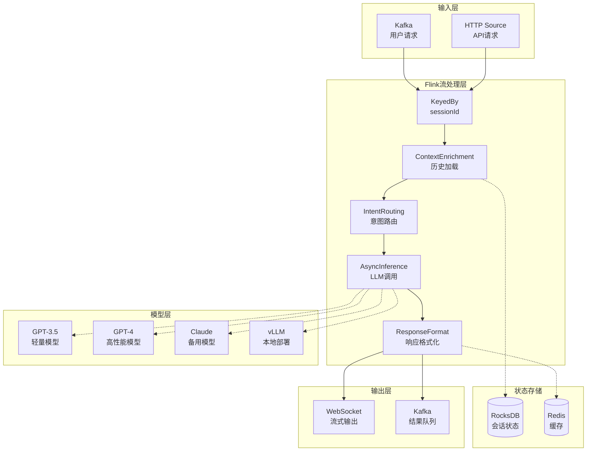
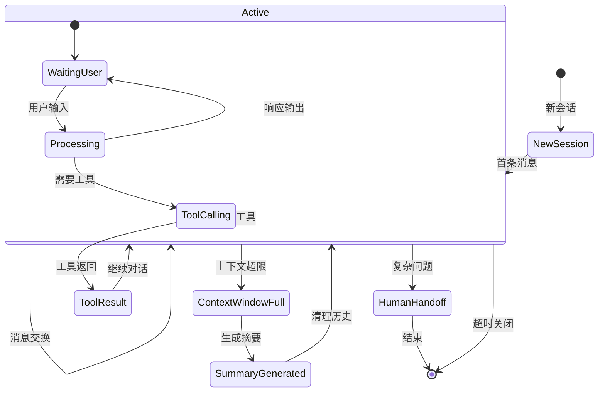
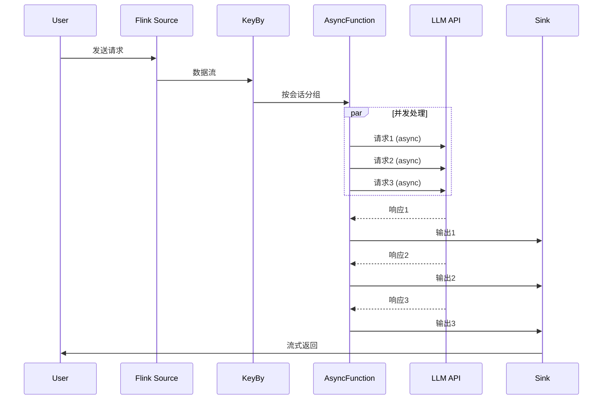
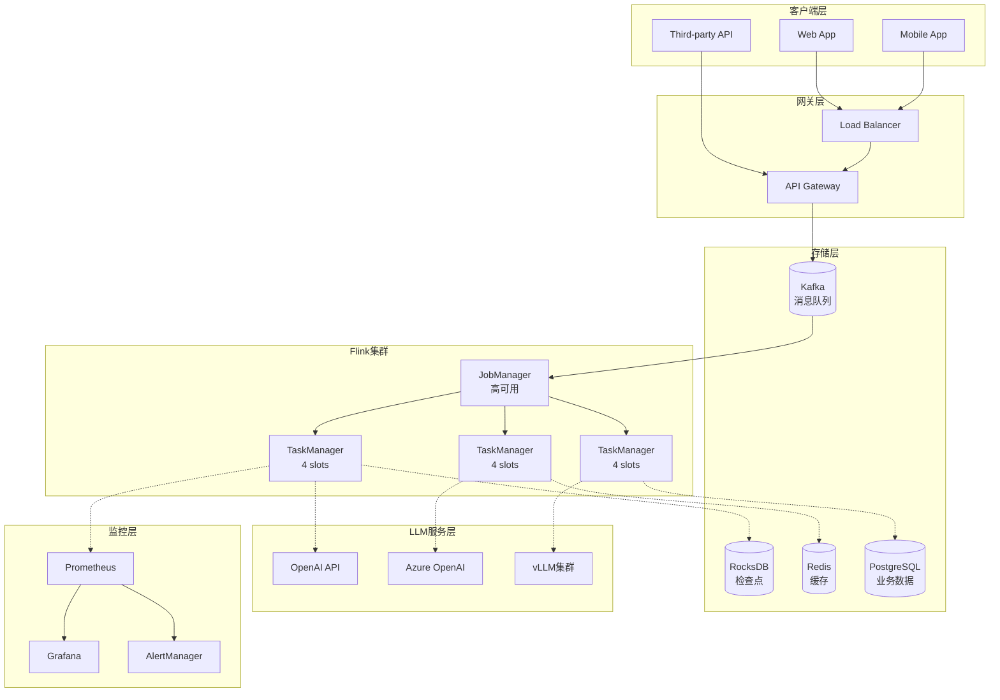

# Flink LLM 实时推理实战指南

> 所属阶段: Flink/06-ai-ml | 前置依赖: [Flink AI/ML集成完整指南](./flink-ai-ml-integration-complete-guide.md), [Flink LLM实时RAG架构](./flink-llm-realtime-rag-architecture.md), [Flink与GPU加速](./flink-25-gpu-acceleration.md) | 形式化等级: L4-L5

---

## 1. 概念定义 (Definitions)

### Def-F-06-50: Flink LLM推理管道

**定义**: Flink LLM推理管道是一个流处理拓扑 $\mathcal{T}_{LLM} = (\mathcal{V}, \mathcal{E}, \mathcal{F}, \mathcal{C})$，其中：

- **顶点集** ($\mathcal{V}$): 算子节点集合，包括 Source → Process → Sink
- **边集** ($\mathcal{E}$): 数据流通道，支持 keyed/broadcast/forward 分区策略
- **算子函数** ($\mathcal{F}$): 处理逻辑，包括 `AsyncFunction` 用于非阻塞LLM调用
- **检查点配置** ($\mathcal{C}$): 容错配置，支持 exactly-once 语义

**管道拓扑**:

```
UserRequestSource → KeyBy(sessionId) → AsyncInference → ResponseFormatting → WebSocketSink
                           ↓
                    BroadcastStream<ModelConfig>
```

---

### Def-F-06-51: 异步LLM推理算子

**定义**: 异步LLM推理算子 $\mathcal{A}_{llm}$ 使用 Flink AsyncFunction 实现非阻塞API调用：

$$\mathcal{A}_{llm}: \text{Stream}(\text{Request}) \times \text{LLMClient} \rightarrow \text{Stream}(\text{Response})$$

**并发控制参数**:

| 参数 | 符号 | 说明 | 推荐值 |
|------|------|------|--------|
| 超时 | $T_{timeout}$ | 最大等待时间 | 30s |
| 容量 | $C_{capacity}$ | 并发请求数 | 100 |
| 重试 | $N_{retry}$ | 失败重试次数 | 3 |
| 退避 | $B_{backoff}$ | 指数退避因子 | 2x |

---

### Def-F-06-52: 会话状态管理

**定义**: 会话状态管理器 $\mathcal{S}_{session}$ 维护多轮对话的上下文状态：

$$\mathcal{S}_{session}: \text{Key} \rightarrow \text{ListState}(\text{Message}) \times \text{ValueState}(\text{Metadata})$$

**状态类型映射**:

| 状态数据 | Flink状态类型 | TTL策略 | 后端推荐 |
|----------|---------------|---------|----------|
| 对话历史 | ListState<Message> | 30分钟 | RocksDB |
| 用户画像 | ValueState<Profile> | 24小时 | RocksDB |
| 会话元数据 | ValueState<Metadata> | 会话级 | HashMap |
| 临时缓存 | MapState<String, Any> | 5分钟 | RocksDB |

---

### Def-F-06-53: 模型路由策略

**定义**: 模型路由函数 $\mathcal{R}_{model}$ 根据请求特征选择最优模型：

$$\mathcal{R}_{model}: (q, ctx, budget) \rightarrow m^* \in \mathcal{M}$$

**路由策略实现**:

| 策略 | 决策依据 | 适用场景 |
|------|----------|----------|
| 固定路由 | 预设模型 | 确定性需求 |
| 延迟优先 | $m^* = \arg\min_{m} L(m)$ | 实时性要求 |
| 成本优先 | $m^* = \arg\min_{m} C(m)$ | 预算约束 |
| 质量优先 | $m^* = \arg\max_{m} Q(m)$ | 准确率要求 |
| 动态混合 | 多模型集成 | 综合优化 |

---

### Def-F-06-54: 流式响应处理

**定义**: 流式响应处理器 $\mathcal{H}_{stream}$ 将LLM的SSE流转换为Flink数据流：

$$\mathcal{H}_{stream}: \text{SSE}(\{token_i\}) \rightarrow \text{Stream}(\text{ResponseChunk})$$

**输出模式**:

1. **完整模式**: 收集全部tokens后输出
2. **流式模式**: 逐token输出，支持打字机效果
3. **窗口模式**: 按token窗口批量输出，平衡延迟与效率

---

## 2. 属性推导 (Properties)

### Prop-F-06-20: 异步推理吞吐量定理

**命题**: 异步LLM推理的吞吐量 $\Theta$ 满足：

$$\Theta = \frac{C_{capacity} \cdot B}{L_{avg} + L_{overhead}}$$

其中 $C_{capacity}$ 为AsyncFunction并发容量，$B$ 为批大小，$L_{avg}$ 为平均API延迟。

**优化策略**:

- 提高 $C_{capacity}$ 至API配额上限
- 使用动态批处理提高 $B$
- 减少 $L_{overhead}$ 通过连接池复用

---

### Prop-F-06-21: 状态一致性保证

**命题**: 在启用Checkpoint的Flink LLM管道中，会话状态满足 exactly-once 语义。

**形式化**: 设检查点 $ckpt_i$ 捕获状态 $S_i$，故障后从 $ckpt_i$ 恢复，则：

$$\text{recover}(ckpt_i) = S_i \land \forall j > i: \text{output}_j = f(S_i, \text{input}_j)$$

---

### Lemma-F-06-15: 流式输出延迟引理

**引理**: 流式响应的端到端延迟 $L_{streaming}$ 与完整响应延迟 $L_{complete}$ 的关系：

$$L_{streaming}(k) = L_{first} + k \cdot \Delta t$$

其中 $k$ 为已输出token数，$\Delta t$ 为inter-token延迟。当 $k \ll n$（总token数）时，$L_{streaming} \ll L_{complete}$。

---

### Lemma-F-06-16: 批处理最优大小引理

**引理**: 对于动态批处理，最优批大小 $B^*$ 满足：

$$B^* = \sqrt{\frac{2 \cdot \lambda \cdot S}{h}}$$

其中 $\lambda$ 为请求到达率，$S$ 为批处理固定开销，$h$ 为单请求持有成本。

---

## 3. 关系建立 (Relations)

### 3.1 Flink算子与LLM概念映射

```
┌─────────────────────────────────────────────────────────────────┐
│                   Flink LLM 概念映射表                           │
├─────────────────────────────────────────────────────────────────┤
│  LLM概念              │  Flink算子实现                          │
├───────────────────────┼─────────────────────────────────────────┤
│  用户请求             │  SourceFunction<Kafka/HTTP>             │
│  会话隔离             │  DataStream.keyBy(sessionId)            │
│  上下文管理           │  KeyedProcessFunction + ListState       │
│  异步推理             │  AsyncFunction + CompletableFuture      │
│  模型路由             │  BroadcastProcessFunction               │
│  流式响应             │  ProcessFunction + SideOutput           │
│  响应输出             │  SinkFunction<WebSocket/Kafka>          │
│  配置更新             │  BroadcastStream<ModelConfig>           │
└───────────────────────┴─────────────────────────────────────────┘
```

### 3.2 与MCP/A2A协议的集成关系

```
┌─────────────────────────────────────────────────────────────────┐
│                    MCP/A2A × Flink集成                          │
├─────────────────────────────────────────────────────────────────┤
│                                                                 │
│   ┌──────────────┐         ┌──────────────────────────────┐    │
│   │   MCP Server  │◄───────►│  Flink MCP SourceFunction    │    │
│   │  (外部工具)   │ JSON-RPC │  - tools/list              │    │
│   └──────────────┘         │  - tools/call              │    │
│                            │  - resources/read          │    │
│   ┌──────────────┐         └──────────────────────────────┘    │
│   │   A2A Agent   │◄───────►┌──────────────────────────────┐    │
│   │  (其他Agent)  │  gRPC   │  Flink A2A Connector         │    │
│   └──────────────┘         │  - Agent discovery           │    │
│                            │  - Message routing           │    │
│                            │  - Workflow orchestration    │    │
│                            └──────────────────────────────┘    │
│                                                                 │
└─────────────────────────────────────────────────────────────────┘
```

### 3.3 GPU加速与Flink集成矩阵

| GPU优化技术 | Flink集成方式 | 性能提升 |
|-------------|---------------|----------|
| TensorRT优化 | JNI调用TensorRT引擎 | 3-5x |
| vLLM服务 | AsyncFunction HTTP调用 | 5-10x |
| Ray Serve | Ray on Flink集成 | 2-3x |
| Triton Inference | Flink Connector | 2-4x |

---

## 4. 论证过程 (Argumentation)

### 4.1 架构模式对比

#### 模式1: 同步调用 vs 异步调用

| 维度 | 同步调用 | 异步调用 (推荐) |
|------|----------|-----------------|
| 实现复杂度 | 简单 | 中等 |
| 吞吐量 | 低 (串行) | 高 (并行) |
| 资源利用 | 阻塞等待 | 非阻塞复用 |
| 背压处理 | 需额外实现 | Flink原生支持 |
| 超时控制 | 手动实现 | AsyncFunction内置 |

#### 模式2: 单模型 vs 多模型路由

**单模型架构**:

```
Request → [GPT-4] → Response
```

**多模型路由架构**:

```
Request → [Router] → [GPT-3.5] → Response (简单)
              ↓
         [GPT-4] → Response (复杂)
              ↓
         [Claude] → Response (备用)
```

**决策依据**:

- 查询复杂度 < 阈值: 使用轻量模型 (成本低)
- 查询复杂度 ≥ 阈值: 使用高性能模型 (质量高)

### 4.2 反模式与最佳实践

**反模式1: 同步阻塞调用**

```java
// ❌ 错误: 阻塞等待LLM响应
String response = llmClient.complete(prompt);  // 阻塞!
out.collect(response);
```

```java
// ✅ 正确: 异步非阻塞
CompletableFuture<String> future = llmClient.completeAsync(prompt);
future.thenAccept(response -> resultFuture.complete(
    Collections.singleton(response)
));
```

**反模式2: 无状态设计**

```java
// ❌ 错误: 每请求独立，丢失会话上下文
public void processElement(Request req) {
    String response = callLLM(req.getMessage());  // 无历史
}
```

```java
// ✅ 正确: 使用KeyedState维护会话状态
private ListState<Message> conversationHistory;

public void processElement(Request req) {
    List<Message> history = new ArrayList<>();
    conversationHistory.get().forEach(history::add);
    history.add(new Message("user", req.getMessage()));

    String response = callLLM(history);
    conversationHistory.add(new Message("assistant", response));
}
```

**反模式3: 忽略错误处理**

```java
// ❌ 错误: 无重试机制
String response = llmClient.complete(prompt);
```

```java
// ✅ 正确: 指数退避重试
RetryPolicy<String> retryPolicy = RetryPolicy.<String>builder()
    .withBackoff(Duration.ofMillis(100), Duration.ofSeconds(5))
    .withMaxRetries(3)
    .onFailure(e -> logger.error("LLM call failed", e))
    .build();

String response = Failsafe.with(retryPolicy)
    .get(() -> llmClient.complete(prompt));
```

---

## 5. 形式证明 / 工程论证 (Proof / Engineering Argument)

### Thm-F-06-10: Flink LLM管道正确性

**定理**: 在满足以下条件时，Flink LLM推理管道输出正确且一致：

1. **输入有序**: Source按事件时间顺序产生请求
2. **状态隔离**: KeyBy确保不同会话状态严格隔离
3. **异步安全**: AsyncFunction正确处理并发与超时
4. **输出幂等**: Sink支持幂等写入或事务性提交

**证明概要**:

- 由Flink的exactly-once语义保证，检查点捕获完整状态
- KeyBy保证同一会话请求路由到同一并行实例
- AsyncFunction的并发控制防止API过载
- 事务性Sink确保输出恰好一次 $\square$

### Thm-F-06-11: 流式输出等价性

**定理**: 流式输出与完整输出在语义上等价：

$$\text{concat}(\text{stream\_chunks}(r)) = \text{complete\_response}(r), \quad \forall r \in \text{Request}$$

**工程推论**:

- 流式输出适合实时交互场景（打字机效果）
- 完整输出适合批处理场景（简化处理逻辑）

### Thm-F-06-12: 成本优化下界

**定理**: 在准确率约束下，多模型路由的最小成本：

$$C_{min} = \sum_{i=1}^{n} p_i \cdot c_i$$

其中 $p_i$ 为路由到模型 $i$ 的请求比例，$c_i$ 为模型 $i$ 的单位成本，约束为 $\sum p_i \cdot acc_i \geq Acc_{target}$。

---

## 6. 实例验证 (Examples)

### 6.1 实例：智能客服Agent (Java)

**完整实现**:

```java
import org.apache.flink.streaming.api.datastream.*;
import org.apache.flink.streaming.api.environment.*;
import org.apache.flink.streaming.api.functions.async.*;
import org.apache.flink.api.common.state.*;
import org.apache.flink.configuration.Configuration;

import org.apache.flink.streaming.api.environment.StreamExecutionEnvironment;
import org.apache.flink.streaming.api.datastream.DataStream;
import org.apache.flink.api.common.state.ValueState;
import org.apache.flink.api.common.state.ValueStateDescriptor;
import org.apache.flink.streaming.api.CheckpointingMode;
import org.apache.flink.streaming.api.windowing.time.Time;


/**
 * Flink智能客服Agent
 * 功能：多轮对话、意图识别、工具调用、流式响应
 */
public class CustomerServiceAgent {

    public static void main(String[] args) throws Exception {
        StreamExecutionEnvironment env =
            StreamExecutionEnvironment.getExecutionEnvironment();

        // 启用检查点，确保exactly-once
        env.enableCheckpointing(60000);
        env.getCheckpointConfig().setCheckpointingMode(
            CheckpointingMode.EXACTLY_ONCE
        );

        // 1. 用户请求Source (Kafka)
        KafkaSource<UserRequest> source = KafkaSource.<UserRequest>builder()
            .setBootstrapServers("kafka:9092")
            .setTopics("user-messages")
            .setGroupId("customer-service-agent")
            .setStartingOffsets(OffsetsInitializer.latest())
            .setValueOnlyDeserializer(new UserRequestDeserializationSchema())
            .build();

        DataStream<UserRequest> requests = env.fromSource(
            source, WatermarkStrategy.noWatermarks(), "User Requests"
        );

        // 2. 会话上下文管理
        DataStream<EnrichedRequest> enriched = requests
            .keyBy(UserRequest::getSessionId)
            .process(new ContextEnrichmentFunction());

        // 3. 意图识别与路由
        DataStream<RoutedRequest> routed = enriched
            .process(new IntentRoutingFunction());

        // 4. 异步LLM推理
        DataStream<LLMResponse> responses = AsyncDataStream
            .unorderedWait(
                routed,
                new LLMInferenceAsyncFunction(),
                30000,  // 30秒超时
                TimeUnit.MILLISECONDS,
                100     // 并发容量
            );

        // 5. 响应格式化与输出
        DataStream<ResponseChunk> formatted = responses
            .process(new ResponseFormattingFunction());

        // 输出到WebSocket Sink
        formatted.addSink(new WebSocketSinkFunction("ws://gateway:8080"));

        env.execute("Customer Service Agent");
    }
}

/**
 * 会话上下文增强函数
 */
class ContextEnrichmentFunction extends KeyedProcessFunction<
    String, UserRequest, EnrichedRequest> {

    private ListState<Message> conversationHistory;
    private ValueState<UserProfile> userProfile;
    private ValueState<Long> sessionStartTime;

    @Override
    public void open(Configuration parameters) {
        // 对话历史状态 (TTL: 30分钟)
        StateTtlConfig ttlConfig = StateTtlConfig
            .newBuilder(Time.minutes(30))
            .setUpdateType(StateTtlConfig.UpdateType.OnCreateAndWrite)
            .setStateVisibility(StateTtlConfig.StateVisibility.ReturnExpiredIfNotCleanedUp)
            .build();

        ListStateDescriptor<Message> historyDesc =
            new ListStateDescriptor<>("history", Message.class);
        historyDesc.enableTimeToLive(ttlConfig);
        conversationHistory = getRuntimeContext().getListState(historyDesc);

        // 用户画像状态
        userProfile = getRuntimeContext().getState(
            new ValueStateDescriptor<>("profile", UserProfile.class)
        );

        // 会话开始时间
        sessionStartTime = getRuntimeContext().getState(
            new ValueStateDescriptor<>("session-start", Long.class)
        );
    }

    @Override
    public void processElement(UserRequest request, Context ctx,
                               Collector<EnrichedRequest> out) throws Exception {

        // 初始化会话
        if (sessionStartTime.value() == null) {
            sessionStartTime.update(ctx.timestamp());
            userProfile.update(loadUserProfile(request.getUserId()));
        }

        // 收集历史对话
        List<Message> history = new ArrayList<>();
        conversationHistory.get().forEach(history::add);

        // 添加当前消息到历史
        conversationHistory.add(new Message("user", request.getMessage(), ctx.timestamp()));

        // 构建增强请求
        EnrichedRequest enriched = new EnrichedRequest(
            request.getSessionId(),
            request.getUserId(),
            request.getMessage(),
            history,
            userProfile.value(),
            ctx.timestamp()
        );

        out.collect(enriched);
    }

    private UserProfile loadUserProfile(String userId) {
        // 从外部存储加载用户画像
        return userProfileService.getProfile(userId);
    }
}

/**
 * 意图识别与路由函数
 */
class IntentRoutingFunction extends ProcessFunction<
    EnrichedRequest, RoutedRequest> {

    private transient LLMClient routingLLM;

    @Override
    public void open(Configuration parameters) {
        // 使用轻量级模型进行意图识别
        routingLLM = new OpenAIClient("gpt-3.5-turbo", 0.0f);
    }

    @Override
    public void processElement(EnrichedRequest request, Context ctx,
                               Collector<RoutedRequest> out) throws Exception {

        // 意图识别提示
        String intentPrompt = String.format("""
            分析用户意图，选择最合适的处理路径：
            用户消息: %s
            历史对话轮数: %d

            可选路径: FAQ_QUERY, ORDER_STATUS, PRODUCT_REC, HUMAN_HANDOFF
            仅输出意图标签，不要解释。
            """,
            request.getMessage(),
            request.getHistory().size()
        );

        String intent = routingLLM.complete(intentPrompt).trim();

        // 根据意图路由到不同模型
        ModelRoute route = switch (intent) {
            case "FAQ_QUERY" -> new ModelRoute("gpt-3.5-turbo", 0.7f, 500);
            case "ORDER_STATUS" -> new ModelRoute("gpt-3.5-turbo", 0.0f, 200);
            case "PRODUCT_REC" -> new ModelRoute("gpt-4", 0.8f, 800);
            default -> new ModelRoute("gpt-4", 0.7f, 1000); // HUMAN_HANDOFF也走GPT-4
        };

        out.collect(new RoutedRequest(request, intent, route));
    }
}

/**
 * LLM异步推理函数
 */
class LLMInferenceAsyncFunction implements AsyncFunction<
    RoutedRequest, LLMResponse> {

    private transient Map<String, LLMClient> modelClients;

    @Override
    public void open(Configuration parameters) {
        modelClients = new HashMap<>();
        modelClients.put("gpt-3.5-turbo", new OpenAIClient("gpt-3.5-turbo"));
        modelClients.put("gpt-4", new OpenAIClient("gpt-4"));
        modelClients.put("claude-3", new ClaudeClient("claude-3-sonnet"));
    }

    @Override
    public void asyncInvoke(RoutedRequest request,
                           ResultFuture<LLMResponse> resultFuture) {

        ModelRoute route = request.getRoute();
        LLMClient client = modelClients.get(route.getModelName());

        // 构建系统提示
        String systemPrompt = buildSystemPrompt(request.getIntent());

        // 构建完整对话上下文
        List<Message> messages = new ArrayList<>();
        messages.add(new Message("system", systemPrompt));
        messages.addAll(request.getRequest().getHistory());
        messages.add(new Message("user", request.getRequest().getMessage()));

        // 异步调用LLM
        CompletableFuture<String> future = client.completeAsync(
            messages,
            route.getTemperature(),
            route.getMaxTokens()
        );

        future.thenAccept(response -> {
            // 更新会话状态（异步完成后的回调）
            resultFuture.complete(Collections.singleton(
                new LLMResponse(
                    request.getRequest().getSessionId(),
                    response,
                    route.getModelName(),
                    System.currentTimeMillis()
                )
            ));
        }).exceptionally(ex -> {
            // 错误处理：降级到备用模型
            logger.error("Primary LLM failed, falling back", ex);
            return fallbackToBackup(request, resultFuture);
        });
    }

    private String buildSystemPrompt(String intent) {
        return switch (intent) {
            case "FAQ_QUERY" -> "你是客服助手，基于知识库回答常见问题。";
            case "ORDER_STATUS" -> "你是订单助手，帮助查询订单状态。";
            case "PRODUCT_REC" -> "你是购物助手，推荐合适的产品。";
            default -> "你是客服助手，友好地帮助用户。";
        };
    }
}

/**
 * 响应格式化函数 (支持流式输出)
 */
class ResponseFormattingFunction extends ProcessFunction<
    LLMResponse, ResponseChunk> {

    @Override
    public void processElement(LLMResponse response, Context ctx,
                               Collector<ResponseChunk> out) {

        String content = response.getContent();
        int chunkSize = 10; // 每10个字符输出一次

        // 模拟流式输出 (实际中LLM API应返回流)
        for (int i = 0; i < content.length(); i += chunkSize) {
            int end = Math.min(i + chunkSize, content.length());
            String chunk = content.substring(i, end);

            boolean isFirst = (i == 0);
            boolean isLast = (end == content.length());

            out.collect(new ResponseChunk(
                response.getSessionId(),
                chunk,
                isFirst,
                isLast,
                response.getModelName()
            ));
        }
    }
}
```

**配置参数**:

```yaml
# flink-conf.yaml
jobmanager.memory.process.size: 2048m
taskmanager.memory.process.size: 8192m
taskmanager.numberOfTaskSlots: 4
parallelism.default: 4

# 检查点配置
state.backend: rocksdb
state.backend.incremental: true
state.checkpoint-storage: filesystem
state.checkpoints.dir: s3://flink-checkpoints/customer-service
execution.checkpointing.interval: 60s
execution.checkpointing.mode: EXACTLY_ONCE

# 网络配置
akka.ask.timeout: 30s
web.timeout: 60000
```

---

### 6.2 实例：代码补全服务 (Python + PyFlink)

```text
from pyflink.datastream import StreamExecutionEnvironment, TimeCharacteristic
from pyflink.datastream.functions import AsyncFunction, ResultFuture
from pyflink.common.time import Time
import asyncio
import aiohttp

class CodeCompletionAsyncFunction(AsyncFunction):
    """代码补全异步推理函数"""

    def __init__(self, model_endpoint: str, max_concurrency: int = 100):
        self.model_endpoint = model_endpoint
        self.max_concurrency = max_concurrency
        self.session = None

    def open(self, runtime_context):
        self.session = aiohttp.ClientSession(
            connector=aiohttp.TCPConnector(limit=self.max_concurrency),
            timeout=aiohttp.ClientTimeout(total=30)
        )

    async def async_invoke(self, request: dict, result_future: ResultFuture):
        """异步调用代码补全模型"""
        try:
            # 准备提示
            prompt = self._build_prompt(
                request['code_context'],
                request['cursor_position'],
                request['language']
            )

            # 调用模型API
            async with self.session.post(
                f"{self.model_endpoint}/v1/completions",
                json={
                    "prompt": prompt,
                    "max_tokens": 100,
                    "temperature": 0.2,
                    "stream": True  # 流式输出
                }
            ) as response:

                suggestions = []
                async for line in response.content:
                    if line:
                        chunk = line.decode('utf-8').strip()
                        if chunk.startswith('data:'):
                            data = json.loads(chunk[5:])
                            if 'choices' in data:
                                suggestions.append(data['choices'][0]['text'])

                # 后处理：去重、排序
                result = self._postprocess(suggestions)

                result_future.complete([{
                    'request_id': request['request_id'],
                    'suggestions': result,
                    'latency_ms': time.time() - request['timestamp']
                }])

        except Exception as e:
            logger.error(f"Code completion failed: {e}")
            result_future.complete_exceptionally(e)

    def _build_prompt(self, context: str, position: int, language: str) -> str:
        """构建代码补全提示"""
        prefix = context[:position]
        suffix = context[position:]

        return f"""<fim_prefix>{prefix}<fim_suffix>{suffix}<fim_middle>"""

    def _postprocess(self, suggestions: List[str]) -> List[dict]:
        """后处理：去重、截断、评分"""
        seen = set()
        results = []

        for suggestion in suggestions:
            # 去重
            normalized = suggestion.strip()
            if normalized in seen:
                continue
            seen.add(normalized)

            # 截断到合理长度
            if len(normalized) > 100:
                normalized = normalized[:100]

            # 评分 (基于长度和常见模式)
            score = self._score_suggestion(normalized)

            results.append({
                'text': normalized,
                'score': score
            })

        # 按评分排序
        return sorted(results, key=lambda x: x['score'], reverse=True)[:5]


def create_code_completion_pipeline():
    """创建代码补全Flink管道"""

    env = StreamExecutionEnvironment.get_execution_environment()
    env.set_stream_time_characteristic(TimeCharacteristic.EventTime)
    env.enable_checkpointing(60000)

    # Source: 代码补全请求 (Kafka)
    kafka_props = {
        'bootstrap.servers': 'kafka:9092',
        'group.id': 'code-completion',
        'auto.offset.reset': 'latest'
    }

    source = KafkaSource()
        .set_bootstrap_servers("kafka:9092")
        .set_topics("code-completion-requests")
        .set_group_id("code-completion")
        .set_value_only_deserializer(JsonDeserializationSchema())

    requests = env.from_source(
        source,
        WatermarkStrategy.no_watermarks(),
        "Code Completion Requests"
    )

    # 按IDE会话分区，保证同一会话的顺序
    keyed_requests = requests.key_by(lambda x: x['session_id'])

    # 异步推理
    completions = AsyncDataStream.unordered_wait(
        keyed_requests,
        CodeCompletionAsyncFunction(
            model_endpoint="http://code-llm:8000",
            max_concurrency=200
        ),
        timeout=Time.seconds(30),
        capacity=200
    )

    # Sink: 返回补全结果 (WebSocket/Redis)
    completions.add_sink(WebSocketSink("ws://ide-gateway:8080"))

    return env


if __name__ == "__main__":
    env = create_code_completion_pipeline()
    env.execute("Code Completion Service")
```

---

### 6.3 实例：MCP工具集成Agent

```java
/**
 * 集成MCP协议的Flink Agent
 * 支持调用外部工具 (数据库查询、API调用等)
 */

import org.apache.flink.streaming.api.environment.StreamExecutionEnvironment;
import org.apache.flink.streaming.api.datastream.DataStream;

public class MCPIntegratedAgent {

    public static void main(String[] args) throws Exception {
        StreamExecutionEnvironment env =
            StreamExecutionEnvironment.getExecutionEnvironment();

        // MCP工具注册表 (Broadcast)
        DataStream<MCPConfig> mcpConfig = env
            .fromSource(mcpConfigSource, WatermarkStrategy.noWatermarks(), "MCP Config")
            .broadcast();

        // 用户请求流
        DataStream<UserRequest> requests = env
            .fromSource(kafkaSource, WatermarkStrategy.noWatermarks(), "Requests")
            .keyBy(UserRequest::getSessionId);

        // Agent处理 (连接MCP配置)
        DataStream<AgentResponse> responses = requests
            .connect(mcpConfig)
            .process(new MCPAgentFunction());

        env.execute("MCP Integrated Agent");
    }
}

/**
 * MCP Agent处理函数
 */
class MCPAgentFunction extends KeyedBroadcastProcessFunction<
    String, UserRequest, MCPConfig, AgentResponse> {

    private ListState<Message> conversationState;
    private MapStateDescriptor<String, MCPConfig> mcpConfigDescriptor;
    private transient MCPClient mcpClient;

    @Override
    public void open(Configuration parameters) {
        conversationState = getRuntimeContext().getListState(
            new ListStateDescriptor<>("conversation", Message.class)
        );

        mcpConfigDescriptor = new MapStateDescriptor<>(
            "mcp-config",
            String.class,
            MCPConfig.class
        );

        mcpClient = new MCPClient();
    }

    @Override
    public void processElement(UserRequest request, ReadOnlyContext ctx,
                               Collector<AgentResponse> out) throws Exception {

        // 获取当前MCP工具配置
        ReadOnlyBroadcastState<String, MCPConfig> mcpState =
            ctx.getBroadcastState(mcpConfigDescriptor);

        // 构建对话历史
        List<Message> history = new ArrayList<>();
        conversationState.get().forEach(history::add);

        // LLM决定是否调用工具
        ToolDecision decision = decideToolUsage(
            request.getMessage(),
            history,
            mcpState
        );

        if (decision.shouldUseTool()) {
            // 调用MCP工具
            MCPToolResult toolResult = mcpClient.callTool(
                decision.getToolName(),
                decision.getToolArgs()
            );

            // 将工具结果加入上下文
            history.add(new Message("tool", toolResult.toString()));
        }

        // 生成最终响应
        String response = generateResponse(request.getMessage(), history);

        // 更新状态
        conversationState.add(new Message("user", request.getMessage()));
        conversationState.add(new Message("assistant", response));

        out.collect(new AgentResponse(
            request.getSessionId(),
            response,
            decision.getToolName()
        ));
    }

    @Override
    public void processBroadcastElement(MCPConfig config, Context ctx,
                                        Collector<AgentResponse> out) throws Exception {
        // 更新MCP配置
        BroadcastState<String, MCPConfig> state = ctx.getBroadcastState(mcpConfigDescriptor);
        state.put(config.getToolName(), config);
    }

    private ToolDecision decideToolUsage(String message, List<Message> history,
                                         ReadOnlyBroadcastState<String, MCPConfig> mcpState) {
        // 使用LLM判断是否需要工具
        String prompt = buildToolDecisionPrompt(message, history, mcpState);
        String decision = llmClient.complete(prompt);

        return parseToolDecision(decision);
    }
}
```

---

## 7. 可视化 (Visualizations)

### 7.1 Flink LLM推理架构图



### 7.2 会话状态管理状态图



### 7.3 异步推理时序图



### 7.4 生产部署拓扑图



---

## 8. 引用参考 (References)


---

## 附录: 生产部署模板

### Docker Compose 部署

```yaml
version: '3.8'

services:
  jobmanager:
    image: flink:1.18-scala_2.12
    command: jobmanager
    environment:
      - JOB_MANAGER_RPC_ADDRESS=jobmanager
      - FLINK_PROPERTIES=
          jobmanager.memory.process.size: 2048m
          state.backend: rocksdb
          state.checkpoints.dir: s3://checkpoints
    ports:
      - "8081:8081"
    volumes:
      - ./flink-conf.yaml:/opt/flink/conf/flink-conf.yaml

  taskmanager:
    image: flink:1.18-scala_2.12
    command: taskmanager
    environment:
      - JOB_MANAGER_RPC_ADDRESS=jobmanager
      - FLINK_PROPERTIES=
          taskmanager.memory.process.size: 8192m
          taskmanager.numberOfTaskSlots: 4
    depends_on:
      - jobmanager
    volumes:
      - ./flink-conf.yaml:/opt/flink/conf/flink-conf.yaml

  llm-agent-job:
    image: flink-llm-agent:latest
    command: >
      flink run
      -d
      -m jobmanager:8081
      /opt/flink/usrlib/llm-agent.jar
      --bootstrap-servers kafka:9092
      --model-endpoint http://vllm:8000
    depends_on:
      - jobmanager
      - taskmanager

  vllm:
    image: vllm/vllm-openai:latest
    command: >
      --model meta-llama/Llama-3-8B-Instruct
      --tensor-parallel-size 2
      --max-num-seqs 256
      --max-model-len 8192
    runtime: nvidia
    environment:
      - NVIDIA_VISIBLE_DEVICES=0,1
    ports:
      - "8000:8000"
    volumes:
      - ./models:/models
```

### Kubernetes 部署

```yaml
apiVersion: flink.apache.org/v1beta1
kind: FlinkDeployment
metadata:
  name: llm-inference-pipeline
spec:
  image: flink-llm-agent:latest
  flinkVersion: v1.18
  jobManager:
    resource:
      memory: "2048m"
      cpu: 1
  taskManager:
    resource:
      memory: "8192m"
      cpu: 4
    replicas: 3
  job:
    jarURI: local:///opt/flink/usrlib/llm-agent.jar
    parallelism: 12
    upgradeMode: stateful
    state: running
  podTemplate:
    spec:
      containers:
        - name: flink-main-container
          env:
            - name: OPENAI_API_KEY
              valueFrom:
                secretKeyRef:
                  name: llm-secrets
                  key: openai-key
            - name: KAFKA_BROKERS
              value: "kafka:9092"
```

### 监控配置

```yaml
# prometheus.yml
scrape_configs:
  - job_name: 'flink-jobmanager'
    static_configs:
      - targets: ['jobmanager:9249']

  - job_name: 'flink-taskmanager'
    static_configs:
      - targets: ['taskmanager:9249']

  - job_name: 'llm-agent-custom'
    metrics_path: '/metrics'
    static_configs:
      - targets: ['llm-agent:8080']
```
