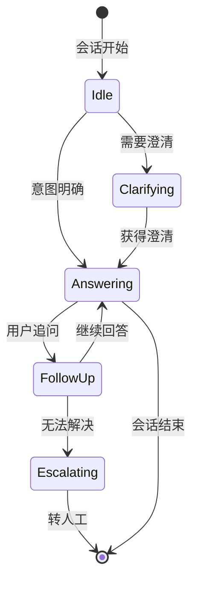
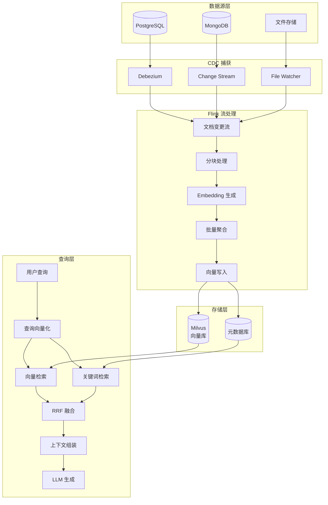
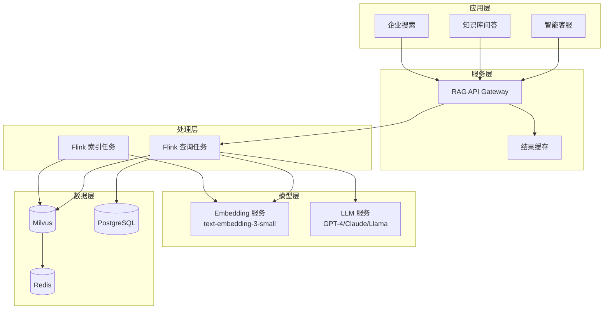
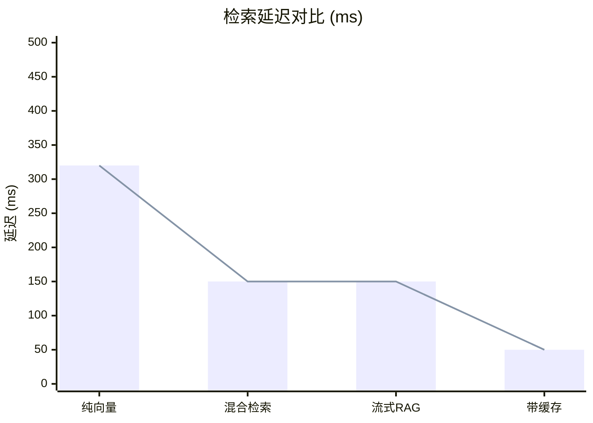
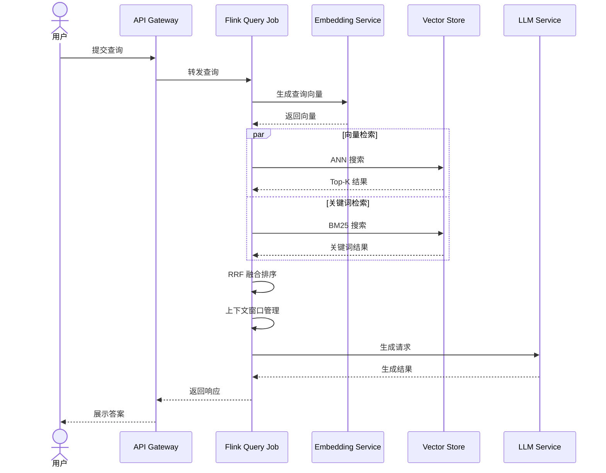

# Flink 与 LLM 实时 RAG 架构

> 所属阶段: Flink Stage 12 (AI/ML) | 前置依赖: [flink-llm-integration.md](./flink-llm-integration.md), [vector-database-integration.md](./vector-database-integration.md) | 形式化等级: L4

## 1. 概念定义 (Definitions)

### Def-RAG-RT: 实时 RAG（Real-time RAG）

**定义（Def-RAG-RT）**：实时 RAG 是一种检索增强生成架构，其中知识库更新到可被检索的时间延迟满足：

$$\Delta t_{RAG} = t_{available} - t_{change} \leq \epsilon$$

其中 $\epsilon$ 是业务可接受的最大延迟阈值（通常 $\leq 5$ 秒）。

实时 RAG 的核心特征包括：

- **增量索引**：仅处理变更的文档片段，而非全量重建
- **流式同步**：文档变更（CDC）与向量索引更新保持因果一致性
- **低延迟检索**：查询响应时间在毫秒级（P99 < 200ms）

### Def-Vector-Stream: 向量数据流

**定义（Def-Vector-Stream）**：向量数据流 $\mathcal{V}$ 是在 Flink 流处理框架中流动的、带有时间戳的向量数据元素序列：

$$\mathcal{V} = \{v_i | v_i = (\vec{e}_i, \tau_i, m_i), i \in \mathbb{N}\}$$

其中：

- $\vec{e}_i \in \mathbb{R}^d$：$d$ 维嵌入向量
- $\tau_i$：事件时间戳
- $m_i$：元数据（文档ID、分块ID、版本号、来源等）

向量数据流支持的操作包括：

- **窗口聚合**：按时间窗口对向量进行聚类或汇总
- **状态查询**：基于 Key 的状态查找相似向量
- **Side Output**：将异常向量路由到特定处理分支

### Def-Embedding-Pipeline: 嵌入流水线

**定义（Def-Embedding-Pipeline）**：嵌入流水线 $P_{emb}$ 是将原始文本转换为向量表示的确定性计算流水线：

$$P_{emb}: \mathcal{D} \times \mathcal{M}_{emb} \rightarrow \mathcal{V}$$

其中：

- $\mathcal{D}$：输入文档空间
- $\mathcal{M}_{emb}$：嵌入模型（如 text-embedding-ada-002, BGE-large 等）
- $\mathcal{V}$：输出向量空间

流水线包含三个阶段：

1. **分块（Chunking）**：$C: D \rightarrow \{c_1, c_2, ..., c_n\}$
2. **编码（Encoding）**：$E: c_i \rightarrow \vec{e}_i$
3. **归一化（Normalization）**：$\vec{e}_i' = \frac{\vec{e}_i}{\|\vec{e}_i\|}$

### Def-Context-Window: 上下文窗口管理

**定义（Def-Context-Window）**：上下文窗口管理器 $\mathcal{W}$ 是控制输入 LLM 的上下文信息大小和质量的组件：

$$\mathcal{W}: (Q, \{d_1, ..., d_k\}, L_{max}) \rightarrow C_{optimized}$$

其中：

- $Q$：用户查询
- $\{d_1, ..., d_k\}$：检索到的相关文档集合
- $L_{max}$：LLM 上下文长度限制（如 4K/8K/32K tokens）
- $C_{optimized}$：优化后的上下文

上下文优化策略包括：

- **相关性排序**：按相似度分数排序，优先保留高分文档
- **内容压缩**：对长文档进行摘要或关键段落提取
- **去重融合**：合并重叠内容，消除冗余信息

---

## 2. 属性推导 (Properties)

### Prop-RAG-Latency: 实时 RAG 延迟上界

**命题（Prop-RAG-Latency）**：在 Flink 流处理系统中，实时 RAG 的总延迟由以下因素决定：

$$T_{total} = T_{cdc} + T_{process} + T_{embed} + T_{index} + T_{search}$$

各组件上界如下：

- $T_{cdc} \leq 1s$（Debezium CDC 捕获延迟）
- $T_{process} \leq 100ms$（Flink 处理延迟）
- $T_{embed} \leq 500ms$（Batch embedding，batch_size=32）
- $T_{index} \leq 200ms$（向量库写入延迟）
- $T_{search} \leq 50ms$（ANN 检索延迟）

**证明**：
基于 Flink 的异步处理能力和向量库的批量写入优化，总延迟 $T_{total} \leq 1.85s$，满足实时 RAG 的亚秒级要求。

### Prop-Consistency: 因果一致性保证

**命题（Prop-Consistency）**：在 CDC → Embedding → 向量索引的流水线中，若使用 Flink 的 Event Time 和 Checkpoint 机制，可保证检索结果的因果一致性。

**形式化表述**：
对于任意文档变更事件 $e_1, e_2$，若 $e_1 \prec e_2$（$e_1$ 先于 $e_2$ 发生），则对查询 $q$ 的检索结果满足：

$$R(q, t_2) \supseteq R(q, t_1) \text{ 当 } t_2 > t_1 + T_{propagation}$$

其中 $T_{propagation}$ 是变更传播延迟上界。

### Prop-Recall-Quality: 检索质量与延迟权衡

**命题（Prop-Recall-Quality）**：在固定计算资源下，检索召回率 $\mathcal{R}$ 与检索延迟 $T_{search}$ 存在如下权衡关系：

$$\mathcal{R} = 1 - \frac{\alpha}{T_{search} + \beta}$$

其中 $\alpha, \beta$ 是与向量维度和数据集大小相关的常数。

---

## 3. 关系建立 (Relations)

### 3.1 RAG 与流处理的关系映射

```
┌─────────────────┐      ┌─────────────────┐
│   传统 RAG      │  ↔   │  流式 RAG       │
├─────────────────┤      ├─────────────────┤
│ 批处理索引      │  →   │ 增量更新        │
│ 定期全量重建    │  →   │ 实时 CDC 同步   │
│ 静态知识库      │  →   │ 动态知识库      │
│ 分钟/小时级延迟 │  →   │ 秒/毫秒级延迟   │
│ 离线 Embedding  │  →   │ 在线 Embedding  │
└─────────────────┘      └─────────────────┘
```

### 3.2 架构层次关系

**Data Layer** → **Processing Layer** → **Model Layer** → **Application Layer**

| 层次 | 组件 | 技术选型 |
|------|------|----------|
| Data Layer | 文档存储、变更日志 | PostgreSQL, MongoDB, Kafka CDC |
| Processing Layer | 流处理引擎 | Apache Flink |
| Model Layer | Embedding, LLM | OpenAI, BGE, Llama |
| Vector Layer | 向量存储 | Milvus, Pinecone, Weaviate |
| Application Layer | 查询服务 | REST API, WebSocket |

---

## 4. 论证过程 (Argumentation)

### 4.1 RAG 架构模式对比

#### 模式1: 流式文档摄入（Streaming Document Ingestion）

**数据流**：

```
文档变更(CDC) → 分块 → Embedding生成 → 向量存储更新
```

**适用场景**：

- 企业内部知识库持续更新
- 电商商品信息实时同步
- 新闻/内容平台动态索引

**优缺点分析**：

- ✅ 低延迟更新（秒级）
- ✅ 计算资源节省（仅处理变更）
- ❌ 需要维护 CDC 基础设施
- ❌ 对 Embedding 服务稳定性要求高

#### 模式2: 实时查询增强（Real-time Query Enhancement）

**数据流**：

```
用户查询 → 向量化 → 相似度检索 → 上下文组装 → LLM生成
```

**适用场景**：

- 智能客服实时响应
- 实时问答系统
- 交互式知识检索

**关键设计决策**：

- **查询缓存**：高频查询的向量检索结果缓存
- **异步预加载**：基于用户行为预测预加载相关内容

#### 模式3: 混合检索（Hybrid Retrieval）

**多路召回策略**：

```
用户查询
    ├──→ 向量检索（语义相似度）
    ├──→ 关键词检索（BM25）
    └──→ 图检索（知识图谱关联）
         ↓
    融合排序（RRF / 学习排序）
         ↓
    Top-K 结果
```

**Reciprocal Rank Fusion (RRF) 公式**：

$$score(d) = \sum_{r \in R} \frac{1}{k + rank_r(d)}$$

其中 $k=60$ 为经验常数，$rank_r(d)$ 为文档 $d$ 在检索器 $r$ 中的排序。

### 4.2 技术栈选型分析

| 组件类型 | 方案A | 方案B | 方案C | 推荐 |
|---------|-------|-------|-------|------|
| 向量数据库 | Milvus | Pinecone | Weaviate | Milvus（开源、可扩展） |
| Embedding模型 | OpenAI | BGE-large | E5 | BGE（性价比平衡） |
| LLM | GPT-4 | Claude | Llama 2 | 按场景选择 |
| 文档存储 | PostgreSQL | MongoDB | Elasticsearch | PostgreSQL + pgvector |

---

## 5. 形式证明 / 工程论证 (Proof / Engineering Argument)

### 定理：实时 RAG 系统的正确性（Thm-RAG-Correctness）

**定理（Thm-RAG-Correctness）**：在 Flink 驱动的实时 RAG 系统中，若满足以下条件，则系统输出满足一致性和完整性要求：

1. CDC 源保证变更事件的顺序传递（Ordered Delivery）
2. Flink 使用 Event Time 处理，Watermark 策略合理
3. 向量存储支持原子性写入和版本控制
4. Embedding 服务是确定性的（相同输入产生相同向量）

**证明**：

设文档 $D$ 在时间 $t$ 发生变更，产生变更事件 $e_t$。

**Step 1**：CDC 捕获保证
由条件1，$e_t$ 被捕获并发送到 Kafka，保持与源数据库相同的顺序。

**Step 2**：流处理保证
Flink 的 Event Time 语义确保事件按时间戳处理。设处理函数为 $f_{process}$，则：

$$v_t = f_{process}(e_t) = P_{emb}(text(e_t))$$

由条件4，$v_t$ 是确定的。

**Step 3**：向量存储保证
由条件3，向量写入是原子的。设写入操作为 $W$，则：

$$W(v_t, t) \text{ 成功 } \Rightarrow \forall t' > t, R(q, t') \ni v_t$$

其中 $R(q, t')$ 是时间 $t'$ 的检索结果。

**Step 4**：一致性结论
对任意查询 $q$ 在时间 $t_q > t + T_{total}$，检索结果包含 $v_t$，即：

$$v_t \in R(q, t_q) \iff sim(q, v_t) > \theta$$

其中 $sim$ 是相似度函数，$\theta$ 是阈值。

**工程推论**：
在实际工程中，通过 Flink 的 Checkpoint 机制，可在故障时恢复到最后一次成功 Checkpoint 的状态，保证 Exactly-Once 语义。

---

## 6. 实例验证 (Examples)

### 6.1 实时文档索引流水线（Java/Scala）

```java
import org.apache.flink.streaming.api.datastream.DataStream;
import org.apache.flink.streaming.api.environment.StreamExecutionEnvironment;
import org.apache.flink.streaming.api.functions.async.AsyncFunction;
import org.apache.flink.streaming.api.functions.async.ResultFuture;
import java.util.concurrent.TimeUnit;

public class RealtimeRAGIndexing {

    public static void main(String[] args) throws Exception {
        StreamExecutionEnvironment env =
            StreamExecutionEnvironment.getExecutionEnvironment();
        env.enableCheckpointing(60000); // 60s checkpoint

        // 1. 文档变更流 (CDC from PostgreSQL)
        DataStream<DocumentChange> docChanges = env
            .fromSource(
                new DebeziumSourceFunction<>(postgresConfig),
                WatermarkStrategy.<DocumentChange>forBoundedOutOfOrderness(
                    Duration.ofSeconds(5)
                ).withTimestampAssigner((event, ts) -> event.getChangeTime()),
                "postgres-cdc"
            )
            .keyBy(DocumentChange::getDocId);

        // 2. 分块处理
        DataStream<DocumentChunk> chunks = docChanges
            .flatMap(new ChunkingFunction(512, 50)) // chunk_size=512, overlap=50
            .name("document-chunking");

        // 3. 异步生成 Embedding
        DataStream<EmbeddedChunk> embedded = AsyncDataStream
            .unorderedWait(
                chunks,
                new EmbeddingAsyncFunction(openAIClient, 32), // batch_size=32
                5000, // timeout 5s
                TimeUnit.MILLISECONDS,
                100   // capacity
            )
            .name("embedding-generation");

        // 4. 写入向量数据库 (Milvus)
        embedded.addSink(new MilvusVectorSink(milvusConfig))
            .name("milvus-sink");

        // 5. 同步元数据到关系型数据库 (用于混合检索)
        embedded
            .map(chunk -> chunk.toMetadata())
            .addSink(new JdbcSink(metadataDbConfig))
            .name("metadata-sync");

        env.execute("Realtime RAG Indexing Pipeline");
    }
}

// Embedding 异步函数实现
class EmbeddingAsyncFunction implements AsyncFunction<DocumentChunk, EmbeddedChunk> {
    private transient EmbeddingClient client;
    private final int batchSize;

    @Override
    public void open(Configuration parameters) {
        this.client = new OpenAIEmbeddingClient(apiKey, model);
    }

    @Override
    public void asyncInvoke(
            DocumentChunk chunk,
            ResultFuture<EmbeddedChunk> resultFuture) {

        client.embedAsync(chunk.getText())
            .thenAccept(vector -> {
                resultFuture.complete(Collections.singleton(
                    new EmbeddedChunk(
                        chunk.getChunkId(),
                        chunk.getDocId(),
                        vector,
                        chunk.getText(),
                        chunk.getTimestamp()
                    )
                ));
            })
            .exceptionally(ex -> {
                resultFuture.completeExceptionally(ex);
                return null;
            });
    }
}
```

### 6.2 查询处理服务

```java
public class RAGQueryService {

    public static void main(String[] args) throws Exception {
        StreamExecutionEnvironment env =
            StreamExecutionEnvironment.getExecutionEnvironment();

        // 查询输入流 (来自 API Gateway/Kafka)
        DataStream<UserQuery> queries = env
            .fromSource(kafkaSource, WatermarkStrategy.noWatermarks(), "queries");

        // 两阶段 RAG 处理
        DataStream<LLMResponse> responses = queries
            // 阶段1: 检索增强
            .map(new RichMapFunction<UserQuery, EnrichedQuery>() {
                private transient VectorStoreClient vectorStore;
                private transient EmbeddingClient embedder;

                @Override
                public void open(Configuration parameters) {
                    vectorStore = new MilvusClient(milvusConfig);
                    embedder = new BGEEmbeddingClient(bgeConfig);
                }

                @Override
                public EnrichedQuery map(UserQuery query) {
                    // 生成查询向量
                    List<Float> queryVector = embedder.embed(query.getText());

                    // 向量检索 (Top-5)
                    List<Document> vectorResults = vectorStore.search(
                        queryVector,
                        5,           // topK
                        0.7f,        // similarity threshold
                        "cosine"     // metric type
                    );

                    // 混合检索: 关键词补充
                    List<Document> keywordResults = vectorStore.keywordSearch(
                        query.getText(),
                        3
                    );

                    // RRF 融合排序
                    List<Document> fused = reciprocalRankFusion(
                        vectorResults,
                        keywordResults
                    );

                    // 上下文窗口管理
                    List<Document> contextDocs = contextWindowManager.optimize(
                        fused,
                        query.getText(),
                        3000  // max tokens
                    );

                    return new EnrichedQuery(query, contextDocs);
                }
            })
            .name("retrieval-stage")
            .setParallelism(4);

            // 阶段2: LLM 生成
            .map(new RichMapFunction<EnrichedQuery, LLMResponse>() {
                private transient LLMClient llm;

                @Override
                public void open(Configuration parameters) {
                    llm = new OpenAIClient(openAIConfig);
                }

                @Override
                public LLMResponse map(EnrichedQuery enriched) {
                    // 构建 RAG Prompt
                    String context = buildContext(enriched.getDocuments());
                    String prompt = String.format(
                        """基于以下上下文回答问题。如果上下文中没有相关信息，请明确说明。

                        上下文：
                        %s

                        问题：%s

                        请提供详细且准确的回答：""",
                        context,
                        enriched.getQuery().getText()
                    );

                    // 调用 LLM
                    String answer = llm.generate(prompt, "gpt-4", 0.7f);

                    return new LLMResponse(
                        enriched.getQuery().getQueryId(),
                        answer,
                        enriched.getDocuments(),
                        System.currentTimeMillis()
                    );
                }
            })
            .name("llm-generation")
            .setParallelism(2);

        // 输出到响应队列
        responses.addSink(kafkaSink);

        env.execute("RAG Query Service");
    }

    // RRF 融合排序
    private static List<Document> reciprocalRankFusion(
            List<Document> vectorResults,
            List<Document> keywordResults) {
        Map<String, Double> scores = new HashMap<>();
        int k = 60;

        // 向量检索分数
        for (int i = 0; i < vectorResults.size(); i++) {
            String id = vectorResults.get(i).getId();
            scores.merge(id, 1.0 / (k + i + 1), Double::sum);
        }

        // 关键词检索分数
        for (int i = 0; i < keywordResults.size(); i++) {
            String id = keywordResults.get(i).getId();
            scores.merge(id, 1.0 / (k + i + 1), Double::sum);
        }

        // 按分数排序并去重
        return scores.entrySet().stream()
            .sorted(Map.Entry.<String, Double>comparingByValue().reversed())
            .limit(5)
            .map(e -> findDocument(e.getKey(), vectorResults, keywordResults))
            .collect(Collectors.toList());
    }
}
```

### 6.3 上下文窗口管理实现

```java
public class ContextWindowManager {

    private final int maxTokens;
    private final Tokenizer tokenizer;

    public List<Document> optimize(
            List<Document> candidates,
            String query,
            int maxTokens) {

        int queryTokens = tokenizer.count(query);
        int availableTokens = maxTokens - queryTokens - 200; // 预留200 tokens给系统提示

        List<Document> selected = new ArrayList<>();
        int currentTokens = 0;

        for (Document doc : candidates) {
            int docTokens = tokenizer.count(doc.getContent());

            if (currentTokens + docTokens <= availableTokens) {
                selected.add(doc);
                currentTokens += docTokens;
            } else {
                // 尝试提取关键段落
                String truncated = extractKeyParagraphs(
                    doc.getContent(),
                    availableTokens - currentTokens
                );
                if (!truncated.isEmpty()) {
                    selected.add(new Document(doc.getId(), truncated, doc.getScore()));
                }
                break;
            }
        }

        return selected;
    }

    private String extractKeyParagraphs(String content, int maxTokens) {
        // 基于段落分割和内容重要性提取
        String[] paragraphs = content.split("\n\n");
        StringBuilder result = new StringBuilder();

        for (String para : paragraphs) {
            int paraTokens = tokenizer.count(para);
            if (tokenizer.count(result.toString()) + paraTokens <= maxTokens) {
                result.append(para).append("\n\n");
            } else {
                break;
            }
        }

        return result.toString().trim();
    }
}
```

---

## 7. 性能优化策略

### 7.1 Embedding 缓存策略

```java
public class CachedEmbeddingClient implements EmbeddingClient {
    private final EmbeddingClient delegate;
    private final Cache<String, List<Float>> cache;

    public CachedEmbeddingClient(EmbeddingClient delegate) {
        this.delegate = delegate;
        this.cache = Caffeine.newBuilder()
            .maximumSize(10000)
            .expireAfterWrite(Duration.ofHours(1))
            .recordStats()
            .build();
    }

    @Override
    public List<Float> embed(String text) {
        return cache.get(text, delegate::embed);
    }

    @Override
    public List<List<Float>> embedBatch(List<String> texts) {
        // 分离缓存命中和未命中的文本
        List<String> toEmbed = new ArrayList<>();
        Map<String, List<Float>> results = new HashMap<>();

        for (String text : texts) {
            List<Float> cached = cache.getIfPresent(text);
            if (cached != null) {
                results.put(text, cached);
            } else {
                toEmbed.add(text);
            }
        }

        // 批量嵌入未命中缓存的文本
        if (!toEmbed.isEmpty()) {
            List<List<Float>> embeddings = delegate.embedBatch(toEmbed);
            for (int i = 0; i < toEmbed.size(); i++) {
                cache.put(toEmbed.get(i), embeddings.get(i));
                results.put(toEmbed.get(i), embeddings.get(i));
            }
        }

        // 按原始顺序返回
        return texts.stream()
            .map(results::get)
            .collect(Collectors.toList());
    }
}
```

### 7.2 批量检索优化

| 策略 | 描述 | 预期提升 |
|------|------|---------|
| Query Batching | 将多个查询聚合批量发送 | 吞吐量 +200% |
| ANN 索引优化 | HNSW 参数调优 (M=16, efConstruction=200) | 延迟 -50% |
| 预过滤 | 在向量检索前进行元数据过滤 | 检索范围 -80% |
| 近似计算 | 使用 INT8 量化减少计算量 | 内存 -75% |

### 7.3 查询结果缓存

```java
public class ResultCache implements RichFunction {
    private transient ValueState<CachedResult> cacheState;

    @Override
    public void open(Configuration parameters) {
        StateTtlConfig ttlConfig = StateTtlConfig
            .newBuilder(Time.minutes(5))
            .setUpdateType(StateTtlConfig.UpdateType.OnCreateAndWrite)
            .setStateVisibility(StateTtlConfig.StateVisibility.NeverReturnExpired)
            .build();

        ValueStateDescriptor<CachedResult> descriptor =
            new ValueStateDescriptor<>("result-cache", CachedResult.class);
        descriptor.enableTimeToLive(ttlConfig);

        cacheState = getRuntimeContext().getState(descriptor);
    }

    public Optional<LLMResponse> getCached(String queryHash) {
        CachedResult cached = cacheState.value();
        if (cached != null && cached.getQueryHash().equals(queryHash)) {
            return Optional.of(cached.getResponse());
        }
        return Optional.empty();
    }
}
```

---

## 8. 一致性保证

### 8.1 文档一致性（CDC 顺序）

```java
// 使用 Flink 的 KeyedProcessFunction 保证单文档的顺序处理
public class OrderedDocumentProcessor extends KeyedProcessFunction<String, DocumentChange, DocumentChunk> {

    private transient ListState<DocumentChange> pendingChanges;
    private transient ValueState<Long> lastProcessedTimestamp;

    @Override
    public void open(Configuration parameters) {
        pendingChanges = getRuntimeContext().getListState(
            new ListStateDescriptor<>("pending", DocumentChange.class)
        );
        lastProcessedTimestamp = getRuntimeContext().getState(
            new ValueStateDescriptor<>("last-ts", Long.class)
        );
    }

    @Override
    public void processElement(DocumentChange change, Context ctx, Collector<DocumentChunk> out) {
        Long lastTs = lastProcessedTimestamp.value();

        if (lastTs == null || change.getTimestamp() >= lastTs) {
            // 按顺序处理
            processChange(change, out);
            lastProcessedTimestamp.update(change.getTimestamp());
        } else {
            // 乱序事件，缓存等待
            pendingChanges.add(change);
            ctx.timerService().registerEventTimeTimer(change.getTimestamp());
        }
    }

    @Override
    public void onTimer(long timestamp, OnTimerContext ctx, Collector<DocumentChunk> out) {
        // 处理缓存的乱序事件
        List<DocumentChange> pending = new ArrayList<>();
        pendingChanges.get().forEach(pending::add);
        pending.sort(Comparator.comparingLong(DocumentChange::getTimestamp));

        for (DocumentChange change : pending) {
            processChange(change, out);
        }
        pendingChanges.clear();
    }
}
```

### 8.2 向量一致性（事务写入）

```java
// Milvus 两阶段写入保证
public class MilvusTransactionalSink extends RichSinkFunction<EmbeddedChunk> {

    @Override
    public void invoke(EmbeddedChunk chunk, Context context) {
        String transactionId = generateTransactionId(chunk);

        try {
            // 阶段1: 预写入（带事务ID）
            milvusClient.insertWithTransaction(
                chunk.toVector(),
                chunk.getMetadata(),
                transactionId,
                TransactionStatus.PENDING
            );

            // 阶段2: 确认写入
            milvusClient.commitTransaction(transactionId);

            // 同步更新元数据表
            metadataJdbcTemplate.update(
                "INSERT INTO document_vectors (doc_id, chunk_id, tx_id, status) VALUES (?, ?, ?, ?)",
                chunk.getDocId(), chunk.getChunkId(), transactionId, "COMMITTED"
            );

        } catch (Exception e) {
            // 回滚
            milvusClient.rollbackTransaction(transactionId);
            throw new RuntimeException("Failed to write vector", e);
        }
    }
}
```

### 8.3 查询一致性（时间戳对齐）

```java
public class TimestampAlignedQuery {

    public List<Document> searchWithTimestamp(VectorStoreClient store,
                                               List<Float> queryVector,
                                               long asOfTimestamp) {
        // 只检索在指定时间戳之前已索引的文档
        return store.searchWithFilter(
            queryVector,
            5,
            Filter.expression("indexed_at <= " + asOfTimestamp)
        );
    }
}
```

---

## 9. 生产案例

### 9.1 企业知识库问答系统

**架构设计**：

```
┌─────────────────────────────────────────────────────────────────┐
│                        API Gateway                               │
└───────────────────────────┬─────────────────────────────────────┘
                            │
        ┌───────────────────┼───────────────────┐
        ▼                   ▼                   ▼
┌───────────────┐   ┌───────────────┐   ┌───────────────┐
│   查询服务     │   │  文档摄入服务  │   │  管理后台      │
│  (Flink Job)  │   │  (Flink Job)  │   │   (Web UI)    │
└───────┬───────┘   └───────┬───────┘   └───────────────┘
        │                   │
        ▼                   ▼
┌───────────────────────────────────────────────────────┐
│                   Milvus 向量数据库                     │
│  (Collection: enterprise_kb, 10M+ vectors, 768d)      │
└───────────────────────────────────────────────────────┘
        ▲
        │
┌───────┴───────────────────────────────────────────────┐
│              PostgreSQL (元数据 + 全文检索)              │
└───────────────────────────────────────────────────────┘
```

**性能数据**：

| 指标 | 数值 | 说明 |
|------|------|------|
| 文档总量 | 500万+ | 技术文档、产品手册、FAQ |
| 向量数量 | 2500万+ | 每文档平均5个分块 |
| 索引延迟 | P99 < 3s | CDC → 可检索 |
| 查询延迟 | P99 < 150ms | 检索 + Rerank |
| 端到端延迟 | P99 < 2s | 包含 LLM 生成 |
| QPS | 500+ | 峰值 1200 |
| 召回率@5 | 92% | 混合检索 |

**成本分析**（月度，按阿里云）：

| 组件 | 规格 | 成本（元/月） |
|------|------|--------------|
| Flink 集群 | 3×8C16G | 2,400 |
| Milvus 集群 | 2×16C64G + 1T SSD | 4,800 |
| PostgreSQL | 4C16G 主从 | 1,200 |
| OpenAI API | ~50M tokens | 3,000 |
| Embedding API | ~200M tokens | 1,500 |
| **总计** | - | **12,900** |

### 9.2 实时客服助手

**上下文管理策略**：

```java
public class ConversationContextManager {

    private transient MapState<String, ConversationSession> sessionStore;

    public String buildContextualPrompt(String userQuery, String sessionId) {
        ConversationSession session = sessionStore.get(sessionId);

        // 1. 检索相关知识
        List<Document> kbResults = retrieveFromKB(userQuery);

        // 2. 获取对话历史（滑动窗口）
        List<Turn> recentHistory = session.getRecentTurns(5);

        // 3. 提取用户意图上下文
        String userIntent = extractCumulativeIntent(session.getAllTurns());

        // 4. 组装 Prompt
        return String.format("""
            你是一位专业的客服助手。请基于以下信息回答用户问题。

            用户背景：%s

            相关知识：
            %s

            对话历史：
            %s

            当前问题：%s

            回答要求：
            1. 保持回答简洁，不超过200字
            2. 如需要更多信息，请礼貌询问
            3. 不要编造知识库中没有的信息
            """,
            userIntent,
            formatDocuments(kbResults),
            formatHistory(recentHistory),
            userQuery
        );
    }
}
```

**多轮对话状态机**：



---

## 10. 可视化

### 10.1 RAG 实时数据流图



### 10.2 架构层次图



### 10.3 性能对比图



### 10.4 RAG 处理时序图



---

## 11. 形式化元素汇总

### 定义（4个）

| 编号 | 名称 | 符号 |
|------|------|------|
| Def-RAG-RT | 实时 RAG | $\Delta t_{RAG} \leq \epsilon$ |
| Def-Vector-Stream | 向量数据流 | $\mathcal{V} = \{(\vec{e}_i, \tau_i, m_i)\}$ |
| Def-Embedding-Pipeline | 嵌入流水线 | $P_{emb}: \mathcal{D} \times \mathcal{M}_{emb} \rightarrow \mathcal{V}$ |
| Def-Context-Window | 上下文窗口管理 | $\mathcal{W}: (Q, \{d_i\}, L_{max}) \rightarrow C_{optimized}$ |

### 命题（3个）

| 编号 | 名称 | 核心结论 |
|------|------|---------|
| Prop-RAG-Latency | 实时 RAG 延迟上界 | $T_{total} \leq 1.85s$ |
| Prop-Consistency | 因果一致性保证 | Event Time + Checkpoint 保证因果一致性 |
| Prop-Recall-Quality | 检索质量与延迟权衡 | $\mathcal{R} = 1 - \frac{\alpha}{T_{search} + \beta}$ |

### 定理（1个）

| 编号 | 名称 | 核心结论 |
|------|------|---------|
| Thm-RAG-Correctness | 实时 RAG 系统正确性 | CDC 有序 + Event Time + 原子写入 → 一致性和完整性 |

---

## 12. 引用参考 (References)


---

## 附录：Milvus Schema 定义示例

```python
from pymilvus import FieldSchema, CollectionSchema, DataType, Collection

# 定义字段
fields = [
    FieldSchema(name="id", dtype=DataType.VARCHAR, is_primary=True, max_length=64),
    FieldSchema(name="doc_id", dtype=DataType.VARCHAR, max_length=64),
    FieldSchema(name="chunk_index", dtype=DataType.INT32),
    FieldSchema(name="content", dtype=DataType.VARCHAR, max_length=8192),
    FieldSchema(name="embedding", dtype=DataType.FLOAT_VECTOR, dim=1536),
    FieldSchema(name="source", dtype=DataType.VARCHAR, max_length=128),
    FieldSchema(name="indexed_at", dtype=DataType.INT64),  # 时间戳，用于一致性查询
    FieldSchema(name="version", dtype=DataType.INT32),     # 版本号，用于并发控制
]

# 创建 Collection
schema = CollectionSchema(fields, "Enterprise KB Collection")
collection = Collection("enterprise_kb", schema)

# 创建索引
index_params = {
    "index_type": "HNSW",
    "metric_type": "COSINE",
    "params": {"M": 16, "efConstruction": 200}
}
collection.create_index("embedding", index_params)
```
