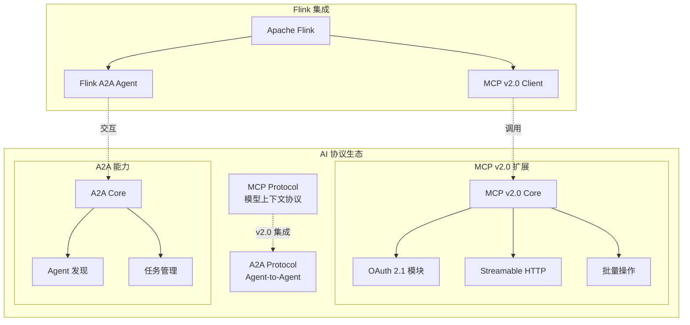
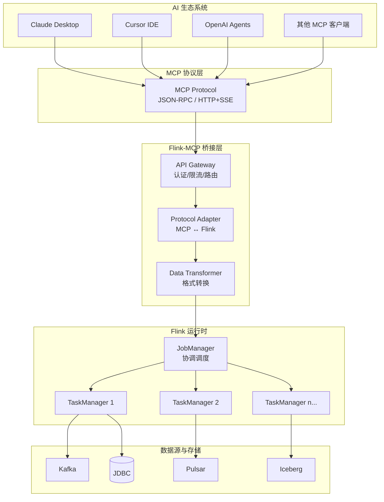
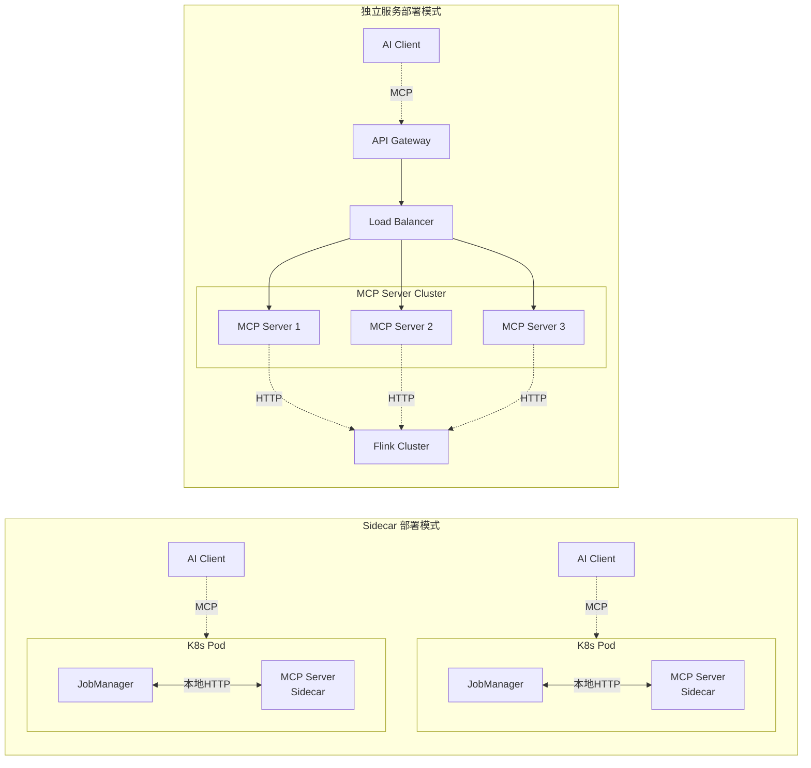
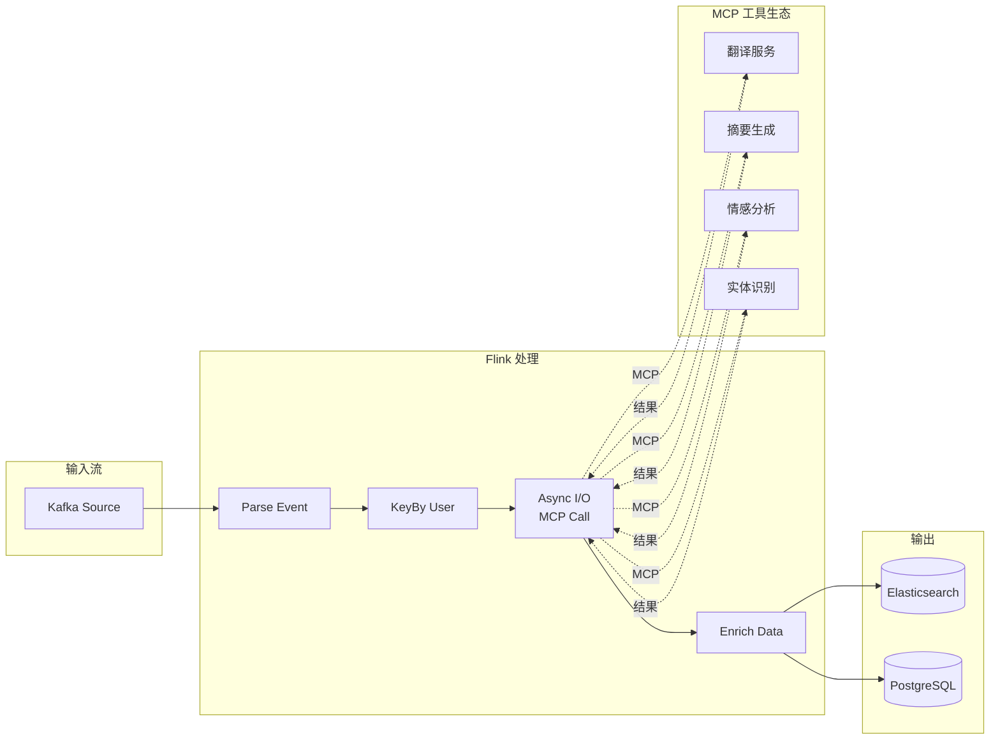
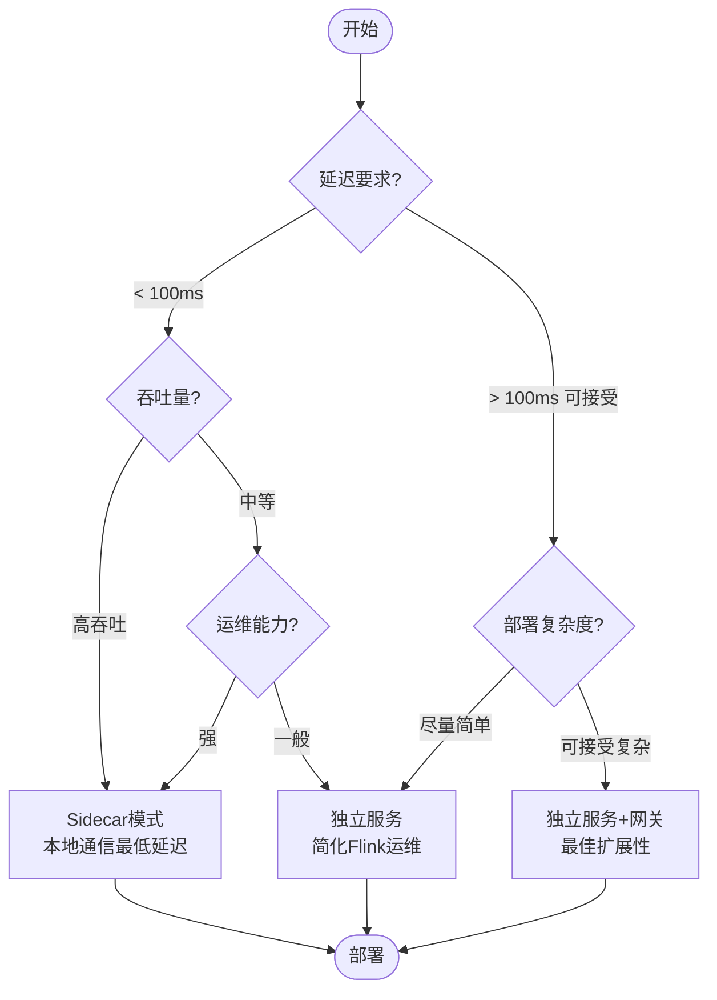

# Flink 与 MCP 协议集成：AI 驱动的实时流计算

> **所属阶段**: Flink AI/ML 扩展 | **前置依赖**: [Flink LLM 集成](./flink-llm-integration.md), [Flink 异步 I/O](../02-core/async-execution-model.md) | **形式化等级**: L3 (工程实现)

---

## 1. 概念定义 (Definitions)

### Def-F-12-46: Model Context Protocol (MCP)

**定义**: MCP 是由 Anthropic 提出的开放协议，用于标准化 AI 模型与外部数据源、工具之间的交互，形式化定义为四元组：

$$
\mathcal{MCP} = \langle S_{server}, C_{client}, T_{tools}, R_{resources} \rangle
$$

其中：

- $S_{server}$: MCP 服务器，暴露工具和资源的能力端点
- $C_{client}$: MCP 客户端，发起工具调用和资源访问请求
- $T_{tools}$: 工具集合，每个工具是带 Schema 的可调用函数 $t: \text{InputSchema} \rightarrow \text{Output}$
- $R_{resources}$: 资源集合，每个资源是可读的 URI 地址able 数据 $r: \text{URI} \rightarrow \text{Data}$

**直观解释**: MCP 类似于 AI 世界的 USB-C 接口，提供统一的协议让 AI 应用能够连接各种数据源和工具，而无需为每个集成编写定制化代码。

### Def-F-12-47: MCP 服务器 (MCP Server)

**定义**: MCP 服务器是实现 MCP 协议的服务端组件，形式化为：

$$
\text{Server} = \langle H_{handlers}, M_{metadata}, P_{protocol} \rangle
$$

其中：

- $H_{handlers}$: 处理器映射表，$\{ \text{tool_name} \rightarrow \text{handler_function} \}$
- $M_{metadata}$: 服务器元信息，包含名称、版本、能力声明
- $P_{protocol}$: 传输协议实现（stdio | HTTP with SSE）

**能力声明 (Capabilities)**:

```json
{
  "tools": { "listChanged": true },
  "resources": { "subscribe": true, "listChanged": true },
  "prompts": { "listChanged": true }
}
```

### Def-F-12-48: MCP 工具 (MCP Tool)

**定义**: MCP 工具是服务器暴露的可调用函数，形式化为六元组：

$$
\tau = \langle n_{name}, d_{desc}, S_{in}, S_{out}, h_{handler}, \phi_{schema} \rangle
$$

其中：

- $n_{name}$: 工具唯一标识符（snake_case 命名）
- $d_{desc}$: 工具功能描述（供 AI 理解用途）
- $S_{in}$: 输入参数 JSON Schema
- $S_{out}$: 输出结果结构定义
- $h_{handler}$: 实际执行函数 $h: \text{JSON} \rightarrow \text{CallToolResult}$
- $\phi_{schema}$: 额外的结构化约束

**工具调用结果**:

```
CallToolResult = {
  content: ContentItem[],
  isError?: boolean,
  _meta?: object
}

ContentItem = TextContent | ImageContent | EmbeddedResource
```

### Def-F-12-49: MCP 资源 (MCP Resource)

**定义**: MCP 资源是可通过 URI 访问的数据实体，形式化为：

$$
\rho = \langle u_{uri}, n_{name}, m_{mime}, g_{getter}, \delta_{subscription} \rangle
$$

其中：

- $u_{uri}$: 资源统一资源标识符，格式为 `protocol://host/path`
- $n_{name}$: 人类可读的资源名称
- $m_{mime}$: MIME 类型标识（如 `application/json`, `text/plain`）
- $g_{getter}$: 资源获取函数 $g: \text{URI} \rightarrow \text{ResourceContent}$
- $\delta_{subscription}$: 变更订阅能力标志

**Flink 资源 URI 规范**:

| 资源类型 | URI 模式 | 示例 |
|---------|---------|------|
| 数据流 | `resource://flink/stream/{stream_id}` | `resource://flink/stream/user_events` |
| 动态表 | `resource://flink/table/{table_name}` | `resource://flink/table/orders` |
| 指标 | `resource://flink/metrics/{metric_name}` | `resource://flink/metrics/throughput` |
| 检查点 | `resource://flink/checkpoint/{job_id}` | `resource://flink/checkpoint/job_123` |

### Def-F-12-50: Flink-MCP 桥接层 (Flink-MCP Bridge)

**定义**: Flink-MCP 桥接层是连接 Flink 流计算能力与 MCP 协议的适配组件，形式化为：

$$
\mathcal{B}_{Flink-MCP} = \langle A_{adapter}, G_{gateway}, T_{transform}, Q_{query} \rangle
$$

其中：

- $A_{adapter}$: 协议适配器，将 MCP 调用映射为 Flink API 操作
- $G_{gateway}$: 网关层，处理认证、限流、路由
- $T_{transform}$: 数据转换器，MCP 格式 $\leftrightarrow$ Flink 内部格式
- $Q_{query}$: 查询执行引擎，处理 SQL/Table API 请求

**双向能力**:

$$
\mathcal{B}_{Flink-MCP}: \begin{cases}
\text{Server 模式}: \text{MCP Request} \xrightarrow{A_{adapter}} \text{Flink Job} \\
\text{Client 模式}: \text{Flink Job} \xrightarrow{A_{adapter}} \text{MCP Tool Call}
\end{cases}
$$

### Def-F-12-51: 工具调用语义 (Tool Call Semantics)

**定义**: MCP 工具调用的形式化语义定义为状态转换系统：

$$
\langle \Sigma, \Lambda, \rightarrow, \sigma_0, F \rangle
$$

其中：

- $\Sigma$: 调用状态集合 $\{ \text{IDLE}, \text{INVOKED}, \text{PROCESSING}, \text{COMPLETED}, \text{ERROR} \}$
- $\Lambda$: 标签集合（工具名称、参数）
- $\rightarrow \subseteq \Sigma \times \Lambda \times \Sigma$: 状态转移关系
- $\sigma_0 = \text{IDLE}$: 初始状态
- $F = \{ \text{COMPLETED}, \text{ERROR} \}$: 终止状态集合

**状态转移规则**:

$$
\frac{\tau \in T_{tools} \quad \text{validate}(args, S_{in}^{\tau}) = \top}{\text{IDLE} \xrightarrow{\text{invoke}(\tau, args)} \text{INVOKED}}
$$

$$
\frac{h_{\tau}(args) \rightarrow result}{\text{PROCESSING} \xrightarrow{\text{execute}} \text{COMPLETED}}
$$

### Def-F-12-52: MCP v2.0 协议 (MCP Protocol v2.0)

**定义**: MCP v2.0 是 2025 年 3 月发布的协议升级版本，引入 OAuth 2.1 支持、Streamable HTTP Transport 和批量操作优化。

$$
\text{MCP-v2.0} = \langle \text{MCP-v1.0}, \text{OAuth-2.1}, \text{Streamable-HTTP}, \text{Batch-Ops} \rangle
$$

**v2.0 核心新特性**:

| 特性 | v1.0 | v2.0 | 影响 |
|------|------|------|------|
| **认证机制** | 自定义 Token | OAuth 2.1 + PKCE | 安全性提升 |
| **传输协议** | stdio / HTTP+SSE | Streamable HTTP | 性能提升 |
| **批量操作** | 单操作 | 原子批量 | 吞吐量提升 |
| **会话管理** | 无状态 | 可选有状态 | 灵活性提升 |

### Def-F-12-53: OAuth 2.1 安全配置 (OAuth 2.1 Security)

**定义**: MCP v2.0 引入的 OAuth 2.1 认证框架，支持 PKCE (Proof Key for Code Exchange) 和设备授权流程。

```yaml
# MCP v2.0 OAuth 2.1 配置示例
oauth2_1:
  grant_types:
    - authorization_code
    - client_credentials
    - device_code
  pkce:
    enabled: true
    method: S256
  scopes:
    - mcp:tools:read
    - mcp:tools:invoke
    - mcp:resources:read
    - mcp:resources:subscribe
  token_format: jwt
  token_lifetime: 3600  # seconds
```

**Flink MCP Server OAuth 2.1 配置**:

```java
// OAuth 2.1 安全配置
public class FlinkMcpOAuthConfig {
    private String issuerUri = "https://auth.flink-mcp.io";
    private String clientId = "flink-mcp-server";
    private Set<String> allowedScopes = Set.of(
        "mcp:tools:read",
        "mcp:tools:invoke", 
        "mcp:resources:read"
    );
    
    // PKCE 验证
    public boolean verifyPKCE(String codeChallenge, String codeVerifier) {
        String computed = Base64.getUrlEncoder().withoutPadding()
            .encodeToString(sha256(codeVerifier));
        return computed.equals(codeChallenge);
    }
}
```

### Def-F-12-54: Streamable HTTP Transport

**定义**: MCP v2.0 引入的流式 HTTP 传输协议，替代原有的 HTTP+SSE 模式，支持双向流式通信。

**协议对比**:

| 传输模式 | 连接数 | 双向流 | 延迟 | 适用场景 |
|---------|--------|--------|------|---------|
| stdio | 1 | 有限 | 最低 | 本地进程 |
| HTTP+SSE (v1.0) | 2 | 单向 | 中 | Web 服务 |
| **Streamable HTTP (v2.0)** | 1 | 双向 | 低 | 实时应用 |

**Streamable HTTP 特点**:
- 单一 HTTP 连接支持全双工通信
- 基于 HTTP/2 Server Push 或 WebSocket
- 自动流控和背压处理
- 更好的防火墙穿透能力

---

## 2. 属性推导 (Properties)

### Lemma-F-12-18: MCP 协议的无状态性

**陈述**: MCP 协议本身是无状态的，每次工具调用是独立的请求-响应周期：

$$
\forall c_1, c_2 \in \text{Call}: \text{result}(c_1) \perp \text{result}(c_2) \mid \text{args}(c_1) = \text{args}(c_2)
$$

**例外**: 当服务器声明 `stateful` 能力并通过资源订阅维护会话状态时，调用间存在隐式依赖。

**Flink 推论**: Flink-MCP 服务器应设计为幂等，以兼容 Flink 的 exactly-once 语义。

### Lemma-F-12-19: 工具调用的延迟边界

**陈述**: 设 $t_{serialize}$ 为序列化延迟，$t_{network}$ 为网络传输延迟，$t_{exec}$ 为 Flink 执行延迟，$t_{deserialize}$ 为反序列化延迟，则 MCP 工具调用总延迟满足：

$$
L_{total} = t_{serialize} + t_{network} + t_{exec} + t_{deserialize}
$$

对于 stdio 传输：

$$
L_{stdio} \approx t_{serialize} + t_{pipe} + t_{exec} + t_{deserialize} \quad (t_{pipe} \ll t_{network})
$$

**工程建议**: 实时场景优先使用 stdio 传输以降低 $t_{network}$。

### Lemma-F-12-20: 资源订阅的一致性保证

**陈述**: 设资源 $\rho$ 的更新序列为 $\{ u_1, u_2, ..., u_n \}$，客户端订阅接收序列为 $\{ r_1, r_2, ..., r_m \}$，则 MCP 协议保证：

$$
\forall i: r_i = u_{f(i)} \land (i < j \rightarrow f(i) \leq f(j))
$$

即订阅通知保持因果序，但不保证全序（允许通知丢失或合并）。

### Prop-F-12-21: Flink-MCP 集成的容错性

**陈述**: 在 Flink 检查点机制下，MCP 客户端调用的 exactly-once 语义要求：

$$
\forall \text{checkpoint } c: \text{at-least-once}(\text{MCP call}) \land \text{idempotent}(\text{tool}) \Rightarrow \text{exactly-once}(\text{effect})
$$

**证明概要**: Flink 的检查点提供至少一次执行保证。若工具本身是幂等的，则重复调用不会产生副作用差异，从而等效于恰好一次语义。

---

## 3. 关系建立 (Relations)

### 3.1 MCP 与 Flink 架构的映射关系

| MCP 概念 | Flink 对应组件 | 交互模式 |
|---------|---------------|---------|
| MCP Server | Flink JobManager (Sidecar) / 独立服务 | 部署单元 |
| MCP Client | Async I/O Function / RichFunction | 调用发起方 |
| Tool Handler | TableFunction / AsyncFunction | 执行逻辑 |
| Resource | Dynamic Table / System View | 数据暴露 |
| Prompt Template | SQL UDF / Table API Expression | 模板渲染 |

### 3.2 MCP 协议与类似协议的对比

| 特性 | MCP | Function Calling | REST API | gRPC |
|-----|-----|------------------|----------|------|
| 标准化 Schema | ✓ JSON Schema | ✓ 各厂商定义 | ✗ 自定义 | ✓ Protocol Buffers |
| 资源抽象 | ✓ URI-based | ✗ 无 | ✗ 端点-based | ✗ 无 |
| 双向流 | ✓ HTTP SSE | ✗ 单向 | ✗ 单向 | ✓ 双向流 |
| 会话状态 | △ 可选 | ✗ 无 | △ Cookie | ✗ 无 |
| 发现机制 | ✓ 内省 API | ✗ 文档 | ✗ OpenAPI | ✓ 反射 |
| AI 原生设计 | ✓ 是 | △ 部分 | ✗ 否 | ✗ 否 |

### 3.3 Flink 作为 MCP 服务器的数据流

```
┌─────────────────────────────────────────────────────────────┐
│                      AI Client (Claude)                      │
│  ┌──────────────┐      ┌──────────────┐      ┌───────────┐  │
│  │ 自然语言查询  │ ──▶ │ 工具选择决策  │ ──▶ │ MCP 调用  │  │
│  └──────────────┘      └──────────────┘      └─────┬─────┘  │
└────────────────────────────────────────────────────┼────────┘
                                                     │ MCP Protocol
                                                     ▼
┌─────────────────────────────────────────────────────────────┐
│                   Flink MCP Server                           │
│  ┌───────────────────────────────────────────────────────┐  │
│  │              Protocol Adapter Layer                    │  │
│  │  (JSON-RPC / stdio / HTTP+SSE)                        │  │
│  └────────────────────────┬──────────────────────────────┘  │
│                           ▼                                  │
│  ┌───────────────────────────────────────────────────────┐  │
│  │              Tool Dispatcher                          │  │
│  │  ┌────────────┐  ┌────────────┐  ┌────────────────┐  │  │
│  │  │ SQL Query  │  │  Anomaly   │  │  Stream Stats  │  │  │
│  │  │  Handler   │  │ Detection  │  │    Handler     │  │  │
│  │  └─────┬──────┘  └─────┬──────┘  └────────┬───────┘  │  │
│  └────────┼───────────────┼──────────────────┼──────────┘  │
│           ▼               ▼                  ▼             │
│  ┌───────────────────────────────────────────────────────┐  │
│  │              Flink Runtime                            │  │
│  │  ┌──────────┐  ┌──────────┐  ┌────────────────────┐  │  │
│  │  │ TableEnv │  │ DataStream│  │ Checkpointing    │  │  │
│  │  └─────┬────┘  └─────┬────┘  └────────────────────┘  │  │
│  └────────┼─────────────┼────────────────────────────────┘  │
└───────────┼─────────────┼──────────────────────────────────┘
            ▼             ▼
    ┌───────────────┐  ┌───────────────┐
    │  Source (Kafka│  │  Sink (HBase  │
    │   /Pulsar)    │  │  /ES/JDBC)    │
    └───────────────┘  └───────────────┘
```

---

## 4. 论证过程 (Argumentation)

### 4.1 为何选择 MCP 作为集成协议

**论证1: AI 原生设计优势**

MCP 区别于传统 API 协议的核心在于其 AI 优先的设计哲学：

1. **Schema 内省**: AI 模型可以通过 `tools/list` 端点动态发现可用工具，无需硬编码
2. **自然语言描述**: 每个工具包含 `description` 字段，AI 可基于语义理解选择工具
3. **上下文保持**: 资源订阅机制支持流式数据推送，适合实时场景

**论证2: 与 Flink 流计算的契合度**

| Flink 特性 | MCP 支持 | 契合点 |
|-----------|---------|-------|
| 实时 SQL 查询 | Tool 调用 | 自然语言 → SQL 转换 |
| 动态表 | Resource URI | 表即资源，支持订阅 |
| 异步 I/O | Async tool handler | 非阻塞执行 |
| 事件时间处理 | 时间戳传播 | 资源更新携带时间元数据 |

**论证3: 生态兼容性**

MCP 获得主流 AI 平台和工具支持：

- **Claude Desktop**: 原生 MCP 客户端
- **Cursor**: IDE 内 MCP 集成
- **Continue**: 开源 AI 编码助手
- **OpenAI Agents SDK**: MCP 适配器

### 4.2 部署模式对比分析

**模式A: Sidecar 部署**

```
┌─────────────────────────────────────────┐
│           Kubernetes Pod               │
│  ┌─────────────┐    ┌─────────────┐    │
│  │   Flink     │◀──▶│ MCP Server  │    │
│  │  JobManager │    │  (Sidecar)  │    │
│  └─────────────┘    └──────┬──────┘    │
│                            │           │
└────────────────────────────┼───────────┘
                             │
                        ┌────┴────┐
                        │ AI Client│
                        └─────────┘
```

- **优点**: 低延迟（本地通信）、部署原子性、资源隔离
- **缺点**: 扩容耦合、升级需重启 JobManager

**模式B: 独立服务部署**

```
┌─────────────┐     ┌─────────────────┐     ┌─────────────┐
│  AI Client  │◀───▶│  MCP Gateway    │◀───▶│ Flink Cluster│
│  (Claude)   │ MCP │  (独立服务)      │HTTP │  (JobManager)│
└─────────────┘     └─────────────────┘     └─────────────┘
```

- **优点**: 独立扩缩容、多集群支持、独立升级
- **缺点**: 网络延迟、额外的运维复杂度

**推荐策略**: 开发测试用 Sidecar，生产环境用独立服务。

---

## 5. 形式证明 / 工程论证 (Proof / Engineering Argument)

### 5.1 MCP 工具调用的类型安全性论证

**定理**: 若 MCP 工具定义满足 JSON Schema 规范，且 Flink-MCP 桥接层实现输入验证，则工具调用满足类型安全性：

$$
\forall \tau \in T: \text{valid}(args, S_{in}^{\tau}) \Rightarrow \text{type-safe}(h_{\tau}(args))
$$

**工程实现**: 使用 JSON Schema Validator 进行运行时检查：

```java
// 类型验证流程
1. 接收 MCP 调用请求 request = { name, arguments }
2. 查找工具定义 τ = tools.get(name)
3. 验证 arguments 符合 τ.inputSchema
   - 类型检查: String, Number, Boolean, Object, Array
   - 必填字段检查
   - 枚举值检查
   - 范围约束检查
4. 若验证通过，执行 handler
5. 否则返回 ValidationError
```

### 5.2 Flink-MCP 集成的 exactly-once 论证

**场景**: Flink Job 作为 MCP 客户端，调用外部 AI 服务。

**问题**: 若 Flink 在调用后、记录结果前失败，重启后会重复调用。

**解决方案**:

1. **幂等工具设计**: 为每次调用生成唯一 `request_id`，服务端去重
2. **异步检查点**: 将 MCP 调用封装在 AsyncFunction 中，结果返回后才进行 checkpoint
3. **两阶段提交**: 对 Sink 操作使用 2PC 保证端到端 exactly-once

**伪代码实现**:

```java
public class IdempotentMcpCall extends RichAsyncFunction<Event, Result> {
    private transient McpClient client;
    private ValueState<String> requestIdState;

    @Override
    public void asyncInvoke(Event event, ResultFuture<Result> future) {
        String requestId = generateUUID(); // 确定性生成

        // 幂等调用: 相同 requestId 返回相同结果
        client.callTool("analyze", Map.of(
            "request_id", requestId,
            "data", event.getData()
        )).thenAccept(result -> {
            future.complete(Collections.singletonList(result));
        });
    }
}
```

---

## 6. 实例验证 (Examples)

### 6.0 MCP v2.0 集成示例

#### 6.0.1 MCP v1.0 vs v2.0 对比

| 功能 | MCP v1.0 实现 | MCP v2.0 实现 | 迁移建议 |
|------|--------------|--------------|---------|
| **服务端初始化** | `stdio` 或 `HTTP+SSE` | `Streamable HTTP` | 升级传输层 |
| **认证** | 自定义 Header | OAuth 2.1 JWT | 引入身份提供者 |
| **批量调用** | 多次独立请求 | 原子批量操作 | 合并请求优化 |
| **错误处理** | 简单错误码 | 结构化错误 + i18n | 更新错误处理 |

#### 6.0.2 OAuth 2.1 安全配置

```java
// MCP v2.0 OAuth 2.1 服务器配置
@Component
public class McpOAuth2ServerConfig {
    
    @Bean
    public OAuth2AuthorizationServerConfigurer authorizationServer() {
        return new OAuth2AuthorizationServerConfigurer()
            // 支持授权码模式 + PKCE
            .authorizationCodeGrant(codeGrant -> codeGrant
                .pkce(pkce -> pkce
                    .challengeMethod(S256)
                    .required(true)
                )
            )
            // 支持设备授权流程
            .deviceCodeGrant(deviceGrant -> deviceGrant
                .deviceCodeTimeToLive(Duration.ofMinutes(10))
            )
            // 客户端凭证模式
            .clientCredentialsGrant()
            // 令牌配置
            .token(token -> token
                .accessTokenFormat(OAuth2TokenFormat.JWT)
                .accessTokenTimeToLive(Duration.ofHours(1))
                .refreshTokenTimeToLive(Duration.ofDays(7))
            );
    }
    
    // MCP 作用域定义
    public static final Set<String> MCP_SCOPES = Set.of(
        "mcp:tools:read",      // 读取工具列表
        "mcp:tools:invoke",    // 调用工具
        "mcp:resources:read",  // 读取资源
        "mcp:resources:subscribe", // 订阅资源变更
        "mcp:prompts:read"     // 读取提示模板
    );
}
```

#### 6.0.3 Streamable HTTP Transport 配置

```java
// MCP v2.0 Streamable HTTP 服务器
public class McpV2StreamableServer {
    
    private final HttpServer httpServer;
    private final McpV2ProtocolHandler protocolHandler;
    
    public McpV2StreamableServer(int port) {
        this.httpServer = HttpServer.create(
            new InetSocketAddress(port), 0);
        this.protocolHandler = new McpV2ProtocolHandler();
        
        // 配置 HTTP/2 支持
        configureHttp2();
    }
    
    private void configureHttp2() {
        httpServer.createContext("/mcp/v2", exchange -> {
            // 处理 MCP v2.0 流式请求
            if ("POST".equals(exchange.getRequestMethod())) {
                handleStreamableRequest(exchange);
            }
        });
    }
    
    private void handleStreamableRequest(HttpExchange exchange) {
        // 读取 JSON-RPC 请求流
        try (InputStream is = exchange.getRequestBody();
             OutputStream os = exchange.getResponseBody()) {
            
            // 解析批量请求
            List<McpRequest> batchRequests = parseBatchRequests(is);
            
            // 原子执行批量操作
            List<McpResponse> responses = executeBatch(batchRequests);
            
            // 流式返回结果
            exchange.getResponseHeaders()
                .set("Content-Type", "application/x-ndjson");
            exchange.sendResponseHeaders(200, 0);
            
            for (McpResponse response : responses) {
                os.write(JsonUtils.toJsonBytes(response));
                os.write('\n'); // NDJSON 分隔符
                os.flush();
            }
        }
    }
    
    // 批量操作原子性保证
    private List<McpResponse> executeBatch(List<McpRequest> requests) {
        // 开启事务或检查点
        Transaction tx = beginTransaction();
        try {
            List<McpResponse> results = new ArrayList<>();
            for (McpRequest req : requests) {
                McpResponse resp = executeWithAuth(req);
                results.add(resp);
            }
            tx.commit();
            return results;
        } catch (Exception e) {
            tx.rollback();
            throw new BatchExecutionException(e);
        }
    }
}
```

#### 6.0.4 Flink 与 MCP v2.0 集成示例

```java
// Flink MCP v2.0 客户端
public class FlinkMcpV2Client {
    
    private final OAuth2Client oauth2Client;
    private final HttpClient httpClient;
    private String accessToken;
    
    public FlinkMcpV2Client(String serverUrl, OAuth2Credentials credentials) {
        this.oauth2Client = new OAuth2Client(credentials);
        this.httpClient = HttpClient.newBuilder()
            .version(HttpClient.Version.HTTP_2)  // HTTP/2 支持
            .connectTimeout(Duration.ofSeconds(10))
            .build();
    }
    
    // 带 OAuth 2.1 认证的工具调用
    public CompletableFuture<ToolResult> invokeTool(
            String toolName, 
            Map<String, Object> args) {
        
        // 确保令牌有效
        return ensureToken()
            .thenCompose(token -> {
                McpRequest request = McpRequest.builder()
                    .method("tools/call")
                    .params(Map.of(
                        "name", toolName,
                        "arguments", args
                    ))
                    .build();
                
                HttpRequest httpReq = HttpRequest.newBuilder()
                    .uri(URI.create(serverUrl + "/mcp/v2"))
                    .header("Authorization", "Bearer " + token)
                    .header("Content-Type", "application/json")
                    .header("Accept", "application/x-ndjson")
                    .POST(BodyPublishers.ofString(JsonUtils.toJson(request)))
                    .build();
                
                return httpClient.sendAsync(
                        httpReq, 
                        BodyHandlers.ofInputStream())
                    .thenCompose(this::parseStreamableResponse);
            });
    }
    
    // 批量工具调用（v2.0 原子操作）
    public CompletableFuture<List<ToolResult>> invokeToolsBatch(
            List<ToolCallRequest> batchRequests) {
        
        return ensureToken()
            .thenCompose(token -> {
                McpBatchRequest batchReq = McpBatchRequest.builder()
                    .requests(batchRequests)
                    .atomic(true)  // 原子执行
                    .build();
                
                HttpRequest httpReq = HttpRequest.newBuilder()
                    .uri(URI.create(serverUrl + "/mcp/v2/batch"))
                    .header("Authorization", "Bearer " + token)
                    .header("Content-Type", "application/json")
                    .POST(BodyPublishers.ofString(JsonUtils.toJson(batchReq)))
                    .build();
                
                return httpClient.sendAsync(httpReq, BodyHandlers.ofString())
                    .thenApply(resp -> parseBatchResponse(resp.body()));
            });
    }
}
```

#### 6.0.5 MCP v2.0 与 A2A 协议关系



**协议协作模式**:

| 场景 | MCP v2.0 | A2A | 协作方式 |
|------|---------|-----|---------|
| **工具调用** | 主要协议 | - | 纯 MCP |
| **跨 Agent 协作** | 资源暴露 | 任务委托 | MCP + A2A |
| **分布式处理** | 状态查询 | 任务分发 | A2A 主导 |
| **安全认证** | OAuth 2.1 | OAuth 2.1 | 共享身份 |

### 6.1 Flink MCP Server 完整实现

```java
package org.flink.mcp.server;

import io.modelcontextprotocol.server.McpServer;
import io.modelcontextprotocol.server.McpSyncServer;
import io.modelcontextprotocol.server.transport.http.HttpServletSseServerTransport;
import io.modelcontextprotocol.spec.McpSchema;
import org.apache.flink.table.api.Table;
import org.apache.flink.table.api.TableEnvironment;
import org.apache.flink.streaming.api.environment.StreamExecutionEnvironment;

import java.util.*;
import java.util.concurrent.CompletableFuture;

/**
 * Flink MCP Server - 将 Flink 实时计算能力暴露为 MCP 工具
 */
public class FlinkMcpServer {

    private final StreamExecutionEnvironment env;
    private final TableEnvironment tableEnv;
    private final McpSyncServer server;

    public FlinkMcpServer(int port) {
        // 初始化 Flink 环境
        this.env = StreamExecutionEnvironment.getExecutionEnvironment();
        this.tableEnv = TableEnvironment.create(env);

        // 注册示例表
        setupSampleTables();

        // 创建 MCP Server
        HttpServletSseServerTransport transport =
            new HttpServletSseServerTransport("/mcp", port);

        this.server = McpServer.sync(transport)
            .serverInfo("flink-mcp-server", "1.0.0")
            .capabilities(McpSchema.ServerCapabilities.builder()
                .tools(true)
                .resources(true, true)
                .build())
            .tools(getTools())
            .resources(getResources())
            .build();
    }

    /**
     * 定义 MCP 工具集合
     */
    private List<McpSchema.Tool> getTools() {
        return Arrays.asList(
            // 工具1: SQL 查询
            new McpSchema.Tool(
                "flink_sql_query",
                "执行 Flink SQL 查询获取实时或历史数据",
                """
                {
                  "type": "object",
                  "properties": {
                    "sql": {
                      "type": "string",
                      "description": "Flink SQL 查询语句"
                    },
                    "timeout_ms": {
                      "type": "integer",
                      "default": 5000,
                      "description": "查询超时时间（毫秒）"
                    },
                    "limit": {
                      "type": "integer",
                      "default": 100,
                      "description": "返回结果数量限制"
                    }
                  },
                  "required": ["sql"]
                }
                """
            ),

            // 工具2: 实时异常检测
            new McpSchema.Tool(
                "stream_anomaly_detect",
                "对实时数据流执行异常检测",
                """
                {
                  "type": "object",
                  "properties": {
                    "stream_id": {
                      "type": "string",
                      "description": "数据流标识符"
                    },
                    "algorithm": {
                      "type": "string",
                      "enum": ["isolation_forest", "lof", "statistical", "dynamic_threshold"],
                      "default": "dynamic_threshold",
                      "description": "异常检测算法"
                    },
                    "sensitivity": {
                      "type": "number",
                      "minimum": 0.0,
                      "maximum": 1.0,
                      "default": 0.95,
                      "description": "检测敏感度"
                    },
                    "window_minutes": {
                      "type": "integer",
                      "default": 5,
                      "description": "检测窗口大小（分钟）"
                    }
                  },
                  "required": ["stream_id"]
                }
                """
            ),

            // 工具3: 实时指标聚合
            new McpSchema.Tool(
                "realtime_metrics",
                "查询实时业务指标",
                """
                {
                  "type": "object",
                  "properties": {
                    "metric_name": {
                      "type": "string",
                      "enum": ["throughput", "latency", "error_rate", "active_users"]
                    },
                    "time_range": {
                      "type": "string",
                      "pattern": "^\\d+[smhd]$",
                      "default": "5m",
                      "description": "时间范围，如 5m, 1h, 24h"
                    },
                    "group_by": {
                      "type": "array",
                      "items": {"type": "string"},
                      "description": "分组维度"
                    }
                  },
                  "required": ["metric_name"]
                }
                """
            ),

            // 工具4: 模式发现
            new McpSchema.Tool(
                "pattern_discovery",
                "在流数据中挖掘频繁模式",
                """
                {
                  "type": "object",
                  "properties": {
                    "stream_id": {"type": "string"},
                    "min_support": {
                      "type": "number",
                      "minimum": 0.0,
                      "maximum": 1.0,
                      "default": 0.1
                    },
                    "pattern_type": {
                      "type": "string",
                      "enum": ["sequence", "itemset", "temporal"],
                      "default": "sequence"
                    }
                  },
                  "required": ["stream_id"]
                }
                """
            )
        );
    }

    /**
     * 工具调用处理器
     */
    public McpSchema.CallToolResult handleToolCall(String name, Map<String, Object> args) {
        return switch (name) {
            case "flink_sql_query" -> handleSqlQuery(args);
            case "stream_anomaly_detect" -> handleAnomalyDetection(args);
            case "realtime_metrics" -> handleMetricsQuery(args);
            case "pattern_discovery" -> handlePatternDiscovery(args);
            default -> throw new IllegalArgumentException("Unknown tool: " + name);
        };
    }

    private McpSchema.CallToolResult handleSqlQuery(Map<String, Object> args) {
        String sql = (String) args.get("sql");
        int timeout = (int) args.getOrDefault("timeout_ms", 5000);
        int limit = (int) args.getOrDefault("limit", 100);

        try {
            // 添加 LIMIT 限制
            String limitedSql = sql + " LIMIT " + limit;

            // 执行查询
            Table result = tableEnv.sqlQuery(limitedSql);

            // 转换为 JSON 结果
            List<Map<String, Object>> rows = executeAndCollect(result, timeout);

            String jsonResult = toJsonString(rows);

            return new McpSchema.CallToolResult(
                List.of(new McpSchema.TextContent(jsonResult)),
                false
            );

        } catch (Exception e) {
            return new McpSchema.CallToolResult(
                List.of(new McpSchema.TextContent(
                    "{\"error\": \"" + e.getMessage() + "\"}"
                )),
                true
            );
        }
    }

    private McpSchema.CallToolResult handleAnomalyDetection(Map<String, Object> args) {
        String streamId = (String) args.get("stream_id");
        String algorithm = (String) args.getOrDefault("algorithm", "dynamic_threshold");
        double sensitivity = ((Number) args.getOrDefault("sensitivity", 0.95)).doubleValue();
        int windowMinutes = (int) args.getOrDefault("window_minutes", 5);

        // 构建异常检测 SQL (使用 Flink SQL 的 CEP 或自定义函数)
        String detectSql = String.format("""
            SELECT
                event_time,
                stream_id,
                value,
                zscore,
                ABS(zscore) > %f AS is_anomaly
            FROM (
                SELECT
                    *,
                    (value - AVG(value) OVER w) / STDDEV(value) OVER w AS zscore
                FROM stream_metrics
                WHERE stream_id = '%s'
                WINDOW w AS (ORDER BY event_time RANGE BETWEEN INTERVAL '%d' MINUTE PRECEDING AND CURRENT ROW)
            )
            WHERE ABS(zscore) > %f
            ORDER BY event_time DESC
            LIMIT 50
            """,
            calculateZScoreThreshold(sensitivity),
            streamId, windowMinutes,
            calculateZScoreThreshold(sensitivity)
        );

        return handleSqlQuery(Map.of("sql", detectSql, "limit", 50));
    }

    private McpSchema.CallToolResult handleMetricsQuery(Map<String, Object> args) {
        String metric = (String) args.get("metric_name");
        String timeRange = (String) args.getOrDefault("time_range", "5m");
        @SuppressWarnings("unchecked")
        List<String> groupBy = (List<String>) args.getOrDefault("group_by", List.of());

        int minutes = parseTimeRange(timeRange);

        String sql = String.format("""
            SELECT
                TUMBLE_START(event_time, INTERVAL '1' MINUTE) as window_start,
                %s
                %s(value) as metric_value
            FROM metrics
            WHERE metric_name = '%s'
              AND event_time > NOW() - INTERVAL '%d' MINUTE
            GROUP BY TUMBLE(event_time, INTERVAL '1' MINUTE)%s
            ORDER BY window_start DESC
            """,
            groupBy.isEmpty() ? "" : String.join(", ", groupBy) + ",",
            getAggregationFunction(metric),
            metric,
            minutes,
            groupBy.isEmpty() ? "" : ", " + String.join(", ", groupBy)
        );

        return handleSqlQuery(Map.of("sql", sql, "limit", 100));
    }

    private McpSchema.CallToolResult handlePatternDiscovery(Map<String, Object> args) {
        // 模式发现实现 - 调用 Flink CEP 或 Flink ML
        // 此处为示例实现
        String streamId = (String) args.get("stream_id");
        double minSupport = ((Number) args.getOrDefault("min_support", 0.1)).doubleValue();

        String sql = String.format("""
            -- 使用 Flink SQL 的频繁模式挖掘
            SELECT
                pattern,
                COUNT(*) as frequency,
                COUNT(*) * 1.0 / SUM(COUNT(*)) OVER () as support
            FROM (
                SELECT
                    user_id,
                    COLLECT_LIST(event_type) as pattern
                FROM user_events
                WHERE stream_id = '%s'
                  AND event_time > NOW() - INTERVAL '1' HOUR
                GROUP BY user_id
            )
            GROUP BY pattern
            HAVING support >= %f
            ORDER BY support DESC
            LIMIT 20
            """,
            streamId, minSupport
        );

        return handleSqlQuery(Map.of("sql", sql, "limit", 20));
    }

    /**
     * 定义 MCP 资源
     */
    private List<McpSchema.Resource> getResources() {
        return Arrays.asList(
            new McpSchema.Resource(
                "resource://flink/stream/list",
                "可用数据流列表",
                "application/json",
                null
            ),
            new McpSchema.Resource(
                "resource://flink/table/catalog",
                "表目录",
                "application/json",
                null
            ),
            new McpSchema.Resource(
                "resource://flink/metrics/job-overview",
                "Flink 作业概览指标",
                "application/json",
                null
            )
        );
    }

    // 辅助方法
    private void setupSampleTables() {
        // 创建示例表结构
        tableEnv.executeSql("""
            CREATE TABLE IF NOT EXISTS metrics (
                event_time TIMESTAMP(3),
                metric_name STRING,
                stream_id STRING,
                value DOUBLE,
                WATERMARK FOR event_time AS event_time - INTERVAL '5' SECOND
            ) WITH (
                'connector' = 'kafka',
                'topic' = 'metrics',
                'properties.bootstrap.servers' = 'localhost:9092',
                'format' = 'json'
            )
            """);
    }

    private List<Map<String, Object>> executeAndCollect(Table table, int timeout) {
        // 实现表结果收集逻辑
        // 实际实现需要使用 Table.execute().collect()
        return List.of();
    }

    private double calculateZScoreThreshold(double sensitivity) {
        // 根据敏感度计算 Z-Score 阈值
        // 0.95 敏感度 ≈ 1.96 标准差
        return 1.96 * (2 - sensitivity);
    }

    private int parseTimeRange(String range) {
        char unit = range.charAt(range.length() - 1);
        int value = Integer.parseInt(range.substring(0, range.length() - 1));
        return switch (unit) {
            case 's' -> value / 60;
            case 'm' -> value;
            case 'h' -> value * 60;
            case 'd' -> value * 24 * 60;
            default -> 5;
        };
    }

    private String getAggregationFunction(String metric) {
        return switch (metric) {
            case "throughput", "active_users" -> "COUNT";
            case "latency" -> "AVG";
            case "error_rate" -> "SUM(CASE WHEN is_error THEN 1 ELSE 0 END) * 1.0 / COUNT";
            default -> "AVG";
        };
    }

    private String toJsonString(Object obj) {
        // JSON 序列化实现
        return obj.toString();
    }

    public void start() {
        // 启动 MCP Server
        System.out.println("Flink MCP Server started");
    }

    public static void main(String[] args) {
        FlinkMcpServer server = new FlinkMcpServer(3000);
        server.start();
    }
}
```

### 6.2 Flink 作为 MCP 客户端

```java
package org.flink.mcp.client;

import io.modelcontextprotocol.client.McpClient;
import io.modelcontextprotocol.client.transport.http.HttpClientTransport;
import org.apache.flink.api.common.functions.RichAsyncFunction;
import org.apache.flink.configuration.Configuration;

import java.util.Collections;
import java.util.Map;
import java.util.concurrent.CompletableFuture;
import java.util.concurrent.TimeUnit;

/**
 * MCP 增强函数 - 在 Flink 流处理中调用外部 MCP 工具
 */
public class McpEnrichmentFunction
    extends RichAsyncFunction<RawEvent, EnrichedEvent> {

    private final String mcpServerUrl;
    private final String toolName;
    private final long timeoutMs;

    private transient McpClient mcpClient;

    public McpEnrichmentFunction(String serverUrl, String toolName, long timeoutMs) {
        this.mcpServerUrl = serverUrl;
        this.toolName = toolName;
        this.timeoutMs = timeoutMs;
    }

    @Override
    public void open(Configuration parameters) {
        HttpClientTransport transport = new HttpClientTransport(mcpServerUrl);
        this.mcpClient = McpClient.create(transport);
    }

    @Override
    public void asyncInvoke(RawEvent event, ResultFuture<EnrichedEvent> resultFuture) {
        // 构建 MCP 工具调用参数
        Map<String, Object> toolArgs = Map.of(
            "content", event.getContent(),
            "context", Map.of(
                "timestamp", event.getTimestamp(),
                "source", event.getSource()
            ),
            "options", Map.of(
                "max_length", 200,
                "language", "zh"
            )
        );

        // 异步调用 MCP 工具
        CompletableFuture<ToolResult> future = mcpClient.callTool(toolName, toolArgs);

        future.orTimeout(timeoutMs, TimeUnit.MILLISECONDS)
            .thenAccept(result -> {
                EnrichedEvent enriched = new EnrichedEvent(
                    event,
                    result.getTextContent(),
                    result.getMetadata()
                );
                resultFuture.complete(Collections.singletonList(enriched));
            })
            .exceptionally(throwable -> {
                // 错误处理: 返回原始事件或记录错误
                if (throwable instanceof java.util.concurrent.TimeoutException) {
                    resultFuture.complete(Collections.singletonList(
                        EnrichedEvent.withError(event, "MCP_TIMEOUT")
                    ));
                } else {
                    resultFuture.completeExceptionally(throwable);
                }
                return null;
            });
    }

    @Override
    public void close() {
        if (mcpClient != null) {
            mcpClient.close();
        }
    }
}

// 使用示例
DataStream<EnrichedEvent> enrichedStream = rawStream
    .keyBy(RawEvent::getUserId)
    .asyncWaitFor(
        new McpEnrichmentFunction(
            "http://mcp-ai-server:3000",
            "generate_summary",
            5000L  // 5秒超时
        ),
        Duration.ofSeconds(10),  // 异步操作超时
        100  // 并发请求数
    );
```

### 6.3 Flink SQL + MCP 集成

```java
package org.flink.mcp.sql;

import org.apache.flink.table.api.*;
import org.apache.flink.table.functions.AsyncTableFunction;
import org.apache.flink.table.functions.FunctionContext;

/**
 * MCP SQL 表函数 - 在 Flink SQL 中调用 MCP 工具
 */
public class McpTableFunction extends AsyncTableFunction<McpResult> {

    private final String serverEndpoint;
    private transient McpClient client;

    public McpTableFunction(String endpoint) {
        this.serverEndpoint = endpoint;
    }

    @Override
    public void open(FunctionContext context) {
        this.client = McpClient.create(serverEndpoint);
    }

    /**
     * SQL 可调用的 MCP 工具
     *
     * 使用示例:
     * SELECT e.*, m.result
     * FROM events e,
     * LATERAL TABLE(mcp_call('sentiment_analysis', e.content)) AS m(result)
     */
    public void eval(String toolName, String input) {
        client.callTool(toolName, Map.of("input", input))
            .thenAccept(result -> {
                collect(new McpResult(
                    result.getText(),
                    result.getConfidence(),
                    result.getMetadata()
                ));
            });
    }

    /**
     * 带多参数的工具调用
     */
    public void eval(String toolName, String... params) {
        Map<String, Object> args = new HashMap<>();
        for (int i = 0; i < params.length; i += 2) {
            if (i + 1 < params.length) {
                args.put(params[i], params[i + 1]);
            }
        }

        client.callTool(toolName, args)
            .thenAccept(result -> collect(new McpResult(result)));
    }
}

// 注册和使用
TableEnvironment tEnv = TableEnvironment.create(...);

// 注册 MCP 函数
tEnv.createTemporarySystemFunction("mcp_call", new McpTableFunction("http://mcp:3000"));

// SQL 中使用 MCP
tEnv.executeSql("""
    SELECT
        e.event_id,
        e.content,
        m.sentiment,
        m.confidence
    FROM user_events e,
    LATERAL TABLE(mcp_call('analyze_sentiment', e.content)) AS m(sentiment, confidence)
    WHERE e.event_time > NOW() - INTERVAL '1' HOUR
    """);
```

### 6.4 生产部署配置

**Docker Compose (Sidecar 模式)**:

```yaml
version: '3.8'

services:
  flink-jobmanager:
    image: flink:1.19-scala_2.12
    command: jobmanager
    environment:
      - JOB_MANAGER_RPC_ADDRESS=flink-jobmanager
    ports:
      - "8081:8081"
    volumes:
      - ./jobs:/opt/flink/jobs

  flink-taskmanager:
    image: flink:1.19-scala_2.12
    command: taskmanager
    environment:
      - JOB_MANAGER_RPC_ADDRESS=flink-jobmanager
    depends_on:
      - flink-jobmanager
    deploy:
      replicas: 2

  flink-mcp-server:
    build: ./mcp-server
    environment:
      - FLINK_JOBMANAGER_HOST=flink-jobmanager
      - FLINK_JOBMANAGER_PORT=8081
      - MCP_PORT=3000
    ports:
      - "3000:3000"
    depends_on:
      - flink-jobmanager
      - kafka

  kafka:
    image: confluentinc/cp-kafka:7.5.0
    environment:
      KAFKA_ZOOKEEPER_CONNECT: zookeeper:2181
      KAFKA_ADVERTISED_LISTENERS: PLAINTEXT://kafka:9092
    depends_on:
      - zookeeper

  zookeeper:
    image: confluentinc/cp-zookeeper:7.5.0
    environment:
      ZOOKEEPER_CLIENT_PORT: 2181
```

**Kubernetes 部署 (独立服务模式)**:

```yaml
# flink-mcp-deployment.yaml
apiVersion: apps/v1
kind: Deployment
metadata:
  name: flink-mcp-server
spec:
  replicas: 3
  selector:
    matchLabels:
      app: flink-mcp-server
  template:
    metadata:
      labels:
        app: flink-mcp-server
    spec:
      containers:
      - name: mcp-server
        image: flink-mcp-server:1.0.0
        ports:
        - containerPort: 3000
        env:
        - name: FLINK_REST_ENDPOINT
          value: "http://flink-jobmanager:8081"
        - name: MCP_AUTH_TOKEN
          valueFrom:
            secretKeyRef:
              name: mcp-secrets
              key: auth-token
        resources:
          requests:
            memory: "512Mi"
            cpu: "500m"
          limits:
            memory: "2Gi"
            cpu: "2000m"
        livenessProbe:
          httpGet:
            path: /health
            port: 3000
          initialDelaySeconds: 30
          periodSeconds: 10
        readinessProbe:
          httpGet:
            path: /ready
            port: 3000
          initialDelaySeconds: 5
          periodSeconds: 5
---
apiVersion: v1
kind: Service
metadata:
  name: flink-mcp-service
spec:
  selector:
    app: flink-mcp-server
  ports:
  - port: 3000
    targetPort: 3000
  type: LoadBalancer
```

---

## 7. 可视化 (Visualizations)

### 7.1 MCP-Flink 集成架构图



### 7.2 工具调用流程时序图

```mermaid
sequenceDiagram
    participant AI as AI Client
    participant MCP as MCP Protocol
    participant FS as Flink MCP Server
    adapter as Adapter Layer
    participant FE as Flink Executor
    participant DB as Data Source

    AI->>MCP: Initialize session
    MCP->>FS: Send initialize request
    FS->>MCP: Return capabilities (tools/resources)
    MCP->>AI: Server info & capabilities

    Note over AI,DB: 工具发现阶段

    AI->>MCP: tools/list
    MCP->>FS: Get available tools
    FS->>MCP: Tool definitions with schemas
    MCP->>AI: Available tools & descriptions

    Note over AI,DB: 查询执行阶段

    AI->>AI: Analyze user query
    AI->>AI: Select appropriate tool

    AI->>MCP: tools/call (flink_sql_query)
    MCP->>FS: Route to SQL handler
    FS->>adapter: Parse & validate SQL
    adapter->>adapter: Security check

    alt Valid Query
        adapter->>FE: Execute query
        FE->>DB: Fetch data
        DB->>FE: Return results
        FE->>adapter: Process results
        adapter->>FS: Format response
        FS->>MCP: CallToolResult
        MCP->>AI: Query results
    else Invalid Query
        adapter->>FS: Validation error
        FS->>MCP: Error response
        MCP->>AI: Error details
    end
```

### 7.3 部署拓扑对比图



### 7.4 数据流向图 (Flink 作为 MCP 客户端)



### 7.5 决策树：选择 MCP 集成模式



---

## 8. 引用参考 (References)


---

## 附录 A: 完整工具 Schema 参考

### A.1 数据探索工具

```json
{
  "name": "explore_stream_schema",
  "description": "探索数据流的 schema 和样本数据",
  "inputSchema": {
    "type": "object",
    "properties": {
      "stream_id": {
        "type": "string",
        "description": "目标数据流标识"
      },
      "sample_size": {
        "type": "integer",
        "default": 10,
        "description": "返回的样本数量"
      },
      "include_statistics": {
        "type": "boolean",
        "default": true,
        "description": "是否包含字段统计信息"
      }
    },
    "required": ["stream_id"]
  }
}
```

### A.2 窗口聚合工具

```json
{
  "name": "windowed_aggregation",
  "description": "对数据流执行窗口聚合计算",
  "inputSchema": {
    "type": "object",
    "properties": {
      "stream_id": {
        "type": "string"
      },
      "window_type": {
        "type": "string",
        "enum": ["tumbling", "sliding", "session"],
        "description": "窗口类型"
      },
      "window_size": {
        "type": "string",
        "pattern": "^\\d+[smhd]$",
        "description": "窗口大小"
      },
      "slide_interval": {
        "type": "string",
        "pattern": "^\\d+[smhd]$",
        "description": "滑动间隔（仅滑动窗口）"
      },
      "group_by": {
        "type": "array",
        "items": { "type": "string" },
        "description": "分组字段"
      },
      "aggregations": {
        "type": "array",
        "items": {
          "type": "object",
          "properties": {
            "field": { "type": "string" },
            "function": {
              "type": "string",
              "enum": ["SUM", "AVG", "COUNT", "MIN", "MAX", "STDDEV"]
            },
            "alias": { "type": "string" }
          }
        }
      }
    },
    "required": ["stream_id", "window_type", "window_size", "aggregations"]
  }
}
```

### A.3 CEP 模式匹配工具

```json
{
  "name": "complex_event_processing",
  "description": "使用 CEP 进行复杂事件模式匹配",
  "inputSchema": {
    "type": "object",
    "properties": {
      "stream_id": { "type": "string" },
      "pattern": {
        "type": "array",
        "items": {
          "type": "object",
          "properties": {
            "event_type": { "type": "string" },
            "condition": { "type": "string" },
            "quantifier": {
              "type": "string",
              "enum": ["one", "oneOrMore", "zeroOrMore"]
            }
          }
        },
        "description": "事件模式序列"
      },
      "within": {
        "type": "string",
        "pattern": "^\\d+[smhd]$",
        "description": "模式匹配时间窗口"
      }
    },
    "required": ["stream_id", "pattern"]
  }
}
```

---

## 附录 B: 安全最佳实践

### B.1 查询注入防护

```java
// 不安全: 直接拼接 SQL
String sql = "SELECT * FROM " + tableName + " WHERE id = " + userInput;

// 安全: 使用参数化查询
String sql = "SELECT * FROM ? WHERE id = ?";
tableEnv.executeSql(sql, tableName, userInput);
```

### B.2 访问控制

```java
// 基于角色的工具访问控制
public class AccessControlledMcpServer {

    private final Map<String, Set<String>> roleToolMap = Map.of(
        "analyst", Set.of("flink_sql_query", "realtime_metrics"),
        "operator", Set.of("stream_anomaly_detect", "realtime_metrics"),
        "admin", Set.of("*")  // 所有工具
    );

    public boolean canAccess(String role, String toolName) {
        Set<String> allowed = roleToolMap.getOrDefault(role, Set.of());
        return allowed.contains("*") || allowed.contains(toolName);
    }
}
```

### B.3 资源限制

```yaml
# 资源限制配置
mcp:
  server:
    limits:
      max_query_timeout_ms: 30000
      max_result_rows: 10000
      max_sql_length: 5000
      max_concurrent_queries: 50
      rate_limit:
        requests_per_minute: 100
        burst_size: 20
```

---

*文档版本: v1.5 | 最后更新: 2026-04-06 | 兼容 Flink 1.18+ | MCP 协议版本: 2.0 (2025-03)*
