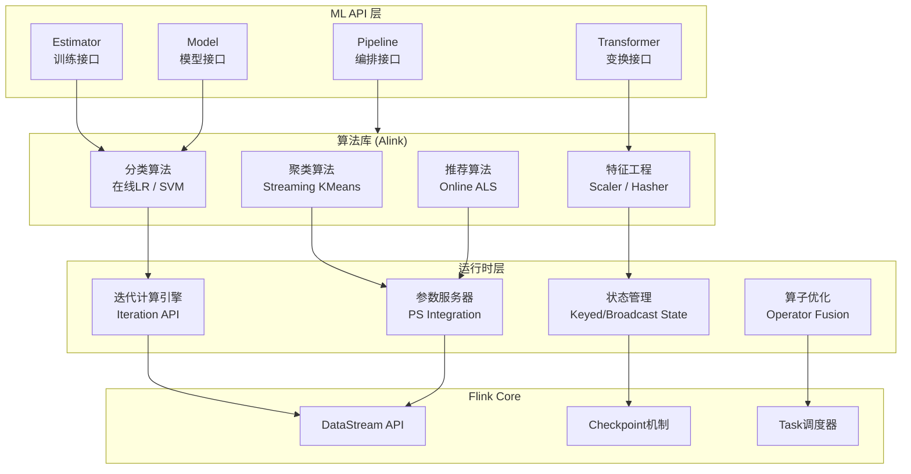
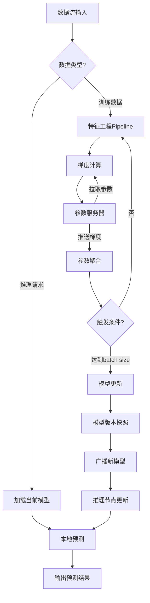
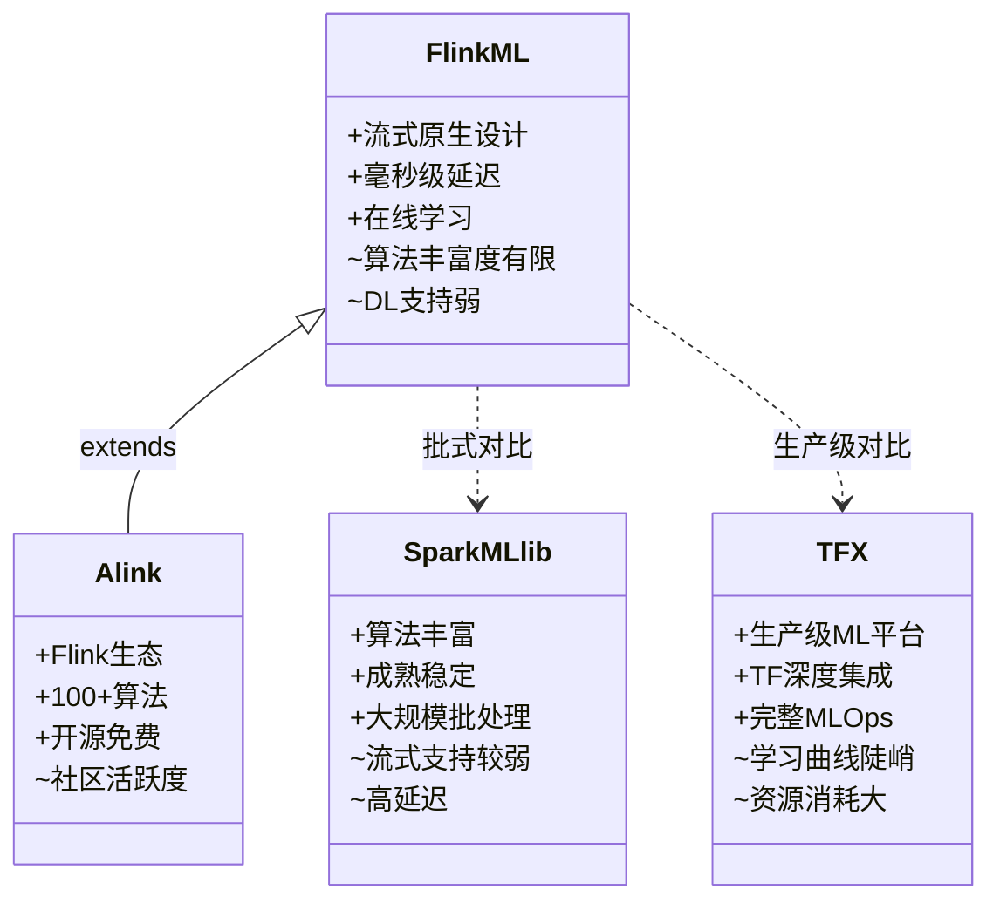

# Flink ML - 流式机器学习架构

> 所属阶段: Flink/ | 前置依赖: [Flink DataStream API](../02-core-mechanisms/flink-state-management-complete-guide.md) | 形式化等级: L3

## 1. 概念定义 (Definitions)

### Def-F-12-01: Flink ML架构

**定义**: Flink ML架构是一个分层设计的流式机器学习框架，由以下三元组定义：

$$
\text{FlinkML} = \langle \text{API}, \text{Algo}, \text{Runtime} \rangle
$$

其中：

- **API层** $(\text{API})$: 提供类型安全的ML算子接口，包括 `Transformer`, `Estimator`, `Model` 三类核心抽象
- **算法库** $(\text{Algo})$: 基于API层实现的算法集合（含Alink扩展），满足 $\text{Algo} \subseteq \text{API}^*$
- **运行时** $(\text{Runtime})$: 基于Flink DataStream的执行引擎，提供迭代计算与参数同步机制

**直观解释**: Flink ML将传统批式ML扩展到流式场景，通过统一的API抽象让算法开发者无需关心底层流处理细节，同时利用Flink的分布式能力实现大规模在线学习。

---

### Def-F-12-02: 迭代计算 (Iterations)

**定义**: Flink ML中的迭代计算是一个五元组：

$$
\text{Iteration} = \langle S_0, \delta, \tau, \theta, \phi \rangle
$$

其中：

- $S_0$: 初始状态（模型参数或训练数据分区）
- $\delta: S \times D \to S$: 状态转换函数，处理数据批次 $D$ 并更新状态
- $\tau: S \to \mathbb{B}$: 终止条件判断函数
- $\theta$: 最大迭代次数上限
- $\phi$: 迭代策略（`BULK_ITERATION` 或 `DELTA_ITERATION`）

**执行语义**: 迭代算子通过Flink的 `Iterate` 和 `IterateDelta` 算子实现，支持有界（批式训练）和无界（在线学习）两种数据流模式。

---

### Def-F-12-03: 参数服务器集成

**定义**: 参数服务器（Parameter Server, PS）集成是一个分布式参数同步协议：

$$
\text{PS-Integration} = \langle P, W, R, \mathcal{C}, \mathcal{S} \rangle
$$

其中：

- $P = \{p_1, p_2, ..., p_m\}$: 参数分区集合
- $W = \{w_1, w_2, ..., w_n\}$: Worker节点集合，执行梯度计算
- $R = \{r_1, r_2, ..., r_k\}$: PS节点集合，存储参数分区
- $\mathcal{C}: W \times R \to \mathbb{R}^d$: Worker从PS拉取参数的通信函数
- $\mathcal{S}: W \times R \times \Delta \to \mathbb{B}$: Worker向PS推送梯度更新的同步函数

**同步模式**:

- **BSP** (Bulk Synchronous Parallel): 严格同步，$\forall w_i \in W: \text{barrier}(w_i)$
- **ASP** (Asynchronous Parallel): 无屏障异步，$\mathcal{S}$ 立即生效
- **SSP** (Stale Synchronous Parallel): 允许延迟边界 $\sigma$，$|t_{local} - t_{global}| \leq \sigma$

---

## 2. 属性推导 (Properties)

### Prop-F-12-01: 流式ML的实时性保证

**命题**: 在Flink ML架构下，单次预测延迟 $L_{infer}$ 满足：

$$
L_{infer} \leq L_{network} + L_{feature} + L_{compute} + L_{serialize}
$$

其中特征工程延迟 $L_{feature}$ 可通过预计算和状态复用降至亚毫秒级。

**论证要点**:

- DataStream的流水线执行避免物化中间结果
- 特征变换算子通过 `ProcessFunction` 内联执行
- 模型参数通过Broadcast State本地缓存

---

### Prop-F-12-02: 迭代计算的收敛性

**命题**: 对于满足Lipschitz连续的目标函数 $f(\theta)$，使用BSP同步的迭代计算在有限步内收敛：

$$
\exists T < \theta: \|\nabla f(\theta_T)\| < \epsilon
$$

**工程约束**: 实际系统中需权衡收敛速度与通信开销，SSP模式在 $\sigma \in [5, 20]$ 时通常取得最优吞吐量。

---

### Lemma-F-12-01: 参数一致性边界

**引理**: 在ASP模式下，Worker $w_i$ 读取的参数版本 $v_i$ 与全局最新版本 $v_{global}$ 的延迟满足：

$$
\mathbb{E}[v_{global} - v_i] \leq \frac{\lambda}{\mu} \cdot \frac{n_{worker}}{n_{ps}}
$$

其中 $\lambda$ 为更新到达率，$\mu$ 为PS处理能力。

---

## 3. 关系建立 (Relations)

### 与Flink核心组件的关系

| Flink ML组件 | 依赖的Flink特性 | 关系类型 |
|-------------|----------------|---------|
| ML Pipeline API | Table API / DataStream API | 扩展（Extension） |
| 迭代计算 | Iteration API | 专用封装（Wrapper） |
| 参数服务器 | Broadcast State + Queryable State | 组合（Composition） |
| 实时特征 | ProcessFunction + State | 原生集成（Native） |

### 与外部ML框架的集成模式

```
┌─────────────────────────────────────────────────────────────┐
│                      Flink ML 集成图谱                        │
├─────────────────────────────────────────────────────────────┤
│                                                             │
│   ┌──────────────┐     ┌──────────────┐     ┌─────────────┐ │
│   │ TensorFlow   │◄────┤ SavedModel   ├────►│ Flink ML    │ │
│   │ (训练)        │     │ (模型格式)    │     │ (推理服务)   │ │
│   └──────────────┘     └──────────────┘     └─────────────┘ │
│          ▲                                           │      │
│          │              ┌──────────────┐            │      │
│          └──────────────┤ ONNX Runtime ├────────────┘      │
│                         │ (跨框架推理)  │                   │
│                         └──────────────┘                   │
│                                                             │
│   ┌──────────────┐     ┌──────────────┐                     │
│   │ PyTorch      │◄────┤ TorchScript  ├────►┌─────────────┐│
│   │ (训练)        │     │ (序列化)      │     │ Flink ML    ││
│   └──────────────┘     └──────────────┘     │ (流式推理)   ││
│                                              └─────────────┘│
└─────────────────────────────────────────────────────────────┘
```

---

## 4. 论证过程 (Argumentation)

### 4.1 在线学习的系统挑战

在线学习要求模型随数据流持续更新，核心挑战包括：

1. **概念漂移 (Concept Drift)**: 数据分布 $P(X, y)$ 随时间变化，需设计自适应学习率策略
2. **灾难性遗忘 (Catastrophic Forgetting)**: 新数据覆盖旧知识，需引入正则化项或经验回放
3. **实时性约束**: 模型更新与推理必须在数据时效窗口内完成

### 4.2 架构设计决策

**决策1**: 为何选择分层架构而非端到端框架？

- 解耦算法研究与工程优化，允许独立演进
- API层稳定性保障向后兼容，Runtime层可随Flink升级

**决策2**: 为何自建PS而非直接使用外部系统？

- 与Flink Checkpoint机制深度集成，保证Exactly-Once语义
- 利用Flink的Task调度实现 colocation 优化

### 4.3 边界讨论

| 场景 | Flink ML适用性 | 替代方案 |
|------|---------------|---------|
| 实时推荐排序 (p99<50ms) | ✓ 高度适用 | - |
| 大规模离线训练 (TB级) | △ 中等适用 | Spark MLlib |
| 深度神经网络训练 | ✗ 不适用 | TensorFlow/PyTorch |
| 联邦学习 | △ 需扩展 | TFF/FATE |

---

## 5. 工程论证 (Engineering Argument)

### 5.1 架构层次论证

#### ML API层设计

```java
// 核心抽象：Estimator-Transformer-Model 模式
public interface Estimator<T extends Model<T>> extends PipelineStage {
    T fit(Table... inputs);  // 训练得到模型
}

public interface Transformer extends PipelineStage {
    Table[] transform(Table... inputs);  // 特征变换
}

public interface Model<T extends Model<T>> extends Transformer {
    T setModelData(Table... inputs);  // 加载模型参数
}
```

**设计原理**: 遵循scikit-learn的fit-transform范式，降低算法开发者学习成本。

#### 算法库 (Alink) 扩展

Alink作为Flink ML的算法扩展，提供100+开箱即用算法：

| 类别 | 代表算法 | 流式适配特性 |
|------|---------|-------------|
| 分类 | OnlineLogisticRegression | 增量梯度更新 |
| 聚类 | StreamingKMeans | 微批聚类中心更新 |
| 特征 | FeatureHasher | 无状态逐行处理 |
| 评估 | BinaryClassificationEvaluator | 滑动窗口指标计算 |

#### 运行时优化策略

1. **算子融合**: 将连续的Transformer合并为单个ProcessFunction，减少序列化开销
2. **Broadcast State**: 模型参数通过广播流分发，推理节点本地缓存
3. **Mini-batch迭代**: 在迭代边界内累积梯度，平衡收敛速度与吞吐量

### 5.2 关键特性实现

#### 在线学习支持

```java
// 在线学习Pipeline示例
StreamExecutionEnvironment env = ...;
StreamTableEnvironment tEnv = ...;

// 定义在线学习器
OnlineLogisticRegression learner = new OnlineLogisticRegression()
    .setLearningRate(0.01)
    .setRegularization(0.1);

// 持续训练流
DataStream<Row> trainingStream = ...;
tableEnv.createTemporaryView("training", trainingStream);

// 每1000条样本触发一次模型更新
learner.fit(tEnv.from("training"));
```

#### 实时特征工程

| 特征类型 | 实现机制 | 状态类型 |
|---------|---------|---------|
| 统计特征 (均值/方差) | 增量聚合算子 | ValueState |
| 序列特征 (最近N项) | 滑动窗口 + ListState | ListState |
| 交叉特征 | Broadcast连接流 | MapState |

#### 模型版本管理

```
模型版本生命周期：
┌──────────┐    ┌──────────┐    ┌──────────┐    ┌──────────┐
│ Training │───►│ Staging  │───►│  Canary  │───►│Production│
│  (训练)   │    │ (验证集) │    │ (1%流量) │    │(100%流量)│
└──────────┘    └──────────┘    └──────────┘    └──────────┘
                                      │
                                      ▼
                               ┌──────────┐
                               │Rollback  │
                               │(回滚策略) │
                               └──────────┘
```

**实现方案**: 利用Flink的Savepoint机制实现模型版本快照，通过Queryable State提供版本查询接口。

#### A/B测试框架

```java
// 流量分割与模型路由
public class ModelRouter extends ProcessFunction<Features, Prediction> {
    private ValueState<ModelVersion> modelState;

    @Override
    public void processElement(Features features, Context ctx,
                               Collector<Prediction> out) {
        // 按用户ID哈希分流
        int bucket = features.userId.hashCode() % 100;
        ModelVersion version = bucket < 10 ? ModelVersion.V2 : ModelVersion.V1;

        modelState.value(version).predict(features);

        // 输出带实验标签的预测结果
        out.collect(new Prediction(result, version));
    }
}
```

---

## 6. 实例验证 (Examples)

### 6.1 完整在线学习Pipeline

```java
import org.apache.flink.ml.classification.logisticregression.*;
import org.apache.flink.ml.feature.standardscaler.*;
import org.apache.flink.ml.pipeline.*;

public class OnlineLearningExample {
    public static void main(String[] args) {
        StreamExecutionEnvironment env =
            StreamExecutionEnvironment.getExecutionEnvironment();
        StreamTableEnvironment tEnv =
            StreamTableEnvironment.create(env);

        // 1. 构建特征工程Pipeline
        Pipeline featurePipeline = new Pipeline()
            .addStage("scaler", new StandardScaler())
            .addStage("hasher", new FeatureHasher().setNumFeatures(1000));

        // 2. 定义在线学习模型
        OnlineLogisticRegression classifier = new OnlineLogisticRegression()
            .setLearningRate(0.01)
            .setGlobalBatchSize(100)  // 每100条更新一次
            .setMaxIter(1000);

        // 3. 组合完整Pipeline
        Pipeline modelPipeline = new Pipeline()
            .addStages(featurePipeline)
            .addStage("classifier", classifier);

        // 4. 训练与推理
        Table trainingData = tEnv.fromDataStream(
            env.addSource(new UserBehaviorSource()));

        // 持续在线训练
        modelPipeline.fit(trainingData);

        // 实时推理服务
        Table inferenceData = tEnv.fromDataStream(
            env.addSource(new InferenceRequestSource()));
        Table predictions = modelPipeline.transform(inferenceData)[0];

        env.execute("Online Learning Pipeline");
    }
}
```

### 6.2 参数服务器配置示例

```yaml
# flink-conf.yaml - PS相关配置

# 参数服务器分区数
flink.ml.ps.partition-num: 4

# 同步模式: BSP / ASP / SSP
flink.ml.ps.sync-mode: SSP
flink.ml.ps.staleness: 10

# 通信超时
flink.ml.ps.rpc-timeout: 30s

# 参数内存限制
flink.ml.ps.memory.limit: 2g
```

---

## 7. 可视化 (Visualizations)

### 7.1 Flink ML架构层次图



### 7.2 在线学习执行流程图



### 7.3 Flink ML vs 主流框架对比矩阵



---

## 8. 对比分析 (Comparisons)

### 8.1 Flink ML vs Spark MLlib

| 维度 | Flink ML | Spark MLlib |
|------|----------|-------------|
| **处理模式** | 流式原生，支持批处理 | 批式为主，Structured Streaming补充 |
| **延迟** | 毫秒级 (p99<50ms) | 秒级~分钟级 |
| **在线学习** | 原生支持增量更新 | 需配合Spark Streaming实现 |
| **算法数量** | 较少（依赖Alink扩展） | 丰富（Spark生态成熟） |
| **适用场景** | 实时推荐、在线风控 | 离线训练、批量预测 |
| **Checkpoint** | 原生Exactly-Once | 需额外配置 WAL |

**选型建议**: 若业务需要实时模型更新（如点击率实时预估），选择Flink ML；若为周期性批量训练（如每日用户画像），选择Spark MLlib。

### 8.2 Flink ML vs TensorFlow Extended (TFX)

| 维度 | Flink ML | TFX |
|------|----------|-----|
| **定位** | 流式ML引擎 | 端到端ML平台 |
| **深度学习** | 不支持 | TensorFlow原生支持 |
| **MLOps** | 需自建Pipeline | 完整的CI/CD、模型管理 |
| **特征平台** | 实时特征工程 | Feast等特征存储集成 |
| **服务部署** | 需结合Flink集群 | TensorFlow Serving |
| **复杂度** | 中等 | 高 |

**集成方案**: 典型生产环境采用混合架构：

- 训练阶段：TFX + TensorFlow（处理复杂模型）
- 推理阶段：Flink ML（加载TF SavedModel，流式推理）

```
┌─────────────────────────────────────────────────────────────┐
│                    混合架构示例                               │
├─────────────────────────────────────────────────────────────┤
│                                                             │
│   训练阶段                      推理阶段                      │
│   ┌──────────────┐             ┌──────────────┐             │
│   │  TFX Pipeline │             │  Flink Cluster│             │
│   │  ┌──────────┐ │             │  ┌──────────┐ │             │
│   │  │Transform │ │             │  │  Source  │ │             │
│   │  │ (特征工程)│─┼────────────►│  │(实时特征)│ │             │
│   │  └──────────┘ │             │  └────┬─────┘ │             │
│   │  ┌──────────┐ │             │  ┌────▼─────┐ │             │
│   │  │ Trainer  │ │  SavedModel │  │Transform │ │             │
│   │  │(TF训练)  │─┼────────────►│  │(同训练)  │ │             │
│   │  └──────────┘ │             │  └────┬─────┘ │             │
│   │  ┌──────────┐ │             │  ┌────▼─────┐ │             │
│   │  │  Tuner   │ │             │  │  TF Model│ │             │
│   │  │(超参优化)│ │             │  │ (加载)   │ │             │
│   │  └──────────┘ │             │  └────┬─────┘ │             │
│   │  ┌──────────┐ │             │  ┌────▼─────┐ │             │
│   │  │  Pusher  │ │             │  │  Sink    │ │             │
│   │  │(模型部署)│─┼────────────►│  │(预测输出)│ │             │
│   │  └──────────┘ │             │  └──────────┘ │             │
│   └──────────────┘             └──────────────┘             │
│                                                             │
└─────────────────────────────────────────────────────────────┘
```

---

## 9. 引用参考 (References)
