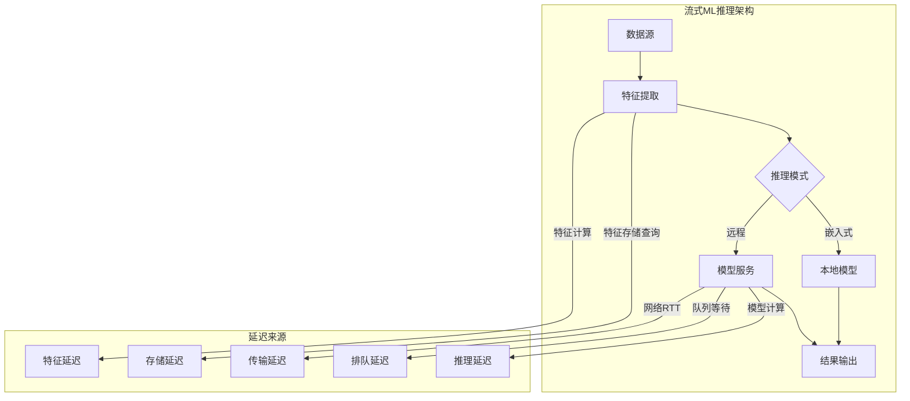
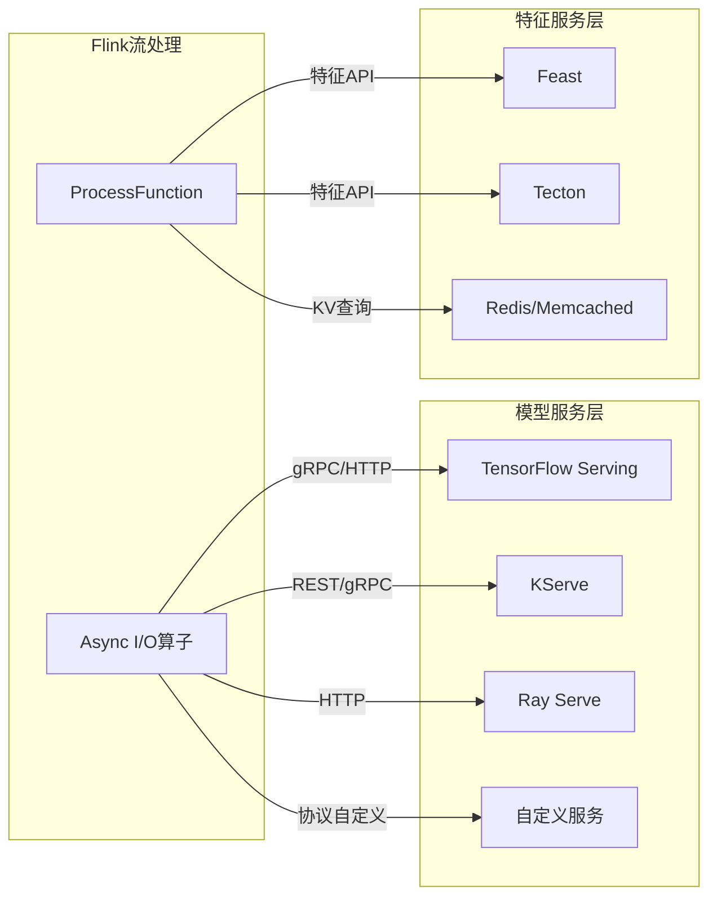
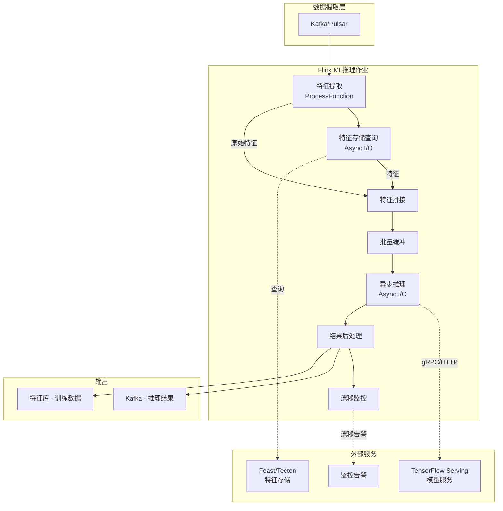
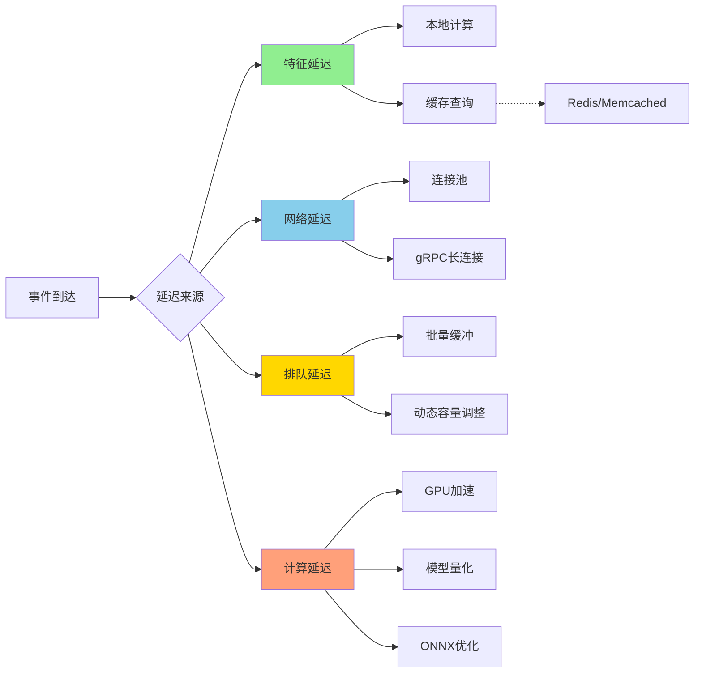
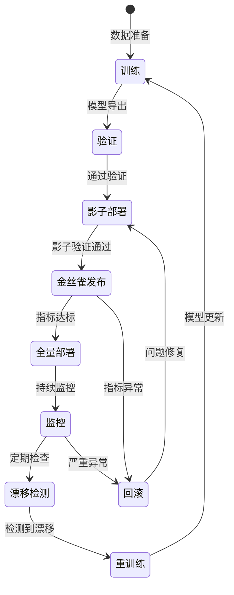
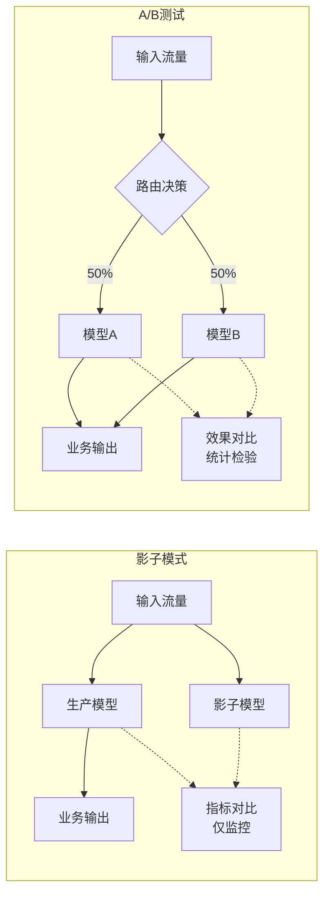

# Flink实时机器学习推理与模型服务

> 所属阶段: Flink | 前置依赖: [Flink异步I/O机制](../02-core/async-execution-model.md), [Flink状态管理](../02-core/flink-state-management-complete-guide.md) | 形式化等级: L4

---

## 1. 概念定义 (Definitions)

### Def-F-12-30: 流式ML推理 (Streaming ML Inference)

流式ML推理是指在数据流处理过程中，对每个或每批数据事件应用预训练机器学习模型进行预测的机制。

**形式化定义**: 设数据流为无限序列 $\mathcal{S} = \langle e_1, e_2, e_3, ... \rangle$，其中每个事件 $e_i \in \mathcal{E}$ 包含特征向量 $\mathbf{x}_i \in \mathbb{R}^n$。预训练模型为函数 $f_\theta: \mathbb{R}^n \rightarrow \mathcal{Y}$，则流式推理过程定义为:

$$\hat{y}_i = f_\theta(\mathbf{x}_i), \quad \forall e_i \in \mathcal{S}$$

其中 $\hat{y}_i \in \mathcal{Y}$ 为推理输出，$\theta$ 为模型参数。

**关键属性**:

- **事件驱动**: 推理触发与数据到达同步
- **低延迟约束**: 端到端延迟通常要求 < 100ms
- **状态一致性**: 特征计算与推理结果需保证时间对齐

---

### Def-F-12-31: 远程推理与嵌入式推理 (Remote vs Embedded Inference)

**Def-F-12-31a: 远程推理 (Remote Inference)**

将模型部署在独立服务中，通过RPC/HTTP请求进行推理:

$$\text{Inference}_{\text{remote}}(e_i) = \text{RPC}(\text{ModelService}, \text{serialize}(\mathbf{x}_i))$$

**Def-F-12-31b: 嵌入式推理 (Embedded Inference)**

将模型直接加载到Flink算子中，在JVM/Python进程中本地执行:

$$\text{Inference}_{\text{embedded}}(e_i) = f_\theta^{\text{local}}(\mathbf{x}_i)$$

**对比维度**:

| 维度 | 远程推理 | 嵌入式推理 |
|------|----------|------------|
| 延迟 | 网络RTT + 推理时间 | 仅推理时间 |
| 吞吐量 | 受网络/服务容量限制 | 受本地资源限制 |
| 模型更新 | 服务端统一部署 | 需重启Flink作业 |
| 资源隔离 | 强隔离 | 共享JVM资源 |
| 多语言支持 | 任意语言实现 | 限于JVM/Python生态 |

---

### Def-F-12-32: 异步推理 (Async Inference)

在Flink中使用Async I/O机制进行非阻塞远程推理，允许在等待响应时继续处理其他事件。

**形式化定义**: 设异步推理算子为 $A_{\text{async}}$，容量为 $C$（并发请求数）。对于输入流 $\mathcal{S}$，输出流 $\mathcal{S}'$ 满足:

$$\mathcal{S}' = \{ (e_i, \hat{y}_i) \mid e_i \in \mathcal{S}, \hat{y}_i = \text{await}(\text{async\_request}(e_i)) \}$$

其中 $\text{async\_request}$ 发起非阻塞调用，$\text{await}$ 在响应到达时完成Future。

**顺序保证**:

- **有序输出**: 保持输入事件顺序（需缓冲等待慢请求）
- **无序输出**: 按响应到达顺序输出（最大吞吐）

---

### Def-F-12-33: 特征存储与训练-服务一致性 (Feature Store & Consistency)

**Def-F-12-33a: 特征存储 (Feature Store)**

集中式特征管理平台，支持在线(Online)和离线(Offline)两种服务模式:

$$\text{FeatureStore} = \langle \mathcal{F}_{\text{online}}, \mathcal{F}_{\text{offline}}, \phi \rangle$$

其中 $\mathcal{F}_{\text{online}}$ 提供低延迟查询(<10ms)，$\mathcal{F}_{\text{offline}}$ 支持批量训练数据生成，$\phi$ 为一致性协议。

**Def-F-12-33b: 训练-服务一致性 (Training-Serving Skew)**

训练时使用的特征计算逻辑与推理时不一致导致的预测偏差:

$$\text{Skew} = \mathbb{E}_{x \sim \mathcal{D}}[ | f_\theta(\mathbf{x}_{\text{train}}) - f_\theta(\mathbf{x}_{\text{serve}}) | ]$$

---

### Def-F-12-34: 影子模式与A/B测试 (Shadow Mode & A/B Testing)

**Def-F-12-34a: 影子模式 (Shadow Mode)**

新模型并行运行但不影响生产流量，用于验证新模型行为:

$$\text{Shadow}(e_i) = (\hat{y}_{\text{prod}}, \hat{y}_{\text{shadow}}), \quad \text{仅输出 } \hat{y}_{\text{prod}}$$

**Def-F-12-34b: A/B测试 (A/B Testing)**

将流量按比例分配给不同模型版本，对比业务指标:

$$\text{Route}(e_i) = \begin{cases} \text{Model}_A & \text{if } h(e_i) < p \\ \text{Model}_B & \text{otherwise} \end{cases}$$

其中 $h$ 为一致性哈希函数，$p$ 为分流比例。

---

### Def-F-12-35: 模型漂移 (Model Drift)

模型性能随时间下降的现象，包括概念漂移(Concept Drift)和数据漂移(Data Drift):

$$\text{Drift}(t) = D(P_{\text{train}}(X, Y) \| P_t(X, Y))$$

其中 $D$ 为分布距离度量（如KL散度），$P_{\text{train}}$ 为训练分布，$P_t$ 为时刻 $t$ 的数据分布。

**漂移类型**:

- **概念漂移**: $P(Y|X)$ 变化（模型决策边界失效）
- **数据漂移**: $P(X)$ 变化（输入特征分布偏移）
- **标签漂移**: $P(Y)$ 变化（类别比例变化）

---

## 2. 属性推导 (Properties)

### Prop-F-12-30: 异步推理吞吐量下界

**命题**: 对于容量为 $C$ 的异步推理算子，若平均推理延迟为 $L$，则吞吐量下界为:

$$\text{Throughput} \geq \frac{C}{L}$$

**推导**:

- 在稳态下，算子同时维护 $C$ 个并发请求
- 每个请求平均耗时 $L$，因此每单位时间完成 $C/L$ 个请求
- 实际吞吐量还受输入速率和资源限制

**推论**: 为达到目标吞吐量 $T$，所需最小容量为:

$$C_{\min} = T \cdot L$$

---

### Prop-F-12-31: 批处理推理的延迟-吞吐权衡

**命题**: 批处理大小 $B$ 与平均延迟 $\bar{\lambda}$ 呈线性关系，与吞吐量 $\Theta$ 呈次线性增长:

$$\bar{\lambda}(B) = \lambda_0 + \alpha \cdot B, \quad \Theta(B) = \frac{B}{\lambda_0 + \alpha \cdot B} \cdot \Theta_{\max}$$

其中 $\lambda_0$ 为固定开销，$\alpha$ 为边际延迟系数。

**证明概要**:

- 批处理引入等待时间以聚合请求，增加延迟
- 但摊薄了固定开销（如网络RTT），提升吞吐
- 最优批大小 $B^*$ 需满足: $\frac{\partial}{\partial B}(\text{Utility}(\Theta, \bar{\lambda})) = 0$

---

### Prop-F-12-32: 特征时效性与模型性能关系

**命题**: 使用延迟特征 $\mathbf{x}_{t-\delta}$ 而非实时特征 $\mathbf{x}_t$ 的模型，其性能损失上界为:

$$\text{Performance\_Loss} \leq K \cdot \delta^\beta$$

其中 $K$ 为特征变化率常数，$\beta \in (0, 1]$ 为平滑系数。

**工程含义**:

- 特征延迟每增加100ms，模型AUC可能下降0.1-0.5%
- 金融风控场景要求特征延迟 < 50ms
- 推荐系统可容忍特征延迟至500ms

---

## 3. 关系建立 (Relations)

### 3.1 推理架构与延迟来源分析



### 3.2 Flink ML推理模式决策矩阵

| 场景 | 推荐模式 | 关键配置 | 适用条件 |
|------|----------|----------|----------|
| 低延迟(<10ms) | 嵌入式 | ONNX/TensorFlow Lite | 模型<100MB，简单模型 |
| 中等延迟(10-100ms) | 异步远程 | 容量=100, 超时=500ms | 复杂模型，GPU推理 |
| 高吞吐(>10K RPS) | 批量远程 | 批大小=32, 缓冲=100ms | 批友好模型(CNN/BERT) |
| 模型实验 | 影子模式 | 100%流量复制 | 新模型验证阶段 |
| 效果对比 | A/B测试 | 流量比例50/50 | 业务指标对比 |

### 3.3 模型服务生态系统映射



---

## 4. 论证过程 (Argumentation)

### 4.1 异步推理 vs 同步推理对比论证

**场景**: 单并行度，目标吞吐量=1000 RPS，平均推理延迟=50ms

| 方案 | 并发度 | 吞吐能力 | CPU利用率 | 内存占用 |
|------|--------|----------|-----------|----------|
| 同步阻塞 | 1 | 20 RPS | 100% | 低 |
| 同步多线程 | 50 | 1000 RPS | 高(上下文切换) | 中 |
| **异步I/O** | **1(容量=50)** | **1000 RPS** | **低** | **低** |

**论证结论**: 异步I/O以最小资源开销达成吞吐目标，避免线程上下文切换开销。

### 4.2 批处理决策边界分析

**何时使用批处理**:

1. 模型支持批输入（如PyTorch/TensorFlow默认批维度）
2. 延迟SLA允许额外缓冲时间（>50ms）
3. 吞吐需求高（>1000 RPS/并行度）

**何时避免批处理**:

1. 严格延迟要求（<20ms p99）
2. 稀疏输入（批填充导致浪费）
3. 事件间隔不均（长等待降低吞吐）

### 4.3 模型版本管理策略对比

| 策略 | 实现复杂度 | 回滚时间 | 一致性 | 适用场景 |
|------|------------|----------|--------|----------|
| 蓝绿部署 | 中 | 秒级 | 全量切换 | 重大版本更新 |
| 金丝雀发布 | 高 | 分钟级 | 渐进 | 风险控制严格 |
| 影子验证 | 低 | N/A | 并行 | 新模型验证 |
| 动态路由 | 高 | 即时 | 按流量 | 频繁实验 |

---

## 5. 工程论证 / 形式证明 (Engineering Argument)

### Thm-F-12-30: 异步推理算子的正确性保证

**定理**: 在有序模式下，异步推理算子保证输出顺序与输入顺序一致，当且仅当满足:

$$\forall i < j: \text{complete}(e_i) \leq \text{complete}(e_j) \Rightarrow \text{output}(e_i) \prec \text{output}(e_j)$$

其中 $\text{complete}(e)$ 为推理完成时间戳，$\prec$ 为输出流顺序。

**工程论证**:

1. **水印传播**: 异步算子正确传播水印，不破坏窗口语义
2. **检查点一致性**: 未完成的异步请求参与检查点，恢复后重放
3. **超时处理**: 超时请求可配置为失败或返回默认值

**实现约束**:

```java
// 有序输出需维护缓冲区
AsyncDataStream.orderedWait(
    inputStream,
    asyncFunction,
    timeout,      // 最大等待时间
    timeUnit,
    capacity      // 并发请求上限
);

// 无序输出最大化吞吐
AsyncDataStream.unorderedWait(...);
```

---

### Thm-F-12-31: 特征一致性约束

**定理**: 实现训练-服务一致性的充要条件是:

$$\mathbf{x}_{\text{train}} = \phi(\mathbf{x}_{\text{raw}}) \equiv \mathbf{x}_{\text{serve}} = \phi(\mathbf{x}_{\text{raw}})$$

即训练和推理使用相同的特征计算逻辑 $\phi$。

**工程实现路径**:

**方案A: 特征存储中心化**

```python
# 训练时 features = feast.get_historical_features(
    entity_df=training_events,
    features=["user:age", "user:click_count_7d"]
)

# 推理时(Flink中)
class FeatureEnrichment(AsyncFunction):
    async def async_invoke(self, event, result_future):
        features = await feast.get_online_features(
            entity_rows=[{"user_id": event.user_id}],
            features=["user:age", "user:click_count_7d"]
        )
        result_future.complete((event, features))
```

**方案B: 特征计算UDF共享**

- 将特征计算逻辑打包为独立库
- 训练和推理引用同一库版本
- 版本锁定防止逻辑漂移

---

### Thm-F-12-32: 模型漂移检测的统计保证

**定理**: 使用滑动窗口KS检验检测数据漂移，在显著性水平 $\alpha$ 下，误报率为:

$$P(\text{False Positive}) = \alpha \cdot N_{\text{windows}}$$

**Bonferroni校正**: 对于 $m$ 个并行监控的特征，调整显著性水平为 $\alpha/m$ 以控制族-wise误差率。

**工程实现**:

```java
// 漂移检测算子

import org.apache.flink.api.common.state.ValueState;

class DriftDetectionFunction extends ProcessFunction<Prediction, Alert> {
    private ValueState<DescriptiveStatistics> referenceState;
    private ValueState<DescriptiveStatistics> currentState;

    @Override
    public void processElement(Prediction pred, Context ctx, Collector<Alert> out) {
        currentState.update(...);

        if (shouldCheckDrift(ctx.timestamp())) {
            double ksStatistic = kolmogorovSmirnovTest(
                referenceState.value(),
                currentState.value()
            );

            if (ksStatistic > threshold) {
                out.collect(new Alert("DRIFT_DETECTED", ksStatistic));
            }
        }
    }
}
```

---

## 6. 实例验证 (Examples)

### 6.1 TensorFlow Serving集成

**服务端部署**:

```yaml
# tf-serving-deployment.yaml apiVersion: apps/v1
kind: Deployment
metadata:
  name: tensorflow-serving
spec:
  replicas: 3
  template:
    spec:
      containers:
      - name: tf-serving
        image: tensorflow/serving:latest
        ports:
        - containerPort: 8501  # REST API
        - containerPort: 8500  # gRPC
        env:
        - name: MODEL_NAME
          value: "recommendation_model"
```

**Flink客户端**:

```java

import org.apache.flink.streaming.api.datastream.DataStream;

public class TFServingAsyncFunction
    implements AsyncFunction<UserEvent, EnrichedEvent> {

    private transient TFServingClient client;

    @Override
    public void open(Configuration parameters) {
        client = new TFServingClient(
            "tf-serving:8500",
            ModelConfig.newBuilder()
                .setName("recommendation_model")
                .setSignatureName("serving_default")
                .build()
        );
    }

    @Override
    public void asyncInvoke(UserEvent event, ResultFuture<EnrichedEvent> resultFuture) {
        TensorProto input = TensorProto.newBuilder()
            .addFloatVal(event.getFeature1())
            .addFloatVal(event.getFeature2())
            .build();

        ListenableFuture<PredictResponse> future = client.predict(
            PredictRequest.newBuilder()
                .putInputs("input", input)
                .build()
        );

        Futures.addCallback(future, new FutureCallback<>() {
            @Override
            public void onSuccess(PredictResponse result) {
                float score = result.getOutputsOrThrow("score")
                    .getFloatVal(0);
                resultFuture.complete(
                    Collections.singletonList(
                        new EnrichedEvent(event, score)
                    )
                );
            }

            @Override
            public void onFailure(Throwable t) {
                resultFuture.completeExceptionally(t);
            }
        }, directExecutor());
    }
}

// 使用
DataStream<EnrichedEvent> scoredEvents = AsyncDataStream.unorderedWait(
    events,
    new TFServingAsyncFunction(),
    500, TimeUnit.MILLISECONDS,
    100  // 并发容量
);
```

---

### 6.2 批量推理优化实现

```java
import org.apache.flink.streaming.api.functions.ProcessFunction;

import org.apache.flink.api.common.state.ValueState;


public class BatchedInferenceFunction
    extends ProcessFunction<Event, ScoredEvent>
    implements CheckpointedFunction {

    private List<Event> buffer;
    private transient ValueState<List<Event>> bufferState;
    private static final int BATCH_SIZE = 32;
    private static final long BATCH_TIMEOUT_MS = 50;

    @Override
    public void open(Configuration parameters) {
        buffer = new ArrayList<>();
    }

    @Override
    public void processElement(Event event, Context ctx, Collector<ScoredEvent> out) {
        buffer.add(event);

        if (buffer.size() >= BATCH_SIZE) {
            flushBuffer(out);
        } else {
            // 注册定时器触发超时刷新
            ctx.timerService().registerProcessingTimeTimer(
                ctx.timerService().currentProcessingTime() + BATCH_TIMEOUT_MS
            );
        }
    }

    @Override
    public void onTimer(long timestamp, OnTimerContext ctx, Collector<ScoredEvent> out) {
        if (!buffer.isEmpty()) {
            flushBuffer(out);
        }
    }

    private void flushBuffer(Collector<ScoredEvent> out) {
        // 批量推理调用
        float[][] batchInput = extractFeatures(buffer);
        float[] batchScores = model.predict(batchInput);

        for (int i = 0; i < buffer.size(); i++) {
            out.collect(new ScoredEvent(buffer.get(i), batchScores[i]));
        }
        buffer.clear();
    }

    @Override
    public void snapshotState(FunctionSnapshotContext context) throws Exception {
        bufferState.update(buffer);
    }

    @Override
    public void initializeState(FunctionInitializationContext context) {
        bufferState = context.getOperatorStateStore()
            .getListState(new ListStateDescriptor<>("buffer", Event.class));
    }
}
```

---

### 6.3 A/B测试实现

```java
public class ABTestingFunction extends ProcessFunction<Event, ScoredEvent> {

    private transient ModelClient modelA;
    private transient ModelClient modelB;
    private static final double TRAFFIC_SPLIT = 0.5;

    @Override
    public void open(Configuration parameters) {
        modelA = new ModelClient("model-a-service:8080");
        modelB = new ModelClient("model-b-service:8080");
    }

    @Override
    public void processElement(Event event, Context ctx, Collector<ScoredEvent> out) {
        // 一致性哈希确保同一用户总是路由到相同模型
        int hash = event.getUserId().hashCode();
        boolean useModelA = (Math.abs(hash) % 100) < (TRAFFIC_SPLIT * 100);

        ModelClient selectedModel = useModelA ? modelA : modelB;
        String modelVersion = useModelA ? "v1.0" : "v2.0";

        float score = selectedModel.predict(event.getFeatures());

        // 输出包含模型版本用于后续指标对比
        out.collect(new ScoredEvent(event, score, modelVersion));
    }
}
```

---

### 6.4 模型漂移监控实现

```java
import org.apache.flink.streaming.api.functions.ProcessFunction;

public class DriftMonitoringFunction
    extends ProcessFunction<Prediction, DriftMetrics>
    implements CheckpointedFunction {

    private static final int WINDOW_SIZE = 1000;
    private static final double KS_THRESHOLD = 0.05;

    private List<Double> referenceDistribution;
    private List<Double> currentWindow;
    private transient ListState<List<Double>> state;

    @Override
    public void processElement(Prediction pred, Context ctx, Collector<DriftMetrics> out) {
        currentWindow.add(pred.getScore());

        if (currentWindow.size() >= WINDOW_SIZE) {
            double ksStatistic = calculateKSStatistic(
                referenceDistribution,
                currentWindow
            );

            boolean isDrift = ksStatistic > KS_THRESHOLD;

            out.collect(new DriftMetrics(
                ctx.timestamp(),
                ksStatistic,
                isDrift,
                calculatePSI(referenceDistribution, currentWindow)
            ));

            // 滑动窗口
            referenceDistribution = new ArrayList<>(currentWindow);
            currentWindow.clear();
        }
    }

    private double calculateKSStatistic(List<Double> ref, List<Double> cur) {
        Collections.sort(ref);
        Collections.sort(cur);

        double maxDiff = 0.0;
        int i = 0, j = 0;

        while (i < ref.size() && j < cur.size()) {
            double cdfRef = (double) i / ref.size();
            double cdfCur = (double) j / cur.size();
            maxDiff = Math.max(maxDiff, Math.abs(cdfRef - cdfCur));

            if (ref.get(i) < cur.get(j)) i++;
            else j++;
        }

        return maxDiff;
    }

    private double calculatePSI(List<Double> ref, List<Double> cur) {
        // Population Stability Index计算
        Map<String, Long> refBins = binDistribution(ref);
        Map<String, Long> curBins = binDistribution(cur);

        double psi = 0.0;
        for (String bin : refBins.keySet()) {
            double refPct = refBins.get(bin) / (double) ref.size();
            double curPct = curBins.getOrDefault(bin, 0L) / (double) cur.size();

            if (refPct > 0 && curPct > 0) {
                psi += (curPct - refPct) * Math.log(curPct / refPct);
            }
        }
        return psi;
    }
}
```

---

### 6.5 Feast特征存储集成

```python
# feature_view.py - 特征定义 from feast import Entity, Feature, FeatureView, ValueType, FileSource
from datetime import timedelta

user = Entity(name="user_id", value_type=ValueType.STRING)

user_features = FeatureView(
    name="user_features",
    entities=["user_id"],
    ttl=timedelta(days=1),
    features=[
        Feature(name="age", dtype=ValueType.INT64),
        Feature(name="click_count_7d", dtype=ValueType.INT64),
        Feature(name="avg_session_duration", dtype=ValueType.FLOAT),
    ],
    online=True,
    source=FileSource(path="s3://bucket/user_features/"),
)
```

```java
// Flink Feast客户端
public class FeastFeatureEnrichment implements AsyncFunction<Event, EnrichedEvent> {

    private transient FeastClient feastClient;

    @Override
    public void open(Configuration parameters) {
        feastClient = FeastClient.create("feast-online-serving:6566");
    }

    @Override
    public void asyncInvoke(Event event, ResultFuture<EnrichedEvent> resultFuture) {
        GetOnlineFeaturesRequest request = GetOnlineFeaturesRequest.newBuilder()
            .addFeatures("user_features:age")
            .addFeatures("user_features:click_count_7d")
            .addFeatures("user_features:avg_session_duration")
            .addEntityRows(
                GetOnlineFeaturesRequest.EntityRow.newBuilder()
                    .putFields("user_id", Value.newBuilder()
                        .setStringVal(event.getUserId()).build())
                    .build()
            )
            .build();

        ListenableFuture<GetOnlineFeaturesResponse> future =
            feastClient.getOnlineFeaturesAsync(request);

        Futures.addCallback(future, new FutureCallback<>() {
            @Override
            public void onSuccess(GetOnlineFeaturesResponse result) {
                Map<String, Value> features = extractFeatures(result);
                resultFuture.complete(Collections.singletonList(
                    new EnrichedEvent(event, features)
                ));
            }

            @Override
            public void onFailure(Throwable t) {
                // 降级到默认值
                resultFuture.complete(Collections.singletonList(
                    new EnrichedEvent(event, getDefaultFeatures())
                ));
            }
        }, directExecutor());
    }
}
```

---

## 7. 可视化 (Visualizations)

### 7.1 流式ML推理完整架构



### 7.2 推理延迟分解与优化策略



### 7.3 模型部署生命周期



### 7.4 A/B测试与影子模式对比



---

## 8. 引用参考 (References)


---

## 附录: 性能调优检查清单

### 延迟优化

- [ ] 特征本地计算优先，减少网络查询
- [ ] 特征结果缓存（TTL根据业务设定）
- [ ] 连接池预热，避免冷启动延迟
- [ ] gRPC替代HTTP/1.1，启用HTTP/2多路复用

### 吞吐量优化

- [ ] 异步I/O容量调优: 容量 = 目标吞吐 × 平均延迟
- [ ] 批量大小调优: 监控批填充率和等待时间
- [ ] 模型服务横向扩容，消除单点瓶颈
- [ ] 背压监控，动态调整并行度

### 可靠性保障

- [ ] 推理超时设置: p99延迟 × 3
- [ ] 重试策略: 指数退避，最大3次
- [ ] 降级策略: 返回默认值或缓存结果
- [ ] 死信队列: 持久化失败请求用于分析

### 可观测性

- [ ] 推理延迟直方图（p50/p99/p99.9）
- [ ] 模型版本标签附加到每条输出
- [ ] 特征缺失率监控
- [ ] 漂移检测告警阈值动态调整
