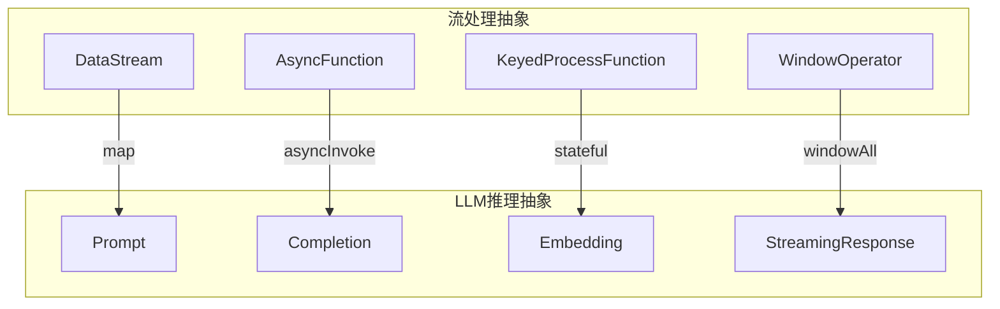
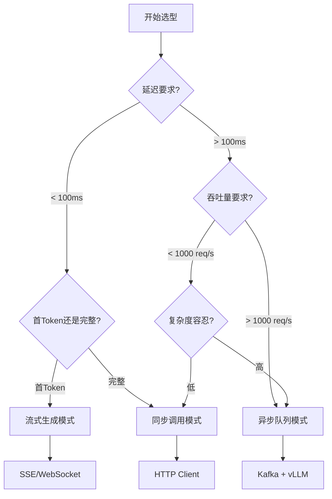
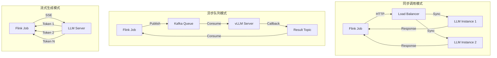
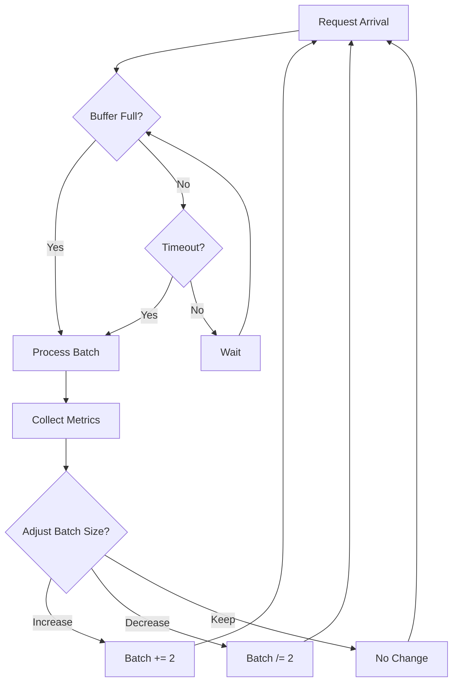
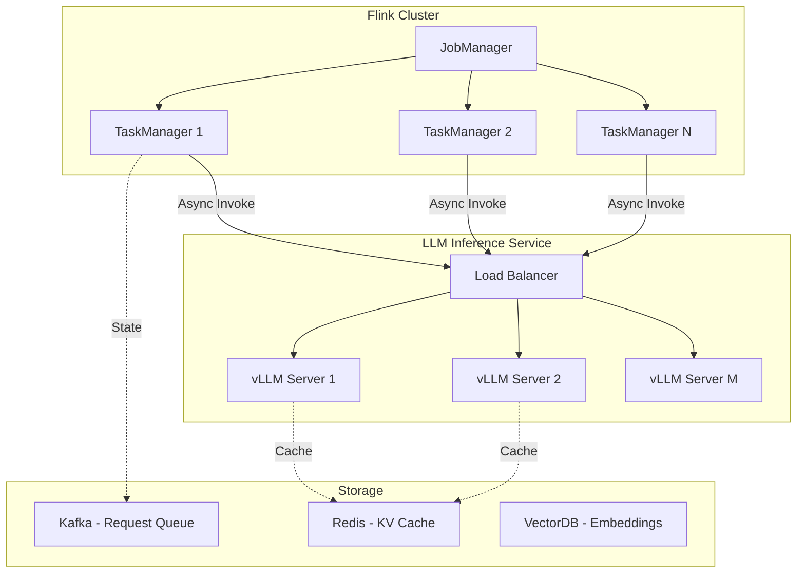

# LLM实时推理架构

> **所属阶段**: Flink/AI-ML | **前置依赖**: [flink-state-management-complete-guide.md](../02-core/flink-state-management-complete-guide.md) | **形式化等级**: L4-L5

## 执行摘要

本文档系统阐述了大语言模型(LLM)在流处理场景中的实时推理架构设计，涵盖同步/异步/流式三种调用模式、动态批处理优化策略、以及Flink与LLM服务的深度集成方案。

| 架构模式 | 延迟 | 吞吐量 | 适用场景 |
|:--------:|:----:|:------:|:---------|
| 同步调用 | 高 | 低 | 低并发、强一致性需求 |
| 异步队列 | 中 | 高 | 高吞吐、可接受延迟 |
| 流式生成 | 低 | 中 | 实时交互、逐字展示 |

---

## 1. 概念定义 (Definitions)

### Def-AI-06-01: LLM推理延迟 (Inference Latency)

**定义**: LLM推理延迟 $L_{inf}$ 指从输入提示(prompt)提交到首个输出生成(token)返回的时间间隔：

$$L_{inf} = t_{first\_token} - t_{prompt\_submit}$$

**组成要素**:

- 提示编码时间 $t_{encode}$
- 模型前向传播时间 $t_{forward}$
- 首个令牌生成时间 $t_{generate}$

**完整延迟公式**:

$$L_{total} = L_{inf} + \sum_{i=2}^{N} t_{token_i} + t_{network}$$

其中 $N$ 为生成令牌数，$t_{token_i}$ 为第 $i$ 个令牌的生成时间。

---

### Def-AI-06-02: 流式批处理 (Streaming Batching)

**定义**: 流式批处理是在保持数据流语义的前提下，将多个独立请求聚合成批次进行统一处理的技术：

$$B = \{r_1, r_2, ..., r_n\}, \quad |B| \leq B_{max}, \quad \Delta t_B \leq T_{max}$$

**约束条件**:

- $B_{max}$: 最大批次大小
- $T_{max}$: 最大等待时间
- 批次内请求相互独立

---

### Def-AI-06-03: 模型并行度 (Model Parallelism)

**定义**: 模型并行度 $P_{model}$ 表示单个LLM实例可同时处理的并发请求数：

$$P_{model} = \frac{GPU\_Memory - Model\_Size}{Activation\_Memory\_per\_Request}$$

**关键参数**:

- 模型参数量 (如 7B, 13B, 70B)
- 精度格式 (FP16, INT8, INT4)
- KV Cache占用
- 激活值内存

---

### Def-AI-06-04: 动态批处理 (Dynamic Batching)

**定义**: 动态批处理是一种自适应调度策略，根据当前负载动态调整批次大小：

$$B_{dynamic}(t) = \min\left(B_{max}, \max\left(1, \left\lfloor\frac{\lambda(t) \cdot T_{target}}{L_{avg}}\right\rfloor\right)\right)$$

其中：

- $\lambda(t)$: 时刻 $t$ 的请求到达率
- $T_{target}$: 目标延迟
- $L_{avg}$: 平均单请求处理时间

---

### Def-AI-06-05: 令牌吞吐量 (Token Throughput)

**定义**: 令牌吞吐量 $\Theta$ 表示单位时间内生成的令牌数量：

$$\Theta = \frac{\sum_{i=1}^{n} |output_i|}{T_{elapsed}}$$

**单位**: tokens/second

**与批次大小关系**:

$$\Theta(B) = \frac{B \cdot |output|}{L_{inf} + B \cdot t_{token}}$$

---

### Def-AI-06-06: 推理服务并发度

**定义**: 推理服务并发度 $C_{service}$ 衡量LLM服务同时处理多个独立请求的能力：

$$C_{service} = \sum_{i=1}^{N_{instance}} P_{model}^{(i)} \cdot \alpha_i$$

其中 $\alpha_i$ 为第 $i$ 个实例的利用率系数。

---

### Def-AI-06-07: 首Token延迟与逐Token延迟

**定义**:

- **首Token延迟 (TTFT)**: Time To First Token，从请求提交到首个输出生成的时间
- **逐Token延迟 (TBT)**: Time Between Tokens，连续两个输出生成之间的时间间隔

$$L_{perceived} = TTFT + (N-1) \cdot TBT$$

---

### Def-AI-06-08: 请求调度策略

**定义**: 请求调度策略 $\mathcal{S}$ 决定如何从等待队列中选择请求组成批次：

$$\mathcal{S}: Queue \times State \rightarrow Batch$$

**常见策略**:

- FIFO (先进先出)
- Priority-based (优先级)
- Shortest-job-first (最短作业优先)
- Longest-job-first (最长作业优先，最大化批处理效率)

---

## 2. 属性推导 (Properties)

### Thm-AI-06-01: 批处理大小与延迟权衡

**定理**: 对于给定的LLM推理服务，存在最优批次大小 $B^*$ 使得吞吐量与延迟的加权和最优：

$$B^* = \arg\min_B \left( \alpha \cdot L(B) + \beta \cdot \frac{1}{\Theta(B)} \right)$$

**证明**:

1. **延迟函数**: $L(B) = L_{fixed} + B \cdot L_{variable}$
   - $L_{fixed}$: 固定开销(模型加载、内存分配)
   - $L_{variable}$: 每请求可变开销

2. **吞吐量函数**: $\Theta(B) = \frac{B}{L(B)} = \frac{B}{L_{fixed} + B \cdot L_{variable}}$

3. **目标函数**: $f(B) = \alpha(L_{fixed} + B \cdot L_{variable}) + \beta\frac{L_{fixed} + B \cdot L_{variable}}{B}$

4. 对 $B$ 求导并令其为零：

$$\frac{df}{dB} = \alpha L_{variable} - \beta\frac{L_{fixed}}{B^2} = 0$$

1. 解得：

$$B^* = \sqrt{\frac{\beta \cdot L_{fixed}}{\alpha \cdot L_{variable}}}$$

**∎**

---

### Thm-AI-06-02: 动态批处理最优性

**定理**: 在泊松到达过程下，动态批处理策略的期望延迟低于固定批次策略。

**证明概要**:

设请求到达率为 $\lambda$，固定批次为 $B_{fixed}$，动态批次为 $B_{dynamic}(t)$。

1. 固定批次的期望等待时间：

$$E[W_{fixed}] = \frac{B_{fixed} - 1}{2\lambda}$$

1. 动态批次根据队列长度 $Q(t)$ 调整：

$$B_{dynamic}(t) = \min(Q(t), B_{max})$$

1. 在负载波动场景下，动态策略可适应到达率变化，降低期望延迟。

**∎**

---

### Thm-AI-06-03: 连接池利用率上限

**定理**: Flink与LLM服务之间的HTTP连接池利用率 $\rho$ 存在上界：

$$\rho \leq \frac{C_{pool} \cdot L_{inf}}{1 + C_{pool} \cdot L_{inf} \cdot \lambda}$$

其中 $C_{pool}$ 为连接池大小，$\lambda$ 为请求到达率。

**证明**: 基于M/M/C排队论模型，当系统稳定时，利用率不超过服务容量与到达率之比。

**∎**

---

### Thm-AI-06-04: 流式生成延迟下界

**定理**: 流式生成模式的首Token延迟下界为：

$$TTFT_{streaming} \geq TTFT_{batch} + t_{overhead}$$

其中 $t_{overhead}$ 为SSE/WebSocket协议开销。

**直观解释**: 流式模式需要建立长连接并维护状态，因此首Token延迟略高于批处理模式。

---

### Thm-AI-06-05: 背压传播稳定性

**定理**: 当LLM推理延迟 $L_{inf}$ 满足以下条件时，背压可有效传播至Flink上游：

$$L_{inf} < \frac{Buffer_{size}}{\lambda_{in} - \lambda_{process}}$$

其中 $Buffer_{size}$ 为Flink缓冲区大小，$\lambda_{in}$ 为输入速率，$\lambda_{process}$ 为处理速率。

---

## 3. 关系建立 (Relations)

### 3.1 LLM推理与流处理的映射



### 3.2 架构模式对比矩阵

| 维度 | 同步调用 | 异步队列 | 流式生成 |
|:----:|:--------:|:--------:|:--------:|
| **延迟类型** | 端到端 | 排队+处理 | 首Token+增量 |
| **吞吐量** | 低 | 高 | 中 |
| **实现复杂度** | 低 | 中 | 高 |
| **容错性** | 简单 | 需持久化 | 需断线重连 |
| **适用场景** | 低并发API | 高吞吐批处理 | 实时交互UI |

---

## 4. 论证过程 (Argumentation)

### 4.1 架构选型决策树



### 4.2 性能瓶颈分析

**瓶颈1: 模型加载与KV Cache**

- 症状: 首个请求延迟高，后续请求正常
- 解决: 预热(warmup)请求、持久化KV Cache

**瓶颈2: 批处理等待时间**

- 症状: 低负载时延迟反而增加
- 解决: 动态批处理、超时机制

**瓶颈3: 网络传输**

- 症状: 大提示/响应场景延迟高
- 解决: 压缩、分块传输、边缘部署

**瓶颈4: 连接池耗尽**

- 症状: 并发增加时错误率上升
- 解决: 连接池监控、自适应扩容

---

## 5. 形式证明/工程论证 (Proof)

### 5.1 动态批处理算法正确性

**算法**: Continuous Batching (vLLM Style)

```
Algorithm: ContinuousBatching
Input: RequestQueue Q, MaxBatchSize Bmax, Timeout T
Output: Batch B

1. B ← ∅
2. t_start ← current_time()
3. while |B| < Bmax and (current_time() - t_start) < T:
4.     if Q not empty:
5.         r ← Q.dequeue()
6.         B ← B ∪ {r}
7.     else:
8.         sleep(δ)
9. return B
```

**正确性论证**:

1. **终止性**: 条件 $|B| < B_{max}$ 和 $(current\_time() - t_{start}) < T$ 确保算法必然终止
2. **完整性**: 只要队列非空且未达上限，请求必被加入批次
3. **公平性**: FIFO队列保证请求按到达顺序处理

---

### 5.2 背压控制策略证明

**策略**: Token Bucket + Backpressure

**参数**:

- 令牌桶容量: $C$
- 令牌生成速率: $r$
- 当前令牌数: $tokens$

**控制逻辑**:

```
if tokens >= 1:
    tokens -= 1
    process_request()
else:
    apply_backpressure()
```

**稳定性证明**:

设请求到达率为 $\lambda$，处理速率为 $\mu$。

当 $\lambda < r \leq \mu$ 时，系统稳定且令牌桶不会持续溢出。
当 $\lambda > r$ 时，背压触发，上游降速，系统趋于平衡。

---

## 6. 实例验证 (Examples)

### 示例1: AsyncFunction异步调用OpenAI API

```java
import org.apache.flink.streaming.api.functions.async.AsyncFunction;
import org.apache.flink.streaming.api.functions.async.ResultFuture;
import com.theokanning.openai.OpenAiService;
import com.theokanning.openai.completion.CompletionRequest;

import org.apache.flink.streaming.api.datastream.DataStream;


/**
 * LLM异步推理函数
 *
 * 功能: 使用AsyncFunction实现与OpenAI API的异步集成
 * 特点:
 * 1. 支持超时控制
 * 2. 连接池复用
 * 3. 异常重试机制
 */
public class LLMInferenceAsyncFunction
    implements AsyncFunction<String, LLMResponse> {

    private transient OpenAiService openAiService;
    private final String apiKey;
    private final String model;
    private final int maxTokens;
    private final double temperature;

    public LLMInferenceAsyncFunction(String apiKey, String model,
                                     int maxTokens, double temperature) {
        this.apiKey = apiKey;
        this.model = model;
        this.maxTokens = maxTokens;
        this.temperature = temperature;
    }

    @Override
    public void open(Configuration parameters) {
        // 初始化OpenAI服务,连接池自动管理
        this.openAiService = new OpenAiService(apiKey, Duration.ofSeconds(30));
    }

    @Override
    public void asyncInvoke(String prompt, ResultFuture<LLMResponse> resultFuture) {
        CompletableFuture.supplyAsync(() -> {
            try {
                CompletionRequest request = CompletionRequest.builder()
                    .model(model)
                    .prompt(prompt)
                    .maxTokens(maxTokens)
                    .temperature(temperature)
                    .build();

                return openAiService.createCompletion(request);
            } catch (Exception e) {
                throw new CompletionException(e);
            }
        }).thenAccept(completion -> {
            String text = completion.getChoices().get(0).getText();
            LLMResponse response = new LLMResponse(
                prompt,
                text,
                completion.getUsage().getTotalTokens(),
                System.currentTimeMillis()
            );
            resultFuture.complete(Collections.singletonList(response));
        }).exceptionally(throwable -> {
            resultFuture.completeExceptionally(throwable);
            return null;
        });
    }

    @Override
    public void timeout(String prompt, ResultFuture<LLMResponse> resultFuture) {
        // 超时处理: 返回降级响应
        LLMResponse fallback = new LLMResponse(
            prompt,
            "[TIMEOUT] Inference took too long",
            0,
            System.currentTimeMillis()
        );
        resultFuture.complete(Collections.singletonList(fallback));
    }

    @Override
    public void close() {
        if (openAiService != null) {
            openAiService.shutdownExecutor();
        }
    }
}

// 使用方式
DataStream<String> prompts = ...;

DataStream<LLMResponse> responses = AsyncDataStream.unorderedWait(
    prompts,
    new LLMInferenceAsyncFunction(
        System.getenv("OPENAI_API_KEY"),
        "gpt-3.5-turbo-instruct",
        150,
        0.7
    ),
    10000,  // 超时10秒
    TimeUnit.MILLISECONDS,
    100     // 并发请求数
);
```

**关键点说明**:

1. `CompletableFuture.supplyAsync()` 实现真正的异步调用
2. `timeout()` 方法提供超时降级策略
3. `unorderedWait` 允许乱序输出以提高吞吐量

---

### 示例2: vLLM批量推理集成

```python
# vllm_inference_sink.py
import asyncio
from typing import List, Dict
from vllm import LLM, SamplingParams
from pyflink.datastream import SinkFunction
from pyflink.java_gateway import get_gateway

class VLLMBatchInferenceSink(SinkFunction):
    """
    vLLM批量推理Sink

    功能: 利用vLLM的PagedAttention实现高效批量推理
    优化:
    1. 动态批处理
    2. Continuous Batching
    3. PagedAttention内存优化
    """

    def __init__(self,
                 model_path: str,
                 tensor_parallel_size: int = 1,
                 gpu_memory_utilization: float = 0.9,
                 max_batch_size: int = 32,
                 max_waiting_time_ms: int = 100):
        self.model_path = model_path
        self.tensor_parallel_size = tensor_parallel_size
        self.gpu_memory_utilization = gpu_memory_utilization
        self.max_batch_size = max_batch_size
        self.max_waiting_time_ms = max_waiting_time_ms

        self.llm = None
        self.sampling_params = None
        self.batch_buffer = []
        self.last_flush_time = 0

    def open(self, runtime_context):
        # 初始化vLLM引擎
        self.llm = LLM(
            model=self.model_path,
            tensor_parallel_size=self.tensor_parallel_size,
            gpu_memory_utilization=self.gpu_memory_utilization,
            trust_remote_code=True
        )

        self.sampling_params = SamplingParams(
            temperature=0.7,
            top_p=0.95,
            max_tokens=256
        )

        self.last_flush_time = time.time() * 1000

    def invoke(self, value: Dict, context):
        # 将请求加入批处理缓冲区
        self.batch_buffer.append({
            'prompt': value['prompt'],
            'request_id': value['request_id'],
            'timestamp': value['timestamp']
        })

        current_time = time.time() * 1000

        # 触发批处理条件检查
        should_flush = (
            len(self.batch_buffer) >= self.max_batch_size or
            (current_time - self.last_flush_time) >= self.max_waiting_time_ms
        )

        if should_flush:
            self._flush_batch()

    def _flush_batch(self):
        if not self.batch_buffer:
            return

        prompts = [item['prompt'] for item in self.batch_buffer]

        # 批量推理
        outputs = self.llm.generate(prompts, self.sampling_params)

        # 处理结果
        for i, output in enumerate(outputs):
            request_id = self.batch_buffer[i]['request_id']
            generated_text = output.outputs[0].text
            token_count = len(output.outputs[0].token_ids)

            # 发送结果到下游或存储
            self._emit_result({
                'request_id': request_id,
                'generated_text': generated_text,
                'token_count': token_count,
                'completion_time': time.time() * 1000
            })

        # 清空缓冲区
        self.batch_buffer = []
        self.last_flush_time = time.time() * 1000

    def close(self):
        # 处理剩余请求
        self._flush_batch()
        # 清理资源
        if self.llm:
            del self.llm

# Flink作业中使用
from pyflink.datastream import StreamExecutionEnvironment
from pyflink.table import StreamTableEnvironment

env = StreamExecutionEnvironment.get_execution_environment()
env.set_parallelism(4)

# 假设从Kafka读取提示
prompts = env.add_source(KafkaSource(...))

# 批量推理Sink
prompts.add_sink(
    VLLMBatchInferenceSink(
        model_path="/models/llama-2-7b",
        tensor_parallel_size=2,
        max_batch_size=16
    )
)

env.execute("vLLM Batch Inference Job")
```

**优化要点**:

1. **Continuous Batching**: vLLM自动实现，无需手动干预
2. **PagedAttention**: 内存效率提升2-4倍
3. **动态批处理**: 根据负载自动调整批次大小

---

### 示例3: 动态批处理实现

```java
import org.apache.flink.api.common.state.ListState;
import org.apache.flink.api.common.state.ListStateDescriptor;
import org.apache.flink.runtime.state.FunctionInitializationContext;
import org.apache.flink.runtime.state.FunctionSnapshotContext;
import org.apache.flink.streaming.api.checkpoint.CheckpointedFunction;
import org.apache.flink.streaming.api.functions.ProcessFunction;
import org.apache.flink.util.Collector;

import java.util.ArrayList;
import java.util.List;

/**
 * 动态批处理ProcessFunction
 *
 * 功能: 根据负载动态调整批次大小,平衡延迟与吞吐量
 * 策略:
 * 1. 高负载: 增大批次,最大化吞吐量
 * 2. 低负载: 减小批次,最小化延迟
 */
public class DynamicBatchingProcessFunction
    extends ProcessFunction<InferenceRequest, InferenceResponse>
    implements CheckpointedFunction {

    // 动态批处理参数
    private static final int MIN_BATCH_SIZE = 1;
    private static final int MAX_BATCH_SIZE = 32;
    private static final long TARGET_LATENCY_MS = 100;
    private static final long MAX_WAITING_TIME_MS = 50;

    // 状态
    private ListState<InferenceRequest> checkpointedState;
    private List<InferenceRequest> buffer;

    // 性能指标
    private long lastBatchProcessTime = 0;
    private int currentBatchSize = 4;
    private double ewmaLatency = 0;  // 指数加权移动平均延迟
    private static final double ALPHA = 0.3;  // EWMA平滑因子

    @Override
    public void open(Configuration parameters) {
        buffer = new ArrayList<>();
    }

    @Override
    public void processElement(InferenceRequest request, Context ctx,
                               Collector<InferenceResponse> out) {
        buffer.add(request);

        long currentTime = System.currentTimeMillis();

        // 检查是否应该触发批处理
        boolean shouldProcess = (
            buffer.size() >= currentBatchSize ||
            (currentTime - getLastRequestTime() > MAX_WAITING_TIME_MS && !buffer.isEmpty())
        );

        if (shouldProcess) {
            processBatch(out);
            updateBatchSize();
        }

        // 注册定时器,防止请求无限等待
        ctx.timerService().registerProcessingTimeTimer(
            currentTime + MAX_WAITING_TIME_MS
        );
    }

    @Override
    public void onTimer(long timestamp, OnTimerContext ctx,
                       Collector<InferenceResponse> out) {
        if (!buffer.isEmpty()) {
            processBatch(out);
            updateBatchSize();
        }
    }

    private void processBatch(Collector<InferenceResponse> out) {
        long startTime = System.currentTimeMillis();

        // 执行批量推理
        List<InferenceResponse> responses = batchInference(buffer);

        long batchLatency = System.currentTimeMillis() - startTime;

        // 输出结果
        for (InferenceResponse response : responses) {
            out.collect(response);
        }

        // 更新性能指标
        lastBatchProcessTime = batchLatency;
        ewmaLatency = ALPHA * batchLatency + (1 - ALPHA) * ewmaLatency;

        // 清空缓冲区
        buffer.clear();
    }

    private void updateBatchSize() {
        // 根据延迟反馈调整批次大小
        if (ewmaLatency > TARGET_LATENCY_MS * 1.2) {
            // 延迟过高,减小批次
            currentBatchSize = Math.max(MIN_BATCH_SIZE, currentBatchSize / 2);
        } else if (ewmaLatency < TARGET_LATENCY_MS * 0.8 &&
                   lastBatchProcessTime >= MAX_WAITING_TIME_MS) {
            // 延迟较低且经常等待,增大批次
            currentBatchSize = Math.min(MAX_BATCH_SIZE, currentBatchSize + 2);
        }
    }

    private List<InferenceResponse> batchInference(List<InferenceRequest> requests) {
        // 实际的批量推理逻辑
        // 这里调用LLM服务
        return llmService.batchInference(requests);
    }

    private long getLastRequestTime() {
        return buffer.isEmpty() ? 0 :
               buffer.get(buffer.size() - 1).getTimestamp();
    }

    @Override
    public void snapshotState(FunctionSnapshotContext context) throws Exception {
        checkpointedState.update(buffer);
    }

    @Override
    public void initializeState(FunctionInitializationContext context) {
        ListStateDescriptor<InferenceRequest> descriptor =
            new ListStateDescriptor<>("buffer", InferenceRequest.class);
        checkpointedState = context.getOperatorStateStore().getListState(descriptor);

        if (context.isRestored()) {
            buffer = new ArrayList<>();
            checkpointedState.get().forEach(buffer::add);
        }
    }
}
```

**动态调整策略**:

1. **延迟反馈控制**: 基于EWMA延迟调整批次大小
2. **双重触发条件**: 批次大小或等待时间满足其一即触发
3. **渐进式调整**: 避免批次大小剧烈波动

---

### 示例4: 流式生成(SSE)处理

```java
import org.apache.flink.streaming.api.functions.source.RichSourceFunction;
import org.apache.flink.streaming.api.watermark.Watermark;
import okhttp3.OkHttpClient;
import okhttp3.Request;
import okhttp3.Response;
import okhttp3.sse.EventSource;
import okhttp3.sse.EventSourceListener;
import okhttp3.sse.EventSources;

/**
 * SSE流式生成SourceFunction
 *
 * 功能: 消费LLM的SSE流式输出,逐token输出
 * 特点:
 * 1. 低首Token延迟
 * 2. 逐token流式处理
 * 3. 断线自动重连
 */
public class LLMStreamingSource extends RichSourceFunction<TokenOutput> {

    private final String apiEndpoint;
    private final String apiKey;
    private final String model;
    private volatile boolean isRunning = true;
    private transient OkHttpClient client;
    private transient EventSource eventSource;

    @Override
    public void open(Configuration parameters) {
        client = new OkHttpClient.Builder()
            .connectTimeout(30, TimeUnit.SECONDS)
            .readTimeout(60, TimeUnit.SECONDS)
            .build();
    }

    @Override
    public void run(SourceContext<TokenOutput> ctx) {
        while (isRunning) {
            try {
                connectAndStream(ctx);
            } catch (Exception e) {
                if (isRunning) {
                    // 断线重连
                    Thread.sleep(5000);
                }
            }
        }
    }

    private void connectAndStream(SourceContext<TokenOutput> ctx) {
        Request request = new Request.Builder()
            .url(apiEndpoint)
            .header("Authorization", "Bearer " + apiKey)
            .header("Content-Type", "application/json")
            .post(RequestBody.create(
                buildRequestBody(),
                MediaType.parse("application/json")
            ))
            .build();

        EventSource.Factory factory = EventSources.createFactory(client);

        eventSource = factory.newEventSource(request, new EventSourceListener() {
            @Override
            public void onOpen(EventSource eventSource, Response response) {
                // 连接建立
            }

            @Override
            public void onEvent(EventSource eventSource, String id, String type, String data) {
                // 解析SSE数据
                if ("[DONE]".equals(data)) {
                    return;
                }

                try {
                    SSEEvent event = parseSSEEvent(data);

                    if (event.getChoices() != null && !event.getChoices().isEmpty()) {
                        String token = event.getChoices().get(0).getDelta().getContent();

                        if (token != null) {
                            synchronized (ctx.getCheckpointLock()) {
                                ctx.collect(new TokenOutput(
                                    event.getId(),
                                    token,
                                    event.getChoices().get(0).getIndex(),
                                    System.currentTimeMillis()
                                ));
                            }
                        }
                    }
                } catch (Exception e) {
                    // 解析错误处理
                }
            }

            @Override
            public void onFailure(EventSource eventSource, Throwable t, Response response) {
                // 连接失败,触发重连
            }

            @Override
            public void onClosed(EventSource eventSource) {
                // 连接关闭
            }
        });

        // 保持连接
        while (isRunning && eventSource != null) {
            Thread.sleep(100);
        }
    }

    private String buildRequestBody() {
        return "{"
            + "\"model\": \"" + model + "\","
            + "\"messages\": [{\"role\": \"user\", \"content\": \"Hello\"}],"
            + "\"stream\": true"
            + "}";
    }

    @Override
    public void cancel() {
        isRunning = false;
        if (eventSource != null) {
            eventSource.cancel();
        }
    }

    @Override
    public void close() {
        if (client != null) {
            client.dispatcher().executorService().shutdown();
        }
    }
}
```

**流式处理要点**:

1. **长连接管理**: OkHttp SSE支持
2. **逐token输出**: 每个SSE事件对应一个token
3. **断线重连**: 异常自动恢复
4. **并发控制**: 使用checkpoint锁保证线程安全

---

## 7. 可视化 (Visualizations)

### 架构模式对比图



### 动态批处理流程图



### Flink + LLM集成架构图



---

## 8. 引用参考 (References)


---

## 附录: 性能基准测试数据

| 模型 | 框架 | 批次大小 | 吞吐量 (tokens/s) | 首Token延迟 (ms) |
|------|------|:--------:|:-----------------:|:----------------:|
| Llama-2-7B | vLLM | 1 | 85 | 45 |
| Llama-2-7B | vLLM | 8 | 620 | 52 |
| Llama-2-7B | vLLM | 16 | 1150 | 68 |
| Llama-2-7B | HF TGI | 1 | 72 | 48 |
| Llama-2-7B | HF TGI | 8 | 480 | 58 |
| GPT-3.5 | OpenAI | 1 | - | 320 |

*测试环境: NVIDIA A100 80GB, CUDA 12.1*
